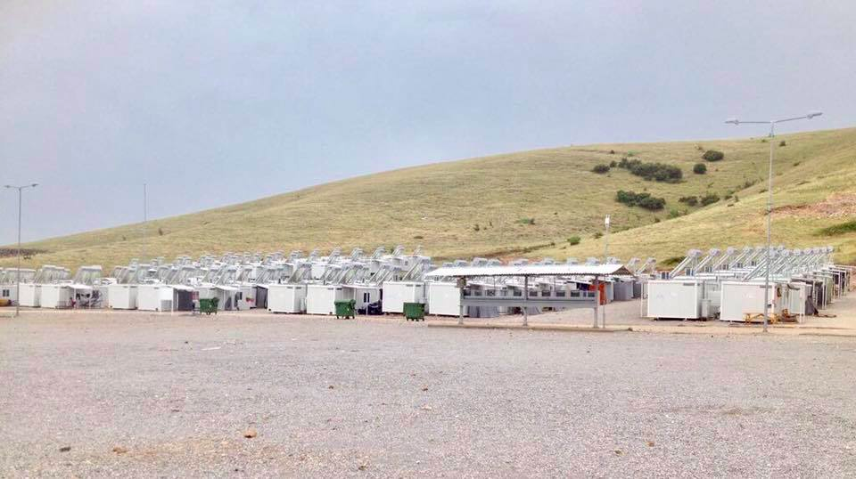

### AYS Daily Digest 11/06/17: Another tragedy in the Mediterranean

_Police violence at Hungarian border / Distributions continue in Calais despite police pressure / Young returnee reportedly killed in Kabul / And more news…_

The capacity on board two ships off the coast of Libyan coast was so insufficient that people were forced to take to life rafts \(Photo by Jugend Rettet\)
### SEA
#### **52 refugees disappear off the Libyan coast**

[_La Stampa_](http://www.lastampa.it/2017/06/10/esteri/nuovo-naufragio-di-migranti-al-largo-della-libia-ci-sarebbero-dispersi-kiTKJSaa5HGZovfVinrYBK/pagina.html) reports that at least 52 refugees disappeared yesterday when a raft making its way to Italy wrecked off the coast of Libya\. Other refugees who were on board the same boat were reported to have been taken away by the Italian Coast Guard\. [Reuters](http://www.reuters.com/article/us-europe-migrants-libya-idUSKBN1920WA) quotes the UNHCR calling on European countries to help Italy cope with an increasing flow of refugees after some 2,500 were rescued over the weekend, while dozens of others were reported missing at sea\. Jugend Rettet says that it was involved in the rescue of 350 people together with Sea\-Watch\. The capacity on two rafts in particular was not at all enough for people on board, forcing some to take to life rafts\. MSF adds that their teams in the Mediterranean are hearing horrific stories of continued torture, rape, and violence in Libya\.
### AFGHANISTAN
#### **Young returnee reportedly killed in Kabul**

[Blankspot](https://www.blankspot.se/utvisad-fran-sverige-uppges-ha-dodats-i-kabul/) says a young Afghan who was deported to Kabul at the end of May is reported to have been killed in a terrorist attack\. According to his brother—who is still in Sweden—the victim was killed when attending a funeral in Kabul after suicide bombers triggered three explosive charges, killing a number of people\.

While Germany suspended deportations to Afghanistan following a recent car bomb attack in Kabul’s diplomatic quarter, Sweden still has not committed to suspending deportations according to [_The Local_](https://www.thelocal.se/20170531/campaigners-urge-sweden-to-stop-deportations-of-afghan-asylum-seekers-kabul-attack) _\._

> “I feel like I’ve fallen from the sky\. I don’t believe I’m here\.” 

An Amnesty International researcher writing for [_Politico_](http://www.politico.eu/article/afghan-deportations-are-death-sentences-vulnerable-refugees-migrants-amnesty-international/) notes that while British and American authorities warn their citizens against traveling to Afghanistan—saying it remains unsafe—Western governments have deemed the country safe enough for Afghan asylum seekers to return\. The researcher says many of the returnees her team spoke to are “extremely vulnerable” and their returns “likely violated international law\.” Many returnees grew up in Iran and have no connection at all with the country they are being brought to\. One refugee for example says, “I feel like I’ve fallen from the sky\. I don’t believe I’m here,” adding that he does not have funds to live alone and nor the option to live with relatives\.
### SYRIA
#### **20,000 civilians displaced from Dara’a**

20,000 civilians have been displaced, 65 killed, and hundreds wounded during an offensive launched by regime forces and backed by Russia and Iran, according to journalist Rami Jarrah\. Yesterday, the town of Dara’a witnessed 86 barrel bombs, 19 air strikes, and 90 surface\-to\-surface missiles on civilian\-populated areas\.

Meanwhile, the World Health Organization says a polio outbreak has been confirmed in Deir ez\-Zor\. There were two vaccination campaigns in March and April this year but only limited coverage was possible, since access is compromised by ongoing security problems\.
### GREECE
#### Arrivals on Lesvos

One boat with eight people arrived in the north of Lesvos this morning while another one with ten people arrived this afternoon\.
#### UNHCR looking for housing sites on Chios

[DW](http://www.dw.com/en/greeces-hotel-owners-want-tourists-not-refugees/a-39176253) reports that the UNHCR is looking for at least another 60 housing sites on Chios as more than 800 refugees have reached the island since the start of the year—double the number recorded in 2016\. Hoteliers, however, say they are wary of renting rooms to refugees as they try to bring back tourists for the upcoming summer season\.
#### Situation in Lavrio

Volunteers report on the situation in the Sounio \(Lavrio\) camp, where one of the main issues seems to be transportation\. As it stands now, every purchase that those staying in the camp make involves a 45 minutes walk into town\. Organisation Earth also raised the ongoing issue of transportation at the Sounio camp during a recent meeting held by NGOs working in the region\.

Housing consists of wooden trailers with no air conditioning and the camp is in need of many non\-food items, as well as snake deterrent to surround the facilities\.
#### Shade structures for Koutsochero

Given the rising temperatures, Timber Project will start building shade structures at the Koutsochero camp near Larissa, including a community space and a shaded area around the children’s library\.

The Timber Project
### SERBIA
#### Refugees violently brought from Obrenovac to Presevo

Conditions in Presevo

Refugees were transported from Obrenovac to Presevo yesterday\. Police came at 5am and told a group of people they had to leave, without giving any explanation and any indication of a clear selection process\. Approximately 150 people were taken and violently pushed onto buses\. Some were taken to a detention centre\. In Presevo, people were interviewed by people from immigration services and then accommodated in big tents\. Some people complained that they got separated from their family members who stayed in Obrenovac but AYS does not yet have the means to confirm this with an independent source\.
### HUNGARY
#### Police violence at the border

Volunteers from Subotica sent us the pictures below, mentioning that people are once again trying to cross into Hungary\. On Thursday and Friday, two groups—one of 20 people and the other with 15 to 17 members—were stopped by the police and badly beaten\. The first group was pepper sprayed repeatedly\. All of those involved were pushed back into Serbia\.

### FRANCE
#### Distributions continue despite police pressure

[Europe 1](http://www.europe1.fr/societe/a-calais-des-habitants-empechent-la-distribution-de-repas-aux-migrants-3354482) reports that Calais residents have started to act as their own police force and prevented the distribution of food last Monday, arguing that “food distribution is forbidden\.” Food distribution is only allowed for two hours per day at one site while refugees say they are routinely being chased and face constant pressure from authorities\.

Despite this week’s intimidation, Help Refugees say they are continuing distribution in Calais, providing essential items such as sleeping bags, clothing, and hygiene items to the estimated 400–600 refugees currently residing in the area\.

The Refugee Community Kitchen meanwhile is producing over 2,000 portions of food every day during lunch, dinner, and even through the night for those observing Ramadan\.

Photo by Help Refugees
#### Scabies in Paris

While scabies has always been a problem in Paris, MSF seems concerned about a recent outbreak of the disease near the La Chapelle refugee centre, according to [_20 minutes_](http://www.20minutes.fr/societe/2083823-20170611-paris-propagation-gale-camp-migrants-chapelle-inquiete-ong) \. MSF’s mobile clinic has detected 164 cases of scabies since the end of December, with numbers increasing over the last couple of months\. Doctor Goudjo says it is impossible to treat this illness while people sleep in the streets, adding that the only thing to do is to double their medication and ask them to take it every eight days\.

Yesterday, refugees protested in Paris, denouncing police harassment and the lack of dignified living conditions\.

Photo by Solidarité migrants Wilson

> **_We strive to echo correct news from the ground through collaboration and fairness, so let us know if something you read here is not right\._** 

> **_If there is anything you want to share — contact us on Facebook or write to: areyousyrious@gmail\.com\._** 

_Converted [Medium Post](https://areyousyrious.medium.com/ays-daily-digest-10-06-2017-another-tragedy-in-the-mediterranean-e82eebcd639b) by [ZMediumToMarkdown](https://github.com/ZhgChgLi/ZMediumToMarkdown)._
