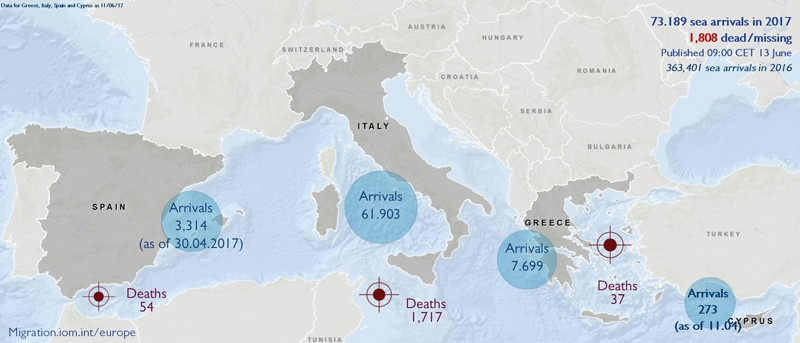
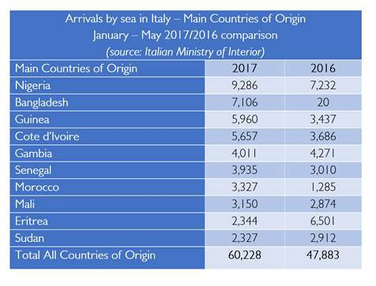
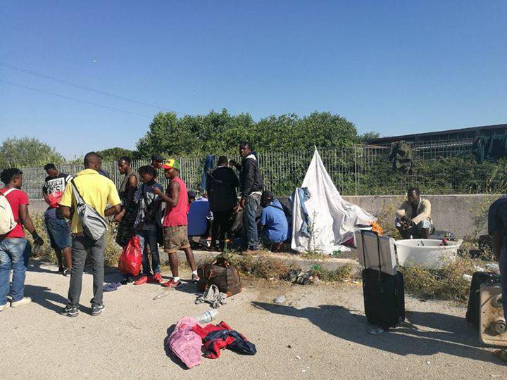
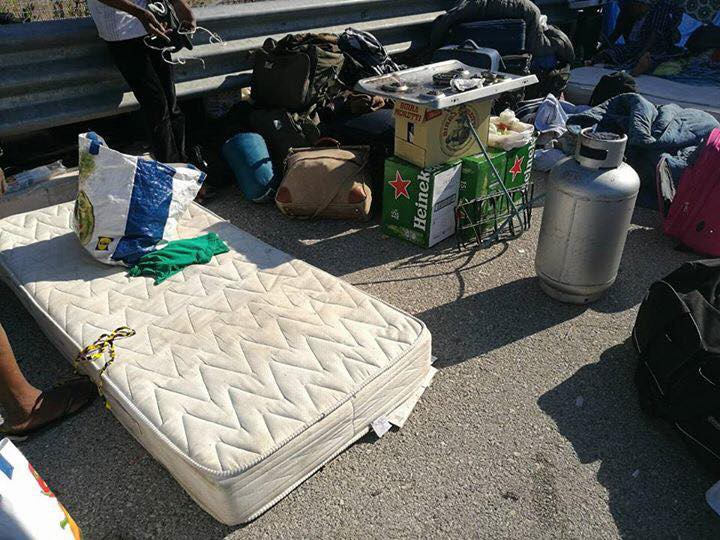
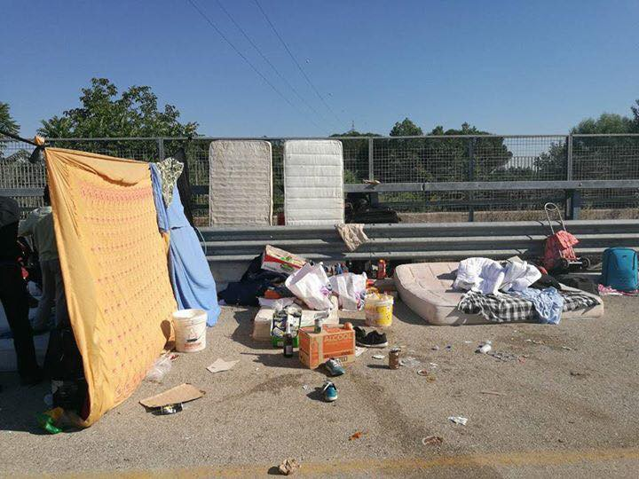
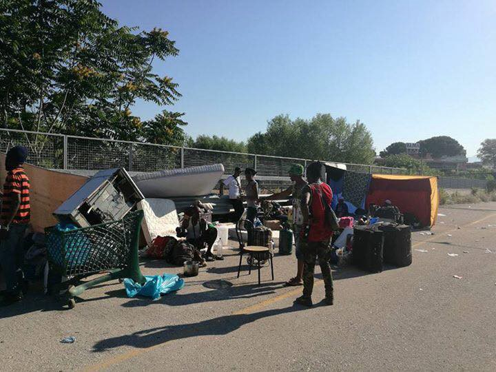

### AYS Daily Digest 13/06/17: Shocking treatment of people in Hungary’s transit zones

_Hungary continues abuse in its “transit zones” / Syrian doctors to be employed in Syrian refugee camps in Turkey / Police violence and mistreatment continue along the Serbian\-Croatian border / Volunteers urge the French state to assume responsibility in accommodating refugees / And more news…_

 \)](assets/e5359c2cbaa6/1*ff6Driy1GCxwCXTDiEHK_w.jpeg)

Photo by Haider Ali \(Source and and copyright belong to [Index\.hu](http://index.hu/belfold/2017/06/12/tranzitzona_roszke_tompa_borton_menekultek_terhes_no_hatosagi_tulkapas_gyerekek/) \)
#### FEATURE—Mistreatment continues in Hungary’s transit zones

“The transit zone operates as a no man’s land, as if the laws of the Hungarian state would not be entirely valid in that area,” Hungarian [media](http://index.hu/belfold/2017/06/12/tranzitzona_roszke_tompa_borton_menekultek_terhes_no_hatosagi_tulkapas_gyerekek/) say of the infamous border area holding refugees as prisoners\.

Until now nobody knew what was going on behind these bars and fences, as public access to the area is very much restricted\. A family that managed to escape from one of the “transit zones” and return back to Serbia reports of their poor treatment and the prison\-like conditions in which they and other refugees are housed\.

The family reportedly spent their time in a small area \(10m x 10m\) of the five blocks that made up the camp, all separated with tall fences and barbed wire\. Parents cried when their children could not see them\. Families with children were given no more than two diapers a day and have been deprived of fruits and vitamins\. Children are at a constant risk of malnourishment due to a lack of food, and even pregnant women were—until recently—brought to the on\-site doctors in handcuffs\.

Hungarian volunteers who spoke to us simply said, “at least they no longer handcuff pregnant women”\.

Unlike the police officers’ containers that have air conditioning among other luxuries, the containers meant to house refugees— each having two families living inside — heat up terribly under the sun, making it extremely difficult to live either inside or outside of them\.

> 4 spoons of baby food per day… 

In spite of the obvious need for more food, the families AYS spoke to did not manage to get their point across to the transit zone authorities\. Ultimately, after one child kept crying all night long, a family was given two extra spoons of baby food and told not to ask for anything until at least noon the next day\.

Several officers felt the need to escort a person to a doctor’s appointment—about 20 metres away—where no real help was given, only first aid\.

The police’s questioning was severe, lasting about 4 hours, during which no food, water, or toilet was made available to the refugees being questioned\. Documents that supported the refugees’ reasons for fleeing were not at all considered by the authorities, nor were there any lawyers present during the questioning\.

With the asylum process taking up to one year, authorities can virtually hold these people captive indefinitely in the horrific prison known to them and to the outside world as the “transit zone\.” It remains to be seen how much longer children will continue to be held behind bars in the heart of Europe and how much longer the rest of the European Union will turn a blind eye to such blatant disrespect and disregard for human rights\.
### AFGHANISTAN
#### The “safe” country’s most recent displacement statistics

126,594 individuals left their homes due to ongoing conflict in the region from January 1st, 2017 to June 4th, 2017 alone\. 29 out of 34 provinces have recorded some measure of forced displacement\.

Inadequate shelter, food insecurity, insufficient access to sanitation and health facilities, all combined with a lack of protection often result in precarious living conditions that jeopardizes the people’s well\-being and dignity, a June 11th [UN report](https://www.humanitarianresponse.info/en/operations/afghanistan/infographic/coonflict-induced-idp-displacement-and-response-18-september-2016) states\.

58% percent of those internally displaced are children\.

See the entire infographic with the most current information made available [here](http://reliefweb.int/sites/reliefweb.int/files/resources/afg_idp_situation_response_dashboard_20170611.pdf) \.
### IRAQ
#### Food poisoning in a refugee camp

The Iraqi Ministry of Health said a woman and a younger girl died while at least 300 people remain in critical condition from food poisoning at the Khazir camp, caused by something in the iftar meal served to them, although local media put the death toll at one\. Khazir camp—a refugee camp near Mosul—is home to thousands of internally displaced people who have fled their homes in Mosul since the launch of a military offensive to dislodge Daesh from the city\. Hundreds more affected by the poisoning are still currently being treated, [according to The New Arab](https://www.alaraby.co.uk/english/news/2017/6/13/child-dies-of-food-poisoning-at-mosul-refugee-camp?utm_campaign=sf&utm_source=facebook.com&utm_medium=referral) \.
### SEA
#### Sea crossings in 2017

A total of 73,189 migrants and refugees have entered Europe by sea since the start of the year through June 11th, with almost 85 per cent arriving in Italy\. The remainder landed primarily in Greece, Cyprus, and Spain, according to [reports](http://www.iom.int/news/mediterranean-migrant-arrivals-reach-73189-2017-1808-deaths) \.

Source: IOM

The largest number of people originate from Nigeria \(9,286 men, women and children\), with refugees from Bangladesh \(7,106\) in a close second place\. Also among those traversing the sea in large numbers were refugees from Guinea \(5,960\), Cote d’Ivoire \(5,657\), the Gambia \(4,011\), Senegal \(3,935\), Morocco \(3,327\), Mali \(3,150\), Eritrea \(2,344\), and Sudan \(2,327\) \.

[The Missing Migrants Project reports](http://www.iom.int/news/mediterranean-migrant-arrivals-reach-73189-2017-1808-deaths) that there have been 2,524 migrant fatalities recorded since the start of the year\. Most of these deaths took place in the Mediterranean region—over 70 per cent of the total worldwide\.
### TURKEY
#### Syrian doctors and medical personnel to be employed at health centers for Syrian refugees

“Syrian doctors and health care staff will be working in \[the new\] centres\. 
We have seen that they have had good training in general,” Turkey’s Health Minister said during a recent meeting on the topic of health services in Istanbul\.

He also said that a new system which would [allow Syrian doctors to serve Syrian refugees in Turkey](https://www.dailysabah.com/turkey/2017/06/13/turkey-to-hire-syrian-doctors-at-refugee-health-centers) is being developed\. There are 27 health centres for refugees in Turkey and work is being done to improve them\.
#### Education in emergencies funds for refugee schooling

Cash transfers are now available to families whose children attend classes regularly as part of a [program to help 230,000 refugees and their families access education](http://theirworld.org/news/turkey-refugee-families-get-payments-to-help-children-into-school) in the country\.

Turkey has more than 2\.9 million Syrian refugees, 1\.3 million of which are children\. Almost 500,000 refugee children are in state schools and temporary education centres, but another 370,000 are not receiving any formal education at all\.

The families of 56,000 children have already started to receive money from the European Union’s biggest humanitarian program yet tailored to providing education in the case of emergencies\. The cash transfers are given every two months to refugee families whose children regularly attend school\.
### GREECE
#### Recent arrivals to Greece

According to locals involved in helping refugees in the Greek islands, two boats were picked up in the early hours this morning by the Greek Coast Guard\. One boat was found off the southeast coast of Lesvos with 57 people on board, while the second boat was found off the north coast with 47 people on board: 7 children, 11 women and 29 men\.

A total of 457 arrivals have been officially registered in Greece during the month of June so far, making for a total of 7,731 people who arrived there since the beginning of the year\. Detailed estimations and statistics as of June 11th can be found [here](http://reliefweb.int/sites/reliefweb.int/files/resources/57484.pdf) \.
#### “Nothing is more destabilizing than uncertainty”

“Refugee children at the Souda refugee camp on Chios are toxically stressed,” a psychotherapist from a non\-profit organization that promotes mental health for women around the world testified at the Concordia Europe Summit\. It is already unsettling enough that these children suffer from psychosis\. Not knowing how long will they or their families will stay—nor whether or not they will be sent back to Turkey—is dangerously unsettling and only adds to their distress, [she said](http://greece.greekreporter.com/2017/06/09/nitzia-logothetis-refugee-children-toxically-stressed-in-greece/) \.

 have been providing refugees in the north of Greece constant support and informal educational activities since the organization’s launch a year ago\. They now continue supporting both adults and children in urban areas where they have been resettled through a number of programs operating out of their two culture centres\. OCC has most recently started new outdoor activities in Polykastro \(Photo by [Open Cultural Center — OCC](https://www.facebook.com/OpenCulturalCenter/) \)](assets/e5359c2cbaa6/1*MMppozKYeYfSmofN07lw_A.jpeg)

Volunteers at [Open Cultural Center — OCC](https://www.facebook.com/OpenCulturalCenter/) have been providing refugees in the north of Greece constant support and informal educational activities since the organization’s launch a year ago\. They now continue supporting both adults and children in urban areas where they have been resettled through a number of programs operating out of their two culture centres\. OCC has most recently started new outdoor activities in Polykastro \(Photo by [Open Cultural Center — OCC](https://www.facebook.com/OpenCulturalCenter/) \)
### BOSNIA AND HERZEGOVINA

87 [demands for asylum](https://www.klix.ba/vijesti/bih/azil-u-bih-ove-godine-zatrazilo-97-osoba-medju-njima-i-drzavljani-filipina-irana-i-sri-lanke/170611060) made on behalf of 97 individuals have been claimed in Bosnia and Herzegovina this year alone\. Up to the time this was written, 38 asylum requests involving 42 people in total were terminated on the grounds that the people in question had left the asylum seeker centres while their requests were under consideration\.
### SERBIA

Refugee centres in Serbia are still chronically overcrowded, as people continue to seek temporary, emergency shelter in rubb halls or tents\.

Frustration among refugees regarding long waiting times at the centres as well as the management \(often, a trade involving swapping places\) of the so\-called “waiting lists” for admission to Hungary still remains\.

In its [latest report](https://data2.unhcr.org/en/documents/details/57497) , the UNHCR mentions that it’s “grateful to the governments of Sweden and Australia for having accepted refugees from Serbia for resettlement, thus allowing five refugees to depart to Sweden and two to Australia\.”

Although orderly, legal pathways for refugees to access effective protection should definitely be made available everywhere and—in the given circumstances—should be expedited, the recent news of the few people who were relocated comes to us as a pleasant surprise and we hope to learn more about the new relocation process’ implementation\.
#### Another bad experience with the Serbian police

This most recent story to reach AYS dates from today, June 13th:

> 200 metres behind the distribution spot where groups distribute aid, in the woods, the group of six \[refugees\] were at their campsite\. Four police arrived, three in uniform and one in plain clothes\. \[The police\] told everyone to stand up and the group \[was\] handcuffed together in pairs\. In a line they were taken to the main distribution spot where a police van was waiting to escort them to the police station\. One man slipped free from his handcuffed partner and ran\. The police punched the remaining man in the head three times, asking why the man had run and \[demanding\] that he must get him back\. The remaining five people were escorted to the police station\. Upon arrival, all the men’s fingerprints were taken and then they were sent individually to the judge — a service which incurs a fee of 50 Euro each person\. One man explained to the judge that he was in Šid camp, which closed\. He was then transferred to Adaševci and, due to his absence from the camp because of a game, his card was almost taken from him by the commissariat\. He was forced to leave and live in the jungle area with friends\. The judge said he should go to another camp; the man said this was not possible\. After \[appearing in front of\] the judge, each man was returned to the police for a search\. They found considerable amounts of money \(500, 200, 80 and 50 Euro\) \. The police confiscated the money and then claimed that the money was never in their possession\. There is no record that the police took the money, only a record for the expenses of the judge\. One man from the group of five had no extra money and is being held in custody for an estimated 10–15 days\. The other four were released and later came across the same police officers who had arrested and detained them\. One man from the group accused the police of stealing his money and the policeman replied that if he sees him in Sid he will be arrested again\. On the police report given to each man there is no mention of extra money confiscation nor that the men possessed any camp documents, but in fact all the men in this incident had documents with them at the time as they were previously residents of either Šid or Adaševci camp\. 

### CROATIA
#### New accounts of police brutality

Recent reports have highlighted new accounts of violence committed by the Croatian police forces, including detailed descriptions of the locations, the men involved and exact time frame of the happenings\.
AYS will make further legal steps demanding justice, fair treatment and respect of the human dignity of each person that steps on the Croatian soil\. 
We hope the institutions in charge will do their job, as with the previous charges that we raised against the members of the Croatian police\.
Our team is confused by the apparent lack of information of the highest ranking police officials and disappointed by the lack of their engagement in investigating the claims that, apart from us and the CMS, a number of foreign organizations present on the ground and countless refugee individuals have stated\. According to the UNHCR, they have received reports of 78 collective expulsions from Croatia, with many alleging to have been denied access to asylum procedures in Croatia\.

> They spent about ten minutes on each man and boy, beating us and hurting us so badly, even the kids\. They used me like a football\. Fists, booted feet, all over my body\. They hit my face with a police baton and I couldn’t see in my eye\. They beat everyone like this\. After each man had been beaten they made us run away back to the jungle\. 

> About 4\.30 am I found some of my friends\. We went to the hospital\. \. I was very worried about my eye and in lots of pain but they wouldn’t help or give me any medicine at all\. It still hurts now\. — _from the statement by a young Afghan who got badly beaten in Croatia 2 weeks ago_ 

### HUNGARY

> _I wanted to go to Hungary, but I was stopped by the border police\. Dogs attacked me and bit into my wrist\._ 

■■■■■■■■■■■■■■ 
> **[Ärzte ohne Grenzen](https://twitter.com/MSF_austria) @ Twitter Says:** 

> > „Ich wollte nach #Ungarn, aber wir wurden von der Grenzpolizei aufgehalten. Hunde haben mich angegriffen &amp; in mein Handgelenk gebissen." https://t.co/pBgdDXW1av 

> **Tweeted at [2017-06-13 09:17:50](https://twitter.com/msf_austria/status/874556408808833024).** 

■■■■■■■■■■■■■■ 

#### Hungary targets its NGOs

Hungary’s parliament passed the ruling party’s new and controversial piece of legislation regarding NGOs on Tuesday\.

The new law forces civil society groups that receive foreign funding to register separately from normal processes, risking closure if they refuse in addition to being labelled “foreign\-funded” in every public appearance\.

The government’s latest move has been met with criticism by NGOs and civil society in Hungary\.
### AUSTRIA
#### Faux pas in the legal procedure might bring back a returned refugee to Austria

The case of an Afghan refugee who was deported from Austria to Kabul is circling through [social media](https://www.facebook.com/edith.meinhart/posts/10154659864186623?hc_location=ufi) \. After two courts rejected his application for aslum—and after his deportation—Austria’s highest court decided that the deportation was not legal, since there were some errors in the the procedure\. The refugee was not formally interviewed nor heard by any judge\. In the meantime, the man at question has again fled Afghanistan—this time to Iran—and now a decision is expected to be made if the Austrian government is obliged to organize his return to Austria or not\.

Vienna Law Clinics has published a website with a multilingual FAQ section on the asylum procedure in Austria\. It can be accessed [here](http://www.asyl-faq.at/) \.
### BELGIUM
#### Political asylum provided to a person holding asylum status in Greece

In the [first case of its kind](https://youtu.be/FpSNBDaJRPw) , an African refugee has been granted asylum by Belgium despite already having asylum status in Greece\.

Mamadou Ba—who is from Guinea—had been targeted by the far\-right group Golden Dawn\. He was first physically attacked, followed by a persistent campaign of harassment\.

> “Once during a routine check of my passport the police handcuffed me and took me to a station\. I spent four hours there\. They stripped me, took pictures of me, filmed me…\. After all that had happened they asked me one question\. ‘Would I speak to the media again?’” — _Mamadou Ba_ 

“The Belgian decision does not explain whether Greece is just unable to protect him from Golden Dawn, or whether Greek authorities should be considered to be as responsible as Golden Dawn,” the man’s lawyer said\.
### ITALY

IOM’s most recent information chart
#### Pordenone

Locals have recently called the police, reporting refugees who are sleeping in the parks\. For refugees on the other hand, there is nowhere else to go while they await a response to enter the arrival hub\.

23 of them were checked and sent away as the anti\-bivouac decree stipulates\. About 50 people were woken up disoriented, tired, and confused and interrogated once again in the middle of the night, with nowhere else to go while waiting to enter a reception centre\.
#### Another death in Ventimiglia

A 16 years old boy from Sudan drowned while trying to catch a shoe he lost on the riverside\. [Intersos](https://www.facebook.com/Intersos.org/posts/1706386472735136?hc_location=ufi) denounces the fact that 250 people are living at the border with France with no services or assistance from the State which is turning its eyes away from this emergency\. One third of the migrants is underage\.
### Rome

Mayor Raggi [wrote a letter](https://l.facebook.com/l.php?u=http%3A%2F%2Fwww.ansa.it%2Flazio%2Fnotizie%2F2017%2F06%2F13%2Fraggi-a-prefetto-roma-limitare-presenza-migranti_47fc872b-db5e-4ca2-9ce2-24359fd37958.html&h=ATNpGFwIdjo8mqtTjGFfZTvg_0ct6dyyJpOfomOTieHEmgNz32eXCyXK59HRp4FVd1h0-9xOjTiR12cdjfN12E2aembkcllowUMWYYgU3YsIY_pJSq2JmM17Bjtm8WqJ3FHFza7C) to the Prefect and says that given the continuos flow of migrants in the city, it is impossible and dangerous \( \! \) to find other accommodation and reception centres for them\. She suggests a moratorium on the number of new arrivals of migrants in town\.

Via Vannina on Tuesday morning, photo by Rome volunteers

#### FRANCE
### _‘If the State doesn’t react, the people might start dying of hunger on the streets ‘_

Despite letters written to the president, the premier minister and the mayor of Paris, the authorities ignore the fact that there is an urgency to create a better scheme and organization in order to provide help to the people who might be arriving in larger numbers, volunteer organizations claim\.
Solidarité migrants Wilson claim they urgently need better public support this summer, considering the number of refugees living on the streets on the rise and volunteers are expected to be smaller numbers\. 
A month ago, the Camp at la Chapelle was evacuated\. Today, Solidarité migrants Wilson are again distributing 200 meals per day, sometimes even 500 to 700\. Their experience shows that with warmer temperatures these numbers are going to increase\. The group demands that the officials provide structures for human reception, the abolishment of the Dublin procedure, since it’s in fact deprives people of the asylum right there, as well as a better protection of minors\.
People would have died on the streets in winter if volunteers hadn’t helped\. With estimated costs of 20\.000 Euro per month, the volunteers pay their own costs of helping, therefore filling the gaps the State ignores\. In the past 15 days, about 1000 new arrivals have been counted\. They are exhausted, and some will part to well deserved vacations soon, so they are asking for public support from the city of Paris, because otherwise [people might die on the streets soon](https://www.streetpress.com/sujet/1497281423-si-l-etat-ne-reagit-pas-des-gens-vont-mourir-de-faim-paris) \.
### Paris

Notice: There is no MSF Mobile clinic this week because it is in Calais\.

Needed: **instant coffee, cups & printing paper in bulk** 
The [Solidarithé](https://www.facebook.com/solidarithe/) team of volunteers needs donations of these items in order to keep working on the ground, so help if you can\.
#### GERMANY

An internal audit at the Germany authority for migration and refugees \(BAMF\) [found](http://www.zeit.de/politik/deutschland/2017-06/bamf-ausbildungsquote-qualifikation-entscheider) , that the average training status of asylum case workers is only 21\.6% \(they’ve done only 21% of their training curriculum that they are supposed to have\) \. The BAMF has implemented a new training program, but this will start only in September\. With the large numbers of refugees in 2015, the BAMF has hired thousands of new employees to speed up the asylum process, separating interview and from decision \(the deciding case worker was not part of the interview\) \. The processing time was not shorted through this measure, it has increased from 1\.6 months to 1\.9 months during the last year\. The quality of the decisions has been criticized a lot by ProAsyl and other NGOs\.
#### EU

> The European Commission [announced](https://euobserver.com/tickers/138213) on Tuesday that it would launch infringement procedures against the Czech Republic, Hungary and Poland over their refusal to take in asylum seekers\. The three EU states have opposed a legally\-binding scheme to relocate people from Italy and Greece\. 

> EU migration commissioner Dimitris Avramopoulos said “relocation is a legal obligation, not a choice\.” 

Slovakia is the only one of the [Višegrad group](http://www.politico.eu/article/brussels-takes-on-most-of-the-visegrad-group-over-refugees/) of countries that won’t face sanctions at this point, since they are the only one of them that has been taking in people in the last 12 months\.

> **_We strive to echo correct news from the ground through collaboration and fairness, so let us know if something you read here is not right\._** 

> **_If there’s anything you want to share, contact us on Facebook or write to: areyousyrious@gmail\.com_** 

_Converted [Medium Post](https://areyousyrious.medium.com/ays-daily-digest-13-06-17-shocking-treatment-of-people-in-the-hungarian-tranzit-zone-e5359c2cbaa6) by [ZMediumToMarkdown](https://github.com/ZhgChgLi/ZMediumToMarkdown)._
