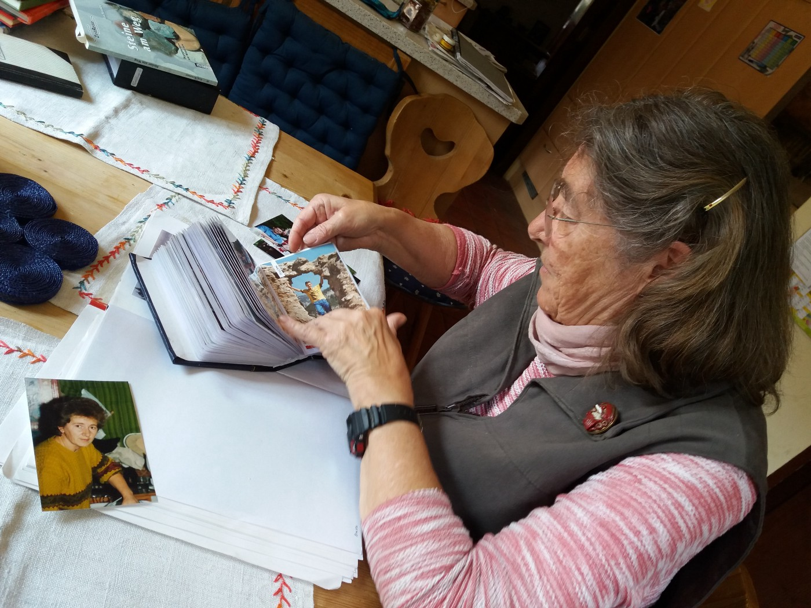
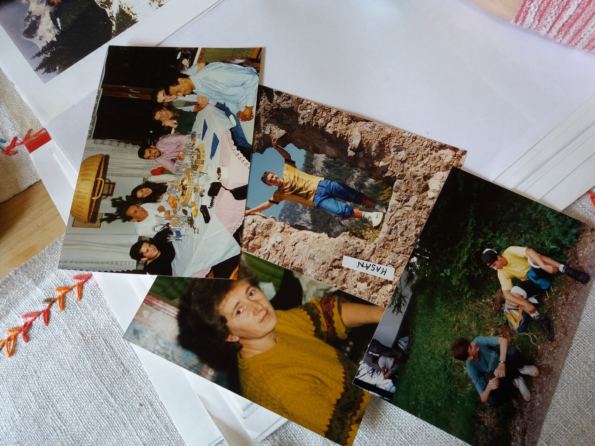
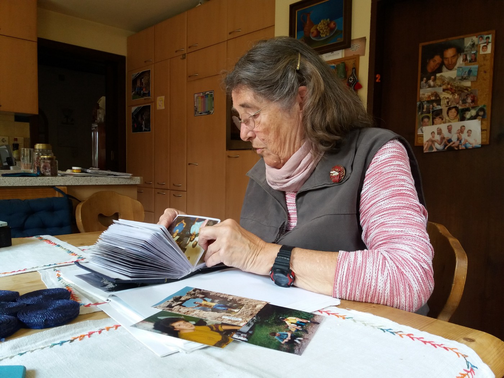
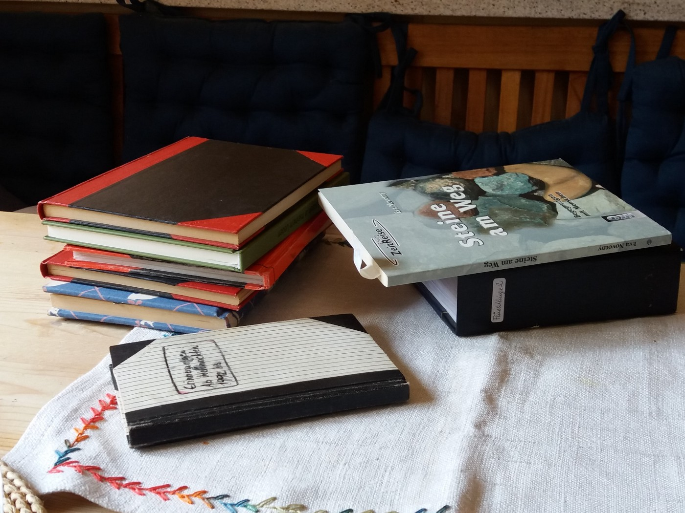
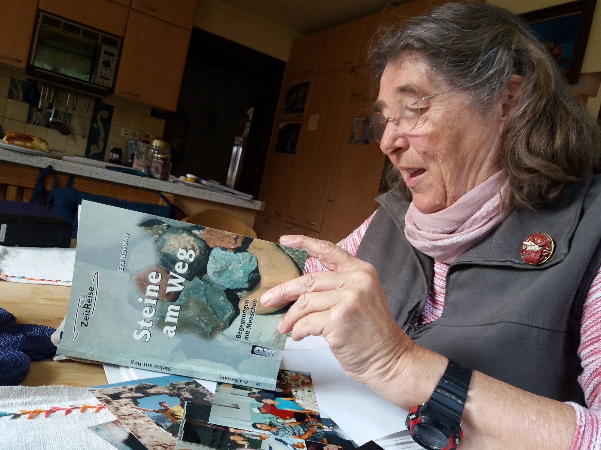

### AYS SPECIAL: The borders we have to open are those in our hearts

_Dozens of refugees and migrants from all over the world know Eva Novotny from small village of Gablitz in Austria\. She and her family have been offering help to people on their journeys for over 20 years\. And for all that time they are facing the same problems — prejudice\. Her fight is a lesson for all of us_

_Eva Novotny with photo books full of memories\. Photo AYS_

In a small Austrian village Gablitz, less than hour away from Vienna, live about 100 refugees\. Mostly young boys from Afghanistan, but also several families and people from other countries like Syria\. Groups of locals are taking care of them\. They have organized a language course for refugees; help them find accommodation; help them to learn about the life in Austria: take them for a shopping or hiking trip: help them with lawyers… Most importantly, some people in this village opened their homes and hearts, offering a lesson about humanity to all of us\.

Eva Novotny, a former teacher, is one of the people who keep their doors open for anybody in need\. These days, she is teaching the German language to a group of young Afghans\. We visited one of the classes that is being held in the local church\. Two young men from Afghanistan and Eva were chatting in German about the history, world politics and life in general\. After the class, one of the students went to Eva’s house\. “He likes to cook for himself and we have an extra kitchen in the house,” Eva explains like that is something completely normal, not leaving even a bit of space for additional questions\.

In her house it is perfectly normal to meet people from anywhere\. They came to relax, cook, some of them used to come and have shower, or they came when they just needed a friend , being sure that they will find somebody here\. The doors are always open, it seems\. And they have been for over twenty years…

The first refugees were from Bosnia, over 20 years ago\. Photo AYS\.

**First encounters**

Eva remembers her first encounters with refugees, 22 years ago\. “My first was Samir\. He came from Bosnia in July 1992 together with 60 persons\. They had nothing\. The plan was that they will stay in the sport hall in the local school, but some mothers of small children demonstrated saying they do not want refugees near their children\. Then, the monastery opened the door for them\. But nobody took responsibility\. It was a period of the year when holidays were starting, and most of the people went away from Gablitz\. Sisters in the monastery were all very old and they could not manage it by themselves\. So, I heard that they have some people and need help,” Eva rememebrs\.

When she went there for the first time, she found only 20 people, standing in the front of her, speechless, like stones\. “We could not communicate and it was very difficult\. Later on, more people came and I brought materials for children and young to draw, paint, just to create something together\. I also had some wool and similar stuff for elderly people\. But, that place was not good for any activities\. People were just sitting at the floor and having no space for anything\. So, I decided to invite all of the young people to come to my place\. And, they started coming,” Eva talks with a smile on her face, remembering good times and new friends\.

Still, at the same time, Eva remembers these first encounters as very painful for everybody, with lot of misunderstandings and unknown, even though people who were coming back than were just from the nearby country, Europeans\. But, they were going though the horrible war, deeply traumatized and in need for everything, something hardly anybody in Gablitz could understand\.

Eva, with experience as school teacher, had an idea\. Create something together, and then try to sell that, again together, at the local market\. It would not only bring some money to refugees, but also help them to meet people from the community and to introduce themselves\. At the end, they made some small money, not enough for anything, but enough to keep them busy and to start the conversation\. At least, that was what Eva and Bosnia were hoping for\. But, it did not work\. However, they kept on together…

Solidarity in practice\. Photo AYS\.

With the time, more people came to the village\. Some to reunite with their families, some just in quest for refuge from the war and killings\. After a while, around 100 people were in the monastery, sleeping on the military beds and depending on the food given by nuns\.

**Borders between people**

As September approached, Eva was determent to enroll children in the school\. Three of them Eva took to the school she worked in, and used to drive them every day with her to work\. At the same time, she and other people in the village — not many of them — were trying to find jobs for other people, but it was very hard\.

“I was connected with the church, and I asked everybody to help\. But, the result was that people started disliking me\. I felt a border being raised between people and me\. They were telling me that refugees should go, that there is no place for them in the village, that they do not want problems with them…” Eva remembers saying that the situation is not much different today\. “At that moment, I felt like I do not have friends here\. Only one lady in the parish was very engaged, but most of the others did not want to have anything with refugees\. And they had to stay in that church for over two years, I think\. And all that time people did not accept them\.”

She remembers how Bosnians tried to break down those borders\. “They were cooking and brining food to the people in the village trying to make friends in that way,” Eva remembers\. At the end, what helped was the moment when the entire village had to renovate its sewage system\. Somebody had to work around every house\. And Bosnians became the popular working force\. “Suddenly everybody was calling me to ask if I have a Bosnian to work for them,” Eva says\. “That was a good moment because everybody got a job\. They even called their friends or family to work here\.”

**Behind the closed doors of ignorance**

Nevertheless, in all other aspects of life nothing changed\. Eva remembers children in the local school who completely ignored refugees in their classes\. “They were not given books, they were not taken to excursions, and I try to spend all my free time in school with them\. But also outside of the school\. I took them with me everywhere\. But, after the first school year, the director of the school told me they will not keep this children longer and that they should stop going to school and instead of that find jobs\. But, they were only kids\. I could not believe what he was saying to me\. I knew these children\. Some of them were eager to learn\. And, I decided to find them better school, friendlier\.”

She made it and took them to the other school, in the nearby town, where they were much better accepted\. One of them at the end was the best student in that school\. But, it was not enough\. “He wanted to become nurse\. And, he applied to the school\. But, they rejected him saying that his German is not good enough\. I told them that it is not possible since he was one of the best students in the language classes\. At the end they told me that they do not want foreigners\.”

The second wave of refugees came to the village with the war in Kosovo, 1999\. Again, people came and stayed in the church\. But, the rule was that they can only sleep there, and leave in the morning and come back in the evening\. Nothing to do during a day\. Eva took them in her house, again\. “I remember that we used to bring people to our house, to have shower or what they need\. Then I met this Kosovo boy who was crying all the time and whose mother was sick and needed money for surgery\. And, me and my family decided to use our Christmas money to help them\.”

She remember that for Kosovo refugees it was even harder than for Bosnians, and almost impossible to find any type of job\.

Since 1992, many people came to Eva’s life\. Some she met in her village some in Vienna\. She keeps close contacts with almost all of them\. She has dozen of photo albums with their pictures, and remembers almost all of their stories, names and countries where they are coming from\. Bosnia, Kosovo, Afghanistan, Iran, Kongo, Somalia, Chechnya, Mongolia, Palestine… are just some of the countries people came from to Eva’s life\. Some have disappointed her, but most of them made her life better\.

All this time Eva is keeping diaries, and she even published three books based on her encounters with friend from all around the world\. Photo AYS\.

**Lessons not learned**

Eva reflects on years of experience as volunteer with refugees and migrants and, with regret, says that not much haschanged in the attitude of people towards those who are coming\. “I do not think anything is different now from the times when Bosnians were coming to Europe\. When they were here, there were many families and they tried to give a lot back to the community\. But they were adapting easy and finding their ways in this society,” she says adding that today in her village, there is a little bit more people who are ready to engage, but “there could be much more, and it would be easier for everybody”\.

At the end, we ask her why is she volunteering with refugees and migrants all this years\. “Because I want to show to the people that they, those who are coming to our country, are people like us\. I do not see many differences\. They need warm surroundings\. If my children are in foreign countries, I would like that they are in contact with people who will welcome them\.”

Eva talks while holding dozen of photo albums in the front of us, and occasionally glances and remembers something about people who she met and welcomed in her house over the years\.

Over 20 years of volunteering gave Eva and her family many new friends, but they also lost some old once\. “I felt that my volunteerism affected my relationship with some of my old friends\. I lost a lot of them because I had too much contacts with foreigners\. But, at the same time, I gained new friends who do not see problem in this\.”

Eva’s story about the world today\. Photo AYS\.

Eva’s story is teaching us about the closed borders, those in our hearts and minds, that are sometimes stronger than the walls and fences governments are constructing\. While we could easily demolish the physical ones, those people set up themselves can do the same amount of, or even greater, harm\.

Opening the borders made Eva’s life richer and full of friends\. Gablitz became a better place because of Eva and others who are fighting against the closed borders in their way, those in our heads and those physical ones\. With more people like Eva, the world we are living in can become a better place\. Solidarity is way of living\.

**_We strive to echo correct news from the ground, through collaboration and fairness, so let us know if something you read here is not right\. Anything you want to share — contact us on Facebook or write to:areyousyrious@gmail\.com_**

_Converted [Medium Post](https://medium.com/are-you-syrious/ays-special-the-borders-we-have-to-open-are-those-in-our-hearts-165fdaef5d31) by [ZMediumToMarkdown](https://github.com/ZhgChgLi/ZMediumToMarkdown)._
