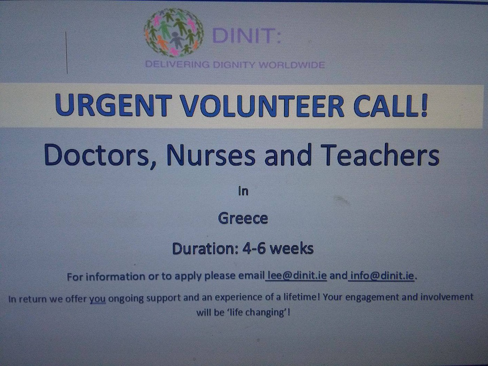
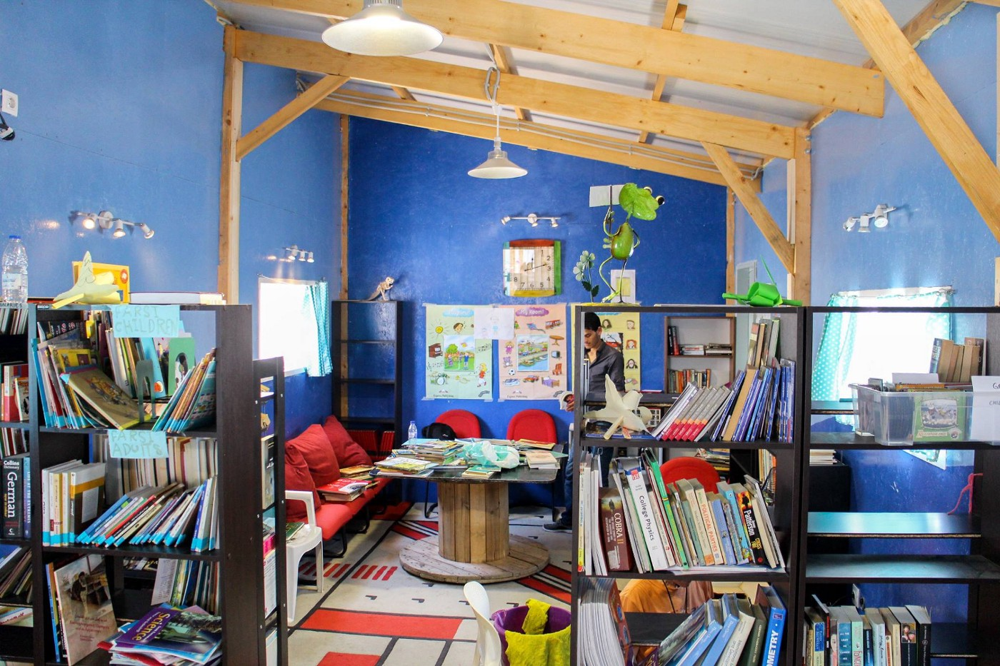
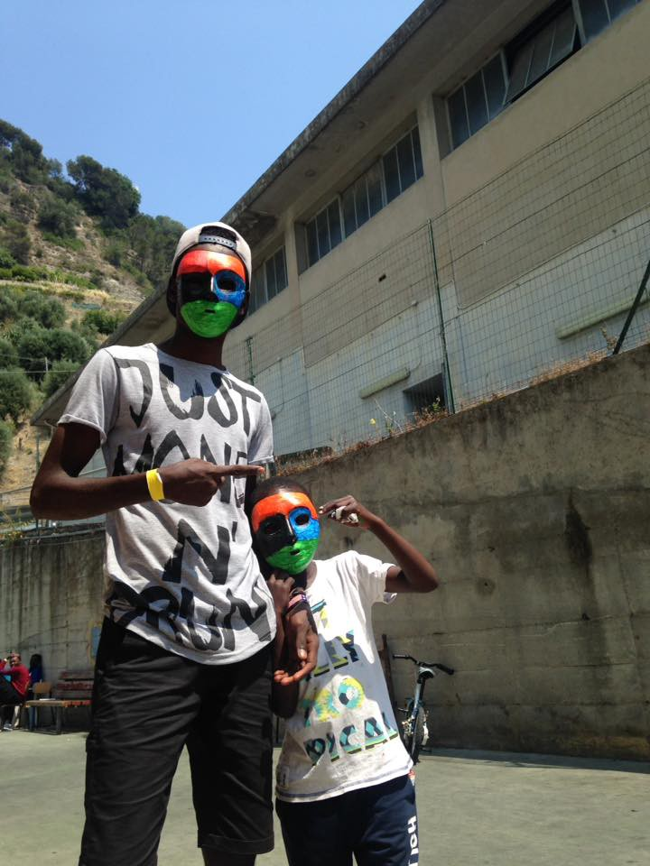
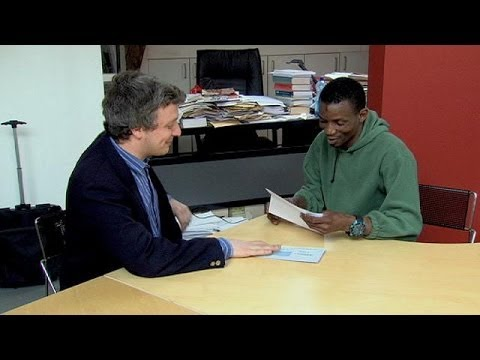

### AYS Daily Digest 14/06/17: People trapped in the cruel labyrinth of institutions

_Hundreds of civilians being attacked in Syria / An impassioned call out of failing support on Chios / New refugee camps open in Greece / More volunteers documenting systematic violence designed to terrorize at Croatian\- and Hungarian\-Serbian borders / Italian institutional support apathetic and crumbling, according to journalists and activists / French Ombudsman condemns police violence against refugees\! / Guinean man receives asylum in Belgium due to far right persecution in Greece / And more news…_

](assets/296cdb38b20b/1*mmwBeLqP6geMMB84ptoI-w.jpeg)

Souda, Chios\. Photo credit: [Giorgos Moutafis](https://www.facebook.com/giorgos.moutafis.5)
### SYRIA

Attacks on and affecting civilians in Syria continue to mount on several sides of the on\-going conflict\. Daraa is being subjected to a brutal aerial campaign, with napalm having been dropped earlier in the week, causing infernos of fires\. In spite of its status of being part of the so\-called “de\-escalation zone”, the city is facing continual bombardment as pro\-government forces continue their advances on the city\.

The rebel stronghold of Idlib has also been threatened with “total annihilation” if they refuse to surrender\.

Read more [here](https://www.alaraby.co.uk/english/news/2017/6/13/syrian-regime-uses-napalm-in-daraa-offensive?utm_campaign=sf&utm_source=facebook.com&utm_medium=referral) \.

The U\.N\. war crimes investigators have confirmed 300 civilian deaths in the aftermath of U\.S\. coalition air strikes on Raqqa\. Civilians are caught in double jeopardy, suffering under the yoke of the Islamic state, which prohibits their movement, thus trapping them under the bombs additionally\. Of the deaths, two\-thirds of them occurred in one village, al\-Mansoura, alone\. Read more [here](http://www.reuters.com/article/us-mideast-crisis-syria-warcrimes-raqqa-idUSKBN19523Q) \.
### TURKEY and JORDAN

Registered Syrians and density of camps in Turkey and Jordan\.

General distribution in Turkey

People from Raqqa are likely to flee to Southern Turkey, in spite of increased border controls\.

### GREECE

Official registrations show well over 100 people have arrived to Lesvos over the course of the day\. And boat\-watching crews continue to observe more people coming\.

[Lesvos](https://www.facebook.com/hashtag/lesvos?hc_location=ufi) : 103
 Others: 43
Total: 146

According to a U\.N\. report, as of 11/6, 7,700 have arrived this year alone\. According to the statistical breakdown of arrival between January and April, half of the arrivals were male, 29 percent were children, and 22 percent women\.

Read more [here](https://data2.unhcr.org/en/documents/download/57696) \.

Each one of these numbers is a person with a story

Below is the account of Gabrielle Tan, the founder of Action from Switzerland, who has been active on **Chios** for well over one year now\. Sadly, the stories of these many refugees will most likely bear a striking resemblance to that of these people, stranded inside and outside of the system simultaneously\. [Read her words](https://www.facebook.com/photo.php?fbid=10155162055800469&set=a.10153925575735469&type=3&theater) on the protracted crisis on Chios\.

> “There are currently approx 350 on this very beach\. Thank god for small mercies, that the weather, albeit windy has been warm and sunny\. 
 

>  
 

>  My story starts on 3rd June, where a boat carrying 3 heavily pregnant women, all within 2–3 weeks of giving birth arrived on the shores of Chios\. These families were forced to sleep on the hard concrete outside Vial registration area\.
 

>  
 

>  They were told “if you have money, go to a hotel, if not, go to Souda\.” 
 

>  
 

>  Arriving in Souda, they were told that the municipality in charge of the camp that they been under strict orders from the Mayor not to accept any new arrivals after 25th May\. This means that they will not be issued food cards and join in the undignified queuing system of getting bland, processed food\. 
 

>  
 

>  What then? Everyone deemed responsible did the famous “shrug” and said they must go back to Vial to be allocated shelter\. By whom? because hey, Greece was having a long holiday weekend\. Tourists were lounging on the beach while their fellow humans were left to languish in undignified conditions and being bounced around like footballs\.
 

>  
 

>  The long weekend plodded on and the Greek tragedy seemed to be getting even more tragic, because on this island, the responsible authorities do not give enough f\* \*ks\. 
 

>  
 

>  A sweep of the beach last Sunday by volunteers saw urgent referrals to the UNHCR that wouldn’t be dealt with until the first working day\. Volunteers organised food, identified the most vulnerable and organised food provided by the The People’s Street Kitchen of Chios, and accommodating the heavily pregnant after a reportedly traumatic journey\. Volunteers accompanied the sick to the hospital, fighting harassed and short tempered staff\. 
 

>  
 

>  It is now early morning of 14th June as I am writing this\. 
 

>  
 

>  Nothing has changed for those who came\. Those who took our advice went back to Vial to demand their right to be sheltered by the Greek government, turned around and begged us to leave\. Reports of being shoved into containers with 10 others are as true as I am sitting right here writing this\. 
 

>  
 

>  Let’s talk about choice\. There are so many cheesy quotes out there blabbing about how everything is a choice\. 
 

>  
 

>  Not for these people\. 
 

>  
 

>  It seemed enough for those responsible to state that the refugees were allocated shelter but they refused\. \*Cue famous shrug\* But hey, they’ve ticked their boxes and allocated shelter\. “Nothing more I can do\.”
 

>  
 

>  Are these really the kind of answers we should accept?
 

>  
 

>  No\. I swear if someone did that shrug another time, I will not hesitate to slap\. 
 

>  
 

>  The responsible are most likely sleeping in their beds and I am up, fuming\. I wonder why\. Why I am still thinking about one of the heavily pregnant, who is sleeping on the beach, with hard rocks poking her back, and how steep some of the slopes are — just to walk another 100m to the nearest unsanitary toilet of Souda\. Perhaps it is guilt that I haven’t been able to do enough to house her with limited funds\. 
 

>  
 

>  I wonder when it’ll be the day that I’ll do that infamous shrug too\. I hope I’d never become that numb\. But I am tired\. We are all tired\. I sat and listened to heart breaking stories today — all again, screwed by the system\. I felt that shrug actually coming on\. But it is impossible when I heard about twin babies separated from their parents at birth\. Mother going insane with depression and grief at being apart and not being able to hold her babies\. Blocked by bureaucracy\. I hit the emergency SOS button to Athens so hard\. 
 

>  
 

>  A woman being abandoned by her feckless husband after arriving on Chios, and fearing deportation because she is not Syrian but not hearing a single peep from the lawyer responsible\. 6 lawyers for 2000\+ people on the island\. I hit the emergency SOS button again\. 
 

>  
 

>  Come 31st July, the Greek government will be taking over greater responsibilities and take over services which are presently provided by UNHCR and the broader humanitarian community\. 
 

>  
 

>  Cue Act II of the never ending Greek Tragedy…\. \.” 

■■■■■■■■■■■■■■ 
> **[Եհҽմɾցíɑ_ցօҽԵíɑ ⛧](https://twitter.com/Theurgia_Goetia) @ Twitter Says:** 

> > Cruise ship and Souda.
Heaven and Hell

#Chios #Refugeesgr https://t.co/xXCGateC2f 

> **Tweeted at [2017-06-14 13:50:16](https://twitter.com/theurgia_goetia/status/874987353005228034).** 

■■■■■■■■■■■■■■ 

Migration Policy Minister has opened two new refugee camps, one in Serres and one in Drama\.

“The camps will be operated by the International Organization for Migration \(IOM\) under the supervision and coordination of the ministry\. The camp in Serres is made up of 94 housing units with a capacity of up to 650 people \(today it houses 487 refugees\), while the one in Drama has 70 apartments for about 400 people\.”

[_Source_](http://greece.greekreporter.com/2017/06/13/mouzalas-opens-two-new-refugee-camps-in-serres-and-drama/)

Although it is good news to see more camps opening, it is clear they are not keeping up with the rate of needed relocation\.

Delivering Dignity Worldwide/Octopus Volunteers needs volunteers\! This organization is in need of Doctors, Nurses and Teachers\. Check out their [post](https://www.facebook.com/593864180791265/photos/a.593881730789510.1073741828.593864180791265/864497187061295/?type=3&hc_location=ufi) for more information\.

Photo credit DINIT

Drapen i Havet needs books\! Read below\.

“At our community centre in Skaramagas refugee camp outside of Athens, residents have the opportunity to use the library, which holds a wide range of titles in many languages\.

The library lacks books in Farsi and Dari, languages spoken in Afghanistan\. If you have books in these languages that you want to donate to our library, please send an email to post@drapenihavet\.no”

Photo courtesy of Drapen i Havet
### SERBIA

[Rigardu](https://www.facebook.com/rigardu/) team documented several incidents of police violence at the Hungarian\-Serbian and the Croatian\-Serbian border since the end of May\. 
They write how observers in the region increasingly get the feeling that the violence by authorities is systematic to frighten people from crossing the borders\. In fact, the report concludes, this means that people will be stuck in Serbia and therefore have no chance to ask for asylum in an EU member state\.

This team of volunteers notices that especially the Croatian police seems to be more violent nowadays\. Witnesses said, that earlier police used to drive them back to the borders\. Violence they experience now they were only accustomed to by Hungarian police\.

The MSF clinic in Belgrade also confirms this, having treated four victims of violence \(two from the Serbian Croatian border and two from the Hungarian Serbian border\) in the recent days\.

Read their full report, in German, [here](http://rigardu.de/2017/06/14/ein-mensch-ist-kein-fussball-wie-menschenrechte-mit-fuessen-getreten-werden/) \.

Volunteers, activists, refugees, and all citizens are urged to stay alert to more reports of violence\. If you have been a victim of violence, try to get as exact a location as possible and provide as many details as one can about the incident\. You can write to us, our inbox or ays\.info\.team@gmail\.com\.

Groups across the region are working hard to hold the authorities accountable to this unspeakable violence, and we will continue to inform you as to the latest actions of grassroots support\.
### ITALY

Il Viminale \(Italian Interior Ministry\) has responded to the letter Mayor Raggi wrote to the Rome Prefecture yesterday and states that Rome needs to do more in terms of reception: it needs to find a place for at least 2000 more people because the number of arrivals will keep increasing so every region/city must do its part\. The full report is available in Italian, [here](http://www.ilfattoquotidiano.it/2017/06/14/migranti-botta-e-risposta-raggi-viminale-e-m5s-sceglie-la-linea-dura-convergenze-con-lega-ma-no-alleanze/3658155/) \.

— \-

**Alberto Biondo** , of Borderline Sicilia Onlus, writes a heart\-rending and stirring call to action of the escalating crisis in Italy and apathetic coverage of it\.

> The elections have just passed, but the real news is hidden\. Today as well, like for the past years, there are several deaths at sea, and we see the Libyan coast guard delivering more than 500 people, among them many children, even Syrians, exactly those people acclaimed at their entrance to the German and Italian cities few months ago, through relocations and humanitarian corridors\. 

> Our sea spits men and women on the Libyan shores, as it is full of them\. Italy establishes agreements to take the migrants back to Libya, violating their asylum right\. Who manages to tackle such obstacles cannot anyway enter Italy\. It has not been so for the people landed in Lampedusa and Palermo on 12 June\. Two completely different realities, sharing a similar destiny: welcoming citizens and stuck institutions…\.
 

>  
 

>  The difficulties and the confusion make more and more invisible people, and this is a consequence or a precise choice of a system willing to create exploiting opportunities\. This army of invisibles will join the minors fleeing from the Sicilian centers, looking for luck, out of a condition blocked by an endless bureaucracy full of obstacles\. The same difficulties are for husbands and sons separated from their wives and mothers at the last landing in Palermo to rejoin, since the prefectures and the police headquarters cannot guarantee the family unity\. 

> The people rejected with an expulsion order and thrown in the streets will follow by, trying to shelter in the stations in the next days\. 

> In Lampedusa, periodic repatriation flights for Egyptians, Nigerians and Tunisians take place, through Palermo and Rome\. The very last ones involved 19 Egyptians two weeks ago and 20 Tunisians last week\. Each migrant has been handcuffed and escorted by at least two agents and boarded on a Smartwings plane\. 

> In terms of hotspots, the situation seems to worsen, irrespective of the change of managing entity\. Last week, the people were walking in the city center wearing pajamas since the clothes were over, the blankets seem insufficient and the migrants were forced to sleep out of the buildings for the lack of beds\. The nth obstacle in the system comes from the parish and Forum Solidale Lampedusa\. As in Palermo, also in the other cities activists and volunteers work to prevent the worsening of such situations\.
 

>  The system is faulty also for the deaths at sea: the four corpses of the Eritrean boys died last 16 January 2017 have been locked in a broken refrigerating cell, to be buried in Valderica cemetery \(Trapani\) five months after having been found\. 

> Meanwhile, tomorrow the landings will go on, where other mothers will ask for information on some son or daughter never arrived, or killed in the desert\. What can we tell them, apart from the election results or some football scores, since these are the only topics the journalists are speaking about to distract us from these daily murders? 

This is an edited translation\. The original is available in Italian, [here](http://siciliamigranti.blogspot.hr/2017/06/le-morti-che-aiutano-ad-accaparrare-voti.html?spref=fb&m=1) \.

Photo credit: Refugee Youth Service

Thank you to AlterEgo Legal Service for their report on the clearing of a squat in Rome\. Read the full report [here](https://www.facebook.com/alteregolegalservice/posts/1095055097305739?hc_location=ufi) , in Italian\.

In relation to the expulsion refugees and migrants from Via Vannina, which has been occupied by around 500 people for about two years, and was recently privately bought\. As to be sadly expected, many of the former residents were subjected to police violence during the eviction, also having lost their documents in the confusion\. No social care showed up to help those now forced onto the streets\. Rome’s prefecture responded to calls to intervene with a milquetoast explanation that it is not possible to create “further receiving structures\.” Truly it boggles the imagination to think that _Rome_ would be unable to accommodate people\.

“The men, women and children in Via Vannina cannot be abandoned to their destiny\. The solidarity of the citizens is needed, along with the interventions of the social organizations\. There is a need of a strong reaction against who wants us to believe that human dignity has no more value, in full violation of the fundamental human rights\.”

53 people \(47 men 6 women\) were rescued yesterday night and brought to Malaga
### SPAIN

■■■■■■■■■■■■■■ 
> **[SALVAMENTO MARÍTIMO](https://twitter.com/salvamentogob) @ Twitter Says:** 

> > Salvamar Alnitak rescató anoche a 53 personas (47 hombres y 6 mujeres) de una patera y los trasladó a #Málaga. 

> **Tweeted at [2017-06-14 08:03:14](https://twitter.com/salvamentogob/status/874900019442331648).** 

■■■■■■■■■■■■■■ 

Fifty\-three persons, \(47 men and six women\) were rescued and taken to Malaga, Spain\.
### BELGIUM

In an unprecedented case, a Gunean man was granted asylum in Belgium after a harrowing experience in Greece and constant threats to his life from Golden Dawn\. He was targeted based on being African, and was subjected to repeated harassment by men on motorbikes and was beaten bloody with a metal pipe\. No bystanders intervened\. He had initially arrived in Athens in 2006, but attacks against him escalated from 2010\.

In a report with [Euronews](https://www.facebook.com/pages/Euronews/112644898750333?fref=mentions) , he shared his horrifying story\.

“I don’t know how they got my address but they turned up at my house\. They put a ‘Golden Dawn’ sticker over my doorbell that also had a message written on it ‘Mamadou, we’ll come back another day\. We missed you today’\. When that happened I decided to move house because it was obviously dangerous for me there,” he recalled\.

But Mamadou did not go to the police because he felt he would not be protected\. He had had some bad experiences in the past, which he had spoken about with the media\. The police had arrested and humiliated Mamadou for no particular reason\.

“Once during a routine check of my passport the police handcuffed me and took me to a station\. I spent four hours there\. They stripped me, took pictures of me, filmed me…\. After all that had happened they asked me one question\. ‘Would I speak to the media again?’\.” said Ba\.

Report via [No Borders News](https://www.facebook.com/NoBordersNews/posts/1464801153577057) \.

Below is a video of his testimony\.

### FRANCE

In a huge step forward, the French Ombudsman denounces human rights violations in Calais, especially the harassment by police\. He calls on authorities to allow food distributions and to protect unaccompanied minors\. He says refugees are prevented from sleeping and drinking water, women are at risk and NGOs are prevented from doing their job\. Read the [full report](http://www.liberation.fr/france/2017/06/14/a-calais-les-policiers-riaient-en-me-frappant_1576829) in French\. It is hoped that more will follow in his footsteps\!
### SWEDEN

According to a local report:

“A 22\-year\-old man with suspected neo\-Nazi links has confessed to driving his Volvo into an Iraqi demonstration outside the Migration Agency in Malmö\. Police are investigating it as hate crime\.

The man has admitted driving his car into a demonstration of around 20–30 Iraqi nationals protesting Sweden’s new and stricter asylum rules outside the Migration Agency in Malmö on two occasions\.

No one was injured but in the latest incident at around [10\.30pm on Sunday](https://polisen.se/Skane/Aktuellt/Handelser/Skane/2017-06-11-2226-Ovrigt-Malmo/) he drove over a number of protest signs and crashed into a tree\. The man then barricaded himself in the car to protect himself against the agitated protesters, who kept him there until police arrived and seized him\.”

This after the attack was initially reported as being connected to Islamic terrorism and spread on several Islamophobic and anti\-migration groups as such\. The man was carrying several weapons in his car\. Read the full report [here](https://www.thelocal.se/20170614/man-with-alleged-nazi-links-admits-driving-his-car-into-refugee-demonstration-in-malmo-sweden) \.

For Swedish speakers, this radio program contains an interview with the Swedish Migration Minister, Morgan Jogansson\. Around 5–10 minutes in the program\.

He relates that recently, 255 people, mostly of Syrian origin, arrived from Greece to the northern city Lulea\. Sweden was up until a couple of weeks ago granted an exception from the program since the country took in so many \(almost 163 000\) in 2015\. The total number is 3927,and before yesterday Sweden only had taken 39 people from Italy\. The goal is to relocate everyone on time…

Listen to it all [here](http://sverigesradio.se/sida/artikel.aspx?programid=1637&artikel=6717224) \.

Finally, some good news\.

The new “high school\-law” \(gymnasielagen\), that was taken in use the 1st of June, about that young asylum seekers threatened by deportation might have the possibility/right to stay if they still are in high school have been tested\. A lawyer at Asylbyrån filed an appeal in a case and the person of concern will get to stay, at least for now\. They encourage everyone in this situation to contact a lawyer that can help to file an appeal against the previous decision\.

**_We strive to echo correct news from the ground, through collaboration and fairness, so let us know if something you read here is not right\. Anything you want to share — contact us on Facebook or write to:areyousyrious@gmail\.com_**

_Converted [Medium Post](https://areyousyrious.medium.com/ays-daily-digest-14-06-people-trapped-in-the-cruel-labyrinth-of-institutions-296cdb38b20b) by [ZMediumToMarkdown](https://github.com/ZhgChgLi/ZMediumToMarkdown)._
