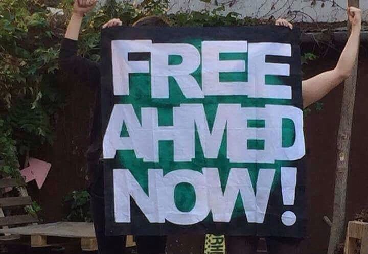
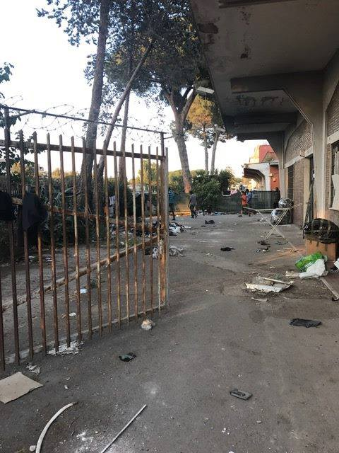
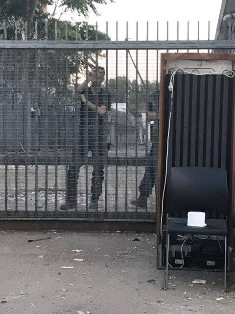
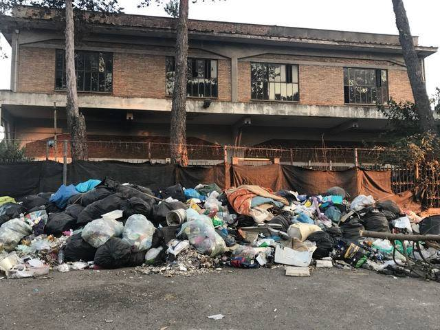
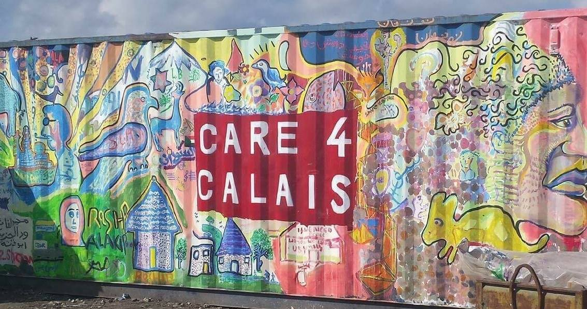

### AYS DAILY DIGEST 15/06/2017: Another chance for justice in Hungary to win — retrial of Ahmed H\.

_Ahmed H\. is still in prisons despite the court decision about the inconsistent evidence during the first instance trial // Second instance trial for Ahmed H\. started today // 820 arrived in Greece so far in June // Dreadful living conditions for refugees in Italy and France // More reports about police violence in Hungary_

Photo by Migszol
### Feature

Citing inconsistent evidence in the original trial, the second level court in Szeged, Hungary, ordered a retrial in the case of Ahmed H\. However, to the first hearing in the retrial, held today, Ahmed H\., was brought in chains and accompanied by three masked policemen\.

Activists supported decision about the retrial but expressed their worries because Ahmed is held in prison until now\. “It’s good \[…\] but now again months will pass during which time he has to sit in prison,” said Barbara Hegedus, a member of the Migszol group\.

In the courtroom, Ahmed insisted that he never had the intent to harm the Hungarian police\. “My original plan was to help my family get away from war,” he said, speaking through a translator\. “Whether the border was closed or not, we didn’t know — we didn’t know anything\.”

[Ahmed H\. was arrested in Hungary in September 2015, during the clashes between police and refugees at the Röszke border crossing\. The state prosecutors charged him with the act of terrorism, and in November 2016 he was found guilty and sentenced to ten years in prison\. This court decision roused international protests and many even called the entire case a show trial\.](https://www.amnesty.org/en/get-involved/take-action/ahmed-h/)

In a new trail, Ahmed is represented by former Minister of Justice Péter Bárándy, who argued that critical evidence was ignored in the first trial\. Among other claims, defense will try to prove that the wrong laws are being applied in this case since Ahmed had been residing in Cyprus and was at the border helping his Syrian family reach the European Union\.

The defense also emphasized that there is no evidence that the events the prosecution is charging Ahmed with, ever happened and that in the first instance trial available evidence was ignored\.

The presiding judge in retrial acknowledged this and read aloud excerpts of audio evidence where Ahmed is heard speaking peacefully and calling for calm behavior — evidence that was overlooked in the first trial\.
### GREECE

Islands are bursting with people who are coming every day and who are stranded for months there\. The morning started with the boat arriving at Lesvos carrying 58 people, according to volunteers\. To Chios, 39 people arrived at the same time, 13 men, 12 women, and 14 children\.

Officially, 151 new arrivals were registered during a day: Lesvos 54, Chios 74, Kos 1, and other islands 22\. So far in June, 820 were registered as new arrivals to Greece\.

Despite numerous new arrivals, today the UNHCR decided to stop the buses from Vial to Chios town and the opposite in the end of the month\. We do not have details about this decision yet\. The day before, the municipality of Chios began clearing 137 tents on the beach\.

](assets/5118635b3cb1/1*L9di864LVAAaklnxFnuRcg.jpeg)

By [**@** gfabf\_info](https://twitter.com/gfabf_info)

> [THE MOBILE INFO TEAM](https://www.facebook.com/mobileinfoteam/posts/1977957359099650:0) 

> ASYLUM SERVICE STILL HARD TO REACH THROUGH SKYPE FOR URDU SPEAKING REFUGEES 

> Despite promises of the Greek Asylum Service that it would become easier to reach the Asylum Service through Skype, the situation has not really improved\. Many Urdu\-speakers wishing to apply for asylum still reach out to the Mobile Info Team to ask for assistance to schedule an appointment with the authorities and receive a white card\. To get an appointment you need to call Skype on certain days and times, depending on the language you speak\. If you are an Urdu speaker living in Athens, you need to call Monday to Thursday between 14:00 and 15:00\. If you are an Urdu speaker living in the rest of Greece, you need to call on Monday and Wednesday between 14:00 and 15:00 and on Thursday between 11:00 and 12:00\. 

> The Skype ID to call is asylum\.service\.urdu 

> Please note, that the Mobile Info Team is not the Asylum Service and can only give you information\. We are not able to provide you with a white card\. [Please check this link to the website of the Asylum Service from time to time to see if the Skype timetable has changed](http://asylo.gov.gr/en/?page_id=987) \. 

PETITION

The German Interior Ministry recently slapped a limitation on Dublin family reunification from Greece to Germany \(only 70 people per month\) \. Besides putting thousands of people’s lives on hold, German officials are denying it to try and keep it quiet\.

[Mobile Info Team recently launched a petition and letter\-writing initiative against this\. Please SIGN and SHARE the petition as widely as possible](https://www.change.org/p/family-reunification-from-greece-let-them-be-together-again) \.

Coordination of Refugee Squats calls for a gathering and international action day on June 23rd to protest opresive “anti\-immigration policy of restrictions against refugees and the solidarity movement”\.

In their call, they remind about the court decisions focusing on the eviction of three more squats\. Papoutsadiko, Zoodoxou Pigis 119 and City Plaza\.

_“They know how to use the power of riot police forces, but we know how to use the power of solidarity\! As long as they try to evict the squats, as long as they build camps and detention centers, as long as there are borders — we will also be there to fight back and fight for a better world\!_

_We won’t bend down, we won’t let them in, we stand united\!_

_We will show them again what we already proved, we live together, we struggle and we resist together — to defend the dignity of each individual, to defend our principles of solidarity and to keep our free spaces open\._

_Therefore we call for a protest and a gathering on the 23rd of June, in front of the Ministry of Migration \(Stadiou 27\) at 7 pm\.”_

_On the same day we call for an International Action of solidarity towards all squats and against evictions\!_

_Keep the squats open\!”_

City Plaza, Notara 26, Oniro, Spyrou Trikoupi, Arahovis, 5th School, Jasmine School, Acharnon 22\.
### HUNGARY

We received another report about police violence\.

Time and Date: 13\.6\.17 — Between 23:30–1:00 until 5:00am
Location of Violence: Hungarian side of the Serbian/Hungarian border

Demographics: 27 people, 2 minors: 12 & 16\. 25, including minors, from Pakistan\. One man from Iran, one man from Syria\.
Testimonial:

> “We walked approximately 5km into Hungary\. We were sleeping in the jungle for approximately one hour to hide from the police because we thought we were safe\. Then, the police surrounded us and started beating everyone in the jungle\. They called the dogs, German shepherds\. They had this face covering \(muzzles\) \. They continued beating, kicking, punching and hitting us with sticks\. Both official police sticks \(batons\), with sticks from the forest, and their torches\. These official sticks hurt too much\. 

> There was one man who was very tall and looked like a bodybuilder, he had on a blue shirt and army trousers\. They kicked us in the face and groin, and said, “Welcome to Hungary”\. Then, they put dirt into our faces and said again, “Welcome to Hungary\.” After one and a half or two hours, they said, “Ok\. Stand up\.” and moved us from the jungle\. They told us to make a line and continued to beat us with official sticks and sticks from the jungle on our legs\. There was a car playing loud Hungarian music\. They poured beer and wine on the back of our necks\. Then they told us to sit down in the line outside of the jungle\. 

> They had one dog named ‘Freki’ with a face cover and told him to attack people one by one\. They kicked me in the face when I was sitting, and my nose started bleeding\. Then, when the police saw my nose bleeding, he kicked me in the face again, and said, “Fuck you\.” The police had pistol guns and the army had AK\-47s\. They took the pistols and held them to each of our heads\. 

> Then, they told us to stand up and make a line, and start walking\. As we were walking, they continued to beat us\. They have a new, special person trained in this field\. He was kicking and punching our faces and arms\. We walked for one and a half hours, and they were still beating\. We got to the main road, and they brought two vans\. They brought us to the transit zone gate and interviewed us one by one\. They asked a series of questions: Where are you from? How old are you? What is your name? What is your mother’s name? Where do you want to go? 

> Then, they instructed us to unlock our phones and they checked everything\. They checked our sim number and everything and checked our belongings and pockets\. Then Serbian police came to the fence, and the Hungarian police took the dog away\. I think the Hungarian police would have beaten us again, but they didn’t want to in front of Serbian police because then the police would have been witnesses\. The Hungarians asked how much money we had, and then gave it back to us\. They didn’t do anything for the injuries\. My nose continued bleeding for two hours, and when I arrived at the transit zone it was still bleeding, and their faces did not change at all\. 

> It took 5–6 minutes to check each person\. Around 5:30 or 6:00 have they opened the gate back to Serbia\.” 

According to [the investigation carried by a group of investigative reporters](http://budapestbeacon.com/featured-articles/hungarian-authorities-could-have-prevented-tragic-death-of-71-migrants-in-2015-report-concludes/47653) , the death from asphyxiation of 71 refugees from Syria in August 2015, could have been avoided if Hungarian authorities had intervened sooner\.

The investigation was carried out by Süddeutsche Zeitung \(SZ\) and regional public media companies Norddeutscher Rundfunk \(NDR\) and Westdeutscher Rundfunk \(WDR\) \.

The report reminds that the small truck usually used to transport poultry was crammed with people when departed from the vicinity of Kecskemét in Hungary\. They were promised to be taken to Germany\. The truck was found abandoned in eastern Austria with 71 dead persons, including four children\.

According to the investigation, the Hungarian authorities had been monitoring the human traffickers’ phone calls for 13 days before the tragedy, but the intercepted conversations were translated and analyzed too late for police to intervene in time\. In one intercepted conversation, the driver of the truck tells the boss of the human trafficking gang that he hears banging and yelling from the back\. The driver asks if he should pull over and give the people water, but the Afghan boss of the organization says no\.

In another conversation, the boss is heard saying “It cannot happen that \[the driver\] opens the door”, and “If people die, throw them out somewhere in Germany in the forest\.”
### ITALY

The situation in Rome is degrading rapidly\. [A friends from Baobab are reporting](https://www.facebook.com/BaobabExperience/posts/1364729323603816) about the men, women, and children who are staying in two run\-down buildings in Via Vannina, given no other available structure\.

Photos Baobab

> “Yesterday we have been there, meeting who is still in the location\. One of the buildings is shut down, with locks and barbed wire, plus vigilantes, the other is still open\. We entered with them listening to their last week of incredible urban, social, political, humanitarian violence\. We have seen children willing to play and cry like all the other children, tired men \(the youngsters have probably already identified other areas in Rome where to settle temporarily\), women, young and old mothers tired and scared, who welcomed food and water and first need items taken by some citizens \(toilet paper, tampons, biscuits, dates, water\) \. We found also an Italian woman, homeless, who had lived in the building for a month\. A very sharp woman, who clearly and determinedly and angrily told us the dynamics of the police clearings… The situation looks unbelievable\. It seems to be in an area devastated by everything and everybody\. We are wondering how these people can survive even only one day in such conditions\.” 

[Save the Children called the authorities in Italy](https://www.thelocal.it/20170615/save-the-children-tells-italy-to-give-more-help-to-child-migrants) to do more to help to children who arrived in the country since 2011\. According to the available data, more than 70,000 unaccompanied minors have arrived in Italy\. The organizations concluded that the de facto closure of Italy’s northern borders in 2016 seriously complicated the challenge facing these children\.

Most of the children who are alone in Italy are from Eritrea, 13 Egypt, Gambia, and Somalia\. Among them, there is a small minority of girls, but even this number is slowly growing, from 440 to 1,832 over the period from 2011 to 2016\. Most girls are from Nigeria and Eritrea, and they are often victims of sexual violence\.
### SERBIA

[Help is needed for the warehouse cleaning for Refugee Aid Serbia\.](https://www.facebook.com/groups/1157057194369287/permalink/1453069614768042/)

If you can help, come — with passport — at 11 AM on Saturday the 17th in front of the warehouse building entrance on Karadjodjeva 65\.
### POLAND

[Poland’s president, Andrzej Duda, has announced](http://www.liberties.eu/en/short-news/19109) that he is ready to call the referendum to hear if people want more refugees in the country\. Previously, the Prime Minister Beata Szydlo said no refugees from the Middle East and Africa will be accepted\.
### FRANCE

[In yesterday’s digest](ays-daily-digest-14-06-people-trapped-in-the-cruel-labyrinth-of-institutions-296cdb38b20b) , we reported about the report of the Ombudsmen on Calais\. Tonight we bring you more details:

_France’s human rights watchdog denounces “unprecedented” rights violations, saying ‘the desire to get migrants to leave Calais has led to a situation where no shelters are tolerated\. People — between 500 and 600 — some of whom are minors, sleep on the ground regardless of the weather conditions”\. The refugees say they are being tracked night and day in the woods making it impossible to sleep or rest\. As all water points have been eliminated, refugees cannot wash or drink\. Only one association is allowed to distribute food for one hour every night, which makes it impossible to give enough food to everyone\. For a week now distributions have been possible at lunchtime in front of the church thanks to the intervention of a priest\._

_Women have no dedicated structure and are at risk of rape and sexual exploitation\. Some of these women have children and babies are expected to be born in the upcoming weeks\._ 
_There are many unaccompanied children present who face a similar degrading treatment as the adults\._

_Associations, when they try to put in place measures that should be implemented by public authorities \(showers, food and water distributions\) are obstructed and threatened by police: for example fines for cars parked in front of their own premises, threats to file a lawsuit for aiding an illegal resident\._

For more, in French, see [here](https://www.defenseurdesdroits.fr/node/23871...) \.

[Care4Calais announces](https://www.facebook.com/care4calais/posts/1574513022581649:0) that the will stop with their activities on the ground in Calais for a couple of weeks\. The reason is, as they said, “the complicated political and security situation there at the moment”\. In the statement on their FB page, they wrote that the foundings will be used in Belgium and Paris\.

For all of those who already have plans to volunteer in Calais in the immediate future, see other groups who are operating in the field, including [Utopia56](http://www.utopia56.com/en) \.
### GENERAL

The Compass Project Fund will provide 20 asylum seekers, who are not eligible for student finance, with a scholarship to study a university\-level program at Birkbeck, University of London\.
Successful applicants will receive:
 • a full tuition fee waiver for relevant courses
 • additional financial support to cover costs such as transport, childcare, and books

Look for [more here](http://www.bbk.ac.uk/student-services/financial-support/compass-project-fund) \.

> **_We strive to echo correct news from the ground through collaboration and fairness, so let us know if something you read here is not right\._** 

> **_If there is anything you want to share — contact us on Facebook or write to: areyousyrious@gmail\.com\._** 

_Converted [Medium Post](https://areyousyrious.medium.com/ays-daily-digest-15-06-2017-another-chance-for-justice-in-hungary-to-win-retrial-of-ahmed-h-5118635b3cb1) by [ZMediumToMarkdown](https://github.com/ZhgChgLi/ZMediumToMarkdown)._
