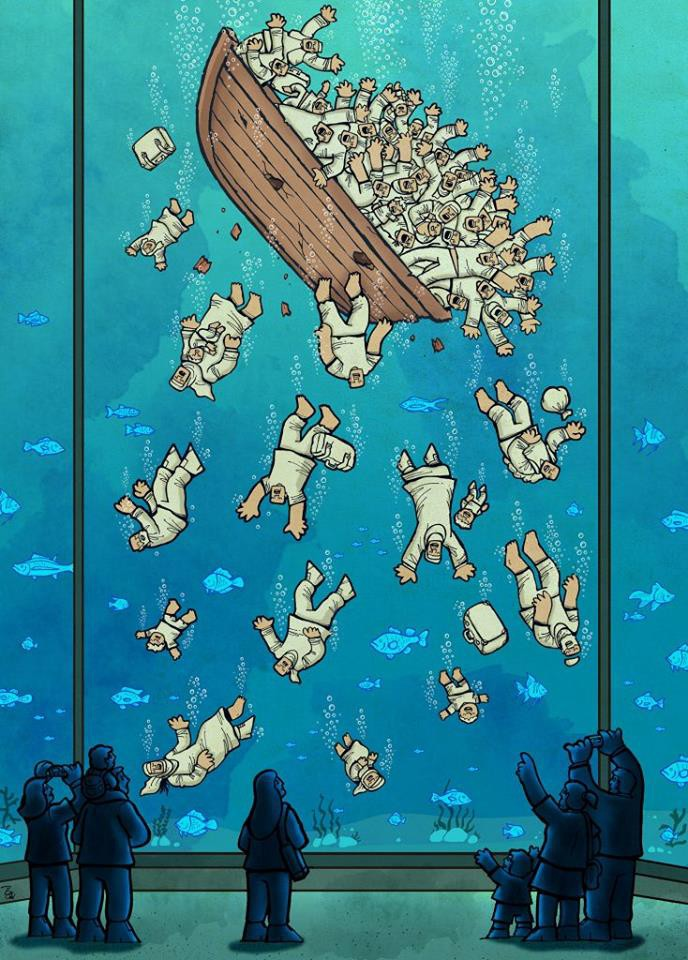

### AYS Daily Digest 16/06/2017: Controversy over rescue operations… but they continue saving lives
#### Intimidation and destruction of tents on Chios / Cases of intolerance continue in Serbia / Fresh cases of violence in Hungary / Legal action in UK to restart Dubs Scheme / Amnesty International launches petition in Spain / EU says that international protection should be for five years / And more news…

World Press winner \(by Iranian Alireza Pakdel\)
### FEATURE

A study recently released by [Legis](http://legis.mk/news/2352/efforts-to-rescue-migrants-caused-deadly-unexpected-consequences) claims that efforts to lessen the migrant crisis can backfire as smuggling networks devise even more dangerous strategies in response\.

There has been some criticism over the rescue operations in the Mediterranean Sea, close to the Libyan shore, especially by EU officials and Frontex who claim that they are an incentive for more people to attempt the dangerous crossing from Africa to Europe\. Rescues at sea have been moving considerably closer to the Libyan shore in the last three years and it has helped to save thousands of people—but there are also claims \(mainly by Frontex\) that it might push smugglers to provide worse conditions for people to make the journey and cause more deaths in the sea\. Smugglers now use flimsy boats and provide just enough fuel to reach the edge of Libyan waters and then remove the engine and head back to Libya on another boat, leaving the migrants adrift waiting for help to arrive\. These closer rescues might have caused some changes in smugglers _modus operandi_ but we can not forget that rescue teams went to the sea in the first place because there were thousands of people already dying in the sea and they just responded to an urgent humanitarian crisis\. Stefano Argenziano, operation coordinator on migration for Doctors Without Borders said:

> “We know that what we do is not the solution\. It’s not the source of the problem, it’s not the solution to the problem, it’s the sheer necessity of saving lives now, when lives are in danger” 

Also, despite some criticism, there’s no evidence that reducing sea patrols would reduce deaths since after the end of the Mare Nostrum funding by the EU in 2014, a record number of refugees tried to make the crossing and more people drowned\. The UN also agrees that without the rescue efforts even more people would perish at sea\.

Another poor tactic, that was widely and controversially discussed some years ago and that was fairly unreported has actually been happening and consists in destroying boats used by smugglers with the intention of, that way, reducing the number of crossing attempts\. In reality, what happened was that human traffickers started using cheaper rubber dinghies\. These practices started in 2015 and from then we’ve seen a decrease in the quality and safety of the boats used\. In fact, according to the UN agency for refugees, the new rubber dinghies used have increased deaths at sea because they are much more likely to sink thank bigger boats used previously\. Also, smugglers push the same amount of people on these boats than on the other bigger boats to maximise profit which explains how we see 150 people on a boat made to transport 60 passengers\. This proves once more that desperate people will always find a way to move if their situation is bad enough back home and how ineffective closed borders and closed minds are to try to stopped them, especially a poor devised strategy based on the excuse of trying to save lives\.

In the meantime MSF teams in the Mediterranean have had another busy day rescuing refugees at sea, finding at least 7 boats drifting today\.
### Greece

The arrivals at the Greek islands continue at a high rate which means that the conditions only deteriorate\. The situation continues to be particularly bad on Chios at the moment where the greater number of arrivals has brought the situation to a breaking point with refugees having to find a place to sleep almost anywhere and rising tensions with the local population\.

Volunteers have reported today that currently in Chios people are forced to move from the ‘beach’ area outside of Souda\. There is space for some of them to move into the camp although it’s cramped as it is, but the others will possibly have to move to Vial\. Vial is the worse of the two as it is run solely by the army with the reception area looking like a prison\. The municipality has been forcing refugees to leave the tents on the beach and the men hired to do the job show up intimidating everyone and carrying knives that they use to cut the tents, destroying them, to prevent refugees from coming back\.

](assets/6d251c3cf1a8/1*OTDGDauHfoJJm4AySUt4nw.jpeg)

Workers destroying tents close to Souda camp, Chios — photo by [**Jelle Jalla**](https://www.facebook.com/jelle.jalla)

These procedures can only be classed as shameful, it has been a while since Mouzalas declared war on tents and although an effort to place people in decent accommodation would be more than welcome, these extremely repressive practices only worsen the living conditions of refugees\.

> People are traumatized, scared, distraught and unhappy as it is\. Why add to that? What is the purpose of destroying it anyway? Even the UNHCR tarp is torn and thrown on a big pile\. \.The other day 3 women who lived together were crying as their tent was destroyed\. As a fellow volunteer pointed out, no matter how bad it is, people have made this particular space their homes\. 

The conditions in Souda aren’t better either, people do not have any AC or anything to keep themselves cool and share a few toilets & showers with hundreds of others\. There’s fences and security from the municipality, but that’s not to keep the inhabitants safe\. The former is not even necessary with the castle wall on one side and apartment buildings on the other\. Security is basically one or two people who are outside the camp pretty much the whole time\. There are fights, including stabbings, almost every other day / night\. With more forced to live inside, tensions will probably rise\. There is around 20–30 nationalities there, which in any situation would be problematic\.

At the same time Chios residents are very unhappy with the situation and have been protesting on Thursday\. Luckily there was no far right intervention this time\.
#### Numbers

A boat arrived to the north of Lesvos last night carrying 23 people, 5 men, 6 women and 11 children\.

The official registrations today were:

Lesvos — 58
Chios — 39
Samos — 48
Total — 145

For the first time this year, there has been around 150 being registered, 3 days in a row\. Chios has now reached 3000 registrations this year, and Lesvos around 2200\. The total of arrivals to the islands this year has now reached 8128 according to official numbers\.
#### Mainland

Solidarity now \(in collaboration with UNICEF\), is implementing the ‘Blue Dots’ programme, creating Child & Family Care Hubs for children, women and other vulnerable people living in refugee camps and urban settings\. Every ‘Blue Dot’ is a safe place for refugee children and their families, while the range of services offered at each one includes legal counselling and psychosocial support\. This project is being implemented in Attica and Macedonia, and the group is looking for a project manager by 30 of June so if interested please find out more [here](http://www.solidaritynow.org/en/project-manager-blue-dots/) \.

[**RefuComm**](https://www.facebook.com/refucomm/?fref=nf) has released new [guidelines](https://www.facebook.com/notes/refucomm/preparing-for-your-asylum-interview/451709848514156/) to prepare refugees interviews for asylum\. It is really important to prepare well for these interviews and to understand which one of these interviews you are preparing for\. If you are not sure after reading the documentation or watching the films, please contact us at refucomm@gmail\.com\.

A protest is being held tomorrow at Victoria square in Athens against detention centres\. Another protest will take place at Petrou Ralli next friday\.

 **[REFS Production](https://medium.com/u/2fb4633b3013)**](assets/6d251c3cf1a8/1*ema3jp_TBZJ2VU2IRD-Cjg.jpeg)

Picture by [**ATH Solidarity**](https://twitter.com/pedioareos) **[REFS Production](https://medium.com/u/2fb4633b3013)**
### Serbia

Volunteers from [**SolidariTea**](https://www.facebook.com/refugeesolidaritea/) in the border with Croatia are reporting more mistreatment towards refugees by the locals and the hard conditions they are enduring to try to cross the border\.

> Today I took two young men to the dentist to get some emergency treatment\. 
 

> Ahmed, from Algeria, had pain in his tooth for over 12 days and had been refused treatment at the hospital for ‘being a refugee’\. So, I took him to a tiny dentist surgery in Shid to see if he could get the tooth removed\. The dentist told me many local people were telling her not to treat refugees, but she would try and help if she could\. Luckily the tooth was removed without too much trouble, and Ahmed seemed so relieved and thankful\. But why should he have been refused in the first place?
 

> After, we tried to go for a cold juice in the town, but as we sat down the waiter asked me to step inside\. I’m sorry, he said, but I cannot serve you\. We can’t have the refugees here, order from the boss\.
 

> But that’s outright racism, I replied, Why should they not drink a juice here, why don’t you stand up to your boss?
 

> It’s the rules, I’m sorry he replied
 

> The guys sensed what had happened\. For us, this is normal they said and as we walked away from the café\. I was so full of anger; I felt the prejudice and segregation these guys must feel every day\. 

Reports also say that refugees keep getting pushed back to Serbia and arrive in Sid exhausted, muddy and bearing injuries from trekking in old worn out shoes with their bodies covered in mosquito bites\. When a train bound for western Europe arrives into Shid station, everyone tries their luck\.

> It is shocking to see how many boys and men try ‘the container game’ in one night\. 

#### Hungary

Unfortunately, now, almost everyday we are getting new reports of violent push backs to Serbia\. [**Refugee behind the closed borders**](https://www.facebook.com/Refugee-behind-the-closed-borders-1264829603528876/?fref=nf) reports that Hungary has begun to beat people again when they are caught trying to cross the border irregularly\.

](assets/6d251c3cf1a8/1*irI9y0cMUmll0x3MUoUyxg.jpeg)

Photo by [**Refugee behind the closed borders**](https://www.facebook.com/Refugee-behind-the-closed-borders-1264829603528876/?fref=nf)

The Hungarian police kicked this mans face, and when they saw his nose start to bleed, they kicked him again\. His nose bled for two and a half hours as he was held and beaten even more on the Hungarian side of the border\. At no point was he offered medical care\. The police beat them as they played music from a car, and poured beer and wine on them\. In this group was a 12 year old boy, and a 16 year old boy\. They were reportedly beaten as well\. There was also a muzzled German Shepherd that the police would release on occasion\.

Similar stories come from other refugees that return to Serbia saying they were repeatedly beaten for hours by police and then threatened to not try further crossings\.
### Italy

Four police officers were arrested and other four were dismissed, while another 18 officers and 4 civilians are under investigation in Lunigiana \(between Liguria and Tuscany\) \.They are accused of tens and tens of crimes, including 5 brutal beatings in the last year whose victims are a Polish homeless and some North African migrants\. One of them, pushed to the ground, had his face squashed on the concrete with a shoe, the gun barrel in his mouth and was kicked and punched all over his body\. In addition, when they didn’t feel like beating up someone, these police officers were peeing on the mattresses used as beds by the asylum seekers\.

In their conversations other horrible details appear like their suggestion to stop thefts and crimes\. By giving them total control, they could erase crime “even without killing”, just by taking all the criminals, once a day, put them in the car and beating them up hard\. Destroy their houses, destroy everything they have, a bit of “healthy violence” will change the status of things in a month, according to these “men of justice”\.

On better news and initiatives, [**Collettivo Mamadou**](https://www.facebook.com/Collettivo-Mamadou-1711634685756321/) has almost fundraised enough money for their school project in Rosarno\. Please consider donating for help funding the project, [here](https://www.produzionidalbasso.com/project/hospital-ity-school/) \.
### UK

Next Tuesday a legal action against Amber Rudds decision of crippling the Dubs Amendment will start and it might be the last chance to reopen this scheme\. [**Help Refugees**](https://www.facebook.com/HelpRefugeesUK/?fref=nf) are pushing this initiative for the Home Secretary to do her job properly, and consult local councils who have come forward to offer hundreds more places for refugee children across the country\.

### Spain

A petition has been lunched by Spanish Amnesty International to pressure the Spanish government to honor its promises and take more refugees into the country\. The Spanish government has promised to relocate 17337 refugees until 26th of September of 2017, having only place so far 1304\. Considering this, it’s highly unlikely that they reach the target, as they continue this widespread policy of looking the other way\. The petition runs out on the 20th of June, Day of the Refugee\. To support this movement please follow the link [here](https://www.es.amnesty.org/17000-refugiados-espana/accion/#iframeaccion) \.
### EU

The European Parliament has recognised that refugees should get longer protection periods and suggests that **Residence permits for all beneficiaries of international protection in the EU should be valid for five years and be renewable for additional five\-year periods\.**

Civil Liberties Committee MEPs backed on Thursday a new “Qualification” regulation on the recognition of people in need of protection and for the rights granted to them\. By turning the previous directive into a regulation, which is directly applicable by member states, criteria and standards for the recognition of a refugee status become more harmonised\. The legislation was passed by 40 votes in favour to 13 against and with 4 abstentions\. MEPs aim to minimize the distinction in terms of rights between refugees and beneficiaries of subsidiary protection \(people at real risk of serious harm if they return to their home country, but who do not qualify for refugee status\) \. Subsidiary protection was set up as a response to a short\-term need, but this has not proved to be the case\.

MEPs included provisions to make sure that unaccompanied children receive adequate protection, like any other children in the country they are located\. They should have a guardian appointed, if possible the same one since their arrival to the EU, and be placed with relatives, foster families or in open specialised centres\.

To read the full document please follow the [link](http://www.europarl.europa.eu/news/en/press-room/20170615IPR77507/recognised-refugees-should-get-five-year-renewable-residence-permits) \.

Although these are good directives as excellent news, it’s unlikely that all EU countries will accept them, at least in the short term which means that the battle for asylum seekers rights in Europe is far from over\.

> **_We strive to echo correct news from the ground through collaboration and fairness, so let us know if something you read here is not right\._** 

> **_If there is anything you want to share — contact us on Facebook or write to: areyousyrious@gmail\.com\._** 

_Converted [Medium Post](https://areyousyrious.medium.com/ays-daily-digest-16-06-2017-controversy-over-rescuers-but-they-keep-saving-lives-6d251c3cf1a8) by [ZMediumToMarkdown](https://github.com/ZhgChgLi/ZMediumToMarkdown)._
