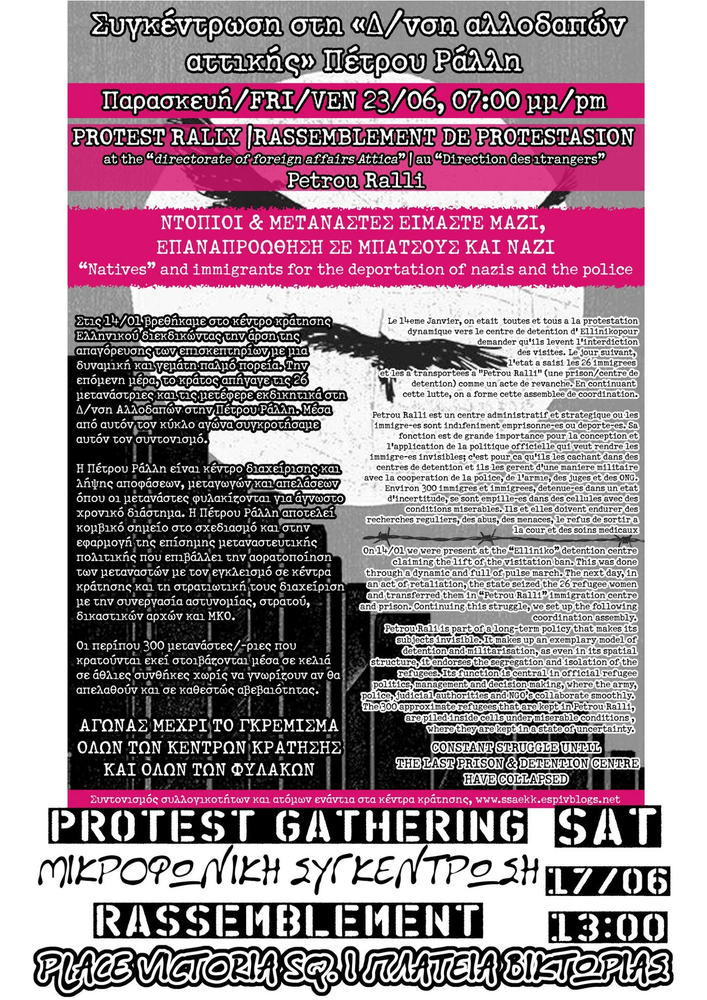
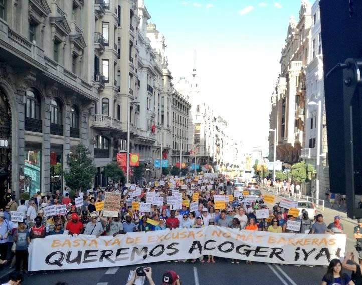
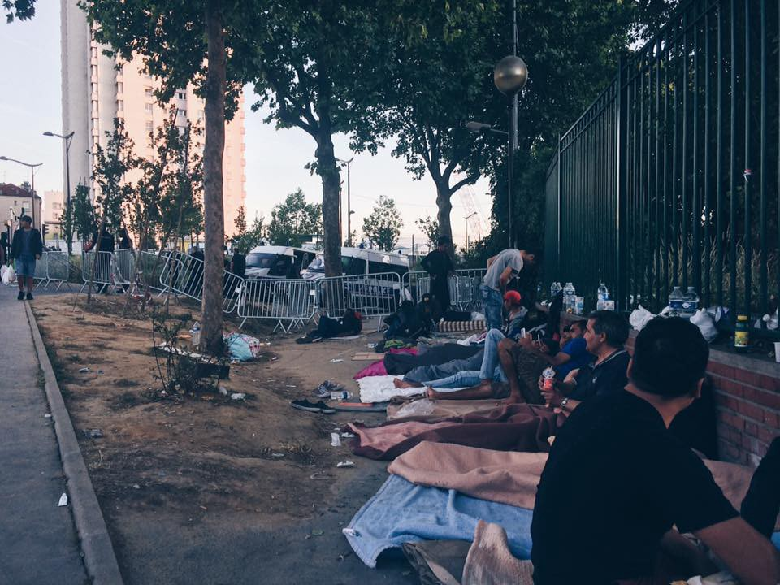
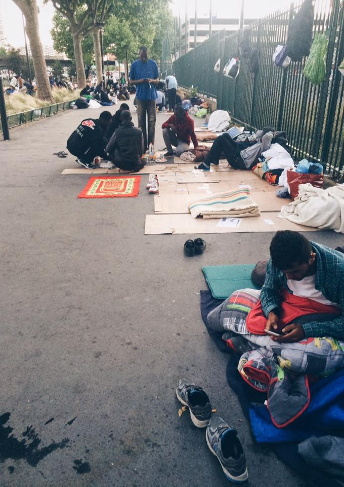
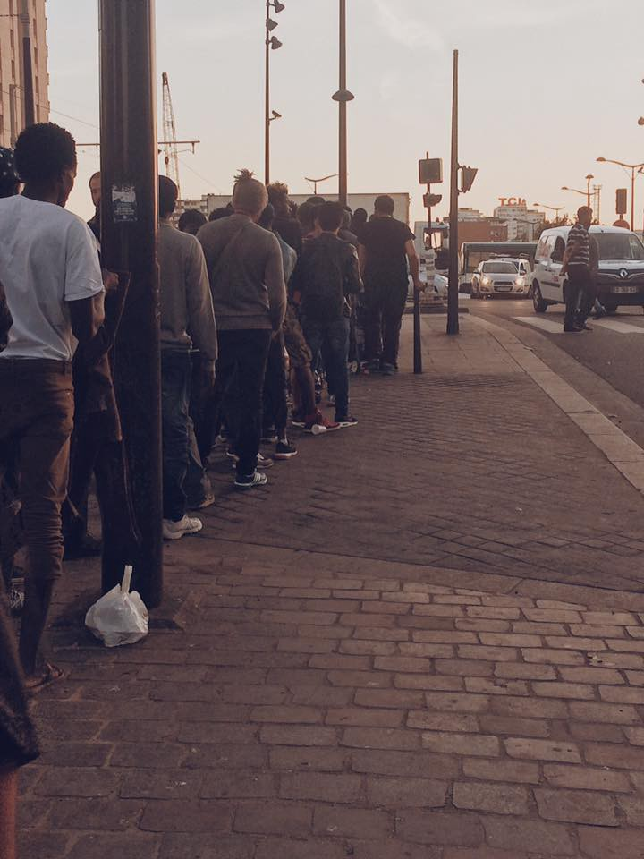

### AYS Daily Digest 17/06/17: Imminent deportations from France to Afghanistan

_More rescue operation in the Central Mediterranean / Demonstrations in Athens and Madrid / Updates from Porte de La Chapelle / Testimonies from Libyan camps / Libyan coastguard involved in human right violations / 75 breaches in one month of de\-escalation agreement in Syria / Updates from Hungary / And more news…_
### IMMINENT DEPORTATIONS FROM FRANCE TO AFGHANISTAN

[Calais migrant solidarity](https://calaismigrantsolidarity.wordpress.com/) reports of 4 deportation planned for the 20th, 21st, 23rd and 24th of June\.

4 Afghan men are facing direct deportation to Afghanistan, something that didn’t happen since 2009 in France\. All of them have been arrested at the train station of Calais on May 10th, and transferred to the Mesnil\-Amelot detention centre near Paris\.

Since the agreement between EU and Afghanistan, signed on October 4–5th 2016 to facilitate forced return of Afghan people to Afghanistan, some countries have started massive deportations to this unsafe country\. This internationally significant text was taken outside any democratic process and has not even been brought to the attention of Europeans parliamentarians: the same method employed for the EU\-Turkey deal\.

> More than 80,000 people are currently potentially concerned, including vulnerable people such as unaccompanied minors\. Among the details of this agreement, the EU is committing to build a terminal at the Kabul airport specifically dedicated to deportations\. 

Since December 2016, Germany alone has deported more than a hundred Afghans to Kabul, many of them were living in Germany for many years and had their families there — this happened despite many protests\. It took a bloody attack in the embassies district last month in Kabul, where 150 people died, to temporarily suspend the deportations\. France, who had not deported Afghani citizens for many years, had finally started to deport them in 2016\. On December 29th 2016, one person who was first detained for 41 days at the detention center in Metz and then transferred to Mesnil\-Amelot the day before their deportation\. Another one was released by a judge in extremis just before a flight to Kabul, while another one was deported by first being sent to Norway, where the authorities proceeded to deport them to Kabul\.

Since the beginning of 2017, this policy is accelerating\. The number of Afghans in detention centres has risen to 80\. Seventeen of them are actually at the Mesnil\-Amelot detention centre and 4 are facing deportation to Kabul soon\. One flight was booked for June 9th, cancelled and booked again for the next day, but it was cancelled again\.

At the same time, forced removals are again carried out via Norway, under the scope of the Dublin agreements\. Thus, a man who was housed at the CAO in Marvejols was in May deported to Norway, which deported him to Kabul on June 3th\.

The acceleration of deportations directly to Kabul, or via European countries, as a consequence of this agreement between the EU and Afghanistan, implies the total neglecting of the rights of the persons involved\.

> The agreement even makes it possible for the EU to carry out deportations without the agreement of Afghani authorities, when the Afghan consulate does not give a leave\-for\-readmission during four weeks\. Two of the 17 people detained at Mesnil\-Amelot are facing deportations in the next few days under this procedure\. 

4 flights have been scheduled for them starting in 3 days with 2 police force for each of them :
- 1 on Tuesday June 20th from Paris Roissy\-CDG to Kabul at 16:20 on Turkish Airlines \(Terminal 1\)
- 1 on Wednesday June 21th from Paris Roissy\-CDG to Kabul at 16:20 on Turkish Airlines \(Terminal 1\)
- 1 on Friday June 23th from Paris Roissy\-CDG to Kabul at 16:20 on Turkish Airlines \(Terminal 1\)
- 1 on Saturday June 24th from Paris Roissy\-CDG to Kabul at 16:20 on Turkish Airlines \(Terminal 1\)

Contact Turkish Airlines to make pressure on this company collaborating in deportations : [http://www\.turkishairlines\.com/](http://www.turkishairlines.com/) — [info\.par@thy\.com](mailto:info.par@thy.com) — [https://www\.facebook\.com/turkishairlines/](https://www.facebook.com/turkishairlines/) — [https://twitter\.com/turkishairlines](https://twitter.com/turkishairlines) — @TurkishAirlines / \#turkishairlines

Turkish Airlines, 8 Place de l’Opera 75009 Paris, France, 01 56 69 44 20

To challenge the government
 [sec\.immigration@interieur\.gouv\.fr](mailto:sec.immigration@interieur.gouv.fr) , [premier\-ministre@pm\.gouv\.fr,](mailto:premier-ministre@pm.gouv.fr) 01 49 27 49 27,

> Stop all deportation flights\! Freedom of movement and settlement for all\! 

Read more [here](https://calaismigrantsolidarity.wordpress.com/2017/06/17/urgent-imminent-deportations-from-france-to-afghanistan-deportation-imminentes-de-la-france-vers-lafghanistan-20-21-23-24-juin/) and [here](https://calaismigrantsolidarity.wordpress.com/2017/06/09/la-france-expulse-vers-lafghanistan-risk-of-deportations-to-afghanistan/)

**Sea**
### MORE RESCUE OPERATION AND DISEMBARKING IN ITALY

After a busy day on the sea rescuing 7 dinghies yesterday, MSF vessel Prudence approached and rescued one last boat last night\. The boat had taken on a mix of water and fuel\. A lady had to be urgently transported to a medical facility due to the effect of inhaling fuel fumes\.

■■■■■■■■■■■■■■ 
> **[MSF Sea](https://twitter.com/MSF_Sea) @ Twitter Says:** 

> > When we found the final boat last night, many were soaked in a dangerous mix of fuel &amp; water. A few more hours and it may have been too late https://t.co/yPEeO4SGTh 

> **Tweeted at [2017-06-17 10:31:10](https://twitter.com/msf_sea/status/876024413359091713).** 

■■■■■■■■■■■■■■ 

Moas boat Phoenix and a vessel from the Irish defence force disembarked in Sicily more than 1100 people rescued over the last few days \( [1](https://twitter.com/moas_eu) , [2](http://www.telesud3.com/cronaca/un-nuovo-sbarco-17giugno2017) \), while others arrivals were reported in Sicily and Sardinia\. Media sources [report](http://www.libyanexpress.com/libyan-coastguards-rescue-900-immigrants-off-sabratha-shores-on-friday/) that 900 people were rescued on Friday by the Libyan coastguard as well\.

**Libya**
### TESTIMONIES FROM LIBYAN HORRORS

People rescued from Prudence witnessed and reported the situation in Libya\.

> Libya is not a good country\. Every day people are killed, kidnapped and raped\. I want to tell everyone — don’t go there 

> In [\# **Libya**](https://twitter.com/hashtag/Libya?src=hash) we were kept in a courtyard with other 300/400 people\. If we made too much noise they would beat us\. It was hard there\. 

While EU governments and agencies pledge agreements with the Lybian governemnt, and accuse humanitarian SAR activities to be a pull factors, the inhumane conditions in the country’s refugee centres and camps are exactly what many people are escaping from\.

■■■■■■■■■■■■■■ 
> **[MSF Sea](https://twitter.com/MSF_Sea) @ Twitter Says:** 

> > "Why dont you bring them back to Libya?" Because #Libya and its horrors is exactly what many of them are escaping from. https://t.co/OukcMNDIZ5 

> **Tweeted at [2017-06-17 19:40:35](https://twitter.com/msf_sea/status/876162678787637248).** 

■■■■■■■■■■■■■■ 

### LYBIAN COASTGUARD INVOLVED IN HUMAN RIGHTS VIOLANTION

The [Panel of Experts on Libya](http://reliefweb.int/report/libya/final-report-panel-experts-libya-established-pursuant-resolution-1973-2011-s2017466) established pursuant to UN Security Council [resolution 1973](http://reliefweb.int/node/392573/) from 2011, states in its report of June 1 that the Libyan Coast Guard has been directly involved in human rights violations:

> Abuses against migrants were widely reported, including executions, torture and deprivation of food, water and access to sanitation\. The International Organization for Migration \(IOM\) also reported enslavement of sub\-Saharan migrants\. Smugglers, as well as the Department to Counter Illegal Migration and the coastguard, are directly involved in such grave human rights violation\. 

Read the full report [here](http://reliefweb.int/sites/reliefweb.int/files/resources/N1711623.pdf)

**Syria**
### 75 BREACHES TO THE DE\-ESCALATION AGREEMENT \(May 6 — June 6\)

■■■■■■■■■■■■■■ 
> **[Syrian Network](https://twitter.com/snhr) @ Twitter Says:** 

> > Map of the most notable de-escalation agreement #Breaches from May 6 to Jun 6, 2017
[sn4hr.org/?p=42532](http://sn4hr.org/?p=42532) https://t.co/jrauhrVh29 

> **Tweeted at [2017-06-17 17:36:40](https://twitter.com/snhr/status/876131493147496448).** 

■■■■■■■■■■■■■■ 

[The Syrian Network for Human Rights](http://sn4hr.org/) published a report in which it documents the most notable breaches to the de\-escalation agreement in Syria that were recorded in the first month of the agreement\. There were 75 breaches; 91% of which were at the hands of Syrian regime forces\.
 The report notes that the toll of violations for this month has been the lowest since March 2011, adding that there has been a progress on the humanitarian and human rights fronts in comparison with the violations committed in the past months\. The report says that charting maps for the areas excluded from the agreement, establishing a monitoring mechanism, holding those who breach the agreement provisions accountable, and including the national human rights organizations concerned with such matters in the coordination efforts, would remedy the flaws and weaknesses this agreement suffers as well as the other cessation of hostilities agreements\.

Read the full report [here](http://sn4hr.org/blog/2017/06/17/42532/)

**Greek Islands**
### NEW EARTHQUAKE OFF THE COAST OF LESVOS AND CHIOS

A 5\.0 magnitude earthquake with epicentre in the Sea between the islands of Chios and Lesvos and the Turkish coast was [recorded](https://www.emsc-csem.org/Earthquake/earthquake.php?id=599303&utm_source=newsupdate24.news) at 19:50, within the series of aftershocks following last week earthquake\. So far there are no reports of damages or casualties\.
### ARRIVALS AND REGISTRATIONS

 \)](assets/f484bea1bec4/1*9eVEABJGncX8IIWtYjPCng.jpeg)

Chios Today [\(Marianna Karakoulaki](https://medium.com/u/3f4f20a51309) \)

[Boat report Lesvos](https://web.facebook.com/boatreportlesvos/?fref=nf) wrote of one boat picked up by HCG at the south coast of Lesvos with 61 refugees onboard: 28 men and 20 women and 13 children; 31 from Syria, 10 from Congo, 3 from Iraq, 9 from Kuwait, 3 from Cameroon, 2 from Morocco and 1 from Palestine, Iran, and Ivory Coast\.

Official registration were 52 today: 23 on Lesvos and 29 on others islands\.

**SAMOS**

[Advocates Abroad](https://web.facebook.com/advocatesabroad/) reports new children arrivals at the hotspot in Vathy, on Samos\.

**Mainland Greece**
### DEMONSTRATIONS IN ATHENS

Demonstrations have been held today in Athens\. At 13\.00 around 100 people gathered in Platia Victoria to protest against detention centres in Greece and about the miserable living condition inside Petro Ralli, Athens detention centre\. This appointment was launched by the [Coordination of groups and individuals against detention centres](http://ssaekk.espivblogs.net/) \. The next appointment is launched for Friday June 23rd, h\.22\.50, at the Aliens Directorate in Petrou Ralli\.

During the gathering a timeline of Greek detention centres was handed out:

> \- 2003: Creation of the first immigration detention sites \(Police offices were always holding centres\) \. 

> \- 2012: Formal institutionalization of the “Immigration holding centres” \(when Chrysochodis was a minister\) for the imprisonment of migrats until their deportation \(Amygdaleza, Corinthos, Petrou Ralli\) \. 

> \- 2014: The detention centre of migrants in Elliniko \(initially for men, a few months later for women\) \. 

> \- 2012–2015: Struggles and revolts take place\. Many remain in obscurity\. 

> \- 2014–2016: At the detention centre of Elliniko visits happen in a regular base from people in solidarity\. This helps to put light on the issue, to hear voices, to the outbreak of struggles with support from people outside \(for freedom, better conditions, …\) 

> \- September 2017: Solidarity visits are forbidden\. The communication channels are cut\. Resistance is reduced\. 

> \- December 2016 — January 2017: Efforts are being made to lift the ban on visitors, with peak event the demonstration on 14/01/2017 

> \- 15 January 2017: The 26 imprisoned immigrant women are transferred from Elliniko to the main building of the Aliens Directorate in Petrou Ralli\. Petro Ralli is a mixed detention centre and around 350 people are held there\. 

> \- January — Today: Solidarity actions continue targeting Petrou Ralli detention centre\. 

A second demonstration was held in the Aspropyrogs area of Athens\. Hundreds of antifascists gathered in response to several racist attacks against refugees and migrants perpetrated by far\-right groups in the last weeks\. Some fascists allegedly tried to get close to the demonstrations but were pushed away\.

■■■■■■■■■■■■■■ 
> **[Nikolas Georgiou](https://twitter.com/mpodil) @ Twitter Says:** 

> > Demonstration earlier in Aspropyrgos(outskirts of Athens) against racist attacks on migrants by neo-nazi gangs #Greece https://t.co/XlO8q0k1vw 

> **Tweeted at [2017-06-17 22:04:16](https://twitter.com/mpodil/status/876198839111364608).** 

■■■■■■■■■■■■■■ 

### SOMEONE THREATENED TO CANCEL MY ASYLUM APPLICATION, CAN THEY REALLY DO THAT?

[Mobile Info Team for refugees in Greece — الفريق المتنقل لمعلومات اللاجئين](https://web.facebook.com/mobileinfoteam/) confirms that only the Greek Asylum Service are responsible for your application for asylum, family reunification or relocation\. Any other people, including the police and the staff of organisations, do not have control over your asylum application and cannot cancel it if they are angry/displeased with you\. Even the Greek Asylum Service can only stop your application if you fail to attend an appointment with them, if you fail to renew your white card on time, if they are not able to contact you to call you to an appointment, or if you specifically ask them to cancel it\.

**Volunteers needed**

Zaatar, organization operating in Athens, needs volunteers from August onwards \(minimum 2 weeks committment\)

Variety of tasks including childrens activities, sports, lunch preparation, teaching language classes, general handyman tasks and more\.

Please contact us to find out more:

volunteer@zaatarngo\.org — [http://zaatarngo\.org/](https://l.facebook.com/l.php?u=http%3A%2F%2Fzaatarngo.org%2F&h=ATNxhRw9EpOycCqkOnlI_OSZUEGViGVavHK39Pfi9Bb9oG72WtGYhybEUNk_tlyHafwQFD7suIY_Wgw8rfbvDvf9XBBbSGe45c-G6dV-QireBr4mbn0r4OC-zbUrtSOqLnTshINrfJI&enc=AZMkNvOY-sHemQ1E1kJ2gqVeYaOrzmiBNBE8kca_7uZah0QNxkMb4_47gUUCt6RCyG8lcTDh2I75EEOUodWN0_E1_phFL-AYLLJVacCr81zcKcV3cJORnuKwKZc-9s_c6X9WK3K_-mQlreCBpU72Lm5HDbrrrraNeQW5mn_LIIILow&s=1) — [https://www\.facebook\.com/zaatarngo/](https://web.facebook.com/zaatarngo/)

**Serbia**

[Bordermonitoring Serbia](https://twitter.com/bm_serbia) reports that 70 single men were picked up from Sombor camp, near the Croatian border and brought to Presevo camp yesterday\.

**Spain**
### DEMONSTRATION FOR REFUGEES IN MADRID

\(Refugiados Bienvenidos Espana\)

_\#QuieremosAcogerYa_ was the slogan of the demonstration held today in Madrid to demand the Spanish government to take in more refugees\. Spain, which had pledged to take in more than 17300, has so far only welcomed just over 1300, media sources [report](http://www.aljazeera.com/news/2017/06/madrid-protesters-demand-spain-refugees-170617203137700.html) \. After the huge demonstration in Barcelona last Febraury, today, with temperatures reaching 40°, more than 8000 people demonstrated through the streets of Madrid\.

**Hungary**
### FREE THE ROSZKE 11 STATEMENT

[Free the Roszke 11](http://freetheroszke11.weebly.com/) published a statement on the new trial of Ahmed H\., that we reported in last weeks digests:

> ​\[…\] it is necessary to doubt in the first instance court\-decision and support the efforts of Ahmed H’s defense\. But should we rest our hopes in the Hungarian legal system and believe in their independence? Didn’t the whole Röszke trials expose the Hungarian legal system as the willing servant of the government’s ambitions? We think that the “new” first instance trial will be as much dependent on the political atmosphere as the previous ones\. 

> In the end it is not a question of “law” and “objective reasoning” but rather a political struggle\. We believe in a world of equality, dignity and freedom for all\. We will keep on fighting until Ahmed H\. is free and we will not fall for the attempts of creating a fiction of legality\. 

> P\.S\. Sadly, we are not financed by Gyorgy Soros, even though some honest and truthful politicians are claiming otherwise\. So we still rely on your donations to help to cover the lawyer costs\.
 

> 
 

>  _Account holder:_ Rote Hilfe e\.V\. Ortsgruppe Frankfurt
 

>  _Catchword:_ Röszke 11
 

>  _IBAN:_ DE24 4306 0967 4007 2383 90
 

>  _BIC:_ GENODEM1GLS​ 

Read more [here](http://freetheroszke11.weebly.com/home/ahmed-hs-trial-act-two)
### RESPONSES TO THE NEW ANTI\-NGOs LAW

Media sources [report](http://budapestbeacon.com/featured-articles/ngos-vow-to-resist-new-law-stigmatizing-foreign-funded-civil-organizations/47727) that more than 212 NGOs joined the coalition of NGOs [Civilizàciò](https://web.facebook.com/civilizacio2017/) to protest against the law that compel NGOs to register as foreign\-funded\.

A manifesto has been published stressing the stigmatization implied by the new law:

> \[It is\] unnecessary, because Hungarian civil society organisations are already transparent in their operations, provide accurate information about their donors and finances in annual reports, and carry out their activities before the public\. Stigmatizing, because the law implies that organisations which work for the benefit of Hungarian society by receiving foreign grants for their work pose a threat to the country\. Harmful, because it undermines mutual trust in society and questions the right to freedom of expression\. 

A common strategy of response is yet to be identified, as the law affect differently each organisation\. Some are choosing to boycott the measure, refusing to register as foreign\-funded, others are more inclined to fulfill the obligation, while preparing legal appeals to both the Hungarian Constitutional court and the European court of human rights, others are preparing demonstrations and civil protests\.

**UK**

A video was [shared](https://web.facebook.com/ahtzaz.ali) today recorded on the flight from Heatrow to Istanbul before departure allegedly showing immigration officers and airport staff abusing an Afghan man\.

**France**
### REPORT FROM PORTE DE LA CHAPELLE

A volunteer [reports](https://web.facebook.com/profile.php?id=100009499466124) on the situation in Porte de La Chapelle:

Refugees are rising in numbers in Porte de La Chapelle\. I would guess 800 by now\. Camp is now claiming a long part of sidewalk, every inch of space under and around the highway, bridge, and rest of the green patches that one might find\. It looks a lot like Avenue de Flandres from last summer\.

Porte de La Chapelle \(Danika Jurisic\)
### ANOTHER UPDATE FROM PARIS:

[Solidarithe](https://web.facebook.com/solidarithe/) published a video on the daily struggle to gain access in one of the city’s camp:

> The need for information is getting bigger and more urgent each day as numbers and tensions rise\. And even with numbers rising rapidly, no one we are speaking to has been able to get inside the camp\. Some of whom have been trying everyday for the last two months\. 

> Here is a video of the daily morning struggle to get inside the camp, which lets in 30 \-50 people most days\. With an average of 150 people arriving every day in Paris, this ‘response’ is
 

>  not nearly big enough\. The government is failing to deal with this critical situation in a humane and dignified way\. 

> Since the media is not covering the situation anymore we feel its very important to share this\. 

### MAPS OF SOLIDARITY GROUPS IN FRANCE

Sursaut Citoyenne is mapping the solidarity groups throughout the country, indexing more than 1000 initiatives\.

Look at the interactive map [here](https://sursaut-citoyen.org/)

> **_We strive to echo correct news from the ground through collaboration and fairness, so let us know if something you read here is not right\._** 

> **_If there is anything you want to share — contact us on Facebook or write to: areyousyrious@gmail\.com\._** 

_Converted [Medium Post](https://areyousyrious.medium.com/ays-daily-digest-17-6-2017-imminent-deportations-from-france-to-afghanistan-f484bea1bec4) by [ZMediumToMarkdown](https://github.com/ZhgChgLi/ZMediumToMarkdown)._
