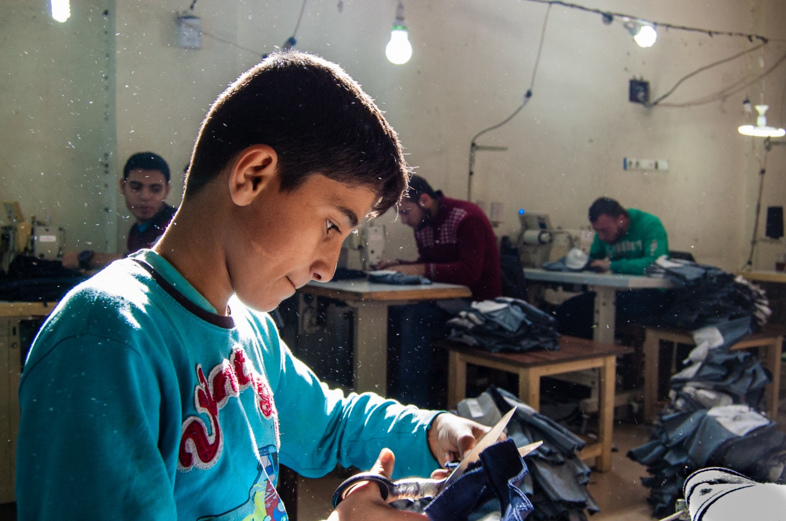
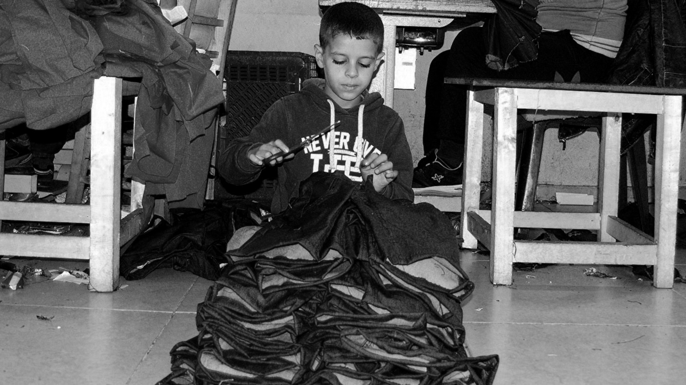
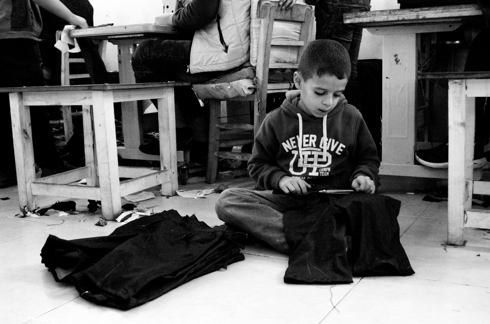
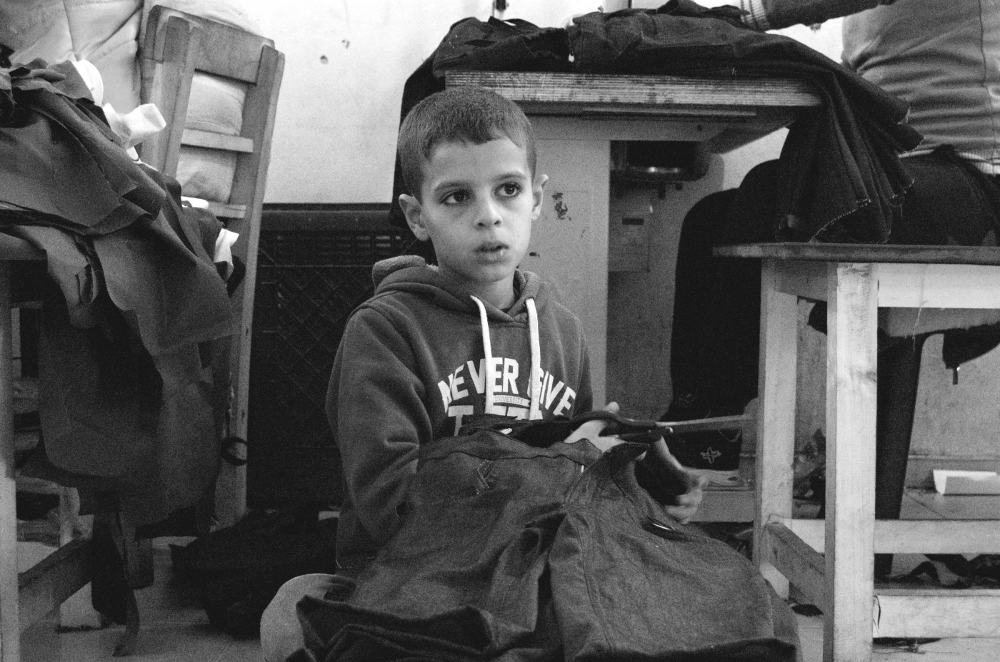
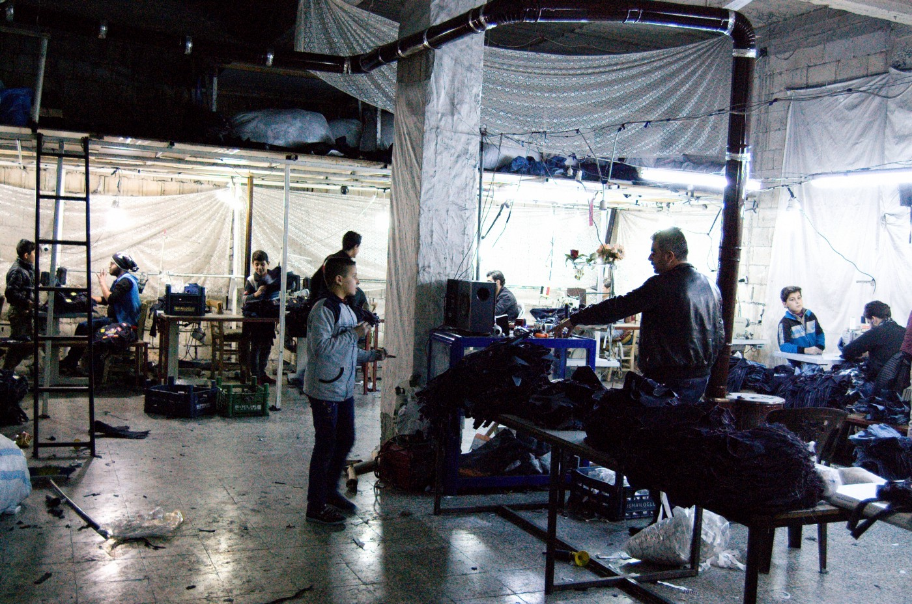
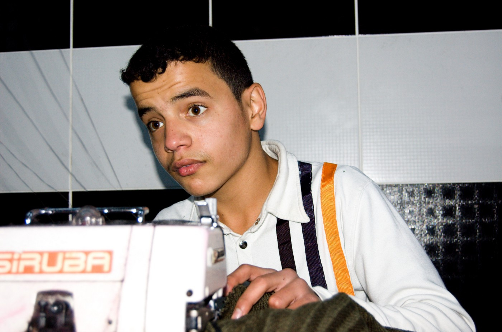
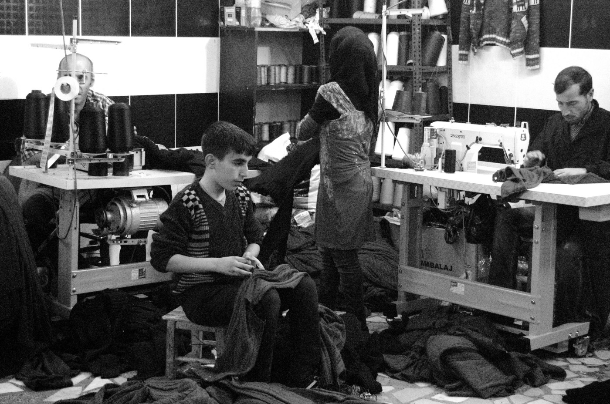
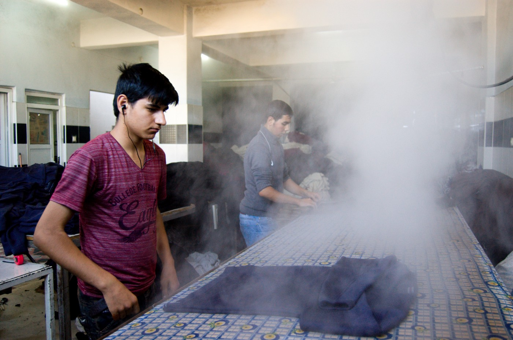
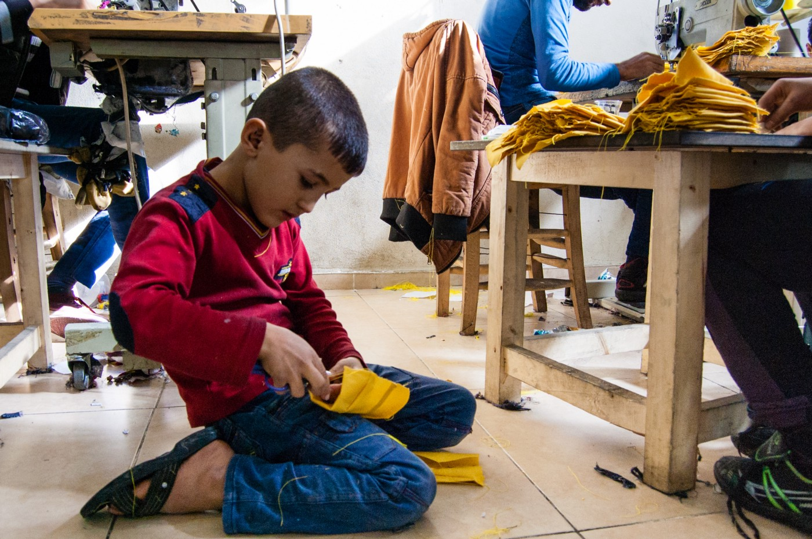
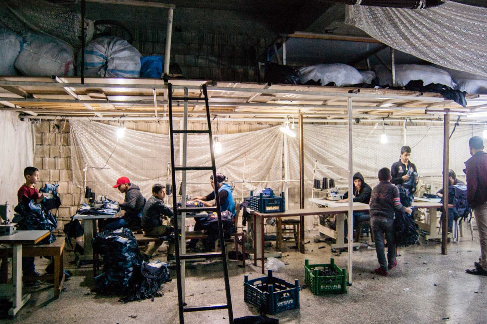

### AYS SPECIAL: Story about nightmares and children who do not have dreams

_In another special, AYS brings an extraordinary story by Andrea Panico about the exploitation of children in Gaziantep, Turkey, textile factories\. The material was produced during the Meltingpot/ Overthefortress investigation in Turkey with the title [“I don’t have dreams”, and is part of the publication with the same name](http://www.meltingpot.org/IMG/pdf/andrea_panico_-_childhood_lost.pdf) \. Panico writes about his nightmares and feeling of blame concluding that our only chance of redemption can be through fighting, telling, acting\. In resistance, to everything and everyone if necessary\._

Photo by Andrea Panico\.

By **Andrea Panico**

The idea of an investigation on the effects of the EU\-Turkey deal on the Syrian population was born in the refugee camps in Greece in the summer 2016\. I began to wonder what was happening to the thousands of lives stuck in Turkey, to the families who, that summer, saw the dream of re\-embracing their family members completely destroyed\. It became an obsession, a seeds\.

Progetto Meltingpot Europa decided to fund the mission I co\-ordinated and that brought me and my other three collaborators to the Syrian border, where at the horizon you can still see the smoking mountains\. Smoking because of the ongoing airstrikes\. We encountered many difficulties moving into a territory where there is an actual internal civil war being fought\. We were stopped at Kilis, transported to the police station and questioned for 8 hours\. But that is not the thought that still wakes me up sometimes at night, blocking my lungs and preventing me from breathing\. It’s the exhausted faces of the children working in the factories of Gaziantep, Mohammed and his decision to go back to Syria after arriving to Idomeni, the kids and their 50 kilos load that they transported as ants around the city\.

So, like it or not, this document is the result of all the bad dreams that have begun during the most extraordinary period in my life, during months of tears and smiles and hugs and vows of eternal brotherhood\. It represents all the promises to not forget or leave behind anybody’s story\.

However, before all of this, it is primarily a Western European citizen blaming himself and all those millions who has allowed all the stories reported to take place\. There are no innocents among our illuminated discussion groups in universities, organisations, or editorial offices\.

**Our only chance of redemption can be through fighting, telling, acting\. In resistance, to everything and everyone if necessary\.**

Swim out, stroke after stroke, of the ocean of rhetoric and apathy, to show the world that every man everywhere is not equal to another man\.

Each typed word is linked to a thought that comes from a reasoning\.
At the basis of every process of thoughts, there has always been and there will always be the firm condemnation of the vile agreements among the European Union countries, of those who continue to be held innocent and detach themselves from the deaths at the sea because others are deciding for them, of Turkey and of all its ruling class\.
#### A diary page

_I was there in Karkamis\._

_A miserable piece of land, spitting distance from Syria\. When they stopped us, Turkish helicopters were still flying high over their heads to devastate the little we left them\._

_“What do you think about the Ottoman Empire? and about what we do in Syria?”\. That bastard wearing uniform was staring at each one of us to find a flaw in the bullshit we had just told him\. And I would have loved, I wanted to spit in his face so badly, in every single thought I had\. But I did not do it\. I did not say a word\. Silent\._

_Two days later, I do not remember when, we went into those factories, into those dumps where the stale smell of mould and rotten parts mixed with pre\-teen sweat and the machine’s vapours\._

_I was completely disoriented\. ISO, exposure and shutter speeds, and fuck the reason why I chose to embark on that jouney\._

_I start to devour their faces and plunder their souls\. I took photos of those kids like they were animals in a cage and they remained silent and still under the blinding flash light of the Nikon, because they have to work, sew and produce\._

_And on the way out, greet their employer who kindly let us inside the premises rather than kicking him in the teeth and shouting what my anger yelled\._

_I came out crying and they were the most bitter tears of my life\. Worse than those wept on the day I lost someone I loved, worse than any disappointment\. Worse because those who had gone lived their life fully\. It was lived with merit and guilt\._

_But not at 7 years old\. At 7, you are so vulnerable, a little baby bird to whom they are, to whom WE ARE, breaking the wings in such a sadistic way\._

_At 7 you should not have any idea of how the world continues to fail, day after day\. At 7, in your eyes, there should be only the sea and castles made of sand and “I want” and “I would like” and mum and dad\._

_Their faces hunted me down for weeks, months\._

_With the time I realise it\. We are the failure that others have planned and that we have accepted\._

**_\(The author Andrea Panico give a permission to AYS to use all the photos, while the article was written for AYS by Panico\)_**

> **_We strive to echo correct news from the ground, through collaboration and fairness, so let us know if something you read here is not right\. Anything you want to share — contact us on Facebook or write to:areyousyrious@gmail\.com_** 

_Converted [Medium Post](https://medium.com/are-you-syrious/ays-special-story-about-nightmares-and-children-who-do-not-have-dreams-e633399e0c98) by [ZMediumToMarkdown](https://github.com/ZhgChgLi/ZMediumToMarkdown)._
