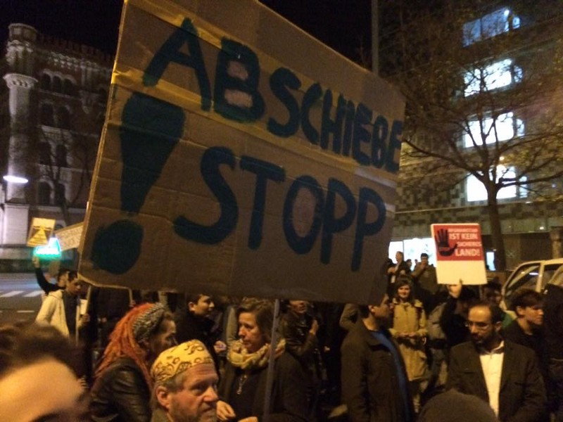
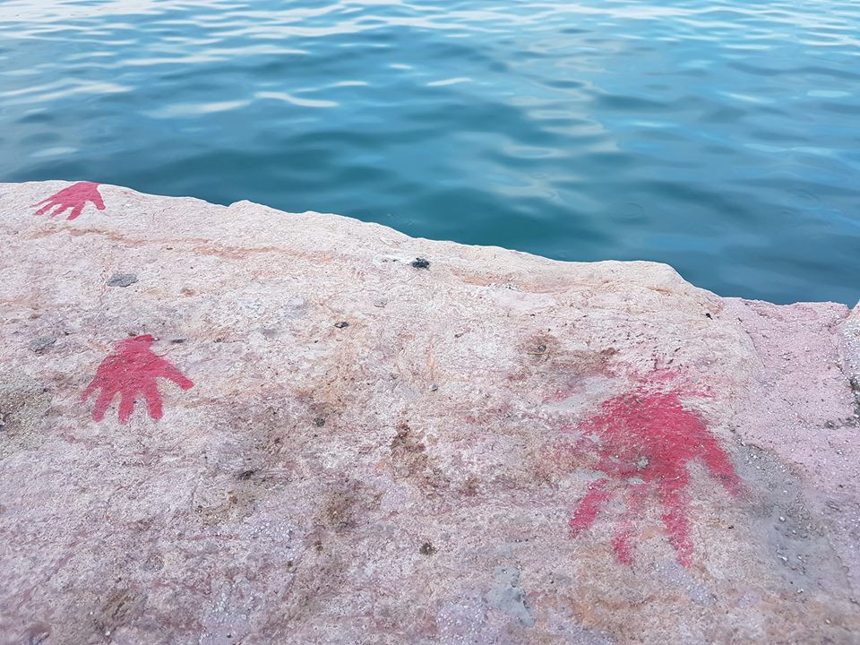
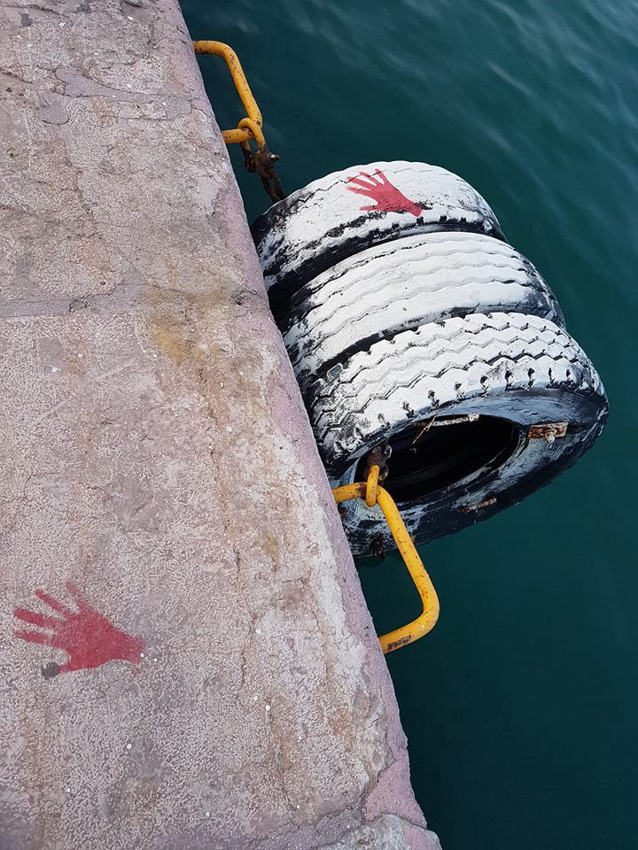
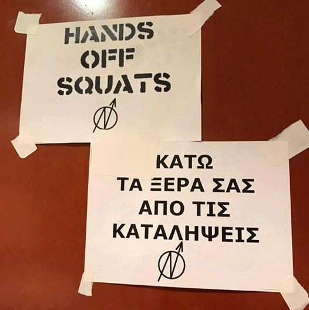
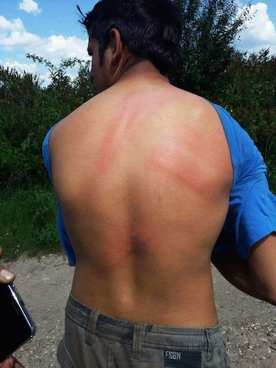
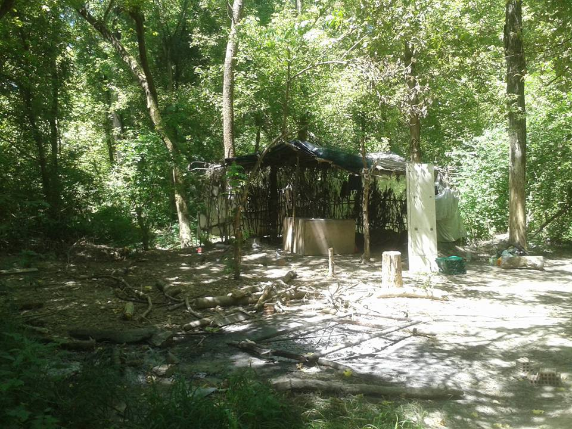
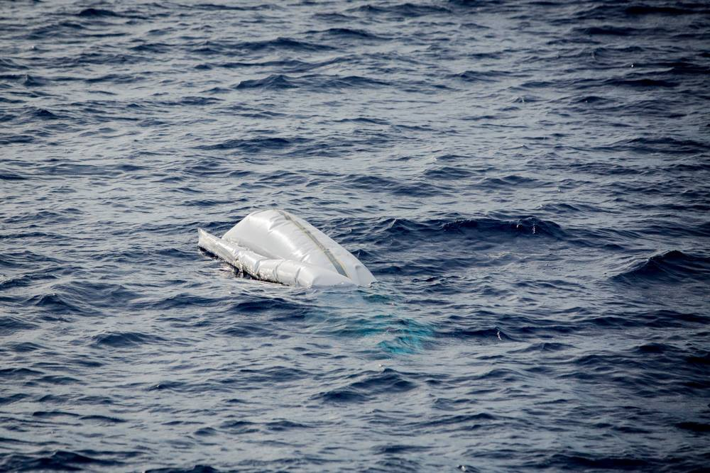

### AYS Daily Digest 18/06/17: Conditions in Swedish detention centres deteriorating

_Police violence at the border between Croatia and Serbia / High Court hears Help Refugees’ challenge to reopen the Dubs Scheme on the 20th / Refugee squats in Athens call for an international day of action against evictions / And more news…_

Austrians protest against deportations in March\. Photo by Arye Wachsmuth
#### Feature
### Detention centres in Sweden are prisons

[Swedish Radio](http://sverigesradio.se/sida/artikel.aspx?programid=1650&artikel=6718407) says the conditions in detention centres where people are placed before being deported have radically changed over the last couple of years, with these centres increasingly becoming like prisons\. Staff members tell the radio that one of their main task and purpose was to talk, create relationships and prepare people in custody ahead of their deportation — now, they increasingly feel like prison guards\. Clashes between staff and people who are about to be deported have increased and are now common events\. The staff says the only training they have received in the last couple of years is on security and defense — nothing about how to treat vulnerable people\.

A representative from The Swedish Network of Refugee Support Groups \(FARR\), says staff should get education on how to treat people that might be suffering from PTSD or other psychological problems caused by their extreme situation, instead of learning how to wrestle down people\.

The daily newspaper DN reveals that staff at the detention centre in Kållered are encouraged by higher\-ranked employees to provoke people in custody\. Several of them denounce this horrible situation and point out how much power they have over people who are both traumatized and in detention\.
#### Greece
### Arrivals

52 people were rescued off Crete and transferred to Athens\. Two boats arrived on Lesvos this morning, including one on the north coast with 55 people on board\. Refugee Rescue, a sea rescue team, says people were forced to stay at the Stage 2 transit area yesterday night, as the Moria camp was apparently full\.

Handprints as a statement against deportations on Chios\. Photo by Cicilie Bråten
### Hands off the squats

Squats in Athens say that in the last few days new information was leaked on court decisions on the eviction of three of them, Papoutsadiko, Zoodoxou Pigis 119 and City Plaza\. They therefore call for [a protest in front of the Ministry of Migration](https://www.facebook.com/events/629127390617724/) and for an International Action of solidarity towards all squats and against evictions on the 23rd of June\.
### Field Coordinator needed for Softex

[Intervolve is looking for a an experienced Field Coordinator](https://docs.google.com/document/d/1sDVAV-j-K1O0Q5n7kPYgTLSnBkOP9pEvEOwq21478pc/edit) for a minimum of three months\. Applications are until the 25th and more information can be found on their Google Doc\. As always, more volunteering needs can also be found on [Greecevol](http://greecevol.info/) \.
#### Croatia
### Police violence at the border

Photo by Rigardu

A new case of police violence has been documented in Croatia\. Five men including three minors crossed the border between Serbia and Croatia by train but were discovered at a train station near Zagreb\. They then asked for asylum but were brought back to the border in a police van and beaten with batons\. One of the minors was ill and beaten until he fell to the ground\. The policemen then told them to “go back to Serbia” and not to come back, forcing the men to cross the border\.

The German NGO Rigardu reports on a similar pattern, with Croatian police bringing refugees to the border, beating them up and pushing them back to Serbia\. They have received several photos, including the one above\.

Are You Syrious? and Welcome\! initiative already published a [report](http://welcome.cms.hr/wp-content/uploads/2017/05/Izvje%C5%A1taj-o-novom-valu-nasilja-prema-izbjeglicama-na-granicama-Republike-Hrvatske.pdf) \(in Croatian\) on police violence last month, while MSF warned of a recent “dramatic increase in violence”, always according to the same pattern, with police “hitting with batons, destroying cell phones, snatching money”\.
#### Italy
### Situation in Gorizia

Collettivo SPAM met with refugees in Gorizia, at the border with Slovenia, and says refugees living in governmental centres for accommodation of asylum seekers \(CARA\) and in the “jungle” are steadily increasing\. Around 20 refugees are arriving each day in the jungle, with many kicked out of accommodation centres and others forced to live there after the eviction of the bunker, a basement that was managed by volunteers\. The jungle is missing food and water and there is a constant danger coming from inundations and attacks by wild animals\.

Photo by Collettivo SPAM
#### UK
### Shocking video of deportation flight

Ahtzaz Ali, a passenger on a Turkish Airlines flight from London to Istanbul filmed an an asylum seeker crying for help as he was being deported\.

He writes: “There was a man who was clearly upset on board the plane but wasn’t being abusive to the crew or anybody else\. All of a sudden, someone who seemed like they were an immigration officer came and started physically abusing the man by slapping him and pushing his face down whilst he was crying and shouting that he wouldn’t be safe going back to Afghanistan \(…\)

The video clearly shows that the man who was an asylum seeker was distressed and very upset and seeing the way he was being handled made myself and other passengers feel very uneasy and we tried to speak out\. The immigration staff continued to physically abuse the man by slapping his face and holding his body down and eventually they took him off the plane whilst he was shouting and crying for help\.

The journey after he was taken off the plane was very upsetting as passengers were in tears, clearly disturbed by what they had seen\. It was a violation of this man’s human rights and shocking to see how he was being treated”\.
### High Court challenge to reopen the Dubs Scheme

[The Sunday Times](https://www.thetimes.co.uk/edition/world/refugee-children-hunted-in-calais-as-france-tries-to-prevent-another-jungle-rvmcqtf8s) reports that on Tuesday, the High Court will start to hear a challenge from Help Refugees, calling on the government to reopen the Dubs scheme and give refuge to 3,500 unaccompanied child refugees in France, Italy and Greece\. Just 200 child refugees have been rescued so far\. Help Refugees adds that it is also challenging the Government’s failure to implement the scheme quickly and to give any written reason to unaccompanied minors who were refused relocation, nor any formal mechanism by which they could challenge refusals\. The Sunday Times reports on the difficult situation unaccompanied minors are facing in Calais, where they face police violence, while the state prevents associations from distributing food and water\.
### Petition to honour the Syrian refugee resettlement programme

In related news, One Human Race calls on the UK government [to continue and speed up the Syrian Vulnerable Persons resettlement programme](https://www.change.org/p/yvette-cooper-mp-the-uk-govt-must-honour-speed-up-the-syria-refugee-resettlement-programme) that promised to resettle 20\.000 Syrian refugees from the Middle East to the UK by 2020\. The UK opted out of the EU relocation scheme and has only resettled 5,453 Syrian refugees under its own programme so far\.
### Volunteers needed for refugee summer school

[Springboard Youth Academy](https://www.springboardyouth.com/) is launching a summer school for refugees who recently arrived in the UK \. In this programme, refugees “ _attend an action\-packed month of educational and social activities that cater to their support needs and specific academic requirements, while preparing them for the upcoming challenge of starting school in the UK”_ \. The organization is currently looking for volunteers, in particular for people with fluency in Arabic, Farsi, Amharic, Tigrinya, Albanian, Somali or Vietnamese\.
### Special report on Lithuania

[In a special report for Are You Syrious](ays-special-refugees-do-not-find-home-in-lithuania-31ecb7185ee8) , one refugee relocated to Lithuania told us about his experience in the country\. In particular, he talks about the fact that the only refugee reception centre is located next to a NATO base, a poor choice for refugees still traumatized by war\. He also describes the discrimination they are facing and the lack of housing support and job opportunities, which leads of them to leave the country\.
#### Sea
### NGOs going back to the rescue zone

Photo by Proactiva Open Arms

Both Sea\-Watch 2 and the SOS Méditerranée boat Aquarius are heading back towards the search and rescue area off the Libyan coast\. This morning , Sea Watch 2 discovered an almost completely immersed dinghy, with no people in sight\. 4,000 people have been rescued over the past three days by coast guards, NGOs and merchant ships\.

Photo by Sea\-Watch 2

> **We strive to echo correct news from the ground, so let us know if something you read here is not right\. Anything you want to share — contact us on Facebook or write to: areyousyrious@gmail\.com** 

_Converted [Medium Post](https://areyousyrious.medium.com/ays-daily-digest-18-6-2017-conditions-in-swedish-detention-centres-deteriorating-9c6f5c08a465) by [ZMediumToMarkdown](https://github.com/ZhgChgLi/ZMediumToMarkdown)._
