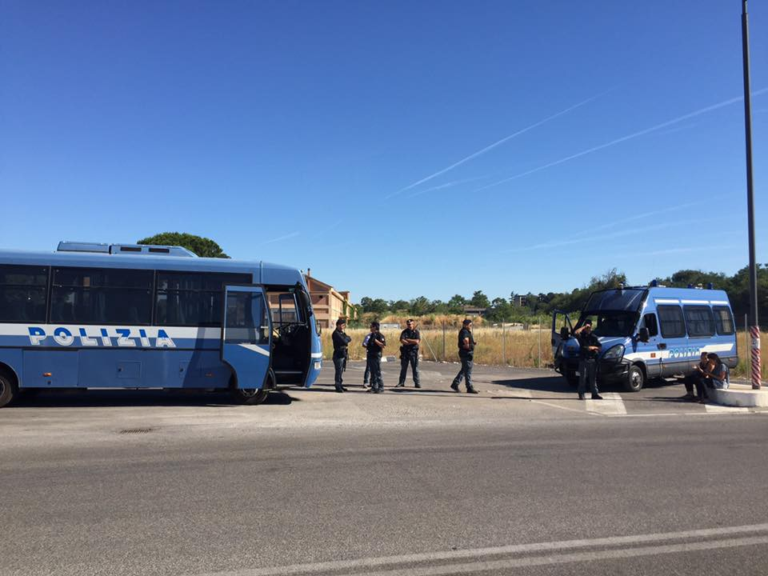
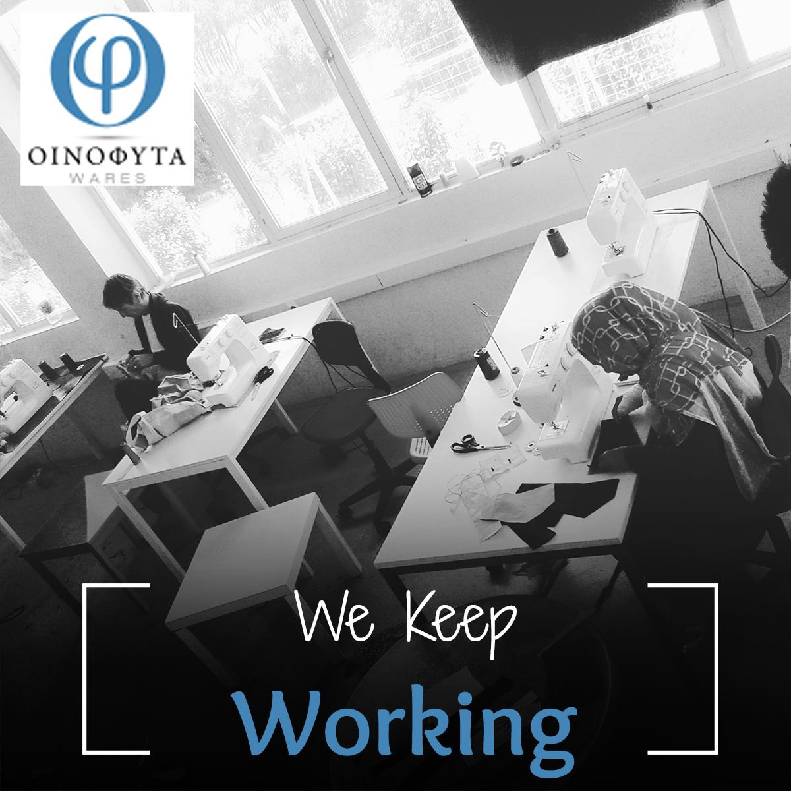
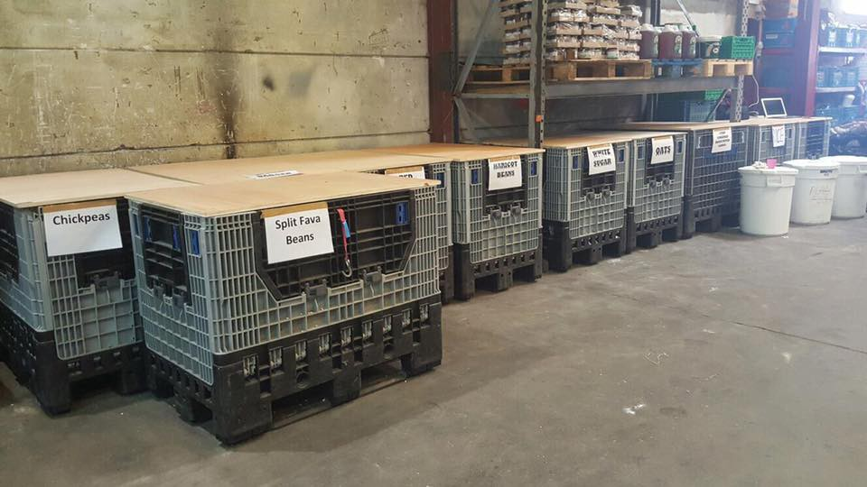
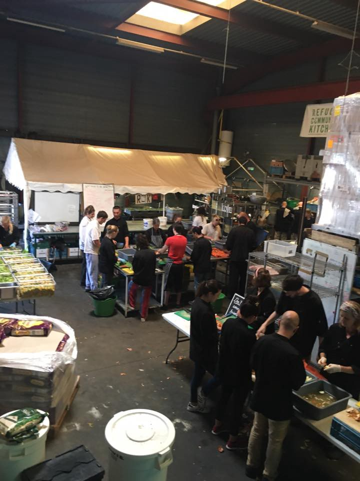

### AYS Daily Digest 19/6/17: Rome evicts its refugees; people choosing death over return to Libya

_Pressure towards refugees manifests in police raids in Rome / Mediterranean countries hide collective responsibility for deadly policies / Family reunification to be restricted to 70 per month / Refugees still suffering from smugglers and violent police along the ‘Balkan route’ / Ahead of the World Refugee Day / And more news…_

![“Since yesterday our crew is in the search and rescue area\. During this time they had to make several rescues under bad weather conditions\. Yesterday, 74 people were admitted, who were then transferred to Von Hestia\. Then 241 people were supplied with life jackets and and have then been transferred to the Phoenix\. Today, our crew had to take care of 123 people on a rubber boat with waves of up to 2 meters\. People will currently stay on our ship until a ship can come to take them to the nearest safe port\.” — [Jugend Rettet e\.V\.](https://www.facebook.com/JugendRettet/?fref=nf) \(Photo by [Jugend Rettet e\.V\.](https://www.facebook.com/JugendRettet/?fref=nf) \)](assets/8d49d67b74e1/1*tKnHAFDSMmzFX-7zD54NVg.jpeg)

“Since yesterday our crew is in the search and rescue area\. During this time they had to make several rescues under bad weather conditions\. Yesterday, 74 people were admitted, who were then transferred to Von Hestia\. Then 241 people were supplied with life jackets and and have then been transferred to the Phoenix\. Today, our crew had to take care of 123 people on a rubber boat with waves of up to 2 meters\. People will currently stay on our ship until a ship can come to take them to the nearest safe port\.” — [Jugend Rettet e\.V\.](https://www.facebook.com/JugendRettet/?fref=nf) \(Photo by [Jugend Rettet e\.V\.](https://www.facebook.com/JugendRettet/?fref=nf) \)
### FEATURE: Pressure on refugees builds up in the ‘eternal city’

The camp at Piazzale Maslax in Rome, where refugees were staying, was evicted today with no previous notice or warning\.

Police forces arrived and evicted all the people from the area, providing no information as to why it was happening, what their overall intention was, where they were taking the residents of the camp, and so on\.

According to the volunteers at Baobab, the action came from the police headquarters of the City of Rome, who then in turn referred to the owner of the area, the national railway company\.

 \)](assets/8d49d67b74e1/1*OI7ssYL5BBeRcObAhh-HQA.jpeg)

\(Photo and video by [Baobab Experience](https://www.facebook.com/BaobabExperience/) \)

According to those on site, the police did not have any warrant to justify taking people’s belongings and personal effects\. No NGOs, representatives of social or cultural institutions, or other related organizations were present, nor translators or mediators to assist in the police process that occurred\. The volunteers asked the police about what was going on and said they would sue them in court, and then they spontaneously staged a sit in, trying to block the access to AMA as the vehicles were coming closer to remove the remains of the camp\. Senators Manconi and Cervellini and Deputy Fassina also intervened, Baobab reports\.

Among those who were taken to the police, there was a man who was previously beaten by the police during the eviction of via Vanina\. He was sleeping at the Baobab camp because today he had a scheduled appointment at the hospital due to seeing problems — it has been a week that he cannot see normally\. Regular papers and the risk of losing the sight in one eye were not enough for the police, the volunteers argue, and he was taken with the others in the end\.

Later on, the doctors who were explained the situation agreed to do the check up even though the man missed his appointment\.

### SEA
#### Europe should direct safe rescues, not Libya\!

> This is the reality of the Mediterranean Sea\. People would rather die than continue living in the hands of smugglers in Libya\. — [MSF Sea](https://twitter.com/msf_sea/status/876819468898402305) 

“Recent incidents show how wrong it is for EU countries to entrust the lives of those in need of rescue to Libyan coast guard forces when there are safer alternatives,” Human Rights Watch [concludes](https://www.hrw.org/news/2017/06/19/eu-shifting-rescue-libya-risks-lives) after reports that the Libyan forces had engaged in reckless conduct during rescue operations that endangered people being rescued in international waters in the Mediterranean\.

NGOs have provided proof that Libyan coast guard officers fired shots into the air, and also collected testimonies from survivors that the officers had fired shots into the water after panicked people had leaped into the sea\.

The incidents indicate that Libyan forces lack the capacity to safely and effectively perform search and rescue obligations\.

> As a general rule, Libyan forces disembark people they rescue or intercept at sea in Libya, where they face arbitrary detention in abysmal conditions and a well\-documented risk of serious abuse, including forced labor, torture, and sexual violence\. 

> If Italy is directing a rescue operation, it should ensure safe rescue and disembarkation, and not hand over command to Libyan coast guard forces, except in situations of imminent loss of life and the absence of alternate rescue vessels\. 

> — _Humans Rights Watch_ 

The UNHCR called on all countries to “allow all civilians fleeing Libya access to their territories\.”

■■■■■■■■■■■■■■ 
> **[MSF Sea](https://twitter.com/MSF_Sea) @ Twitter Says:** 

> > UPDATE: After a long day in Reggio Calabria 300 #people are left on board the #Prudence and won't be able to disembark until tomorrow. https://t.co/5WqieSdQ9U 

> **Tweeted at [2017-06-19 19:32:48](https://twitter.com/msf_sea/status/876885496961564674).** 

■■■■■■■■■■■■■■ 

### GREECE
#### Lesbos

98 people were officially registered on Lesbos today\.

One boat arrived with 31 refugees on board: 10 men, 11 women, and 10 children\. In the past five days Lesbos has seen new arrivals every day and 397 people were registered on the island alone since June 14\.

On Lesbos, apart from those who arrive, many of those who are to be returned to Turkey await to see their cases unravel\. Syrians who have lost their right for asylum in Greece have appealed to the supreme court in Greece to reconsider their claims, since their only other option would be deportation to Turkey—not deemed safe for many of them\.

Concerning that, the head of the Greek Asylum Service, Maria Stavropoulou [has said](http://www.aljazeera.com/video/news/2017/06/greece-urged-send-refugees-turkey-170619100716512.html) that “every effort must be made to achieve as common European asylum policies as possible\.” She went on to say that the only other option is a total fragmentation, when the question of asylum is at hand, because everything else \(that is, other rights and legal aspects\) depends on the grounds of asylum and the policies linked to it\.

Due to recent happenings at the squat beside Kara Tepe on Lesbos, the [No Border Kitchen Lesvos](https://www.facebook.com/NBKLesvos/?fref=nf) team wants to make it clear that, though they continue providing food, gas, and emergency support to the building’s residents, they are in no other way present or affiliated with the so\-called “Social Centre”/”Big Squat” besides Kara Tepe\. 
[Their statement](https://www.facebook.com/story.php?story_fbid=954814834658306&id=689281511211641&hc_location=ufi) says:

> \- No Border Kitchen Lesvos are committed to non\-violent principles in our solidarity work with refugees
 

> \- Following acts of actual and threatened violence on behalf of a small group of individuals living in the ‘big squat’, No Border Kitchen Lesvos decided as a collective to stop our work in this building some months ago 
 

> \- No members of No Border Kitchen Lesvos now live or work in this building 

#### Athens

> “From 18 to 22 June, five Athens restaurants will host in their kitchens refugees with talent in cooking, enriching their menu with dishes inspired by the Syrian, Iranian, Somalian, Kurdish and Afghan tradition\. 

> The Refugee Food Festival is an idea of the French organization Food Sweet Food that claims that sharing food is the best way to create bonds and discover other cultures\. The festival takes place in Athens, along with 12 other European cities, with the opportunity of World Refugee Day\.” 

> _— [METAdrasi](https://www.facebook.com/metadrasi/?fref=nf)_ 

 ‎\)](assets/8d49d67b74e1/1*PYVT_wcSd5ct8IXlwVpzZw.png)

\(By [Greek Forum of Refugees](https://www.facebook.com/Greekforumofrefugees/?fref=nf) ‎\)
### White card: how and when to renew it?

The [Mobile Info Team](https://www.facebook.com/mobileinfoteam/?hc_ref=PAGES_TIMELINE&fref=nf) reminds everyone about the importance of renewing their “white card” in time:

> “It is possible to renew your white card earlier than the expiry date \(written on the right\-hand side of your card where it says “Date of Expiry”\) \. To do this you must go in person to the nearest office of the Greek Asylum Service\. If it will not be possible for you to go on the date of expiry, you may also go up to 6 days before it\. If you do not go to renew your white card at the latest by the day after its expiry, your case will be closed and you will have to ask the Asylum Service to reopen it\. According to Greek law, you may only have your case reopened once and this must be within 9 months of it being closed, otherwise the procedure will become more complicated\.” 

#### Restricted family reunification

The Mobile Info Team is also running an important petition against the slowing down and restriction of the family reunification scheme between Greece and Germany\. [**Here is the petition**](https://www.change.org/p/family-reunification-from-greece-let-them-be-together-again) **\.**

As [we have reported earlier](ays-digest-29-5-2017-new-cases-of-police-violence-on-the-croatian-border-31e46ae20c18) , Germany recently capped the number of refugees eligible for reunification at 70 people per month and Greece has accepted these conditions and agreed to them\.

According to some sources, there are those whose cases have been approved, but who might have to wait for more than a year to be reunited with their family members due to additional imposed restrictions\.

Flights to Germany will be scheduled according to the order in which Germany approves the applications; at the moment people who were accepted in November are flying\. Soon they will start to send people whose applications were approved in December, [Greek sources say](http://Greek Forum of Refugees) \.

As we all know, such a decision and unreasonable limitation goes against European laws, including people’s right to a family life\.

#### Support refugees at Oinofyta

To mark World Refugee Day, the [Oinofyta Wares team](https://www.oinofytawares.com/the-team) invites everyone to support the refugees at their camp by purchasing the bags they produce\. On this occasion, they are selling two bags for the price of one\.

[Oinofyta Wares](https://www.facebook.com/oinofytawares/?hc_ref=SEARCH) is a small business run by the residents of Oinofyta Refugee Camp, many of whom are skilled tailors\. 
Read their story [**here**](https://www.oinofytawares.com/about-us) **\.**

> The bags are made from up\-cycled refugee camp tents and clothing that we were unable to distribute from our warehouse\. All our bags are reinforced using ground sheets from the tents, so nothing goes to waste\! 

#### Urgent need for experienced volunteers\!

Our friends at [Open Cultural Center — OCC](https://www.facebook.com/OpenCulturalCenter/?ref=page_internal&fref=nf) are looking for team members at their cultural centre in Polykastro\. Here’s what they are looking for in a potential new OCC colleague:

> \- experience in running cultural and leisure activities
 

> \- good knowledge of English and/or Arabic
 

> \- experience in the field of education, culture, Sports and leisure, preferably with academic certificate
 

> \- previous experience in international volunteering in the field of education
 

> \- ability to adapt to multicultural environments\. 

> Teamwork, initiative, communication skills, flexibility and adaptation to tasks are highly appreciated\. 

> Contact: volunteers@openculturalcenter\.org 

### SERBIA

A recent [poll](http://rs.n1info.com/a277073/Vesti/Vesti/Gradjani-Srbije-o-migrantima.html) in Serbia shows that about 3/5 of the population support and feel for the refugees, while 1/3 of them are scared that there are criminals and terrorists among them\. The state secretary reminded the public that no refugee or migrant has been behind the recent attacks in Europe\.

Authorities estimate that among the approximately 7,000 refugees currently staying in Serbia, there are 980 children without parents and about 3,000 minors\.
### CROATIA
#### ‘Safety and trust’ manifests in grown men beating unarmed boys

The number of testimonies that go to support claims that police violence has not stopped is growing each day\. We have received more information, details, and corroborating testimonies that speak of intentional and organized beatings by Croatian police officials in the east of the country\. Most of the stories we have heard, including the most recent ones, describe being taken in a van and brought to another location, where a group of police officers standing in two lines forces the unfortunate young boys to walk through them, giving them hard beatings with police bats, hitting and punching them, leaving them barely able to walk, and threatening them if they ever come back to Croatia\.

However, all of those taken by the police are photographed before they are let go in the end\.

We are appalled by what we hear and deeply disappointed by the lack of a concrete reaction from those responsible for the police in Croatia\.
#### Integration as a shared responsibility

This year’s [Refugee Weeks](http://cms.hr/system/article_document/doc/419/Program_4._tjedni_IZBJEGLICAma.pdf) in Croatia is especially focused on the need to create a system of inclusion that entails responsibility of all stakeholders — from individuals, to institutions\. Croatia lacks a program of systematic integration and today’s refugees in the country achieve integration through their own efforts in fields opened up to them by volunteer organizations and civil society networks\. The state is to a large extent “idle,” hiding behind the excuse that Croatia is a transit country and nobody wants to stay there\. Less than a third of those who received asylum in Croatia moved to another country afterwards, in spite of the poorly designed and uncoordinated integration policies currently in place\. This alone is evidence that real integration in the country remains a high priority for all segments of society\.
### FRANCE

[Refugee Community Kitchen](https://www.facebook.com/groups/RefugeeCommunityKitchen/permalink/1452333864834112/) reports that,

> With the impending court case, initiated by the collective of associations here on the ground, to uphold the right to distribute food and non food aid free from police harassment and time constraints, we have been informed by the police that the prefecture has had to order all police to not obstructed or intimidate in any way\. They clearly did not fancy being shamed in court about their illegal and inhumane actions\. 

 \)](assets/8d49d67b74e1/1*lsG7FR-W2S2N_GsqfwcjZQ.jpeg)

\(Photos by [Refugee Community Kitchen](https://www.facebook.com/groups/RefugeeCommunityKitchen/) \)

> This means we can carry on with or essential work each and every day, with the only constraint being that we finish by 8pm\. The food at the moment is really a life line to a growing community of displaced people that have no other support or infrastructure, the food is vital, the water is vital\! 

### GENERAL

> War, violence and persecution have uprooted more men, women and children around the world than at any time in the seven\-decade history of UNHCR 

A record 65\.6 million people worldwide were forcibly displaced from their homes owing to conflict or persecution by the end of 2016, the [United Nations](http://www.aljazeera.com/topics/organisations/un.html) said\. The number includes 22\.5 million refugees, 40\.3 million internally displaced people and 2\.8 million asylum seekers\. Syrians continued to be the largest forcibly displaced population, with 12 million people at the end of 2016, while the situation in South Sudan is the fastest growing refugee crisis and displacement crisis, according to the [UN refugee chief](http://www.unhcr.org/news/stories/2017/6/5941561f4/forced-displacement-worldwide-its-highest-decades.html) \.

> **_We strive to echo correct news from the ground through collaboration and fairness, so let us know if something you read here is not right\._** 

> **_If there is anything you want to share, contact us on Facebook or write to: areyousyrious@gmail\.com\._** 

_Converted [Medium Post](https://areyousyrious.medium.com/ays-daily-digest-19-6-17-rome-evicts-its-refugees-people-choosing-death-over-return-to-libya-8d49d67b74e1) by [ZMediumToMarkdown](https://github.com/ZhgChgLi/ZMediumToMarkdown)._
