### AYS Daily Digest 20/06/17: Reports of three new shipwrecks ahead of World Refugee Day

_Investigation on pushback to Turkey under way / One deportation from France to Afghanistan cancelled / New cases of violence from Hungary / At least 130 missing in the Mediterranean / And more news…_

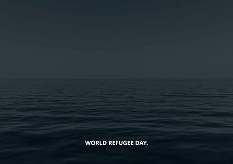

\(Photo by Jugend Rettet\)
#### Feature
#### At least 130 missing in the Mediterranean

UNHCR says at least 130 people are dead or missing after it received information on three new shipwrecks in the Mediterranean last night\. The first and largest of these incidents involved a rubber dinghy that left Libya on 15 June and began taking on water just hours into its journey\. The boat carried at least 133 people and there are only four survivors\.

Another boat carrying at least 85 people broke in two and sank yesterday\. There were many families with children aboard\. The nationalities of those lost are Syrians and people from North African countries\. So far in 2017 at least 1,985 people have died in the Mediterranean\.

440 refugees from 3 boats, saved by the Phoenix aid boat, chartered by the Maltese NGO Moas, disembarked in Sicily\. Many were in precarious health conditions\. There were also several pregnant women, some close to giving birth\. Even within the first words, women tell about the sexual violence they suffered during their stay in Libya\.

In a common statement, sea rescue NGOs including [Sea Watch](https://sea-watch.org/en/world-refugee-day/) call on the EU to stop human rights violations in the context of maritime migration\. Demands include supporting and decriminalizing NGOs rather than demonizing them, harnessing the EU’s naval capacity towards proactive search and rescue at sea, and open up pathways for safe and regular access to Europe\.

Meanwhile, Proactiva’s new boat Open Arms is ready to set sail\. It says it was able to save 20,000 live in the Central Mediterranean, adding “ _there’s another figure that nobody wants to see, which is the number of people who lost their dream along the way_ ”\.

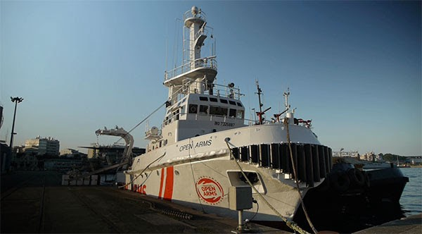

Photo by Proactiva Open Arms
#### Greece
### Investigation on pushbacks to Turkey under way

[Ekathimerini](http://www.ekathimerini.com/219407/article/ekathimerini/news/probe-under-way-into-claims-of-pushbacks-at-greek-border) reports an investigation is currently under way into claims that several Turkish asylum\-seekers have been forcibly returned to their country at the Greek border\. T [he Hellenic League for Human Rights](https://www.fidh.org/en/issues/migrants-rights/turkish-journalist-imprisoned-in-turkey-after-refoulement-from-greece) had said that an unofficial refoulement from Greece to Turkey took place along the Evros River on May 24th, among them Murat Çapan, who was a journalist for the magazine Nokta and is now imprisoned in Turkey where he was previously sentenced for 22,5 years\. The Hellenic League has also said that Turks were pushed back on the 2nd of June and has documented a total of 17 pushbacks so far, including those of seven children\.
### Syrian refugee discharged by court in Farmakonisi case

[Pro Asyl](https://www.proasyl.de/en/news/farmakonisi-case-syrian-refugee-and-survivor-discharged-by-court/) reports the deaths in the Farmakonisi case were caused by the intervention of the Greek coastguard authorities, as the boat carrying the refugees was towed by the coastguard vessel\. A young Syrian refugee and the 16th survivor of the deadly boat accident was acquitted of any responsibility\.

On 20th of January 2014, eight children and three women from Afghanistan lost their lives when their vessel sank near the Greek island of Farmakonisi\. The sixteen survivors claim they were improperly towed at great speed by the Greek Coast Guard back towards Turkey when their vessel capsized, leading to the death of eleven people during an illegal push\-back operation\.

[Midnight Helpers](https://www.facebook.com/groups/ROYartsaveslives/permalink/1382916205131377/?pnref=story) groups shared an picture from Souda, Chios, of arefugee speaks on his phone inside his shelter that stands next to a fishing boat\. According to the official data, since the beginning of the year, 8,384 new arrivals were registered at the overcrowded islands\. “Shelters on Chios, a Greek island 7 kilometers \(4\.5 miles\) from the coast of Turkey, are filled beyond capacity\. Many new arrivals, including infants, now sleep in tents on the beach,” they say in one of their posts\. People are left on the islands to wait for the decision about their transfer to mainland, or possible expulsion to Turkey\. Around 14,000 people are waiting there\.

 \. Photo by Petros Giannakouris/AP](assets/17003e5e12fa/1*3csZk0ekfw4IvFzMRaL5vA.jpeg)

From [Midnight Helpers](https://www.facebook.com/groups/ROYartsaveslives/permalink/1382916205131377/?pnref=story) \. Photo by Petros Giannakouris/AP
### Donations needed for Ramadan

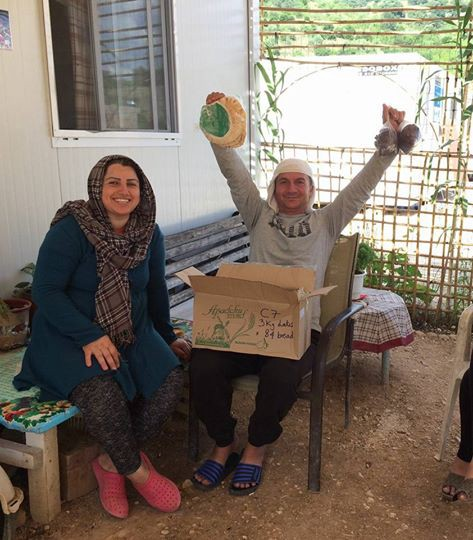

Photo by Refugee Support Greece

Over the past 20 days of Ramadan, donations allowed to provide 74,151 food packs to more than 4,500 people\. The packs include fresh fruit and vegetables, Arabic bread and dates to people living in more than nineteen refugee camps in Greece\. This allows people to cook the food that they know and love and brings comfort to a place with so little\. Donations are needed to continue this project for the remaining days of Ramadan:

Bank name: Bank Leerau
Account name: Volunteers for Humanity IBAN: CH96 0658 8570 0771 2190 6 SWIFT: RBABCH22588
### Donations needed for the Corinth detention centre

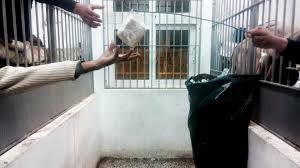

Be1 Human reports on the situation in the Corinth detention centre, around one hour away from Athens\. They say many are desperate and in need of support\. Clothing, sanitary goods but also entertainment are among the things that are needed most\. Be1 Human is looking to bring items such as playing cards, balls and board games to make the hours of captivity a little bit more bearable\. You can support them through donations through their bank account:

Piraeusbank

IBAN GR 1601721210005121086820625
#### Bulgaria
### Volunteers needed for the Busmantsi Detention Centre

[Caritas Sofia is looking for volunteers](https://timeheroes.org/en/caritas/zanimania-migranti-busmantsi-iuni-2017) to lead English, Bulgarian and sports classes for adults and activities for children in the Busmantsi Detention Centre for Temporary Placement of Foreigners\. The adults and children living there are not allowed to leave the compound, and are only allowed outside for an hour per day\. Caritas says the educational activities make a significant difference to the quality of life of asylum seekers, as life is extremely monotonous there\.
#### Croatia
### Are You Syrious’ new projects

Are You Syrious started welcoming refugees in its free shop, which is a part of the AYS integration centre in Zagreb\. Refugees are welcomed to come and ask for whatever they need to have a comfortable and dignified life in Zagreb\. We are no longer in the moment of crisis in Croatia\. The goal is now to integrate refugees that have come and are here to stay; allow them to live with the same rights and opportunities as the locals\. AYS is touched by how many local peoples have come to bring donations, ask what is needed and how they can help, offering their time, skill and materials\. The free shop has grown out of being just a place for receiving donations; it is a place of solidarity and first friendships between refugees and locals\.

The AYS integration centre’s space has been turned into a gallery with paintings of two refugee artists — Sameer Shirzad and Hassan Jafari\. People are invited to come and purchase the paintings for a suggested donation of 100 kuna for a small format, and 150 kuna for a bigger format\. More than just helping refugees financially, locals are this way “housing” the paintings which are, otherwise, together with their owners, spending their lifetime in a refugee reception centre, waiting to have a home, waiting to be accepted by the Croatian society\.

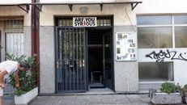

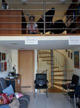

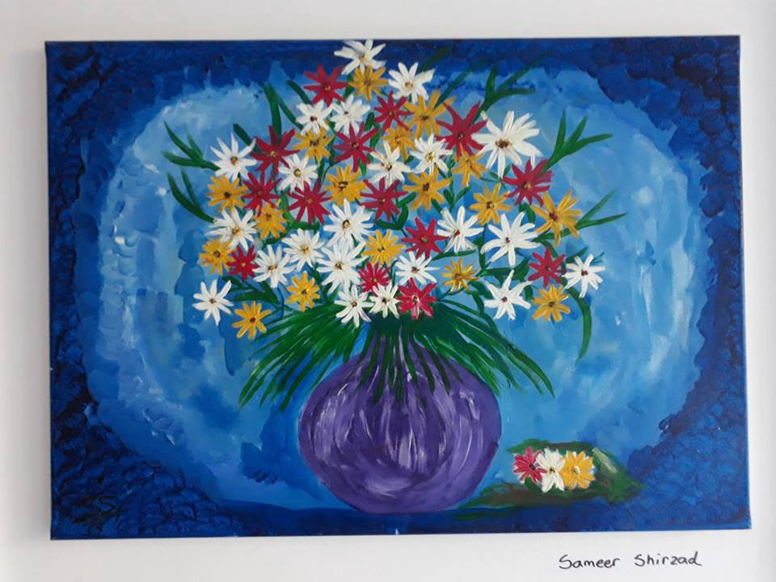

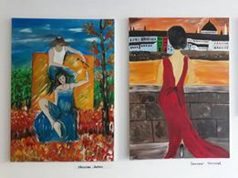

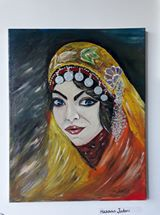

Waiting for a resolution to their status is often very difficult for refugees\. It is a time of uncertainty, anxiety, and constant worry\. In order to support refugees in these difficult times, AYS aims at organizing workshops where they can utilize their skills or learn new ones, pursue their interests and work towards their future goals\. Many refugees have, thus, approached us with a wish to learn English\. AYS therefore started organizing weekly English classes for refugees in two groups: beginners and advanced\. Our goal in the future is to organize other types of workshops for refugees as well — programming, refugee law and asylum policy info, Croatian language, are but a few ideas we had\.

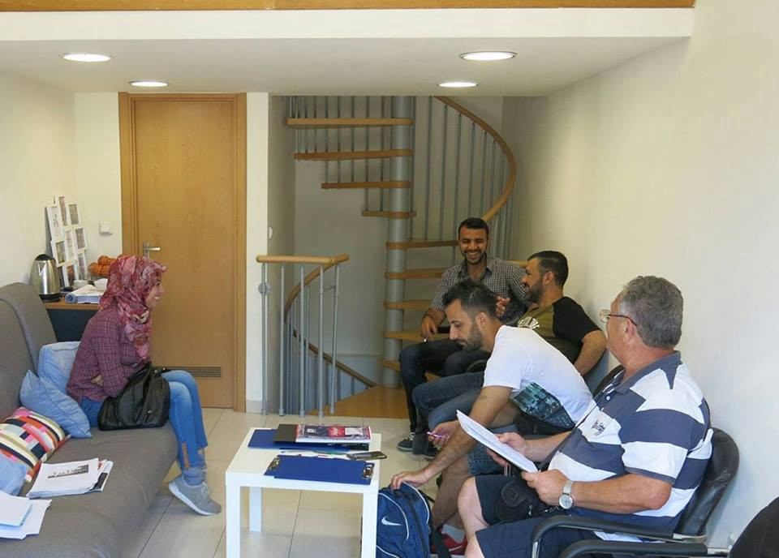

#### Hungary
#### Violence continues

Our friends from [Fresh Response team](https://www.facebook.com/freshresponseserbia/) , who together with Rigardu team are helping us to collect info about violence at the border with Hungary and Croatia, on a World Refugee Day recorded another example of police violence\. A group of Hungarian police officers spent 3 hours beating a group of refugees, 11 people, including children of 14 and 15 years old, who were caught at 7am in the morning\. They were reportedly subjected to 3 hours of violence before being forced back onto the Serbian side\.

“Although this latest incident is especially egregious in that it falls on the one day designated to "commemorate the strength, courage, and perseverance of millions of refugees" \- \- such extreme violence towards them has been taking place regularly for over a year by police in Hungary, and increasingly Croatia as well\.”
#### France
### Update on Calais

The Refugee Youth Service says Sunday was the first food distribution in a long time where the heavy presence of police did not hang overhead, as the current court case seems to have caused a rethink\. 12 charities have taken legal action, asking for a system to be put in place to ensure basic human rights are met in the Calais area\. Care4Calais says “ food aid distribution is regularly disrupted, sleeping bags confiscated, tear gas used and park bans enforced”\. They ask for access to toilet facilities, drinking water and the enabling of regular food distribution without disruption\. Refugee Youth Service says it is now able to support young people outside of the 1\.5 hour time window recently put in place\. The group also organized a dance party, board games and other activities\.

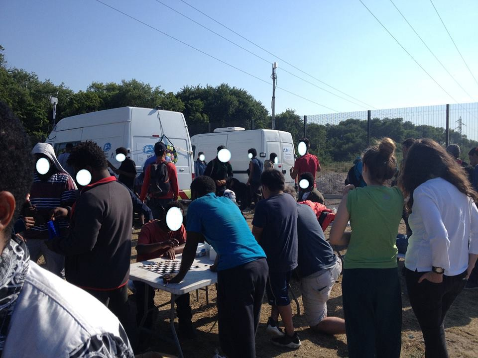

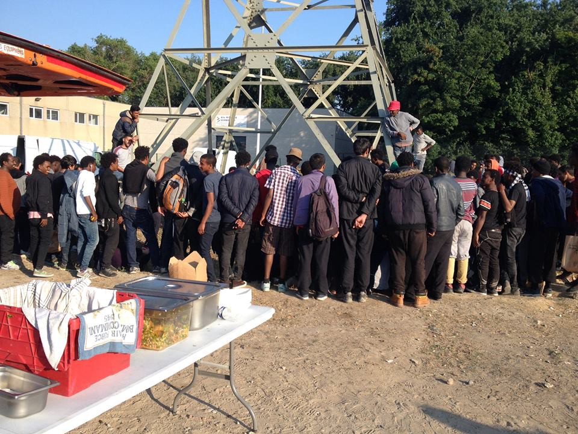

Photos by Refugee Youth Service
### Deportation to Afghanistan prevented

La Chapelle Debout says the deportation of an Afghan asylum seeker was cancelled today, after activists protested at the airport\. The man has a wife and an eight month old baby in France\. Many of those under threat of deportation come from the Kapisa province, were the security context remains problematic\. La Chapelle Debout says the next deportation is expected to take place on the 21nd and six Afghans in total were supposed to be deported this month\.
### Refugees on hunger strike in Briancon

Refugees in Briancon from Sudan and Chad have installed tents in front of the local reception centre and have started a hunger strike in protest against Dublin III deportations to Italy\. 16 out of 24 refugees who went to this reception centre in November 2016 are concerned by this procedure\. The refugees feel betrayed, are asking for their fundamental right to be informed and to have the possibility to chose in which country they ask for asylum\.

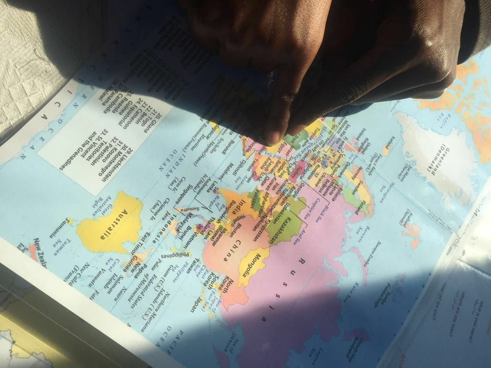

Photo by Refugee Info Bus \(Calais\)
#### UK
### Help Refugees launches its High Court challenge over the Dubs scheme

Today, Help Refugees launched its High Court challenge against the Government over the number of unaccompanied child refugees accepted into the UK under the Dubs scheme\. [The Independent](http://www.independent.co.uk/news/uk/home-news/child-refugees-dubs-amendment-immigration-act-home-office-legal-challenge-campaigners-a7798776.html) reports the NGO accuses the Home Office of adopting a “seriously defective” process to measure the capacity of local councils to take in child refugees, after it emerged many local authorities were not properly consulted\. It accuses the Home Office of failing to provide the local authorities with critical information such as the fact that there was a 14 October 2016 cut\-off date for responses\. This meant the Home Office failed to count 91% of the places offered by Scottish local authorities because they were sent after the “cut\-off” date, as well as 86% of the places offered by Welsh local authorities and 45% of places offered in England\.

Help Refugees calls on the government to reopen the Dubs scheme and give refuge to 3,500 unaccompanied child refugees in France, Italy and Greece\. Just 200 child refugees have been rescued so far\. It adds that it is also challenging the Government’s failure to implement the scheme quickly and to give any written reason to unaccompanied minors who were refused relocation\.
#### Netherlands
### Court annuls decision to deny asylum to gay Iraqi refugee considered ‘not gay enough’

Last week the Court of Rotterdam annulled a decision to deny asylum to a gay Iraqi refugee because he could not convince the Dutch government of his homosexuality in a series of hearings, with officials saying he was ‘not gay enough’\.

The judge decided that the argumentation was flawed on many points, as well as the system that is used to determine someone’s homosexuality\. For instance, declarations of third parties \(boyfriend, friends, family\) are never involved in the decision making process\. This decision may pave the road for a reassessment of the existing system\. Meanwhile — if the government chooses not to appeal — the refugee in question will have his asylum permit before fall\.
#### EU
### Hope for legal protection

Advocate General Sharpston at the European Court of Justice considers that an applicant for international protection can challenge a Member State’s decision to transfer him to another Member State on the basis that the ‘take charge request’ sent by the first Member State was not made within the time limits set out under EU law\.

This comes after a complaint by an Eritrean refugee who traveled to Germany in September 2015 and was provided with an attestation in response to his informal request for asylum\. In July 2016, he lodged a formal application for international protection, leading German authorities to check the Eurodac database in August and make a take charge request to their Italian counterparts\.

The man then filed a complaint, arguing that Germany is responsible for examining his application because the take charge request was made after the expiry of the three month time limit set out in the Dublin Regulation\. German authorities meanwhile asserted that the time limits do not establish individual rights\.

The Advocate General Sharpton rejected the German authorities arguments, saying that the Dublin III Regulation is no longer a purely inter\-State mechanism and can therefore be challenged by an individual\. However, the case set out by the Eritrean refugee was rejected as well, as she argued that the time limit started only once he lodged a formal application for asylum\.
#### Libya
### Shocking images of kidnapped refugees

In a hard to read article, [France 24](http://observers.france24.com/en/20170619-video-migrants-tortured-kidnapped-libyan-smugglers) reports on shocking images and interviews collected by a Somali journalist during a video call on WhatsApp with kidnapped refugees\. The video and testimonies show refugees have been tortured by their captors because they cannot pay their ransom\. Some of them have been imprisoned for years and others describe widespread sexual violence\.

> **We strive to echo correct news from the ground, , so let us know if something you read here is not right\. Anything you want to share — contact us on Facebook or write to: areyousyrious@gmail\.com** 

_Converted [Medium Post](https://areyousyrious.medium.com/ays-daily-digest-20-06-17-reports-of-three-new-shipwrecks-ahead-of-world-refugee-day-17003e5e12fa) by [ZMediumToMarkdown](https://github.com/ZhgChgLi/ZMediumToMarkdown)._
