### AYS SPECIAL: Refugees stuck in and around the camp Porte de la Chapelle

_Around official camp “Paris Nord” there is rising number of refugees and asylum seeker from all over\. Even as some of them are admitted to camp and housed in centers around Ile de France until their asylum is solved, the flow site of newly arrived is too strong to be managed by existing arrangement\. Danika Jurisic, long term volunteer, for brings us photos from the site\._

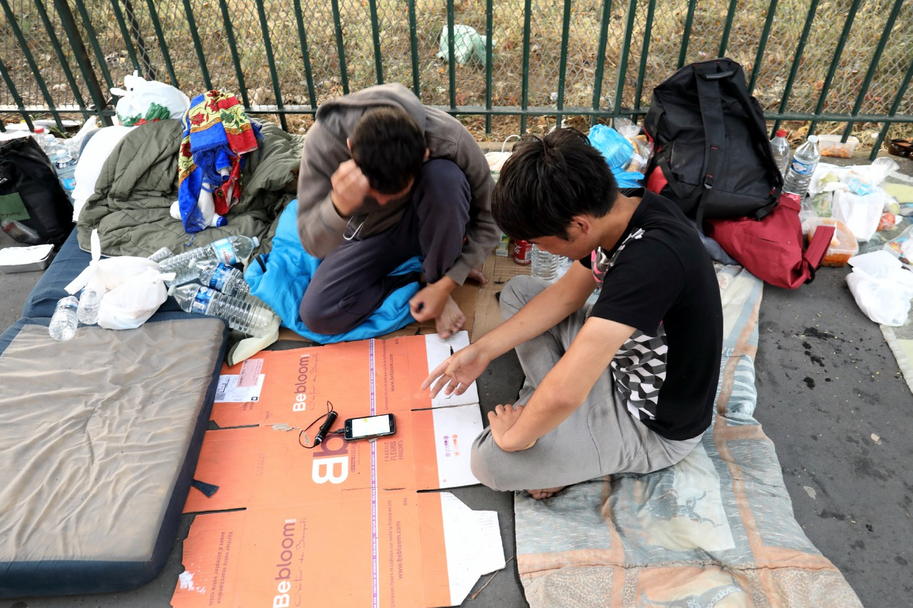

Along the Boulevards de Marches, camp is claiming any available space\. Around the small stadium, on the sidewalk, any available space is being redefined as an improvised shelter for the refugees\. They sleep in the open, on carton and blankets\.

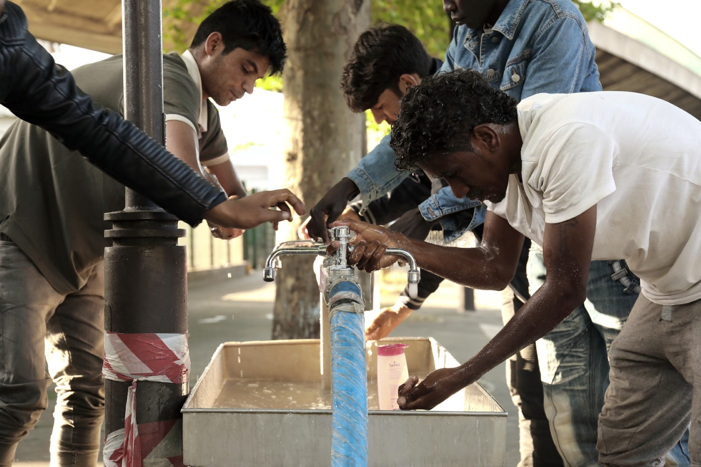

Fortunately, the local authorities have installed one water source, and even as it doesn’t meet the needs of all 800 of refugees, it is still a valuable addition to the camp, with recent heat waves

\.

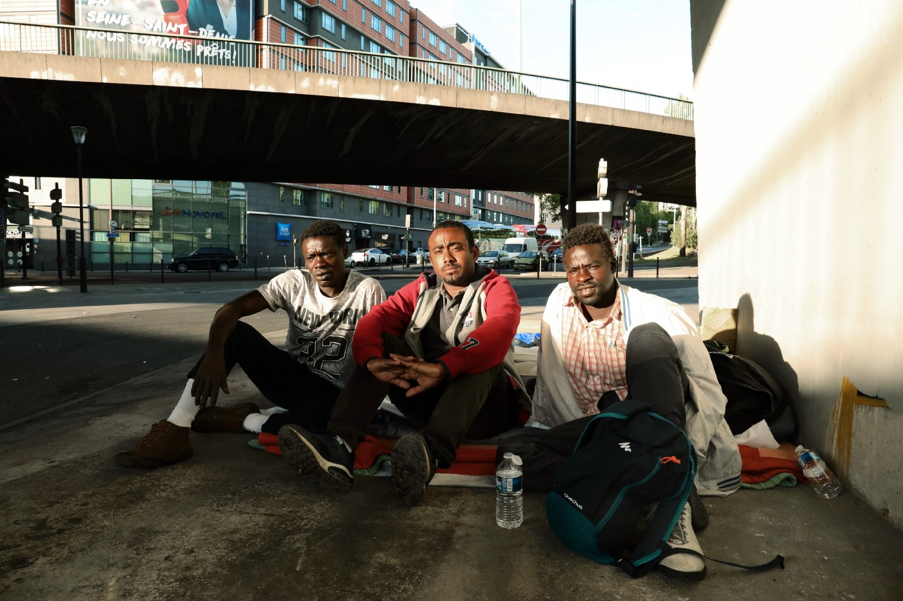

Amir, Adala and Mohamed are three refugees from Sudan\. They crossed Mediterranean Sea and found themselves waiting in the line to get into official camp\. They are sleeping under the bridge, on a few blankets given by volunteers for a month\.

Saedi and Rustami are from Afghanistan\. They fled the Taliban regime and constant terrorist attacks\. They are waiting in the line for almost two months, sleeping very closely to highway\. This is the “safe” place because police, as well as the local gangs are not eager to scout this unpleasant area\.

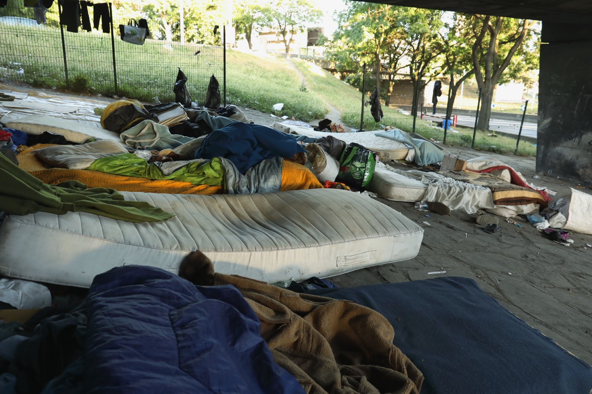

While the refugees are left to find some food, we entered a well\-hidden camp placed in\-between very busy traffic lanes\. They have gathered abandoned matrasses, blankets, sleeping bags, basically anything they could find to create some sort of shelter\.

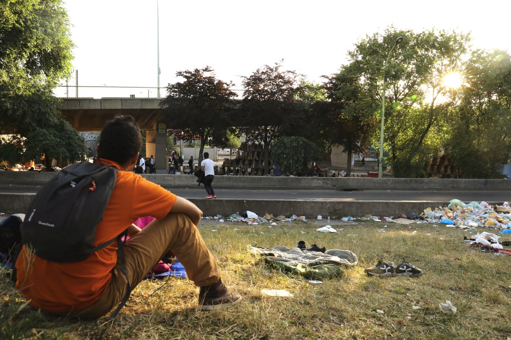

Young refugee looking at the camp on the other side of the highway\. There is a pile of trash in the corner, the local authorities agreed to do the pick up only once a week\. Utopia volunteers have been doing the “dirty work” until now\.

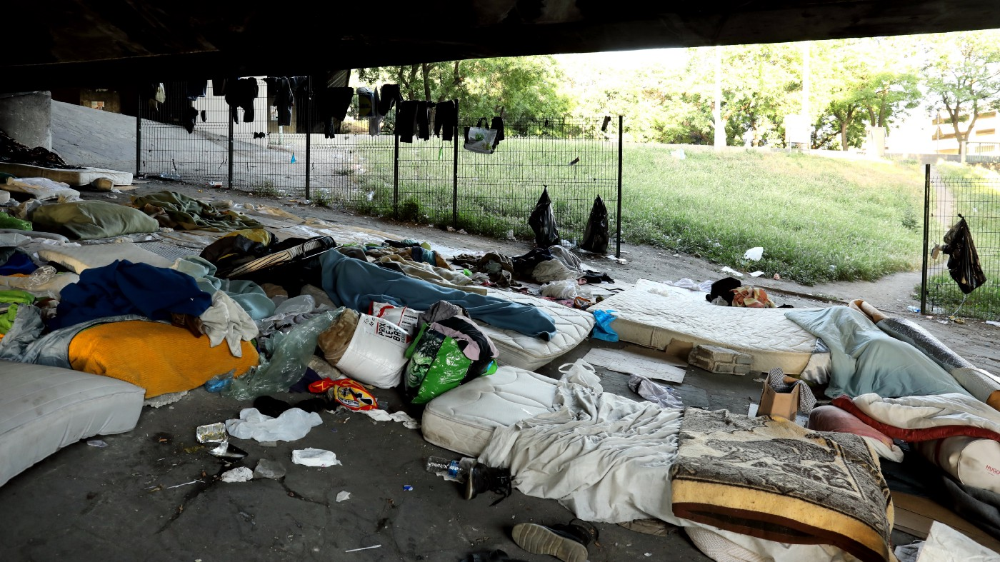

Refugees are camping in between traffic lanes on the small patches of grass, green surface\. Due to the warm weather, they are sleeping without any improvised shelter\.

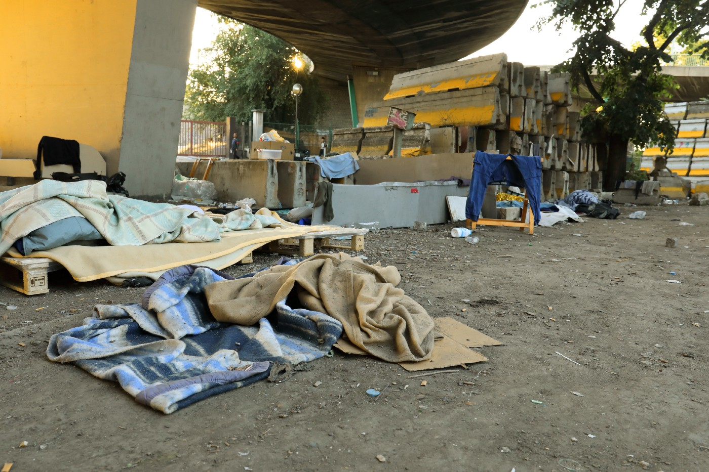

A small construction site, just next to the cam, has been used as a shelter for the refugees, the ones who are sleeping rough\. It is all in one: a dormitory, a washing room, a place to dispose garbage… Conditions are not bright, nor promising\.

During Ramadan, there are many association that are distributing food in the evening hours\. Even as refugees are various and mixt groups, and not all of them who declare as Muslims are fasting, Iftar is considered as something that should be respected and available to refugees\. Food distributions are done on several points, all over the camp, so there are more possibilities and less conflict\.

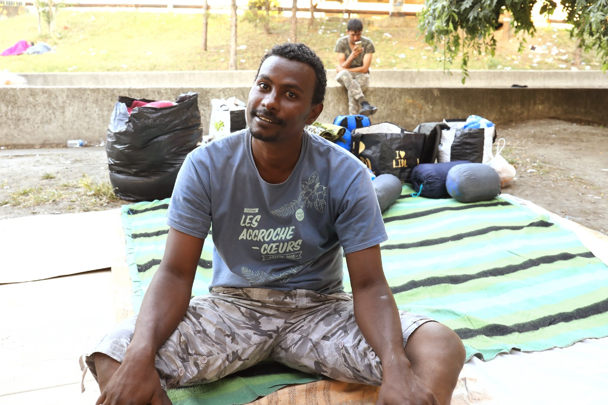

Fahri Ali is a refugee from Sudan\. He kindly invited us to his place on the camp — a neatly arranged mosaic of carton and blankets\. He offered to take us around, explaining in broken English how things function\.

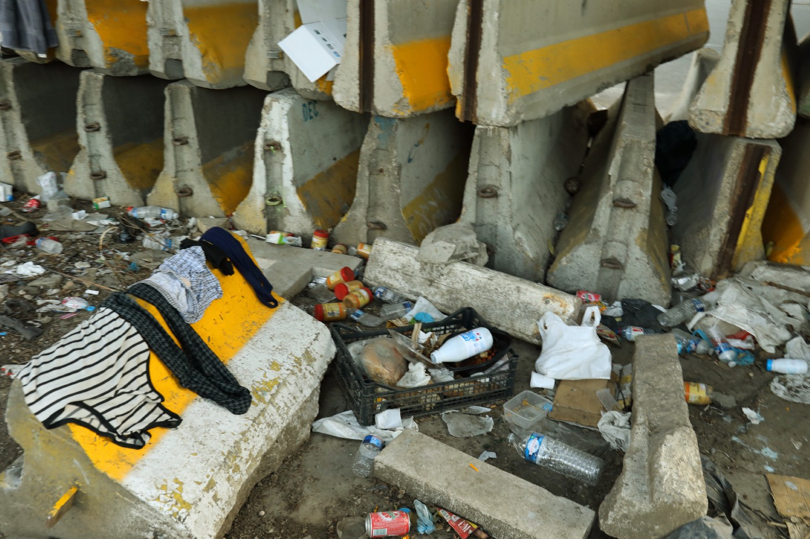

This is laundry\-room, according to Ali\.

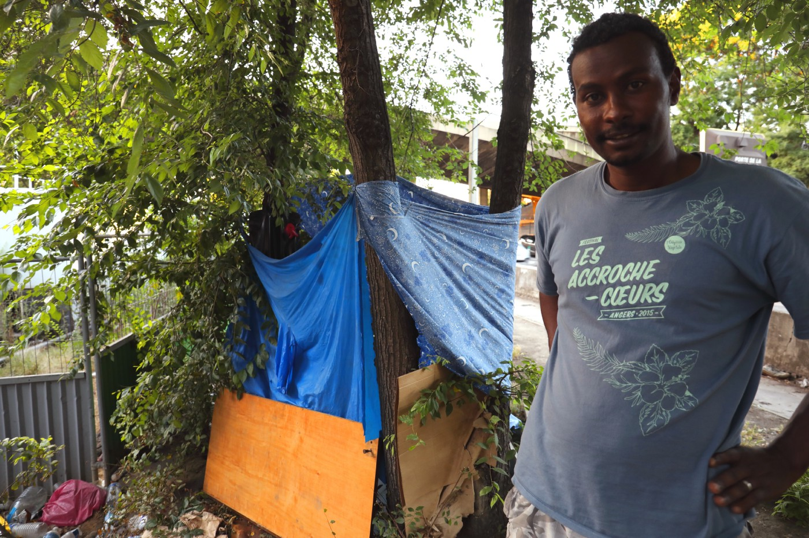

Another step was seeing the bathroom, and improvised shower place, protected by few curtain\.

Since recently, there has been approved a several project that are building up infrastructure in Paris\. One of them is expansion of the tramway line, that should lead from Porte de la Chapelle\. Construcion sites are separated by a large grey\-green panels\. They are used to reate an improvised shelters\.

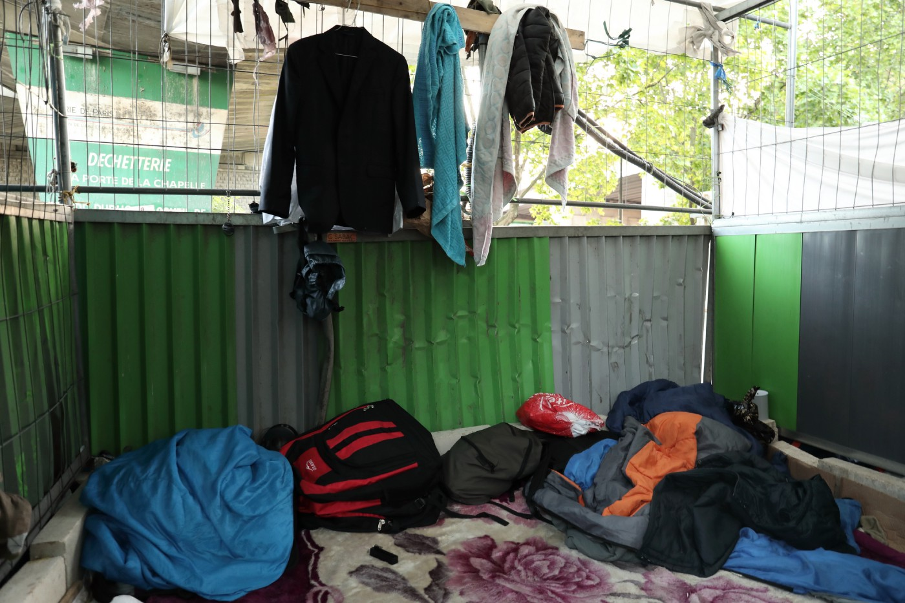

> **_AYS strive to echo correct news from the ground, so let us know if something you read here is not right\. Anything you want to share — contact us on Facebook or write to: areyousyrious@gmail\.com_** 

_Converted [Medium Post](https://medium.com/are-you-syrious/ays-special-refugees-stuck-in-and-around-the-camp-porte-de-la-chapelle-69010d86795f) by [ZMediumToMarkdown](https://github.com/ZhgChgLi/ZMediumToMarkdown)._
