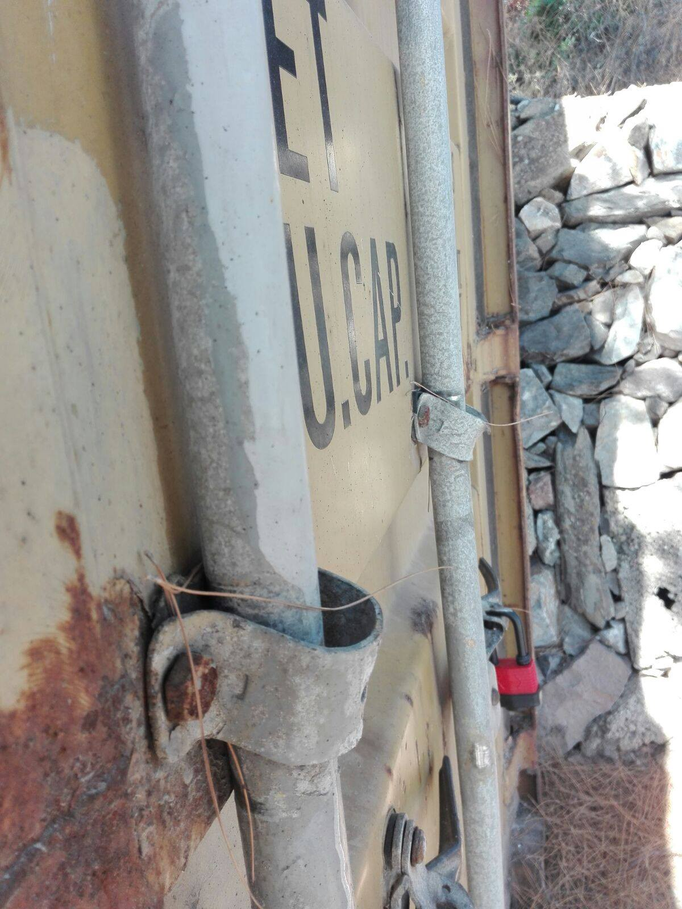
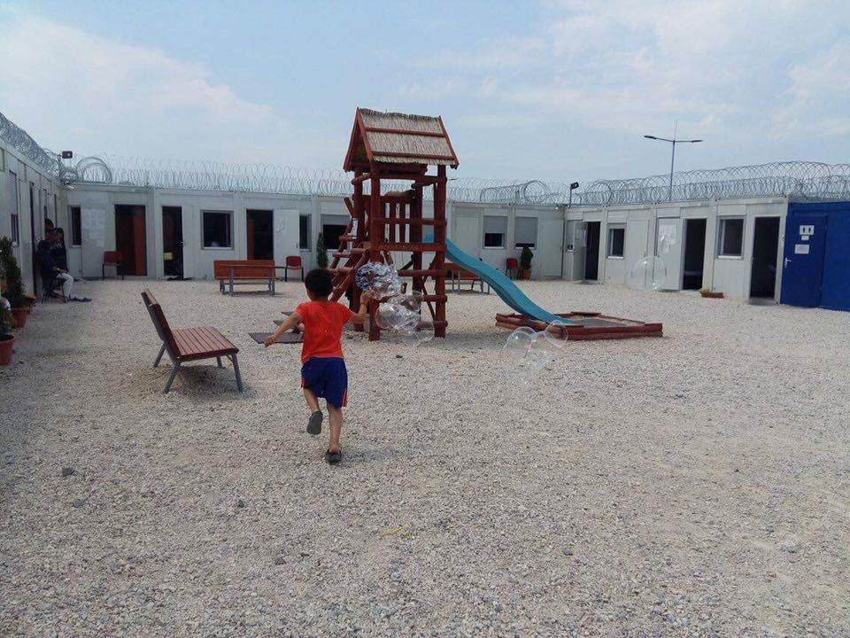
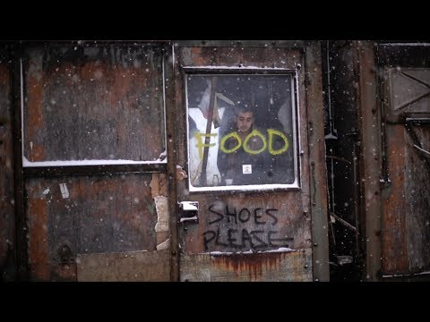
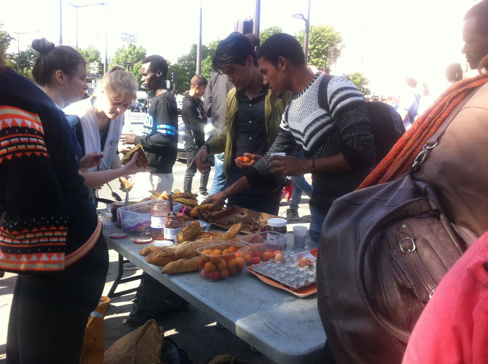

### AYS Daily Digest 21/06/17: UNHCR’s resettlement is not available for everyone

_Six EU\-countries to come up with a military pact to stop next potential wave of refugees / Burglary in One Happy Family’s Community Center at Lesvos / Latest trends in arrivals at the Greek islands / Human trafficker charged in Italy / Protests in Venice / And more news…_

 , someone is asking for a place to rest\. Nothing more\.](assets/63c1429a8ef4/1*Su6YJ4hYUhPtrwDq0Vi-cA.jpeg)

Photo: [Liseron Beytout](https://www.facebook.com/liseron?fref=nf) , someone is asking for a place to rest\. Nothing more\.
### Feature

[UNHCR has been carrying out resettlements as a part of their quota program from Serbia the last months, to Australia and Sweden](http://reliefweb.int/report/serbia/unhcr-serbia-update-5-11-june-2017) \. We have been in contact with one family relocated to Sweden\. The few families relocated from Serbia seems to be very fortunate since they are few among many\. The possibility to become one of UNHCR’s quote refugees aren’t given to all people\. In Sweden for example, the number have been steady on 1900 for a long time, but since the borders closed the aim is to get that number up to 5000\. [In 2017 the country will accept 3400 people\.](https://www.migrationsverket.se/English/About-the-Migration-Agency/News-archive/News-archive-2017/2017-03-06-Increased-refugee-quota-with-a-focus-on-Syria.html) So many haven’t been the case since the Balkan Wars\.

The UNHCR quota system is along with the EU relocation program and family reunification the only safe paths to a new life away from war, persecution and the limbo it means to be one of the refugees stranded in Greece, Turkey, Serbia, Jordan and elsewhere that isn’t home\. What is important to keep in mind while celebrating UNHCR’s program and these possibilities given to some lucky and for sure people well worth it, is that more people should be able to escape years ahead as refugees\. [It is amazing that seven people are picked from Serbia — but it is not enough\.](http://reliefweb.int/report/serbia/unhcr-serbia-update-5-11-june-2017)

What also is interesting to note, is that the people picked by UNHCR in fact also is picked by the countries offering people asylum\. According to the people AYS have been in contact with they applied to become UNHCR quota refugees when they came to Serbia, after that the process was eight months, but that can vary\. After the application was done they first had to attend interviews to be picked by UNHCR and after that by Swedish authorities, through the Migration Agency, picked them from UNHCR’s program\. It is both logo’s on some of the documents shown, that says that the family is accepted in Sweden and will be transfered by UNHCR\. [Serbia isn’t mentioned as a geographic area where refugees are relocated from in general by Sweden](https://www.migrationsverket.se/English/About-the-Migration-Agency/News-archive/News-archive-2017/2017-03-06-Increased-refugee-quota-with-a-focus-on-Syria.html) \. Probably the cases relocated from Serbia are seen as [**urgent and prioritized cases, as stated in the text\.**](https://www.migrationsverket.se/English/About-the-Migration-Agency/News-archive/News-archive-2017/2017-03-06-Increased-refugee-quota-with-a-focus-on-Syria.html) Besides that, the focus is on Syrian refugees\. What is worth to note is that the people relocated in this case was Afghans, and they lack access to the different programs provided by the EU, such as the relocation program\. If it is the EU’s program that are making the Afghan refugees, among others that lacks safe paths, in Serbia “urgent and prioritized” is not said, but it is worth questioning\.

This pick and choose system, from the ones labeled as vulnerable enough by UNHCR to qualify for the program, becomes dangerous and elitist\. The process, whos aim should be to protect, instead runs the risk of becoming a haunt for special skills and for refugees that can contribute to the country rather of who actually needs the protection best\. The people relocated from Serbia was asked about things such as education, skills and family history in detail\. Of course — if a country needs certains skills and someone stranded along the refugee route can help, it’s great for both parts\. But, it could also be misused, and then not benefit the most vulnerable people at first hand — since the most vulnerable people rarely are the ones able to apply for programs and perform well at interviews with officials\.
### Sea

Talking of the sea, here is an u [pdate from Jugend Rettet e\.V\., regarding last nights tragedy](https://www.facebook.com/JugendRettet/photos/a.418621685013737.1073741828.409016039307635/687436511465585/?type=3) :

> For more than 16 hours the IUVENTA has been sailing with its flag at half\-mast\. All grieve for the bodies recovered by the crew from the ocean yesterday evening\.
 

> For now it’s unclear what is going to happen to them\. 

](assets/63c1429a8ef4/1*OZWcH0hYTPzKftv4rIh7Xg.jpeg)

Photo: [Jugend Rettet e\.V\.](https://www.facebook.com/JugendRettet/)
### EU

[Six countries in the European Union](http://www.jutarnji.hr/vijesti/hrvatska/stvara-se-novi-vojni-pakt-za-obranu-granice-od-migranata-hrvatska-u-savezu-sest-europskih-zemalja/6277736/) — Chech Republic, Slovakia, Austria, Hungary, Slovenia and Croatia — are currently working on a military pact in order to be able to unite and coordinate their military forces in case another wave of refugees hit the EU\. More details is hopefully, if not to say not hopefully, to come about this extremely terrible and mean idea\. At this point it is known that the defense ministers from the six Central European countries promised closer cooperation over the migration crisis, including using armed forces where necessary\.

The group, which includes two countries, currently being sued by the European Commission for refusing to participate in the E\.U\.’s internal resettlement mechanism, said this would allow countries to have control over who is entering their borders\. Control and alienation, again, instead of understanding and solidarity towards people who’s homes aren’t as safe places as their own\.
### Greece
#### Mainland

The last time have been one of evictions and lack of solidarity in Athens\. [This Friday the 23rd of June there will be a big demonstration held in front of the ministry](http://greece-anarchist-refugee-squats-prepare-for-state-onslaught) \. It is associated with the international day of action, which is the 23rd as well\. Activists, anarchists and volunteers, together and in collaboration with refugees, have been illegally taking over several abandoned and not used buildings the last years\. Since the authorities haven’t been able to provide with enought proper housing, this has been the way to find shelter\. Read the article and statement [in full version here](http://greece-anarchist-refugee-squats-prepare-for-state-onslaught) \. Some of the demands that will be made this Friday is as it follows:

_– Keep the squats open\!_

_– Close the camps and detention centers\!_

_– Cancel the shameful EU\-Turkey deal\!_

_– Open the borders\!_

_– You can’t evict a movement\!_

City Plaza, among other occupied places, is not only just occupied spaces and shelter for people in need of it\. It is also statements about and against racism, oppression and those in power\. It is a way of showning how locals, refugees and foreigners can live together in peace and dignity — which should be the case in all of Europe, not only in the squats\.
#### Islands

**Lesvos**

A terrible incident has been reported from Moria detention center\. A resident in the camp was today beaten up by police, and after that the police tried to delete everyone’s photos from the incident\. Fortunately, they didn’t succeed in doing so\.

**Burglary at One Happy Family’s Community Center**

[The night until today, the 21st of June, someone broke into the One Happy Family Community Center on Lesvos](https://www.facebook.com/OHFLesvos/posts/313129575797605) \. A laptop, speakers, soundsystem for the home\-cinema, clothes and several other things were stolen\. Three windows and a door is broken\. Today the center was closed, since they wanted to think about how to make it safer\. They are all confused and devasteted by the incident\.

[Replacements for the stolen things are needed\. Please consider donate so they can be back in business as soon as possible](https://ohf-lesvos.org/en/donate-now/) \.

](assets/63c1429a8ef4/1*2Ht5u47pNCXYATcjfZFKbQ.jpeg)

Photos: [One Happy Family — Community Center, Lesvos](https://www.facebook.com/OHFLesvos/)

**Chios**

[Women do menstruate even thought they are stuck in refugee camps\. It’s just a bit harder, especially for those living in tents](https://www.facebook.com/NeedsList4Good/photos/a.356999821316658.1073741828.305539049796069/461549054195067/?type=3&hc_location=ufi) \. Every women or girls that has been camping in the forest can relate to this, which of course is an even more urgent matter for those living like this not only one period but several\. It might not be a stigma all over the world in 2017, but still something personal and that makes people a bit vulnerable in case they don’t have access to sanitary pads\. [The Unmentionables](https://www.facebook.com/theunmentionablesorg/?fref=mentions) will distribute sanitary pads to refugee women on Chios, so they can have a sanitary, safe and dignified period even in the not most dignified conditions on the Greek islands\. The pads handed out is from [Lunapads\.com](https://www.facebook.com/Lunapads/) and can be reused\. Follow the link to donate\.

 & [The Unmentionables](https://www.facebook.com/theunmentionablesorg/)](assets/63c1429a8ef4/1*RI7gEIkkk5MX0uRLqKdtpA.jpeg)

Photo: [NeedsList](https://www.facebook.com/NeedsList4Good/) & [The Unmentionables](https://www.facebook.com/theunmentionablesorg/)

**Arrivals and refugee flows to the islands**

[This morning Lesvos, according to local sources, hit 3,653 while it in January was 3,181](http://www.amna.gr/.../Auxisi-ton-metanasteutikon-roon...) \. It has been a significant increase in arrivals to Lesvos in the last 20 days\. From June 1st to the morning, 682 refugees and immigrants passed to Lesvos\. At the same time in Chios it passed 308 and in Samos only 48\. In the last week the flows to Chios and Samos are zero\. One reason behind these flows could be that that there is a concentration of tourists on the coasts towards Turkey at Chios and Samos, and that is not the case on Lesvos at the coast where most refugees are arriving\.

According to data from the General Police Directorate of the North Aegean, on Wednesday 21 June, 9,459 refugees and immigrants are trapped in total on islands in camps and other structures\. [Of these, 3,653 are, as mentioned, in Lesvos, 3,898 in Chios and 1,908 in Samos](http://www.amna.gr/.../Auxisi-ton-metanasteutikon-roon...)
### Italy

**Human trafficker charged on Sicily**

[A human trafficker of Nigerian origin, known under the nickname ”Rambo” has been arrested in Italy](https://www.thelocal.it/20170621/italy-arrests-rambo-man-suspected-of-trafficking-torturing-and-killing-migrants) \. He is charged for torturing and killing migrants held captive in Libya, Italian Police said to media yesterday according to the Local\. The man behind the nickname ”Rambo” is John Ogais, 25, and he is believed to be a part of a bigger transnational smuggling ring, that is specialized in human trafficking, murder and rape\. The local police on Sicily have compiled testimonies from migrants that have been able to escape from him without facing death\. They are witnessing about at least two men dying at Ogais hands\.

The conditions in Libya is so bad that people stranded there, according to UN’s estimations the number of people waiting to cross the sea can be up to one million, are villing to take the chance of getting themselves in the hands of smugglers such as ”Rambo”\. [Almost 2000 people have died while they have been trying to do the journey to Europe this year](https://www.thelocal.it/20170621/italy-arrests-rambo-man-suspected-of-trafficking-torturing-and-killing-migrants) \. And last year was the most deadly since the counting started, with over 5000 tragic deaths\. The need of safe paths have never been more major than it is right now\. This year only, over 77 000 people have come to Europe escaping different kinds of violence, poverty, war and persecution\.

**Protests in Venice for better conditions**

[For the world refugee day yesterday in Venice a demo was held to protest against precarious conditions asylum seekers are forced to suffer\. The demo was organised by USB, a grassroot union](http://corteo-profughi-venezia-oggi-20-giugno-2017.html) \. Between 200 and 300 refugees from Cona and another group of 100 that are often in the area of the train station marched peacefully together, asking for better life condition and to speed up asylum and protection applications\. All nationalities living here marched side by side, Bengalis and Nigerians, Muslims and Christians\. They shouted mottos as : “asylum for everyone”, “we are not goods”, “stop ghettoization”, “stop racism”, “Cona is no good”, “documents for everyone”\. The aim with the mission was to have a direct meeting with Venezia’s prefetto Carlo Boffi, who was in Rome and couldnt receive the migrants\. Participants said things like:

> _“I’ve been here for 2 years and still nothing\. We sleep in tents and it’s too hot\.”_ 

> _“We need help\. 2500 people live in Conetta, we are forced to live in tents\.”_ 

[Next week the prefettura should announce the results of the call for bids launched](http://corteo-profughi-venezia-oggi-20-giugno-2017.html) by Ca’ Corner for “widespread hospitality”\. 950 new places could then be available\.
### Hungary
#### Update from Röszke’s no man’s land

“The conditions in the camp is okay, at least at a first sight,” out friend who just moved from Serbia to Hungary told us\. “There is refrigerators, laundry machines and water boilers available\. Except for that, there is a room where kids can play and watch TV\.” He also told us that in the camp, that is located between the Serbian and Hungarian border — in a no man’s land \(or what to call it\), only families are staying\. There are few or no volunteers in the camp, and no proper language classes or anything like that are provided\. The staff brings papers and drawing materials once every day, but just for some hour\. People are spending days playing cards, or talking on the phone with close ones elsewhere\. Medical staff that is present at the site, don’t understand English and there are no translators in Röszke\. So the description given from a resident here went from “okay” to less okay, which pretty much shows what kind of conditions people are accepting to live under\.

It might be fair to say that when someone in detention say that it is okay, it might, after a couple of following question turn out to sound not so okay — but for someone fleeing war and conflicts, the perception of the word “okay” might not be the same as for someone with an European passport\.

Photo: Röszke detention center, by an anonymous resident
#### Eleven men charged for 71 migrants deaths

The dreadful incident with 71 dead migrants bodys inside a lorry supposed to carry frozen meat was a trigger point in the decision to open the borders towards Germany and the north in 2015, [BBC reports\.](http://www.bbc.com/news/world-europe-40333111) Today a trial started towards the 11 men accused for being involved in this\. They are all charged for human trafficking and touture, and for of them also for murder\. They are believed to be a part of a criminal network\. The defendants are 9 Bulgarians, one Afghan and one Lebanese\. The reason for them being tried by a Hungarian court is since the victims probably died before they reached Austrian soil, where they were found\. [According to The Local there are evindence saying that some people in the lorry had been dead for two days when it was found\.](https://www.thelocal.at/20170621/eleven-men-go-on-trial-over-horrific-deaths-of-71-migrants-in-a-truck-in-austria) More info to follow\.
#### The never ending border violence

And also, yesterday was said to be Refugees Day\. What that means, no one really knows\. More days should be the one where people show solidarity with one another\. Fresh Response, together with the German ngo Rigardu, have been following the border violence for a while now, and they writes this about an incident carried out yesterday:

_“On this [\#WorldRefugeeDay](https://www.facebook.com/hashtag/worldrefugeeday?source=feed_text&story_id=1457776897602799) 2017, Hungarian police spent 3 hours beating a group of refugees\._

_We’ve just received reports from our volunteers in north Serbia that a group of 11, including children of 14 and 15 years old, were caught by Hungarian police at 7am this morning\. They were reportedly subjected to 3 hours of violence before being forced back onto the Serbian side\.”_

It is important to continue highlighting this extreme violence as much as possible, with the hope that it won’t be needed much longer\. It is often kids suffering from this abuse\. Children in need of protection are being beaten up, time after time by cruel police\.

To see who is affected and what it does to people, this video is a must\-see\. It’s made by Fresh Response and the journalist [Jaime Alekos](https://www.facebook.com/jaimealekos85?fref=mentions) for [IRIN](https://www.facebook.com/IRINnews/?fref=mentions) \. It is touching and includes fotage from Hungarys border nighttime\. This shouldn’t have to be anyones reality, since it looks surreal and inhuman, but it’s very much reality for those playing the border game — time after time\.

[And also, Rigardu’s full report is available here\.](http://rigardu.de/…/a-human-is-not-a-football-police-violence-at-…/)
### France

[In France the harassments toward refugees are continuing\. A volunteer wrote](http://Solidarité migrants Wilson) , in french, a personal update from this morning\. People are still asking for possibilities to take showers and where to sleep without any good answers\. The police is rasict, and rather detroys than helps the situation for those in need\. But volunteers are still there, providing much needed help and food\.

](assets/63c1429a8ef4/1*XgP2q0OmK-g6v3Fuiy_vWw.jpeg)

Photos: [Solidarité migrants Wilson](https://www.facebook.com/Solidarit%C3%A9-migrants-Wilson-598228360377940/)

**Help Refugees court case for Calais**

Statement from Help Refugees, as it follows:

> [FRANCE UPDATE — COURT CASE ON CALAIS](https://www.facebook.com/HelpRefugeesUK/photos/a.123267671367248.1073741830.111893659171316/447036138990398/?type=3&hc_location=ufi) 

> The level of abuse from police and neglect from the state, every day and every night in Calais, is not only inhumane, it’s illegal\. 

> Along with 11 other organisations in Calais, we are in Court today once again demanding basic survival provisions — sanitation and hygiene, access to potable water, food and protection for unaccompanied minors\. We continue to fight for the basic rights that every human being deserves\. 

> France’s Human Rights Ombudsman released a scathing statement against the treatment of refugees in the area and openly agrees with our position, stating: “The hunt of migrants must stop, the permission of meal distributions, and the immediate protection and accommodation of children” must be implemented urgently and their fundamental rights respected\. 

> If you support us and our partners in fighting to protect the rights of refugees in Calais, share this post\. If you want to help us continue to reach those currently being abused, sleeping with nothing but woods over their heads and the cold ground to sleep on, [please donate to our fundraiser for the region here\.](http://bit.ly/HelpRefugeesDonate) 

](assets/63c1429a8ef4/1*Hs56AjZR4pvhKtm-K1YJTA.jpeg)

Photo: [Help Refugees](https://www.facebook.com/HelpRefugeesUK/)

**Deportations from France to Afghanistan**

[Collectif La Chapelle Debout](https://www.facebook.com/CollectifLaChapelleDebout/?fref=nf) continues to stop deportations\. So far two have been cancelled\. [Read more in French here\.](https://www.facebook.com/CollectifLaChapelleDebout/photos/a.281756518823959.1073741827.281742142158730/493027751030167/?type=3&theater)
### Germany

Since the EU Commission advised the member states to resume with the Dublin III transfers to Greece, Germany has sent them 50 cases to deport back\. But the Greek ministry hasn’t answered yet, which means that Germany can’t transfer the people\.

The situation is similar for returning people back to Italy during the same legislation, of the more than 6700 requests made by Germany only 370 people have been sent back\. This has various reasons like courts blocking the deportation or there’s no EURODAC hit for the persons\. Further Germany is not sending requests for families with children under three years\. Tweets to follow in German\.

■■■■■■■■■■■■■■ 
> **[bordermonitoring.eu](https://twitter.com/bm0eu) @ Twitter Says:** 

> > Dublin-Regeln: Athen blockiert Rückführung von Migranten aus Deutschland [welt.de/politik/deutsc…](https://www.welt.de/politik/deutschland/article165742568/Athen-blockiert-Rueckfuehrung-von-Migranten-aus-Deutschland.html?wtmc=socialmedia.twitter.shared.web) via @[welt](https://twitter.com/welt) 

> **Tweeted at [2017-06-21 08:50:37](https://twitter.com/bm0eu/status/877448660371611649).** 

■■■■■■■■■■■■■■ 

### UK

[The UK registered ngo Help Refugees is launching a trail agains UK’s Home Office](http://www.independent.co.uk/news/uk/home-news/child-refugees-dubs-amendment-immigration-act-home-office-legal-challenge-campaigners-a7798776.html) since they haven’t been able to implement the Dubs scheme the way it was promised\. Help Refugees accuse the Home Office “of adopting ‘seriously defective’ process of measuring local councils’ capacity to take in child refugees\.”

In the hearing legal experts acting on behalf of Help Refugees will accuse the Home Office to be responsible for “consultation by stealth”, since they failed to in a proper and clear way inform local authorities across the UK about the last day, 14 October 2016, to leave their responses about how many children they were villing to accept under the scheme\. [The cause of this was that some local authorities, including Scottland and Welsh](http://www.independent.co.uk/news/uk/home-news/child-refugees-dubs-amendment-immigration-act-home-office-legal-challenge-campaigners-a7798776.html) , didn’t leave their responses in time — leaving the number of places lower than they actually would have been if the infomation had been more visible and clear\. At least 45 percentage of the places in England wasn’t counted before this date, and a consultation with Northern Ireland was initiated but abandoned\. Since the scheme ended in February this year, several councils have offered places to child refugees living in camps across Europe\. Help Refugees are sure that the scheme would work and the places be enough, if it is done properly\. The aim with this legal process is to re\-open it\.
### Iceland

[Tonight a demonstration was held on Iceland in solidarity with Eugene, a father of three from Nigeria,](https://grapevine.is/news/2017/06/20/father-suddenly-arrested-to-be-deported-tomorrow/) who faces deportation for reasons that aren’t clear at this point\. His lawyer says that there are no legal rights for the arrest and the deportetion, and also Iceland is a remore island with few places to hide\. Another rule in the country is that people that have been there for more than 18 months can be given residence permits, [and Eugene has been in the country since 2014\.](https://grapevine.is/news/2017/06/20/father-suddenly-arrested-to-be-deported-tomorrow/)

> **_We strive to echo correct news from the ground, through collaboration and fairness, so let us know if something you read here is not right\._** 

> **_Anything you want to share — contact us on Facebook or write to:areyousyrious@gmail\.com_** 

_Converted [Medium Post](https://areyousyrious.medium.com/ays-daily-digest-21-06-17-unhcrs-resettlement-is-not-available-for-everyone-63c1429a8ef4) by [ZMediumToMarkdown](https://github.com/ZhgChgLi/ZMediumToMarkdown)._
