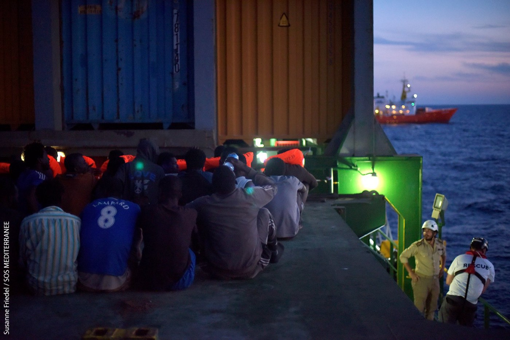
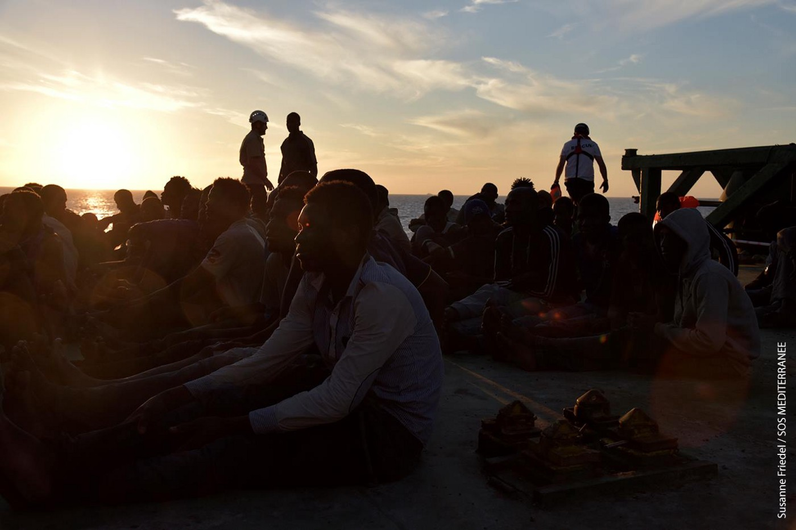
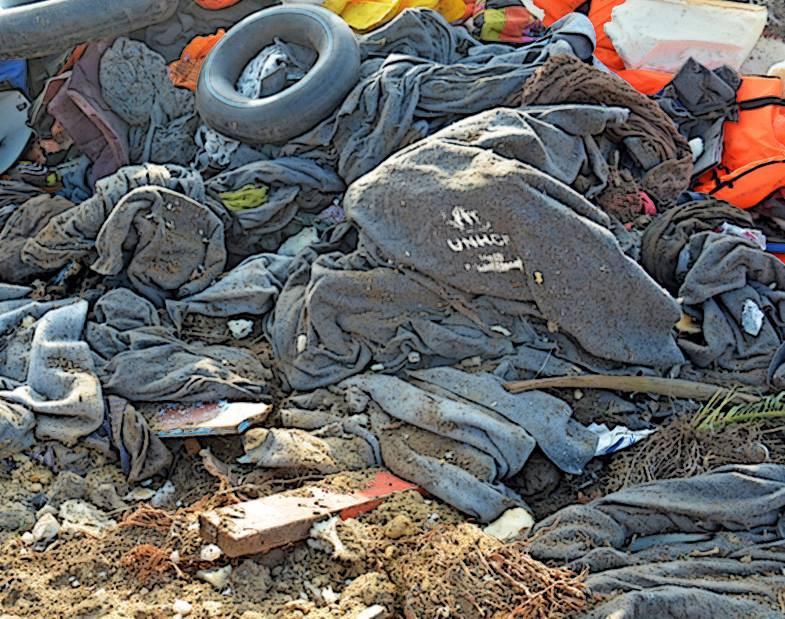
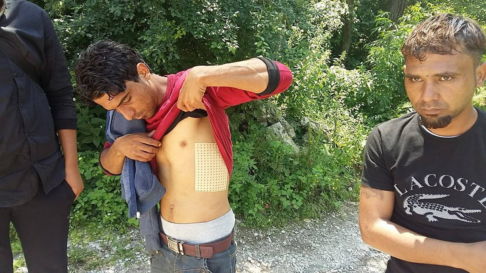
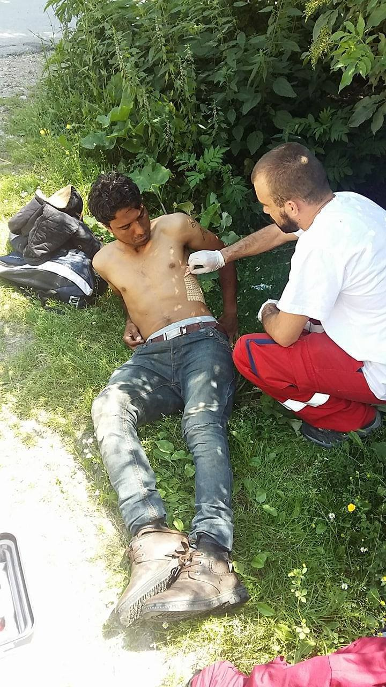

### AYS Daily Digest 22/06/17: 33 children in one boat arrive on Farmakonisi in Greece

_Hundreds of people saved from the sea / What to do in case of a negative asylum application decision / Action day planned against the evictions of refugee squats in Greece / Police violence continues in Paris / More incidents of police violence in Serbia / Free wifi in the city of Paris / Germany to continue deportations to Afghanistan / And more news…_

\(Photo by Susanne Friedel, SOS MÉDITERRANÉE\)
### FEATURE: Hundreds of people saved from the sea today

There is no time to rest for the people saving lives in the Mediterranean\. After a long day at sea, the [_Aquarius_ crew](https://twitter.com/sosmedfrance/status/877970319037800449) had 267 people on board by evening\.

[Jugend Rettet](https://www.facebook.com/JugendRettet/?fref=mentions) Group saved 127 lives together with sea\-eye\.org and [SOS MÉDITERRANÉE France](https://www.facebook.com/sosmedfrance/) \. In another joint effort last night which included Turkish cargo ships as well as the SOS MÉDITERRANÉE France team, 118 people were rescued at sea\.

\(Photo by Susanne Friedel, SOS MÉDITERRANÉE\)

Yesterday the [Sea\-Watch team](https://www.facebook.com/seawatchprojekt/posts/1884928838391855?hc_location=ufi) found the body of a woman floating in the water\. 221 people have lost their lives in the Mediterranean in the last few days, according to the UNHCR—many of them likely on World Refugee Day\.

In the evening, the same team together with the Iuventa team saved 160 people from a big rubber boat spotted close to the Libyan coast\. The Seefuchs team also found another 150 people who were rescued from a small wooden boat\.

Together with those who are helping in the Mediterranean, we mourn for those who needlessly lose their lives in the sea and call for safe passage\.

> Every death is one too many\. 

### GREECE
#### New arrivals

Even in Greece, people continue to arrive by sea\. Today, two boats arrived at Lesbos: one carrying 51 people arrived at the south of the island this morning, and another one landed along the north coast in the afternoon with 17 people on board\.

A boat with 67 people, including 33 children, also arrived today at Farmakonisi island\. All of the new arrivals will be transferred to Samos\.
#### Call for volunteers

[The Hope Project](https://www.facebook.com/HopeProjectKempsons/posts/1906345766313213?hc_location=ufi) is looking for coast support volunteers to join the north shore response group in the Eftalou/Skala Skamania zones\.

> “Volunteers are needed to join the north shore response group as part of the daily boat spotting/day and night watch/coast support team\. The watch runs 24 hours a day and shifts are set according to immediate need and changes in situation or weather conditions\. Volunteers work in pairs and on a shift rotation system\.“ 

Please do not hesitate to [get in touch](https://www.facebook.com/HopeProjectKempsons/posts/1906345766313213?hc_location=ufi) with them if you are interested in volunteering or would like more information\.
#### Deportations continue

Deportations continue on a daily basis\. Today 12 people were deported from Lesbos: six from Pakistan, three from Algeria, one from Morocco, one from Bangladesh, and one from the Gambia, all men\.
#### [Refucomm](https://m.facebook.com/notes/refucomm/what-to-do-if-you-get-a-negative-decision-your-right-to-appeal/452517748433366/) issues instructions in case of a negative decision on an asylum application

You have the right to appeal a negative decision\.

> If your application for asylum is rejected, or you are granted a status of subsidiary protection and you believe that you are entitled to a refugee status, you have the right to submit an appeal to the Appeals Authority\. 

> You will have to submit your appeal to one of the Regional Greek Asylum Offices or to the dispatched unit of the Regional Asylum Offices that delivered the decision to you, within the deadline mentioned in the decision you received\. The deadlines can be short and begin on the next day after the date you received the decision\. 

> Please make sure you understand the deadlines that apply to your particular case\. They will be clearly stated in your decision paperwork\. 

> You have a right by law to legal aid for a lawyer to help you to prepare for your appeal\. There is a list of support agencies [here](http://refucomm.com/infopacks/greece-mainland/preparing-for-your-asylum-interview/legal-help/en/greece-mainland_preparing-for-your-asylum-interview_legal-help_EN.pdf) \. 

> For more information on appeals [please check here](http://www.refucomm.com/infopacks/greece-mainland/how-to-appeal-a-negative-decision/appealing-a-negative-decision/en/greece-mainland_how-to-appeal-a-negative-decision_appealing-a-negative-decision_EN.pdf) \. 

Another organization, [Refugee Rights Data Project](http://www.refugeerights.org.uk/reports/) , conducted research concluding many people on the move often run into the problem of a lack of much\-needed information\.

> When asked about people’s access to information about their legal rights and opportunities to change their situation, 87% of respondents on Chios island Greece, 75\.4% of respondents in mainland Greece, 64\.1% of respondents in Southern Sweden, and 54\.7% of respondents in Germany lacked such information\. 

> There was a similar absence of information regarding European asylum laws and immigrations rules: 78\.3% of respondents on Chios island, Greece, 68% of respondents in mainland Greece, 59% of respondents in Southern Sweden, and 55\.9% of respondents in Germany said they don’t have access to such information\. 

#### Hands off squats\!

Tomorrow, June 23rd, marks an action day against the evictions of refugee squats in Greece\. Support is pouring in from all over Europe\.

\(Photo by City Plaza\)

In Germany, there are demonstrations planned in front of the Greek embassy in Berlin and in front of the consulate in Frankfurt at 11 am:

> Griechische Botschaft in Berlin Jägerstraße 54, Gendarmenmarkt, U Hausvogteiplatz 

> Hände weg von den besetzten Häusern in Griechenland\!
 

> Griechisches Generalkonsulat \| Zeppelinallee 43 \|
 

> Frankfurt am Main 

During the [Antiracists Festival](https://www.facebook.com/antirafestivalathens/) in Athens next week, one of the panels will feature discussion on refugee housing squats, self\-organization, and communities of struggle\.

**Speakers:** Ahmad Aga Hossaini \(Refugee Accommodation Space City Plaza\), Mimi Antonopoulou \(Notara 26 Housing Squat\), Vanessa Bilancetti \(ESC, Rome\), Mario Neumann \(Blockupy, Berlin\)
**Interventions by:** Solidarians and residents at refugee housing squats
**Coordination:** Nasim Lomani \(Network of Social Support to Migrants and Refugees\)

See the full program of the festival [here](http://antiracistfestival.gr) \.
#### The Mobile Info Team

> First victory in removing the limit on family reunification from Greece 

> After three weeks of sustained effort, the situation of families waiting to be reunified from Greece to Germany has slightly improved\. Greek authorities have told us, in June in addition to 70 transfers, up to 40 vulnerable people will be allowed to fly to Germany\. But this is not enough — we are not done by a long shot\. 

> So many people are still unlawfully kept apart, and waiting times are astronomical\. Share the petition with friends and family and in your community\. Start speaking about the issue to the people you know, speak to your representatives and ask them to do something\. 

> We can bring these families back together\! 

> [Please, sign the petition](https://www.change.org/p/family-reunification-from-greece-let-them-be-together-again/u/20623843?j=91150&sfmc_sub=453644232&l=32_HTML&u=16669655&mid=7259882&jb=2&utm_medium=email&utm_source=91150&utm_campaign=petition_update&sfmc_tk=3OK45C5M4t3f59B1ERyFokFsDOeY%2f41Q6kHWyOTclP9gdX9BCI8kYq%2f%2bkSxAGnpZ) \. 

#### Humanitarian initiatives and the environment

[Dirty Girls Of Lesvos](https://www.facebook.com/dirtygirlslesvos/) Island are reminding the UNHCR and other International NGOs, who are continuing their “environmentally unfriendly and economically questionable practice of throwing away dirty blankets and other bedding instead of washing \(to hospital standards\) and returning them,” that they are not living up to their commitments and stated environmental policies\. At least as far as the UNHCR is concerned, this is what the mission states on their website:

> “Since the 1990s, we have become increasingly committed to protecting the environment and of the environmental challenges associated with hosting a large population in a small area\. Over the course of the last two decades, we have set in place programs and initiatives aimed at improving sustainable environmental management, aiming to reduce environmental degradation and enhance the resources available to the displaced, as well as host communities\.” 

#### Upcoming heatwave

A [heatwave is descending over Greece this weekend](http://www.keeptalkinggreece.com/2017/06/22/heatwave-greece-june-july2017/#.WUuPE8ioxqA.facebook) with the temperature projected to be above 39 degrees Celsius\. The areas most affected by the heat are Athens, Larissa, and Argos in the eastern Peloponnese\.

An even stronger heatwave is anticipated at the end of the month with temperatures expected to reach over 41C\.
### SERBIA
#### Police abuse at the border

A group of people recently tried to cross the Serbian border from Macedonia, but were arrested and beaten up by the police and apparently robbed, only to be pushed back to Macedonia at the end\. All of the refugees are from Iraq, and two were badly beaten up with batons\. One was even taken to the hospital\.

Police abuse continues along the Macedonia\-Serbia border \(Photo by AYS\)
### FRANCE
#### Violence at Porte de la Chapelle continues

The opening of the centre, “First Reception,” yesterday around 7am was again marked by a climate of violence\. Around the camp at Porte de la Chapelle, hundreds of people have been living for months in what can only be described as an extremely precarious situation, being victimized daily by the police for abuse\. An account, which can be found in full [here](https://www.facebook.com/groups/P2PParis/permalink/1390914810995389/) , in part reads:

> “Yesterday morning, while more than 70 persons waited, the police picked out single people out and only let about 10 persons in\. The crowd starts moving but is immediately pushed back by the police, who used tear gas\. Two persons drop on the ground, lifeless\. Witnesses are not welcome; intimidations, shoving, confiscation of the camera\.” 

**For more on the living conditions in Porte de la Chapelle, [see the photo story in our recent AYS Special](ays-special-refugees-stuck-in-and-around-the-camp-porte-de-la-chapelle-69010d86795f) \.**
#### Free wifi at most bus stops in Paris

> Did you know that Paris provides free WiFi \(and charging stations\) at most bus stops? Great news for anyone living on the streets\. 

> Please, let people know about this\! 

### GERMANY
#### Deportations to Afghanistan continue

The media are reporting that Germany will continue with deportations to Afghanistan next week, despite the fact that there is no good news coming from that country\. Even though there is no official confirmation, several media outlets in Germany reported that a new deportation flight to Kabul from Leipzig could leave as early as Wednesday\.

The government temporarily stopped its deportation program earlier this month after the deadly attacks in Kabul that struck the diplomatic quarter\.

Maybe people in Germany can look towards France where groups of activists are asking passengers while they are boarding to react and prevent deportations with success\. As recently as today, passengers intervened and prevented the deportation of a man who was to be returned to his country of origin and forced to leave his wife, eight\-month\-old child, and family in France\.
### UK
#### Migration Matters Festival workshop

During the [Migration Matters Festival](https://www.facebook.com/events/136174150274552/?acontext=%7B%22ref%22:%224%22%2C%22feed_story_type%22:%22308%22%2C%22action_history%22:%22null%22%7D) , a special workshop will be organized for those who want to learn about the UK’s asylum system\. It is free and open for everybody\.

> **_We strive to echo correct news from the ground through collaboration and fairness, so let us know if something you read here is not right\._** 

> **_If there is anything you want to share, contact us on Facebook or write to: areyousyrious@gmail\.com\._** 

_Converted [Medium Post](https://areyousyrious.medium.com/ays-daily-digest-22-06-2017-33-children-in-one-boat-arrived-to-farmakonisi-island-greece-7ef8ba8f176c) by [ZMediumToMarkdown](https://github.com/ZhgChgLi/ZMediumToMarkdown)._
