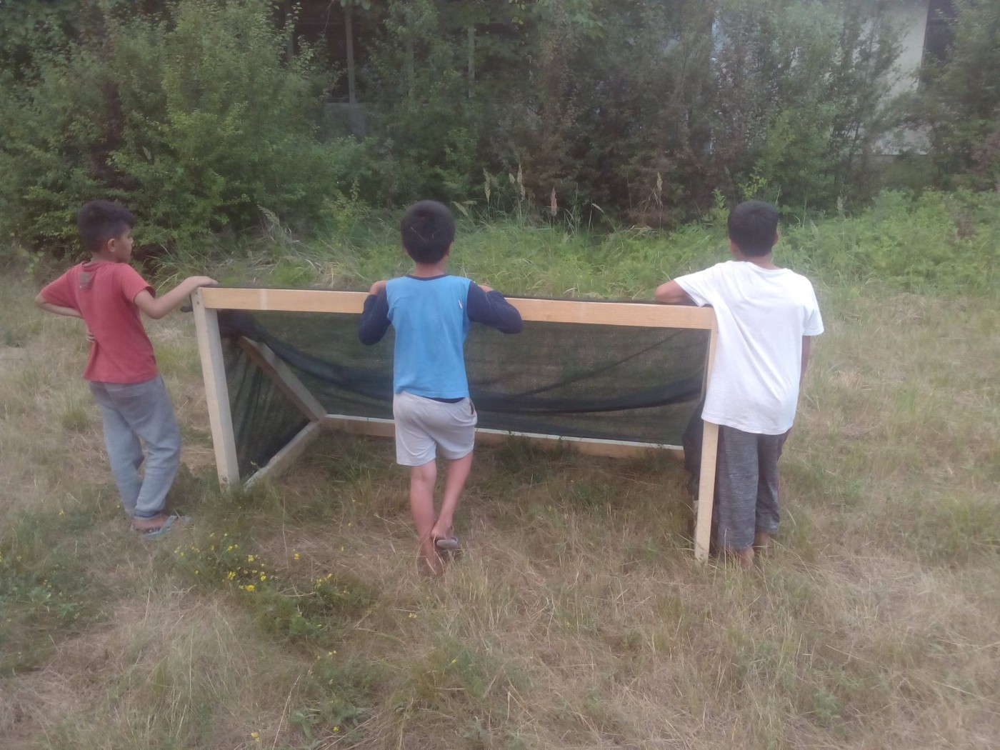

### AYS Daily Digest 23/06: Fences do not contain souls, Squat evictions in Greece

Why solidarity? / Fire near Moria camp / Needs list for Chios / Distribution begins to Serbian transit centres / Italy moves on agreement with Libya to prevent people from entering Libya / French politicians again place blame for mistreatment of refugees on refugees themselves, wish to prevent a “blight\.”

](assets/2940805af8a6/1*KkFMOsonKk5zH1xOnB26MA.jpeg)

Photo credit: [Marios Lolos](https://www.facebook.com/marios.lolos.1)
### FEATURE: Eviction of Squats and calls for Solidarity

Today, the eviction of the City Plaza Squats housing refugees in Greece was scheduled\. As a result of this, members of squats called for solidarity action across Europe stating “Hands off the Squats\!” There were actions in Germany protesting in front of the Greek embassy and elsewhere\.

](assets/2940805af8a6/1*8Z7vMxfnEXrMhsjxV8LQUg.jpeg)

Solidarity protest with squats, Germany\. Photo credit: [Das beste Hotel Europas](https://www.facebook.com/dasbesteHotelEuropas/)

Why is this important? We must take some time to consider the crucial features of squats that make them valuable to support infrastructure to not only refugees, but any and all who fall outside of the system\. The reality is that the best affirmation to humans who are being spurned by the system is, simply, their humanity\. Autonomy and individualism are human rights and needs that are the first at risk in situations of displaced persons\.

■■■■■■■■■■■■■■ 
> **[Daphne Tolis](https://twitter.com/daphnetoli) @ Twitter Says:** 

> > Solidarity groups &amp; refugees gather outside the Ministry of Migration to protest against the planned evictions of refugee squats.
#CityPlaza https://t.co/2v9cbtUOuj 

> **Tweeted at [2017-06-23 16:46:37](https://twitter.com/daphnetoli/status/878293225420632064).** 

■■■■■■■■■■■■■■ 

Even in the best of camps, where all are working together, the strengths of squats come from affirming and satisfying this real human need\. The need for dignity, the lack of condescension\. Although sometimes camps are a necessary evil, we must not forget that it is by nature, an evil of a sort\. Forcing people to remain in a location, limiting their freedom, treating them as suspect\. No matter how functional a camp can be, if people are restrained to them, then there is violence inflicted upon those people\.

■■■■■■■■■■■■■■ 
> **[ANTIplhroforhsh](https://twitter.com/ANTIplhroforhsh) @ Twitter Says:** 

> > Protest about refugee squats in Athens #antireport https://t.co/9PUFNlbBHC 

> **Tweeted at [2017-06-23 17:23:47](https://twitter.com/antiplhroforhsh/status/878302579717005321).** 

■■■■■■■■■■■■■■ 

Those residing in camps often are exposed to greater structural violence and are in a situation where they can be moved against their will at any point\. We have seen time and time again how the state can move at its will and sweep away camps, squats, settlements\. And here again, although it is unlikely that continued protest and solidarity will result in any tangible halting or reduction of violence; however true solidarity focuses on the person, not the goal\.

Through all of our efforts, whether inside of camps or outside, we must make the time to focus on the people, their stories, their humanity around us\. To fight\. If the fight is lost, to grieve\. If the fight is won, to celebrate\.

](assets/2940805af8a6/1*-C3kULxD7V99MVFBJm9ADw.jpeg)

A protestor at the Hands Off the Squats Protest solidarity action in Greece\. Photo Credit [Marios Lolos](https://www.facebook.com/marios.lolos.1)

Again, this is not to stratify solidarity movements and claim that volunteers who help in camps are somehow “lesser” in any way\. There are good ways to help in established systems and toxic ways\. Similarly, there are good ways to help outside and toxic ways\. It is ultimately through humility, communication, and a kind and open mind that help can be made valuable wherever it is offered\.

However, this opportunity to provide support to a movement that stands in opposition to the golden facade on the crumbling statue that is the refugee support structure is one that is valuable to attend to\.
### GREECE

Once again, we find that the unity and solidarity of the European Union is often limited to action that will either push people back or keep them restrained\. When it comes to adhering to agreements of resettling refugees? Not so much\. according to Asylum in Europe, a recent report by AIDA discussed not only the lack of political will in resettling refugees, but also a continued increase in giving preference to detention\.

> “An [AIDA legal briefing](http://bit.ly/2sQkcKK) published today tracks the expansion of detention policies and practices across Europe\. Despite the entry into force of common standards relating to detention such as those prescribed in the recast Reception Conditions Directive, the deprivation of liberty of asylum seekers as a migration control instrument varies significantly from one country to another\. In 2016, detention was applied to a substantial part of the asylum\-seeking population in countries such as Bulgaria, while its use remained low in Poland or even minimal in Malta\. 

> At the same time, the briefing documents a visible trend of increase in detention infrastructure across Europe, with notable examples of rising detention capacity in the Mediterranean region\. Countries such as Turkey, Italy, Spain and Greece, that have some of the most sizeable detention infrastructures in the continent, are in the course of establishing additional spaces for confining refugees and migrants\.” 

Although it is easy and valid to criticize the countries with large numbers of detention facilities \(Turkey, Italy, Spain, and Greece\), it must be remembered that these border countries are being used by the inner circles to push refugees out — to protect the “core” of Europe\. Attention and criticism must be paid to all facets and cogs in the machine, otherwise we will only cure the symptom and not the disease\.

■■■■■■■■■■■■■■ 
> **[Oscar Camps](https://twitter.com/campsoscar) @ Twitter Says:** 

> > Grande! Muy grande!! un sencillo y sincero agradecimiento es algo tan grande. https://t.co/4y742fba4D 

> **Tweeted at [2017-06-23 10:14:18](https://twitter.com/campsoscar/status/878194493954039808).** 

■■■■■■■■■■■■■■ 

An insightful piece on a day in the life in and around Lesvos\.

There are updates from Mobile Info Team regarding Skype meetings for the Asylum Service\. Please read below and note the changes\!

> The Asylum Service have changed the schedule for calling them on Skype to begin an application for asylum\. The changes will take effect next Monday, the 26th of June\. If you know anyone currently trying to get through on Skype, please let them know\. You can see the new times in the following link or, if it’s easier for them to understand Arabic or Farsi, please share the text of the facebook post below\. A similar post in Urdu will follow soon on Mobile Info Team’s facebook page\.
 

> [http://bit\.ly/2tWd1OD](http://bit.ly/2tWd1OD) 

Good news for women seeking some privacy at Khora\.

“Women only English classes at Khora soon WOMEN ONLY ENGLISH 
Khora will offer women only English classes from 10th July\. next term\. The classes will take place Mon\-Fri from 10\.00 to 12\.00 at 4 different levels of English\.

Interested students need to make an appointment at the Khora Info Desk before the 30th of June for a test to see what level they should attend\. Tests will take place July 3rd, 4th and 5th from 14\.00–16\.00\. The test on Tuesday 4th will be for women only, but women may attend any day that they prefer\. It will not be possible to take a test without an appointment\.The female students that are already enrolled in Khora’s education programs do not need to take another test but can choose to attend the women only classes if they want\.”

A terrifying fire swept behind Moria today, in the forest in proximity to the camp\. Fortunately, no one was hurt\. Unfortunately, fire season continues to be a real threat to refugees in this horrific hot weather\.

 ‎](assets/2940805af8a6/1*mu6Xc1VA3fKGRHUA1tZ0Wg.jpeg)

Fire around Moria\. Photo credit: ‎ [**مهاجر immigrant**](https://www.facebook.com/riadh04/) ‎

This is the assembled needs list for Chios\. UK Volunteers are assembling a pallet and the following list was shared\. Please be in contact with [Jane Louise Tornado](https://www.facebook.com/satsuma22?fref=nf) if you wish to find more information on where and how the pallets are being assembled\.

Footwear

Sumner shoes — Crocs / Flip Flops 
 Men / Women / Children

TRAINERS\! 
 Men /Women/ Children

Summer Clothing

Men
 Tshirts \(no skulls or inappropriate designs please\) \.
 \-shorts
 — lightweight trousers
 Sizes small, medium and large\.

Women
 — Tshirts
 — long sleeve light weight tops \(not see through\)
 — leggings 
 — lightweight trousers 
 \-long lightweight tunics

Children 2 years \+
 \-T\-shirts 
 — Shorts 
 — lightweight trousers

UNDERWEAR — new only 
 Mens — small, medium, large
 Women’s — small, medium, large 
 Children all ages\.

Socks: — New
 Mens
 Women’s 
 Children — mainly 10 years \+ please\.

Toiletries:

Insect bite cream\.
 Lice Shampoo 
 Lice Combs

Babies/ Young Children:

Nappies/ Pampers
 Pull up type for older children \(trauma \)
 All sizes — especially 4, 4\+, 5, 5\+, 6\.

Milk in powder form 
 Especially stage 3

_Although it is crucial for Chios to be receiving these items now, as months turn into years, these lists become trends\. Please keep in mind the seasons and regular needs accordingly\. When donating, do not just take the opportunity to clean out your house, but rather take care, that the items you are giving can be useable in their original form\. :\)_

SERBIA

A sobering reminder that no matter how many good stories we hear coming from camps, many people there are taken there by force\. On the 22nd in the morning, there was another police raid in Šid and the surrounding area, with 91 people being taken to Preševo\. The Police came with batons and pistols and individuals have reported violence\.

In the aftermath of the sweep, the work goes on\. [Rigardu e\.v\.](https://www.facebook.com/rigardu/) is looking for a volunteer driver, especially one with trailer skills\! Please contact them if you can help out\!

BelgrAid has started distributing hygiene kits to transit centres in Serbia\. Additionally, they were able to distribute several table tennis tables, two football goals, and two basketball hoops to Kikinda\. What a happy delivery\!

Below are excerpts from their report:

_“Following on from the success of our first hygiene kit distribution at Kikinda transit centre earlier this month; yesterday we went to Sombor transit centre with more of the same\! This time around, having consulted with our beneficiaries, we decided to include extra essential items such as socks, underware and towels\. In all meaning that the people living in Sombor will be able to regularly maintain their personal hygiene for the next month\._

_Good personal hygiene is essential for maintaining health and self esteem\. Our goal is to continue with these essential distributions on a regular basis; expanding our reach to other populations as we go\.”_

Photo Credit: BelgrAid

Check out [BelgrAid](https://www.facebook.com/belgraid/) for more information\!

### ITALY

_Italian Foreign Minister Angelino Alfano said Thursday that Europe will take “a true step forward” in managing migrant flows on the central Mediterranean route when it focuses “all of its weight” on its relationship with Africa\._

_Alfano spoke at his arrival prior to the European People’s Party \(EPP\) summit\._

_“Meanwhile, we’re moving ahead with the programme and on July 6 we will host some transit countries in Rome in order to keep momentum going\. We’ve made an agreement with Libya, we’ve done it with Niger, now we want to do it with other African countries,” Alfano said\._

_Alfano said representatives from other European countries interested in these agreements will also be present at the meetings\._

_He said the agreements are “not to impede departures from Libya but to prevent migrants from entering Libya at all”\. “I think this is real progress,” he said\._

\(source: ANSAmed\) \.

This focus is cast in an additional disturbing light when contextualized with a quote from a member of the Libyan coast guard: "We don't need any training\. We know how to navigate, how to fight and how to kill" \- Commander Al\-Bija\. The focus on stemming the tide rather than combatting the murderous attitudes sickens the mind\.

](assets/2940805af8a6/1*yOD3Lkgz0tRsZanh9e6thQ.jpeg)

Photo credit: [**Refugee Accommodation and Solidarity Space City Plaza**](https://www.facebook.com/sol2refugeesen/)
### FRANCE

The Dunkirk Refugee Women’s Shelter posted a comprehensive update on their activities and the situation in the area\. Several repeated altercations with police leave people stripped of what meager possessions they had, additionally stressed, and homeless\.

“ _Prior to this visit in June, I imagined a few families living dotted around in tents in the woods near Grande\-Synthe, but as we drove up the track to Puythouk, I realised the situation was far more serious\._

_Around 300 men, women, children and babies now live without shelter in the woods and grasslands\. There is no running water, no toilets, no cooking, heating or washing facilities\._

_The CRS_ \(Compagnies Républicaines de Sécurité/riot police\) _had, apparently, told everyone to move aside and then cleared away tents and tarpaulin, and either taken or pepper sprayed sleeping bags and blankets, rendering them useless\. Families with children and babies were left with nothing but the ground to sleep on and the trees for shelter\.”_

The volunteer continues to describe horrific conditions and the endless work needed in order to help provide and ameliorate the situation in any possible way\.

_Just as we were leaving we \[c\]ame across five young unaccompanied boys of 16 resting under a tree\. They had arrived that afternoon and told us they were “bambinos”\. They had nothing but the clothes they arrived in\. They were tired, hungry and had not been able to wash for two days\._

Read the full report by Sue Cooper [here](https://www.dunkirkrefugeewomenscentre.com/single-post/2017/06/23/Voices-4-No-Shelter-No-Facilities-but-Dignity-Hospitality-and-Hope-Survive) \.

Again, volunteers with Dunkirk / Dunkerque Refugee Women’s Centre participated along with others in a protest against the forcible deportation \(the second attempt at deporting the same man\) today\.

“The Refugee Women’s Centre was at the airport to convince passengers to protest the deportation of a father and husband\. The same person was placed, again at the last minute, on a flight to Kabul\. Passengers agreed to talk to the staff and chief of cabin, though this time the company had seriously briefed their employees and security was heightened\. Although the person who was being deported was masked \(to prevent him from shouting\) passengers refused to sit down even after the plane had left the gate\. Forced to return to the gate, the pilot ordered the man to be taken off the plane for the flight to resume\.

Theoretically, he should be freed tomorrow as his detention period ends\. That is, if the government doesn’t suddenly decide to place him on a flight once more\.

Many thanks to all of your support through this\.”

The man had previously harmed himself in the detention centre\. and has an eight\-month\-old baby\. Additionally, other passengers on the flight were distributed flyers in order to alert them of the reasoning for the protest and delay\.

_French Interior Minister Gérard Collomb visited Calais today\. France’s top human rights official Jacques Toubon called for the creation of a new “reception space”, in particular because of hygiene reasons and expressed his shock at the fact authorities do not respect the legal obligation to give people access to their fundamental rights, be it just by giving them food and water\. Collomb instead said that humanitarian organisations should ‘use other places than Calais to deploy their skills’ and insisted that the priority is to “cut off the road to smugglers”, adding that he “distrusts centres that say they are willing to host migrants for a couple of days but then stay much longer”\._

_He also joked about the “legendary gentleness of migrants” and said that police acts with “humanity”\. He wants to strengthen security through the arrival of two new mobile police companies and prevent the creation of new camps\._

Translated from the following [text](https://www.politis.fr/articles/2017/06/gerard-collomb-plus-proche-des-identitaires-que-des-humanitaires-37219/) \.

Macron, too, has taken a harsher line against refugees, stating that he does not with for Calais to become an “abscess” of them\.

Again, we find a fundamental misunderstanding of the interaction between smuggling networks and official policies on containment\. Continued aggression and threats against people only pushes them further into the arms of smugglers\. There are dozens of other functional strategies for diminishing the power of smugglers, but telling NGOs off and simply herding refugees around does no good\.

> **_We strive to echo correct news from the ground, through collaboration and fairness, so let us know if something you read here is not right\._** 

> **_Anything you want to share — contact us on Facebook or write to:areyousyrious@gmail\.com_** 

_Converted [Medium Post](https://areyousyrious.medium.com/ays-daily-digest-23-06-fences-do-not-contain-souls-squat-evictions-in-greece-2940805af8a6) by [ZMediumToMarkdown](https://github.com/ZhgChgLi/ZMediumToMarkdown)._
