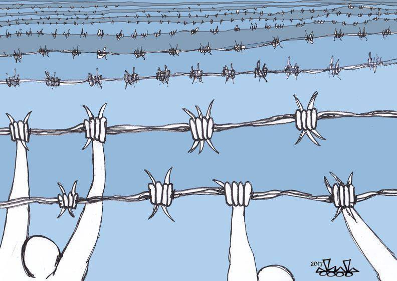
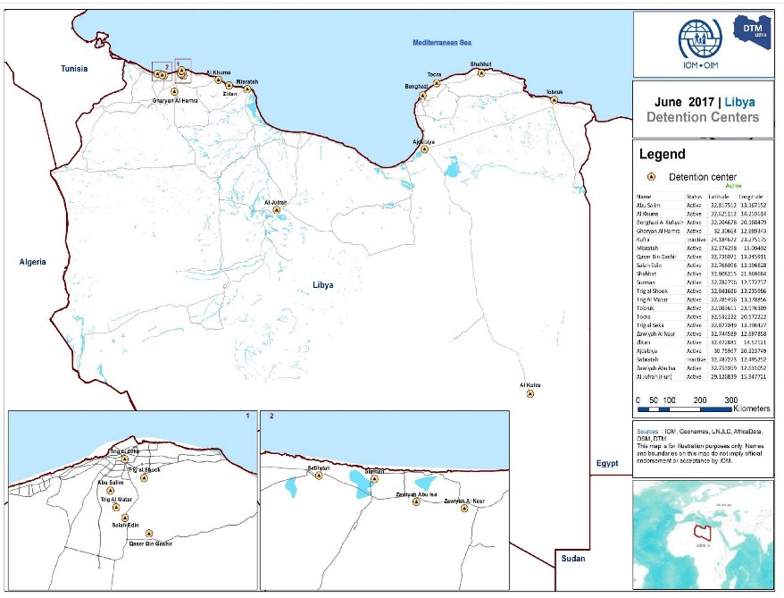
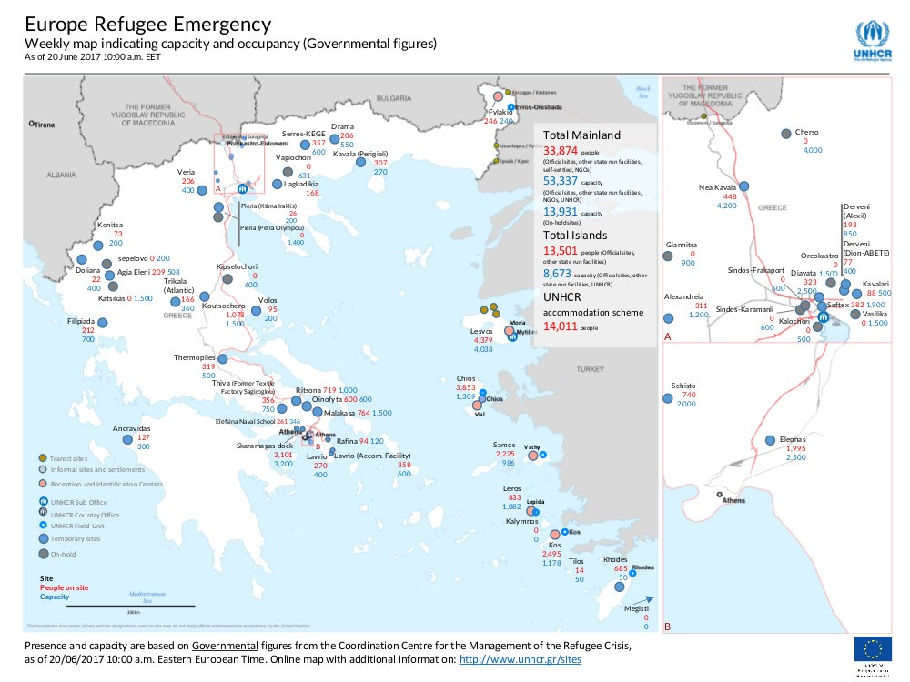
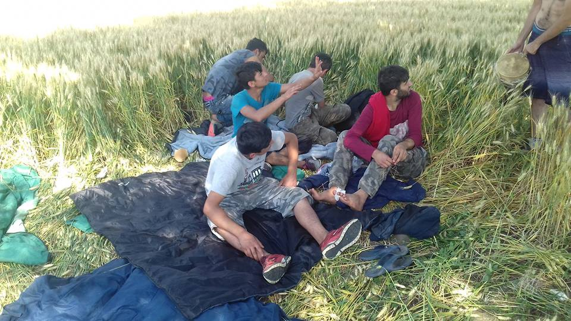
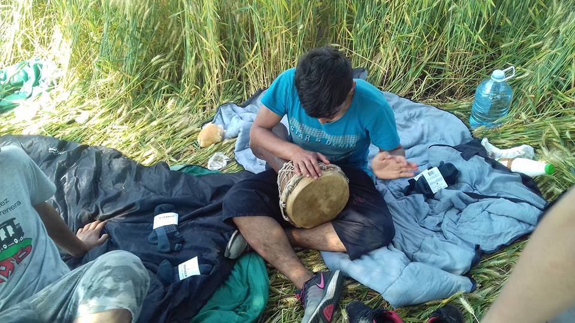
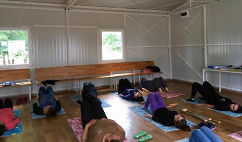
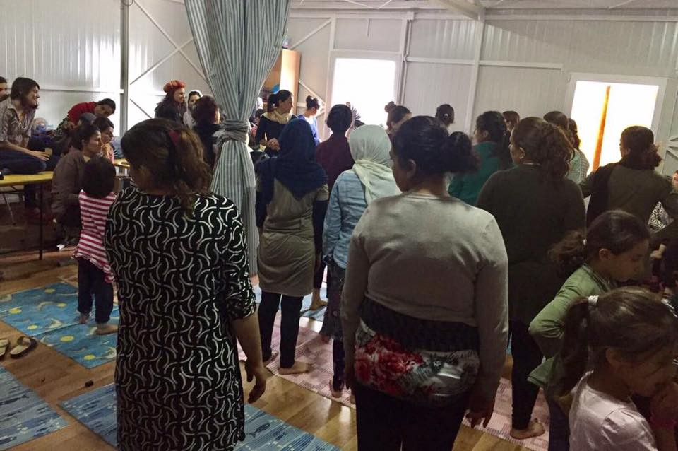

### AYS Daily Digest 24/6/2017: New information from 13 detention centres in Libya

Deportation from Germany to Afghanistan postponed / Solidarity to Athens squat from European activists / Updates from Greece, Serbia, Italy and France

Hasan Bleibel Art \(Art Against\)
### Feature: Information on Libyan detention centres

Information from governmental sources were collected in the first half of July by the [Libya’s Displacement Tracking Matrix \(DTM\)](http://www.globaldtm.info/libya/) \.

DTM launched a Detention Centre Profile component on 14 June 2017, collecting information from across detention centres managed by Libya’s Directorate for Combating Illegal Migration \(DCIM\) \.

DTM aims to provide baseline assessments into the facilities and infrastructure of certain detention centres, including the functionality of electricity, lighting, latrines, the ventilation system, and laundry facilities, etc\. Simultaneously, it to provide all partners with a snapshot of the demographic characteristics and health conditions of migrants in detention centres on the day of assessment\.

While the profiling will be held monthly and more centre are to be added in next rounds, at the date of the launch DTM collected informations from 13 camps\. All the informations are acquired through managers and staff of the centres, with NGO staff as second informants in only 3 cases and no migrants interviewed\.

Detention centres investigated \(DTM\)
- The total capacity of the 13 camps is 9370\. 2690 migrants were inside the structures, with figures low as 12 and high as 563\. Among them 160 minors \(138 boys and 22 girls\), of which 136 unaccompanied children, 10 pregnant women and 22 breastfeeding\. Most of the people are from Guinea Bissau, Nigeria, Sudan, Senegal and Morocco\. Only 161 working staff were counted \(data from 4 centres are not available\) \.
- Three of the 13 centres held over 500 migrants present at the day of assessment: Trig al Shook, Gharyan Al Hamra and Trig al Seka
- Seven had health services available and referral services to hospital for ill migrants\.
- Many adults fell ill in the last month, with reported cases of hepatitis and scabies\.
- Three had either no ventilation system or only ones working irregularly\.
- In one centre no functioning latrines are available \(Al Kufra\), while limited availability are reported in other four centres\.
- Government provides food in all centres, from one to three times a day\. Migrants also were reported to have irregular access to drinking water in three centres: Benghazi al Wafiah, Salah Aldin and Tobruk\.
- In nine of 13 centres migrants enjoyed access to outdoor spaces less than half the day\.
- In only one centre migrants have access to legal services \(Benghazi al Wafiah\), while only two run a psychosocial support program\.
- There’s no access to internet or printed media, while television is accessible in three centres\. In seven centres mobile phones are not allowed\.

The detention centre assessment will be conducted on a monthly basis, with more centres to be added in future rounds\. The detention centre profiles are available [here \(xls file\)](https://drive.google.com/drive/folders/0B-qpxdnv9nlWMlN6QkFoZE40Z2s) \.

**General**
### Frontex data: Growing numbers in arrivals in May

According to [Frontex data](http://frontex.europa.eu/news/arrival-of-migrants-in-may-numbers-in-italy-and-greece-higher-than-year-ago-DQOpWZ) there were around 27 000 detections of illegal border crossings on the four main migratory routes into the EU in May\. The total number of detections in the first five months of 2017 fell 75% from the same period of last year to 84 000, although the number of migrants arriving in Italy remained above the figures from a year ago\.

**Central Mediterranean**

In May, the number of migrants arriving in Italy through the Central Mediterranean route rose by 77% from April to 22 900\. This brought the total for the first five months of the year to more than 60 000, 26% higher than the figure from the same period of 2016\. Roughly three out of every four migrants arriving in Europe so far this year have come through Italy\.

Nationals from Nigeria, Bangladesh and Ivory Coast accounted for the largest number of the detected migrants on the Central Mediterranean route last month\.

**Eastern Mediterranean**

The number of migrants arriving in Greece by both sea and land routes in May rose 31% from the previous month to more than 2 240, in large part thanks to improved weather conditions\. The figure was similar to the numbers from May 2016\.

In the first five months of this year, some 9 900 migrants reached the Greek islands, 94% lower than in the same period of 2016\.

Syrians and Iraqis continued to account for the majority of detections on the Eastern Mediterranean route in May\.

**Western Mediterranean**

The number of detections of illegal border crossings in the Western Mediterranean more than doubled in the first five months of the year compared to the same period of 2016 to nearly 6 000, in large part due to an increased activity at the land borders of Spanish enclaves of Ceuta and Melilla in northern Africa\.

**Western Balkans**

In May, the Western Balkans route saw a low number of detections of illegal border\-crossings, similar to the previous month\. The reasons for the significant drop in recent months is the fact that fewer migrants have been leaving Turkey through its land borders towards the Western Balkans\.

**Europe**
### Solidarity actions with Zoudochou Pigis 119, Papouchadiko, City Plaza

As reported yesterday, the Coordination of Refugee Squats \(City Plaza, Notara 26, Oniro, Spyrou Trikoupi, Arahovis, 5th School, Jasmine School, Acharnon 22\) in Athens called for yesterdays international day of action [“Hands off the squats”](https://enoughisenough14.org/2017/06/16/cityplaza-call-june-23-hands-off-the-squats/) \. In the call activists demanded to keep the squats open, to close the camps and detention centers, to cancel the shameful EU\-Turkey deal, to open the borders and stated that “you can’t evict a movement\!”

In Athens people protested against a possible eviction of [City Plaza](https://enoughisenough14.org/2017/01/11/refugeesgr-keep-cityplaza-open-refugee-hotel-athens-greece/) , Papouchadiko and Zoudochou Pigis 119 in front of the ministery of migration\.

Demonstrations and action were held all over Europe: In Berlin people protested in front of the Greek embassy\. In Frankfurt in front of the Greek consulate, delivering a letter in which activists wrote that they consider an eviction of City Plaza or any other squat as “an attack against all of us” and that they “know how to use the power of solidarity\.” Solidarity banners have been held in Lübeck and Rostock, while other demonstrations were in Brussels and Wuppertal\.

■■■■■■■■■■■■■■ 
> **[Enough 14](https://twitter.com/enough14) @ Twitter Says:** 

> > #HandOffSquats Solidarity action in front of Greek embassy in #Berlin earlier today. #CityPlaza #antireport https://t.co/q40RSlJ7er 

> **Tweeted at [2017-06-23 17:50:16](https://twitter.com/enough14/status/878309242096107520).** 

■■■■■■■■■■■■■■ 

**Greece**
### Greek islands still over capacity

The [weekly map](http://reliefweb.int/map/greece/greece-europe-refugee-emergency-weekly-map-indicating-capacity-and-occupancy-2) of official sites capacity and occupancy published by UNHCR shows that the Greek islands are still overcrowded, with 13501 refugees for a capacity of 8673\. As of the 20th of June 33874 refugees are living in camps on the mainland\.

Capacity and occupancy map \(UNHCR\)

This data don’t take into account informal and autonomous accommodation and are based on governmental figures from the Coordination centre for the management of the refugee crisis\.

**ARRIVALS**

119 people arrived today in Karpathos\. They were transferred to Rhodes\. Among them two pregnant women and 23 underage children\. The ship carrying them was mechanically damaged and one of the passengers called for help via a mobile phone at the European 112 number\.

One boat arrived in Samos, carrying 51 people: 13 men, 15 women and 29 children\.
### EID CELEBRATIONS AT KHORA, ATHENS \(26 and 27 June\)

In celebration of Eid, Khora will host two days of food, music and dancing\. Kids activities will run from 3pm \(Education floor\) throughout the day and dinner will be served at 6 30pm \(Khora Cafe\) followed by music and dancing\!

Read the full post in English, Arabic, Kurdish, Balochi and Urdu [here](https://web.facebook.com/events/1429245130500380/?acontext=%7B%22source%22%3A4%2C%22action_history%22%3A%22[%7B%5C%22surface%5C%22%3A%5C%22group%5C%22%2C%5C%22mechanism%5C%22%3A%5C%22surface%5C%22%2C%5C%22extra_data%5C%22%3A[]%7D]%22%2C%22has_source%22%3Atrue%7D&source=4&action_history=[%7B%22surface%22%3A%22group%22%2C%22mechanism%22%3A%22surface%22%2C%22extra_data%22%3A[]%7D]&has_source=1) \.
### Volunteers needed\!

[Syrian American Medical Society Global Response](https://web.facebook.com/samsglobalresponse/?fref=mentions) \(SRG\) calls for volunteer physicians and nurses with experience in primary health care to join our upcoming medical missions to the Greek islands \(Chios, Lesvos, Samos, Leros and Kos\) \. Missions are set to start soon\. For more information, please visit their [website](https://foundation.sams-usa.net/global-missions/) and [facebook page](https://web.facebook.com/SyrianAmericanMedicalSociety/posts/1381918585191272) \.

[Movement on the Ground](https://web.facebook.com/movementontheground/) is looking for an additional team member for their Sports program\! The past year they hosted a football program for the kids of Kara Tepe\. This program will be expanded to include other sports and therefore they’re looking for additional coach\! 
 The closing date for this application is July 1st, 2017, 11:00 PM \(CET\) \. Read more and apply [here](https://web.facebook.com/movementontheground/photos/a.563378670505116.1073741828.563368157172834/887631498079830/?type=3&hc_location=ufi)

**Italy**
### Fundrainsing for No one is illegal summer camp \(Bologna, August 21st — September 2nd\)

[Accoglienza Degna](https://web.facebook.com/nooneisillegalcamp/) \(Reception with dignity\) is a project started by the political collective “Làbas” which has previously campaigned on housing and immigration policies in Italy\. It’s a social dormitory for refugees and homeless people in Bologna, managed by volunteers, activists and guests altogether\. It housed over 40 refugees and currently hosts 13 people\.

> We want to run a two weeks **international summer camp:** 

> \- to upgrade the buildings where our project is situated 

> \- to create dedicated space for each of the many activities that take place in Accoglienza Degna 

> \- to promote interchange and create links with the international volunteer community\. 

> **How do we make a change?** 

> This project will be invaluable in: 

> \- providing more services to refugee communities in Bologna and greatly improving the quality of life of marginalized people 

> \- returning another part of Ex\-Caserma Masini to the society, the neighbourhood and the city\. 

> \- giving volunteers the opportunity to learn more about the situation for refugees in Italy and opening debate spaces on European migration policies 

Read more about the project and donate [here](https://chuffed.org/project/no-one-is-illegal-summer-camp#/story)

**Serbia**
### Hiding on the Serbian\-Croatian border

The German organisation [Umino](https://web.facebook.com/umino.org/?ref=br_rs) published yesterday and today updates from their volunteers on the Serbian\-Croatian border\. Groups of refugees are living in very remote areas, trying to hide from police controls\. We frequently reported about the brutal attitude of both Serbian and Croatian police towards refugees\. Umino volunteers got in contact with a group of 10 Ahghani living without proper provisions\. They managed to reach them and deliver much needed food and clothing donations\. They were running out of food and water and lacked proper shoes\. Among them there are five boys between 13 and 19 years old\. Some of their relatives are in Afghanistan, while others are scattered in other countries in the middle east, in England and Germany\. The youngest of them escaped the Taliban recruitment and doesn’t have any contacts with his parents\.

Refugees on the Serbia\-Croatia border \(Umino\)
### Refugee reported dead in Adasevci

A refugee living in Adasevci informed AYS that two persons allegedly fell down yesterday from a container near Adasevci gas station\. One of them broke is neck and lost his life, while the other is seriously injured and is now in Belgrade hospital\. They are both from Afghanistan, aged 16 and 17\. The container was going towards Bulgaria and they jumped from the high\-speed running container\. We will add more info in the coming days
### Fitness classes in Presevo and Bujanovac

[Borderfree association](https://web.facebook.com/borderfreeassociation/) has recently started new fitness classes for girls and women\.

Women only fitness class in Presevo and Bujanovac \(Borderfree association\)

> Every Monday in Preševo and every Saturday in Bujanovac, we meet for about one hour to exercise and relax, making it possible for every woman and girl to take their mind off their everyday duties, and, most importantly, have fun together\. We are starting with simple but effective exercises, as they are entering in the final stage of Ramadan, and will slowly introduce more complex movements\. The lesson lasts for about 45 minutes and it is usually followed by spontaneous and fun dancing\. 

> We have already met two times in the camp of Preševo, and once in the camp of Bujanovac\. Both experiences were a success\! The women were very excited about the lessons and would like to exercise every day\. We couldn’t be happier with the result, and look forward to many more interesting afternoons with them\. 

**Germany**
### Deportation postponed

[ECADA, European Citizens Against Deportations to Afghanistan](https://web.facebook.com/ecada2017/) and [media sources](http://www.spiegel.de/politik/deutschland/afghanistan-bundesregierung-sagt-abschiebe-flug-nach-kabul-ab-a-1153890.html) report that a deportation planned for June 28th has been officially postponed after the plans for the flight had been leaked\. A nationwide outcry of Human Rights Groups and other NGOs found its way to the media pressured the government to halt the deportation\. 
 The government stresses, however, that the flight was postponed due to the German Embassy having been hit severely in Kabul blast and that embassy staff was therefore not able to take care of the necessary logistics\.

For future deportations, the German Federal Police might be asked to assist with these tasks\.

ECADA published a list of questions, inviting Sigmar Gabriel, Vice\-Chancellor and Foreign Affair minister to answer publicly:

> We would like to know, [\#SigmarGabriel](https://web.facebook.com/hashtag/sigmargabriel?source=feed_text&story_id=1919119534970710) : 

> \- How come that the Foreign Office has only now noticed that embassy staff is still occupied otherwise? 

> \- What “logistics”, btw? The “reception committee” hands out some cash and some flyers with information and that’s basically it\. Deportees make their way to taxis after having cleared immigration and are basically left to themselves\. 

> \- What logistics in regard to cooperation with Afghan authorities are taking place? 

> \- They neither know which of the deportees has been punished by German criminal law nor who needs urgent medical care\. 

> \- Why do German politicians keep claiming that only criminals are being deported when, of the previous 106, only 34 were “criminals” of some sorts? This puts all deportees under suspicion by their countrymen\. 

> \- When is the visa section going to open again or which consulate or embassy can be used in the meantime, so that children get to see their parents after years of separation? 

> You are very welcome to reply to these questions personally on our page\. 

**France**
### A difficult summer in Calais

Following last few days declarations from several French officials \(reported in previous digests\), [L’Auberge des migrants](http://www.laubergedesmigrants.fr/) call for donations to get ready for a difficult summer, in a harsh political climate, to keep provide water, food and essential aid to the _exiled_ of Calais\.

Read more and donate [here](http://www.laubergedesmigrants.fr/fr/lauberge-se-prepare-appel-dons/) \.
### Update from Paris

Sarah Fenby\-Dixon, a volunteer published an [update](https://web.facebook.com/groups/P2PParis/?ref=group_header) from Paris:

> Another busy day\. Thank you so much to all those who donated\. I bought 300 pairs of socks, 150 pairs of boxers, 5 sleeping bags, coffee and cups for Solidarite and food for the Migrants Kitchen\. Also met up with some Norway boys who needed advice etc 

> I was only able to go Porte de la Chapelle briefly but it’s clear that things are much more difficult\. The police would not even let me stand near the centre while someone came to collect donations\. Hundreds of people are still sleeping in squalid conditions, without even tents, at the side of the road\. 
 

>  Please continue to support Paris\. 

> **_We strive to echo correct news from the ground, through collaboration and fairness, so let us know if something you read here is not right\._** 

> **_Anything you want to share — contact us on Facebook or write to:areyousyrious@gmail\.com_** 

_Converted [Medium Post](https://areyousyrious.medium.com/ays-daily-digest-24-6-2017-new-information-from-13-detention-centres-in-libya-dbfb0e01788) by [ZMediumToMarkdown](https://github.com/ZhgChgLi/ZMediumToMarkdown)._
