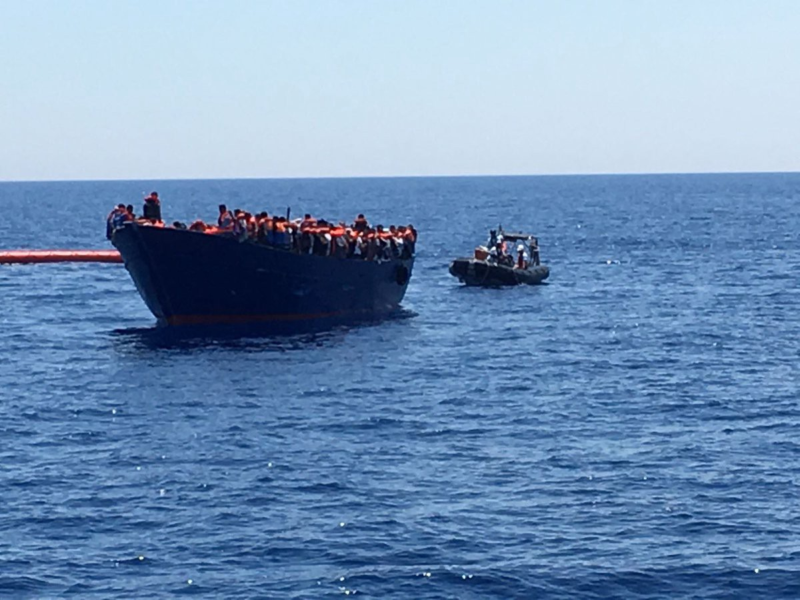
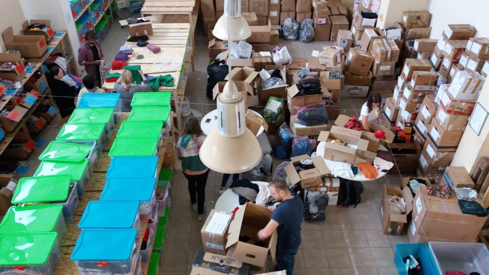

### AYS Daily Digest 25/6/17: Busy weekend for crossings all over the Mediterranean

_Activity in the Mediterranean / Doctors needed in Greece / Call for donations in Serbia / Refugee hunters in Hungary / No new reception centre for Calais / Host needed in London / And more news…_

 ’ boat, Phoenix, during rescue operations\. \(Photo by MOAS\)](assets/cf83054995c3/1*1xyOQkr_IkRu6B54_GmH4A.jpeg)

View from the [MOAS](https://twitter.com/moas_eu) ’ boat, Phoenix, during rescue operations\. \(Photo by MOAS\)
### FEATURE: Mediterranean rescue crews kept busy

It has been a busy day for crossings in the Mediterranean Sea with reports of boats being spotted and rescued from Gibraltar to the Greek islands\.

On Saturday afternoon the Spanish coastguards rescued 224 refugees as they attempted to make the crossing from North Africa to Europe\. The arrivals were rescued from five vessels in the Strait of Gibraltar and the Alboran Sea, which separate Spain and Morocco\. The first rescues occurred in the early hours, with dozens rescued south of Gibraltar from three boats and another 72 rescued later after being spotted by a plane belonging to Europe’s border agency, Frontex\. Another 400 people had been rescued in this area just last week, according to the same source\.

The Alboran Sea—a relatively short sea crossing from Morocco to Spain—is a popular route\. According to the International Organization for Migration \(IOM\), 3,314 people attempted this crossing between January 1 and April 30 this year alone\. 59 people were unfortunately reported dead\.

Many boats were recently spotted by rescuers in the central Mediterranean, with—as usual—several teams involved in the pursuant rescue operations\. [MOAS](https://twitter.com/moas_eu) reported a very intense day, with more than 30 boats found\. Their vessel, _Phoenix_ , and its crew were working since early in the morning\. After a long day the vessel headed back north with more than 400 men, women, and children on board, all recovering from the dangerous crossing\.

 \)](assets/cf83054995c3/1*VfnDDxMfWj2QNZIG3tInxA.jpeg)

The Phoenix with two dinghies in the background\. \(Picture by [MOAS](https://twitter.com/moas_eu) \)

[MSF Sea](https://twitter.com/MSF_Sea) has also reported several boats in the area, including a huge wooden boat with hundreds of people on board\. [Ärzte ohne Grenzen / Médecins Sans Frontières \(MSF\)](https://www.facebook.com/aerzteohnegrenzenMSF/?fref=mentions) , [Save the Children Italia](https://www.facebook.com/savethechildrenitalia/?fref=mentions) , [Sea\-Watch](https://www.facebook.com/seawatchprojekt/?fref=mentions) , [sea\-eye\.org](https://www.facebook.com/seaeyeorg/?fref=mentions) , and [Jugend Rettet e\.V\.](https://www.facebook.com/JugendRettet/?fref=nf) were also involved in the operations today to try to avoid the tragedies we constantly see at sea\.

> Right now our crew is supplying a wooden boat with 500 people, while on our ship there are about 250 people\. 

\(Photo by MSF\)

MSF also stated that after the rescue effort they had many children on board, including a baby only one month old\.

[MEDU — Medici per i Diritti Umani](https://www.facebook.com/MEDUonlus/) \(Doctors for Human Rights\) have also reported back since docking in Pozzallo port in Sicily a few hours ago, where they brought 267 refugees rescued from international waters close to the Libyan coast\. The origins of those MEDU rescued were very diverse\. Among the countries represented were Bangladesh, Gambia, Mali, Nigeria, Togo, Ivory Coast, Sierra Leone, Niger, Pakistan, Senegal, Ethiopia, Somalia, Guinea Conakry, Guinea Bissau, Liberia, Burkina Faso, Chad, Cameroon, and Morocco\. Those rescued were considered especially vulnerable—among those on board including more than 60 minors and 30 women, four of whom were pregnant\. Several persons are victims of violence, such as torture, sexual violence, and inhuman and degrading treatment\. MEDU’s medical\-psychological team recently helped to care for a Gambian teenager—about 16 years old—who suffered from severe malnutrition and dehydration after both imprisonment in Libya and the strenuous journey they endured\.
### GREECE
#### New arrivals

The eastern Mediterranean also saw many arrivals over the weekend\. This morning the Greek Coast Guard picked up a boat along the southeast coast of Lesbos and rescued the 66 refugees on board, including 10 men, 11 women, and 45 children\. Volunteers reported that everyone was in good health\.

There were also some arrivals on the small island of Tilos in the early hours of Saturday\. According to volunteers, some families—including those with children—were dumped by smugglers on the island at 2am, only to be found at lunchtime by the police before being assisted by doctors and volunteers\. The families lit a fire at night since they were in the dark and all very scared, especially the children\.

As reported yesterday, another boat with about 120 refugees was spotted and rescued by the Greek Coast Guard close to the island of Karpathos\.
#### Mainland

[DocMobile — Medical Help e\.V](https://www.facebook.com/docmobile.org/?fref=mentions) is looking for qualified doctors \(GPs, emergency doctors, paediatricians, etc\. \) to work in different places in Greece where the organization provides free medical care for refugees\. Nurses and Paramedics are also welcome to apply\. The work involves international teams communicating in English\.

The team is looking for volunteers available starting next week or later in July and August for a minimum of one week\.

If you have the required training and would like to help, please contact them on their page or via email: verein@docmobile\.org\.

MSF in Greece is also recruiting cultural mediators for postings in Athens, Thessaloniki, Ioannina, and Samos for a 3 month tenure\. The position requires fluency in Arabic or Farsi and English or Greek\. Knowledge of French, Kurmanji, Urdu, or Dari is a strong plus\. Essential secondary education and a paramedical background is also desirable\. Finally, working experience is required and applicants with experience as cultural mediators or translators for NGOs are looked at especially favourably\.

If you have these skills or know someone that might, please consider applying by following the link [here\.](https://www.msf.gr/ads/cultural-mediator-7)

[A Drop in the Ocean](https://www.drapenihavet.no/no/hjem/) recently opened a new warehouse in Athens to facilitate their work in Skaramangkas camp where more than 3,000 refugees currently live\. The new effort is essential to distribution efforts in Skaramagas camp and is where donations from volunteers and supporters are delivered, sorted, and packaged for the baby clothing exchange and Skaramagas marketplace\. Stock is organized using A Drop in the Ocean’s country\-wide ‘Drop App,’ which was developed and first implemented by in the north of Greece\. For those wishing to support the residents of Skaramagas through their clothing\-distribution services, please consult the current “Needs List” \(an illustrated \.pdf\) and get in touch via email at: athen@drapenihavet\.no\) with the subject title “Clothing donations\.”

Volunteers hard at work in the distribution centre\. \(Picture by A Drop in the Ocean\)

The Get Shit Done Team has been busy and today delivered four picnic tables to Derveni\-Alexyl as well as a giant Jenga and chess and checkers set\! They also brought along more firewood and stoves\. The games are fun and the tables and firewood come right in time for the end of Ramadan celebration\!

 \)](assets/cf83054995c3/1*qMHix2mEo_FGCh0pfRTGMw.jpeg)

\(Photo by [Everyday, just a smile](https://www.facebook.com/everydayjustasmile/) \)

The situation in the camp is very difficult and activities help people to build trust and spend their time\. You can support their work by donating to:

Everyday, just a smile
Raphael Zürcher
3013 Bern
IBAN: CH35 0900 0000 8967 7285 8 
BIC: POFICHBEXXX
### SERBIA

We bring good news from Serbia as Ramadan comes to an end and people are in a celebratory mood, even if their situations remain quite dire\.

Earlier today in Obrenovac camp, south of Belgrade, joy was in the air as residents played music and performed their traditional songs and dancing\.

The [TruckShop](https://www.facebook.com/mobileclothesproject/?fref=nf) has been active distributing tons of vegetables and fruit to some 1,784 people living in two camps in Serbia\. So far they have distributed:

2,674 kg… onions 
4,047 kg… bananas
5,872 kg… tomatoes 
5,611 kg… cucumbers 
4,569 kg… lemons 
4,307 kg… carrots 
2,685 kg… dates

Please consider donating to help them continue their important initiative of providing fresh vegetables to refugees\. You can find out more and do so [here](http://betterplace.org/…/…/50552-truckshop-a-free-shop-for-refugees) \.

[Borderfree Association](https://www.facebook.com/borderfreeassociation/?ref=page_internal) is also active in Serbia, working in three Serbian camps close to the Bulgarian border \(Divljani, Pirot and Dimitrovgrad\) with a mobile dental clinic\. They have so far treated 101 patients in the area\. If you would like support their work, please do so by following the link above\.
### HUNGARY

Once again, news from this country is not good\. László Torockai, the far right mayor of the Hungarian village Ásotthalom, near the Serbian border, posted the photo below regarding a small group of refugees who tried to enter Hungary from Serbia\. The refugees met with Torockai’s paramilitary “defence” group, who quickly forced them to the ground\. Later they pushed them back to Serbia\. According to human rights organizations, vigilantes in the area often terrorize refugees who seek asylum in Hungary — now we can see that they are even proud of it\!

 \)](assets/cf83054995c3/1*37SASLnGHDTwCkesnUmnoA.jpeg)

Refugees forced to the ground by Hungarian paramilitary\. \(Photo by [Rights Reporter Foundation](https://www.facebook.com/rightsreporter/) \)
### ITALY

Rome’s [Baobab Experience](https://www.facebook.com/BaobabExperience/) has written an open letter to the Italian Railway to urge them to reopen the abandoned bus parking lot at Piazzale Maslax Rome and agree that NGOs can build a humanitarian space for primary reception\.

 \)](assets/cf83054995c3/1*kqr8MNlWocOcMDK0mixyBg.jpeg)

\(Photo by [Baobab Experience](https://www.facebook.com/BaobabExperience/) \)
### FRANCE
#### No new reception centre in Calais

French President Emmanuel Macron’s new government took a tough line on Calais’ migrants Friday, with his interior minister saying he does not want the northern port to become an “abscess\.” Despite the fact that hundreds of refugees and migrants are living in Calais in desperate conditions, the French government has vowed there will be no new welcome centre built\. Instead, security will be reinforced\.

Hundreds of refugees— mostly Afghans, Eritreans, and Ethiopians — are still at the port, clashing sporadically with police as they try every night to stow away onto trucks heading to Britain\.

Eleven charities went to court on Wednesday demanding the construction of a government refugee centre in Calais, deploring the miserable conditions in which migrants find themselves\. Collomb had angered aid groups with comments Thursday rejecting the proposal, saying that building such a centre would be like creating an artificial festering “abscess” that would keep growing\.

> “These people are not a disease, they are not dirt\. They are men and women who have made a very difficult journey to flee their countries for reasons we all know about” 

Hicham Aly, an aid worker at the Secours Catholique charity, echoes back with the words above\.

It appears that the new government will continue to implement the same, old policies towards refugees in France and that conditions are not likely to improve any time soon\.
### UK
#### Refugees at Home urgently looking for a host

[Refugees at Home](https://www.facebook.com/refugeesathome/?fref=nf) are urgently looking to find a host in London near to, or within an easy commute of, Bloomsbury\.

> We have a guest who needs to be near her premature baby who is being cared for at UCH\. Currently mum is an inpatient in a different hospital\. We are not sure when precisely she will be discharged so when we need the placement to start, but we want to be ready for her so she can spend as much time with her baby as possible\. We don’t know how long she’ll need hosting either, but, for obvious reasons, we don’t want a series of short term placements—we’d love a host who can be pretty flexible so she has some stability\. 

If you have the option please consider helping this couple or help sharing this call\.

> **_We strive to echo correct news from the ground through collaboration and fairness, so let us know if something you read here is not right\._** 

> **_If there is anything you want to share, contact us on Facebook or write to: areyousyrious@gmail\.com_** 

_Converted [Medium Post](https://areyousyrious.medium.com/ays-daily-digest-25-6-2017-busy-weekend-of-crossings-all-over-the-mediterranean-cf83054995c3) by [ZMediumToMarkdown](https://github.com/ZhgChgLi/ZMediumToMarkdown)._
