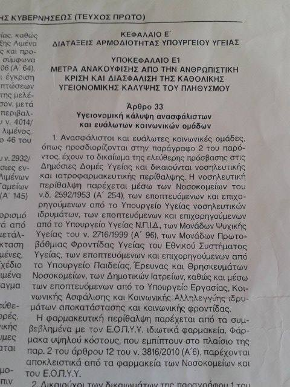

### AYS Daily Digest 27/06/17: Up to 10 000 people rescued in the Mediterranean in three days

_Rescue ships working over capacity and around the clock / Meanwhile the EU continues to focus on detention / Detainees in Syrian prison demands freedom / Extreme heat wave in Greece this upcoming weekend / Not enough water in Souda at Chios / More violence on the Hungarian border / And more news…_

 \. Several NGO’s have been out day and night on the Mediterranean, saving people at sea\.](assets/caee4708da1d/1*uXZAcGcne6jgDE30TZQMJw.jpeg)

Photo: [Jugend Rettet e\.V\.](https://www.facebook.com/JugendRettet/) \. Several NGO’s have been out day and night on the Mediterranean, saving people at sea\.
### Feature

The past three days more than 10 000 people have been rescued off the Libyan coast, according to [Watch The Med — Alarmphone](https://www.facebook.com/watchthemed.alarmphone/?hc_ref=PAGES_TIMELINE&fref=nf) \. [The number from Sea\-Watch is between the 24th and the 27th of July is 8863 people\.](https://www.facebook.com/seawatchprojekt/photos/a.1579563625595046.1073741828.1578640155687393/1887584068126332/?type=3&theater) Regardless of which number that is closest to the truth, it is high figures\. Especially while remembering that all of those, almost 10 000 people, think it is worth risking their lives on this journey\.

This time almost 10 000 people were villing to do this journey in just three days\. The aid organisations that have been involved in the last couple of days search and rescue \(SAR\) missions confirms that it hasn’t been easy\. Their rescue vessels have been overcrowded, and they have had to turn away from boats full with people since they alreade have been working over capacity\.

With both summer and up to an estimated million desperate people waiting to cross the Mediterranean in Libya, the situation most likely will continue like this\.

Both [Sea\-Watch](https://www.facebook.com/seawatchprojekt/?fref=mentions) , [NoBorders](https://www.facebook.com/nobordersnetwork/?hc_ref=PAGES_TIMELINE) and [Watch The Med — Alarmphone](https://www.facebook.com/watchthemed.alarmphone/?hc_ref=PAGES_TIMELINE&fref=nf) stresses the fact that without NGO’s people would have been in even more danger\. Two deaths is reported by [Watch The Med — Alarmphone](https://www.facebook.com/watchthemed.alarmphone/?hc_ref=PAGES_TIMELINE&fref=nf) the last couple of days\.

[Sea\-Watch](https://www.facebook.com/seawatchprojekt/?ref=br_rs&hc_ref=SEARCH&fref=nf) writes:

> In the last three days, 8,863 people were rescued in the Mediterranean\. 

> These are 20 times more people than in the last three years \* by Islamist terrorism in Europe\. 

> Without the operations of Ngos, these 8,863 people would have died\. A humanitarian disaster is imminent every day in the Mediterranean\. 

> It is high time that Europe has just as much commitment to protecting people at borders as within the same\. 

](assets/caee4708da1d/1*QWpu7Jpt3YVClW9_qXZnwg.jpeg)

Photo: [Sea\-Watch](https://www.facebook.com/seawatchprojekt/?ref=br_rs&hc_ref=SEARCH&fref=nf)

[Jugend Rettet e\.V\., together with Sea\-Watch and](https://www.facebook.com/JugendRettet/photos/a.418621685013737.1073741828.409016039307635/690602361149000/?type=3) [sea\-eye\.org](http://sea-eye.org/) are updating about their busy night until today\. [A lot of people were arriving, and they were and are still in need of assistance\.](https://www.facebook.com/JugendRettet/photos/a.418621685013737.1073741828.409016039307635/690844791124757/?type=3&theater) The weather conditions during the night until today was harsh\. [Jugend Rettet e\.V\.](https://www.facebook.com/JugendRettet/?fref=nf) hit the capacity and had to return with an owercrowded ship, at the same time as they saw more dinghys with desperate people in need of rescue\. They had to leave them for some hours, hoping for everyone to be alright in the terrible circumstances given\.

As a follow up on the previous information about over crowded ships, they did a second update, addressing the European Union in a short letter that goes like this:

> [EU — Where are you?](https://www.facebook.com/JugendRettet/photos/a.418621685013737.1073741828.409016039307635/690717424470827/?type=3) We reached our capacity limits and are no longer able to help\. [Sea\-Watch](https://www.facebook.com/seawatchprojekt/?fref=mentions) and [sea\-eye\.org](https://l.facebook.com/l.php?u=http%3A%2F%2Fsea-eye.org%2F&h=ATM78oRZ3kyB_lgxvwDVcfbPSyKNAySNc7rsNczScSubRlyOD5xt6yLka1_YBWjnfsTVulWPUlDd4qwdH6DbsCEl3wnB3DpLuykal_C_pFZ_bkoO2CAjycFmOTiRBlgiTrL2TESCczfQlXPgiFQGkctizJsz&enc=AZP7a7pjamdOfIWq435t4PzmhHeR3WBqfDAezJRG1K5XBPmJPgciQnZjTbuW84FOh3BaWjS0gr4d-hI30M3uuPXna_gPLpNL5jWlfwwUkICmZpIsRA-Djeknp2OztNa55pGeqb6Ehif_-8mVYjLcvLwjvER_wUULaNOKHmlGMe5Urq99kpYqnsD9hpCYU7Q9sh8&s=1) are in the same situation\. We are on our way north\. We urgently need more ships\! [Everyone deserves to be rescued from distress\.](https://www.facebook.com/JugendRettet/photos/a.418621685013737.1073741828.409016039307635/690717424470827/?type=3) 

[After a busy day the resources onboard are finished, including fresh water and medicines\. Other ships will continue the SAR\-operations this night\.](https://www.facebook.com/JugendRettet/photos/a.418621685013737.1073741828.409016039307635/690844791124757/?type=3&theater)

](assets/caee4708da1d/1*wLDm4Zbl68rLE-f__D6Gqg.jpeg)

Photo: [Jugend Rettet e\.V\.](https://www.facebook.com/JugendRettet/)

[MSF Sea‏](https://twitter.com/MSF_Sea) was also out rescuing people today, with both \#Prudence and \#Aquarius, and they are wishing everyone the best but are worried for what will come\.

■■■■■■■■■■■■■■ 
> **[MSF Sea](https://twitter.com/MSF_Sea) @ Twitter Says:** 

> > After 9 hours in the sun all of #Prudence's guests have disembarked. We hope for the best but we're worried about what comes next for them. https://t.co/5cyqONFHS9 

> **Tweeted at [2017-06-27 14:04:30](https://twitter.com/msf_sea/status/879701980142223362).** 

■■■■■■■■■■■■■■ 

■■■■■■■■■■■■■■ 
> **[MSF Sea](https://twitter.com/MSF_Sea) @ Twitter Says:** 

> > #Aquarius is now rescuing those on a 2nd rubber boat. Without NGOs, commercial boats would be obliged by law to assist any boat in distress! https://t.co/Xtg4FQn6PR 

> **Tweeted at [2017-06-27 12:49:52](https://twitter.com/msf_sea/status/879683197835104259).** 

■■■■■■■■■■■■■■ 

As MSF Sea points out in the last tweet above, without NGO’s commercial ships would have to come to the refugees rescue, which would mean that less trained staff would do SAR\. According to international maritime law a ship have to come to the rescue of other nearby ships in need of it, which somehow seems to be forgotten in the EU that instead are focusing on how to keep people away\.
### EU

In the light of what is going on at the sea a [recent report from the European Parliament “the hotspot approach” is interesting as well\. Since the influx through various routes has increased almost constantly since 2014 and 2015,](http://www.europarl.europa.eu/sides/getDoc.do?type=COMPARL&reference=PE-604.614&format=PDF&language=EN&secondRef=01) where record levels was reported, the discussions about how to deal with the situation constantly has been on the agenda\. The decrease in Greece since 2016 has to do with the EU\-Turkey statement\.

[As a way of dealing with the situation with people arriving, hotspots was invented in 2015\.](http://www.europarl.europa.eu/sides/getDoc.do?type=COMPARL&reference=PE-604.614&format=PDF&language=EN&secondRef=01) The hotspots has since then been an expensive affair\. And not that successful as it was intended to be\. The governments in Italy and Greece have received a lot of financial contributions from the EU, allocated under the Asylum, Migration and Integration Fund \(AMIF\) and the Internal Security Fund \(ISF\) \. These institutions also have funding to use in case of emergencies\. The emergency funding is 100 percentage from the EU budget, and the AMIF and ISF funding is co\-funded by the union and it’s member states\. Since 2015 the European Commission reports that Greece have been awarded 352 million euros in emergency funding and 192 respective 100 million euros to the mainland and the islands\. Italy has gotten a bit less, in 2016 the country anyhow received 62,8 million euros in emergency funding\.

EASO and Frontex are also involved in the funding, and Frontex contributed with 20 million euros in 2016 to the hotspots\. The EU already had allocated 35 million to this activities the same year\. There are huge amounts of money used to keep people in detention\. The Commission, though, means that the decision, made in May 2015, to implement hotspots was done to help the member states on the frontline of the crisis to manage the flows of refugees\. By doing so they would maintain control over the asylum and identification processes of those arriving\. The Court is concluding that the implementation wasn’t as efficient as wished\. There was also, the Court said, a failure in accommodate and process the unaccompanied minors arriving in a safe way\.

The Commission has received several suggestions from The Court regarding future developments, but, it is rather about improving the standards and capacity than critizising the existence of this detention system\. [The speed in both handling applications and returns need to be faster, is one of the suggestions of improvements](http://www.europarl.europa.eu/sides/getDoc.do?type=COMPARL&reference=PE-604.614&format=PDF&language=EN&secondRef=01) \. In the end of 2017 The Commission will investigate this further, in order to decide on how to develop this concept in the future as a part of the European Unions external border management\.

[In the end of the report there are 12 points concluded from the Rapporteur,](http://www.europarl.europa.eu/sides/getDoc.do?type=COMPARL&reference=PE-604.614&format=PDF&language=EN&secondRef=01) for those interested in more information and possible future development\. The refugee crisis is an expensive one, but not in the way EU and it member states sometimes are indicating it is\.
### Syria

The situation in Assad’s prisons in Syria is terrible\. [The activist Jalal Talawi told the news agency Steps that one of the detaines in the Central Prison](https://www.facebook.com/groups/PeopletoPeopleSolidaritySouthernSEEurope/permalink/673507529513583/) of Homs have made an appeal from the inside, addressing the opposition fighters in Homs northern countryside to come to their help\. Otherwise the detaines is risking that the regime will break into the prison and brutaly punish them all\.

The protest, that took place this Saturday, was broadcasted live on social media and includes the demand of an instant release, since none of the prisoners are guilty of charges\. [Tens of thousand of people are being help in the regimes prisons accross Syria, and many of them are being tortured — some so severely that it is leading to death\.](https://www.facebook.com/groups/PeopletoPeopleSolidaritySouthernSEEurope/permalink/673507529513583/)
### Greece

There is an extreme heat wave with up to 43 degrees celcius coming to Greece soon, [Keep Talking Greece](https://www.facebook.com/Keep-Talking-Greece-130796133610080/?fref=nf) is reporting about\. These extreme high temperatures are something that can effect people’s health — and water and accommodations with isolation can be lacking to several vulnerable people\. We’re encouraging everyone to keep an extra eye on those that can be in danger, including children and elderly\. [The peak looks as if it will be on Friday and Saturday, the 30th of June and the 1 of July](https://www.facebook.com/permalink.php?story_fbid=1442283369128010&id=130796133610080&hc_location=ufi) , but Sunday the 1st also looks as if it will be hot\. For more info about what places that will be most affected, [follow the link\.](http://www.keeptalkinggreece.com/2017/06/26/weather-greece-extreme-heat-wave-43c/#.WVEwjnAkqJ4.facebook)

**If you are being refused treatment, this is why**

Also, if you need treatment but are refused receiving it, [here is how to do](https://www.facebook.com/nobordersnetwork/posts/1432813596786528?hc_location=ufi) \. If you don’t understand the language, ask someone for help\. The background to the problem is that lately refugees have been denied social security numbers \(AMKA\), and therefore several hospitals refuse to help\.

](assets/caee4708da1d/1*4oyZElDNn5slSpFVLFQaIw.jpeg)

Photos: [NoBorders](https://www.facebook.com/nobordersnetwork/)
#### Mainland

**Solidarity farming**

[Refugee Village For Freedom](https://www.facebook.com/Refugee-Village-For-Freedom-1877051302553073/?hc_ref=PAGES_TIMELINE) continues their activities, [growing different vegetables and making honey together\.](https://www.facebook.com/Refugee-Village-For-Freedom-1877051302553073/?hc_location=ufi)

**Volunteers needed at several places**

[LOVE AND SERVE WITHOUT BOUNDARIES](https://www.facebook.com/groups/212988105700524/?fref=mentions) is looking for volunteers:

> VOLUNTEER CALL FOR SOUP KITCHEN, STREET OUTREACH, ENGLISH CLASSES AND CHILDREN’S ACTIVITIES 

> [LOVE AND SERVE WITHOUT BOUNDARIES](https://www.facebook.com/groups/212988105700524/?fref=mentions) need volunteers every Tuesday and Thursday to help them prepare food and feed people from their new soup kitchen\. and on Saturdays for their street outreach to the homeless, locals and drug addicts along Patision, Victoria square and Omonia square\. 

> They will also be starting English classes and other children’s activities on Mondays, Wednesdays and Fridays and need volunteers for these activities too\. Timings 10am to 2pm\. 

> \(Children from 10 to 12, adults 12:10 to 2pm\) 

> Address: corner of Serifou 2 and Patision 

[Here is a map to the location\.](https://www.google.co.uk/maps/place/Serifou+2,+Athina+112+54,+Greece/@38.0094758,23.732641,17z/data=!3m1!4b1!4m5!3m4!1s0x14a1a2c17462bdf3:0x89046ef98f7fbb3a!8m2!3d38.0094758!4d23.7348297)

Get in touch with [Maria Rouze](https://www.facebook.com/maria.rouze?fref=mentions) if you can help\.

**Farsi speakers needed**

[Advocates Abroad](https://www.facebook.com/advocatesabroad/?fref=nf) are also looking for volunteers\. [They need people that can interpret farsi\.](https://www.facebook.com/story.php...)
#### Islands

Volunteers are needed on the islands too, also here some special skills are attractive\.

Doctors and nurses needed in Moria

[ERCI — Emergency Response Centre International](https://www.facebook.com/ercintl/) [is in need of people that can translate and interpret in Farsi, Arabic, Kurdish and French](https://www.facebook.com/ercintl/photos/a.417332345133189.1073741828.415073442025746/655139771352444/?type=3) \. And also trained nurses, doctors and those that currently are attending medical schooling\.

If this description suits in on you, send an email to [aid@ercintl\.org](mailto:aid@ercintl.org) \.

](assets/caee4708da1d/1*U7R7Lhyb8TC7cNCZpURbnQ.jpeg)

Photo: [ERCI — Emergency Response Centre International](https://www.facebook.com/ercintl/?ref=br_rs)

**Chios**

In Souda there are fewer residents than it has been for a while\. About 800 people are still living here though, and several of them in tents\. Also, reports about not enough drinkable water is coming\. With the upcoming heatwave in mind, we hope this problem will be fixed immidiately\.

■■■■■■■■■■■■■■ 
> **[Եհҽմɾցíɑ_ցօҽԵíɑ ⛧](https://twitter.com/Theurgia_Goetia) @ Twitter Says:** 

> > Souda camp of #Chios today. Still tents on the beach. Not so many as the previous days. Around 800 people in the whole camp.
#Refugeesgr https://t.co/SVTT7u2GVW 

> **Tweeted at [2017-06-27 18:14:59](https://twitter.com/theurgia_goetia/status/879765015179472897).** 

■■■■■■■■■■■■■■ 

■■■■■■■■■■■■■■ 
> **[Եհҽմɾցíɑ_ցօҽԵíɑ ⛧](https://twitter.com/Theurgia_Goetia) @ Twitter Says:** 

> > There is a problem with the system of the drinkable water in Souda today.People must buy bottles by themselves.
#Chios #Refugeesgr 

> **Tweeted at [2017-06-27 18:18:00](https://twitter.com/theurgia_goetia/status/879765774793158656).** 

■■■■■■■■■■■■■■ 

### Serbia/Hungary border

In the evening at around 10\.20–10\.30 pm on the 24th of June, a group of 23 young men from Pakistan crossed the border from Horgos, Serbia into Hungary\. In the group there were two minors, 15 and 17 years young\. We have received an interview with one of the targeted refugees, conducted on the 25th of June the day after the crossing, with several details about the incident\. We even have the names of two of the police dogs\. After approximately five kilometers in the jungle after the border crossing the group had to cross a road to continue\. By incident they were discovered by a searching light and after that the abuse took place\. Besides physical abuse the police called the boys ugly nicknames\. One man also was attacked by five to six of the polices dogs\. The man intervieved was the second one to randomly be picked out and being beaten, after all of the men had to lay down on the ground\. Their phones and valuable belongings was also destroyed\.

The abuse included dogs, sticks, being ran over by officials with shoes and getting woken up after passing out by getting water in the face\. The men were after the abuse and some time laying on the ground, put in vans and driven back to Serbia, from where they had to find their way back to the transit camp themselves\.

Photo AYS

Staff from UNHCR and [HCIT](http://hcit.rs) took photos of the injuries but didn’t ask any questions about the incident, according to the man interviewed\. He says that UNHCR is sleeping, they only hand out blankets\. He also asks organizations to put pressure on the perpetrators in order to stop this violence\. We’re still trying\.
### France

Both good and bad news is coming from France\. In Calais the administrative court on Monday, yesterday, decided that officials in Calais should give the 400–600 migrants sleeping rough in the area humanitarian aid, including much needed drinking water\. [But on the same time, the administrative court rejected a request to set up a new emergency center in the area](http://m.france24.com/en/20170626-france-calais-court-orders-officials-provide-migrants-aid-water-toilets) \. At least people on the streets will have drinking fountains to enjoy, but still no shelters\. [It was 11 ngo’s involved in the demand behind this improvement\. If the city of Calais fails with providing this, they will face a 100 euro fine per day\.](http://m.france24.com/en/20170626-france-calais-court-orders-officials-provide-migrants-aid-water-toilets) It could be seen as a victory for the human rights activists working in the area\.

](assets/caee4708da1d/1*Kqnp5WA2_ALqdRnt74vOkA.jpeg)

Photo: [Help Refugees](https://www.facebook.com/HelpRefugeesUK/)

[Help Refugees, one of the 11 organisations involved in this, have concluded the services that the city of Calais have to provide with:](https://www.facebook.com/HelpRefugeesUK/photos/a.123267671367248.1073741830.111893659171316/449962058697806/?type=3)

_\- showers, toilets and potable water within reachable distance_

_\- reinforced daily state outreach for unaccompanied minors to access protection_

_\- departures to CAOs \(accommodation centres\) for refugees in Calais_

But:

[_\- food will still have to be provided by associations in the region but distributions should not be hindered_](https://www.facebook.com/HelpRefugeesUK/photos/a.123267671367248.1073741830.111893659171316/449962058697806/?type=3)

If someone have money to spare to help the refugees in the area, Help Refugees are grateful for donations through [this link\.](http://bit.ly/calaisdunkirkfunds)

**Refugees crossing river in Torri**

Also in France, in the town of Torri, the Police today blocked the way for approximately 50 refugees trying to cross a river\.

**Eviction of people sleeping rough in Paris**

In Paris, the police evicted refugees sleeping rough\. [Again\.](https://www.facebook.com/groups/P2PParis/permalink/1395515080535362/?hc_location=ufi)

](assets/caee4708da1d/1*93uTabGU75fI1Iln7pG_Ng.jpeg)

Photo: [LaMeute](https://www.facebook.com/LaMeutePhotographie/)
### Italy

Refugees living in the CARA in Mineo, Sicily, was protesting on the road today\.

■■■■■■■■■■■■■■ 
> **[Jolie Rouge](https://twitter.com/JigginoRuss) @ Twitter Says:** 

> > Centinaia di persone, tra le 3000 segregate nel CARA di Mineo, stamattina hanno bloccato la statale Catania-Gela [ansa.it/sicilia/notizi…](http://www.ansa.it/sicilia/notizie/2017/06/27/protesta-cara-mineo-bloccata-statale_6a0db7aa-0616-4f44-8ed0-cf280d3e045b.html) https://t.co/SAaM3tXkx5 

> **Tweeted at [2017-06-27 11:31:14](https://twitter.com/jigginoruss/status/879663409586991104).** 

■■■■■■■■■■■■■■ 

### UK

Hosts needed\!

If you have space to spare, don’t hesitate to get in contact with [Refugees at Home](https://www.facebook.com/refugeesathome/?fref=mentions) \. For more information about this, visit their [website](http://www.refugeesathome.org/) \.

[They currently need hosts in London, Manchester, Cardiff, Sheffield, Bristol, Birmingham and also at various places across the UK\.](https://www.facebook.com/HelpRefugeesUK/posts/450122612015084)

> **_We strive to echo correct news from the ground, through collaboration and fairness, so let us know if something you read here is not right\._** 

> **_Anything you want to share — contact us on Facebook or write to:areyousyrious@gmail\.com_** 

_Converted [Medium Post](https://areyousyrious.medium.com/ays-daily-digest-27-06-17-up-to-10-000-people-rescued-in-the-mediterranean-in-three-days-caee4708da1d) by [ZMediumToMarkdown](https://github.com/ZhgChgLi/ZMediumToMarkdown)._
