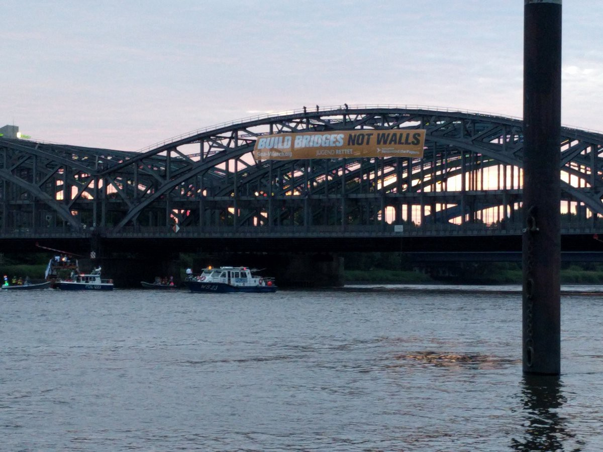
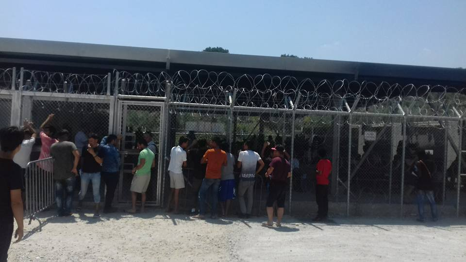
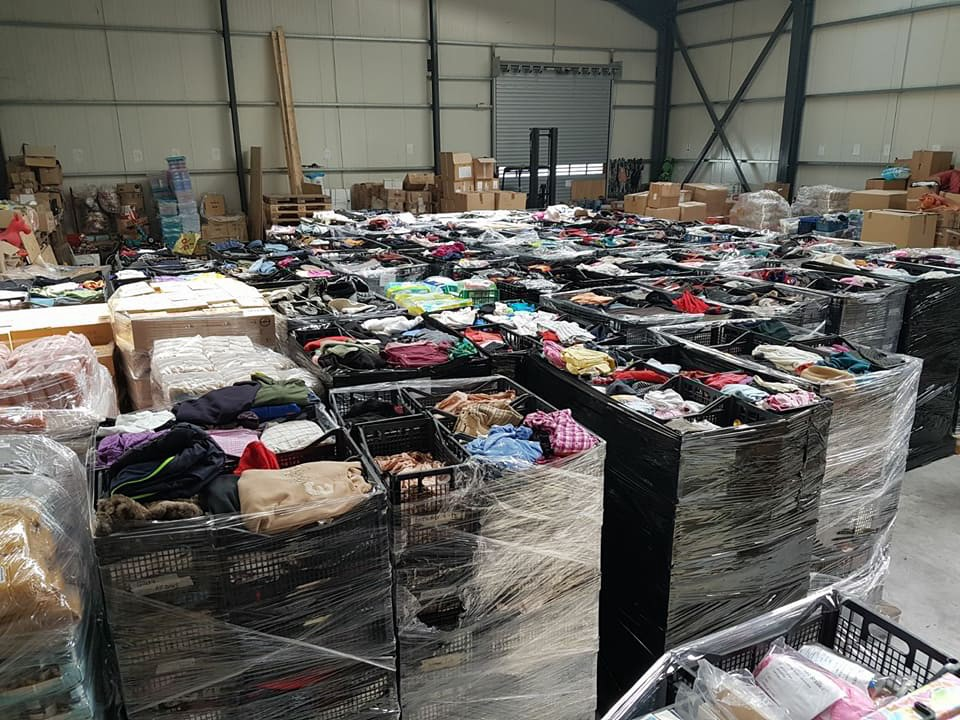
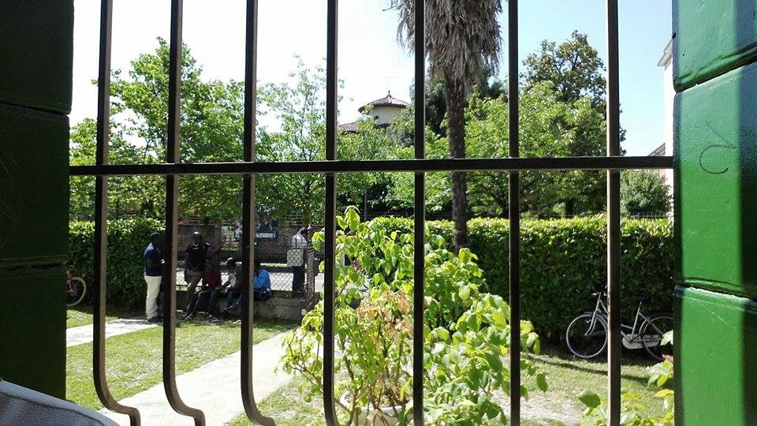
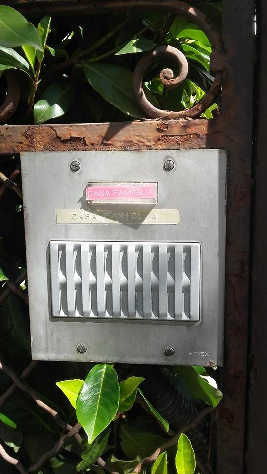
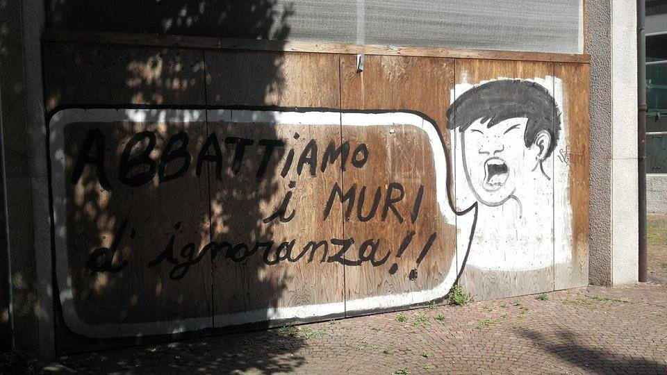

### AYS Daily Digest 28/6/17: They decide, the others die

_Greek minister “managed the crisis just fine”/ Islands worried over water shortages and heat wave / Poor conditions in some of the camps / Preparation for school / Reality in Serbian camps / French activists delay deportation / Protests in Germany against deportations to Afghanistan / And other news…_

_“They decide, the others die\.” \(Photo by Sea\-Watch\)_

 \)](assets/277e82b42baa/1*FMHHC7YBXEFFPgYZdtQgFQ.jpeg)

Among the 1,032 people saved by the Aquarius today were two new born babies and many children\. \(Photo by [SOS MEDITERRANEE France](https://www.facebook.com/sosmedfrance/) \)
### FEATURE: The situation in Greece
#### Recent news

Two boats today were picked up along the island coasts: one in Kithira with 50 people onboard and the second off Samos with 58 people aboard, local sources reported\.

The islands Lesbos, Samos, and Chios—those with the biggest number of refugees—are facing serious problems due to the upcoming heatwave and ongoing water shortages on the islands\.

According to our sources, the municipality on Chios said they will try to fix the problem of very weak water pressure when using the taps, though people on the island normally don’t drink tap water, but need to fill containers with drinking water instead\.

15 refugees at a prison in Moria have reportedly [started a hunger strike](https://twitter.com/AHampay/status/880015325160407040) today\.
#### “Greece managed refugee crisis with dignity”

Greek Minister of Migration Mouzalas said in a recent interview,

> “Pain is all around\. The migrant issue in its core includes pain and tears\. The refugee issue includes even more\. We managed a crisis\. I think we did fine,” 

Pointing to the double standards, hypocrisy, and inability to approach the situation with the same “success” as rhetoric implied, Mouzalis said: “We pay no attention to easy criticism and malicious critics\. We proved them wrong,” while continuing to admit that Europe delayed in making key decisions and that the decision concerning the refugee relocation program took time to be implemented\.

So far about 12,500 people have relocated under the agreement EU members reached in autumn 2015\. Commenting on the slow pace of the relocation process, Mouzalas said: “The initial difficulty is that we do not know how many people will eventually stay in Greece\. The second difficulty is that these people who will eventually stay in Greece did not start their journey to end up in Greece and they are forced to stay\. This makes their integration more difficult\.”

Sweden has been the country most efficient at making relocation pledges and processing applications, but it is only 2 days ago that the first flights from Greece to Sweden were announced\. As of June 11th Sweden had accepted around 1,400 people for relocation, all of whom were waiting for their flights\.

Mr\. Mouzalas also said a large and important part of resolving the issues at hand is taking care of the situation before the refugees manage to reach Europe, continuing with a puzzling statement:

> “How can one allow a smuggler taking a family which has sold everything in Afghanistan and leading them, beating them, chasing them, depending on the money they have given, bringing them to Turkey and then putting their lives at risk in the Aegean Sea and start considering their rights the moment they will reach Greece?” 

> “We managed a crisis\. I think we did fine\.” 

#### In the meantime…

Today we received worrying footage showing a cordon of policemen surrounding people going to the meal distribution area, standing in a line right next to them in the tight passage area\. If you have any information as to why this practice occurs, we appreciate it\.

Conditions in Moria camp\.

■■■■■■■■■■■■■■ 
> **[NoBorders](https://twitter.com/Refugees_Gr) @ Twitter Says:** 

> > Insects, pollution, lack of basic needs &amp; services @ #refugeesgr camps in #Greece
We are worried about next days with very high temperatures 

> **Tweeted at [2017-06-28 09:39:13](https://twitter.com/refugees_gr/status/879997606369398784).** 

■■■■■■■■■■■■■■ 

■■■■■■■■■■■■■■ 
> **[David Lohmueller](https://twitter.com/DavidLohmueller) @ Twitter Says:** 

> > @[ErikMarquardt](https://twitter.com/ErikMarquardt) Günstige Zimmer gibts auch hier in Griechenland. Bei sonnigen 41 Grad. Leider die Woche ohne Strom dafür aber unendlich Zeit. #refugeesGR https://t.co/i3NjTqElcv 

> **Tweeted at [2017-06-28 14:22:50](https://twitter.com/davidlohmueller/status/880068981935271937).** 

■■■■■■■■■■■■■■ 

#### Returns from Greece to Turkey

1,217 people were returned to Turkey since the implementation of the EU\-Turkey deal\.

The Greek Ministry of Citizen Protection in their latest [press release](https://data2.unhcr.org/en/documents/download/58003) states that among those returned thus far \(as of June 21\), the vast majority have been non\-Syrians and mainly constitute Pakistani nationals \(45%\) \. Other nationalities represented among returnees include Afghans, Bangladeshis, Algerians and Iranians\. At least 45% of those express no will to apply for asylum and/or withdrew their will to apply for asylum in Greece\. In total, 193 Syrians \(16% of the total number of returnees\) have been returned to Turkey to date\. None have been returned on the basis that their claim was found inadmissible\.
#### Preparation for school

Intensive summer courses are being held in order to prepare children entering formal education in September\.

**For whom?** Children aged 6 to 15 about to start attending school in Greece
**When?** July 3–August 11 \(6 weeks\), Monday to Friday
**What?** Greek, English, and math

Register with the Social Services of the Caritas Hellas Social Services Centre:

3 Tarella street, Metaksourgeio; 
Open from 09\.30am to 15\.30pm \(Monday to Friday\)

For more information, contact the Social Services of the Centre: 
tel\. 210 5225659 or email address: pappa\.caritas@gmail\.com

 \)](assets/277e82b42baa/1*Zua5v6RpC4u9o14lMLdfpA.jpeg)

Refugee Support Greece is moving their warehouse from Alexandreia to Ioannina to be closer to the camps where they work\. \(Photos by [Refugee Support Greece](https://www.facebook.com/RefugeeSupportGreece/) \)
### SERBIA
#### Police abuse and violent relocations to Preševo

In the last two weeks there have been three incidents of physical abuse by the Serbian police in which people were taken to the infamous Preševo closed “camp” near Macedonia, Serbian activists [report](https://noborderserbia.wordpress.com/2017/06/27/police-operations-and-violent-relocations-to-presevo-policijske-racije-i-nasilne-relokacije-za-presevo/) \.

Activists go on to clearly state that, “although \[Preševo camp\] is presented as a reception centre, the unspoken reality is that of a detention camp\. The approx\. 1,000 people imprisoned there are not allowed to go in or out, except for \[with\] very restricted special permission, and the only way to leave the camp is to be pushed back illegally to Macedonia, which happens regularly\.”

According to [official information](http://reliefweb.int/report/serbia/serbia-inter-agency-operational-update-may-2017) from the end of May, some 80% of the residents in Serbian government centres were from Afghanistan \(62%\), Iraq \(12%\) and Syria \(5%\), while 13% came from Pakistan and another 8% from other countries\.

Of those, 41% were children, 12% women and 47% men\.

■■■■■■■■■■■■■■ 
> **[MSF Sea](https://twitter.com/MSF_Sea) @ Twitter Says:** 

> > In 2017, along the supposedly closed 'Balkan Road' from the Turkish coast to Austria, at least 74 #refugees &amp; #migrants have died. https://t.co/bExkbKrYWk 

> **Tweeted at [2017-06-28 08:36:47](https://twitter.com/msf_sea/status/879981895458725888).** 

■■■■■■■■■■■■■■ 

### CROATIA
#### Hate crimes?

Unfortunately, the news we keep receiving from the border as well as the Serbian side is not good\. There have been new and very serious cases of police brutality from the Croatian side\. We are collecting information and continue to register, report, and act against the Croatian police’s despicable modus operandi, one that those in the seats of power seem to turn a blind eye to\!
### ITALY
#### Italy to stop foreign ships from docking in its ports

More than 10,000 asylum seekers arrived in the country between Saturday and Tuesday, with an additional 12,000 arriving in the past 48 hours\. 
Due to increasing numbers of arrivals and a lack of support from other EU countries, Italy’s Ambassador to the EU, Maurizio Massari, will tell European Migration Commissioner Dimitris Avramopoulos that Italy needs help and could deny docking rights to ships that have rescued migrants and are flying non\-Italian flags, media [report](http://www.politico.eu/article/italy-threatens-to-deny-entry-to-foreign-ships-to-force-migration-action/) \.
#### Treviso: a showcase of refugee reception in Italy

Almost every day a bus arrives to the city of Torino in northern Italy and dozens of newly arrived people from the south of the country, mostly arriving with boats from Libya saved by big sea rescue vessels, come out of the bus to remain in Treviso with the intention to seek international protection\. A day before our most recent visit to the town, a bus with 85 asylum seekers arrived from the southern coast of Italy\.

■■■■■■■■■■■■■■ 
> **[MSF Sea](https://twitter.com/MSF_Sea) @ Twitter Says:** 

> > This young boy found adrift on a dinghy in the #Mediterranean was travelling alone and showed us scars from when he was tortured in Libya https://t.co/TPZYGS7c4a 

> **Tweeted at [2017-01-31 15:06:15](https://twitter.com/msf_sea/status/826446504466534400).** 

■■■■■■■■■■■■■■ 

The Province of Treviso with its 95 municipalities is currently officially host to about 2,500 asylum seekers in 90 reception centres\. Some of those centres are smaller, organized communities, while others are in big military barracks\. In March 2014 the first refugees arrived, the first 40 people who asked for asylum in the city of Treviso\. Their system, funded by the Asylum, Migration, and Integration Fund \(AMIF\) and other institutions, is leaning on NGOs and other organizations who implement the program with the approval of the authorities\. Officially, people can either fall under the national reception program or they can stay as a part of the SPRAR program, where the responsibility lays on the local municipalities\.
648 people up until now have been granted asylum status there\.

The Protection System for Asylum Seekers and Refugees \(SPRAR\) is a system where _comuni_ \(basic administrative divisions, like townships\) decide if they want to take part in the program and implement it fully on their own\. The goal is independent integration and effective involvement in
life in Italy, both in terms of employment and housing integration, access to local services, and social interaction and scholastic integration for minors\.

After refugees have reached the Temporary Reception Centres \(CAS\), and after spending another year or year and a half there, they are “eligible” to enter the program\. Housing and food are provided as a part of the program and language courses are obligatory \(10 hours weekly is a minimum\) for each participant\. A group of professionals \(legal help, language teachers, etc\. \) work with each person “to create predispositions for integration,” with the goal of providing people with the tools needed to be independent, find work, and live independently after the program ends\.

However, the temporary nature of reception — it lasts for only 6 months — leaves many refugees who took part in the program on the street after their participation ends\. There is a possibility to extend the program, depending on each case, but it most often ends after 6 months\. The sum people receive monthly, €4,50 daily given at the end of each month, is sometimes sent to young people’s families back home\. Many of them come from poor places and troubled areas in Africa, where they say even a part of that amount is a great help\.

Although a person can begin to work in Italy once 60 days have passed since they made their asylum request, the reality is that many people end up jobless, in informal squatted barracks, in large military compounds, on the street, or trying to cross to another country to seek protection if they are denied asylum in Italy, even if they spent a length of time in a CAS centre or passed one of SPRAR program’s\.

A Temporary Reception Centre \(CAS\) \. \(Photo by AYS\)

In the Temporary Reception Centres \(CAS\), things very much depend on the organization implementing the project and running the centre\. In the case of the organization of one of the houses that serves as a CAS centre in Treviso, there is a strong engagement from both the volunteers running the place as well as those asylum seekers who are living there, with several working in close collaboration with the management\.

A CAS\. \(Photo by AYS\)

Since the opening of the centre, about 800 or 900 people have passed through and lived there\. 35 of them are currently on the third level of the program that includes integration principles like living with an Italian family \(“ _Rifuggiato a casa mia_ ”\), proven to be one of the most successful ways to help new arrivals and yet let people independently strive for a life there themselves\. This kind of housing situation includes school, volunteer work, and cohabitation\.

Among those who have had the luck to end up in a family home and get a volunteering internship are the three young men working at the local Azienda agricola, an eco farm run by a young Italian team that includes asylum seekers in their work\. With Azienda agricola, asylum seekers get a place to stay for several months, gain insight into working life and the system in Italy, acquire professional skills, and develop ideas as to their next steps\.

There are other such examples of successful programs, but unfortunately they are often the initiative of individuals and no state support is given\. The example of Azienda agricola has yet to be considered as among the practices that could be used to benefit and improve the system\.

As thousands of people arrive in the south of Italy and European countries, most of whom have shown not enough solidarity even with their EU family countries, authorities continue to be slow in relocating them\. If nothing is done, welcoming people will remain an interlocking pattern of good and poor practice, while refugees’ lives will remain a side thought\.

“Let’s beat the walls of ignorance\!” \(Photo by AYS\)
### FRANCE
#### Another deportation halted

French activists hurried to the airport, talked to passengers in the check\-in queue who were simply en route to Istanbul—but on the same flight that was to take a refugee back to Kabul—and got them to work together to save the person from being deported\.

The man who was to be deported had been put in a mask and handcuffs, but he started shouting when the plane was moving, so the other passengers stood up and insisted he be taken off the aircraft\.

 \.](assets/277e82b42baa/1*3OwncOemMjespiZRdvW3DA.jpeg)

Infographic courtesy of [Bente Jæger](https://www.facebook.com/bente.jaeger) \.
### GERMANY
#### Activists protest deportations to Afghanistan

[Young Germans](https://www.facebook.com/Berliner-B%C3%BCndnis-gegen-Abschiebungen-nach-Afghanistan-1238755006209666/) gathered yesterday in Berlin to demonstrate their clear stance against deportations from Germany to Afghanistan\.

 \)](assets/277e82b42baa/1*i419NqelK9EBHXoxMb4XIg.jpeg)

Young Germans speak out against the deportation of Afghani nationals\. \(Photo by [Berliner Bündnis gegen Abschiebungen nach Afghanistan](https://www.facebook.com/Berliner-B%C3%BCndnis-gegen-Abschiebungen-nach-Afghanistan-1238755006209666/) \)

> **_We strive to echo correct news from the ground through collaboration and fairness, so let us know if something you read here is not right\._** 

> **_If there is anything you want to share, contact us on Facebook or write to: areyousyrious@gmail\.com\._** 

_Converted [Medium Post](https://areyousyrious.medium.com/ays-daily-digest-28-6-17-they-decide-the-others-die-277e82b42baa) by [ZMediumToMarkdown](https://github.com/ZhgChgLi/ZMediumToMarkdown)._
