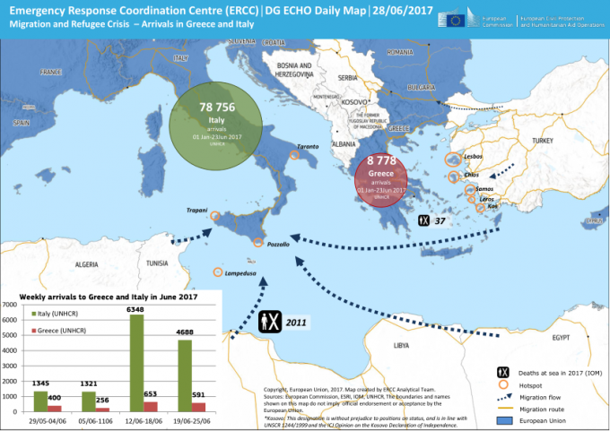
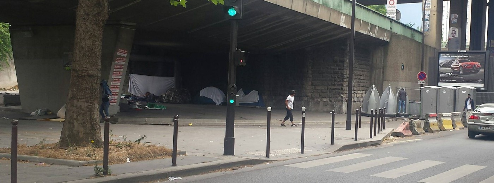
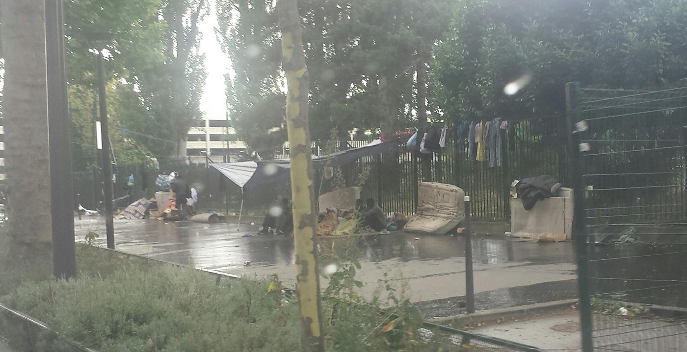
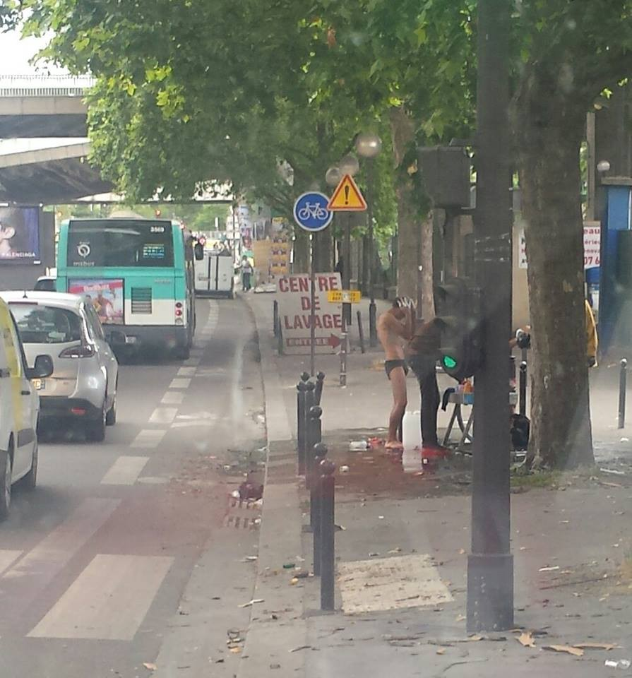
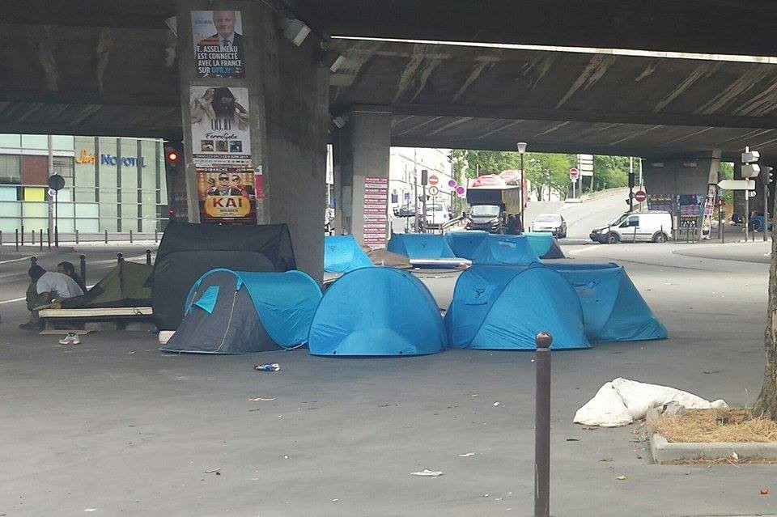

### AYS Daily Digest 29/06/17: EU funds for refugee support in Turkey are used to detain and deport them

_Sweden insists on deporting Afghans / Thousands stuck in Raqqa / The Hague investigates Libyan coastguard / Arrivals to Crete / Protest at Cara di Mineo camp / Abuse in Calais continues despite court ruling / And more news…_

 \)](assets/b9f02cead802/1*1paBnj1JdkC5E1RRyve-sg.jpeg)

“Build bridges, not walls\!” \(Photo by [Sea\-Watch](https://www.facebook.com/seawatchprojekt/) \)
### FEATURE: Greece and Turkey moving forward

The EU\-Turkey agreement was always supposed to be a plan—according to those who designed it—to stop the route though Greece and support the millions of refugees stuck in Turkey\. Nevertheless, the EU has chosen not only to disburse the funds made available with the EU\-Turkey deal to NGOs in the country, but also to the Turkish government, [FAZ](http://www.faz.net/aktuell/wirtschaft/wirtschaftspolitik/eu-fluechtlingshilfe-fliesst-tuerkischem-staat-unter-erdogan-zu-15077071.html) reported on Monday\.

Of a sum of 811 million disbursed Euros, some 25% were transferred to the Turkish government\. The Ministry of Health received 120 Million Euros, the Ministry of Education 90 Million Euros\. After the world food program, these are the highest amounts, the EU paid to one actor\. Another 12 Million Euro went to the general director of migration\-management which is part of the Interior Ministry\. Unicef received 34 Million Euro, the Red Cross 6,4 Million\.

The EU Commission says that the refugees stay longer in Turkey than expected\. Taking care of refugees in regular Turkish school and health system would be more effective and cheaper than ad\-hoc\-measures\. A spokeswoman further ensured, that the major part of the money \(1,6 Billion Euros allocated so far\) should go to charities\.

Commissioner for Neighbourhood Policy and Enlargement Negotiation, **Johannes Hahn said about the agreement in February 2016: “** _The Facility for Refugees in Turkey will go straight to the refugees, providing them with education, health and food\. The improvement of living\-conditions and the offering of a positive perspective will allow refugees to stay closer to their homes_ \.” \. In a press release the Commission also expressed:

> “The EU will speed up the disbursement of funds from the €3 billion Facility for Refugees in Turkey\. This funding will support Syrians in Turkey by providing access to food, shelter, education and healthcare” 

Although in its first report the Commission stated, that 60 Million Euros will be disbursed to the Ministry of Education and not to independent partners for “reasons of efficiency, effectiveness, sustainability and ownership” and expressed, that it is a special measure\.

Another beneficiary of these funds was the Turkish Coast Guard: In May 2016 it has gained 20 million Euros through IOM to “search and rescue operations to save lives and enhance the protection of migrants and refugees and tackling irregular migration and trafficking\.“

**Overall 1,57 out of the 2,88 billion Euros will be committed to non\-humanitarian support in Turkey\.** Of these 1,5 billion Euros some 660 million Euros have been contracted to Turkish governmental institutions\. Another 565 million Euros have been contracted to banks \(e\.g\. European Investment Bank, KfW or World Bank\) for “socio\-economic support”\.

**So the EU funds do not entirely go straight to support the refugees but also to detain and deport them** \. In its report from 13\.06\.17 the Commission also stated: “Due to the lower than expected number of returnees, the Special Measure on returns is also being modified to improve the Turkish Directorate\-General for Migration Management’s capacity to manage, receive and host migrants and returnees, especially as concerns human resources and infrastructure\. To date, the project has covered the costs incurred upon the returns of Syrians and non\-Syrians as well as the purchase of logistical equipment by the Directorate\-General for Migration Management and works to build a removal centre for 750 persons\.” As mentioned above, the Directorate General received over 12 Million Euros\.

According to the information from the Turkish authorities only 56 of the around 1000 non\-Syrian refugees, who were transferred back from Greece to Turkey, applied for asylum in Turkey\. Only two were granted international protection and 38 applications are pending, the rest was denied or rejected\. But **overall more than 700 people were returned to their countries of origin** \. About the conditions in Kayseri, where the non\-Syrians are being hosted, the EU commission only states: “A recent visit by EU authorities was able to verify that the situation in the centre complies with the required standards\.”
### Afghanistan

The afghan migration ministers is asking both Sweden and EU to stop the deportations instantly, was today reported by the Swedish paper [SVD](https://www.svd.se/afghanistan-pavag-saga-upp...) \. A Swedish lawyer quoted is reading this info as if the Afghan government is looking for a way out from the previous agreement regarding returning citizens\.

Alema Alema, one of the Afghan ministers, are asking the Swedish government to stop deportations since Afghanistan lack capacity to take care of the returnees\. Svenska Dagbladets reporters have been interviewing the minister over the phone today\. Since Afghanistan also is dealing with \(and struggling with doing this in a dignified way\) people returning from neighboring countries such as Iran and Pakistan they can’t give people deported from Sweden a good welcoming back\.

Regardless of this the Swedish migration minister Morgan Johannsson is saying that the agreements made between the concerned parts still stands\. He says that statements from individuals in the Afghan government can’t be taken into consideration, it is authorities decisions that stands firm\. After all the troubles in the last weeks in Afghanistan, this arrogance is unbelievable\. \. Surely NATO is planning to send thousands of troops back because it’s a safe country\.
### Syria

In the last few days and through the offensive to retake Raqqa from IS, the United Nations on Wednesday said that dozens of civilians have been killed in the ongoing airstrikes on the city, voicing grave concern over the fate of as many as 100,000 civilians trapped there\. The UN High Commissioner for Human Rights, Zeid Ra’ad Al Hussein, said that according to OHCHR data, conservative estimates indicated that at least 173 civilians have been killed in air and ground strikes since 1 June\. Reports of civilian deaths continue to mount and escape routes are increasingly sealed off, mentioning also worrying reports of violations and abuses by the so\-called Syrian Democratic Forces including looting, abductions, arbitrary detentions during screening processes as well as the recruitment of children\.
### Mediterranean Sea

The International Criminal Court in The Hague is investigating the so\-called Libyan Coastguard, as reported by [Sea\-Watch](https://sea-watch.org/en/icc-in-the-hague-to-investigate-libyan-coastguard-on-the-initiative-of-sea-watch/) \. This investigation is the result of the numerous attacks on civil rescue organisations as well as refugees and migrants, as highlighted by Sea\-Watch\. In several cases, the so\-called Libyan Coastguard has put rescuers, migrants and refugees in mortal danger in order to bring the latter back to Libya at gunpoint — a clear violation of the internationally\-accepted principle of non\-refoulement\. Finally the judges turn to the people that are obviously breaking the law and not to the humanitarian crews that are effectively responding to the crisis\.

At the same time, today about 5000 refugees landed in Italian ports\. This was one day after Italy threatened it might close it´s ports to ships bringing in refugees due to the high numbers already in the country\. One of those ports of landing was Calabria and almost one quarter of those disembarking the [Aquarius](https://twitter.com/hashtag/Aquarius?src=hash) from MSF today were unaccompanied children aged under 18 years\.

](assets/b9f02cead802/1*0-UaXP3jo__ao24MVKB-vQ.jpeg)

Photo by [**MSF Sea** ‏](https://twitter.com/MSF_Sea)
### Greece

Today a vessel carrying some 120 migrants and refugees was towed to Souda Bay on the Greek island of Crete after issuing an SOS signal, according to Kathimerini\. Coast guard officers responded to the call for help on Thursday morning, which came 28 nautical miles off the coast of Hania in the north\. According to local authorities, three Ukrainian nationals who were on the vessel have been arrested on charges of migrant smuggling\.

Also according the same paper, two Bulgarian nationals faced a prosecutor in northern Greece, Wednesday on charges of attempting to smuggle undocumented migrants into the country after authorities found 14 people hidden in a special compartment in the roof of their truck\. The suspects, were stopped by police near the junction for Komotini on the Egnatia Highway and a subsequent inspection of the truck they were in revealed that 12 Pakistanis and 2 Indians had been hidden in the roof\.

The were also 62 new registration on Samos and 4 on the group under “other islands”\.

According to the ERCC, there has been 78756 arrivals in Italy this year and 8778 in Greece\.

ECHO Daily Map

Also, and according to UNHCR, during June, 1701 refugees arrived to Greece, with a daily average of 65, slightly lower that May \(68\) \. The daily estimated departures from the islands to mainland are 39 people, being the estimated departures from islands to mainland overall in June 1172\.

**MSF cultural mediators** are looking for an English teacher in Athens to take over a weekly Monday 5\.30pm pre\-intermediate English class for a small group of cultural mediators working for MSF in their Kypseli office\. If interested please contact the person [here](https://www.facebook.com/Genevieve.Cartilier?fref=nf) \.

[**The Refugee Language Initiative**](https://www.facebook.com/TheRefugeeLanguageInitiative/?fref=nf) is also recruiting volunteers\. They are currently looking for volunteer teachers of English and German, as well as teaching assistants, to work in Greece and Serbia\. They are also seeking Arabic speakers for French and English tuition in Lebanon\. If you are interested in fulfilling any of these roles, please contact them at info@refugeelanguageinitiative\.org\.

Also in Athens, [Khora community centre](https://www.facebook.com/KhoraAthens/) will start giving classes for women from the 10th of July\. The classes will be offered at four different skill levels, Monday to Friday, 10 a\.m\. to 12 p\.m\.
### Serbia

Milalište is looking for volunteers, who are willing to help with the linguistic and artistic workshop in MIksalište, Gavrila Principa 15, Savamala, in the centre of Belgrade\. They also do food preparation and distribution in Obrenovac camp \(45 minutes from Belgrade\) where sanitary booklets are provided as well\. Accommodation and one meal per day for volunteers can also be arranged \. If interested please contact: teodora\.miksaliste@gmail\.com or office@refugeeaidmiksaliste\.rs\.
### Italy

There has been a protest today at Cara di Mineo camp\. 300 people blocked the main road Catania\-Gela close to the entrance of the Cara to protest against local new rules\. Plus, older problems like delays in receiving permits to stay and the diaria \(daily allowance\) converted into cigarettes\.
Authorities announced the rule which prohibits migrants from cooking different food from the one provided by the Cara and from selling clothes and medicines inside the structure\. 
The protest took place on the morning of 27th June outside the centre\. The protest stopped around 1 PM\.
Protesters were manifesting against the new manager of the structure, Giuseppe Di Natale as they are being forced to re sell the cigarettes at a lower price to make up for the money they aren’t receiving\. Food is just in form of pasta and rice and reportedly they haven’t been given clothes for a year\.

There is about 3500 refugees at the camp right now according to the local media\. The vast complex, a former US military base with streets evoking American suburbia has hosted nearly 4,000 in the past, but still too many live there and critics demanding its closure\.

Beyond 10\-foot razor wire fences, migrants divided by ethnicity and religion live in 403 yellow and pink houses, sleeping several to a room on foam mattress, eating in the canteen or cooking over small electric stoves in their back gardens\. The residents sell clothes, food, cigarettes and phonecards at bazaars dotted around the centre, there’s even an illicit restaurant and a migrant\-run taxi service\.

Also today, in Milan, a fascist group entered in the council hall and attacked a stand and a delegation of “No One is Illegal” that was there as well to give the mayor a letter about citizenship law proposal, a document for the council about “residenza”, for the acknowledgement of living in a city or town and allow people to access schools, free healthcare, etc\.

](assets/b9f02cead802/1*1pm55ZrH2LzgC2nlZdlMYA.jpeg)

Photo by [Nessuna Persona è Illegale](https://www.facebook.com/NooneisillegalMilano/)
### France

After the Lille court rulings there has been some reported demands already published in the past few days that the councils, where refugees live, should be implementing\. According to this the Prefet is requested to implement, with the support of local authorities, France Terre d’Asile and/or with the help of the local associations on the ground, a daily provision of humanitarian assistance in Calais for the unaccompanied minors, as it sees fit\. This should be implemented within 10 days of this order, or a daily **fine of 100 euros will be applied** \. Also, The Prefet is requested to implement in locations easily accessible to migrants, outside of Calais city centre, several **points of water** enabling people to drink, wash and do their laundry, **as well as toilets\.** They are also requested to open up **access to showers** for the most vulnerable people\. This should be implemented within 10 days of this order, or a daily fine of 100 euros will be applied\. The Prefet is requested to organise **departures towards CAO across the country** as and when places become available\. This should be implemented within 10 days of this order, or a daily fine of 100 euros will be applied\.

On Food distribution, It has not been deemed necessary to grant permission to build/open a food distribution point, since the distribution of meal and water is no longer forbidden on the north\-west zone of the commune, between the port and the site of La Lande\. Testimonials from various sources however report the actual halting of distribution by police\. A **reminder that associations are free to organise** on the allocated sites, **more than one food distribution per day** , at the times agreed with the local authorities\. Similarly food distribution vehicles need to be granted access / permission to park in the said locations\. The groups distributing find need to distribute in the agreed locations only and should not interfere with the work of the police\. As the fence put up on the site of distribution was erected at the request of a business owner nearby, and volunteer organisations cannot complain about that addition\.

Yet…

[**Help Refugees**](https://www.facebook.com/HelpRefugeesUK/?fref=nf) reported today that yesterday morning a group of refugees were arrested by the CRS and taken to detention centre’s\. Their belongings including their duvets and sleeping bags were thrown away\.

The men in white uniforms are from an external disposal agency\. They come every day with the task of clearing away all the bedding that they can get their hands on\. Not because it is rubbish but because It’s the only thing that provides a litte warmth and comfort to the hundreds of people who otherwise have to sleep directly on the cold, damp ground\. This daily act, commissioned by the local authority, is one of many cruel tools employed to systematically dehumanise people, denying them of their basic needs, of their basic human rights\. There are over 200 children sleeping rough in Calais\. They NEED blankets and sleeping bags to stay warm\. They are treated like animals\. It’s completely unacceptable that this continues on a daily basis in Europe\.

> That’s why we’re in court in France, to protect the rights of those being abused\. 

With blankets and sleeping bags continually thrown away, there´s need for more to give out every day\. If you have a spare blanket, or if you can hold a collection please email them on calaisdonations@gmail\.com or donate [here](http://bit.ly/calaisdunkirkfunds) \.
#### Paris

Volunteers report that there are about 800 refugees living around the “Bubble” in La Capelle area\. There are some portable toilets and water for washing on the street but with so many people living in the open the tension are rising\. Refugees haven´t had much food since the end of Ramadan and on Monday there was a mini protest at La Chapelle that blocked the traffic in the area for about 3 hours that caught some media attention\. The numbers are close to what they were when the last evacuation took place so it´s also possible that authorities might be thinking of moving people away from the area but so far nothing happened\.

Photos by volunteers on the ground

> **_We strive to echo correct news from the ground, through collaboration and fairness, so let us know if something you read here is not right\._** 

> **_Anything you want to share — contact us on Facebook or write to: areyousyrious@gmail\.com_** 

_Converted [Medium Post](https://areyousyrious.medium.com/ays-daily-digest-29-6-17-eu-funds-for-refugee-support-in-turkey-are-used-to-detain-and-deport-them-b9f02cead802) by [ZMediumToMarkdown](https://github.com/ZhgChgLi/ZMediumToMarkdown)._
