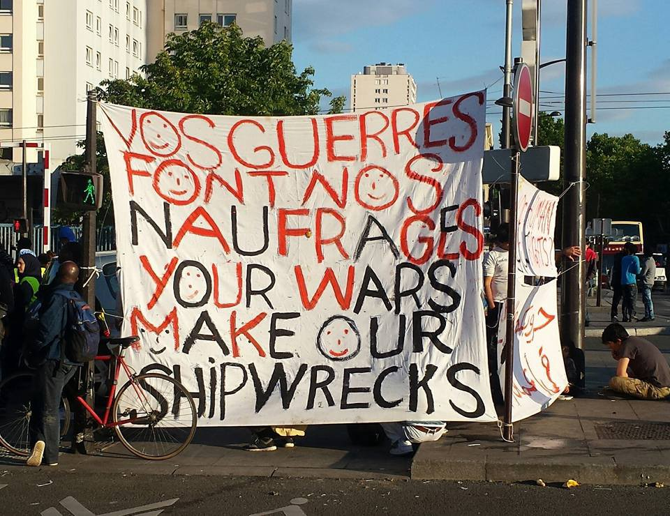
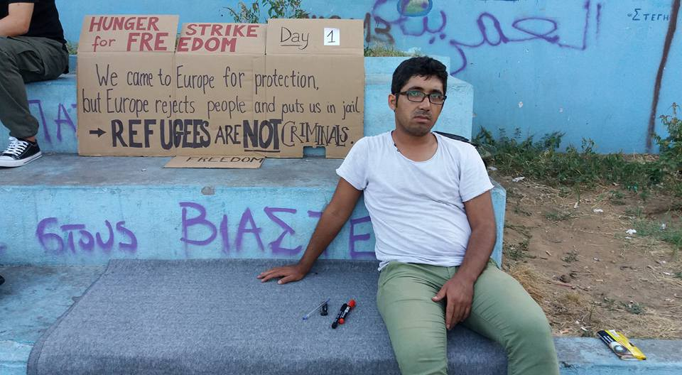
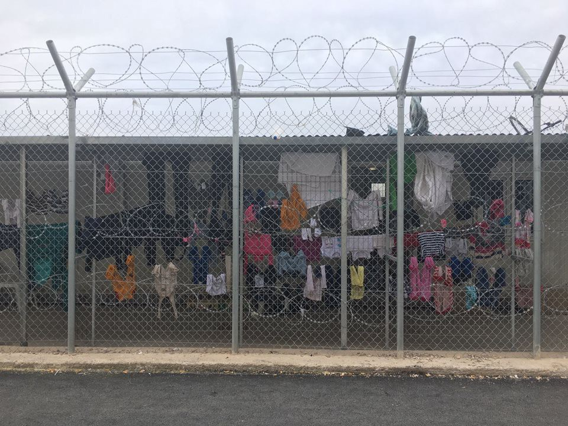
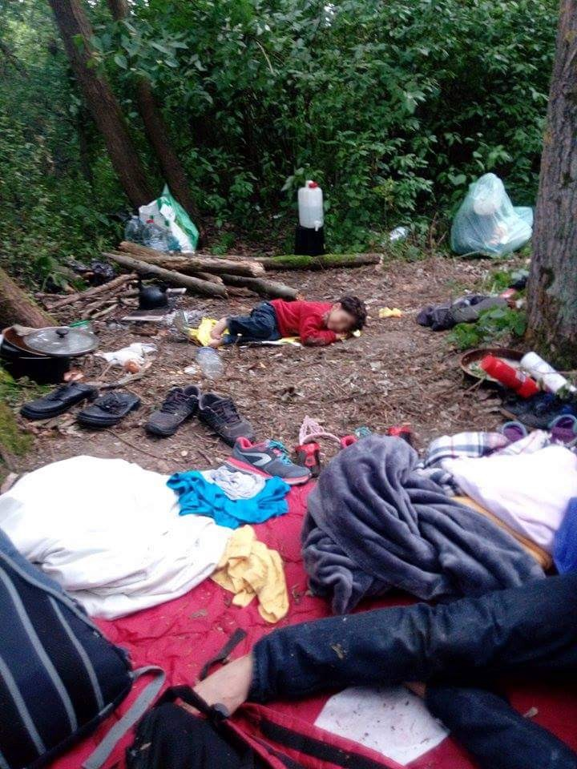

### AYS Daily Digest 01/07/17: Hunger strike in Moria carries on

_More people disappear in the Mediterranean / Water shortages on Chios / Germany halts asylum decisions for Afghan nationals / Tensions in Calais continue / And more news…_

### WEATHER ALERT

A heatwave is hitting southeastern Europe and Turkey throughout the weekend\. A code red weather alert is in place in Bulgaria\. Tempertures as high as 43 °C were registered in many provinces as well as in Greece and Turkey\. Similar conditions are expected for Sunday\.
### **FEATURE: Hunger strike ongoing in Moria**

The hunger strike in Moria continues\. The demands being made are demands for basic human dignity\.

‘Hunger strike for freedom’ in Moria \(Arash Hampay\)

This is the [statement](https://web.facebook.com/arashampay/posts/486993631646728) from one of the four participants in the hunger strike:

> I call for the immediate release from detention of my brother, and the three others who are on hunger strike inside the prison in Moria\. We demand the Greek Asylum Service and the United Nations hear our voices, which have fallen on deaf ears for too long\. 

> How dare you speak in the beautiful slogans of human rights? How dare you talk about humanity and law and democracy? How dare you condemn human rights abuses in other countries when you are committing human rights abuses here, yourselves? 

> We came to Europe for protection\. We came because we were hurt, because we were tortured, because our lives were in danger\. But instead of showing us mercy, you are treating us like criminals\. Barbed wire and prison cells are not the right place for refugees\. 

> From the day we fled the hell we were enduring in our home countries and became refugees in pretentious Europe, we have suffered the worst kinds of psychological torture\. We have been humiliated and beaten by the police\. We have been denied the right to work and if we do work, we are exploited\. We have had our human dignity stripped from us\. In the winter in Moria people have died from cold and hunger at night, freezing in thin tents for months on end\. We saw our families dying beside us and you did nothing\. 

> The imprisonment of my brother Amir Hampay is a violation of his basic human rights\. He has been in prison for 2 months\. For what crime? On what legal or ethical basis can you justify arresting and detaining us in this way? 

> My brother Amir and I are from Iran\. Bahroz Aresh and Kozhen Hussain are from Iraq\. Tariq Ibrahim is from Syria\. They are all on hunger strike from yesterday, and today the 28 June 2017 I have joined them\. We will remain on hunger strike until you meet our demand\. 

> Our demand is simple\. It is a demand for basic human dignity\. We demand you release all the refugees in prison in Lesvos who have not been accused or convicted of any crime\. We demand Europe stop keeping refugees in detention\. 

### **SEA**
#### 60 people still missing in the central Mediterranean

Flavio di Giacomo, spokesperson of the International Organization for Migration \(IOM\), reports about the latest tragedy on the central Mediterranean route\. Testimonies of a shipwreck that occurred earlier this week have been collected from 80 survivors who disembarked in Brindisi\. Their dinghy capsized off the Libyan coast with around 140 people on board\. 60 people are still missing\.

■■■■■■■■■■■■■■ 
> **[Flavio Di Giacomo](https://twitter.com/fladig) @ Twitter Says:** 

> > 80 survivors brought to Brindisi reported to IOM staff that their dinghy with abt 140 people on board capsized: abt 60 migrants went missing 

> **Tweeted at [2017-06-30 11:21:00](https://twitter.com/fladig/status/880747996270538752).** 

■■■■■■■■■■■■■■ 

> The inflatable had been carrying 140–150 people including women when it began taking on water five hours after setting off from North Africa on Monday\. 

> \[…\] They don’t know how long it was before help arrived\. They clung to bits of the dinghy until it fell dark, then a boat arrived and they were rescued\. 

Those rescued were among the 550 people disembarked in Brindisi by the British navy’s HMS Echo\. Over 10,000 people have been rescued since last Sunday\.

The latest deaths increase the toll of people who died attempting the crossing or are missing—feared drowned—to nearly 2,100 since the beginning of 2017\.
### **GREECE**
#### Arrivals

Yesterday one boat arrived on Samos, carrying 46 people: 14 children, six women, and 26 men\. Today one boat landed on the southern coast of Lesvos with 44 people on board: 20 children, 12 women, and 12 men\.

As far as AYS knows, everyone’s ok\.
### **LESBOS**
#### Forest fire in the Kara Tepe area

A forest fire started this afternoon in the Kara Tepe area\. Luckily it was extinguished before reaching the refugee camp or any inhabited areas\.
### **CHIOS**
#### No drinking water in Souda camp

While water shortages have been affecting the islands for some days now, today Souda camp was reportedly with no drinking water at all\.

Conditions in Chios \(Refugee Info Bus\)
### **MAINLAND**
#### Fascist group attacks migrant worker in Athens

Keerfa [reported](http://www.antiracismfascism.org/index.php/racism-fascism/item/2182-fasistes-maxairosan-metanasti-ergati-gis-sto-menidi) about a migrant worker attacked and stabbed in the leg on Thursday morning on his way to work by a group of Golden Dawn fascists in Menidi, Athens\.
#### Calling for smartphone donations

> Smartphones are the most prized possession of every refugee; they allow contact with family and friends, access to information, and a very small sense of normalcy\. They are literally a lifeline\. 

> Phones are often upgraded here\. If you have an older one that you can donate, please consider doing so… Phones need to be \*unlocked\* and wiped \(or at least unlocked and not password protected\) \.
 

>  Donations of second\-hand laptops for online learning, online work, and entertainment for kids are also needed\. 

Get in touch [here](https://web.facebook.com/leslie.schick/posts/10155481897443620) \.
#### Job openings and and calls for volunteers

Organization Earth published a new set of job openings\. Some are for Arabic and Farsi speakers\. Read more [here](http://www.organizationearth.org/wp-content/cache/supercache/organizationearth.org/job-openings/index.html.gz) \.

Find information on how to help and volunteer in Greece [here](http://www.greecevol.info/task.list.php) \.
### **GERMANY**
#### BAMF halts asylum decisions for Afghan nationals

Following the deadly attack near the German embassy in Kabul at the end of May, Germany’s Federal Office for Migration and Refugees \(BAMF\) finally decided to temporarily halt pending asylum decisions for Afghan nationals, [German media report](http://www.zeit.de/politik/deutschland/2017-07/bamf-afghanistan-abschiebung-entscheidung-bundesregierung) \.

The intention of the government is to reassess the situation in Afghanistan, until recently considered “safe” enough to deport people back\. BAMF continues to accept initial and subsequent asylum applications from Afghans; however, final decisions will not be taken until the end of July\. This affects around 30,000 Afghan refugees whose applications are still pending\.

[Pro Asyl](https://web.facebook.com/proasyl/) published a [statement](https://www.proasyl.de/pressemitteilung/afghanistan-faelle-rueckpriorisierung-oder-entscheidungsstopp-reicht-nicht-aus/) welcoming the decision and demanding the government reassesses all the cases from Afghanistan that have been rejected since April 2016, when the UNHCR assessed the deterioration of the situation in the country\.

> In 2016 approximately 25,000 Afghan citizens were rejected, and by May 2017 it was more than 42,000\. In no case known to us is the Federal Office based on the current situation development in Afghanistan\. A variety of refusals are based on obsolete text modules\. 

> All Afghanistan cases rejected since April 2016 have to be reworked by the Federal Office\. After all, since then UNHCR has tightened the situation in Afghanistan\. According to a decision of the Federal Constitutional Court \(see decision of 12\.03\.2008–2 BvR 378/05\), the UNHCR’s statements are compulsory\. 

### **FRANCE**
#### Growing tensions and reports of fights in Calais

[A volunteer](https://web.facebook.com/groups/197381947270598/permalink/499896833685773/?hc_location=ufi) reports of growing tensions and fights between refugees belonging to the Eritrean and Ethiopian communities in Calais, where just yesterday the Mayor publicly refused to comply to a legal sentence that calls on councils to improve basic services for refugees\.

Conditions on the ground in Dunkerque \(Patrick van der Wouwen\)

Inhumane conditions, continuous threats and violence from the police, and the impossibility of being guaranteed basic needs such as water and food continue to fuel tensions and conflicts in the area\.

> Last night, around 8pm, at the end of the meal, a fight broke out between Eritreans and Ethiopians, which are the most important communities in Calais right now\. A new conflict started this afternoon\. 

> It’s not new, it has to be the fourth fight since February\. There is a background of tension in the history of these two countries, fuelled by the Eritrean dictatorial regime\. On the other hand, there is also tension between the Oromos of Ethiopia, the majority people, and the Peuples and Amhara peoples, favoured by Ethiopian power\. 

> These tensions are found here in Calais, and are erupting due to appalling living conditions, stress related to the difficulties of passage in Great Britain and police violence\. The police force is more busy providing the volunteers with PV rains than to order\. When a fight breaks out, they throw tear gas, and voila\! 

> We are constantly trying to create dialogue, but it is enough that a few young people consume alcohol \(they are not Muslims, they are Christians…\) so that everything goes to hell\. 

> Finally, by forcing us to distribute on a single location, the authorities are responsible for the mixing of communities, and thus contribute to various tensions\. 

> **_We strive to echo correct news from the ground through collaboration and fairness, so let us know if something you read here is not right\._** 

> **_If there is anything you want to share, contact us on Facebook or write to: areyousyrious@gmail\.com\._** 

_Converted [Medium Post](https://areyousyrious.medium.com/ays-daily-digest-01-07-2017-hunger-strike-in-moria-carries-on-15b3b3754fcd) by [ZMediumToMarkdown](https://github.com/ZhgChgLi/ZMediumToMarkdown)._
