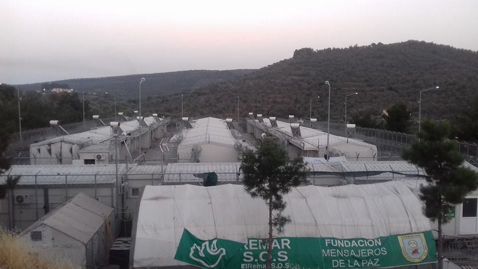

### AYS Daily Digest 03/07/17: Italy\-Europe agreements over refugees lives

_Suicide bombing in central Iraq refugee camp / Appalling conditions in Chios / Solidarity at Porte de la Chapelle / Belgium and Poland to harden stands towards refugees / Cooks needed in Rome’s Baobab camp / And more news…_

■■■■■■■■■■■■■■ 
> **[MSF Sea](https://twitter.com/MSF_Sea) @ Twitter Says:** 

> > Those we rescue at sea have names, faces, families, friends, dreams, strengths &amp; flaws. They're more than numbers &amp; the #EU has to do more. https://t.co/jqVFfluYLX 

> **Tweeted at [2017-07-03 12:14:55](https://twitter.com/msf_sea/status/881848727215984640).** 

■■■■■■■■■■■■■■ 

### **Feature**

It was a busy week for Italian Interior Minister Marco Minniti\.

On the 28th of June, suddenly stroke by the migrants “emergency” in the Mediterranean, performed a great show, suddenly redirecting back to Italy the plane on which he was flying to the US\. Since then he has been pledging for more support from the EU to the SAR operation between Libya and Italy\. He threatened to close its ports to the rescue ships, to limit charities activities and asked NGOs vessels to disembark refugees — at least on time in their life — in a different country\.

While it’s true that Greece and Italy are often being left alone by the EU, it is important to remember that the decision regarding the safe harbour in which boats are allowed to disembark rescued people, is taken by the Italian coast guard \(Capitaneria di porto\) “on the base of continuous contacts with the Interior Ministry and police forces”, as it was stated by admiral Vincenzo Malone when questioned by the Defense commission of the Italian parliament on May 11 \( [\*](https://web.facebook.com/francesco.floris.7564/posts/1976612152574594) \) \.

■■■■■■■■■■■■■■ 
> **[MSF Sea](https://twitter.com/MSF_Sea) @ Twitter Says:** 

> > They look strong and well because their wounds are well hidden but every day we meet young men who are victims of torture, slavery and rape. https://t.co/CGufsJIzhn 

> **Tweeted at [2017-07-03 13:14:18](https://twitter.com/msf_sea/status/881863672372633600).** 

■■■■■■■■■■■■■■ 

One of the rescue organisations, SOS Mediterranee, said that forcing boats carrying migrants to go to other European ports would be logistically difficult\.

_“If the order came, we would have no choice, we would obey\. But it would be completely impossible with more than 1,000 people on board\. And then we’d need to make a stopover in an Italian port anyway to refuel, or we’d end up needing to be rescued ourselves,_ ” [SOS Mediterranee spokeswoman Mathilde Auvillai](https://www.thelocal.it/20170702/italy-urges-eu-ports-to-take-migrants-as-pressure-builds) n said\.

■■■■■■■■■■■■■■ 
> **[MSF Sea](https://twitter.com/MSF_Sea) @ Twitter Says:** 

> > There is something seriously heartbreaking about elderly #people forced to flee. This couple fled #Syria via #Sudan, the #Sahara &amp; the sea. https://t.co/xKExwYWfyp 

> **Tweeted at [2017-07-03 14:41:26](https://twitter.com/msf_sea/status/881885599078207488).** 

■■■■■■■■■■■■■■ 

On [Sunday](http://europa.eu/rapid/press-release_STATEMENT-17-1876_en.htm) minister Minniti met with French and German counterparts to draw up a code of conduct for charities operating boats in the Mediterranean\. In the ministers minds it _“ [would be an attempt to regulate operations in the sea where the Italian coast guard, European border patrol forces and NGOs currently operate vessels which pick up stranded migrants](https://www.thelocal.it/20170703/italy-agrees-to-draw-up-migrant-rescue-code-of-conduct-with-france-and-germany) ”\._ This proposal is to be presented at the end of the week at the meeting of the Interior ministers of all the 28 EU country\. These are the other points discussed yesterday:
- Enhance support to the Libyan coast\-guard by increasing training activities and providing additional financial support, while ensuring close monitoring of activities;
- Provide additional support to IOM and UNHCR to allow facilities in Libya to reach international standards in terms of living conditions and human rights;
- Encourage the examination of possible concrete options to reinforce border controls at the Southern border of Libya in order to stem irregular migratory flows, in close coordination with Libya’s neighbouring countries\.
- Reinforce the EU strategy on returns, making full use of capacities provided by Frontex as well as of the agreed coordinated reassessing of visa policy toward third countries in order to enhance readmission rates where needed\.
- Make full use and accelerate the agreed EU relocation scheme in order to strengthen relocation of persons in need of protection\.

It’s an other blow towards the externalization of borders, the reinforcement of deportations and criminal agreements, and the limitations of humanitarian actions\.
### **Iraq**
#### Refugee camp in Anbar province hit by suicide bomber

Media [report](http://www.aljazeera.com/news/2017/07/deadly-suicide-bomb-blast-rocks-iraq-camp-displaced-170702181156452.html) that at least 14 people, including civilians, have been killed after a suicide bomber blew himself up on Sunday at a camp for internally displaced people in the Anbar province, in central Iraq\.

Adnan Fayhan, the head of the local council in the al\-Wafaa area, where the camp is located, said that the camp would be closed following the attack and that all the displaced people in the camp would be brought to another camp west of Ramadi that is “safer and receives more aid”\.
### Italy
#### Baobab needs cooks

While Baobab Experience petition to Ferrovie dello Stato, owner of the area where the camp is occupied, in order to obtain a formal right to stay, has reached almost 2,800 supporters, they still needs cooks\.

Baobab launched a call for cooks for the next weeks for the people living in Piazzale Maslax, Rome\.

If you can help, get in touch [here](https://web.facebook.com/PASTI-Baobab-Experience-1295938570502827/) \.

Sign the petition [here](https://www.change.org/p/baobab-experience-chiama-ferrovie-dello-stato-fsnews-it?recruiter=742049056&utm_source=share_petition&utm_medium=copylink&utm_campaign=share_petition) \.
### **Greece**

The number of arrivals in June in Lesvos was 940, media source [report](http://www.helpis.gr/prosfigiko/940-prosfyges-eftasan-ton-iounio-stin-lesvo/) \. This signals a rapid increase in respect with the earlier months of 2017: 456 in January, 252 in February, 336 in March, 281 in April and 534 in May\.

Conversely, the June arrivals decreased in the other large eastern islands\. 309 arrived in Chios in June, when 324 arrived in January, 275 in February, 824 in March, 505 in April and 984 in May\.

In Samos 249 people arrived in June, 232 in January, 172 in February, 247 in March, 243 in April and 249 in May\.

According to the General Police Directorate North Sea, 3\.886 refugees and immigrants are living in camps and other structures on Lesvos, 3\.685 on Chios and 2\.065 on Samos\. Overall 9\.636 refugees live on the islands of the Eastern Aegean, when at the beginning of the year was 11\.078, 10\.123 in late January, 9\.209 in late February, 8\.604 at the end of March, 8\.546 in late April and 9\.170 in late May\.

According to the Coast Guard Command, in June 39 interventions sent back to Turkey a total of 1\.454 people\. Since the beginning of the year a total of 6\.453 people have been sent back in 159 operations\.
#### Arrivals and registrations

One boat came in on the night between Sunday and Monday on the north coast of Lesvos carrying 21 people: 13 children, 5 women, 3 men\. Everyone is ok\.

Today’s official registration: Lesbos: 81 — Other ilands: 6 — Total: 87
 
Total since July 1st: 224
### **Chios**
#### Rats, lack of water, high tempertures: conditions in Chios camps are worsening by the day

Life for people stranded on islands is becoming scarier every day\. The latest report is about the 1\-year old Syrian boy who was taken to the hospital in Chios after bitten by rat\.

As one of the volunteers from Chios informed us, the baby lives with his young parents in one of the small tents at the entrance to Souda camp\. “The camp has long been infested with rats\. Four days ago he was bitten by a rat, on his left arm\. His parents took him to the hospital, where he was issued a bottle of liquid antibiotic and released to the hell of his canvas tent, boiling under the sun in 105 degree F heat\. Liquid antibiotics have to be kept cool\. There is no access to refrigeration in the camp, naturally\.” However, yesterday baby was found — again by a volunteer — with the “gash” on his arm infected, his body covered in blisters, vomiting and with severe diarrhea\. Baby is now hospitalized on IV antibiotics\.

[Refugee Info Bus](https://web.facebook.com/RefugeeInfoBus/) published a video on the situation on the island:

### **Lesvos**
#### Coastguard is obstructing volunteers rescue operation off the northern coast

#### Moria camp

While the hunger strike is still going on, refugees and volunteers reports highlight the inhumane conditions of the detention centre:

Moria camp

> In the camps live over 100 refugees from different nationalities; rooms are closed from 23 to 8 every night and the Greek Police take away all the phones\. Refugees are allowed to use their phones for only 1 hours a day\. 

 **\)**](assets/b5c4352829d5/1*mFYc0wormnqlQT6x-3vCdg.jpeg)

Is this a camp or a prison? \(Immigrant [**مهاجر**](https://web.facebook.com/riadh04/?fref=nf) **\)**
#### It’s not possible to just switch from family reunification to relocation

Mobile info team for refugees in Greece published a clarification:

> In many cases, family reunification takes a long time, especially to Germany at the moment\. However, this does not mean that you can simply switch your application to relocation\. The Relocation Programme is normally only for people who are not eligible for family reunification\. There is only a chance to change to relocation in cases where a family reunification request has been completely rejected\. In these cases, the Asylum Service may try to send a relocation file to the state where the family member is\. But please bear in mind that in the Relocation Programme there is never a guarantee that you get relocated to a certain country\. It is not possible to choose which state a relocation file will be sent to\. Even though Germany is currently severely delaying the reunification process, the only way to be sure that you will be with your family again in the future is through family reunification 

Read the full post \(Arabic and English\) [here](https://web.facebook.com/mobileinfoteam/photos/a.1800063030222418.1073741830.1796286800600041/1989781194583933/?type=3&theater)
#### Volunteering needs

Pamperaiki warehouse at Ellinikon needs volunteers\.

> The Ellinikon Warehouse is the central storage for most donations in Athens\. They distribute dry foods and essential non\-food items to the squats, shelters, camps and also private accommodations\. 

> You can volunteer in the warehouse with En Red SOS refugiados You need to be registered in advance\. Please, contact pampiraiki@gmail\.com providing your name and surname, ID number and the dates that you will be in Athens\. 

More volunteer needs throughout Greece can be found on [Greecevol](http://greecevol.info/) \.
#### **France**
#### Updates from Porte de la Chapelle, Paris

On Saturday 1st a gathering, organized by the solidaritè migrants wilson collective allowed to cover the walls of the neighbourhood of writings, banners and drawings made by migrants to show their feelings and share their stories, as well as by people who came to support them\. 
 
A gathering to remind everyone of essential information often denied by the organs of power: they are human beings who also deserve to live in dignity; they are human beings with a journey and memories to share; they are human beings who are entitled to be helped; they are human beings\.
 
In the occasion the collective expressed demands to the French authorities:
- to support the reception of migrant children and adults in respect of human dignity and human rights;
- to deploy an emergency plan for this summer to meet basic needs;
- for an actual application of the right of asylum;
- to stop the criminalisation of solidarity in any form\.

The solidarithé collective published several pictures of the Porte de la Chapelle museum of art

#### Urgent Blanket appeal from Refugee women’s centre in Dunquerke

> Useable clean BLANKETS are needed to provide warmth or shelter for families who have fled violence and are now sleeping in the open\. 

> The numbers of refugees sleeping in the woods near Dunkirk is growing daily\. With roughly 300 people, including babies, children, teenagers and adults without toilets, showers or access to electricity\. This isn’t fun camping\! 

> A number of European voluntary groups provide regular meals and material needs — but are running out of BLANKETS\. Since the closure of the camp in April there has been no provision for shelter or food from the local authority\. 

> Please help with the Womens Centre blanket collection get in touch with friends and neighbours and share on social media\! 

> We welcome deliveries to us in Grande Synthe to the Salam warehouse\. We also have a large vehicle driving from Dorest in UK on the 10th July\. 

Get in touch and read the full post [here](https://web.facebook.com/refugeewomenscentre/posts/313014385790865?hc_location=ufi)
### **Poland**
#### Polish government harden its stance against relocation programme

According to media [reports](https://www.bloomberg.com/news/articles/2017-07-02/kaczynski-recalls-nazis-in-declaring-poland-s-right-to-eu-funds) , Jaroslaw Kaczynski, head of the ruling Law & Justice Party hardened its stance against refugees speaking at his party’s conference in the central Polish town of Przysucha on Saturday\.

While already facing internal and external criticism for backsliding on democracy, Law & Justice has renewed its vow to “protect” Poles from immigration and keep them safe from terrorist attacks\.

“Nobody will force us to accept a social disaster because we receive EU funds\. You all know I’m talking about immigrants who are flooding Europe\. There’s no reason for us to lower our standard of life\.”

Polish government rejected a plan under which its predecessor agreed to host about 7,000 immigrants from the Middle East and Africa\. The European Commission has launched infringement procedures against Poland, Hungary and the Czech Republic for rejecting refugee quotas\.
### **Belgium**
#### Belgian parliament to discuss changes in migration law

Belgian lawmakers will discuss an overhaul of Belgium’s migration law on Tuesday that may include detaining some asylum seekers in closed centers, media sources \( [1](http://www.lesoir.be/102664/article/2017-07-03/theo-francken-facilite-la-detention-des-demandeurs-dasile) , [2](http://www.politico.eu/article/belgium-migration-refugees-asylum-parliament-debates-policy-overhaul/) \) reported today\.

Theo Francken, Belgium’s conservative state secretary for asylum and migration, has been accused of leading a crusade against refugees\. In the last two years his office stripped over 100 refugees of their status because they visited their home country\.

His proposals for the new changes have also met criticisms\. He pledged asylum seekers to be detained if they provide false documents, file their documents too late, or fail to disclose whether they registered in another country, among other criteria\.

“What is worrying about these criteria is that they are so vague, almost all claimants could be affected,” \(Vanessa Saenen, spokesperson for the UNHCR\. \)
#### Refugees in arts and academia

The [Jonge Academie](http://jongeacademie.be/) and [SAR — Scholars at Risk](https://www.scholarsatrisk.org/) are organizing an event tomorrow July 4th in order to bring public attention to the issue of refugees in the arts sector and the academia, and to examine the current situation in Flanders\. “We are convinced that there are prospects to turn the current challenges into opportunities, both for refugees, the arts sector and academia\.”

14\.30–16\.30: Workshop on Scholars At Risk intended for higher education institutions

16\.30h — 20\.30h testimonials, discussions, performances, etc Palace of the Academies — Hertogsstraat 1–1000 Brussels

Read the full program [here](http://jongeacademie.be/detail-evenement/refugees-arts-academia-en/)

**_We strive to echo correct news from the ground, so let us know if something you read here is not right\._**

**_If there is anything you want to share, contact us on Facebook or write to: areyousyrious@gmail\.com\._**

_Converted [Medium Post](https://areyousyrious.medium.com/ays-daily-digest-03-07-2017-italy-europe-agreements-over-refugees-lives-b5c4352829d5) by [ZMediumToMarkdown](https://github.com/ZhgChgLi/ZMediumToMarkdown)._
