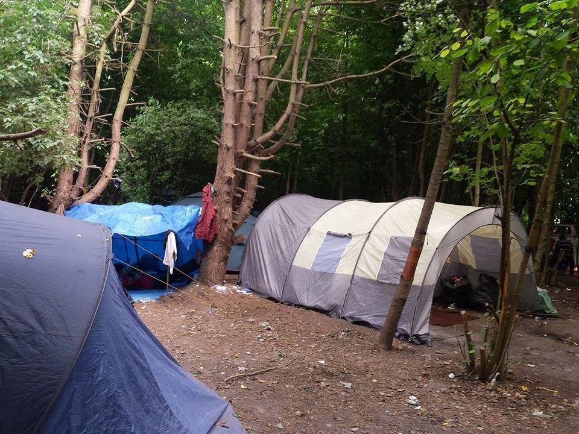

### AYS Daily Digest 04/07/17: Slow procedures endangering people’s health

_Residents of Chios’ Souda camp unable to leave island despite permits / Water shortage situations improve / False rumours of border opening in Croatia / Hungary uses electric fences / Interior ministers take wrong measures, says HRW / New ‘Jungle’ in Dunkirk / And more news…_

 \)](assets/ee9d852fc37/1*cq1yPOI9eThjY5Ypgn0n9g.jpeg)

Residents of Moria wait for their interview\. \(Photo by [مهاجر immigrant](https://www.facebook.com/riadh04/) \)
### FEATURE: Hell on Chios

People on Chios not only have to face high temperatures, problems with access to water, and tough conditions in the facilities available to them—they also lack even basic support from local authorities\.

Local volunteers today [published](https://www.facebook.com/jenny.kali.1/posts/1699284260085754?pnref=story) the case of a family stuck in Souda camp:

> “A family of six people, in need of urgent support, has become the victim of the slow procedures and reaction of staff and authorities\. The 43 year old father of the family, who suffers from heart failure and lymph cancer, had a heart malfunction today\. As the medicine did not help, an ambulance was called and brought him to hospital\. Even though it seemed he will be better in between, the problems became worse again and he had to stay in hospital\.” 

As the volunteers found out from the municipality, the case of the family has been reported three times to the UNHCR since the family’s arrival on Chios in late May\. Up until the time this was written, the family stayed in two small tents, enduring the difficult weather and other conditions\.

_“They said they will find a room for him or transfer him to Athens but nothing so far,”_ a volunteer reported\. After putting pressure on the authorities, the volunteers were threatened with not being allowed to enter the camp in the future\. The volunteers are trying to find a short\-term solution now, in which the family can rest in better conditions, until they are finally transferred to the mainland\.

This is the same family whose [child was bitten by a rat a couple of nights ago](https://medium.com/p/b5c4352829d5/edit) in the tent they are living in\. The baby is only one year old\. The Souda camp, where they live, has long been infested with rats\.

In another example of the island’s deplorable conditions, AYS is aware of cases in which people looking to leave the island to go the mainland—in some cases for medical treatment—were not permitted to leave, despite holding the proper documentation to do so\.

It furthermore seems to be very hard to find accommodation on Chios, as people are reportedly not willing to rent their spaces to strangers in need\. If volunteers manage to find appropriate rooms, they are often at abandoned places, not receiving any outside support but from independent volunteers\.

At the end, volunteers are reporting that the UN is not allowing single men use a service they run that operates buses between camps, forcing some men to walk for hours to go to Vial for an interview\. Despite a number of complaints over time, the UN has done nothing to change this practice\.

 \)](assets/ee9d852fc37/1*oWUHf8PqdW2OR4sprIVJCQ.jpeg)

Two of the family’s tents\. \(Photo by [Jenny](https://www.facebook.com/jenny.kali.1/posts/1699284260085754?pnref=story) \)
### GREECE
#### General news and new arrivals

[According to people](https://www.facebook.com/StoriesfromChios/videos/274479753020490/) on Chios, tap water shortages have been fixed after almost a week of problems—at least in an UNHCR/Praxis accommodation housing 33 residents\.

Meanwhile, the residents of Moria camp on Lesbos have finished their fifth, respectively sixth, day of a hunger strike yesterday\. The strike is intended to raise public and official attention with regards to their desperate situation\. Those taking part in the hunger strike report that despite promises made by authorities, they still have not yet had the opportunity to see a doctor\.

21 people on Lesbos were registered as new arrivals today\.

 \)](assets/ee9d852fc37/1*QAI7_v7TV-Z3w701jQ9Jqg.jpeg)

The situation around the hotspots is still miserable, but Europe turns a blind eye towards it\. \(Photo by [Arash Hampay](https://www.facebook.com/arashampay) \)

As there is no legal way for many people to find refuge and make use of their human rights in Europe, they are being forced to try other ways\. In the last days the police noticed an increasing number of undocumented people attempting to enter other European countries from regional airports scattered in the Aegean Islands\. In two days alone, the police on Kos, Santorini, and Rhodes arrested at the airport 13 people who were carrying false documents, preventing them from boarding planes, [Ekathimerini reports](http://www.ekathimerini.com/219763/article/ekathimerini/news/undocumented-migrants-using-island-airports-to-get-deeper-into-europe) \.

To continue their distribution efforts in Kara Tepe, Lesbos, Humanitarian Support Agency is calling for clothing donations\.

> The most urgent things are: 
 

> Men’s underwear small & medium
 

> Men’s shoes/sneakers 40–41–42–43
 

> Sandals for all
 

> Boys & girls underwear ages 2–12
 

> Women’s bras 

> We always also need more of:
 

> T\-shirts for all
 

> Shorts for all
 

> Trousers for all
 

> Hijabs/scarves 

> — Sonia Nandzik 

Whoever is able to donate can contact HSA at: hsadonations@humanitarian\-support\-agency\.org
#### MAINLAND

Volunteers in Pireaus are giving away sunshade \(or suntan lotion\) to be used in camps, squats, or other facilities\. Each is sized 6x4m\. To request some, please write an e\-mail to pampiraiki@gmail\.com\.

RefuComm published a detailed guide on how to act and what to do when families are separated\. The information is available in English, Arabic, Farsi, and Urdu\. We hope it can be spread and of use widely\!

### CROATIA

During the past few days, rumours circulating about Croatia’s border opening have intensified\. **This is NOT true\.** It is unclear where the rumours originated and who is spreading them, but we implore the volunteer community to pass on the correct information to everyone\.

We understand how difficult it must be to, in a way, crush someone’s hope for the future, but moving towards the Croatian border would endanger their wellbeing, and likely have them detained and/or pushed back\.
### HUNGARY

According to a report by [Politika,](http://www.politika.rs/scc/clanak/384299/Pametna-ograda-vidi-govori-i-pecka) the Hungarian authorities have been testing the use of electrified fences with a voltage of 900 volts\. Speaking to [Balkan Insight](http://www.balkaninsight.com/en/article/hungarian-smart-fence-opposes-eu-values-ngo-says-07-04-2017-1) , the Belgrade Centre for Protection and Help for Asylum\-Seekers criticized this step as a violation of the European Convention on Human Rights\. Hungarian officials defended this measure as a suitable level of security\.
### ITALY
#### EU’s interior ministers come to the wrong conclusions

Human Rights Watch [criticized](https://www.hrw.org/news/2017/07/04/eu-boat-migration-demands-shared-responsibility) the EU’s interior ministers for their plans to control Libya’s borders, increase returns from EU countries, and relocate people out of Italy in order the tackle the increasing number of arrivals from the Mediterranean Sea\.

“These proposals on boat migration fall far short of a genuine roadmap for sharing responsibility\. That’s not good for the EU, it’s not good for Italy, and it’s awful for people fleeing Libya,” said Judith Sunderland, Associate Europe and Central Asia Director at Human Rights Watch\. “Long\-term goals, however laudable, cannot obscure the current stark reality: with abusive conditions, lack of asylum system and conflicts there, Libyan authorities cannot effectively guarantee rights or protect people\.”
#### A show of force?

MSF ship _Vos Prudence_ [got stuck](http://palermo.gds.it/2017/07/04/migranti-nave-di-medici-senza-frontiere-bloccata-a-palermo-per-motivi-burocratici_690549/) in Palermo port\. It should have left to a rescue mission in the Mediterranean Sea, but during preliminary checks the port authorities found out that the machine director did not have all his papers in order\. The man was supposed to substitute a colleague, off due to family reasons\.

The ship headed to international waters that evening, MSF announced\. The NGO accused the port authorities of stalling the vessel as a show of force\. Italian politicians recently threatened to stop allowing rescue ships enter their harbours anymore if Italy fails to receive more support in taking in new arrivals\.

 \)](assets/ee9d852fc37/1*h1YQBXGzqRTK7mHnyJrP6w.jpeg)

The _Prudence_ is at sea again\. \(Photo by [MSF Sea](https://twitter.com/msf_sea?lang=de) \)
#### Austrian populists prepare for elections

Vienna [threatened](https://euobserver.com/migration/138425) to deploy the army along the Brennero border if Italy does not stop the migrants trying to cross it\. Four armoured vehicles to be used in shoring up the border have already reached Brennero, the Ministry of Defence announced\. The deployment would involve 750 soldiers \(450 in Tirol, the others in Carinthia\) to be deployed within three days\.

Much of this choice is explained by the fact that Austria is going to have elections in October, with migration set once again to be one of the main themes of the campaign\. The Italian governor of South Tyrol, Arno Kompatscher, in [response](http://www.bbc.com/news/world-europe-40491497) to that said that the situation would remain quiet and stable, as it has been\.

The Red Cross in Pordenone is [pursuing a project](https://www.facebook.com/retesolidalepn/photos/a.1652837388330414.1073741829.1651933545087465/1925011624446321/?type=3) to create a canteen and a dormitory to host asylum\-seekers at night, rather than leaving them to sleep in the moat in front of the Monti former barracks\. The same structure could shelter anybody with difficulties throughout the hours of the night\.

The process of defining the supply contracts is currently ongoing\. Last Sunday, the Red Cross served food to less than 40 people\. A new structure could also solve the persistent issue of asylum\-seekers having to sleep rough outdoors\. According to Red Cross and following the parish’s example, this new service would be available only in the evening and night hours\. The daily program would entail entrance to the facility at dinner time, followed by registration of the entrances, the night sleeping there, and breakfast served in the morning the following day\. During the day, the structure would be emptied\. Less than 40 beds would be available, allowing almost all the current people in need to avail the dormitory’s services\. They are currently sleeping outside under the rain—staying in the moat, bare feet among the brambles\.

In Gorizia on Saturday night, July 1st, a gathering of people acted in what was called the “protest of the benches\.” Challenging the mayor’s declaration proclaiming fees against anybody found camping out in parks and the authorities’ coming clarification on the situation with public benches, Green Party leader Renato Fiorelli [stated](http://ilpiccolo.gelocal.it/trieste/cronaca/2017/07/01/news/gorizia-la-rivolta-delle-panchine-tutti-a-dormire-nel-parco-1.15561434) that the protest is not meant to provoke the other side, but rather to demonstrate non\-violent direct action\. He added, “Non\-violent action is doing what you deem right with your hands, without relying on hierarchic structures, without the need of a higher authority ordering you what to do or not\. Non\-violent action means to take on yourself a personal responsibility to realize the change”\.

Fiorelli arranged a meeting at Parco delle Rimembranze for whoever disagrees with the declarations and decrees of Gorizia’s new mayor, inviting them to sleep on the park’s benches between 11 at night and 7 in the morning\. They will only need a sleeping bag and a document\. The action is directed to encourage reflection towards the end of changing the situation at hand\.
### FRANCE
#### New ‘Jungle’ in Dunkirk

An estimated 400–500 people are sleeping rough in Dunkirk’s forests\. Even the most vulnerable groups of people—such as pregnant women and toddlers as young as one month—continue to live in unbearable conditions, with only the support of volunteers\.

Food is being provided daily but other essential aid such as clothes, sleeping bags, tents, and hygiene products are not being distributed very regularly, and when they are it is only in small amounts, a volunteer reports\. To make the life of those living in the forest at least a little bit easier, blankets are especially in need at the moment\.

The new Dunkirk ‘Jungle\.’ \(Photo by Kelvin B\)
### FINLAND

An unconfirmed number of Afghan asylum\-seekers were deported from Finland to Afghanistan last night\. According to reports the deportation took place with a charter plane, says the Afghanistan Migrants Advice & Support Org\.
### GENERAL

The Phone Credit for Refugees group is asking for money or voucher donations to continue their phone credit top\-ups for people in need\. For more information, see their post below:

As of July 3rd, 6,967 Syrians have been resettled from Turkey to Europe under the deal implemented in March 2016, updated data from the EU Commission shows\. In June 2017, 48 deportations were conducted from Greece to Turkey, raising the count to a total of 1229 in 2017\. The EU countries meanwhile continue failing to meet their goals of relocation\. Since the program was launched, 16\.113 people were relocation from Greece and 7390 from Italy\.

> **We strive to echo correct news from the ground through collaboration and fairness, so let us know if something you read here is not right\.** 

> **If there is anything you want to share, contact us on Facebook or write to: areyousyrious@gmail\.com\.** 

_Converted [Medium Post](https://areyousyrious.medium.com/ays-daily-digest-04-07-2017-slow-procedures-put-peoples-health-at-risk-ee9d852fc37) by [ZMediumToMarkdown](https://github.com/ZhgChgLi/ZMediumToMarkdown)._
