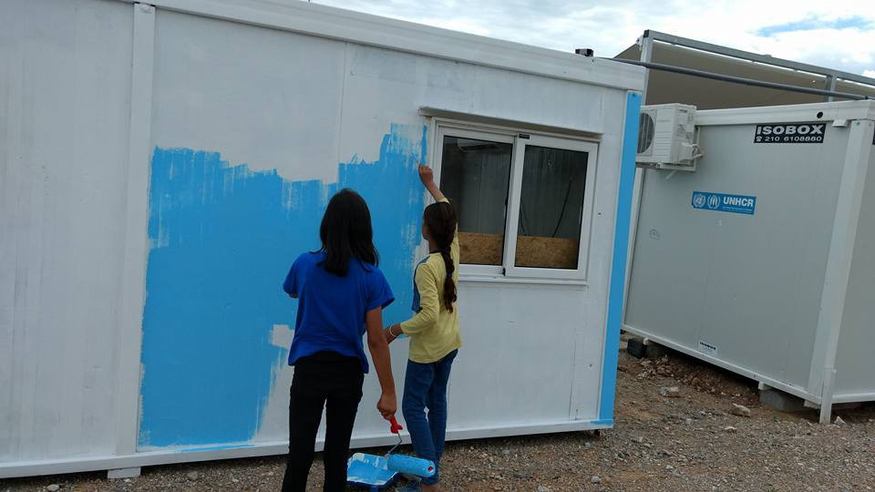

### AYS Daily Digest 05/07/17: Sharing responsibility on the Mediterranean
#### 49 people missing after boat sinks near Spain / Arrests in Samos camp / Serbia reacts to EU proposals concerning Frontex operations /Preparing for evacuation from Porte de la Chapelle and more

](assets/c200693c3d9c/1*JQT4BCBrpsnC4Y9CLv4WTA.jpeg)

“When does this life end?” — [مهاجر immigrant](https://www.facebook.com/riadh04/)
#### “Live up to your commitments”

Today might mark the deadliest Mediterranean crossing of this year\. 49 people are feared to be drowned a after boat from Morocco sinked near Spain’s Alboran Island, [reports](http://www.aljazeera.com/news/2017/07/50-migrants-feared-drowned-mediterranean-170705060131951.html) AlJazeera\. Only three men were rescued and taken to hospital after suffering from dehydration, aged 17 to 25 from sub\-Saharan Africa\. They “explained that more than 50 people were on board the rubber boat which had been drifting for several days after leaving the northern coast of Morocco”, the coastguards said in a statement, AJ writes\.

> In total, at least 2,247 people have died or are missing after trying to cross the sea into Europe via Spain, Italy or Greece this year, the IOM said\. 

Malta is once again under attack by Italian politicians and sections of the media for not taking any migrants from the tens of thousands rescued at sea, Malta Independent [writes](http://www.independent.com.mt/articles/2017-07-03/local-news/Malta-again-under-fire-for-not-taking-any-boat-migrants-6736176122) \. Not a single boat has been taken in by Malta in the past year, despite the fact that Malta is so close to Libya and a base for NGOs that run rescue missions, they write\. Italian MP Ravetto called on Malta’s EU member state status and Brussels closing an eye to this\.

Since some EU countries ignore their commitments, today the European Union executive [urged](http://www.ekathimerini.com/219815/article/ekathimerini/news/eu-beseeches-member-states-to-back-greece-italy-on-migrants) member states to step up their efforts in helping Italy and Greece cope with the surge in crossings over the Mediterranean\.

> “It would already make a world of difference in Europe if every single member state would live up to their commitments to show solidarity” EU Commision Vice President Frans Timmermans said\. 

A well\-coordinated plan among EU countries on the Mediterranean Sea — notably Malta, France, and Spain — to share responsibility for disembarkation is worth exploring as a way to alleviate the strain on Italy’s reception system, Human Rights Watch [said](https://www.hrw.org/news/2017/07/04/eu-boat-migration-demands-shared-responsibility) today reacting to the measures to tackle boat migration in the central Mediterranean proposed two days ago by the European Union migration commissioner and the interior ministers of Italy, France, and Germany\.

Responding to the European Commission’s ‘Action Plan to support Italy, reduce pressure and increase solidarity’ on the Central Mediterranean Route, Iverna McGowan, Amnesty International direcotr [said](http://www.amnesty.eu/en/news/press-releases/all/eu-migration-plan-woefully-inadequate-1055/#.WV1XUfmGO02) that “this is a woefully inadequate plan that does little to address the dire situation in the Central Mediterranean and the lack of EU solidarity\. Instead of proposing yet more migrants be detained and more speedily returned, EU leaders need to once and for all take real action to prevent drownings at sea\. Their priority must be to step up search and rescue, and provide safe and legal routes to Europe\.”
#### SYRIA

United Nations Secretary\-General António Guterres today announced the appointment of Catherine Marchi\-Uhel of France as the head of the independent panel to assist in the investigation and prosecution of those responsible for most serious violations of international law in Syria, UN reports\. Read more about her previous work [here](http://www.un.org/apps/news/story.asp?NewsID=57112#.WV1PPvmGO02) \.
#### GREECE
#### Samos

Today the Greek police searched and arrested 138 refugees in the Samos camp\. Most of the refugees who have been arrested are Algerian, also Syrians, Iraqis and Afghans\. Two hours later, a few were released, but 25 refugees and migrants remain in detention \. The people who were arrested are apparently those whose applications for asylum have been rejected for deportation to Turkey, but officers struggled to locate them all, ekathimerini [reports](http://www.ekathimerini.com/219832/article/ekathimerini/news/police-detain-dozens-of-migrants-in-samos-sweep) \. The search was carried out by Greek police from 5 am to 9:30 am in the camp in Samos, the refugees said\.
#### Athens
#### New laundry project

Ithaca Laundry is a mobile laundry service for refugees and people in need around Athens\. In the coming months, the Ithaca Laundry team plans to serve refugee camps around Athens, too\.

Check their weekly schedule:

📍Mondays: 2 p\.m\. to 6 p\.m\. at Piraeus Tower \(Dimosthenous Street\)
\(Google maps: [https://goo\.gl/maps/hn9dSDHy66M2](https://goo.gl/maps/hn9dSDHy66M2) \)

📍Wednesdays: 6 p\.m\. to 10 p\.m\. at συνΑθηνά \(Athinas 55\)
\(Google maps: [https://goo\.gl/maps/jjg6bDw2Q552](https://goo.gl/maps/jjg6bDw2Q552) \)

📍Thursdays: 1 p\.m\. to 5 \.m\. at Equal Society — Κοινωνία Ίσων Ευκαιριών \(Alikarnassou 49\) \(Google maps: [https://goo\.gl/maps/myKViNBfJxu](https://goo.gl/maps/myKViNBfJxu) \)

📍Fridays: 2 p\.m\. to 6 p\.m\. at Khora Asklipiou 80\)
\(Google maps: [https://goo\.gl/maps/KK9oADnpue42](https://goo.gl/maps/KK9oADnpue42) \)

📍Sundays: 6 p\.m\. to 10 p\.m\. at συνΑθηνά \(Athinas 55\)
\(Google maps: [https://goo\.gl/maps/jjg6bDw2Q552](https://goo.gl/maps/jjg6bDw2Q552) \)
#### Call out for English teachers in Athens

Khora community in Athens is excited to launch their next round of language classes beginning Monday July 10, and they are in need of English teachers\. They offer classes throughout the day at a variety of levels\. No extensive experience or certification is required, as teachers with a flexible curricular structure, teaching resources, and educational support is provided\.

If interested, feel free to contact [Ryan](https://www.facebook.com/ryan.faulkner.14) or [Khora](http://www.khora-athens.org/contact/) directly\.
#### English lessons at Hope project — [Thessaloniki](https://www.facebook.com/groups/hopeprojectthessaloniki/?ref=group_header)

> Tomorrow we will meet at 6\.30pm to assess everybody’s English and divide the groups into beginners and advanced English speakers\. We have limited spaces so if you’re interested in attending please let us know\. We look forward to seeing you tomorrow\! 

Find more info [here](https://www.facebook.com/groups/hopeprojectthessaloniki/) \.
#### [InterVolve](https://www.facebook.com/InterVolve-219418945063168/) updates on their activities in Koutsochero camp:

> The children’s library has operating in full swing every day from 4–7, with an expanded selection of books now including Sorani\! We’ve added young adult only hours to the library, where we also do crafts with the teens\-this has been especially popular with the teen girls\. Our partners at [The Timber Project](https://www.facebook.com/thetimberproject.org/?fref=mentions) are in the process of completing an outdoor shaded deck area to expand the capacity of the library, and it has already been hugely helpful as an additional space for children to do quiet reading or for colouring and card games\. 

](assets/c200693c3d9c/1*Dm87KrciLh3fp6uAo0wesQ.jpeg)

“Most positive has been the feedback from the residents that we have received in the last couple of weeks, with many people coming up to us to say they are really happy with the activities we have been doing, and best of all that we have had more and more residents participating in our activities and helping out with the DIY of fixing up the office and salon space\.” — [InterVolve](https://www.facebook.com/InterVolve-219418945063168/)
#### Lesvos

17 men, 13 women and 36 children landed yesterday morning in the South of [Lesvos](https://twitter.com/hashtag/Lesvos?src=hash) , [Refugee Rescue](https://twitter.com/RefugeeRescueUK) reports\. According to governmental data there were 212 registrations in Lesvos in the last four days\. The number of stranded people reached 4616, 4122 in structures and 494 in hosting facilities\.

Summary statement of refugee flows to Eastern Aegean Islands can be found [here](http://mindigital.gr/index.php/%CF%80%CF%81%CE%BF%CF%83%CF%86%CF%85%CE%B3%CE%B9%CE%BA%CF%8C-%CE%B6%CE%AE%CF%84%CE%B7%CE%BC%CE%B1-refugee-crisis/1449-summary-statement-of-refugee-flows-to-eastern-aegean-islands-05-07-2017) \.

A new weekly accommodation update for Greece is available [here](http://reliefweb.int/sites/reliefweb.int/files/resources/58373.pdf) \.
#### SERBIA

The Serbian government is not happy with EU proposals that the Frontex teams would be able to operate on its territory with total immunity from Serbian law\. After two rounds of talks between the EU and Serbia, the text of a proposed agreement that would govern Frontex teams’ joint operations, “rapid border interventions” or return operations in the Western Balkan country shows that the Serbian side rejects the EU’s proposal that “members of the team shall enjoy immunity” from the administrative, civil and criminal jurisdiction of the Republic of Serbia\.

State Watch wrote more about the situation, you can read it [here](http://statewatch.org/news/2017/jul/eu-frontex-serbia.htm) \.
#### FRANCE

Rumor has it that the authorities will evacuate people from the Porte de la Chapelle area this week, Solidarithé [writes](https://www.facebook.com/solidarithe/posts/1833490030302444) \. They are doing their best to prepare people and help them understand what’s going on\. Please share this with anyone who is supporting people in the area, information they are distributing is available in French, English, Arabic & Pashto [here](https://www.facebook.com/solidarithe/posts/1833490030302444) \.

](assets/c200693c3d9c/1*29Lau3KrIPqeWES0jSlM-g.jpeg)

La Chapelle by [**Signal of Solidarity — Flüchtlingshilfe**](https://www.facebook.com/SignalofSolidarity/)

A local volunteer writes about food distribution in Paris:

> Last night I did water distribution, in from of France terre d’asile, at Jaures\. We found almost 100 people there, all in line, waiting for their appointment, for registration\. They were desperate, I haven’t seen them in such state for a while, not since last camp on Jaures, in summer 2016\. We had to buy the load of water twice, apparently no one has been there with distributions in a while\. There was a fight and a car accident during this shot time we spent there\. I talked to some of them, and this is what they said: 

> “No one got in this week, FTDA is not letting anyone in\. People are coming and we are all afraid we might lose our place in line\. There are some big guys pushing us back, they are getting in front of us, that is why we are fighting\.”

> I couldn’t tell if there were any food distribution, but if there were none, it is not so odd\. Ramadan has ended and now food distribution have become rare, or completely terminated\. Refugees are on the edge, psychologically speaking\. It is summer, many volunteers and social workers are off to holidays, and that became very noticed\. For the next week we have very few volunteers, much needed help will not be provided\. 

> I would like to appeal to all of you volunteers to try to pay more attention to the refugees around porte de La Chapelle and FTDA in the next two weeks\. Don’t abandon them, they need your help very much\. Try to visit them as frequently as possible, of nothing else — it will be good for their moral\. 
 

> **So to everyone who is in Paris for the next two weeks — go to camps\. Don’t let them be forgotten\.** 

#### Dunkirk

Local volunteer reports on the situation on Dunkirk\. In case you are able to help, reach the organizations mentioned below\.

> There are anywhere between 3 and 500 people here\.
 

> There are one month old babies, grandfather’s in their 60s, whole families with kids aging between 2 and 10\. Kids of all ages\. There are pregnant women\. There are single men with nothing, they take care of the families with the little they have\. There are daily food distributions by RCK that are doing a great job of keeping them all going, but of course, more is needed\. RCK are fantastically making food for so many different areas in need\. There are intermittent distributions from a hand full of independent volunteers, L’Auberge, care4calais and Salam\. But nothing on the scale that they need\. As with the old GS, storage of aid is a big problem, there isn’t one specifically for them\. It’s not easy anywhere in France right now, there’s not enough basic aid for anywhere\. 

> Somehow we need to ramp up donations, material, food and monetary\. 

Photos by local volunteers
#### NORWAY
#### Deportation of unaccompanied minors

Norway is planning to deport unconfirmed number of Afghan unaccompanied minors, according to a new amendment between the Norwegian department of immigration \(UDI\) and a Afghan local organization\. Norway has now stopped working with IOM and is working with another local organization\. The local organization is now going with this deal and is ready to receive Afghan minors, [Afghanistan Migrants Advice & Support Org](https://www.facebook.com/Afghanistan-Migrants-Advice-Support-Org-195295217167437/) associate wrote\.

> We are working on involving the MORR in this and whether they have been aware of this or not\. It is totally unacceptable and against all the international laws, including the 1951 convention and its 1967 protocol\. More about this with further detail about the shameful deal will be shared soon, _they write\._ 

See more about their work and find more information on deportations [here](https://amasosite.wordpress.com/) \.

> **We strive to echo correct news from the ground, so let us know if something you read here is not right\.** 

> **If there is anything you want to share, contact us on Facebook or write to: areyousyrious@gmail\.com\.** 

_Converted [Medium Post](https://areyousyrious.medium.com/ays-daily-digest-05-07-17-sharing-responsibility-on-the-mediterranean-c200693c3d9c) by [ZMediumToMarkdown](https://github.com/ZhgChgLi/ZMediumToMarkdown)._
