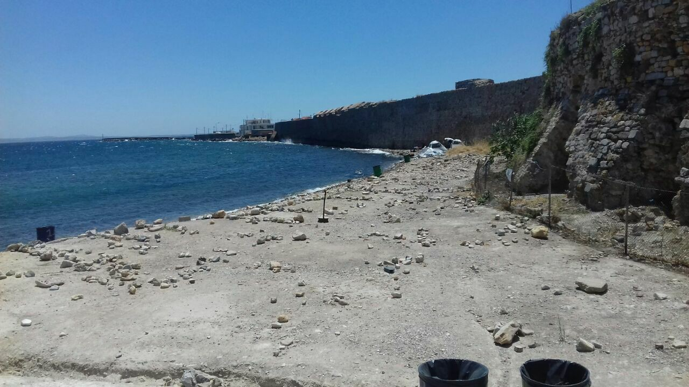

### AYS Daily Digest 07/07/17: 34th eviction at Porte de la Chapelle in Paris

_More than 100 people arrive every day to Paris / French asylum system illogical and complicated / European Commission noticed the lack of solidarity in Europe / Code of Conduct for NGOs saving lives in the sea / Souda camp at the shore empty / Hunger strike in Moria continues / More people arrested in Bosnia / And more news…_

\(Photo by Solidarity Migrants Wilson\)
### Feature

After months of agony, the authorities in Paris decided to — once again \- send heavily armed police officers to remove all the people who were sleeping rough in the streets, and take them to temporary shelters, mainly school gymnasiums\.

Between 1\.200 and 2\.700 people were taken to temporary shelters \(different sources are giving different numbers\) \. Media published that the first reception will probably be in emergency shelters, such as gymnasiums\. People treated according to the Dublin procedure will likely be identified and France will request that the responsible country examines their asylum application\. While the country examines the request, they will stay in one of the 93 Urgent\-Housing\-Centers \(centers d’hebergement d’urgency migrants, CHUM\) in the Paris area\.

As for the others, they will be lodged in CAOs \(Centre of reception and orientation\) for 3–6 months, to get their asylum application started\. This happens at the “PADA” \(Platform d’accueil \- reception platform\), and is followed by an individual interview at the GU \(guichet unique — unique counter\) \. Then the normal route would be to wait the decision while living at a “CADA” \(another form of reception center, Centre d’accueil pour demandeurs d’asile — reception centers for asylum seekers\) \. However, since these centers are overcrowded, and there is not enough of them, some people are lodged in hotels, and some in supplementary structures called “HUDA” \(herbergement d’urgency — urgency shelter, on the regional level\), or on the national level, in ATSAs \(Accueil temporaire, service de l’asile — temporary reception, asylum service\) \.

It is very difficult to say how many people were in the area of Porte de la Chapelle\. According to some estimates, between 80 and 200 arrive every day\. The center in this area has the capacity of only 400, and those who enter can stay up to 10 days\.

Some people are now accommodated in shelters around Paris, but some taken by buses to other locations outside of the city\. Some are still in the area\.

This is the 34 eviction since 2015, and so far, people usually came back, or new people arrived\. And it looks like Paris authorities do not have the solution, while activist and aid workers are demanding the establishment of an effective long\-term strategy for processing and housing asylum seekers in decent conditions\.

Recently, French President Emmanuel Macron asked officials to produce a plan to accelerate processing of asylum requests with a view to deciding within six months who will be granted refugee status and who gets sent back, the media are reporting\.

The Human Times posted a video and a short story about life in the streets of Paris\.

_“The French system is failing at dealing with the amounts of people wanting to seek asylum in France\. The process is complicated and illogical\. Housing isn’t a priority\. Information is lacking\. Tensions are rising in the queues for water and food, but mainly in those that get you into the system\. The people who queue, those who sleep on the streets, are the ones who made a conscious decision to stay in France\. To start a new life here\. They want to learn the language, find work\. What’s happening in Paris right now, has nothing to do with integration though… In this video, Habib explains how he, and many others experience the situation\.”_

### General

[According to the EVI\-MED group](http://www.mdx.ac.uk/__data/assets/pdf_file/0023/409055/EVI-MED-first-report-final-15-June-2017.pdf?bustCache=885776) and their research conducted in Greece, Italy and Malta, the majority of people who arrived to these countries since 2015, fled persecution, war, famine, and personal insecurity\. Only 18% described their motivation as economic\.

Their survey is also showing that huge percent of people suffered some kind of abuse while traveling, especially those who had traveled via Libya\.

_“Living conditions in Italy were generally better than in Greece, where accommodation offered ranged from insecure camp\-like structures to shared housing and was managed by a plethora of state and other actors\. Doctors were present in centers, as were psychologists, though many claimed never to have seen one\. Participants in Greece and Italy reported receiving legal assistance from NGOs to support asylum claims, though this was far from universal; on average only 50% of those surveyed claimed to receive such support”_ , the report concludes\.

According to [the monthly report by the Mixed Migration Platform](http://reliefweb.int/sites/reliefweb.int/files/resources/MMP-Monthly-Summary-May-2017.pdf) , more people from Iraq are arriving every day to Syria and Turkey\. Over 1,000 Iraqis were apprehended attempting to cross the border into Turkey\. At the same time, around 3\.02 million people are internally displaced\.

More people from Syria are on the move, too\. Only in May, more than 2,100 people traveled from Turkey to Greece by sea\.

According to the official statistic, the biggest number of people who are arriving in Europe are still from Syria and Iraq, while a number of those from Congo and Algeria is increasing every day, as well as a number of people from Turkey\.

Europe is just not able to offer any solution for all the people who are seeking refuge and EU officials are more than aware of this\. This week, the European Commission stated that they are not happy with the way how some member states have so far responded to their call for more relocations\.

The plan was to relocate 160,000 asylum seekers from Italy and Greece by September\. But, it does not look these plans will be fulfilled since so far only around 20\.000 people were relocated\. EU commissioner for migrations concluded that this lack of solidarity could [_“put into question the very existence of the European Union”_](https://euobserver.com/migration/138457) \.

As of 3 July, Austria, Bulgaria, Denmark, Estonia, Ireland, and Slovakia had not relocated a single person from Italy\. Germany is 20,477 relocations short and France 15,935 behind\. To Spain, 8,254 people could go, to the Netherlands 3,891, to Romania 3,546, Sweden 3,100, Belgium 3,031, and Portugal 1,561\.

Nevertheless, even though admitting the lack of solidarity is a problem, the EU is considering to restrict those who are showing solidarity, in this case, NGOs who are rescuing people from the sea\. The EC is waiting for Italy to draft a code of conduct for NGOs\. The explanation is that the code is needed for coordination\.

In April, NGOs rescued 5,015 people from the sea, commercial ships 3,523 people and Italian authorities 3,225, while two EU operations, Frontex and Sophia, rescued 937 between them\.
### Greece

Hunger strike in Moria, Lesvos, continues for over 10 days\. Those who are on strike are demanding that people who are detained are set free\. Today, the [Legal Centre Lesbos condemned](http://www.legalcentrelesbos.org/2017/06/30/arbitrary-detention-in-lesbos-refugees-driven-to-hunger-strike-to-protest-inhumane-conditions/) the, what they call, “unlawful practice of indiscriminately detaining people who are in the process of applying for international protection”\.

As they explain, the Greek Asylum Service is currently _“automatically detaining applicants whose initial appeals have been rejected, and arbitrarily detaining people of certain nationalities for the entire duration of their applications\.”_

They remind that this practice is against the international law and it violates the procedural requirements of EU and Greek law, “which explicitly prohibit holding people in detention for the sole reason that they have applied for international protection”\.

Four people who are in prison are on strike, and Arash Hampay, whose brother is one of those detained, joined them from Sappho Square\.

For the first time in over a year, part of the Souda camp at the shore was empty of tents today\. People, including kids and vulnerable people, were forced to stay in this camp — in some case over a year — where minimum living conditions existed\. Nevertheless, only small number of people who were in Souda are taken to other accommodation or send to the mainland, while the biggest majority are sent to the pre\-deportation center in Moria, and some are held at the Chios police station\.
#### VOLUNTEERS FESTIVAL 15 & 16 JULY 
\(Technopolis in Gazi 3 pm to 11 pm\)

“Purpose of the festival once again is the convergence of volunteering ecosystem and enhance the production of social goods in Greece the crisis\. The festival this year will be a natural meeting place for non\-governmental organizations, volunteers, and citizens in a bid celebration, cooperation, and gratitude\.”

[Find more info on their website](https://www.voluntaryaction.gr) \.
#### Academic Scholarship program for young refugees in Greece

The U\.S\. Embassy in Athens, in collaboration with The American College of Thessaloniki — Anatolia College, Degree — The American College of Greece, and Perrotis College — American Farm School, announces the program “Education Unites: From Camp to Campus” that will provide higher education scholarships to 100 eligible refugees in Athens and 100 in Thessaloniki\.
Deadline for applications: August 30

For further information:
[www\.act\.edu/education\-unites](http://www.act.edu/education-unites) 
[www\.acg\.edu/education\-unites](http://www.acg.edu/education-unites) 
[www\.perrotiscollege\.edu\.gr/new\-start\-project](http://www.perrotiscollege.edu.gr/new-start-project)

Greek NGO Hellenic League for Human Rights \(HLHR\) announced on Thursday the creation of a new application for mobile phones \(Android and iPhones\) which aims to provide accurate legal and other information to refugees and those seeking asylum in the country\.

The app is free and its information is available in four languages: Greek, English, Arabic, and Farsi\. Those who want to download it can click on the following links:

[Google Play store](https://play.google.com/store/apps/details?id=gr.ast.rights4refugees) 
[Apple AppStore](https://itunes.apple.com/us/app/rights4refugees/id1255485711?mt=8&ign-mpt=uo%3D4)
### Serbia

Unfortunately, no good news from Serbia\. People who are living in camps are sending us reports about food that is scarce and of bad quality, while they are forced to live in overcrowded places\. Almost all are hoping to leave the country as soon as it is possible\. Some are still trying to cross borders with Romania, Croatia, even Montenegro or Bosnia\. Some do make it, after taking many risks and putting their lives in serious danger\.

In Sid, city at the border with Croatia, several groups of amazing volunteers are every day there for all the people who need their help\. They not only provide them food, shower, tea, but also organize a cinema once a week, in the “jungle”\.

Photo by Rigardu

Living conditions for those waiting in Sid are dreadful\.

_“A lot of refugees were sleeping in an abandoned house that they cleaned\. But sometimes there was the threat of police raid and they had to go to the fields during the night \(police always act in late night\- morning\),_ ” volunteers from Sid are reporting\.

Police are making often raids trying to take as many people they can to camps, mostly to Presevo, closed camp to Macedonian border\.

_“UNCHR workers come constantly to just speak to volunteers and refugees, not providing help at all,” volunteers are saying\. “Refugees don’t trust them and don’t want to speak with them\. Also, they blame them for not distributing anything\.”_

Among volunteers in Sid until recently were girls from [Solidaritea\. In their last post from Sid](https://www.facebook.com/refugeesolidaritea/posts/1089913357777086) , they wrote that the place felt to them _“like a boiling pot, so much tension and uncertainty that things were bound to explode\. And they did\._

_A week and a half ago a hundred boys and young men were taken against their will in the early hours of the morning; loaded onto buses bound for detention centers\. The police raided the forest and squats where they slept, with dogs and batons, marking the end of a long journey for the refugees\. Presevo detention center\.”_

_“We learned about people’s lives at home, saw photos of their grandmothers, heard their aspirations, shared picnic food, tried to understand what had led them here\. One night, a huge electrical storm hit Sid, bringing with it a feeling of heightened release\. When the rain finally fell the small group of guys left at distribution seemed to go completely feral, dressed in hilarious yellow anoraks, dancing, and singing, united in a feeling of living in the moment and forgetting the journey behind them\. As we all danced together nothing else mattered\. A surreal moment of friendship and solidarity\.”_

Photo: Solidaritea
### Bosnia

Border police in Bosnia arrested on Friday eight people from Afghanistan who tried to cross the border near Bijeljina, the northern part of the country\. All of them were pushed back to Serbia\.

_Converted [Medium Post](https://areyousyrious.medium.com/ays-dail-digest-7-7-2017-34th-eviction-at-port-de-la-chapelle-in-paris-9f2256dbc13e) by [ZMediumToMarkdown](https://github.com/ZhgChgLi/ZMediumToMarkdown)._
