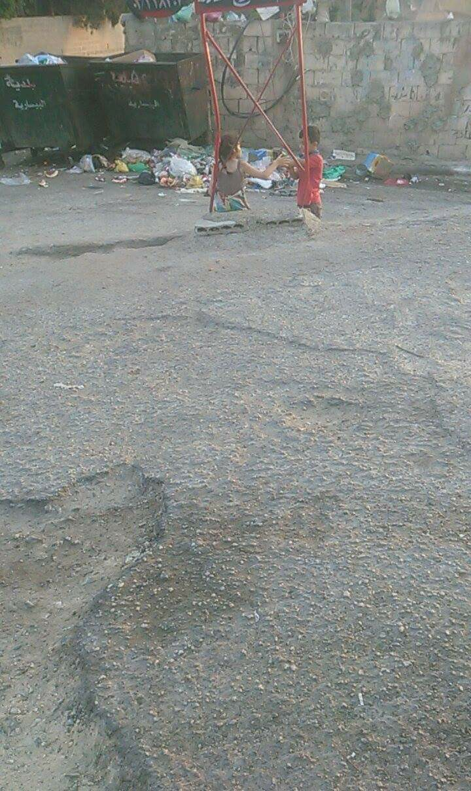
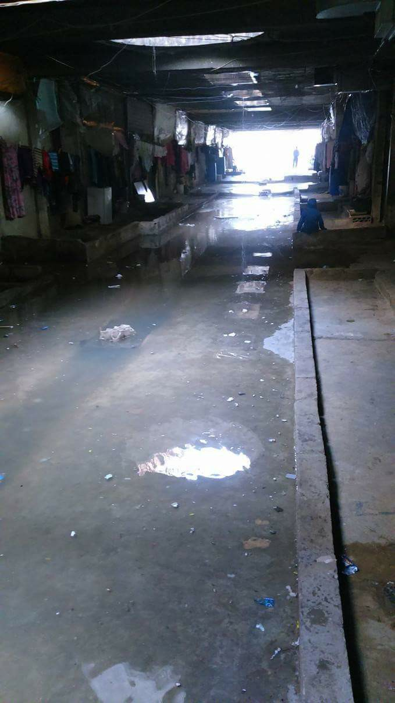

### AYS Daily Digest 08/07/17: _Hearts and minds, lives at stake in the battle for truth_

_Hearts and minds, lives at stake in the battle for truth / Children receiving treatment at new field clinic in Mosul / Urgent call for help in Lebanon / New arrivals and hunger strike update in Greece / Former Italian PM states Italy cannot welcome everyone / Food support in France / The “journey” is ongoing — a call for solidarity at “home\.”_

Photo credit: Arash Hampay
### FEATURE: The hearts and minds we fight for

MSF reports that 40 more drowned in the Mediterranean on Friday, and continues to speak out, despite being a target for all manner of racist and xenophobic abuse that is being directed against refugees\.

■■■■■■■■■■■■■■ 
> **[MSF Sea](https://twitter.com/MSF_Sea) @ Twitter Says:** 

> > You can call them names &amp; tweet horrible xenophobic things about them but the truth remains; the only difference between you &amp; them is luck. https://t.co/iIrzHJ0kol 

> **Tweeted at [2017-07-07 10:00:00](https://twitter.com/msf_sea/status/883264328790675456).** 

■■■■■■■■■■■■■■ 

Members of Italy’s so\-called “identitarian movement” have successfully raised over 70,ooo euro in three weeks in their “protect Europe” campaign which will carry out similar stunts as to the one executed a month or so ago wherein an MSF boat was harassed while leaving port\.

The increase of support for groups like this, who rely primarily on misinformation and anecdotal evidence, is yet another signifier for the ongoing battle for hearts and minds\. One has only to search the hashtag “refugees” to see all manner of propaganda and misinformation that is being spewed and taken as “common knowledge\.” For too long, the domain of speech has been ignored as largely harmless\. “Don’t feed the trolls” has been the mantra of many, yet in spite of our embargo, the trolls have found their feeders, and are devouring\.

Recently, a hashtag in Turkey was trending that was active among people wishing to deport and sent refugees back to “where they came from\.” The narratives are always the same — that refugees are somehow a privileged class who are not “our responsibility\.”

■■■■■■■■■■■■■■ 
> **[Cahîda Dêrsim](https://twitter.com/dersi4m) @ Twitter Says:** 

> > The hashtag #SuriyelilerEvineDönsün is trending in #Turkey and asking the Syrian refugees to leave their country and go back to Syria https://t.co/EufAUYluh6 

> **Tweeted at [2017-07-02 21:57:24](https://twitter.com/dersi4m/status/881632929159323648).** 

■■■■■■■■■■■■■■ 

Anti\-refugee rhetoric is an overlapping point on a Venn diagram of both general xenophobia and Islamophobic rhetoric\. One can see both racist tropes about “savage” and “uncivilized” men along with concern over the rise of “sharia law” in “our courts\.” This nexus of dehumanization and typing of the refugee as not only not human \(and therefore unworthy of humane treatment\) but also inherently dangerous creates a terrifying mix\.

Screenshot from a Twitter user with over 34 thousand followers

Two of “@USA\_Gunslinger”’s followers

We must stay aware and active, being willing to advocate for and on behalf of our friends and neighbors if we are to prevent this kind of dangerous language from spreading\. It is clear we cannot rely on institutions to keep the hatred at bay, so we can only sow seeds of kindness and solidarity amongst ourselves and keep looking to the future\.
### IRAQ

In the aftermath of the liberation of Mosul from the clutches of the so\-called Islamic State, the long\-term impact of occupation and “liberation” are becoming more evident\. Tragically yet to nobody’s surprise, the most harmed are children, and those are who [Michael\-John Von Hörsten](https://www.facebook.com/photo.php?fbid=10155488467225879&set=a.417047350878.206611.720915878&type=3) is seeing in the ADRA field clinic\. He writes:

_“New arrivals from Mosul with severe acute malnutrition\. More babies and small children with acute gastroenteritis with moderate to severe dehydration\. Children with nasty burns from explosions in Mosul this week\.… Temporal wasting, sunken eyes, peaked faces, long bony limbs with oversized hands and feet\.”_

The ongoing impact of this conflict will become ever more apparent in future weeks and months\.
### LEBANON

Urgent call for assistance at a makeshift camp in Lebanon\. Those with experience and connections encouraged to help\. Recently, several volunteer groups were contacted regarding the plight of an unofficial camp of refugees in Lebanon\. According to the post, around 250 families are in the area and are in urgent need of clothing, food, water, and other basic amenities\. Included are some photos of the location\.

The location is what appears to be an abandoned shopping center, due to the roll\-down shades that appear to be being used as “doors\. ”

Anyone with contacts in Lebanon or an idea to help out or support is requested to be in touch regarding this case\.
### GREECE

The Kempsons report a landing that occurred on Lesvos, wherein a smuggler dropped 16 people on an isolated beach on Friday morning\. Philippa reports:

_At dawn this morning 16 people were dropped off on an isolated beach in the north of Lesvos, among them 6 kids, the youngest was just 1 month old\. There were also two old people a man and a woman, there were medical concerns with them and with no doctor available now in the north it was left to the first aid volunteers to asses them\. It was decided that they were ok to move so we began the long walk off the beach\. We made slow progress but everyone made it to the road after about an hour\._

Photo credit: Philippa Kempson

Read more from her original post [here](https://www.facebook.com/photo.php?fbid=10155037534509355&set=pcb.10155037546729355&type=3&theater) \.

The Hunger strike passed its 11th day for those inside Moria, and the 10th day for Arash Hampay’s solidarity strike in Mytilini\. Arash posted an inspiring word in commemoration of his 10th day\.

> I do not want to talk about how I feel physically because there are people reading this who are worried about me\. People like my family, my mother and my sister who are thousands of kilometers away from me\. Instead I will tell you about how I feel\. I feel that the life of a human is the cheapest product for government states, police authorities and the UN\. They have not even asked how we are doing, and of course they have not taken any action to give us our freedom\. 

> Personally, I never expect good treatment, protection and compassion from governments and police authorities\. When I was twelve years old the government and the police authority killed my father and my brother\. They were innocent and had not committed any crime\. They have forced me to face thousands of disasters\. The people have increasingly lost confidence in their governments, the police authorities and the UN because they realise that these institutions do not have any regard for the value of human life\. 

Photo Credit: Arash Hampay

He also posted a scathing call to action the day prior: 
_The tenth day has passed for the hunger strikers inside Moria and the ninth day has passed for my hunger strike in the middle of town before the people of Mytilini\. Still, there has not been any response from UNHCR and others\. It seems like human lives do not matter to them\. Perhaps it is because we are refugees and they don’t value our lives\. There is still strength in us and we are still alive\. We shall continue our hunger strike until the prisoners in Moria are released, regardless of the consequences for us\._ 

_A life without freedom is worthless and meaningless for us\. You must release the refugees or we shall end our lives in front of your eyes and the people’s eyes\. This is not a threat but something that all of us have agreed upon\. You must free us or else be responsible for our deaths\. Release the refugees\. Otherwise, you will have more deaths on your conscience\. You have the deaths of the woman and her baby daughter on your conscience; who burned to death in front my eyes inside Moria\. The deaths of the people who died inside their tents due to the winter cold are also on your concierge\. They died and you did not react and you did nothing to save them\. You did not even seek forgiveness or apologise for what you did to them\._ 

_Dear Police, respectable judge, the leaders of UNHCR, do not surrender to ignorance and indifference by pretending that you do not see or hear what is happening\. Come and show us that you care about our lives\. Show us that you have a conscience\. Come and see the youth who you have imprisoned for seeking refuge in your country\. Do not wait for them to die due to your ignorance\. We are waiting for you\. The people are waiting for you\. We will keep waiting until the last drop of life falls from our bodies\._

Hampay is a long\-time political activist who left Iran after political persecution for criticism of the Iranian government\.
### ITALY

The former Prime Minister of Italy, Matteo Renzi, has advocated that Italy only take in a “fixed” number of refugees\. In the 2017 “phase” of the ongoing refugee crisis, Italy has shifted to become the more prominent “hot spot” with around 85% of new arrivals to Europe arriving in Italy\. As previously reported in AYS, this increase of people in Italy has highlighted the true boundaries of solidarity as Austria has mobilized 750 troops and has even put tanks at the the Austrian\-Italian border in order to prevent onward movement\.

Although the former PM’s remarks are the expected “limited sympathy” one has come to expect from politicians regarding the crisis, he also had stern words directed at the EU\.

_“These countries that take Italy’s money but build walls, if we become tougher and more determined in the discussions for the \(EU\) 2020–2026 budget in the coming months, they will suffer the consequences\.”_

Perhaps this upcoming budget meeting will be able to accelerate negotiations and compliance with the EU relocation scheme, helping members who continue to drag their feet in accepting refugees\. Read more, [here](https://www.thelocal.it/20170707/ex-pm-matteo-renzi-says-italy-should-only-take-in-a-fixed-number-of-migrants) \.

Citizens of Palermo awoke to parts of the city being papered with signs and banners protesting the upcoming opening of a hotspot in the city\. The activists were not upset about the idea of more refugees in the area, but rather were protesting the state\-controlled aspect of the hotspot system\. The activists said that the underprivileged in the city do not need hotspots, but rather homes and work\. Read more \(in Italian\) [here](http://palermo.gds.it/2017/07/08/a-palermo-striscioni-dei-centri-sociali-contro-gli-hotspot-per-migranti_693209/) \.

BAOBAB experience continues food distribution and recently published \(in Italian\) some best practice in terms of food distribution\.

Included are some good reminders such as ample preparation ahead of time \(forming the line at the last possible moment so as to prevent frustration\), only giving plates to people in the line so as to prevent confusion, and ensuring that as much equality as possible so frustration is at a minimum\.

](assets/2ef11a9552b7/1*RDdpLLxogdxV81XfrEIbJg.jpeg)

Photo credit: [**PASTI Baobab Experience**](https://www.facebook.com/PASTI-Baobab-Experience-1295938570502827/)
### FRANCE

### BELGIUM

Abdulazez Dukhan, who made headlines around the world through his viral open letter to president Trump and is the brains behind the Through Refugee Eyes project, is speaking out again about the damaging effect of the current asylum procedure in Belgium\. Dukhan takes time to remind us that just because someone has reached the “finish line” of being located in Europe, their journey has just begun, and it can often be a long period of agonizing waiting and boredom\.

He writes:
_Since 2 months I live in a camp in Belgium, situation is better than what I have seen in Greece but people wait longer time\._

_80% of the refugees are here for more than 1 year without papers\. Most of the people are from Afghanistan and \[Africa\] then Iraq and \[Palestine\] \. People wake up everyday to find themselves here in the same place\. They wait just a post to know if they are accepted or rejected\._

_One of my friends lives here for 1 year and 7 months and he is just waiting an answer, he told me when he arrived here he had many dreams, studying, working and projects to do\. but day by day he was losing that, everyday he lost part until he is now with no more dreams except having papers\._

_Did you hear that before from media ?_

Dukhan hits on an ever\-more\-crucial topic which is the desperate and ongoing need for volunteers to be involved at EVERY stage in the journey\. It is comparatively easy to be moved to action by the startling pictures on screen, to go and work in overtly stressful locations\. Perhaps it is just as hard, if not harder to continue to have the momentum and love when we are back home, seeing the true effects of long\-term trauma spool out of our new friends\. Volunteering in making people feel at home, keeping their spirits up, hearing their frustrations, advocating when their voices are erased, boosting them where their voices can be heard is a crucial component to making people feel at home\. “Refugees Welcome” is not a one\-time thing\.

> **_We strive to echo correct news from the ground, through collaboration and fairness, so let us know if something you read here is not right\._** 

> **_Anything you want to share — contact us on Facebook or writeto:areyousyrious@gmail\.com_** 

_Converted [Medium Post](https://areyousyrious.medium.com/ays-daily-digest-8-7-2017-2ef11a9552b7) by [ZMediumToMarkdown](https://github.com/ZhgChgLi/ZMediumToMarkdown)._
