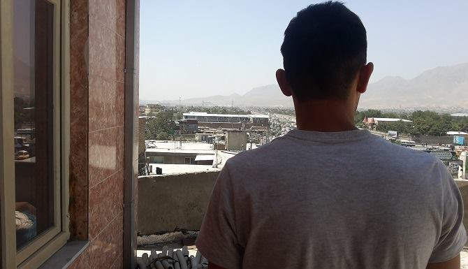
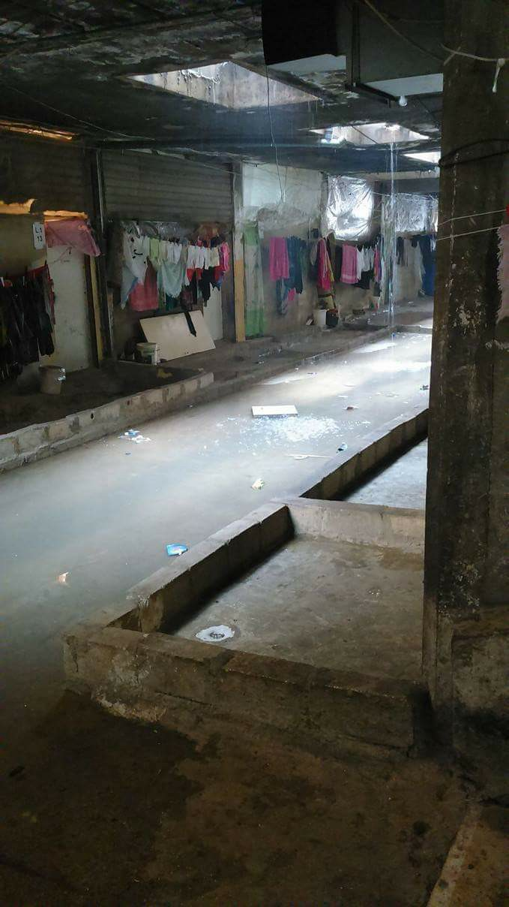

### AYS Daily Digest 09/07/17: Afghan refugee deported from Austria, will not receive financial support

_What will become of the refugees from Mosul? / An urgent call for help from a makeshift camp in Lebanon / Sea rescue operation working in Greece reports harassment, impossible demands from authorities / Another refugee was beaten senseless by Croatian police / Porte de la Chapelle refugees relocated, newcomers take their place / Gay Ukrainian refugee on hunger strike goes silent / New report on hotspots in Greece and Italy / And more news…_

Ahmad Shamsi’s future remains unclear\.
### FEATURE

Ahmad Shamsi is an Afghan man who found himself deported from Austria on July 5\. Ahmad’s story is unfortunately all too common — refugees from Afghanistan find themselves in a particularly precarious position in the EU\. After making the long journey spanning thousands of kilometers, hoping to escape the bloodshed and the trauma of living in a country that has been embroiled in a non\-stop state of war for nearly four decades, they find that they are looked upon with great suspicion\. Afghanistan continues to be classified as a “safe country” by the EU, meaning that authorities are comfortable rejecting the second largest refugee group in Europe with impunity\. Following May’s deadly Kabul attack which left over 150 dead and several hundred more casualties, countries such as Germany, faced with a blow to their narrative of the safe country, temporarily paused deportations, while reaffirming its commitment to the policy as a whole\.

What’s worse, upon arriving to Kabul, Mr\. Shamsi learned that the IOM, the organ responsible for helping deportees, had not received the pertinent information about his arrival and he, therefore, had nowhere else to go\. Mr\. Shamsi was on the streets [until he contacted the Afghanistan Migrants Advice & Support Org](https://www.facebook.com/195295217167437/photos/a.625584567471831.1073741827.195295217167437/1596257260404552/?type=3) , and is currently residing in the group’s safehouse\. It is unclear how long he will have to endure such conditions\. For other refugees like Mr\. Shamsi who are deported from Austria, such an outcome is a norm\. The IOM simply does not involve itself in the cases of those deported from Austria\.

Mr\. Shamsi’s story exposes the entire edifice of hypocrisy and bad planning found in the European expulsion of refugees\. Not only are people forced to return to a wartorn country with little to no prospects for their future, the refugees also have to put up with institutional unwillingness to provide them with the bare minimum of help\. It is shameful that Ahmad Shamsi has to survive at the whim of a private organization, the fact that he has to endure this treatment because he was deported from the wrong country speaks to the intentional negligence of the system\. But Europe does not care for his ilk, and so even if his case is resolved as a result of having been brought into the spotlight, there is little reason to believe that such incidents will vanish\.
### IRAQ
#### As Mosul is liberated from ISIS’ grip, refugees’ future is uncertain

Mosul has officially been liberated\. The ISIS presence has been purged from the city, and the Iraqi prime minister has set foot into the city to signal to the world that Iraq is ready to return to normalcy\. But over this joyful occasion hangs an uncomfortable question, namely, what is to happen to the refugees from the region? According to the IOM, a total of 821,838 people were displaced over the course of the 9 month long battle to retake the city\. Presumably, these people would like to return home, but where exactly are their homes? For many, what had once been their home is now reduced to rubble, as the battle for Mosul took a very heavy toll on the city’s infrastructure\. Only time will tell what lies in store for the locals, but one thing is certain: rebuilding efforts will span for many years to come\.
### LEBANON
#### Urgent call for assistance at a makeshift camp in Lebanon\!

Those with experience and connections encouraged to help\. Recently, several volunteer groups were contacted regarding the plight of an unofficial camp of refugees in Lebanon\. According to the post, around 250 families are in the area and are in urgent need of clothing, food, water, and other basic amenities\. Included are some photos of the location\.

The location is what appears to be an abandoned shopping center, due to the roll\-down shades that appear to be being used as “doors\. ”

Anyone with contacts in Lebanon or an idea to help out or support is requested to be in touch regarding this case\.
### GREECE
#### Hunger strike on Lesvos continues

The hunger strike in Moria camp on Lesvos continues today for the 11th day\. Arash Hampay as always has posted an update on the situation\.

Hampay reports extensive harassment from the vice mayor of Mytilini while him and his contingent staged a demonstration\. Hampay also reports that at the insistence of his friends, he went to a hospital to make sure that his vitals are functioning properly after nearly two weeks without food\. Thankfully, he is safe and there does not appear to be an immediate danger to his health\.
#### “Refugee Rescue” releases press release accusing Greek authorities, Frontex, of harassment

[In a press release published yesterday](http://www.refugeerescue.co.uk/latest-news/2017/7/8/press-release-a-dangerous-turn-in-rhetoric-against-ngos-may-cost-lives) , Refugee Rescue, an organization performing sea rescue operations, accused Greek authorities and Frontex of stifling their work, a practice which threatens the lives of refugees stranded at sea\. The organization is fined for sending their boat to perform a rescue operation, because they are somehow expected to release a report 24 hours ahead of time making their intentions clear\. Given that the very nature of search and rescue operations is very unpredictable, and a help call may come in at any minute, this amounts in all intents and purposes on a prohibition to perform the operations\. The report goes as far as to allege that members of the organization have at one point been threatened with a firearm\.
#### Smuggling operations increasingly turn to teenagers as drivers

[Ekathemerini reported today](http://www.ekathimerini.com/219922/article/ekathimerini/news/undocumented-migrant-smugglers-using-teens-as-drivers) that smuggling operations bringing refugees from Turkey to Greece are increasingly relying on minors to perform the deed\. Over the last two months, there have been at least four arrests of minor drivers bringing refugees to Greece\. According to police sources, this practice increases the risks associated with smuggling, as younger people are more likely to be inexperienced drivers\.
### CROATIA
#### Police senselessly beat refugee, push him back to Serbia

[Team Rigardu](https://www.facebook.com/rigardu/) sent us another report about police violence at the border between Croatia and Serbia\.

An Algerian man was caught by police near the Croatian town Vukovar\. He was found by two Croatian policemen who put him in their car and drove him to the Serbian border, 3 km away from the Sid train station\. There, the police officers forced him out of the car, asked him where he came from, and then they proceeded to beat him up with their feet and nightsticks\. The victim was laying on the ground the entire time\. The victim has extensive bruising on his back as well as marks from the nightsticks\. His knee was also badly injured, and is now suffering from contusions in his kneecap\. There is significant damage, it seems very likely that there was extensive nerve damage, or, in the worst case scenario, an amputation may be necessary\.

Unfortunately, this is far from an isolated incident\. There have been many reported cases of Croatian police using excessive force against defenseless victims\. This is part of a much larger trend of police brutality against refugees in the Balkans, most famously deployed in Hungary but also prevalent in other places\.
### NETHERLANDS
#### Gay asylum seeker on hunger strike goes silent

LGBT Asylum Support has voiced concerns about the health of a gay asylum seeker from Ukraine who has been in hunger strike for seven days now, after not having had contact with him since Friday\. The asylum seeker, Ilya Kordi, is detained in the Immigration Detention Center in Soesterberg and is only allowed contact his lawyer and LGBT Asylum Support for five minutes per day\.

Ilya failed to make his daily call yesterday, and his lawyer worriedly contacted LGBT Asylum Support, who also had not heard from him\. The detention center was unwilling to provide the lawyer with any information about the hunger striker\.
### BELGIUM
#### Belgian Kitchen in need of volunteers\!

Belgian Kitchen is an organization which regularly feeds over 400 refugees living on the streets of Brussels\. However, their team is currently stretched very thin, and they would greatly appreciate help from anybody who is available\. If you are able to work with the organization for at least five days, please email clare@care4calais\.org for further information\.

### FRANCE
#### Refugees at Porte de la Chapelle in Paris relocated, people once again gather anew

Since Friday, refugees currently living on the streets of Porte de la Chapelle are being relocated to French reception centers\. While many French reception centers responsible for housing refugees from Calais have had a very bad track record and many complaints were made, one can only hope that this latest batch of refugees will find that the conditions have been improved\.

Nearly 2,800 have been relocated, but according to some sources, a makeshift camp is once again beginning to be built in the area\. Volunteers on the ground report that it is mainly newcomers who are setting up camp in Porte de la Chapelle, in addition to some people who fled shelters which they found to be overcrowded\. This phenomenon speaks to the state of unpreparedness that French authorities continue to face, even after so many years of the continuing refugee crisis\.
### SEA
#### Sea\-Watch opens fundraiser to repair ship

■■■■■■■■■■■■■■ 
> **[Sea-Watch](https://twitter.com/seawatchcrew) @ Twitter Says:** 

> > @[openarms_fund](https://twitter.com/openarms_fund) towing the Sea-Watch2 after technical problems: thanks to  our friends! Donate to get our ship fixed: [sea-watch.org/spenden/](https://sea-watch.org/spenden/) https://t.co/OCnhna2tzZ 

> **Tweeted at [2017-07-08 13:36:47](https://twitter.com/seawatchcrew/status/883681271867740160).** 

■■■■■■■■■■■■■■ 

### GENERAL
#### Report provides an update on the situation in hotspots in Greece and Italy

Updated reports on the situation in [Italy](http://www.asylumineurope.org/sites/default/files/update_report_cir.pdf) and [Greece](http://www.asylumineurope.org/sites/default/files/update_report_gcr.pdf) have been released by The Dutch Council for Refugees in partnership with ECRE, the Italian Council for Refugees \(CIR\), the Greek Council for Refugees \(GCR\) and Pro Asyl\. 181\.000 people including a large number of unaccompanied children have been moved to hotspots in Sicily and the overall number of people moved to hotspots have increased by 33% between January and April 2017, including a significant number of unaccompanied minors\. A New law aiming at improving conditions of unaccompanied minors; including a ban on border rejections and returns, establishing a list of legal guardians and extending health care was approved in March 2017\.

In Greece, arrivals remain comparatively low at 4900 people by April 2017\. The assessment of vulnerabilities remains inadequate, reception conditions are still far below acceptable standards, serious concerns remain on the provision for winter care, and the use of administrative detention has increased\. According to the Joint Action Plan on the on the implementation of the EU\-Turkey Statement, detention capacity on the islands is set to be increased\. To this end a pre\-removal detention facility was established on the island of Kos in February 2017\.

To summarize the overall findings, Lenny Reesink had the following to say:

> “Despite the larger influx of people and remaining issues of concern in Italy, the hotspots are to some extend functioning as they were originally meant to — as identification and temporary hosting facilities\. In Greece however, people are stranded in highly problematic conditions and with no real perspective\. The hotspot approach seems to become a model for handling refugees in Europe and it is extremely important to monitor developments closely to address problems and protect the rights of refugees\.” 

> **We strive to echo correct news from the ground, so let us know if something you read here is not right\.** 

> **If there is anything you want to share, contact us on Facebook or write to: areyousyrious@gmail\.com\.** 

_Converted [Medium Post](https://areyousyrious.medium.com/ays-daily-digest-9-7-17-afghan-refugee-deported-from-austria-will-not-receive-financial-support-20b7db70b659) by [ZMediumToMarkdown](https://github.com/ZhgChgLi/ZMediumToMarkdown)._
