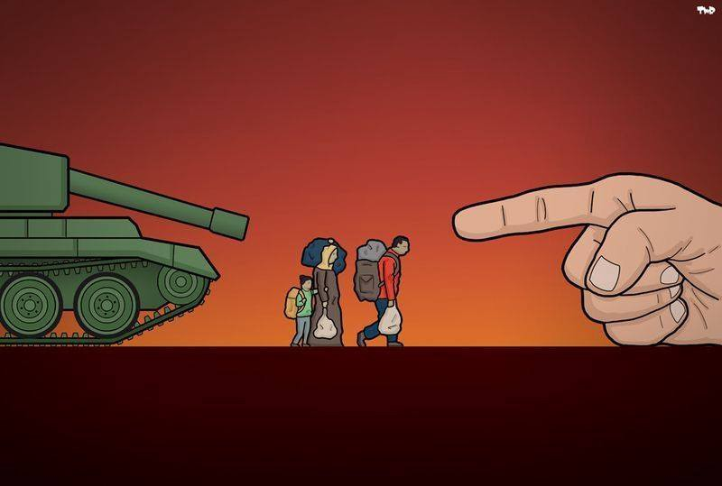
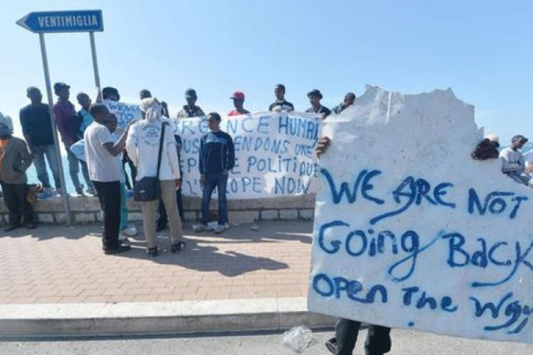
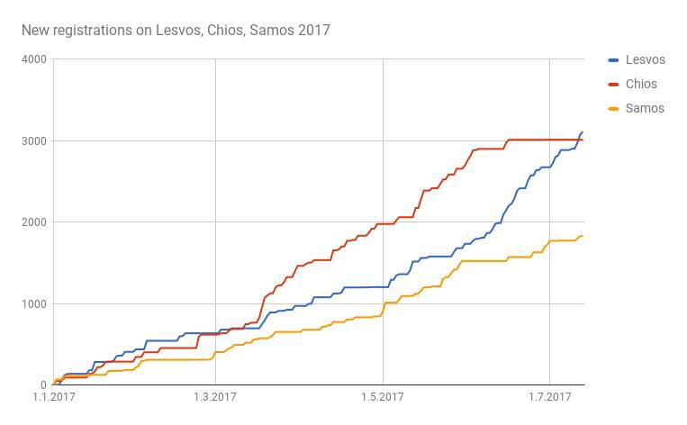
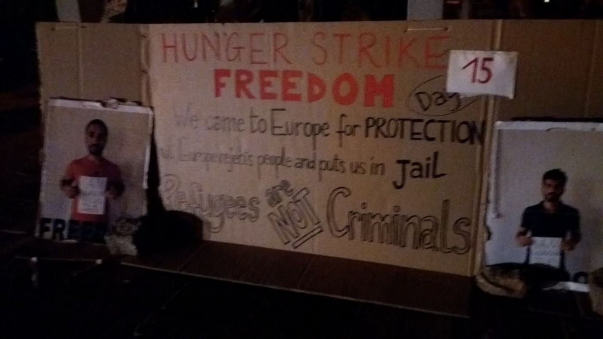
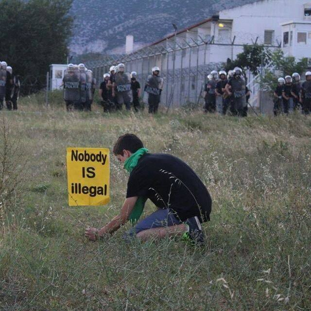
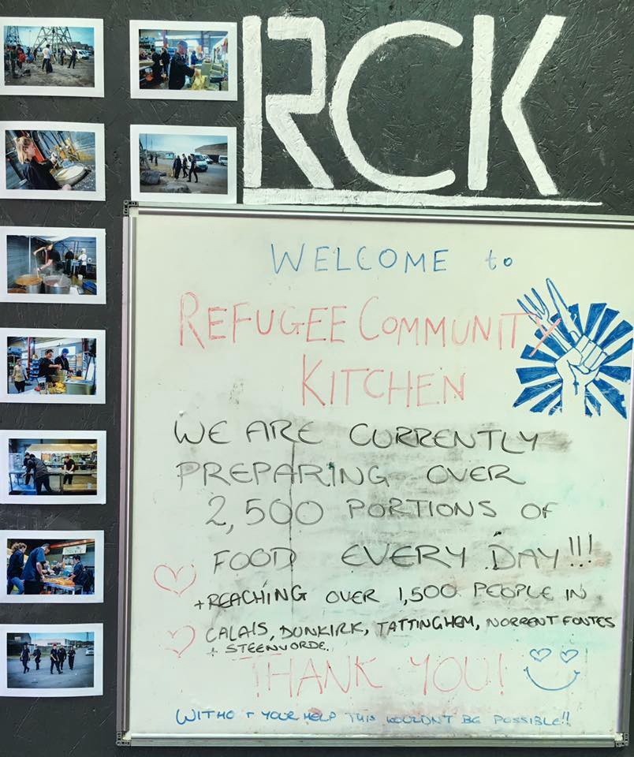

### AYS Daily Digest 13/07/17: Italian government proposal could put thousands of lives at risk

_Appeals for help from Italy / Hunger strike on Lesbos reaches 16th day / More people detained and deported from Greece / Letter from Derveni camp’s Eritrean community / 50 people run away from two asylum centres in Croatia / Borrowing ideas from the US: filing a lawsuit against the government for violating the right to seek asylum / And more news…_

\(Photo by Theerd Royaards\)
### FEATURE: Shocking stories emerge from Italy

The situation in Italy is not getting any better, with disturbing reports coming in from all over the country\.

A group of medical doctors, supported by Associazione Ambulatorio Città Aperta in Geno, visited the Ventimiglia area on July 9th with the intention to assess the situation and distribute some medicine to the people on Roya’s shores\. What they found there was shocking in many ways: people living under a bridge, among cardboards and blankets, with many suffering from respiratory diseases, skin diseases, and open wounds—some left after torture they survived in Libya\.

[In their report,](http://effimera.org/le-torture-affiorate-report.../) doctors are saying that it was not possible to count the number of people in the area since they live scattered and hidden in small groups\. They wash in the river and now have a small source of drinkable water, previously denied to them\.

Aware of the situation, Prime Minister Paolo Gentiloni criticized other EU countries for leaving Italy to grapple with the huge number of people who are arriving on the EU’s borders every day\. Over only the last couple of days, more than 3,500 people arrived, while since the beginning of this year authorities have registered over 85,000 arrivals\.

On top of the prime minister, different activist and volunteers groups are also calling for help and trying to draw attention to the desperate living conditions across the country\. Small groups of volunteers as well as different NGOs are doing their best to help\. Many of them are working on the sea, saving lives every day\.

But instead of working with these volunteer initiatives and NGOs, or at least trying to respect their dedication, the Italian government has recently come up with a very strict code of conduct which they demand NGO boat rescues sign at the risk of being prevented from continuing their work\.

NGOs are warning that the code could put thousands of lives at risk while the Italian government persists in their belief that these restrictive measures will help decrease the number of crossings and new arrivals\.

The code’s rules are laid out in 11 points, including the obligation to let police on board ships and to declare sources of funding\.

Amnesty International and Human Rights Watch \(HRW\) criticized the code saying, in a joint statement, that any code of conduct, _“_ if necessary, should have the goal of making rescue operations at sea more effective at saving lives\.”

It is expected that over the next few days the code will be presented to nine NGOs that regularly deploy rescue boats, who will then be asked to sign it\. These boats are responsible for rescuing over a third of all people brought ashore this year\. Yet, the Italian government is trying to convince the public that NGOs’ presence along the border of Libyan territorial waters encourages migrants and smugglers to risk lives and launch more boats—an absurd claim\.
### GREECE
#### Arrivals and latest news

Last night, a boat with five people arrived at Chios port\. All of those on board were men from Afghanistan: two minors and three adults\. According to volunteers who helped them, they came from Turkey in a small rubber boat in which they paddled to Greek water for 5 hours until a Frontex boat picked them up\.

It was the first landing on Chios in one month\.

In total, 52 people arrived on different Greek islands on Wednesday night and during the day on Thursday, including 38 new arrivals on Lesvos\.

AYS

Iranian human rights activist [Arash Hampay](https://www.facebook.com/arashampay/posts/494451544234270) and four people in detention, including Hampay’s brother, continued their hunger strike for the 16th day in a row\. They are demanding the release of all the people detained in Moria camp as well as protesting against deportations in general\. So far, local authorities and the UNHCR have yet to indicate they even notice the protest\.

The Moria hunger strike\.

> “Fifteen days\. I repeat, it has been fifteen days since I began my hunger strike\. A strike carried out in front of the eyes of the police, the state, and the UNHCR\. Yet there has not been a single reaction to this day\. They are probably waiting for one of the captives on hunger strike to die\. It is only when this happens that they will think it necessary to respond\. A response that will be purely for the sake of sustaining positive public opinion\. 

> We are four very determined people\. We are going to continue our hunger strike until the three innocent people on hunger strike in prison are granted freedom\.” 

Today, 14 people from Algeria were deported as well as eight from Pakistan, two from Iraq, one from Zimbabwe, one from Morocco and one from Nigeria\.

Many people are being deported to Turkey, where human rights are almost non\-existent\. The government today proposed a new law which would ban the use of the words or terms ‘Kurdistan,” ‘Kurdish city/cities,” and “Armenian Genocide” in parliament\. If the terms are used, parliamentarians could be fined 12,000 Turkish Liras \(3000 Euros\) and be banned from participating in three sessions at the Grand Assembly\. The new law is expected to be passed\.

[Legal Center Lesbos](http://www.legalcentrelesbos.org/2017/07/13/july-report-on-rights-violations-and-resistance-in-lesvos/) issued a new report stating that the government continues “to indiscriminately detain all asylum seekers after their cases have been rejected on appeal,” against the existing law in Greece, the EU, and the realm of international law\.

The report warns that as of the last week of June, Metadrasi, a group that had been providing this mandatory free legal assistance on appeal, has stopped accepting new cases since their contract ended and no other legal aid provider has been contracted\. “This process violates asylum seekers’ right to due process and could lead to the rejection and deportation of asylum seekers who will face persecution in their home countries or Turkey,” the reports states\.

The same source brings our attention to the increasing incidence of hate crimes and broader discrimination\.

> “In the past week, the Legal Centre has been informed of at least three attacks by Greek nationals and the Greek police against refugees\.” 

Additionally, [Asylum Links](http://asylumlinks.eu/refugees-with-disabilities-not-taken-into-consideration-in-camps/) points out that refugees with disabilities are often forgotten\.

> “Although a lot of camps have toilets and showers, they often don’t have ramps and are inadequate for wheelchairs\. Rocky terrain and long distance prevent many people with disabilities from reaching them\.” 

Lack of respect for basic human rights is also a problem on the mainland\. We received a letter from a group of people from Eritrea who are living in Derveni camp, close to Thessaloniki\. They are quite upset about the conditions they are living in and how the Greek state provides basically nothing to support their integration\. We bring you the full letter below:

> “We are recognized as Greece Refugees since four months ago, but still we are living in harsh situations\. So we are asking to the UNHCR for bringing realistic solutions\. Here you have the list of our complaints: 

> What is our future? Until now we are blurred, fainted, blocked and psychologically disaster\. 

> We are living in a very hot and inconvenient accommodation\. As a result of this, our life is in danger\. So we need an immediate solution\. 

> Even tough we are recognized as Greece refugees, we do not have enough pocket money like the other refugees living in Europe\. 

> There is no any possibility of getting jobs\. So what can we do? 

> Why recognized and non\-recognized people are living here together? So what is the difference before and after recognition as Greece citizens? 

> How is family reunification possible here while we are not settled? 

> Both Greece and Italy are nominated to block/keep refugees by the European Union, but Eritrea is nominated and recognized by the European Union\. Based on this fact, Eritrean refugees in Italy have the opportunity of relocation to different European member states to be supported, but though we Eritreans have the same political issues, are neglected and violated our rights of relocation and other basic things, in Greece\. 

> We have vulnerable people who are sent here for better conditions, yet they are exposed to further health problems\. 

> We are not secured here because we are living among people who are notorious, pessimistic, dangerous and the like 

> Eventually, we are looking for immediate and practical actions/solutions\. 

> Yours, sincerely 

> Eritrean Community in Derveni Alexis Camp\.” 

[EASO issued a new list](https://www.easo.europa.eu/questions-and-answers-relocation.) with eligible nationalities for EU relocation, as of the July 1st, 2017: Eritrea, Bahamas, Bahrain, Bhutan , Qatar, Syria, United Arab Emirates, and Yemen\.

The list of eligible nationalities is updated every quarter\.
#### The Mobile Info Team

> “As part of our campaign to help refugees reunite with their families in Germany, the Mobile Info Team has been collecting letters from people affected by the flight restrictions and sending them to the German Interior Ministry\. Last week, [the German government replied with a letter](http://bit.ly/2sTKusB) that comes as a slap in the face for all the affected families in Greece and Germany\. 

> It claims that the government “takes into account the particular circumstances” of both the people stuck in limbo in Greece and their family members in Germany\. 

> In reality, the German government is completely failing to take the circumstances of the affected families into account or to act with empathy\. The situation has not changed in Greece\. People continue to wait and if the situation continues some families could be kept apart unlawfully for up to three more years\. The frustration and suffering of the affected refugees are being ignored and their rights under EU law are being denied\. We must continue to fight against these illegal and inhumane restrictions\.” 

So far, over 25,000 signed the Mobile Info Team’s petition\.

Please sign—together we can make a change\.

Read [what else you can do](https://www.change.org/p/family-reunification-from-greece-let-them-be-together-again/u/20809024?utm_medium=email&utm_source=101716&utm_campaign=petition_update&sfmc_tk=3OK45C5M4t3f59B1ERyFokh5VC9BhAY9TmHCH3WNwWiD79SuRpSNGLmWWA%2B9c3sj&j=101716&sfmc_sub=453644232&l=32_HTML&u=20378308&mid=7259882&jb=2) \.
#### Lack of water at Samos and Vial camps

Talking about degrading conditions in Greece for refugees and migrants, we received a report from Samos camp in which people were said to receive only 1\.5 litres of water per day per person, while in Vial it is even less — 3 litres per day for a family of four\.
#### Conditions on the islands

Local authorities on the islands, or at least on Lesbos, admit that the current situation is unbearable\.

This Wednesday, Lesbos Mayor Spyros Galinos sent a letter to several ministers as well as Prime Minister Alexis Tsipras, calling for immediate action to ease the pressure on local communities\. Galinos demands that the thousands of people who are stranded on the islands be transferred from camps on Lesbos to the mainland\. He also underlined the need to speed up the processing of asylum claims, something volunteers and asylum seekers have been asking for months to no avail\.
#### InterVolve seeking long\-term English teacher

[InterVolve team](https://www.facebook.com/permalink.php?story_fbid=483396311998762&id=219418945063168) is looking for a qualified and experienced long\-term English teacher to lead daily adult education classes and join in with camp and urban activities outside of class time in Softex camp, near Thessaloniki\.

If you are interested in volunteering in this role, could commit two months or more, and could start before the end of July, please email Tracey at [info@intervolvegr\.com](mailto:info@intervolvegr.com) ASAP\.
#### Information on family reunification

We have received important information from RefuComm on family reunification\.

There are two main procedures for family reunification and they should not be mixed up\! For more information, [see RefuComm’s page](https://www.facebook.com/notes/refucomm/important-reminder-there-are-two-different-family-reunification-processes/463365500681924/?hc_location=ufi) \.
### CROATIA

Over the last week, at least 50 people—including very small children—ran away from the reception centre Porin, Zagreb, as well as the centre in Kutina\. The move was largely driven by recent unlawful, negative decisions by the Ministry of Interior and Security Intelligence Agency\. The ministry claims that these asylum seekers represent a security threat, yet they fail to provide an argument for their assertions\.

“Nobody is illegal\.”
### FRANCE

There is a possibility that the government will cut processing time for asylum requests and boost housing for refugees\. At the same time, the government will increase deportations of people they consider illegal economic migrants—at least that is what Prime Minister Edouard Philippe told the media\.

France received 85,000 asylum requests last year, but the government is often criticized for failing to provide adequate facilities for refugees\. According to some activist groups, 40 percent of asylum seekers and refugees do not have access to housing\.

Meanwhile, [Refugee Community Kitchen](https://www.facebook.com/groups/RefugeeCommunityKitchen/permalink/1476852609048904/) in Calais needs help to feed all the people who are living there\.

Welcome to Refugee Community Kitchen\!
### The United States

Finally, an interesting idea from the United States\! A group of legal organizations including the American Immigration Council, the Center for Constitutional Rights, Latham & Watkins, LLP \(on behalf of the Los Angeles and Tijuana\-based organization Al Otro Lado\), and six individual asylum\-seekers have filed a lawsuit that charges the government of violating the right of individuals to seek asylum\.

Those pursuing the lawsuit want to remind their government—as well as others around the world—that the right to seek asylum is guaranteed under not only local law but also international law\.

“We can and must do better,” the groups remind us all\.

> **We strive to echo correct news from the ground through collaboration and fairness, so let us know if something you read here is not right\.** 

> **If there is anything you want to share, contact us on Facebook or write to: areyousyrious@gmail\.com** 

_Converted [Medium Post](https://areyousyrious.medium.com/ays-daily-digest-13-07-2017-italian-government-proposal-that-could-put-thousands-of-lives-at-risk-379a0b5a132e) by [ZMediumToMarkdown](https://github.com/ZhgChgLi/ZMediumToMarkdown)._
