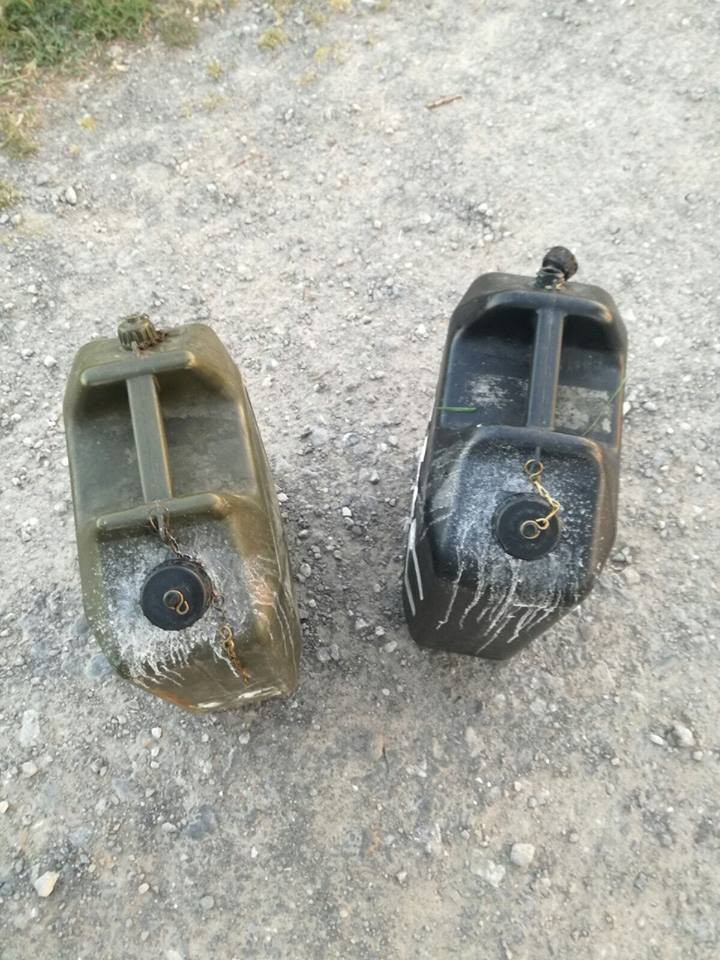
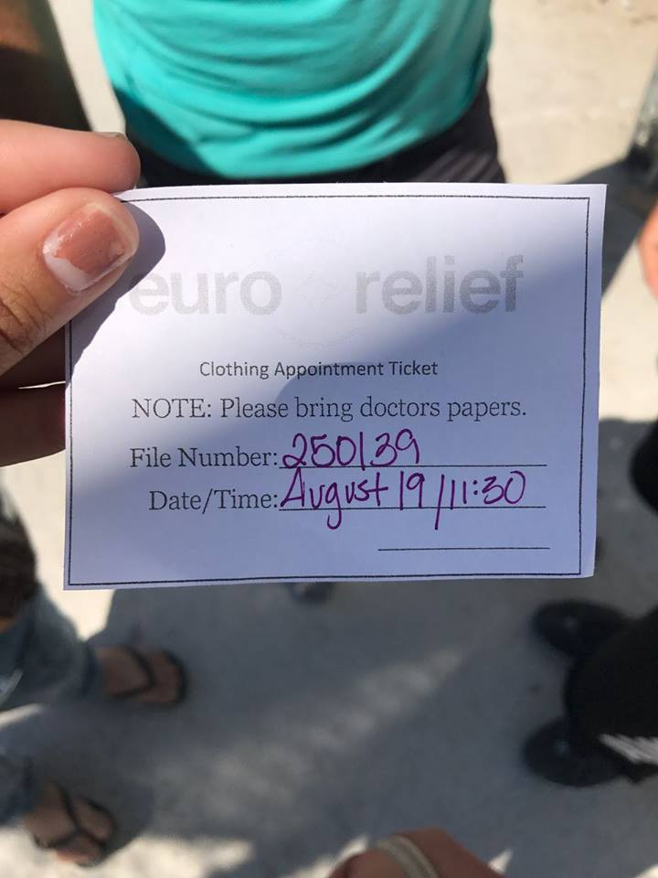

### AYS Daily Digest 12/07/17: CRS seeks to drive refugees away from Calais by contaminating drinking water

_Long wait times continue / Concerns as administration of island hotspots set to move to Greek jurisdiction / Overcrowding and tensions continue at island hotspots / Gay Jamaican asylum\-seeker victim of Surinamese, Dutch police brutality / Refugee struck by a truck in Italy / Traffickers caught transporting 25 children over border in Afghanistan / And more news…_

Contaminated water canisters\. \(Photo by L’Auberge des migrants\)
### FEATURE: CRS allegedly contaminating drinking water in Calais

Multiple volunteers on the ground are corroborating claims that the CRS, the French riot police who are also often deployed against refugees seeking protection in France, has been contaminating water distributed by volunteers with pepper spray\. The French minister of the interior has called for a, “battle against all points of concentration,” of refugees, namely in Calais\. The CRS has taken the command quite literally by poisoning the water cans meant for distribution among refugees with tear gas\. One volunteer heard a CRS officer remark that he was making “sparkling water”\.

For those following the situation in France, the fact that the CRS is engaged in immoral activity against refugees should come at no surprise\. Harassment is unceasing, and yet, this newest revelation does an outstanding job of sinking the organization’s reputation even lower\. Refugee Community Kitchen volunteers report multiple incidents which shakes off the benefit of the doubt that perhaps this is an isolated incident\. And yet, multiple reports suggest that such conduct is a regular part of CRS operations in Calais\. One volunteer reports that CRS deployed tear gas ruined a batch of food and water approximately a month ago\. Another reports that from time to time tear gas canisters are launched towards the direction of tents, which would also inevitably contaminate nearby water\.

Volunteers from other organizations report similar incidents\. One member of Utopia 56 named Charlotte [personally witnessed](http://www.liberation.fr/amphtml/france/2017/07/11/a-calais-quand-ils-ont-compris-que-l-eau-n-etait-pas-buvable-ils-l-ont-jetee_1583179) the effects of CRS policy\. She reports that two refugees had brought to her an empty can of water, which she filled up\. One of them took a sip of the water, became irritated, and threw the water out\. Charlotte says that she had heard of three such incidents in the space of two weeks, and that refugees had once seen a police officer tampering with the water\. Another Utopia 56 volunteer named Lucie confirmed that she also heard of three or four such cases\. While there is no evidence that the state has ordered this course of action, but such a widespread adoption of this tactic suggests that at the very least, the state turns a blind eye to CRS’s methods of operation\.
### TURKEY
#### United Aid Network raising money to build water filtration systems in refugee camps

According to Shah Lalon Amin, UAN has so far built 8 water filtration systems in a camp in Adana\. The camp’s residents were previously forced to drink polluted river water\. They are hoping to continue their project, to expand access to potable water for some of the the most vulnerable people in Turkish society\. If you are able to do so, you may contribute to the project by donating money to their [crowdfunding initiative](http://www.crowdfunder.co.uk/uan-refugee-support-mission?utm_source=crowdfunder&utm_medium=dashboardfacebookblock&utm_content=shareonfacebook&utm_campaign=marketing) \.

### GREECE
#### Refugees arriving on south Lesbos facelong times to receive clothing

When refugees arrive from Turkey, it is needless to say that they have little more than the clothes on their backs\. A change of clothes is a basic need for the preservation of human dignity\.

But people on the ground say that even as there is no shortage of donated clothing in warehouses, the refugees who arrive in the south must wait for weeks to receive a clothing appointment\. This problem could have been easily resolved had it not been for restrictions which prevent NGOs from swiftly interacting with the newcomers\. One woman who arrived without shoes on Monday was told that she might receive a pair on Saturday, but even then no guarantees were made\. It must be made abundantly clear that this is not an issue of low supply, but rather, of poor logistics planning and bureaucratic paper pushing\.

#### NGOs raise concerns about transfer of responsibility for services to the Greek government

The European Parliament is set to discuss the transfer of responsibility for services to the Greek government today\. The transfer is set to take place on August 1\. As things currently stand however, there is much concern about the apparent lack of a concrete plan for the move\. NGOs are afraid that refugees currently on the islands may experience a deterioration in the services that they have thus far been provided\. Most of the EU aid which has helped NGOs to provide aid for 14,000 refugees is set to expire on July 31\.

In [their statement](https://www.rescue-uk.org/press-release/lack-handover-plans-response-greece-puts-asylum-seekers-risk-ngos-warn?utm_content=bufferc7e3c&utm_medium=social&utm_source=twitter.com&utm_campaign=buffer) on the scheduled transfer, the NGOs bring forth an example of deteriorating care as seen on Lesvos\. When the contract of an organization which was providing medical care for 2,000 refugees expired, “its 10 doctors, who had provided care for the more than 2,000 people living in the facility, as well as supported the Greek Asylum Service with vulnerability assessments, were replaced by just three doctors meant to fulfil the same responsibilities\.”

The statement also decries the severe shortage of places for unaccompanied child minors, who by the law are supposed to be housed separately from the general population to guarantee their safety\. The asylum services only have 1,270 places for the estimated 2,250 unaccompanied child minors, meaning that many are currently on the streets, in squats, or in police custody\. As the transition happens, it is expected that at least five shelters will close and therefore there will be even fewer spaces in existence\.
#### As arrival numbers see a relative spike, poor accommodations cause tensions to simmer

A total of 311 refugees have arrived on the islands from Monday to Wednesday\. Although this number is minuscule compared to the volume of refugees in 2015, they are enough to spike tensions in already overcrowded and underserviced camps\. Poor living conditions result in the agitation of the general population, which may express itself violently\.

Conditions could of course be alleviated by expediting the process to allow refugees to leave to the mainland, or by building additional facilities to relieve pressure on the already overcrowded camps, but funds seem to be chronically short and the conditions of the EU\-Turkey Deal significantly slow down the waiting time for those seeking asylum in Greece\.
#### Numbers

Official registrations for Greece today are as follows:

Lesvos 99
Samos 30
Others 10
Total: 139
#### Website allows organizations to list needed supplies

Needslist is a platform which allows NGOs across Europe to list the supplies that they need to help refugees\. This will allow each donor to buy as much for refugees as they would like, and it comes with the added benefit that you know exactly where your money is going\. Additionally, the site is being used as a platform for organizations to advertise their need for volunteers\.

#### Baby strollers are needed on Lesbos

One Happy Family Community Center has issued a call for baby strollers\. If you are able to help, please send them [a message on Facebook](https://www.facebook.com/OHFLesvos/?hc_ref=OTHER&fref=nf) \.
#### People’s Kitchen seeks funding to continue to provide vegan meals for refugees on Chios

### SWITZERLAND
#### Organization invites refugees to ask questions pertaining to the asylum process

AsyLex wants to help people to prepare for their SEM interview\. The organization will provide advice for all aspects of the process, such as the questions that a refugee can expect to be asked during your interview and which documents should be brought to the hearing\.

[Their website](https://www.asylex.ch/?econsulting) features a handy FAQ for those who are able to read in German\. Otherwise, you may contact them directly by messaging their [Facebook page](https://www.facebook.com/AsyLex.ch/?hc_ref=OTHER&fref=nf) or by sending an email to [info@asylex\.ch](mailto:info@asylex.ch) \.
### THE NETHERLANDS
#### Gay Jamaican asylum\-seeker manhandled by Surinamese, Dutch authorities

On June 23, gay refugee Bron Anthony Forbes was to be deported from the Netherlands after his asylum application was rejected\. The deportation was postponed however, as a result of the [extensive beating](https://www.facebook.com/LGBTAsylumSupport/photos/a.500855286756362.1073741828.498383330336891/806032732905281/?type=3) that he took at the hands of Surinamese officers on board the plane as it was preparing to leave\. According to Forbes, it was not only the Surinamese but also Dutch authorities that mistreated him\. Forbes was unable to prove sufficiently to authorities that he truly is gay, and therefore he had nothing to fear in his native country of Jamaica\. Homosexuality is criminalized in Jamaica and carries a sentence of up to ten years\. Forbes is expected to be finally deported on Friday July 14\.
### BELGIUM
#### Volunteers and/or donations needed in Brussels

### FRANCE
#### Refugees in northern France need blankets and sleeping bags

In the north of France, many refugees are forced to sleep under an open sky\. This can be unpleasant, especially with rain on the horizon\. It rained last night, as a result of which many people had their belongings ruined\. Sleeping bags and blankets are therefore in great demand\. If you are able to supply either of these items, please send an email to help4refugeechildren@gmail\.com, or make a donation [to this GoFundMe](https://www.gofundme.com/4refugeechildren) to have these items bought on your behalf\.
#### L’Auberge des migrants in Calais asks for shoe donations

A pair of shoes costs €14\.31 \($16\) including taxes and deliveries\. Please follow the link below if you are able to provide help\.

#### Volunteers needed in Paris for clothes sorting and distribution

Volunteers are needed for July 14 and 15\. On July 14 the distribution of clothing to women and children will take place from 15:00 to 17:00\. On July 15 they will be distributing clothes for men from 9:00\. If you are available to volunteer, please message [Kala Kharab](https://www.facebook.com/profile.php?id=100008425055652&hc_ref=OTHER&fref=nf) on Facebook, or send an SMS to 06 03 02 83 72\.
### ITALY
#### Refugee killed by truck

A refugee was killed in Ventimiglia after being run over by a truck\. Further details are not yet available\.
### AFGHANISTAN
#### Afghan police discover vans filled with drugged children

The Afghan police has arrested four members of a human trafficking ring which is believed to be responsible for the kidnapping of 25 children\. The four were transporting children inside of two vans when they were discovered by police near the border with Pakistan\. The group allegedly sought to smuggle children into Pakistan\. At least one of the children was only four years old, and all of them were between the ages of 4 and 14\. It is believed that the children were drugged by their captors\.

This arrest, as wonderful as it is to hear about, is unlikely to put much of a dent in the problems facing children in Afghanistan\. In addition to the regular problems that one would expect to find in an impoverished country, i\.e\. having to work from a young age, no access to education, etc\. the children of Afghanistan must also endure the consequences of living in a war zone\. Children often go missing in Afghanistan, be it because of [recruitment into the Taliban](https://www.hrw.org/news/2016/02/17/afghanistan-taliban-child-soldier-recruitment-surges) or for other reasons\.

Again, one must ask the question, is this what a safe country looks like? Would EU leaders be happy with the prospect of their children being preyed upon and kidnapped? As the answer is almost certainly a resounding no, why are they so content to consign refugees from Afghanistan to this fate? If Europe makes a pretense of caring about human rights and dignity, why do deportations continue from all across the EU?

> **We strive to echo correct news from the ground, so let us know if something you read here is not right\.** 

> **If there is anything you want to share, contact us on Facebook or write to: areyousyrious@gmail\.com\.** 

_Converted [Medium Post](https://areyousyrious.medium.com/ays-news-digest-12-07-17-a410b524df59) by [ZMediumToMarkdown](https://github.com/ZhgChgLi/ZMediumToMarkdown)._
