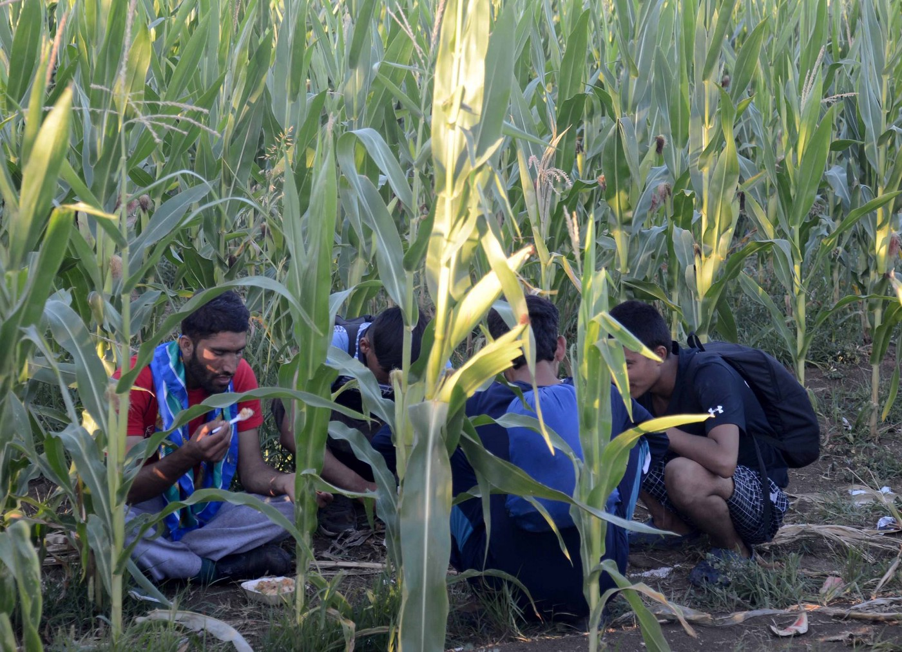
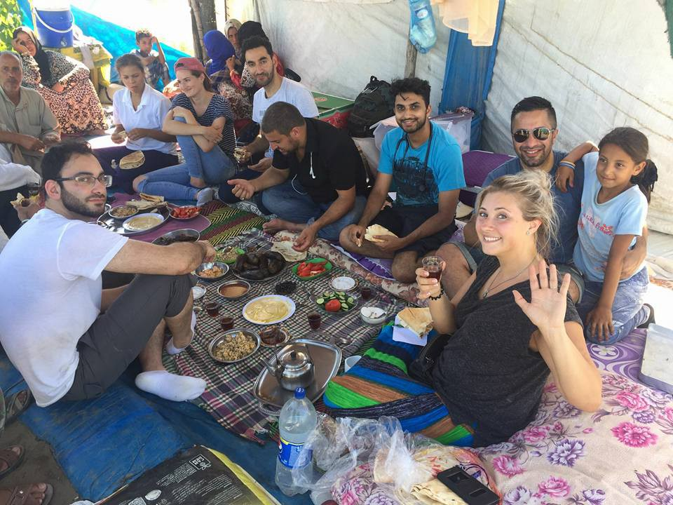
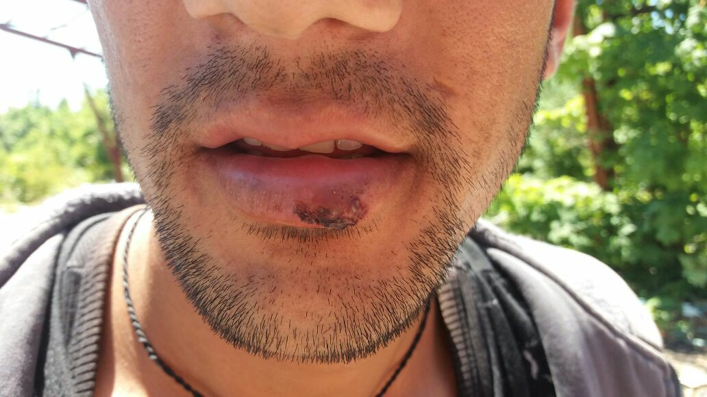
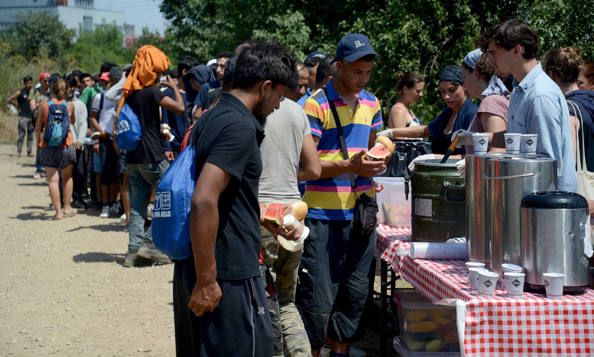
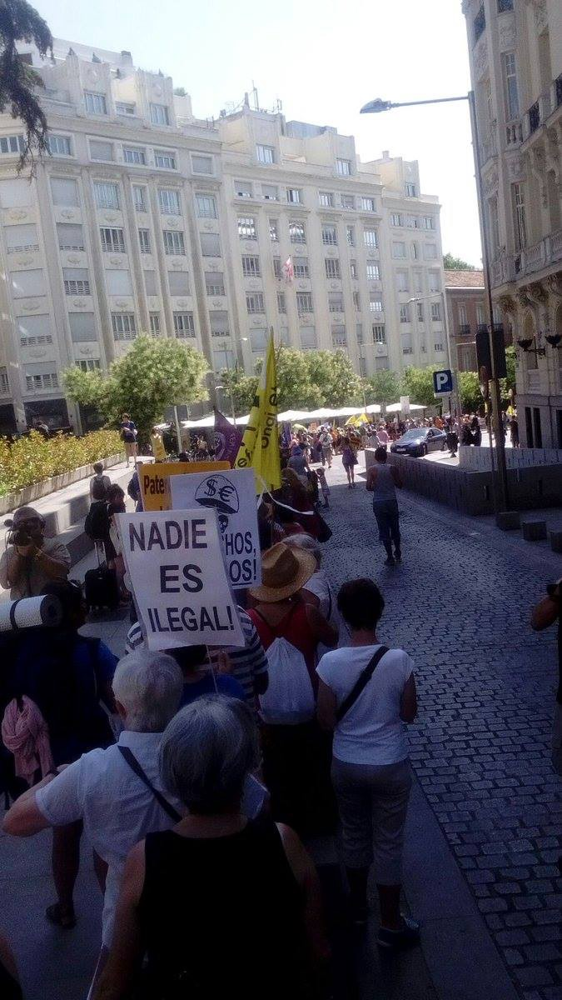

### AYS Daily Digest 15/07/17: Dangerous game for returnees to Afghanistan

_New volunteer opportunities in Turkey / Moria being rebuilt after fire / Call for solidarity with refugee from Uganda / More police violence at Serbian\-Croatian border / Solidarity in Spain against EU treatment of refugees / More women and children in extreme need in Calais and Dunkirk / Danish rally around 20\-year\-old deportee / And more news…_

Photo credit: Causascomuns
### FEATURE: Returns from Sweden to Afghanistan present dangerous game to refugees\.

The president of Afghanistan previously said that they would welcome back all those returned from Europe and Sweden with open arms; however, the Minister of Migration presented a more sobering image\.

“There are no social services in Afghanistan and the country is also struggling with a lot of returnees from Iran and Pakistan\. In total, approximately 1\.5 million people should return from the neighboring countries\. The 20,000 people that have been coming back from Europe and Turkey are a drop in the ocean — but are still the cause of big political discussions” \(Translated from a report here\) \.

Refugees from Afghanistan face increasing discrimination and persecution in camps in Pakistan, Iran, and throughout Europe\. Many are subject to extreme stereotyping, which is only providing a further incentive for sending people, many of whom have been in Europe for several years, back to an unsafe area\. As we covered previously, there are continuing attacks across Afghanistan, one of which tragically killed a recent forcible returnee\.

One such man, Jawad Husseini, who integrated into his small Swedish town found himself back in Afghanistan, having spent only one night in Kabul\. An ethnic Hazara, his father was killed by the Taliban when he was a young child, and he fears that he will be targeted for further crimes\.

Swedish is the only language he can read and write in, and he says that Afghanistan does not feel like home\.

Since October 2016, 44 people from Afghanistan have been forcibly deported, 1000 have returned “voluntarily” and a few have been deported due to criminal offences\. However the EU plans to deport up to 80,000 people from Afghanistan in the coming years\.

■■■■■■■■■■■■■■ 
> **[Safe Passage 🧡](https://twitter.com/safepassageuk) @ Twitter Says:** 

> > Today an independent inquiry by the @[HumanTraffFdn](https://twitter.com/HumanTraffFdn) has found that child refugees in Europe have been failed by our government's inaction https://t.co/ScVuIndSXX 

> **Tweeted at [2017-07-13 16:49:36](https://twitter.com/safepassageuk/status/885541732942794755).** 

■■■■■■■■■■■■■■ 

In not terribly surprising news, the deportations are not having their intended effect of deterring migration; instead, it’s the other way around, according to smugglers\.

Therese Christiansson published a detailed report, with 12 years of research, on the dynamics of return and smugglers\.

> According to \[the smuggler\] it was approximately 30 percent of the people he smuggled into Iran that wanted to continue to Europe, and now it is more like 50 percent\. 

> “The rules in Europe don’t matter, since the alternatives in Afghanistan are even worse” the smuggler says\. 

According to this contact, around 5% of these people are killed at the Iranian\-Afghan border\. Furthermore, around 50% of those returned to Afghanistan will attempt to leave again\. Long\-term displacement has affected refugees from Afghanistan \(hundreds of thousands of whom are in camps in Iran\) who do not feel connected to Afghanistan, yet face serious discrimination in Iran, often lacking the right to work and access to integrative services\.

The amount of money pouring into returns is truly staggering, and, clearly, ineffective\. So often, the reasons offered as “justification” for a strict and heartless immigration policy are given a veneer of pragmatism or practicality; however, the reality is quite different, as can be seen\.

Why governments continue to insist on “solutions” that do not solve, but, instead, support only smugglers and bureaucrats, is a question yet to be answered\.

The information for this feature was taken from the following sources\. They are available in Swedish [here](http://www.dn.se/nyheter/sverige/ministern-vill-att-sverige-stoppar-utvisningarna/?forceScript=1&variantType=large) , [here](http://www.dn.se/nyheter/sverige/jawad-jag-trodde-att-jag-skulle-do-nar-som-helst/) , and [here](http://www.dn.se/nyheter/sverige/affarerna-okar-for-smugglaren/) \.
### TURKEY

New volunteer opportunities for those willing to commit 1–2 weeks of time\!

According to Tamer Altaier, there are connections for volunteers in Turkey for those who wish to join\! The opportunities are wide\-ranging and will help in camps near the border\. Here is the full post:

> Hello, if you are looking for volunteer opportunities in Turkey for one or two weeks and if you speak Arabic and English , if you love to help in any way, if you have experience working with refugees and if you’re looking to learn more about refugee aid in Turkey, if you can teach children in tents school and help women and old people in the camp, help in the warehouse with food bags or provide medical help or build water systems, you can contact me\. We are at your service\. Near the Syrian/Turkish border we are working in cooperation with three clinics: one that specialises in severe war wounds, one that specialises in women’s and children’s health and one that supports children with autism\. We additionally run two schools and a women’s centre in informal refugee camps\. And we have a warehouse where we store medical and food supplies for weekly distributions\. 

Contact [Tamer Altaiar](https://www.facebook.com/ishak.altaiar?hc_ref=ARQSqy8zqscdL539AZgGPyUmiU0V1W0iiDAwaieNoAQ49ROsLehOe_ELXGXLD7vTMuE&fref=nf) for more information\.

Millions of Syrian refugees remain in Turkey and Lebanon, therefore support for them is also crucial, albeit often overlooked\.

Photo credit: Tamer Altaier
### GREECE

New registrations for the 15th:

138 total

95 \#Lesvos

33 \#Samos

10: \#Other

Photos of the aftermath of the large fire in Moria camp\. There was restoration and rebuilding\.

](assets/5f4f778a46a7/1*G6yLaZqp_PyLia5x57Srig.jpeg)

Photo credit: ‎ [**مهاجر immigrant**](https://www.facebook.com/riadh04/?hc_ref=ARTDNVclRDp_0wZWfwSt0iZTm3k0yeHxd06s7horWfhCtT5DcQdx1FKwLZWbeTc3UAg)

](assets/5f4f778a46a7/1*Pr2uRdQxfni0i2Tcj0VrRg.jpeg)

Photo credit: ‎ [**مهاجر immigrant**](https://www.facebook.com/riadh04/?hc_ref=ARTDNVclRDp_0wZWfwSt0iZTm3k0yeHxd06s7horWfhCtT5DcQdx1FKwLZWbeTc3UAg)

InfoMobile and No Borders have published a call for solidarity in order to honour the memory of a courageous refugee referred to as S\. S’s story is yet another of the failures of the system in supporting the most vulnerable\.

> “We first met S\. in December 2015, a 41\-year\-old woman from Uganda, a victim of torture in her country\. She was waiting in the cold with hundreds of other refugees in the informal tent camp in Idomeni at the border to FYROM, at the time when the borders started to gradually close, beginning with refugees who were not from Syria, Iraq and Afghanistan \(non\-SIA countries\) \. Along with many others, she had the hope that the Balkan corridor would re\-open for all and she could move forward and later re\-unite with her family in a better place\.… 

> For months she tried hard to find a job in order to support her family\. During the whole period of stay S\. suffered not only from her very serious health problems and trauma as a victim of torture, but specifically from the separation from her children\. She was supported by friends and volunteers, as well as the Greek Refugee Council \(GCR\), Medicines Sans Frontiers \(MSF\), and Babel Day Care Centre until her very last days — even until today\. 

> Tragically, S\. finally lost her courageous struggle and died in the early morning of 12th July in a hospital in Athens\. Now, we want to say goodbye in dignity and help her on her last journey back to Uganda, where her children have returned to\. Her loved ones, as a last wish for their mother, asked her body to be transferred and buried close to them in Uganda\. 

> GCR made a solidarity call to collect the amount of 2,100 Euro for the purpose of the transfer of the corpse back home to Uganda\. We would like to call for solidarity also from our side and ask you to support the family of S\. on these last steps\. She never reached her destiny; she could not fulfill her dreams\. We want her to be in the arms of her family finally…\.”

Please consider donating in order to make this a possibility\. Further attention should be paid by meditating on the horrible way in which this woman, pushed to the edge of life for so long, ended in such a situation of great indignity\. Read the real and touching full story [here](http://infomobile.w2eu.net/2017/07/13/urgent-call-for-solidarity-with-our-dear-friend-s/) \. This is why we continue to draw strength and stand\. Rest in peace and power, S\.

Books available in various languages for pick up in Athens, still\!

_Pick up can be done at Victoria Square Project \(Elpidos 13, Victoria Metro Station\) \. Drop off can also be arranged depending on where in Athens\. Send me a PM to arrange_

_Arabic — English Picture Dictionary \(Oxford\) \(1 available\)_

_Arabic\- German Phrasebook \(2 available\)_

_Arabic\- French Phrasebook \(3 available\)_

_Greek\- English Lonely Planet Phrasebook \(13 available\)_

_Kurdish Sorani\- English Dictionary and Phrasebook \(1 available\)_

_Also have 2 children’s books \(Disney\) in Arabic\._

There are still a few more deliveries expected, so stay alert\!

In a report by the EU observer, aid to Greece from the EU is set to decrease significantly in the next few months\. It was only a matter of time before the EU’s attention faded, however, this decrease in aid could result in even more dire straits for refugees\. As we have seen, this winter saw refugees stranded under snow, having emergency cases of infected rat bites, and having large areas of camps destroyed due to weather or individuals\. The plan forward remains unclear\. According to the report:

> The EU has earmarked over €500 million for Greece between 2014 and 2020\. 

> An additional €362 million has been made available for emergency assistance, either directly to Greek authorities or international aid organisations and NGOs\. 

> The UN refugee agency \(UNHCR\) received a record €340 million from the EU between 2015 and 2016\. 

> “We are absolutely ready to progressively step back and disengage from Greece as long as this done responsibly,” said an official from the UNHCR\. 

Read more [here](https://euobserver.com/migration/138520) \.
### SERBIA/CROATIA

Two days ago on the 13th in the wee hours of the morning, two men from Pakistan who were attempting to cross into Croatia were intercepted in the back of a truck\. Croatian police \(two at first, then joined by three for a total of five\) removed them from the vehicle and beat one of them viciously — leaving him with seriously bruised lips\. They were told to “go back to Serbia\!” Thanks to the Rigardu team for this report\.

Man beaten by Croatian police\.

[Causascomuns](https://www.facebook.com/asociacioncausascomuns/?hc_ref=ARQn_J-uqMM6NzuRlUEKAjE42Y2abMP_nJ1HHVBMh4n5-l8fonmf3OMvvFMhAJzPnmU&fref=nf) is working with No Name Kitchen in meal distribution at the Serbian\-Croatian border\. They provide breakfast and one daily meal to around 150 people per day\. If you wish to support their work, go [here](http://www.causascomuns.org/) \.

Photo credit: Causascomuns
### SPAIN

There were protests across Spain today against the EU border control\. This photo was from Melilla

Photo credit: Enough is Enough
### FRANCE

According to a post in [Refugee First Aid & Support Team](https://www.facebook.com/groups/RefugeeSupportFirstAidTeam/permalink/1940869689526205/) , support is greatly needed in both Dunkirk and Calais, although Dunkirk is slightly more neglected\. There is an increase in women and children everywhere\.

 ‎](assets/5f4f778a46a7/1*1pIosZh8vkBcIV-M_njN-g.jpeg)

Photo credit: [**Hassan Khalid Chaudhry**](https://www.facebook.com/hassan.k.chaudhry.3) ‎

The Refugee Women’s Centre is attempting to raise money for a vehicle, which will increase their mobility in an ever\-changing and worsening situation\. Those interested in donating, check out this [link](https://www.gofundme.com/womenscentre) \. Their update on 28th of June goes as follows:

> Three months on from the closure of the Dunkirk Camp, around 300 men, women, children and babies are now living without shelter in the woods and grasslands\. There is no running water, no toilets, no cooking, heating or washing facilities\. 

> Behind the bushes below are people’s homes\. Some have tents, some have blankets, that is for today, as there is constant threat that the camp will be broken up and blankets and shelters confiscated\. It has happened many times already\. 

### DENMARK

Unwavering solidarity in Denmark on Sunday as many come out to protest the forcible deportation of a 20\-year\-old refugee\. They were met with criticism from a far\-right political party \(Danskt Folkeparti\) as a politician with the party stated that protesting forcible deportations should be forbidden\. The organizers, however, tell a different story; wherein they simply talked to other citizens at the airport and told them of the injustice — something that is far from forbidden\.

> What Rohulla’s friends did at the airport was that they handed out information to passengers that potentially would be on the same flights by the check\-in desk for the relevant Turkish Airlines flights\. 

> They also encouraged fellow passengers to film the deportation and if the police did anything to Rohulla during the flight\. One of the travelers, a Turkish professor, promised to contact the captain saying that he didn’t want to travel together with someone being forcibly returned\. One of the passengers refused to fasten his seatbelt as long as Rohulla was on board\. 

Read more, in Danish, [here](http://politiken.dk/indland/art6029955/N%C3%A6ppe-forbudt-at-tale-med-folk-i-lufthavnen-Martin-Henriksen) \.

> **We strive to echo correct news from the ground through collaborationand fairness, so let us know if something you read here is not right\.** 

> **If there is anything you want to share, contact us on Facebook or writeto: areyousyrious@gmail\.com** 

_Converted [Medium Post](https://areyousyrious.medium.com/ays-daily-digest-15-07-2017-dangerous-game-for-returnees-to-afghanistan-5f4f778a46a7) by [ZMediumToMarkdown](https://github.com/ZhgChgLi/ZMediumToMarkdown)._
