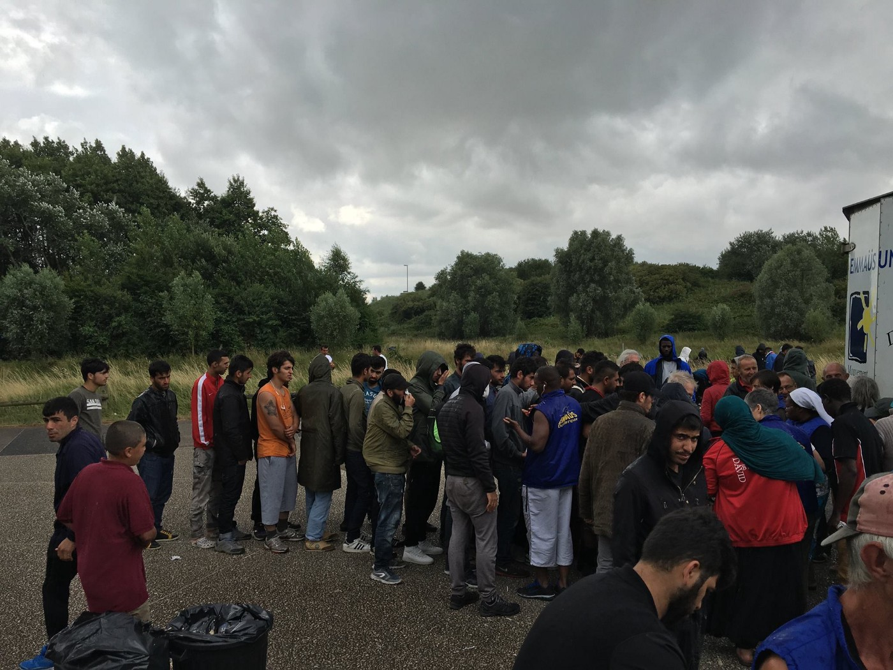

### **AYS Daily Digest 17/07/17: The situation at sea continues to** degenerate

_Urgent help needed in Iraq / NGO’s announces their withdrawal in Greece / 212 people came to the Greek islands in 48 hours / Protests in Moria are still on / Refugees in Italy faces discrimination / Upcoming deportation in Denmark / Volunteers needed at several places / And more news…_

](assets/10fa51fb3937/1*ZB4Y37jTSkEDSik-BD4ZZQ.jpeg)

NGO’s at sea\. Photo: [The Worldwide Tribe](https://www.facebook.com/profile.php?id=1526014994350929&ref=br_rs)
### Feature

Following the last couple of weeks, with meetings about codes of conducts and yet again, a non\-humanitarian response from the EU, right wing populists are gathering to intervene SAR\-missions at sea, [Al Jazeera reported today\.](http://www.aljazeera.com/news/2017/07/defend-europe-boat-block-migrant-rescues-170717070055413.html)

[In our feature from the 13th of July](ays-daily-digest-13-07-2017-italian-government-proposal-that-could-put-thousands-of-lives-at-risk-379a0b5a132e) , it was, among other things, possible to read about the Italian governments approach towards refugees arriving by sea\. The code were heavily critizised by Human Rights Watch and Amnesty\. It is affecting and punishing the wrong people, taking focus from where it should be — how we can work together to end this madness, instead of blaming those trying to make the best out of a bad situation where people are ending up in unseaworthy and overcrowded boats\.

Anyhow, it is getting worse\. The right wing organization Defend Europe, with its roots in France but now a mashup of people from several countries, have set sail and will soon be in Sicily to supervise the life saving missions that ngo’s are doing on daily basis\. They will circulate in the SAR\-areas between Italy, Malta and the Libyan coast\. This is their second time at sea, in May they disturbed MSF Sea during one of their rescues\. The extreme right wing Defend Europe writes on their website:

_“Right now so called “humanitarian” NGOs are smuggling hundred thousands of illegal migrants to Europe and are endangering the security and future of our continent\. They are the ones who are responsible for the mass drowning of thousand of Africans in the Mediterranean\. But we are no longer looking away\. We will do something against it\.”_

Defend Europe’s mission on the Mediterranean is disgusting\. They claim that ngo’s are the cause of the many deaths at sea and that they are cooperating with smuggler rings in a well organized invasion of Europe\. It this a bad movie? Unfortunately not\. It is the European union and some of it’s citiziens in 2017\.

More well established information is that without ngo’s at sea, more people would die\. According to the [article from Al Jazeera,](http://www.aljazeera.com/news/2017/07/defend-europe-boat-block-migrant-rescues-170717070055413.html) more than one third of all rescue missions at the Mediterranean are conducted by ngo’s\. The british organization [HOPE not hate](https://www.facebook.com/hope.n.hate/?ref=br_rs) said that the righh wing populists mission will risk destroying rescue missons at sea, putting migrants in even more danger if they somehow interferes the rescue missions\.

■■■■■■■■■■■■■■ 
> **[MSF Sea](https://twitter.com/MSF_Sea) @ Twitter Says:** 

> > #Aquarius and #Prudence will be in Sicily for maintenance before going back to the #SAR zone. https://t.co/4j6v7M5M1J 

> **Tweeted at [2017-07-17 06:54:05](https://twitter.com/msf_sea/status/886841417389273088).** 

■■■■■■■■■■■■■■ 

Further in contradiction with the Defend Europe statements, [Save the Children said to Al Jazeera that the right wing extremists plans “are deeply concerning” and “ignore the moral and legal obligation” to save lives in the Mediterranean\.](http://www.aljazeera.com/news/2017/07/defend-europe-boat-block-migrant-rescues-170717070055413.html)

> “Without NGOs and other search\-and\-rescue actors, many more lives, like the men, women and children we have rescued, would be lost,” the group said, adding that more than 5,000 people drowned en route to Europe last year\. 

> [“These activists wish to disrupt efforts to bring these people to safety\.](http://www.aljazeera.com/news/2017/07/defend-europe-boat-block-migrant-rescues-170717070055413.html) 

The plan from Defend Europe is not in first hand to stop the boats saving migrants, but to overlook the situation and shine a light on what they mean are a as a “well organized invasion of Europe”, made up by smugglers in the Middle East and North Africa in cooperation with European and humanitarian ngo’s\. We immediately urges Defend Europe and all it’s supporters to rethink and base their missions on facts and humanity rather than irrational fear as they currently does\.

The ngo’s aren’t the main cause of people dying at sea\. The pull\-factor, as some people are arguing that the ngo’s life saving missions are for those fleeing, is rather to get away from terrible conditions and maybe being able to rebuild a normal life somewhere\. Which will be the case both with and without SAR\-missions at sea\. It’s time that politicians realize that and helps instead of opposes people in need\. And stop fueling the arguments from right wing populists\.

As [Jugend Rettet e\.V\.‏](https://twitter.com/jugendrettet) , [Sea\-Watch](https://twitter.com/seawatchcrew) and [Flüchtlinge Willkomm](https://twitter.com/FlchtlngWllkmmn) aresaying instead:

■■■■■■■■■■■■■■ 
> **[Jugend RETTET - IUVENTA](https://twitter.com/jugendrettet) @ Twitter Says:** 

> > Mutual support is currently more important than ever @[seawatchcrew](https://twitter.com/seawatchcrew) @FlchtlngWllkmmn Thank you friends! &lt;3 https://t.co/MkqdFWJC0Z 

> **Tweeted at [2017-07-17 17:12:26](https://twitter.com/jugendrettet/status/886997031453155328).** 

■■■■■■■■■■■■■■ 

### Iraq

**News from Iraq, post the seige in Mosul**

[Refugee Biriyani And Bananas](https://www.facebook.com/RefugeeBiriyaniAndBananas/) are currently working in Iraq and are in urgent need of help\. They are helping the most vulnerable, including Yezedi families, that are receiving less help in the camp\. Some families have just been released after being captives in Shingal by IS\. The individuals they are helping are often suffering from malnutrition and trauma\. They will also help in Hassan Sham camp in Mosul\. [The situation is desperate, and more details from the ground can be found here\.](https://www.facebook.com/RefugeeBiriyaniAndBananas/?hc_ref=ARQJ9VD1URivKGFCanxlJdnw2H4PiGMg2qBubkAba3Yb7qtVVX1RSTAEBTkzKHsJKUw)

[Follow this link to donate\.](https://mydonate.bt.com/fundraisers/crisismosuldohuk)
### Greece
#### Mainland

**Nea Kavala update**

[The numbers in Nea Kavala camp at Lesvos are decreasing](https://www.facebook.com/groups/478293189015540/permalink/784696295041893/?hc_location=ufi) and are down to approximately 475 people now, but there is still need for help\. Ngo’s are already starting to withdrawal, and there are rumours about the government taking over the camp soon\. Still, nothing is confirmed and people are left wondering about what will come\. Pregnant women and families are relying on volunteers for that extra care and help that is needed in vulnerable situations\.

Some good news too\. There are art classes and a touring exhibition coming up in the end of the summer\. On the 5th August in Poland, and then Washington D\.C\. [and Germany in September\. We hope more information will follow\.](https://www.facebook.com/groups/478293189015540/permalink/784696295041893/?hc_location=ufi)

For more details on Nea Kavala, please click here\.

If you wanna donate, [do it here\.](http://paypal.me/lovewithoutborders4)

**Volunteer opportunities\!**

Vasilikamoon are currently looking for volunteers\. Get in touch at [lalunadivasilika@gmail\.com](mailto:lalunadivasilika@gmail.com) if you wants more info about their missions\.

[ #dervenicamp #refugeegr #guerrasiria #volontariato #helprefugees")](https://www.instagram.com/p/BWoyRd2gytN/)

**Islands**

**Lesvos**

**Withdrawal update from Lesvos**

More ngo’s are leaving\. [Lighthouse Relief](https://www.facebook.com/profile.php?id=771580459631164&ref=br_rs) announced that they will stop working in the Stage 1 camp in Skala Sikamineas at the end of July\. But they will continue with their our emergency response, eco relief and upcycling projects, based out of Skala Sikamineas and nearby areas\.

They have some items and things left, and will donate it to other organizations that could use it and distribute\. For more info, contact admin\.lesvos@lighthouserelief\.org\.

[**212 people in 48 hours**](http://www.ekathimerini.com/.../influx-of-migrants...)

[So many arrived between Saturday and Monday morning according to govenment figures,](http://www.ekathimerini.com/.../influx-of-migrants...) Ekathimerini reports\. Of the people arriving 89 came to Lesvos, 68 to Chios and 55 to Samos\.

The newly arrived brought the number of people residing on the islands reception centers up to almost 10 000\. [The authorities statistics says that there now are 4378 people on Lesvos, 3461 on Chios and 2095 on Samos](http://www.ekathimerini.com/.../influx-of-migrants...) \. The slow asylum process is the cause of the many, and ongoing protests on the island, as we have been covering the last weeks\.

**Protests continues in Moria**

Thee slow asylum process is causing more protests\. People are tired of waiting on the overcrowded islands, at the same time as the relocation mechanisms aren’t working as they were said to\. Refugees united outside of EASO’s office, demanding that everyone that have been trapped on the island for more than six months should be able to leave\. Some people have been here for more than a year\. The cause is the inhuman EU\-Turkey deal\.

**Moria hungerstrike update\!**

Arash Hampwy have been on a solidarity hungerstrike since the 28th of June\. As a political activist, originally from Iran, he demands refugees to be treated with human dignity and to reunite with his younger brother that also are on a hungerstrike but inside the prison\. [Read his full statement here, after nearly three weeks without any food\.](https://www.facebook.com/arashampay/posts/496499907362767?hc_location=ufi) Still, he don’t want the focus to be on him — but on the men detained in prison without being charged for any crimes\.

**Chios**

[The conditions on Chios and in Souda camp aren’t much better and the heat is unbearable in the tents](https://www.youcaring.com/refugeesinchiosgreece-863338) \. Therefore this project is collecting money to buy reflective tarps for people living here\.

Souda have recently, as AYS have mentioned before, been lacking enough drinking water\. Which makes this even more urgent\.
#### Spain

In Spain, rescue missions are taking form\. At this point [PROEM — AID](https://www.facebook.com/Proemaid/?hc_ref=ARTVJzoDm3rqADcOjMKIlHpGEizSihOCQfHqTOlVxCXR7LxgEJ6M_vNhryIs9lYt6lU) needs a boat to rescue refugees in the Mediterranean\. There are already 35 volunteers prepared to work with the missions\. [Those understanding Spanish, could get more info here\.](http://www.europapress.es/epsocial/cooperacion-desarrollo/noticia-proem-aid-necesita-barco-salvar-refugiados-frente-costa-libia-hay-35-voluntarios-esperando-actuar-20170716122956.html)
#### France

**Volunteers needed in Dunkirk and Calais**

> [Awesome day making food distribution with \#Emmaus \#chicken day with a little bit of a spicy sauce\.](https://www.facebook.com/photo.php?fbid=10159141021595061&set=pcb.10159141180485061&type=3&theater) 

> How did you sleep last night? Did you had good [\#dreams](https://www.facebook.com/hashtag/dreams?source=feed_text&story_id=10159141180485061) ? Beautiful people just around the corner in your city don’t have anything and are dreaming with a [\#betterlife](https://www.facebook.com/hashtag/betterlife?source=feed_text&story_id=10159141180485061) \! 

> What are you waiting for? tomorrow it could be you, or your family\! 

> You can help with housing, clothes, food and vehicles\. 

> Volunteers WANTED\! \! 

You can get in touch with [Adrian Torres](https://www.facebook.com/adrian.torres.71868964?hc_ref=ARS1nPa5Tz3wkvJi-70CMcg78lC7euSBT8OJFYYrfEL-Fzxpk6PT__mWMoQLWz7uqgs) or at number \+44 7454 906913

](assets/10fa51fb3937/1*dG890vSJuTLSFl7XOnt17g.jpeg)

Photos: [Adrian Torres](https://www.facebook.com/adrian.torres.71868964?hc_ref=ARS1nPa5Tz3wkvJi-70CMcg78lC7euSBT8OJFYYrfEL-Fzxpk6PT__mWMoQLWz7uqgs)

**Petition to show solidarity with the kids of Calais\.** [Sign here to show what you think\.](https://www.change.org/p/theresa-may-end-inhumane-homelessness-of-refugee-children-in-northern-france)

[Calais Action](https://www.facebook.com/calaisaction/) will do an installation at the Edinburgh festival\. It will consist of art from the residents of the Jungle\. Check it out if you visits\.

](assets/10fa51fb3937/1*_mLwyXZeClNe3Tx8Oh5-Hg.jpeg)

Photo: [Calais Action](https://www.facebook.com/calaisaction/)
#### Italy

[The Italian government are continuing to treat refugees trapped in the country in a bad way](https://helprefugees.org.uk/refugees-italy-asylum/) , [Help Refugees](https://www.facebook.com/HelpRefugeesUK/?hc_ref=ARQKYBn99XoBZlCwqVfaPpn_Wm-I-RfBABVVbc5Dvp6NT8vXdYw-Tsm3UB9YKy5GCT4&fref=nf) are saying in a statement published both on facebook and their website today\.

[After the arrival on unseaworthy boats the rescued people are temporarily filled with relief, efter the dangerous crossing\.](https://helprefugees.org.uk/refugees-italy-asylum/) But it will not last that long\. The Italian police are refusing several nationalities from seeking asylum and the process are discriminatory\.

_Instead of being given somewhere safe to sleep, they are turned directly from the port to the streets, with a notice saying they have 7 days to leave the country by their own means\._

_It is then left to volunteers to help them find their way, providing legal assistance, finding dormitories which can host them, and providing hot meals\._

[Help Refugees](https://www.facebook.com/HelpRefugeesUK/?hc_ref=ARQKYBn99XoBZlCwqVfaPpn_Wm-I-RfBABVVbc5Dvp6NT8vXdYw-Tsm3UB9YKy5GCT4&fref=nf) implementary partner Porco Rosso are doing exactly this\.

[Donate here\.](https://mydonate.bt.com/donation/start.html?charity=127188)
#### Hungary

Not that much news from Hungary, but a film overlooking the borders\. No foreign journalists, no humanitarian organizations or ngo’s are allowed here\. This is a shot from above\.

The camps are pure boredom\. All people staying here can do is to wait through the asylum process\. Just wondering, leaders of the European Union — would you like to live like this if you already had lost everything or for some reason was forced to leave your home behind?
#### Germany

**Volunteers needed\!**

Committed volunteers are needed for [AsyLex](https://www.facebook.com/AsyLex.ch/?hc_ref=ARSN5n6PcQqrZ9O7Le92aWlrbwchhVhoPXFG79M8ZLhfgVIcL5nSC2Jz5UJ2QEss6LE) activities\. Get in touch at [recruitment@asylex\.ch](mailto:recruitment@asylex.ch) if you wanna help out\.

**No limit, Merkel says\. \.**

Further, the German chancellor Angela Merkel refused to put a limit on how many refugees the country can accept\. It was in an annual interview broadcasted yesterday she informed about this\.

> [“As far as an upper limit is concerned, my position is clear: I will not accept it,” she said, saying that numbers could be reduced by regulation and taking action to prevent the situations that cause people to flee one country for another\.”, she said to DW\.](http://m.dw.com/en/chancellor-angela-merkel-rejects-refugee-limit-for-germany-in-tv-interview/a-39714436) 

This is conflicting with other powerful people’s views in Germany, but hopefully Merkel will stick with this\.
#### **The Neatherlands**

A party is coming up\!

On the 6th of August there will be a party for LGBTQ\-refugees\. With oriental dance, music, food and friends\.

For more information, contact [erwin5770@gmail\.com](mailto:erwin5770@gmail.com) , [info@stichtingsecretgarden\.nl](mailto:info@stichtingsecretgarden.nl) or [c\.walraven36@upcmail\.nl](mailto:c.walraven36@upcmail.nl)
#### Denmark

[A 20 year old man, that goes under the psedonyme Fawad Noori, is to be deported from Denmark to Afghanistan](https://www.ipetitions.com/petition/deportation-of-young-atheists-will-get-him) \. He came to Denmark when he was 16, back in 2013, after losing both of his parents\. He is an atheist, and it is the first time an atheist is deported from here\.

[SIGN THE PETITION AND LET FAWAD STAY\!](https://www.ipetitions.com/petition/deportation-of-young-atheists-will-get-him)

_We strive to echo correct news from the ground, through collaboration and fairness, so let us know if something you read here is not right\._

_Anything you want to share — contact us on Facebook or write to:areyousyrious@gmail\.com_

_Converted [Medium Post](https://areyousyrious.medium.com/ays-daily-digest-17-7-17-the-situation-at-sea-continues-to-degenerate-10fa51fb3937) by [ZMediumToMarkdown](https://github.com/ZhgChgLi/ZMediumToMarkdown)._
