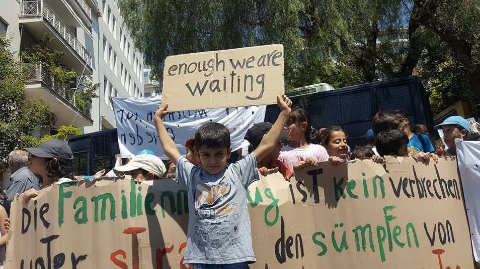
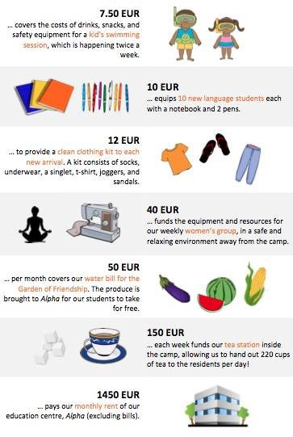
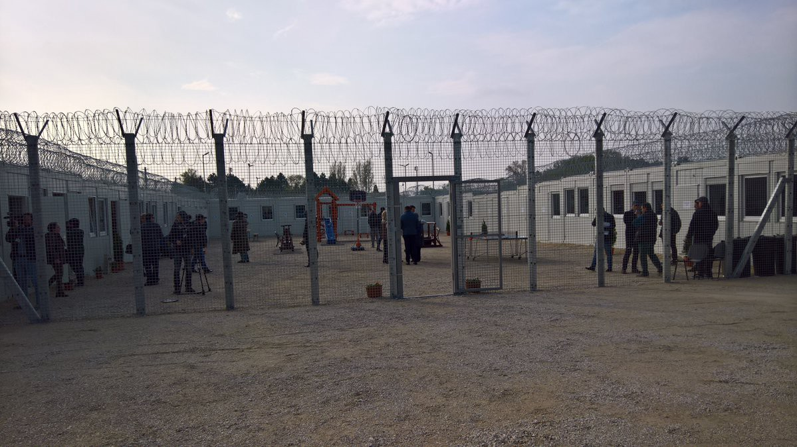
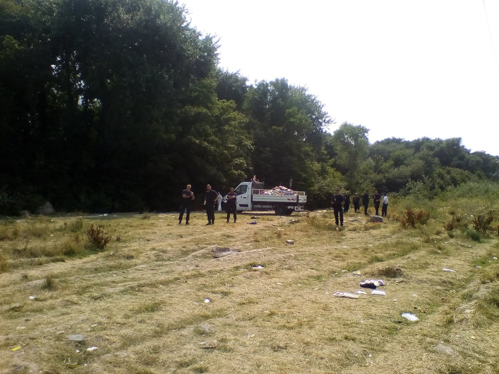

### AYS Daily Digest 19/07/17: The situation of unaccompanied child minors in Greece is untenable

_Activists continue hunger strike, call for investigation of Arsal refugee camp military operation / 35 arrested in Moria after police escalate violence / Refugees stage sit\-in in front of German embassy in Athens / Nearly 500 being held in camps on Serbian\-Hungarian border / CRS confiscate refugees’ blankets and tents in Calais and Dunkirk / Newest numbers show a massive spike in the number of arrivals to Italy / 29 refugees relocated to Spain from Italy / And more news…_

A photo of a refugee boy from today’s protest in front of the German embassy in Athens\. Photo Credit; Refugee Info Bus
#### Feature

International Rescue Committee and METAdrasi have [released a report](https://www.rescue.org/sites/default/files/document/1761/uncertainfutures-jointadvocacybriefingonsituationforuascingreecejune2017.pdf) analyzing the present situation of unaccompanied refugee children in Greece, as well as proposals to remedy it\. The report finds that while the conditions of unaccompanied refugee children have been heading towards improvement, there is still a long way to go to ensure that the children’s rights are fully protected\. Namely, they recommend that each child be assigned a trained guardian in a timely manner, set more appropriate criteria for care and services, to accelerate the process by which solutions are put forth, and to create a plan that would allow for a seamless route from NGO to government care\.

The situation for unaccompanied child refugees still leaves much to be desired\. There are only 1,223 spaces for unaccompanied child refugees, of the estimated 2,250 such people in Greece\. This means that nearly half of those in need of shelter are being left out\. Many of these children are forced to live in dangerous conditions and endure homelessness, or find themselves in police custody, which is not at all suited to match their needs\.

Furthermore, many of these children suffer from mental health problems as a result of their traumatic experiences\. Access to mental health resources is a problem more generally in Greece and many refugees cannot access the counseling that they need\. Children are particularly vulnerable to these problems, and must face additional stress in the face of a system which does not have enough space to accommodate them\. The massive delays in procedure, such as forcing children to stay in Greece for months after their reunification application is approved, does not do anything to remedy the situation\.
#### Lebanon
### Syrian activists continue hunger strike, demand independent investigation at Arsal refugee camp

On June 30, the Lebanese army staged a raid on Arsal refugee camp\. The purpose of the raid was to root out supposed terrorists, who the Lebanese military said has embedded itself among the population of the refugee camp\. In the course of these events, 20 were reportedly killed and near 400 were arrested\. One week later the bodies of 8 people were returned to their families, showing signs of torture\. Among those bodies was that of a nurse who had taken care of refugees in the camp\.

Sakher Edris, a journalist and founder of the Working Group for Syrian Detainees, [says](http://www.saveoursyria.org/the-latest.html) that in Lebanon, more than 5,000 Syrian refugees are being detained throughout the country, where their human rights are regularly violated\.

To protest the events of that day, Syrian solidarity activists worldwide have started a hunger strike which has so far lasted for 14 days\. The activists’ demands are that the UN carries out an independent investigation on the events of that day, as well as the deployment of independent monitors to Syrian refugee camps to provide accurate information about incidents in the camps\. They also ask that the world community takes seriously the crimes of the Syrian government which are responsible for spurring the refugee crisis in the first place\.
#### Greece
### 35 refugees arrested after clashes on Moria

The police escalated a peaceful protest on Moria yesterday morning by deploying tear gas and violence\. The 35 face inflated criminal charges, among them conspiracy, destroying private property, resisting arrest, and endangering life\. Some were brutally beaten by the police\. Some had not even been involved in the protest, and were taken from their containers for unknown reasons\. 34 spent the night in prison where they say they were beaten by police\. 1 individual spent the night in hospital, and is still receiving treatment\. 34 of those arrested were brought to the Mytilene Courthouse, where the public prosecutor is deciding which charges will officially be brought\. Some are still bleeding from their injuries and are barefoot\.
### Three men accused of holding refugees hostage are arrested

13 refugees were found being held against their will in a warehouse in Magnisia\. Three men were arrested in connection with the case, the owner of the building and the two men who served as guards\. The refugees were supposedly being held until the men were paid for their release\.
### Refugees stage protest outside of German embassy against limits on family reunification

■■■■■■■■■■■■■■ 
> **[Ιoanna Spanou](https://twitter.com/ioannaspn) @ Twitter Says:** 

> > Refugees #protest delays in the process of reunification with their families in Germany 
#Greece #Athens #refugees https://t.co/JQ76uKXO8c 

> **Tweeted at [2017-07-19 15:03:38](https://twitter.com/ioannaspn/status/887689394127343616).** 

■■■■■■■■■■■■■■ 

A sit\-in took place outside of the German embassy in Athens\. There is a limit on 70 reunifications from Greece to Germany per month, which forces many with family members in Germany to be trapped in a legal limbo for months or even years\. Please sign the petition associated with the protesters’ at the following link\.

### Numbers

There are currently 10,443 refugees on the Aegean islands living in spaces that are meant for only 8,679\. The number of refugees on Kos, Chios, Lesvos, and Samos is far beyond carrying capacity\. On Samos in particular, the number of refugees on the island \(2,372\) is nearly three times greater than the spaces in the facilities that they occupy \(850\) \. These numbers signal a continued failure of the Greek authorities to streamline the asylum process which would allow refugees to move to the mainland, and there is good reason to believe that the situation will only get worse as the Greek government takes full administrative responsibility over the islands\.
### Call for volunteers at 5th School Clinic

“We are in need of Drs, Nurses, physiotherapists and other health professionals to offer care to a mixed population of all ages at 5th School Housing Squat\. The clinic serves the 300 residents and is open to refugees housed at other sites\. The work is varied and interesting \(assessment, first aid, minor ailments , signposting to other services\) \. We work in cooperation with other projects in Athens and beyond providing medical advice and support\. There is time and freedom to develop your own projects to fit with your skill set and interests\. The clinic also serves refugees in nearby squats and its doors are always open to the community\.

We are seeking particularly General Practitioners , Family Medicine Drs, General Nurses, General physicians, Emergency Medicine Drs, paediatricians, gynaecologists, psychiatrists and psychologists \(some ability to work in general adult medicine a big bonus\! \)

We are also happy to welcome dental teams\.”

If you would like to get involved, please message the [5th School Facebook page](https://www.facebook.com/5thSchool/?hc_ref=ARTtS1iNyt-3uf8Vzh2z_fvimcTlZEVsP3S7BBJiamXsnB1GCHDFXxhuFI_MC9iLnik&fref=nf) \.
### Samos volunteers in need of donations\!

There were 102 arrivals on Samos in the last two days\. With a steady stream of refugees coming into the island, the aid workers have an ever larger contingent of people to care for in terms of schooling, clothing, and food\. If you are in a position donate, you may do so by going to their website at [www\.samosvolunteers\.org](http://www.samosvolunteers.org) \.
#### Serbia
### TruckShop offers guidance for NGOs importing donations for refugees

Serbian customs agents are known to give organizations importing goods for the sake of helping refugees a hard time\. TruckShop offers its own experience to help other NGOs with the process\. Those wishing to learn more can email them at mobileclothesproject@gmail\.com\.
#### Hungary
### Nearly 500 refugees are currently being kept locked up on Hungarian\-Serbian border

The Hungarian Helsinki Committee reports that as of July 16, there are 447 asylum seekers being detained in 2 transit zones on the Hungarian\-Serbian border\. There are 262 people at Röszke and 185 at Tompa\. Among this number are 26 unaccompanied child refugees\.
#### France
### CRS confiscates what little refugees in Calais, Dunkirk have

Refugees’ tents and blankets were rounded up and taken away\. Photo Credit: Auberge des Migrants

The CRS has been hard at work to establish its reputation as a vile agency\. Last week, it came out that CRS officers were contaminating drinking water with tear gas in an attempt to get migrants to leave the area\. Today, the CRS was spotted rounding up the belongings of refugees in an impromptu camp and driving them away\. Such activity was spotted near the Grand Synthe camp in Calais as well as in Dunkirk\. As part of the French government’s policy of not allowing refugees to set up temporary communities\. the CRS has been given the juridical stamp do go about their business however they see fit\. Tear gas is deployed on occasion\. Sometimes refugees will be beaten\. Other times both refugees and the volunteers helping them will be physically intimidated\. The CRS’s conduct at this point easily matches the worst abuses of power as seen in countries like Hungary, and their actions must be actively protested\.
### Several cases of trenchfoot reported in Calais

A doctor working with refugees in Calais reported seeing several cases of trench foot\. The disease, as the name suggests, became famous in the trenches of World War 1, and involves the necrotizing of the flesh of the feet from being in constantly damp conditions\. Refugees, who rarely have a change of shoes, are forced to wear the same shoes for weeks at a time\. Refugees are forced to sleep wearing their shoes, as they are almost always sleeping outdoors and are regularly harassed by the police\. Given enough time, trench foot can turn into gangrene and potentially require amputation of the affected area\.

The doctor further noted that the only access to showers that most refugees have comes from a “shower truck” which makes it impossible to maintain personal hygiene at a healthy level\. Similarly, refugees are unable to wash their clothing\. The ability to maintain personal hygiene constitutes the bare minimum for living a dignified life, and in addition to damaging individuals’ sense of themselves, bad hygiene facilitates the spread of disease\. By purposefully hindering access to such a basic facet to human existence, the French government is violating refugees’ human rights\.

#### UK
### County Council halts the transfer of unaccompanied child minors into their district

The Nottinghamshire County Council voted 6–4 on Monday to suspend an agreement to take unaccompanied child minors into their into custody, saying that the British government has not been giving them enough money to ensure that they are properly taken care of\. The government provides the council with £30,231 per child, whereas the cost of providing for the children comes out to about £44,000, meaning that the county must pay an additional £14,000 of their own money\. The council has decided that this money would be better spent on local children\.

The council had accepted 10 children over the course of the last year\. The council additionally said that they are open to accepting children who are discovered inside of the country, but they will no longer take them in from abroad\. They added further that they are open to starting the program anew should the government provide additional funds\. In light of the decision, dozens of local activists protested outside of the county hall, arguing that compassion should trump financial considerations in the case of refugees who were forced to flee their native lands as a result of violence\. The council clearly believes otherwise\.
#### Italy
### Italy Refugee Crisis Database releases new data on refugees entering Italy

The Italy Refugee Crisis Database has [released a report](https://l.facebook.com/l.php?u=https%3A%2F%2Flookaside.fbsbx.com%2Ffile%2FSEA-ARRIVALS-TO-ITALY.docx%3Ftoken%3DAWyfPThDih_yJSHTWPJ1vC_VgNWtzv2T1_jxXm0clivbinxOluCaGzCh2Z44nDLQrez-QgqLv6_xYFi6PTYm5XQQsID1DtefYSilz_EUlvO7U2zVPaw_HvbBIqqsVfJXYeN2mO-srWNIxKQyJJ1DcF-Yp6ridsudUwNWcMtm9CSa40osPgzrMKj1NEOtV60Oa5eh1gsyjhFj2E8rBkYnhqOCsmMhX4k0iksFmE7bdBxu_w&h=ATNGXDNzN2cBsP4nlOJ0bLYTd944VJGxRwXz37Q4LfJFxtWYysA6AEdBEeXCA7FuMOXVVBnUS-_zUFOtMiukam4ZGS243cce3rEoKUs33Jp9fumpstNDR0uSXMEZA4GXIS2nROu9ayrRoo10D8M) showing the latest numbers for the refugee crisis in Italy\. Italy has long been overwhelmed by the volume of arrivals on their shores, and other EU countries have done little to relieve the pressure by accepting some of the new arrivals\. These latest numbers show that the scale of migration is too much for Italy to cope with on its own\.

The number of new arrivals for 2017 is far outpacing the rate in 2016\. As of July 18, there have been 93,284 arrivals to Italy, compared to 79,877 in 2016\. Among them are 9,761 unaccompanied children \(as of June 27\) \. The largest demographic of refugees originates from Nigeria \(14%\) followed by Bangladesh \(9%\), Guinea \(8\.5%\), Ivory Coast \(8\.1%\) and Eritrea \(5\.6%\) \. The report also shows that the period from June 13 to July 18 was by far the most active period of arrivals this year\. In the span of five weeks, a total of 29\.126 refugees arrived, a 31% increase\.

With such a massive volume, Italian resources are already stretched too thin\. The system is at capacity, and it is a massive struggle to house refugees in humane conditions\. Europe as a whole has the resources to integrate the thousands of people languishing in subpar camps in Italy and Greece, but the desire is simply not there\. They are content to spend resources instead on border control measures to keep refugees from inconveniencing the other governments of Europe\. The refugees whose needs are thus neglected are well on their way into turning into a “lost generation” without any prospects of betterment or economic self\-sufficiency, and if Europe does not act soon, there will be no reversing this tide\.
### CILD publishes legal guide to sea rescues

The Italian Coalition for Civil Liberties and Rights has [published a guide](https://cild.eu/en/wp-content/uploads/sites/2/2017/07/KYR-Protection-and-Maritime-Safety_EN.pdf) on the legal rights and obligations of those engaged in rescue operations in the Mediterranean\. It is imperative that the rights of both refugees as well as those of volunteers are clear\. As hysteria is being whipped up against NGOs rescuing ships, about alleged collusion between the smugglers and NGOs, and an anti\-migrant frenzy which would like to see the activities of said NGOs curtailed, CILD hopes that their guide can be a helpful tool to remind everybody of what the law actually states\.
#### Spain
### 29 refugees arrive in Spain under relocation program

Spain has taken in an additional 29 refugees from Italy, bringing the total number of people relocated into the country to 1,098\. 925 refugees have been relocated from Greece and 174 from Italy\. The Spanish Minister of the Interior Juan Ignacio Zoido also added that there are currently an additional 402 cases which are being overlooked by the Spanish government, and that the process must be expedited\. The current number of relocations that Spain has agreed to based on last year’s agreement is 1,449\.

_Converted [Medium Post](https://areyousyrious.medium.com/ays-daily-digest-19-07-17-the-situation-of-unaccompanied-child-minors-in-greece-is-untenable-8d7ce4d3b06b) by [ZMediumToMarkdown](https://github.com/ZhgChgLi/ZMediumToMarkdown)._
