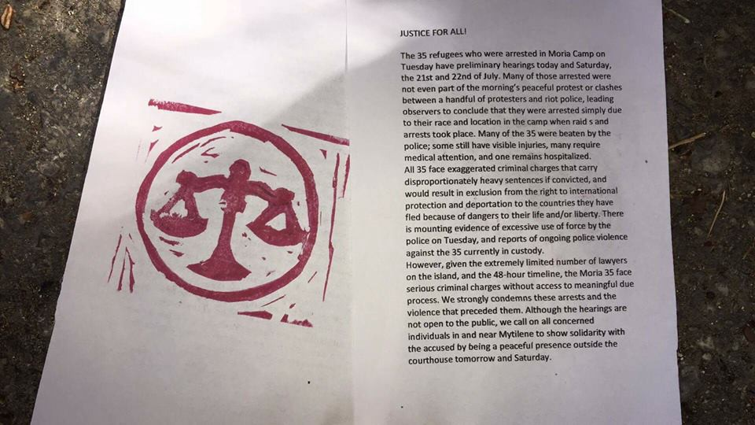
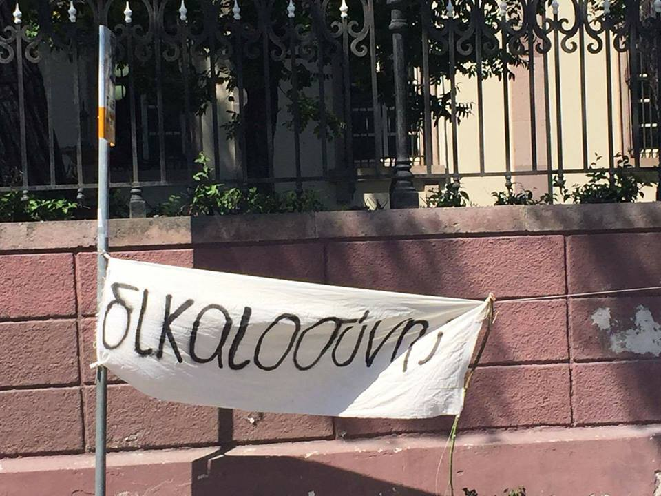
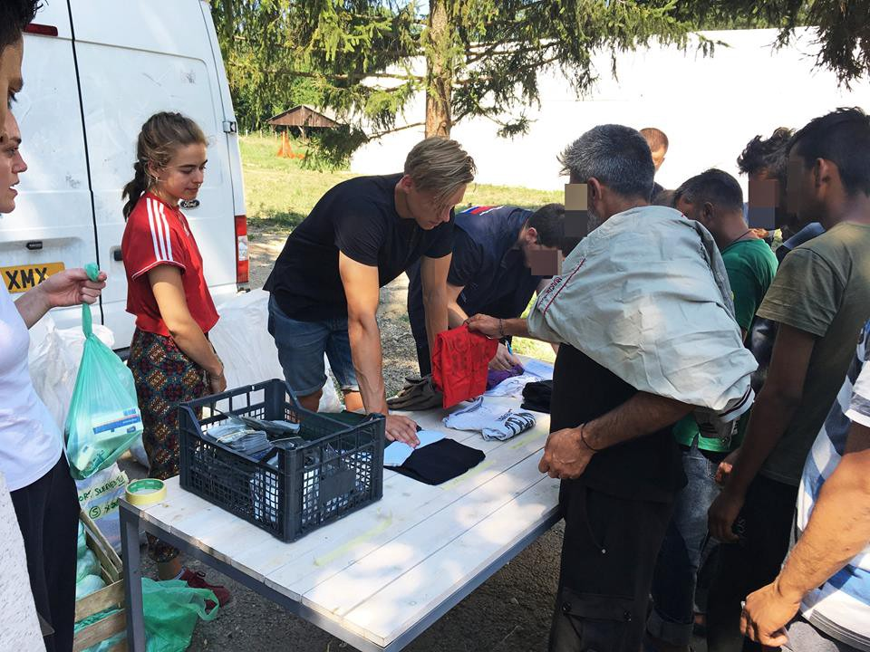
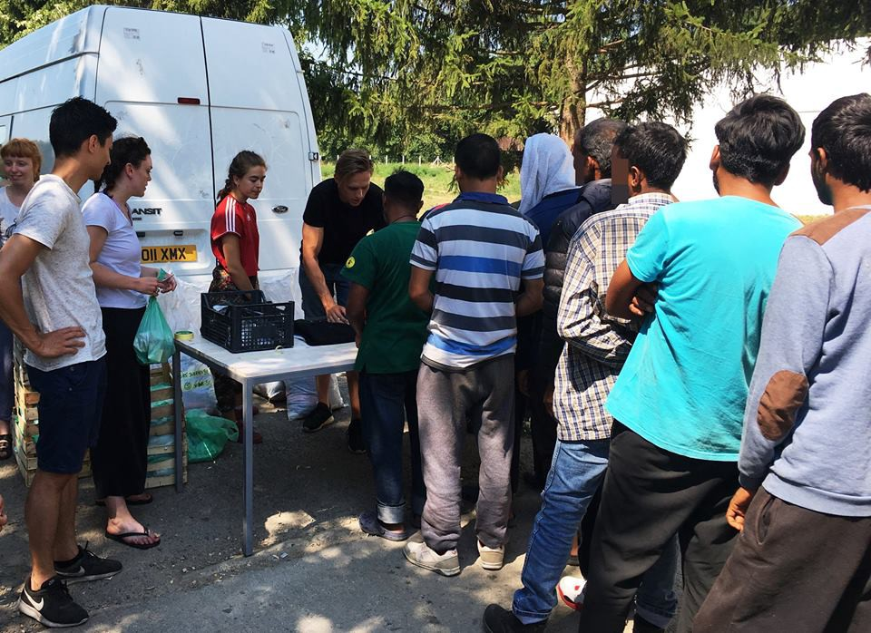
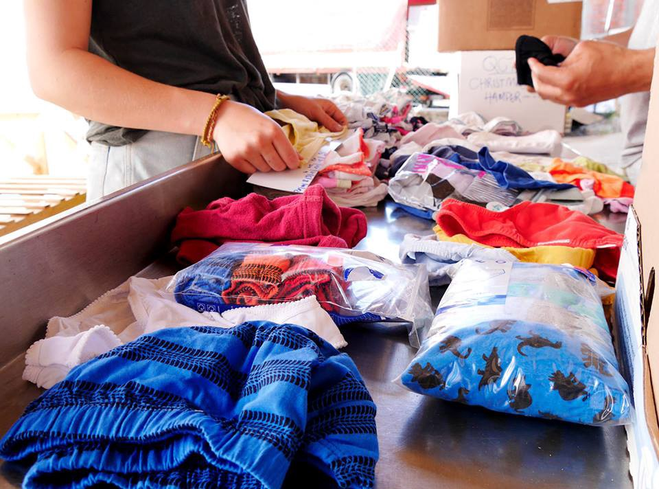
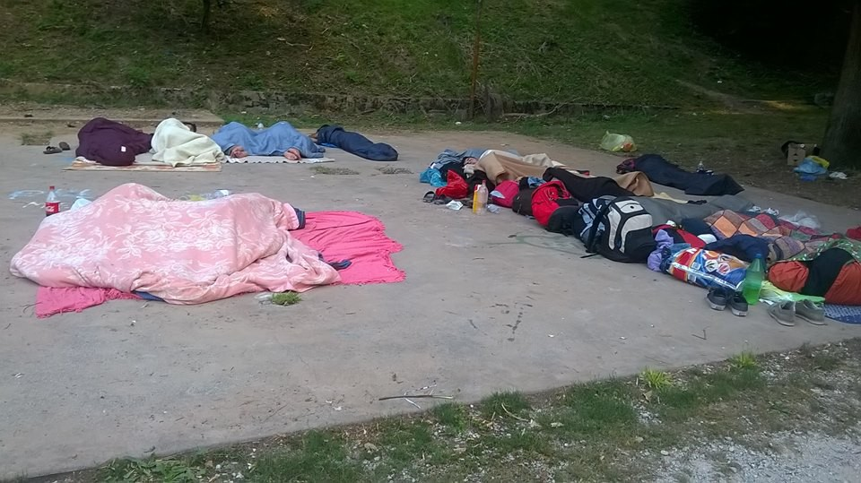

### AYS Daily Digest 21/07/17: Preliminary hearings for the Moria 35

_Aftermath of the Moria detention centre police clashes / Amir Hampay released from prison / Greek authorities criticized for mishandling registration and housing of unaccompanied minors / Lighthouse Relief closing in Lesvos / Calling out for volunteers in Greece / Water scarcity in Serbia / People sleeping rough in Gorizia / And more news…_

From a peaceful protest in Moria today
#### Moria 35

The 35 refugees who were arrested in Moria Camp on Tuesday have preliminary hearings on Friday and Saturday, the 21st and 22nd of July, according to the [press release](http://www.legalcentrelesbos.org/2017/07/20/hearing-tomorrow-at-mytilene-court-for-moria35/) from Legal Centre Lesbos\. They say many of those arrested were not even part of the peaceful protest or clashes between a handful of protesters and riot police, leading observers to conclude that they were arrested simply due to their race and location in the camp when raids and arrests took place\. Many of them were beaten by the police, many require medical attention while one remains hospitalized\. All 35 face exaggerated criminal charges that carry disproportionately heavy sentences if convicted, and would result in exclusion from the right to international protection and deportation to the countries they have fled because of dangers to their life and or liberty, they added\.

> There is mounting evidence of excessive use of force by the police on Tuesday, and reports of ongoing police violence against the 35 currently in custody\. However, given the extremely limited number of lawyers on the island, and the 48\-hour timeline, the Moria 35 face serious criminal charges without access to meaningful due process\. We strongly condemn these arrests and the violence that preceded them\. Although the hearings are not open to the public, we call on all concerned individuals in and near Mytilene to show solidarity with the accused by being a peaceful presence outside the courthouse today and tomorrow\. 

[**Legal Centre Lesbos** ‏](https://twitter.com/lesboslegal) also condemned the police violence and treatment of detainees, saying access to food, water and medical care has been restricted and many remained without shoes\. Preliminary hearings have started without the accused having been given any food, they [wrote](https://twitter.com/lesboslegal/status/888286858521608196) , also calling for a peaceful show of solidarity with the accused outside Mytilene Court\.

Photos from United Rescue Aid

A video was published depicting police beating migrants who revolted on Tuesday, 18/7 due to long delays in examining their asylum claims, but also because of the circumstances in which they are forced to live in Moria\.

#### Solidarity prevails

Finally, a piece of good news from Lesvos\. [Amir Hampay has been released from prison](https://www.facebook.com/arashampay/posts/498476130498478) and he and his brother have stopped their hunger strike\.
#### Lesvos

Human Rights Watch has criticized Greek authorities for mishandling the registration and housing of unaccompanied refugees under the age of 18 on Lesvos, Ekathimerini [reports](http://www.ekathimerini.com/220255/article/ekathimerini/news/unaccompanied-minors-being-wrongly-registered-as-adults) \. “The misidentification of unaccompanied migrant kids on Lesvos as adults leads to real problems, including lumping them together with unrelated adults and denying them the care they need,” said HRW’s Eva Cosse\. Over 1,800 unaccompanied minors were registered arriving in Greece in the first five months of 2017\.

One refugee boat carrying 24 people arrived just before midnight a the North coast of Lesvos yesterday, a volunteer reports\.

#### [**Lighthouse Relief**](https://www.facebook.com/lighthouserelief/?hc_ref=ARRfyv0LbitjhLOporX9tnrpYAXCamiPtOR2eDrATVaQ51YAsCRdNDLHDxPeBTKux2o&fref=nf) closing in Lesvos

After nearly two years of receiving refugees who arrive on the north shore of Lesvos, Lighthouse Relief’s camp in Skala Sikamineas will be closing later this month\.

> Lighthouse Relief is an essential player in north shore emergency coordination activities and will continue to advance an effective and dignified response to the ongoing crisis\. Our team’s 24/7 spotting activities, landing support and assistance in overnight transit will carry on uninterrupted\. As always, we will be ready to adjust our operations if the situation changes rapidly, and are fully prepared to reopen another shoreside camp if it once again becomes necessary to do so, _they wrote\._ 

CALL FOR GERMAN AND ENGLISH TEACHERS

Hora community \(Asklipiou 80\) needs new German and English teachers to take over classes at the end of July\. In total, they hold 25 classes in four languages at a variety of levels for over 200 students every day\! No extensive experience or certification is required, as Khora provides teachers with a flexible curricular structure, teaching resources, and educational support\.

Please contact [Ryan](https://www.facebook.com/ryan.faulkner.14?hc_ref=ARRdjhok1SGIE_kaU1KjEYuDkWA_AAmFc0SYgYK_VFrhRWMl4ETXkVh48AS0qH5bqOc&fref=nf) if you are interested and have any questions\.

VOLUNTEER DRIVERS NEEDED IN ATHENS, GREECE — URGENT

30 July — 15 August \(don’t have to be available the whole time\)

> ICOARM is seeking responsible and confident drivers as volunteers in our Asylum Seeker Transportation Service, in ATHENS, Greece\. ICOARM is running a small\-scale transportation service with one Athens camp\. The service will provide transport to asylum seekers from the camp, to facilitate their attendance at their asylum application interview and workshops at various social centers\. It is also providing means of transport for volunteers with our partner NGOs, delivering legal or medical drop\-in services to camps, squats and urban housing across Greater Athens\. Only asylum seekers legally able to travel via car, having the legal ‘white paper’ document, will be transported\. 

> Requirements:
 

> Must be able to volunteer for a minimum of 1 week
 

> Must have international driver’s licence
 

> Must have experience driving on the right\-hand side of the road \(opposite to U\.K\. and Australia\) 

> The position would suit volunteers who want to volunteer full\-time during their stay in Athens with ICOARM, and also volunteers who are already on the ground and are seeking a volunteering position only part\-time, i\.e\. for one/a few days of the week\. 

If you are interested, please send a message to [ICOARM through their page](https://www.facebook.com/ICOARM.2016/) \.

CLOTHES DONATIONS 
A Drop in the Ocean is now collecting summer clothing\. A market was opened in Skaramagas camp \(approx 3000 residents\) two weeks ago\. Residents in Skaramagas may choose what items they want to shop for\. They are now looking for more summer clothes\.
The list of items most needed:

> Female \(16 years \+ \): bra, leggings, maternity leggings and trousers, underwear, nightwear, short sleeves, dresses and skirts, shoes
 

> Male \(16 years \+ \): underwear, nightwear, long sleeves, short sleeves, shorts, sweatpants, shoes
 

> Girl \(2–15 years\): underwear, tights and leggings, dresses and skirts, nightwear, short sleeves \(6–15 years\), shorts
 

> Boys \(2–15 years\): long sleeves, short sleeves, shorts, trousers, underwear 

Contact A Drop in the Ocean, Athens: Johan Kringlen
tlf 698 489 1298, e\-mail jagk90@gmail\.com

Read more about their shop [here](https://www.drapenihavet.no/no/update-the-drop-market-and-warehouse-after-two-weeks/) \.

CHILD FRIENDLY SPACE IN OINOFYTA CAMP — VOLUNTEERS NEEDED

The aim is to bring recreation that ensures children feel safe and are free from any form of stress\. If you have experience in child protection issues, devising and facilitating activities with a child\-friendly approach, complete the applications at [www\.iamyou\.se/volunteer](http://www.iamyou.se/volunteer)
#### SERBIA
#### Water scarcity

> We, the men, women and children from the Serbian camps desperately need your help… water scarcity is great\. Especially now that temperatures are very hot and rising up to 40°C\. We get pictures from Pirot, a camp near the Bulgarian border\. The water is cloudy and not suitable for drinking\. It’s not the only camp with dirty water\. But at the current high temperatures, water requirements are very high and the polluted water is dangerous in particular for children and expectant mothers\. 

See how you can help [here](https://www.facebook.com/borderfreeassociation/posts/1839219512762038?hc_location=ufi) \.

Hygiene packs were distributed last Friday \(July 14\) to residents of the Kikinda camp and yesterday \(July 21\) in the Sombor camp by BelgrAid\. The supplies will last for approximately one month, after which they will do another distribution\.

Photos by BelgrAid

Donation of men’s pants needed in Belgrade\. If you would like to donate contact [Refugee Aid Serbia](https://www.facebook.com/refugeeaidserbia/?hc_ref=ARQ7lfiSPOnLNM5D9EKi8linjsa13uIlWKJVIRD1ugFjVohHNpgxARvYdLxOEguOYR0&fref=nf) by Monday\. Sizes small and medium are needed most\.
#### SEA

Sea\-Watch carries on with their petition to end EU\-financed violence against refugees and migrants by the Libyan Coastguard\. Show your support and help them reach their goal by signing [here](https://sea-watch.org/en/petition-end-eu-financed-violence-against-refugees-and-migrants-by-the-libyan-coastguard/) \.

> The European policy of isolation has the aim of preventing those with a right to protection from violence and torture from reaching Europe\. To achieve this, the EU even works together with oppressive regimes\. Particularly questionable is the cooperation with the Libyan Coastguard, whose members disregard the international law of the sea and the Geneva Refugee Convention — even though they have been trained for months by European and German marines\. 

#### ITALY

A total of 130 people slept rough in Gorizia last tonight\. They won’t have blankets tonight and food is needed: milk, biscuits, vegetables, beans, tuna, bread…

Photos by local volunteer

Yesterday at the Italian Red Cross Camp there were about 500 people\.
The people housed at the Gianchette centre numbered 73, of which 30 were women who were alone and a dozen unaccompanied minors, [reports](https://www.facebook.com/progetto20k/?hc_ref=ARSPlw8InadSxRTTYQ48Dj9CLPtZSJ55Pl3GpNgoEbK-HCVOpH0CkzV53qadT0f_wJI&fref=nf) Progetto20k\.
#### FRANCE
#### Shoes for Calais

Trench foot is rampant in Calais\. Loan Torondel, coordinator for [L’auberge des migrants international](https://www.facebook.com/laubergedesmigrantsinternational/?fref=mentions) said that “We have zero shoes in the warehouse\. A doctor who visited recently said he was gravely concerned about the feet of the migrants here, many of whom have developed trench foot\.” Only 18 pairs left to to go\!

You can buy shoes for $16/14\.31 Euros at [www\.needslist\.co](https://l.facebook.com/l.php?u=http%3A%2F%2Fwww.needslist.co%2F&h=ATOxY1JtWjvg50-yanX4f7k_JtTYVDMXU4wq2zY46zl7ueNueZwxvQFPSRd3M82XWJbRWShCmvtheeK-ZERYEMtZCx33ZTWZW7x-ySzfEtmW8zRiuu19IJH2CMdrhczeIodYpwKsRxfLV23XUyEfXQQ&enc=AZNUTe3OhlzhDtdFSipyJZ6lYPM5h6cLVCgDU3HRbQlMGBqzWi6P5GWpb6BzMpqQV_5fVs4V7UIOtMinrMtNXz5a26xoMxw8z9iRAiztgwMCE6SZDLVAjDpUwC9zxTo5tFpSIKguVkDnR1O0AOqJprXeoSGCo1iIr8NoXUkRXmTzHgdZnNiSunSzwXJpVEjBio76rgVHAPnj7nQKnWewZ4RK&s=1)

_Converted [Medium Post](https://areyousyrious.medium.com/ays-daily-digest-21-7-2017-preliminary-hearings-for-the-moria-35-2c4db66ec873) by [ZMediumToMarkdown](https://github.com/ZhgChgLi/ZMediumToMarkdown)._
