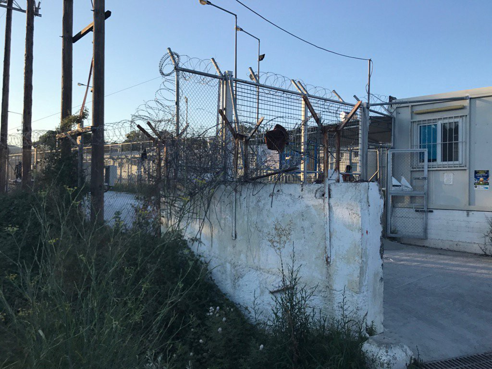
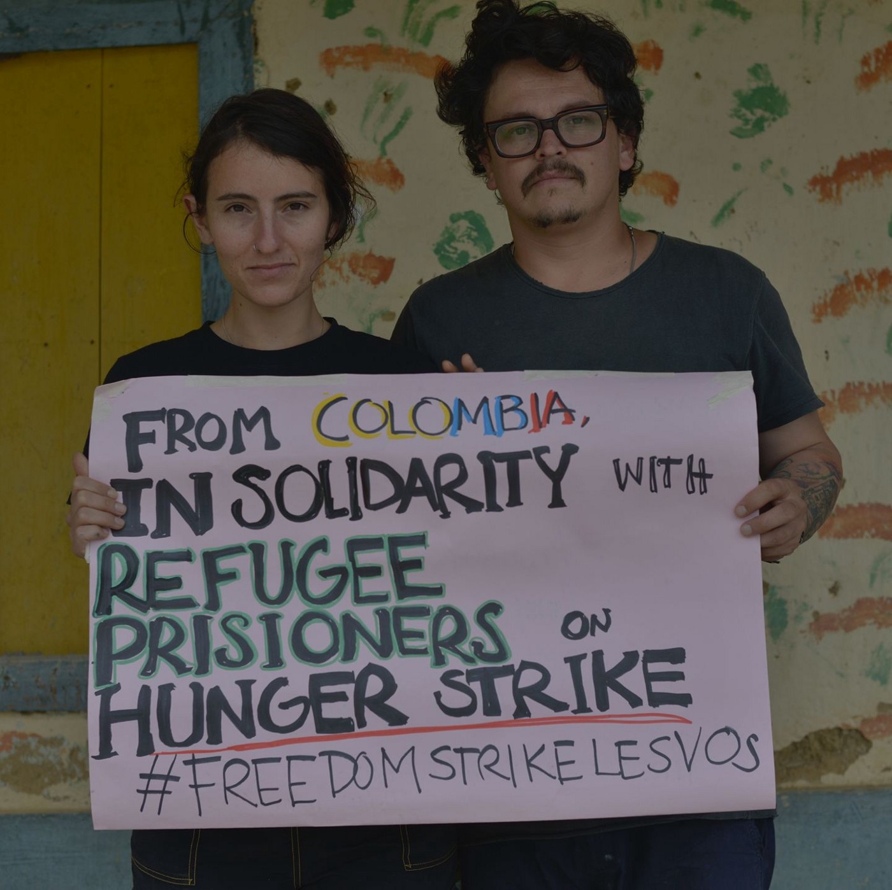
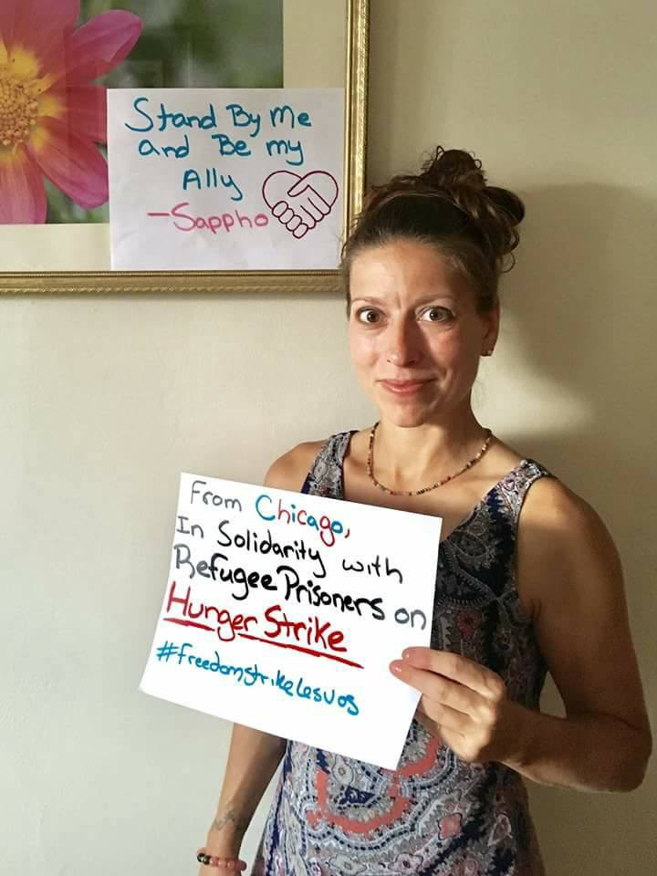
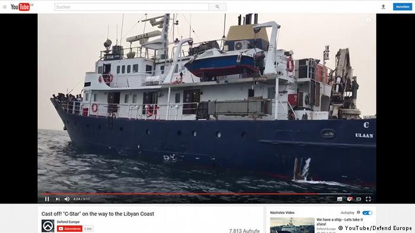
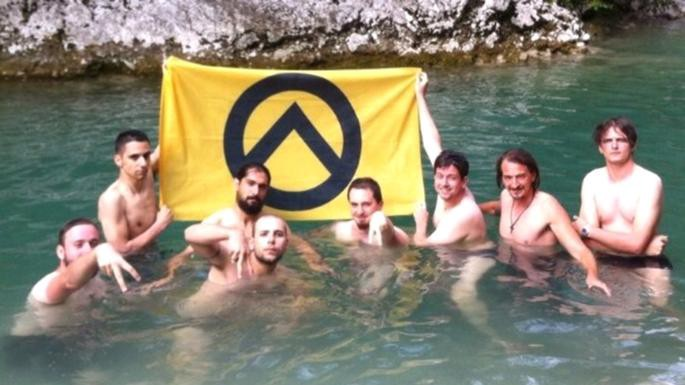
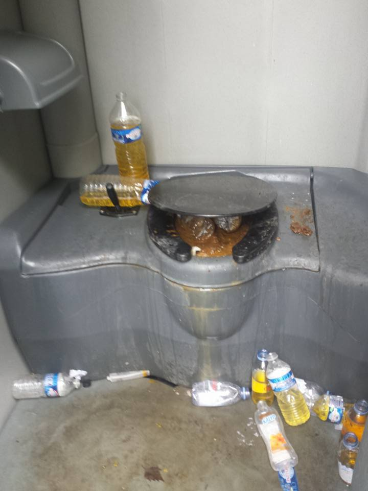
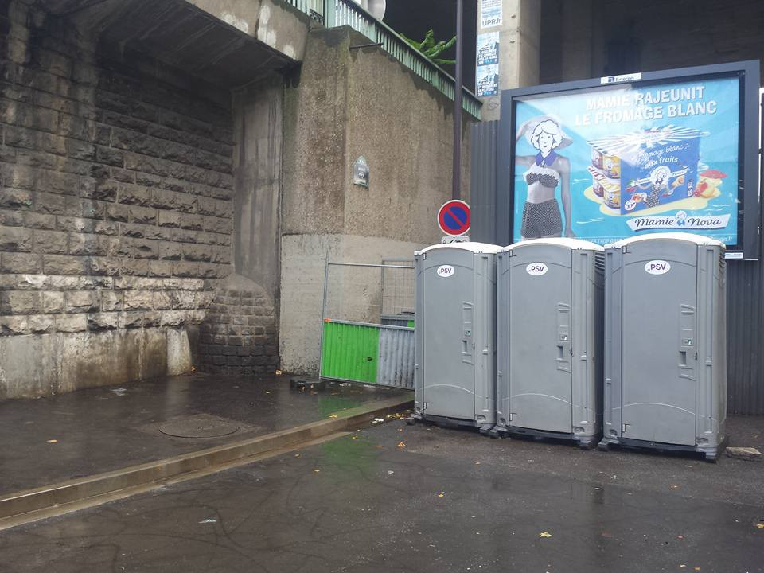

### AYS Daily Digest 24/07/17: Terror and uncertainty on Lesvos

_Police violence at Lesvos, again / Human rights groups are warning about the situation at Lesvos / Hunger strike continues for 27th day / More people in Syria forced to leave their homes / Shameful police acting in Ventimiglia, Italy / Authorities in Paris neglect their duty to provide basic conditions for people who are forced to live on streets / And more news…_

Moria, Lesvos\. @MigrnatVoiceUK
### Feature
#### EU and Greece are failing to provide protection for people in need

Early this morning, around 4, Greek riot police started another raid in Moria camp and neighboring community centers at Lesvos\. Between 50 and 60 people have been detained and they are facing immediate deportation\. Some of them are people whose asylum cases have been rejected on appeal, but for the most part, it is not clear why these arrests were made\.

According to [Enough is Enough group](https://enoughisenough14.org/2017/07/24/refugeesgr-large-scale-police-operation-at-moria-hunger-strike-continues/) , police was searching 
for people who participated in last week protests in the Moria prison\.

[Volunteer groups are reporting](https://www.facebook.com/mosaiksupportcenter/?hc_ref=ARSzbmbRneR7qiu1lgu1tTdV3B2-tKCTlOXguRERL0AIDr7g6JMTMNPyPZaTBo52Mvs) that the general climate in Mytilini is one of terror and uncertainty\.

People at Lesvos carefully avoided public transport today, because the police were also checking it\.

At the same time with the raid, [new MSF report](http://www.msf.org/en/article/greece-dramatic-deterioration-asylum-seekers-lesbos) — [A dramatic deterioration for asylum seekers on Lesvos](http://www.msf.org/en/article/greece-dramatic-deterioration-asylum-seekers-lesbos) — came out pointing to _“the drastic deterioration of the care and protection”_ for vulnerable people in Lesvos\.

_“Vulnerable people are falling through the cracks and are not been adequately identified and cared for,”_ said Emilie Rouvroy, MSF head of mission\.

The report is based on MSF medical data and the testimonies of patients, and it shows the recent drastic cuts in providing health care on the island, along with reductions in legal aid, and the closure of shelters and other essential services\. It claims that the EU and Greek policies _“continue to limit much\-needed protection and care for vulnerable people in Greece”_ \.

At the moment, people who are arriving at Lesvos are sitting in Moria camp in soaring temperatures, neglected, while tensions are rising every day\. _“The alarm bells are ringing now,”_ MSF warns\.

[The Human Rights Watch \(HRW\) also accused the Greek authorities](https://www.hrw.org/video-photos/video/2017/07/19/video-greece-should-protect-lone-migrant-children) _“of mishandling the registration and housing of unaccompanied refugees under the age of 18 on the island of Lesbos”_ \. The organization claims that unaccompanied children who are arriving on Lesvos are being _“incorrectly identified as adults and housed with unrelated adults, leaving them vulnerable to abuse and unable to access the specific care they need”_ \.

As of June 20, 1,149 unaccompanied children were on the waiting list for shelter, including 296 detained in such facilities, according to HRW\.

_“The problem has grown more acute since the arrival of more than 1 million people in the Greek islands in 2015 and 2016; border closures in countries to the north have effectively trapped asylum seekers and migrants in Greece, and a deeply flawed EU deal with Turkey, signed in March 2016, has led Greece to restrict asylum seekers to the Greek islands with the aim of returning them to Turkey,”_ according to HRW’s statement\.

NGOs on Lesbos have identified at least 60 people registered as adults who claim to be children\.

Luckily, people all over the world care much more for humanity than their leaders\. On Monday it was the 27th day of a hunger strike by imprisoned asylum seekers on the island, and Day 6 of the Solidarity Activists Lesvos \#freedomstrikelesvos in solidarity with their call for justice, freedom and dignity\. Join the action and show the solidarity still exists\.

Solidarity still exists\. \#freedomstrikelesvos
### Syria

In Syria, not many signs of improvement of the situation\. In the area of Ar\-Raqqa Governorate, it is estimated that 202,702 people have been displaced since 1 April, including 32,510 since 1 June\.

As of 11 July, estimates indicate that between 20,000 and 50,000 people remain inside Raqqa city, [according to the UN](http://reliefweb.int/sites/reliefweb.int/files/resources/raqqa_weekly_sit_rep_12_july_1-14.pdf) \.
### Greece

New arrivals have been registered in Greece; this time to port in Kymi, the island of Euboea, where 51 people arrived\. All the people, with the help of the coastal guard, were taken to the local gymnasium\. At this island, there is no refugee reception infrastructure, and this is probably the very first arrival there, and [the solidarity group from the neighboring city is calling for help](https://www.facebook.com/groups/PAMPIRAIKI/permalink/501379626872813/) \.

Help is needed at the camp Skaramangas, Athens\. [Dråpen i Havet group calls for donations in summer clothes](https://www.facebook.com/drapenihavet/posts/1750268538323921) \.

> “Out of respect for the residents, we want to offer only the best\-quality clothes; preferably new clothes\. This is particularly important for essential items such as underwear and bras\. We politely request that donors refrain from donating non\-conservative clothing \(e\.g\. low\-cut and short tops\) \.
 

> If you are able to help, contact them directly [athen@drapenihavet\.no](mailto:athen@drapenihavet.no) , cc: [jagk90@gmail\.com](mailto:jagk90@gmail.com) \. 

### Sea

Another busy day at the sea where hundreds of people have been saved by boats run by different NGOs\. In one of the actions, they brought to safety 298 people\.

**We should never forget that people who are rescued have names, faces, families, friends, dreams, strengths, and flaws, like everybody else\.**

Yet, we have to remind you about the insane group called the Identitarians’ who have a ship and is sailing again to the central Mediterranean to interrupt rescue operations and transport the refugees and/or immigrants back to Libya\.

This is an extreme right\-wing group who is willing to kill people, perhaps not with weapons but simply by dumping their boats\.

Identitarians
### Italy

While Identitarians are obviously the self organized group, police in any country cannot afford to act in the same way as them\. Unfortunately, it is happening all over Europe, every day\. The latest example is from the inside of the Ventimiglia train station where one police officer was caught on camera screeming at one person saying, among other things, “go to your country”\. Unfortunately, it is nothing new and we keep receiving information about huge violations of basic human right in the heart of EU\.

Progeto20 group reports about the _“enormous number of children”_ who are illegally rejected at the border and do not receive any kind help, while hundreds of people live in substantial poverty, in the absence of suitable legal, health and social services\.

_“Ventimiglia is this: a territory crossed by violations and injustice\. At the same time, there is every day the relentless desire for the transit of migrants and migrants\.”_
### France

The situation is not much better in France\. One of the volunteers from Paris shared today photos from Saint Denis showing conditions of sanitary provisions in this area\. Authorities have the obligation to provide decent conditions, but they fail to do so\. The authorities place 6 toilets for the use of over 550 people\.

A number of people at Porte de la Chapelle is rising again and help is needed\.

_“With this big influx of new arrivals, consistently providing a safe space is invaluable\. The ‘Porte de la Chapelle Museum of Art’ is open once again and growing daily\. We are distributing large quantities of tea coffee and information\- help us to keep up with demand\.”_

If you cannot go there and join volunteers, [see what they need to help to people who are sleeping on the streets](https://www.youcaring.com/solidarithe) \.

Refugee Youth Service needs help, too\.

_“Working to keep track with vulnerable young people on the move is one of the key aspects of our work in Calais\. Life on the street means it’s hard to keep a hold of them, young people report their phones being damaged or confiscated by police, adults steal them from the young people and they get easily damaged\._

_€10 means we can buy a young person a phone, €7 means we can buy a sim card pre loaded with credit\. We want to raise £1000 rapidly cover the urgent need\. Minors leaving for Paris or other cities, minors with legal cases, teenaged girls, young people stuck in the hospital all need more phones in their hand rapidly, the need is greater than we can provide at present\._

_P [lease donate here](https://mydonate.bt.com/events/mobileyouthcentre) and leave a comment stating it’s for phones and we will get this to those in need\.”_

> **We strive to echo correct news from the ground through collaboration and fairness, so let us know if something you read here is not right\.** 

> **If there is anything you want to share, contact us on Facebook or write to: areyousyrious@gmail\.com\.** 

_Converted [Medium Post](https://areyousyrious.medium.com/ays-daily-digest-24-07-2017-terror-and-uncertainty-on-lesvos-d8f7de15942b) by [ZMediumToMarkdown](https://github.com/ZhgChgLi/ZMediumToMarkdown)._
