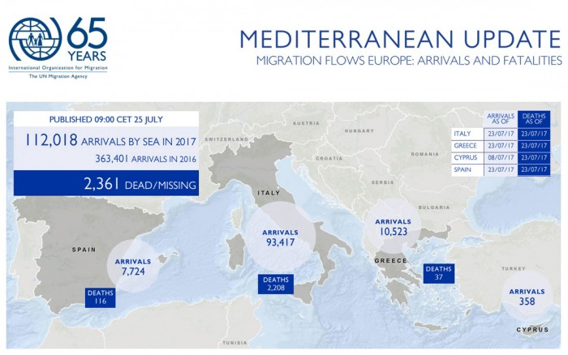

### AYS Daily Digest 25/07/17: Citizens versus politics in France

_Mistreatment of refugees by police following Moria protests / More than 2,300 people dead in the Mediterranean this year / Awaiting a judgement in the Austria\-Croatia Dublin III case / Organizations in France to hold a conference on inclusive and humane welcoming of refugees / And more news…_

 \)](assets/695947d3c6d8/1*A9O3pCGFIzr4R6KWHQVz5w.jpeg)

DUBLIN/C: C\-490/16 C\-646/16—26 July, 9:30 a\.m\.: The European Court in Luxembourg’s rule on 700 “Dublin deportations” from Austria to Croatia\. \(Photo by [Border Crossing Spielfeld](https://www.facebook.com/RefugeesSpielfeld/?hc_ref=ARRgxXrKRSHgZ3iD-h4mIjwk7S-GRIwYzTRQBfqwMR_75fLkJlAIDOBH0-dEw8ynkHw&fref=nf) \)
### FEATURE: French initiative to focus on inclusive and humane welcome for refugees

A total of 275 French organizations and collectives working in solidarity with refugees, migrants, and asylum seekers will gather soon at a national conference focusing on immigration\.

Currently, neither their expertise from working in the field, nor citizens’ will to advocate for a dignified welcome are recognized by the public officials in power\. Just the opposite: these individuals and groups have an incredible amount of obstacles in their way, that is, if their work has not been completely stopped because of them being pursued for—and accused of—solidarity\.
Although OFPRA’s director has recently made statements in support of a quick and fair asylum process, the organization’s work comes short of being supportive\.

A great number of refugees who have asked for asylum in France have spoken to us about the way they were \(and still are\) treated by the Office’s officials\. Their greatest obstacle and problem during the procedure is the interview, where they say they felt as if the main objective is to doubt, question, oppose, and discredit their stories, experiences, and the paths that led them to the long waiting and demeaning conditions in which they were left to wonder for months and months\. This was so even though the officials claim the procedure time has become much shorter\. Arguably long periods of waiting to be called for an interview or to receive an answer, combined with a worrying lack of accommodation and the fact that most of their lives are “on hold” as they cannot study, work, or stop their reliance on the fallible system, all creates an atmosphere of mistrust and despair, and leads to the conclusion that the country is not only a bad solidarity neighbour of Italy—who has only this year welcomed on its soil more than 90,000 people—but is also officially reluctant to provide a warm welcome for new arrivals\.

After the 470 organizations active in welcoming and helping refugees in France had sent a letter to the president and government last June, titled [Appel à un changement radical de politique migratoire en France](https://blogs.mediapart.fr/les-invites-de-mediapart/blog/150617/un-appel-un-changement-radical-de-politique-migratoire-en-france) , they now insist through organized meetings and common rhetoric to create a [prof a welcoming](https://blogs.mediapart.fr/les-invites-de-mediapart/blog/250717/rebours-du-plan-migrants-la-societe-civile-se-rassemble?utm_source=facebook&utm_medium=social&utm_campaign=Sharing&xtor=CS3-66) political environment in line with the values of solidarity and humanity that many people in France cherish\.

In the meantime, we will continue hearing about [walls being built to prevent a migrant centre from opening](https://www.thelocal.fr/20170724/protesters-in-france-wall-off-access-to-disused-hotel-to-protest-migrant-shelter-plans) , police violence against refugees, monitoring and frequently taking into custody many volunteers and people running from women’s and children’s centres etc\., destroying food donations, and [threatening those who organize distributions](https://calaismigrantsolidarity.wordpress.com/2017/07/25/recent-police-attacks-on-distributions/) … and only occasional inspiring stories and initiatives made possible thanks to the individual efforts of the many people working hard on the ground\.
### SEA
#### Boat found floating with 13 people who had lost their lives

13 people, including pregnant women, were found dead on a vessel close to the Libyan coast\. They were among an estimated 150 people that had set off towards Italy, completing a number of 112,018 people who have reached the coasts of Europe this year, and 2,361 people who have lost their lives in attempt to save them\.
### EGYPT

Egyptian authorities detained approximately 3,000 “irregular migrants” in the first half of 2017 as part of their effort to fight illegal migration to Europe\. At the same time, officials have refused any EU backing to open detention centres, sources [say\.](http://www.infomigrants.net/en/post/4290/3-000-irregular-migrants-detained-in-egypt-in-2017)
### GREECE
#### New arrivals

58 new arrivals were registered today on the island of Samos\.
#### A statement from Lesbos’ No Border team

> _Daily Routine of Injustice_ 

> Yesterday morning at 5 o’clock, riot police started to detain people in Camp Moria and in Community centers\. They arrested around 50 persons of whom 20–25 persons were released later today\.
 

> First we assumed that they were hunting for people with two negative asylum decisions but as we found out they also arrested people with papers\.
 

> We think this happened for one reason: To raise fear\.
 

> Again they want to raise dread of deportation and detention among people, to increase suppression and by doing so, preventing the people to ask for their basic human rights\.
 

> We believe this, together with the super unjust court hearings that are going on these days in Mytilini court \(we will publish an update about that soon\! \) are all to create an atmosphere of anxiety on the island\.
 

> We wish strength to all the people still detained in the police station and Moria’s section B and other places worldwide to not give up the struggle for freedom\. 

According to [volunteers](https://www.facebook.com/mosaiksupportcenter/?hc_ref=ARSidrv3RjalRLdmtUZnLYxKTbZd6GlxxXOT2t4zaC9xfKylDsb9zxVnWeHHwu96JPs&fref=nf) , many among the [refugees arrested have filed complaints](http://www.efsyn.gr/arthro/minyseis-kata-astynomikon-gia-orgio-xylodarmon) against the police for abuse of power and excessive use of force during their arrest and at police headquarters:

> P\., a 23 year\-old man from Cameroon was encircled by ten policemen who beat him to the ground, spitting in his face when he was handcuffed; 

> D\. S\. a 21 year\-old man from Cameroon stated that when he entered the police station, six policemen cornered him and beat him, stopping only when a colleague intervened to remind them that the police station is under camera surveillance; 

> N\., a 27 year\-old man from Senegal, reported that a police man put on a ring before punching him in the eye; 

> B\., an 18 year\-old man from Mali, who is asthmatic, remained in his container for the duration of the protest and was arrested together with others\. As they lay face\-down on the floor, he lifted his head from the ground to breathe better and was kicked down by a police officer\. 
 

> Another man shot in the lungs with a tear gas canister at point\-blank range remains in the hospital in serious condition\. 

No Border’s original statement can be read in full [here](https://noborderkitchenlesvos.noblogs.org/post/2017/07/25/daily-routine-of-injustice/) \.
#### Translators wanted on Chios

[Refugee Education Chios](https://www.facebook.com/refugeeeducationchios/?hc_ref=ARQ8R-nVdDbdEyI1EeKI4d7VB8pur5sz6zhdDU9OFTwB6NWvz9H04-TPaN5xiDnFtZM&fref=nf) is looking for Arabic and Farsi speakers to join their team from September\.

Those interested in joining the team are encouraged to write to: nicholas@baas\-schweiz\.ch\.

“Thanks to the initiative of a 14\-year\-old refugee boy who started planting fruits, vegetables, and edible plants outside his container, Eleonas’ streets are becoming greener and greener\! — Project Elea” \(Photo by Campfire Innovation\)
#### Athens

Ali Rahimi, an [Afghan](https://www.hrw.org/asia/afghanistan) asylum seeker, [waited six years for justice](https://www.hrw.org/news/2017/07/25/alis-long-wait-justice-greece) after being stabbed in [Greece](https://www.hrw.org/europe/central-asia/greece) , Human Rights Watch [reports](https://www.hrw.org/the-day-in-human-rights/2017/07/25) \.

Rahimi finally received the justice he deserved as an Athens court this week [convicted](https://www.hrw.org/news/2011/12/12/greece-rare-hate-crime-trial-opens) Ali’s attackers\. The court pointed out that today’s victims in similar cases of xenophonic violence should not have to wait this long for justice\.

 \)](assets/695947d3c6d8/1*a8Q4VtCOCm0s17v4wkeHfQ.jpeg)

“What is at stake is nothing less than the survival and well being of a generation of innocents\. When the larger NGOs pull their services due to funding cuts a lot of gaps will need to be covered and we intend on meeting the immediate needs of our refugee friends here in Greece that have been through so much\.” \(Photo: [Collective Calling](https://www.facebook.com/CollectiveCalling/) \)
### BULGARIA

Center for Legal Aid — Voice in Bulgaria \(CLA\) and Bulgarian Lawyers for Human Rights \(BLHR\) submitted to the Council of Ministers of Bulgaria a joint statement on the Bill to Amend and Complement the Ministry of Interior Act \(the Bill\), CLA [reports](http://detainedinbg.com/blog/2017/07/25/center-for-legal-aid-voice-in-bulgaria-and-blhr-with-a-joint-statement-on-a-proposed-bill-regarding-detention-of-foreign-nationals/) \. The Bill envisions also important changes in the Law on the Foreigners in Bulgaria \(LFRB\) that concern the detention of foreign nationals in the country, and new alternatives to detention\. In spite of these unarguably positive changes proposed in the Bill, the CLA and BLHR are of the opinion that it also contains a number of proposed amendments that are in violation of international and European legal standards, and raise serious concerns\. See detailed story [here](http://detainedinbg.com/blog/2017/07/25/center-for-legal-aid-voice-in-bulgaria-and-blhr-with-a-joint-statement-on-a-proposed-bill-regarding-detention-of-foreign-nationals/) \.
### SERBIA

Besides preparing two meals every day, No Name Kitchen has recently acquired a warehouse with the purpose of providing clothing items for people on the move\.

> The kitchen is not only a place to distribute food and clothes, but also a social hub, a meeting point to share stories, play games, learn languages etc\. We are trying our best to optimize every resource we have \(we are now building a charging station with a 2 solar panel and 8 batteries so they can charge their phones\) \.
 

> Along with donations, every hand is needed to move forward, so contact us if you want to volunteer\! 

Infographics: IOM
### ITALY
#### New arrivals

[MEDU — Medici per i Diritti Umani](https://www.facebook.com/MEDUonlus/?hc_ref=ART3xK34LkTZc4WcK0zM3BeSzVl4A7nwbEn5TnKRvg5CLry5xOTYzqDKvLkJeI2-RN4) report that 419 people who came from the Libyan coasts were saved and brought to the port of Pozzallo\.
They come from: Nigeria\(86\) Guinea Conakry \(98\) Camerun \(45\) Ghana\(39\) Bangladesh \(61\) Sudan \(16\) Senegal \(13\) Libia \(15\) Egitto \(12\) Liberia, Niger, Gambia, Repubblica Democratica del Congo, Palestina, Sierra Leone, Mali etc\.
[IOM](http://migration.iom.int/europe/) Rome reports 9,396 sea arrivals to Italy this month through 23 July\.
#### Search and rescue activity in the central Mediterranean Sea — May report

Number of Search and Rescue operations coordinated by the Italian Maritime Rescue Coordination Center: 196

Number of persons rescued under the coordination of the I\.M\.R\.C\.C\.: 22\.698

See the entire report [here](http://www.guardiacostiera.gov.it/attivita/Documents/attivita-sar-immigrazione-2017/Maggio%20eng.pdf) \.
#### Initiative in San Ferdinando

Scabies, vomiting, diarrhea, strong back pain and rash are among the most present health issues of the refugees in San Ferdinando\. 
This is a conclusion after the first day of many visits to the sanitary point provided by the [volunteers](https://www.facebook.com/Collettivo-Mamadou-1711634685756321/?hc_ref=ARR5YcyxzxFQxjSpucdM0IcKX-kuVGiFw-LqqO7Wzw02icYVqYYqonxLqlJWqepLFgA) \. They are in great need of help, donations and medical contributions\.
In spite of the inadequate space and lack of means, many residents took part in the first Italian classes organized there today\.

 \)](assets/695947d3c6d8/1*Rw8p6JXoU7QbXXnJOXpOcw.jpeg)

\(Photo: [Collettivo Mamadou](https://www.facebook.com/Collettivo-Mamadou-1711634685756321/) \)

UNICEF claims that in 6 months, **12,239 migrants under the age of 18 have arrived in Italy, 93% of them are unaccompanied minors** \. They seem to leave voluntarily their countries and do not envision Europe as their final destination, the [report says](http://tg24.sky.it/cronaca/2017/07/25/migranti-minori-italia-grecia-studio-unicef.html) \. The most traumatic part of the journey is Libya\.
### AUSTRIA
#### 700 refugees deported from Austria to Croatia — illegal or legal decision?

Tomorrow, July 26, at 9:30 a\.m\. the judgement at the European Court in Luxemburg will be announced in the case questioning the decisions of deportations under the Dublin agreement of the people from Syria, Iraq, Afghanistan and Iran who have in the past year and until today been deported to Zagreb and Kutina refugee centres in Croatia\.
### FRANCE
#### Food needed

[La cuisine des migrants](https://www.facebook.com/La-cuisine-des-migrants-1949989845015049/?hc_ref=ARQtRxWD4VU1ae3eZg4qC86FqW1MXmj6iszRwgrjuYxeno0G6sx5f7G13jNYNyvNO_E&fref=nf) distributes 200\-250 meals during a day\. If you want to help them, here is what they need:
- onions, oil, spices, tinned tomatos, tomato concentrate, dry vegetables, all canned vegetables, potatos, carrots and other fresh vegetables, fresh fruits, pasta, cous cous
- table spoons, cups — plastic
- tea, coffee, sugar, biscuits are always welcome for the evening distribution

All donations can be brought to 4 rue Jean et Marie Moinon Paris 10e, Mon — Wed, from 9 h to15 h, or [donate online](https://www.lepotcommun.fr/pot/wigl23p3) \.
#### Border locals demand better treatment of refugees

Refugees accompanied by the locals of the Roya valley have taken a train and gathered in Nice to demand that these people’s rights be respected and their asylum requests be looked into with no further hesitation\. 
Even though the local community has been supportive and has helped these people during the difficult weeks of stay at the French\-Italian border, they say the conditions are deteriorating and something must be done as soon as possible\.

“We can’t remain indifferent towards the many people in this country, be it those in Calais, under the bridges in paris or in la Roya, France is not fulfilling its international obligations\. It is not done by chasing the refugees, in attempts to block their path and criminalizing those who come to their aid, this crisis must be solved\.”

 \)](assets/695947d3c6d8/1*BUyVbfj8Qg6lRD4UGw9xoA.jpeg)

La Roya / Nice \(Photos: [José Bové](https://www.facebook.com/BoveJose/?hc_ref=ARQ7bYE5zgkJGpUS9r9s5w7LE8oZ3Th74hYNkNSHilCjMSlyrc1HmNSfc0yyoFDoOGk) \)
### SPAIN

Salvamento Maritimo, the Spanish government’s sea rescue arm, has reported the 23 July rescue of 44 men, three women and one minor from two small boats located in the Sea of Alboran\. They were said to be from Morocco and various nations of sub\-Saharan Africa\. 
Their arrival brings total sea rescues off Spain in 2017 to 7,774, IOM said\.

> **We strive to echo correct news from the ground through collaboration and fairness, so let us know if something you read here is not right\.** 

> **If there is anything you want to share, contact us on Facebook or write to: areyousyrious@gmail\.com\.** 

_Converted [Medium Post](https://areyousyrious.medium.com/ays-daily-digest-25-7-17-citizens-vs-politics-in-france-695947d3c6d8) by [ZMediumToMarkdown](https://github.com/ZhgChgLi/ZMediumToMarkdown)._
