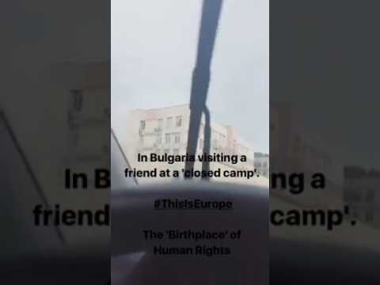
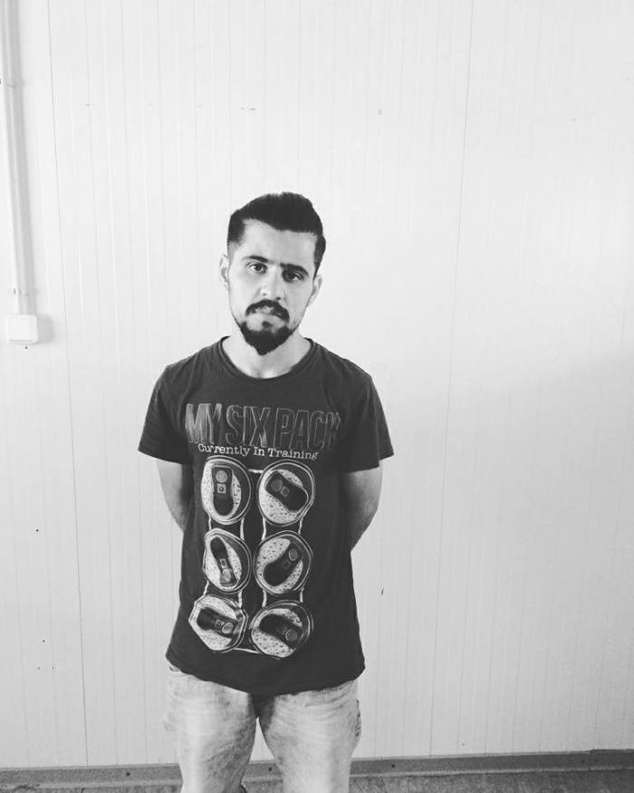
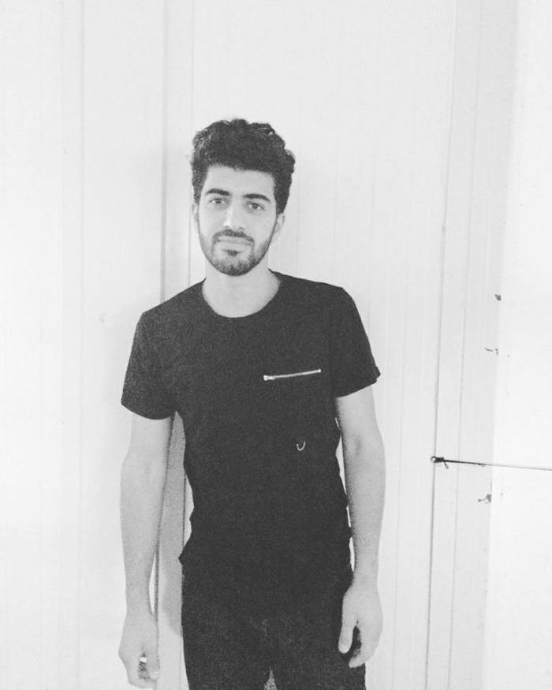
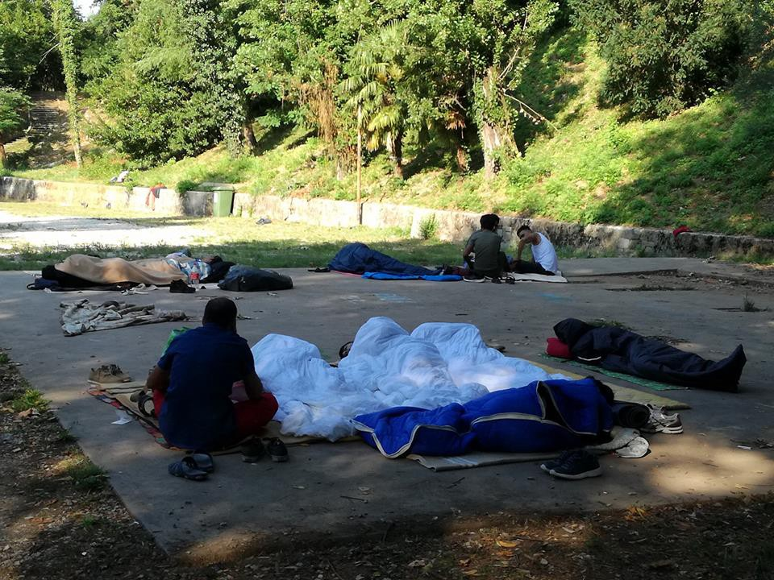

### AYS Daily Digest 28/07/17: Europe — The ‘birthplace’ of human rights

_Europe — the ‘birthplace’ of human rights / More deaths in the Aegean Day 30 of the Moria hunger strike / Amnesty call for investigation into use of excessive force by police in Moria / Police start ‘Sanitization’ of Valletta / Bomb attack in Sardinia / Attempted suicide in Zagreb / Refugee Convention anniversary / And more news…_
### FEATURE: Europe — The ‘birthplace’ of human rights

What follows is the testimony of a volunteer who visits a friend in a closed camp in Bulgaria:

> I rang the buzzer and waited as the deadbolt slid on the other side of the metal door\. They searched my belongings and informed me that the visiting days are Wednesday and Thursday, 9am — 4pm\. In addition, one must call beforehand \( \+359 2 982 5706\) to schedule a visit\. The camp manager came out and after some pleading and agreed to let me visit my friend, even though I didn’t have an appointment\. My mobile and passport were held at the front gate, and I was escorted through yet another metal door\. Once in the courtyard, I looked up at the men sitting on windowsills behind bars\. Their clothing was drying on the horizontal bars and blank eyes looked back at me with vague curiosity\. 

> I walked up the stairs in the building across from their cells and waited for my friend with two other men who were also visiting people\. Inside, there were three identical posters, but in different languages\. Each of them said, “For more information about returning to your home country, contact a camp official\.” Inside the next doorway was another set of stairs on which appeared three pairs of small feet\. A mother and her two children from Afghanistan went to the visiting room with the Bulgarian men accompanied by a police officer\. I continued to wait and spoke with a young man, also from Afghanistan\. I watched as a Bulgarian woman answered questions from two other men in broken English until one refugee came and translated from their native language into Bulgarian\. 

> It started raining, and I went outside to look up at the small window of sky within the courtyard\. There was a basketball court with missing hoops\. It was impossible to escape the gaze of the cameras\. My friend appeared out of the rain, smiling\. He was thinner, but seemed to be in better spirits than I expected\. We went, escorted by a big policeman, into the meeting room\. Over the course of our conversation, I handed him a SIM card and money I had picked up from Western Union\. At that time the guy came over, checked how much money I had given him, and opened the SIM card\. We sat together reminiscing about Serbia, and talked about his friends who had made it and those that had gone back to their home countries\. After, he said, “here is not good, but in two weeks maybe one month I will go back, and then everything will be OK\.” The policewoman came inside and gruffly said that our time was up\. As we walked down the hallway together, he said he was so ashamed he was not able to offer me a cup of coffee or a cup of tea\. “Please come to my country,” he said, “I want you to know where I am from\. It is not like here\.” 

### **TURKEY**

On Thursday seven people died after a boat sank off Turkey’s Aegean coast while trying to reach the Greek Islands\. The [Coast Guard reports](http://aa.com.tr/en/turkey/7-refugees-dead-as-boat-capsizes-off-turkish-coast/871175) that of those who drowned two were women and five were children\.

The boat was carrying eighteen people in total and capsized at approximately 9pm\. The survivors were taken by the Coast Guard to Cesme State Hospital in Turkey\. One person is still missing\.
### **SEA**

AlarmPhone have released a [report](https://alarmphone.org/en/2017/07/27/while-the-world-looks-to-g20-in-hamburg-hundreds-drown-at-sea-watchthemed-alarm-phone-6-week-report-12th-june-23rd-july-2017/?post_type_release_type=post) covering the period from 12th June to 23rd July, encompassing the time during which the G20 summit took place\. The member states of the G20 are also the states which maintain the current situation which leads to deaths at sea, inhumane living conditions for thousands of people waiting for the asylum processes, and no clear pathway towards ensuring the human rights of those seeking safety in Europe\.

> “This year’s official death count stands at 2365 fatalities at sea\. \[5\] These 2365 individuals lost their lives because of the bordered state of the world\. Hegemonic governments, including those of the EU, profit from both the creation of untenable living conditions in many parts of the world and the simultaneous criminalisation and deterrence of precarious travelers\.” 

### **GREECE**
#### **Registrations**

The registration numbers for today were as follows:

Lesbos: 148

Samos: 152

Others: 41

Total: 341

This is the first time this year that more than 300 people were registered in one day\. The second busiest day was 251 at 18/7\. On five occasions this year, more than 100 people arrived on Lesbos simultaneously, and on two occasions this happened on Samos\.

With this large number of new registrations there are 2093 in July and therefore now more than in June \(2029\) \.

Since the deal implementation, Lesvos has seen more than 15,000 new arrivals to date, Samos 6000 \(and Chios 10,000, but there were fewer than 100 arrivals this month\) \.
#### **Residence Permits**

Guidelines for completing the online application for a renewed residence permit can be found [here](http://asylo.gov.gr/en/?page_id=2498) \. The form is available in Arabic, Urdu, Farsi, Tigrinya, Greek, French and English\.
#### **Lesbos: Statement on day 30 on the Hunger Strike in Moria**

> “Once again I went to Moria today to give sugar and salt to the refugees on hunger strike\. Once again, despite my insistence, the police prevented me from doing so\. One month of hunger strike\. They need sugar, salt, and juice\. Their lives are in danger\. The Police in Moria told me that I was only permitted to give them cigarettes\. The Police did not even allow me to see them from a distance\.” 

Images by Arash Hampay

> “Bahrooz and Kozhin do not want to commit suicide\. They are not crazy\. They are two young Kurdish men\. They are smart and handsome\. They are in love with life\. They understand and appreciate the essence of beauty and the joy of life\. This is the very reason why they do not kneel and submit to oppression and injustice\. They desire life\. This is the final hurdle of their struggle for that life\. Their very hunger is the key that will open the gates of the prison\. A prison into which they have been forced\.” 

#### **Lesbos: Free the Moria 35 and Call from Amnesty International for Investigation into Police Brutality at 18th of July Demonstration**

[Amnesty International](https://www.amnesty.org/en/documents/eur25/6845/2017/en/) asks the Greek authorities to urgently investigate allegations that police used excessive force against asylum\-seekers in Moria Camp during a protest on 18 July 2017 and ill\-treated some of those who were arrested and detained in the Mytilene police station\. Amnesty has collected testimonies from victims and witnesses and has also gathered audio\-visual material that was made public in the media in the days after the protest\.

[Of the 35 people arrested](https://enoughisenough14.org/2017/07/28/freethemoria35-moria-many-refugeesgr-still-imprisoned-after-clashes-on-july-18/) only 30 people have testified\. Four could not as a translator was not available and one person had been too badly injured to do so\. The four people who could not testify had to be released as the maximum detention time had already passed\. Yet two are still being detained as their second appeals had already been rejected\. These two people will be taken to Moria\. If a translator can be found they will still need to testify\. The person who was injured has now given his testimony\.

Of the 30 who originally testified, 19 have been taken to Korydallos and Avlonas and two more in Chios prison\. Many on the arrestees have since filed court cases against the authorities due to the brutality and violence they experienced\.
#### **Lesbos: Weather**

There have also been high winds on Lebos making the difficult living conditions in Moria Camp even worse\.

#### **Chios**

Two boats carrying 51 people in total arrived around midnight yesterday\. There were 20 children, 12 women and 19 men, mostly from Syria and Kuwait\.

85 people were taken to the mainland yesterday and around 30 were transferred from Souda Camp to Vial, leaving approximate numbers in Souda at 550 and 600 people in Vial\.
#### **Crete**

[Refugee Support Aegean](https://twitter.com/rspaegean/status/889826540472684545) report that 19 unaccompanied minors have been held for almost 1 month in “protective custody” in a closed gym in Chania \(Crete\) \. They are believed to be largely from Pakistan and between 15 and 17 years of age\. The Red Cross are believed to be present\. Apparently a more appropriate shelter cannot be found\.
#### **Mainland**

Drop in the Ocean, Athens, looking for Swedish speaking volunteers

“All asylum seekers given relocation to Norway have now left Greece, and the Centre has therefore taken on new tasks\. Around 1600 asylum seekers are planned to be relocated to Sweden, and these will be given an opportunity to embrace the Swedish language and culture\.

We are in need of Swedish volunteers for the Centre, preferably with an educational background and/or background in social work\. Read more [here](https://www.drapenihavet.no/en/an-update-from-the-drop-in-centre-in-athens/) \.”

[Refucomm](http://refucomm.com/) have found a new way of ensuring people have easy access to information\.

They are supplying people with Micro SD cards that can be used in phones preloaded with videos about the asylum process and other helpful information, but they need more SD cards\. If you can help there is more info on [NeedsList](https://web.facebook.com/NeedsList4Good/posts/480320582317914?hc_location=ufi) \.
### **ITALY**

Police are clearing the Valletta area where refugees have been sleeping\. Volunteers report that tensions are growing between volunteers and the authorities\.

La Voce Gorizia & Provincia

This morning they started the “sanitisation” of the Parco del Corno area, in the borough La valletta in Gorizia\. This is the first step after the administration approved action against migrants sleeping in the area\.

They have now cleared all rubbish and most likely personal belongings\. On Monday the area will be “sterilised” with “special products”, and leaflets will be distributed to migrants explaining what is happening — sleeping in the park and on benches won’t be tolerated, as well the use of blankets and sleeping bags\. They have also stated that no more centres for migrants will be opened in the area\.
#### **Sardinia**

A migrant reception centre, The Others, in the Sardinian town of Dorgali was attacked with a homemade bomb on Thursday 27\. Luckily no one was seriously injured in the explosion even though 2 workers and 64 migrants were sleeping there at the time\.

The attack took place at around 2:30 am\. The front door was destroyed in the explosion and the building has been severely damaged\.

It [is reported](http://www.infomigrants.net/en/post/4356/sardinia-bomb-explosion-in-migrant-reception-center) that the Carabinieri have begun an investigation to find those behind the attack\. The local population and the Mayor support the people living in the centre and are shocked by this act of violence\.
### **MONTENEGRO**

In the first six months of 2017, Montenegro recorded 186 asylum applications\. UNHCR estimates that some 40% of the applicants arrived in Montenegro from Serbia\. From Montenegro, they usually try to continue the journey through Croatia or Bosnia and Herzegovina, but they have to avoid numerous controls along these borders\. Only occasionally, we register attempts of crossing to Italy via the regular ferry lines\. Consequently, the stay of asylum seekers has been extended to months instead of the previous several days\. However, the \(only\) Asylum Centre in Montenegro is never overbooked — the average number of residents is between 30 and 50 persons\.
### **CROATIA**

A man has attempted suicide at Porin Centre in Zagreb by jumping from the second floor\. [Reports from the ground](https://web.facebook.com/pg/RefugeesSpielfeld/posts/?ref=page_internal) state that they believe it to be directly connected to the European Court’s decision under the Dublin Convention to return people to the country through which they entered Europe\.

A total of 500 men, women and children from Syria, Iraq and Afghanistan live in Porin and now fear that they will be deported from Croatia\.

This is the second suicide attempt in the last two weeks\.
### **GENERAL**

[Media](http://www.politico.eu/article/migration-italy-libya-architect-of-eu-turkey-refugee-pact-pushes-for-west-africa-deal/amp/) report that Gerald Knaus, who came up with the original concept that led to the EU\-Turkey deal, has suggested that a deal be struck between the EU and West African countries in which a number of work visas could be offered in return for stronger controls on people leaving their home countries\. Given the impact on the human rights of individuals of the EU\-Turkey deal, it seems likely that a further move to prevent people from exercising the basic right of seeking asylum in a safe country can only continue this degradation of human rights\.

This is an especially cynical move given that today is the Anniversary of the 1951 Refugee Convention, which is already being largely ignored\. Ratified by 145 state actors in the aftermath of the 2nd World War it outlined the rights of refugees and the responsibilities of the countries that signed it\.

> [“The core principle is non\-refoulement, which asserts that a refugee should not be returned to a country where they face serious threats to their life or freedom\.”](http://www.unhcr.org/1951-refugee-convention.html) 

Yet any non\-Syrian returned to Turkey is imprisoned, it is documented that people who have been returned to their home countries have been subsequently murdered, and now the Dublin III Agreement is being used to return people to European countries which cannot guarantee adequate living conditions or safety\.

> **_We strive to echo correct news from the ground through collaboration and fairness, so let us know if something you read here isn’t right\._** 

> **_If there’s anything you want to share, contact us on Facebook or write to: areyousyrious@gmail\.com\._** 

_Converted [Medium Post](https://areyousyrious.medium.com/ays-daily-digest-28-07-17-europe-the-birthplace-of-human-rights-496cfc855bb1) by [ZMediumToMarkdown](https://github.com/ZhgChgLi/ZMediumToMarkdown)._
