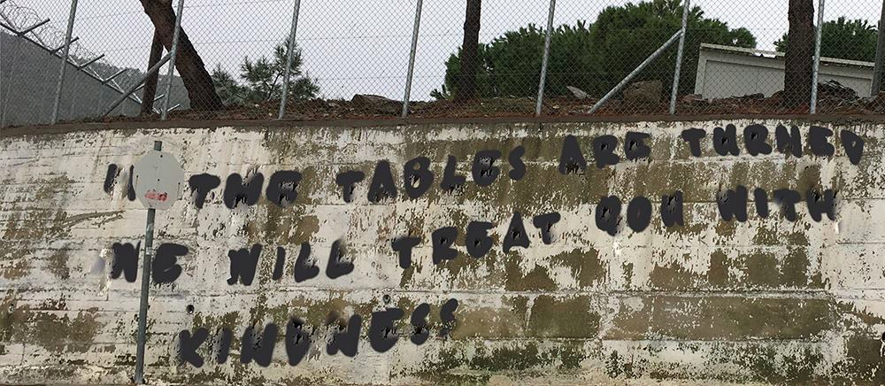
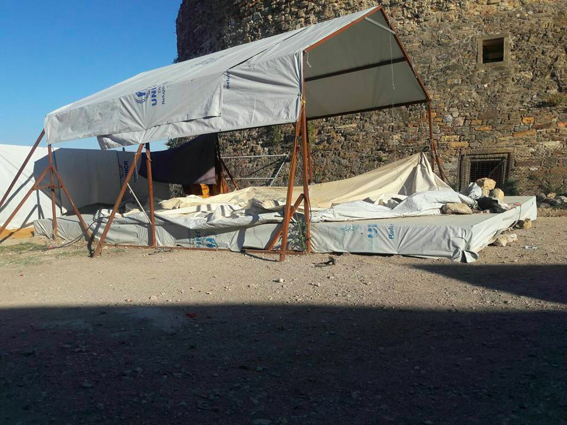
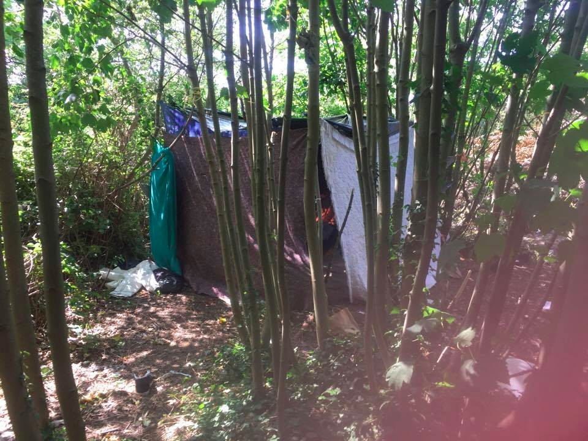
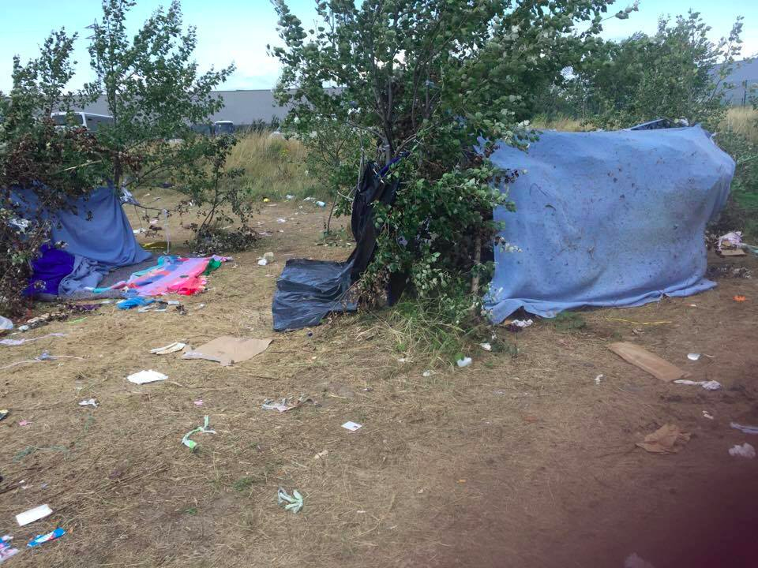

### AYS Daily Digest 30/07/17: Updates on Lesvos police violence

_Reports of police violence on Lesvos / Italian code of conduct could reduce NGOs capacity to operate rescues / New report on police violence in Croatia / And more news…_

“If the tables are turned we will treat you with kindness\.” \(Photo by Dirty Girls of Lesvos\)
#### Greece
### Arrivals

One boat with 37 people was picked up by the Greek coastguard on Lesvos this morning\.
### Free the Moria 35

The [Legal Centre Lesbos](http://www.legalcentrelesbos.org/2017/07/30/free-the-moria-35/) reports that 31 of the 35 people arrested after the Moria protests got charged with exaggerated crimes of arson, attempted assault, resisting arrest, rioting, damage to private property and disturbing the public peace\. Pre\-trial detention was ordered for 30 of those charged, despite many of them having vulnerability status and/or serious mental and physical health conditions which should preclude incarceration\. 20 of the individuals charged were transferred to prisons in Athens, and 2 to Chios\. The centre adds that police used excessive force during clashes with protesters and that many of the 35 arrested were not even part of the protests\.

Videos show police throwing stones at protestors, repeatedly hitting individuals with truncheons and plain clothes officers beating people up\.

One asylum\-seekers interviewed by Amnesty International says

> “Police fired a lot of teargas and I felt like I was suffocating\. …Ten police officers beat me everywhere with their batons for three minutes\. I was on the ground trying to protect myself, trying to make myself small…\. \.They hit me on the right hand and on the head with their batons and kicked me with their boots…… The police officer who took me to the car spat on my face and called me ‘stupid African’…\. \.’ 

Police also threatened and pushed on the ground a visibly pregnant asylum\-seeker and beatings continued inside the Mytilene police station, according to Amnesty International’s [report](https://www.amnesty.org/en/documents/eur25/6845/2017/en/) \.

The [No Border Kitchen Lesvos](https://noborderkitchenlesvos.noblogs.org/post/2017/07/30/749/) adds that people spent up to six days in jail awaiting pre\-trial hearing without access to a doctor\. It also says that police stormed Moria and nearby squats and social centres, arbitrarily arresting 50 refugees\. They were forced to release those whose case is still under appeal but around 25 others joined the ranks of those awaiting deportation\.

Today marks the 33rd day of Kozhin Hussein and Behrooz Arash’s hunger strike as well as the 32nd day of Arash Hampay’s hunger strike in solidarity with them\. He says:

> We want freedom\. We do not ask this from you as beggars\. We demand our freedom back from you\. We did not flee our cage only to be put into another cage\. We did not escape from the abyss of a dictatorship and war to be thrown into the abyss of prison and humiliation\. Quit your Machiavellist policies\. Respect freedom, equality and humanity\. 

### Volunteers needed

The North Shore Response group needs volunteers as part of the daily boat spotting/day and night watch/coast support team\. The ability to drive and to rent a car is essential and good communication skills are vital\. Practical, self motivated and physically fit people are also needed to build a new project in Mytilene\.
### Refugees transferred from Souda to Vial

Refugees are not accepted in the Souda camp of Chios any longer and are instead accomodated in Vial, as authorities prepare to wind down the camp\. Around 200 people got transferred from Souda to the mainland, others got transferred to Vial or to appartments\. 
 
Yesterday, authorities allegedly removed the tents of some 50 people in Souda, telling residents to share with others or move to Vial camp\.

#### Croatia
### New report on police violence at the border

A new [report](http://rigardu.de/wp-content/uploads/2017/07/Rigardu_report_may_july.pdf) by our friends from the German association Rigardu documents police violence at the Serbian\-Croatian border, saying it has become “part of a systemic deterrence strategy” to prevent people from attempting border crossings\. It recorded 10 cases between the 31th of May and 13th of July were refugees got beaten, kicked, insulted and tasered by police\. Previously, MSF had already warned against the recent “dramatic increase in violence” on the Croatian side of the border:

> “This violence always has the same shape: hitting with batons, destroying cell phones, snatching money“\. 

A [report](http://welcome.cms.hr/wp-content/uploads/2017/05/Izvje%C5%A1taj-o-novom-valu-nasilja-prema-izbjeglicama-na-granicama-Republike-Hrvatske.pdf) by Are You Syrious and the Welcome\! Initiative also sees the same pattern repeated, with Croatian police transporting refugees found further inland to a place near the border area, where they allegedly transfer them to a van bringing them to a place at the border\. There, they are taken out of the van one by one and beaten\.
#### France
### Police continues stealing blankets

The Refugee Info Bus says this place was home to a group of 20 Ethiopian men, women and children in a nearby forest, offering them shelter from rain and wind\. As is so often the case, blankets and personal items were stolen by police\.
#### Sea
### Code of Conduct could reduce NGOs rescue capacity

On Monday, the Italian government will present a compulsory code of conduct for NGOs acting in the Mediterranean\. [Open Migration](http://openmigration.org/en/analyses/what-is-changing-in-the-med-five-things-you-must-know/) says the list of rules is almost identical to those the NGOs were already adhering to under the coordination of the Italian Coast Guard, with the notable exceptions of “no lights on board”, judiciary police allowed on board, no transfer of people to other vessels, and no trespassing into Libyan waters\. It argues the idea of a new code legitimizes the idea circulating since a smear campaign started over Easter, that the NGOs were acting in anarchy before this measures, while all the while they always worked under the Rome command of the Italian Coast Guard\.

This smear campaign has further emboldened Defend Europe and their plan to block rescue NGOs in the Mediterranean Sea\. Their boat is expected to arrive in Catania soon\.

[The Independent](http://www.independent.co.uk/news/world/europe/refugee-crisis-ngo-rescue-ships-mediterranean-sea-italy-libya-eu-code-of-conduct-deaths-2300-latest-a7866226.html) says the Italian plan to impose restrictions on how NGOs in the Mediterranean operate risk the lives of refugees crossing the sea by dramatically reducing their rescue capacity\. NGOs argue the code will impede their work by banning the transfer of refugees to larger ships, which allows vessels to continue rescues\.

> **We strive to echo correct news from the ground, so let us know if something you read here is not right\.** 

> **Anything you want to share — contact us on Facebook or write to:areyousyrious@gmail\.com** 

_Converted [Medium Post](https://areyousyrious.medium.com/ays-daily-digest-30-07-17-updates-on-lesvos-police-violence-8ddb6acf9ded) by [ZMediumToMarkdown](https://github.com/ZhgChgLi/ZMediumToMarkdown)._
