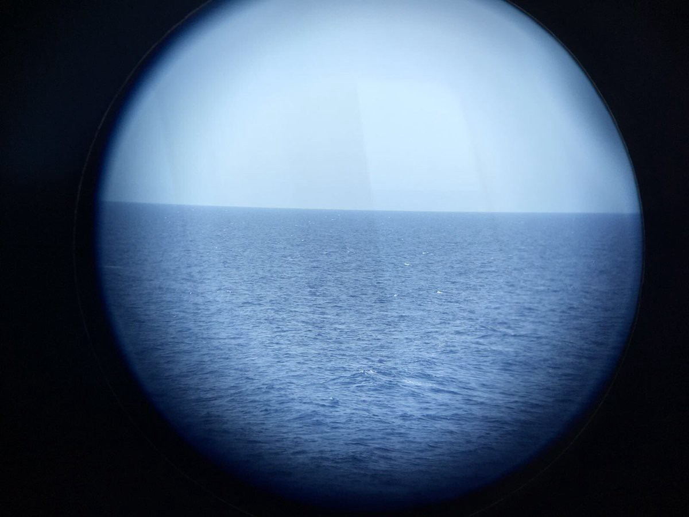
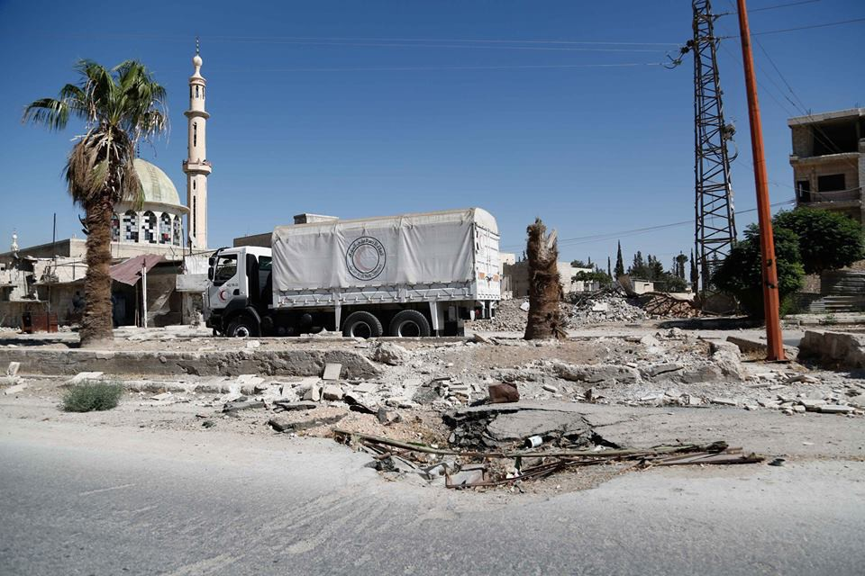
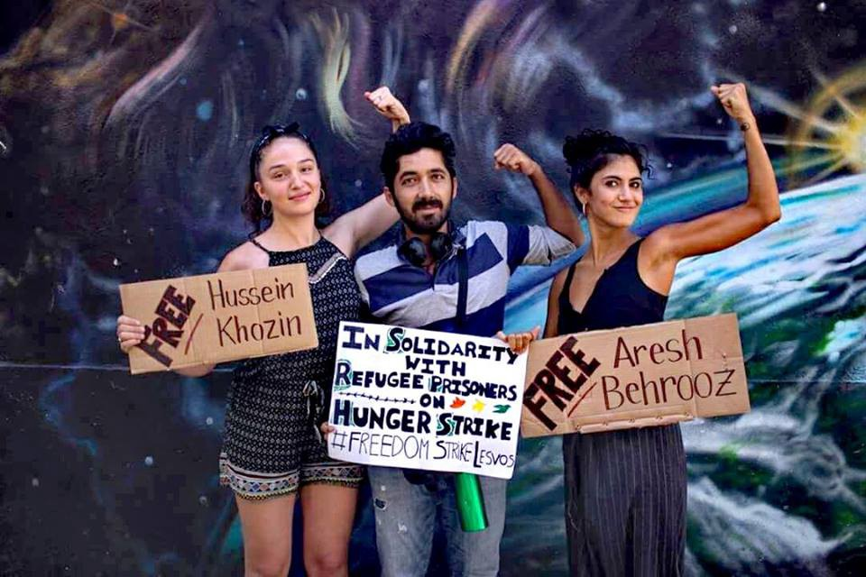
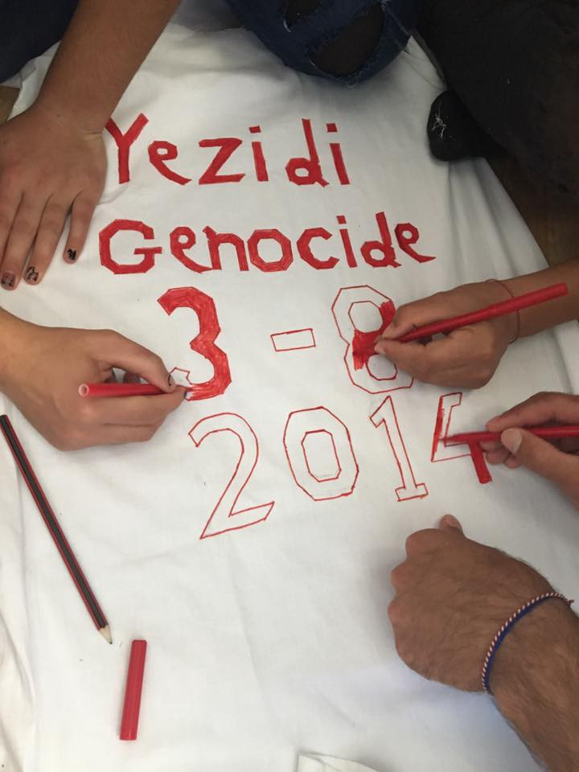
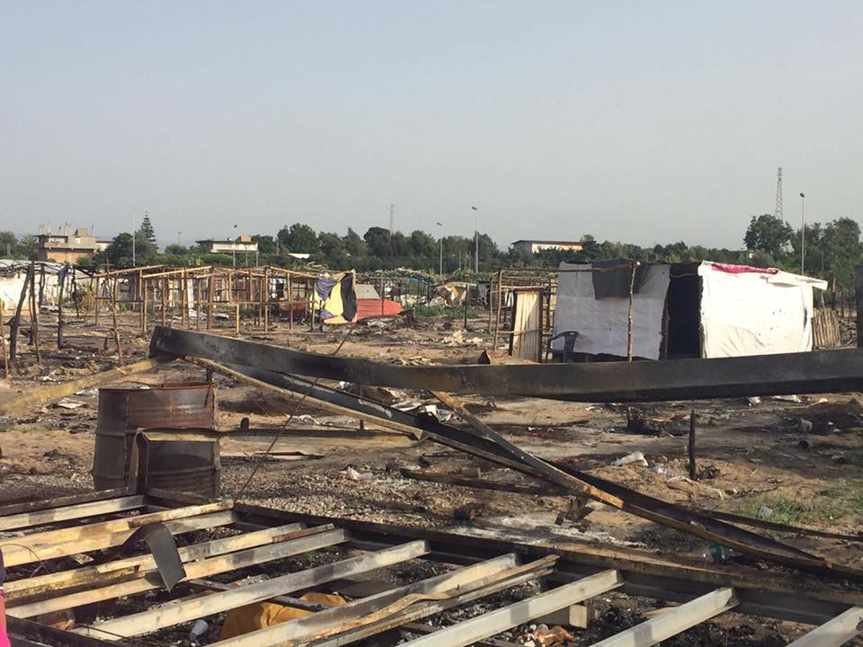
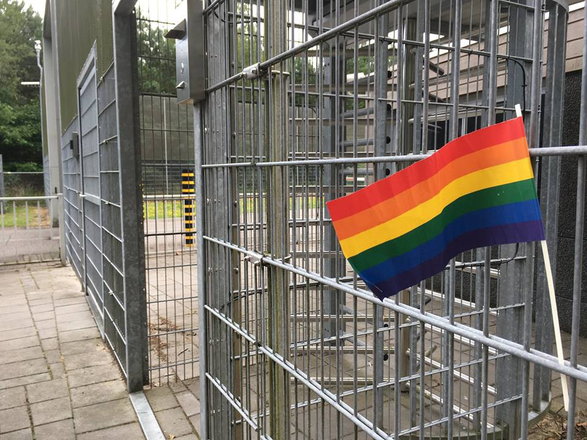

### AYS Daily Digest 31/07/17: MSF and Jugend Rettet refuses to sign NGO code of conduct

Afghanistan still not safe / Syria short of medical supplies / Arash Hampay threatened with a knife / Demonstration planned in Serres camp / Support needed against deportation in Milan / The most recent updates from France, Spain, Italy, and Greece / And more news…
### **FEATURE: MSF and Jugend Rettet refuse to sign the Code of Conduct**

@MSF\_Sea

[MSF](http://www.msf.org/en/article/msf-committed-saving-lives-mediterranean-will-not-sign-italian-%E2%80%9Ccode-conduct%E2%80%9D) has refused to sign the Italian Governments Code of Conduct for rescues at sea on the grounds that it would require them to have armed police on board and would prevent them from transferring people to other vessels when necessary\.

> The presence of armed police officers on board and the commitment for humanitarians to collect evidence would be in breach of fundamental humanitarian principles of independence, neutrality and impartiality\. This would subjugate humanitarian aid organisations to the political interests of a European Union member state and is not something that MSF is able to accept as it would impact on access to populations in danger everywhere in the world as well as the security of our teams\. 

[Jugend Rettet](https://jugendrettet.org/en/mission) , another sea rescue group, expressed similar fears about the potential repercussions of the Code of Conduct\.

> If we are no longer allowed to transfer rescued people to other vessels, but have to bring them to a safe haven by our own, the consequence will be: Less rescue capacities at the Mediterranean — more people will die\! 

MSF also have concerns about the new deals being made between Italy and Libya as [media](http://m.dw.com/en/italys-navy-to-patrol-with-libyan-ships-to-curb-human-trafficking/a-39899521) report that Italy’s Navy will start patrolling with the Libyan Coast Guard to prevent people crossing into European waters\.

> [The timing of this code and the new mission in Libya is worrying, and made us much less willing to be part of a system](http://www.redattoresociale.it/Notiziario/Articolo/543152/Codice-di-condotta-ong-spaccate-No-di-Msf-firma-Save-the-children) 

The use of both armed police and Navy vessels clearly show the increased militarisation of the border\. European states are continuing to move towards a protectionist stance with no care for the lives of people trying to reach safety and humanitarian groups must fight to remain independent in order to carry out their work\.

Save the Children and MOAS both decided to sign the document\.
### **AFGHANISTAN**

According to the [UN weekly report](http://l.facebook.com/l.php?u=http%3A%2F%2Freliefweb.int%2Fsites%2Freliefweb.int%2Ffiles%2Fresources%2F20170731_Afghanistan%2520Weekly%2520Field%2520Report%252023%2520-%252030%2520July%25202017.pdf&h=ATObmm3q_fceLo3J29tqt0JvoPOD2zPKi1zq8VzHIbdMwKiW8hzzxV3ORuR5f2xQV5KQM8-BJFssJIUEIAbdQ9kq5l5aSEs8ooUptEj7BUfj0dGU_Y8wpZi-wvDT_vU10Qx_SNTbs7mMc-PMcmud6w) more than 173,000 people were driven from their homes in Afghanistan due to conflict between January and the end of July this year and families have been displaced from 255 out of 399 districts\. Even though families have also sought safety and shelter in 172 districts it still doesn’t sound like a very safe country to be returned to\.
### **SYRIA**

The [World Health Organisation](http://reliefweb.int/report/syrian-arab-republic/syria-crisis-ar-raqqa-response-donor-alert-july-2017) reports that over 200,000 people have been displaced since April 2017 in north\-east Syria and have limited access to healthcare\.

\(Syrian American Medical Society\)

> The situation in Ar\-Raqqa city is particularly worrying\. The main hospital and many other health care facilities have closed due to airstrikes\. The facilities that are still functioning face critical shortages of medicines, supplies and equipment\. Water and electricity are available only intermittently, and civilians are unable to move freely due to travel and security restrictions imposed by ISIL\. Between 20 000 and 50 000 civilians are estimated to remain in the city\. 

The [Syrian American Medical Society](https://web.facebook.com/pg/SyrianAmericanMedicalSociety/posts/) state that in Al\-Nashabiye, East Ghouta, the UN have managed to deliver food and non\-food items\. This is the first possible delivery in the last five years, but it did not contain any medical and surgical supplies\.

There are over 350,000 people besieged in this area, including more than 95,000 children\.
### **GREECE**
#### Official registrations and monthly summary

Lesbos: 37
Samos: 47
Total: 84

Arrivals on Samos are increasing again during the last 4 weeks\.

The monthly statistics are as follows:

Lesbos: 1130
Chios: 132 
Samos: 603
Total: 2249 \(11,441 this year\)

July saw the most new arrivals in this year so far\.
#### Deportations to Turkey

60 people were deported today\. Biggest numbers: 24 from Algeria, 13 from Pakistan, 9 from Syria\.
#### **Arrivals**

One boat arrived in the north of Lesvos this morning carrying 30 people\. On board were 17 men, 9 women & 4 children\.
#### **Lesbos:** Moria Hunger Strike

[Arash Hampay](https://mobile.facebook.com/story.php?story_fbid=502675610078530&id=100010082855510&hc_location=ufi&_rdc=1&_rdr) has reported that he was threatened with a knife at around 12am on the 31st Day of his hunger strike by a group of people who turned up on motorcycles\. He is asking for the release of Behrooz Aresh and Kozhin Hussein who were both of day 33 of their hunger strike in prison\.

Human rights for refugees\. Photo by Kini Von Teesdale

> Since beginning my hunger strike in an attempt to defend the imprisoned people on hunger strike, there have many been attempts to hack my email, Facebook and other media outlets\. I have been threatened and arrested\. \#UNHCR has still yet to react to try and put an end to this hunger strike\. The only joyful event that has happened has been my brothers release\. This little victory does not mean that our demands have been responded to\. This was never my only goal\. Despite all the threats and the suppression, I will keep standing\. 

Moria continues to be a terrible place to live with limited running water and electricity\. It is overcrowded and people forced to live there receive little or no support\. A volunteer describes is as “ [a place of misery, a literal prison](https://web.facebook.com/riadh04/posts/2074231829471153:0?hc_location=ufi) ”
#### Lesbos: [DocMobile](https://mobile.facebook.com/story.php?story_fbid=1600206293385382&id=1112468405492509&hc_location=ufi&_rdc=1&_rdr) calling for donations

Hard working dentists on Lesbos ask for support\. They treat 500 people a week in Greece\.
#### **Leros**

[The Hub](https://web.facebook.com/TheHubLeros/?hc_ref=ARRRzk7UiSazLcC40b-LDj4dQGApGfCUTeKn0BSgs8AwdqB3TBfo-pj-Ln7cnTo1vlc) are starting new Theatre class for everyone interested in learning the art of storytelling, writing, and performing\! Classes will take place twice a week on Tuesdays and Thursdays at 3–4:30 PM and will include tons of interactive activities and games, singing, and acting\!
#### **Chios**

Volunteers report that today was the last lunch given out by the Norwegian Refugee Council as their funding has now stopped\.
#### **Mainland:** Serres Camp

We are here, Serres

The Yazidi residents of Serres camp are preparing for a march from the camp to the town and back, and a candlelit vigil, on this Thursday 3rd August, to remind the world that it has been 3 years since the 03/08 genocide\. Over the summer of 2014, thousands of Yazidi men, women and children were killed or enslave by ISIS, and hundreds if not thousands of women are still being held as sex slaves\.
#### **Mainland: Athens—** Human right violations against minors

[Local media](http://www.ekathimerini.com/220535/article/ekathimerini/news/alarm-raised-over-detention-of-unaccompanied-minor-refugees) report that an investigation has been carried out by the Greek Ombudsman from July 17 to 19 which discovered “blatant violations of the rights of unaccompanied, underage refugees and migrants\.”

Violations included prolonged detention in unsafe and inappropriate conditions at police stations and refugee centres across northern Greece and the detention of 17 minors who were being held in a single 25\-square meter cell\. The Ombudsman has called the immediate preparation of adequate accommodation centres\.
#### Mainland: Athens—New computer class

A new computer literacy class for women refugees in Athens is about to begin\. Students will be able to learn essential skills like how to type, how to use a web browser, and how to use productivity software like Microsoft Office\.

#### Mainland: Warehouse donations needed

Pampiraiki’s warehouse which provides dry foods and non\-food items to squats, camps, shelters, and private accommodation have run out of the following items:
- milk
- tomato
- sugar
- olive oil
- sunflower oil
- coffee

If anyone is able to help with these items, they are needed urgently as there are a lot of orders to send\. Please contact [Katerina Rouniou](https://web.facebook.com/groups/PAMPIRAIKI/permalink/504831403194302/?hc_location=ufi) if you are able to help\.
### **ITALY**
#### [Call out](https://web.facebook.com/lacuisinedesmigrant/?hc_ref=ARTDDfiZaI0UCINGAlRkoDA17unKx2AIzqUbQuD6_6lcmqqlmo6W6OlK63H__t1Kw8U&fref=nf) for support to prevent deportation

Three Sudanese people, after being evacuated from the Paris camps and then taken to various centres, were deported to Milan today\. They are being held by the police and have been told that they will be flown to Khartoum tomorrow \(01/08/17\) \.

> These illegal, cynical and inhumane measures must be denounced and prevented at all costs\! 

There is a meeting at Milan airport to support Moustafa, Hamdan and Abdallha\.

> This is a real deportation to a state that practices torture, systematic violence and where they risk death\! 

#### **Rosarno under eviction threat**

Collettivo Mamadou

Local activists [report](http://www.meltingpot.org/L-urlo-dal-ghetto-di-Rosarno.html?var_mode=calcul#.WX-MtbOQzIU) that since the wildfire of three weeks ago, which destroyed half of the camp, a new official camp has begun being built and it will be managed by the Civic Protection Authorities\. This camp will be fenced off and have heavy security and cameras\. At the same time the current camp is under threat of eviction and activists remain there to monitor the situation and support the people living there\.
#### Clearance of Valetta, Gorizia

Volunteers state that the eviction of Valetta in Gorizia is now complete\. It is unknown at the time of writing where the people who were sleeping there have been taken\.
### **SPAIN**

Human Rights Watch have released a [report](https://www.hrw.org/news/2017/07/31/spain-migrants-held-poor-conditions) which details the poor living conditions and lack of proper asylum processes for migrants arriving to Spain, particularly in Malaga, Almeria and Motril\. According to Judith Sunderland, associate Europe and Central Asia director at Human Rights Watch, “Spain is violating migrants’ rights, and there is no evidence it serves as a deterrent to others\.”
### **NETHERLANDS**

Day 30: [Hunger Strike of a Ukrainian LGBT asylum seeker](https://web.facebook.com/LGBTAsylumSupport/photos/a.500855286756362.1073741828.498383330336891/816995041809050/?type=3&fref=mentions) without criminal record in Dutch prison\.

LGBT Asylum Support

> I can do my protest only on my own to make known to international organizations what is going on in Ukraine and in my case in prison as someone, a LGBT refugee without any criminal record\. This 3 months in prison is the worst experience in my life ever\. With my hunger strike I want to bring out that I cannot defend myself in this prison and I don’t belong here\. I only depend on you and the lawyer to fight for my case 

### **FRANCE**

According to [media](https://www.clarin.com/mundo/francia-dara-alojamiento-refugiados-duermen-calles_0_HyQnKgK8-.html) the French President, Emmanuel Macron, has stated that the government has bought 62 hotels to act as emergency accommodation to get people off the street by the end of the year\. Normally the French Government’s strategies to get people off the streets, such as the repeated destruction of the Jungle in Calais, go really well so we’ll just have to wait and see what happens with this latest plan\.

Interior Minister Collomb has also [announced](https://www.franceinter.fr/societe/migrants-de-calais-deux-centres-vont-etre-crees-dans-le-nord-et-le-pas-de-calais) the creation of two reception centres of 300 beds each in the Calais region within ten days\.
#### **Paris**

Needs list from volunteer at Porte de la Chappelle:
- Blankets \( \! \! \! \)
- Sleeping bags
- Shoes \( yes, always shoes \) sizes 40–44 , preferably something for mid\-season
- Pants \( joggings\) size S and M
- T shirts S M and even L
- Toiletry kits — there seems to be never enough of them
- Socks \( oh socks, but not winter socks\)
- Food packages — something that can last and doesn’t need to be cocked
- Rice — packages of one kilo preferably for the families and distribution
- Metro tickets — I can’t even tell how needed are those
- Dictionaries Farsi — French / Pashto — French / Dari — French
- School supplies

You can message her [here](https://web.facebook.com/profile.php?id=100009499466124&hc_ref=ARS-4xfjJQaWXthAvoBc1ljXHRIGFtx9t1-saW_hnDjqWX76WrCgXmhwS9HLCRXPOi4&fref=nf) \.
#### Court case in Calais

[Help Refugees](https://twitter.com/HelpRefugeesUK/status/891992057564233728) have won a court case which has reinstated the state’s obligation to install water, toilets, showers & daily outreach for minors in Calais\.

The courts ruled “the living conditions of migrants reveal a lack of action on the part of public authorities, which can be said to expose the persons concerned to inhuman or degrading treatment and therefore constitutes a serious and unlawful breach of fundamental rights”

They are also asking for [donations](https://mydonate.bt.com/fundraisers/calaisdunkirk-refugee-support) for basic necessities for the 600–700 refugees in Calais still in need of support\.

However, regardless of the law, which as a state actor you would have thought she had a vested interest in, the Mayor of Calais has [stated](https://twitter.com/AubergeMigrants/status/892000799659831296) that she refuses to install any water points for migrants\.

A very serious call, written under the form of a poem, by the Refugee Women’s Centre

> Are you by Maidstone, Margate and Brighton, 

> Or next to Hastings and Dungeness, 

> And would like to make a donation \- 

> An appreciated gesture of kindness? 

> My friend you are in luck \! 

> For a volunteer will be driving close by 

> With a vehicle \(maybe even a little truck?\) 

> To collect items that will for sure satisfy\. 

> This weekend they will be driving 

> So please message us now in you’re interested \! 

> To meet them and to be contributing 

> By giving items below listed: 

> Children’s sleeping bags 

> Blankets 

> Tarpaulin 

> Babywipes 

> These are the most urgent needs 

> But for other good deeds 

> Please refer to our list that’s most up\-to\-date: 

> [https://www\.dunkirkrefugeewomenscentre\.com/donate](https://www.dunkirkrefugeewomenscentre.com/donate) 

> To clarify, in case the format was too distracting: A volunteer will be driving this weekend from the South\-East of England to Dunkirk and is happy to collect donations\. Should you live in the area, could arrange to meet them, and have items to give that correspond to our needs, please send us a message\! 

> **_We strive to echo correct news from the ground through collaboration and fairness, so let us know if something you read here isn’t right\._** 

> **_If there’s anything you want to share, contact us on Facebook or write to: areyousyrious@gmail\.com\._** 

_Converted [Medium Post](https://areyousyrious.medium.com/ays-daily-digest-31-07-2017-msf-and-jugend-rettet-refuses-to-sign-ngos-code-of-conduct-e86aaea9749d) by [ZMediumToMarkdown](https://github.com/ZhgChgLi/ZMediumToMarkdown)._
