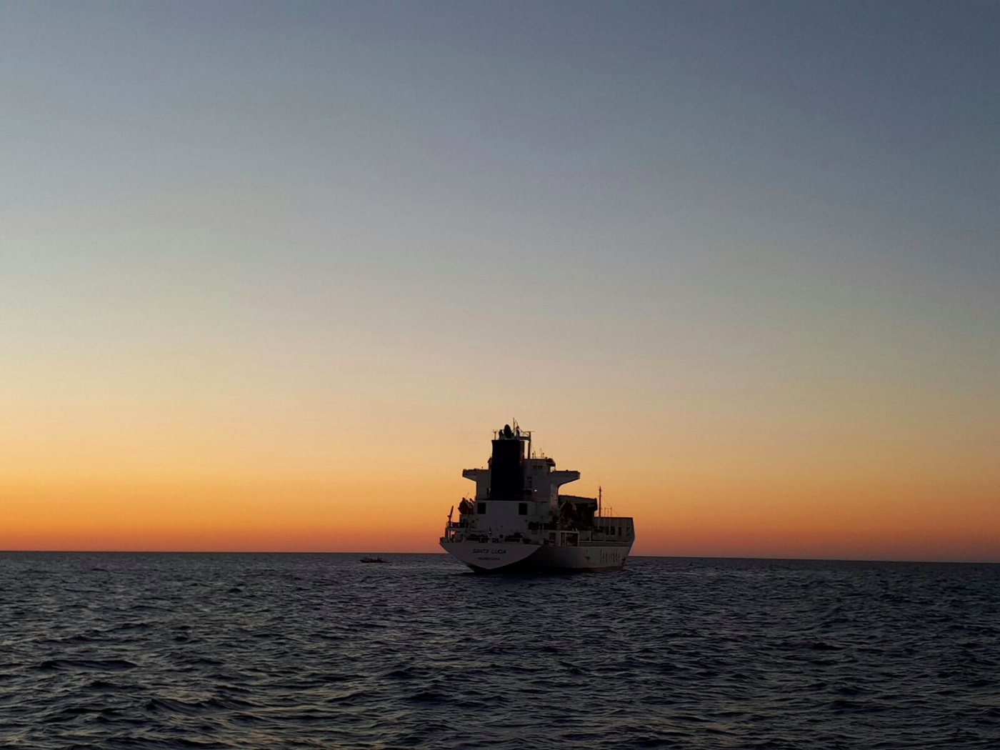
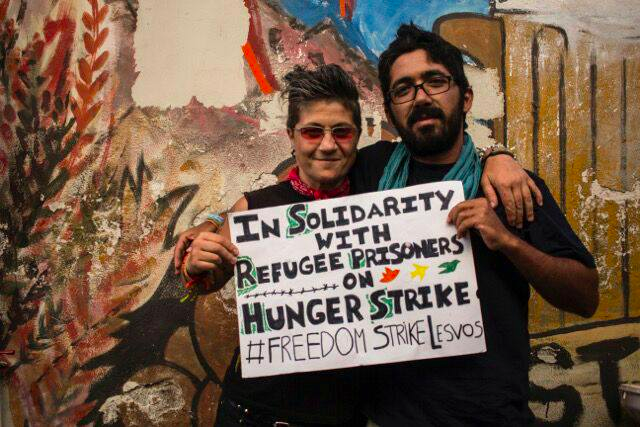
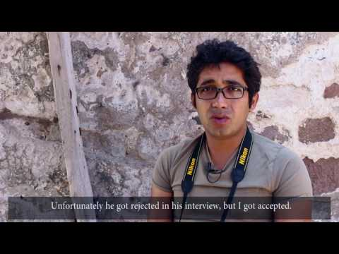
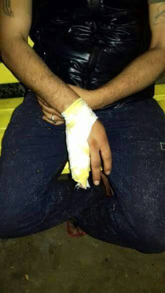
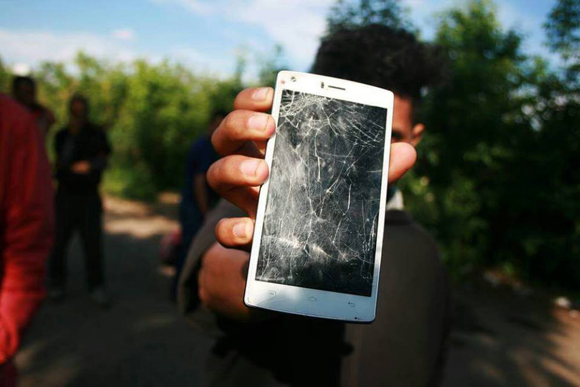
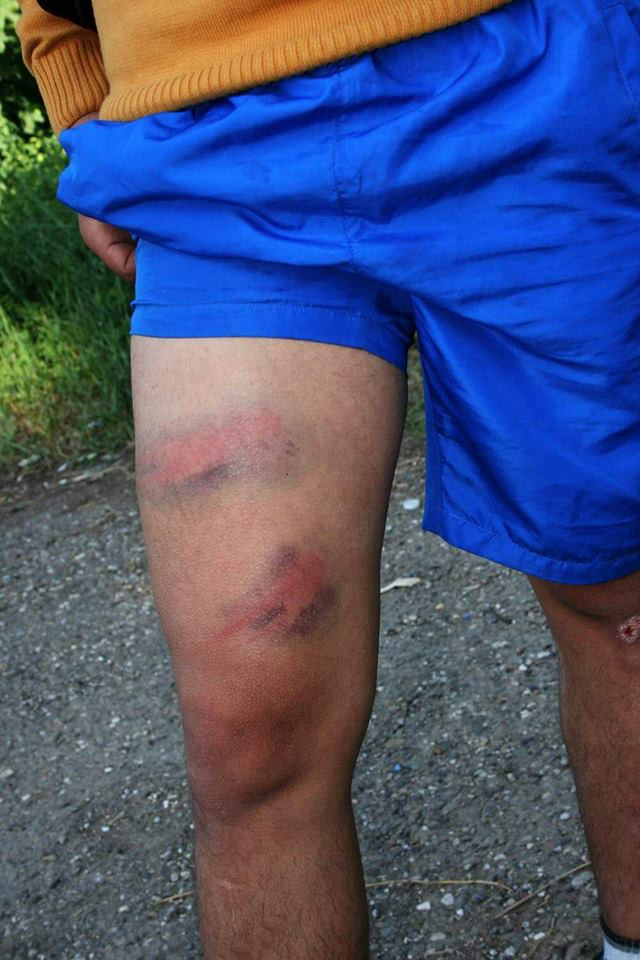
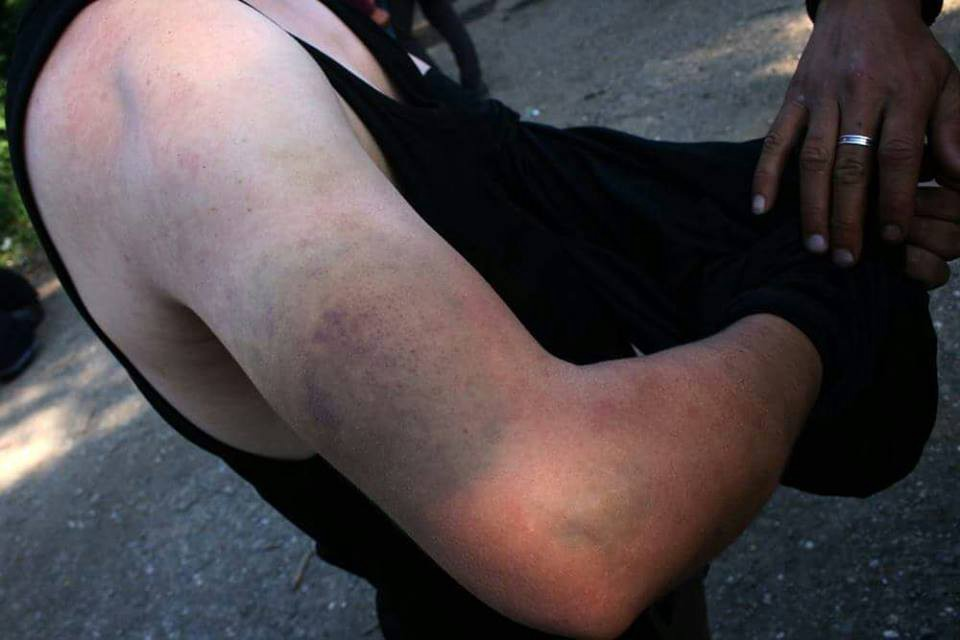
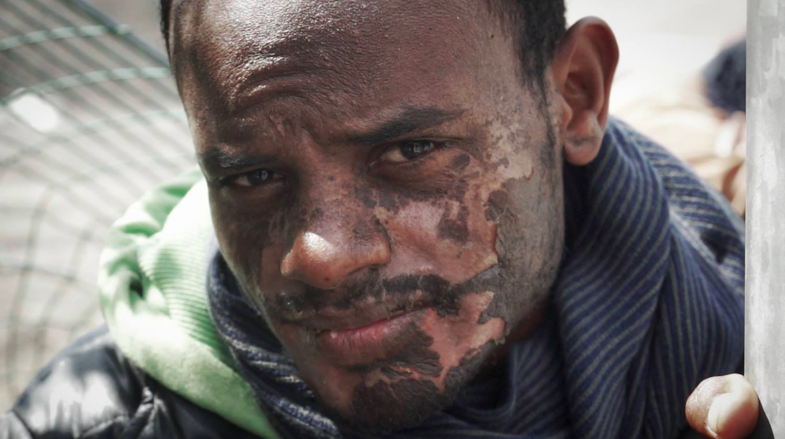

### AYS Daily Digest 01/08/17: NGOs say code of conduct does not prioritize peoples’ lives

_Protests against arrival of Defend Europe’s boat C\-Star in Crete//Protest annonced in Athens against limits to family reunifications from Greece to Germany//Violation of asylum seekers’ rights in the south of France// Police tank hit and killed a Syrian child in Turkey_

Photo by MSF
### Five out of eight rescue organisations refuse to sign Italy’s code of conduct

](assets/c7d548844d95/1*buvuf--Qadi7z6g-l0uAFw.png)

Image by [**Gianluca Costantini**](https://www.facebook.com/costantinigianluca?hc_ref=ARQiQmtsRUFDiugDe-3utHfA22E3wqRBOeHx8K9WyKezuDB0yczNsrnNATnuhpMY7dk&fref=nf)

Five out of eight rescue organisations refused to sign the code of conduct proposed by the Italian government\. The main issue for MSF seems to be that rescue boats will have to take refugees to a safe port themselves, rather than transfering them to larger ones, while Jugend Rettet especially rejects the presence of armed police officers on board\. Jugend Rettet has now suggested the use of the International Maritime Organisation or the Nautical Institute as neutral mediators to reach an agrement\. The group adds that the EU needs to take responsibility instead of limiting the work of rescue organisations and criminalising what they do\. It also argues the current code of conduct does not prioritize their main objective, which is to save people’s lives\.

[Ansa](http://www.ansa.it/english/news/politics/2017/08/01/ports-not-guaranteed-if-ngos-dont-sign_0b9d4218-2770-4145-ad37-f5966f1d4643.html) reports MSF said it will continue to operate in the Mediterranean, while the European Commission said that NGOs that do not sign the code of conduct will not be guaranteed to be able to take rescued refugees to Italian ports, if they were saved in areas outside Italian competence\.

Meanwhile, eight bodies were recovered by MSF’s Prudence and taken on board the Aquarius today\.
### Turkey

A Turkish police tank hit and killed a Syrian child in Okmeydanı, İstanbul, today\. The child had been playing in the street when he was struck\. The tank stopped, officers got out, picked up the child, “threw him in the back, and sped away\.” Residents started screaming and eventually telephoned the police to ask for a report to be filed — upon which the response was “Turkish police is just; those officers in the tank must have filed a report\.” The child was apparently taken to the hospital, where he was pronounced dead\.
### Italy could send warships to Lybian waters

The Italian parliament is expected to vote this week on a proposal to send warships to Lybian territorial waters to support the Libyan coastguard in the interception and return of refugees to Libya\. [Amnesty International](https://www.amnesty.org/en/latest/news/2017/07/italy-deploying-warships-to-police-libyan-waters-will-expose-refugees-to-horrific-abuse/) says the plan is a “shameful attempt by the Italian authorities to circumvent their duty to rescue refugees and migrants at sea”, adding that bringing refugees back to Libya would expose them to “horrific abuses and human rights violations”\.

According to the IOM, arrivals by sea to Italy went down from 67,318 in May\-July 2015, to 57,298 during the same period in 2017, a decrease of 14 percent\.
#### Greece
### Protests against C\-Star

Fascists from the C\-Star are trying to enter one of the ports in Greece, but lucily many are united in their determination to stop them\. While the governments or EU do not have appropriate response to this, again, people do have solutions\.

[Ekatherimini](http://www.ekathimerini.com/220563/article/ekathimerini/news/far-right-anti-migrant-ship-told-its-not-welcome-in-crete) reports dozens of protesters gathered in the town of Ieraptera on Crete on Monday night to rally against the possible arrival of Defend Europe’s C\-Star boat\. Mayor Theodosios Kalantzakis said that the C\-Star was not welcome at his town’s port:

> “I can’t see the passengers themselves having any intention anymore to sail in this area, a place that has shown that fascism will not pass, that has shown solidarity and hospitality to 700 migrants we helped live with dignity when they were in Ierapetra” 

Yannis Youlountas [writes](http://blogyy.net/2017/07/31/defend-europe-la-race-superieure-fait-pipi-dans-son-froc/) that the C\-Star is currently hiding near the small island of Koufonisi and hopes to enter the port for repairs\. The boat however is likely to be rebuffed by port authorities, as it stopped at the port Famagouste in northern Cyprus and as it faces the general hostility of the Greek government and population\. He argues that if the C\-Star absolutely needs repairs, it will have to launch an SOS and could be towed to the port of Ieraptera, where a lot of protesters will be waiting\.

The boat now seems to have left\.

[**United Rescue Aid**](https://www.facebook.com/unitedrescueaid/?hc_ref=ARR494CWiKHvsIN9bRVADLvpWMSyMkZogU2WeoJjQelwt7GmkXsoaAZzKKogQ71dUak&fref=nf) initiated an [petition to stop this boat](https://secure.avaaz.org/el/petition/k_P_Koyroympli_Ypoyrgo_Naytilias_kai_Nisiotikis_Politikis_Apagoreysi_ellimenismoy_stin_Ellada_toy_akrodexioy_CStar_Acces/) , asking the Minister of Shipping to deny any access to Greek ports for the far right C‐Star\.

A [briefing](http://hopenothate.org.uk/wp-content/uploads/2017/07/Defend-Europe-Briefing_210717.pdf) by Hope not Hate notes that Defend Europe could be contravening a number of maritime and human rights laws\. Returning refugees to the north African coast, as it has repeatedly stated it would do, would possibly contravene the non\-refoulment obligation under Article 33 of the 1951 Refugee Convention\.
### 35th day of hunger strike

Today marks the 35th day of the hunger strike by imprisoned asylum seekers on Lesvos\. Arash Hampay lost 11kg and Khozin Hussein 13kg since the beginning of his hunger strike, while Bahrooz Arash now weighs 43 kg, having lost 17:

> With each passing day, Bahrooz comes closer to death; his body is now eating up his skin for want of anything else\. After this, blindness, heart failure, death\. The odds race through the mind: to break the strike now might mean survival, but it might also mean continued imprisonment and deportation to places where death seems equally certain\. 

The hunger strikers demand an end to brutal violations of human rights, the illicit and arbitrary detention of refugees and to the European border regime which is systematically deporting refugees to face persecution, torture and death\.

The hunger strikers also call on activists overseas to show their support by fasting for 24 hours and publicising their action on social media with \#freedomstrikelesvos, holding a poster like the one below\.

Photo by Kini Von Teesdale

More on the hunger strike and the refugee experience on Lesvos can be found in this new documentary:

### Critical situation on Samos

Samos Volunteers describes the situation on Samos, where around 1,300 people are now crammed into an area set up to accomodate 700:

> “There are 103 toilets in the camp and 98 showers\. In summer, the water is cut\-off constantly, leaving people without a way to wash or refresh themselves\. There is very little shade and in the sun, it is not unusual for the tents to heat up to 40 degrees Celsius inside\. It gets so hot during the night, people decide to sleep outside\. The majority of people don’t have direct access to electricity or running water at all\. The camp is overcrowded so privacy is non\-existent\. Safety, health and sanity are in constant jeopardy\. The living standards are far beneath low\. 

> Boredom, desperation and uncertainty are key words describing this waiting process\. Depression is a common theme and life in the camp is so stressful that traumas can hardly be processed\. In fact, it is very likely that the majority of the adults and children are inflicted with a second trauma while living here\. Last week, a man tried to commit suicide next to a playground\. His attempt was not successful, but there were 30 children present to witness the commotion and the aftermath\. 

> Of the 1300 people residing in the camp, around 400 are under 18\. Over 100 of these are toddlers, between the age of 0 and 5\. Most of the kids in the camp don’t get any form of education as involved organisations can’t provide for all\. Parents are often depressed, lacking the energy to care for or look after their children\. They grow up in circumstances that will leave a scar forever\.” 

### Protest against limitation of family reunifications

Refugees call for a protest against the limitation of family reunifications from Greece to Germany on the 2nd of August, starting at 11am from Syntagma square:

> We, the Syrian families from different camps in Greece \(i\.e\. Elaionas, Koutsochero, Ritsona and Skaramangas\), who have our beloved relatives in Germany are inviting all refugees who also have their families there and everybody else who wants to join our struggle and stand in solidarity with us, to a peaceful protest on Wednesday August 2nd at 11 o’clock starting at Syntagma Square, then going to the German Embassy and ending in front of the EU offices\. 

> We want to express our strong concern and disagreement about the informal agreement between the German and the Greek governments, which has led to the practice of limiting transfers of persons accepted through family reunification to go to Germany to 70 per month\. 

> There are more and more families who have been accepted to go to Germany more than six months ago\. 

> There are grandparents, fathers, mothers and children waiting to join each other after years of separation\. 

> There are elderly, sick, disabled, newborns, victims of torture and other forms of violence or exploitation as well as many other vulnerable persons among us, who are in urgent need of their families\. 

> There are many of us who have already been waiting for more than 1 ½ years under very difficult conditions in Greece\. 

> We have escaped war\. 

> We need our families and a life in peace\. 

> “Let our families reunite now\!” 

#### Croatia
### Police abuses at the border with Serbia

Soul Welders says the frequency and intensity of police abuse of refugees, including minors, at the border between Croatia and Serbia has increased in recent weeks\.

This violence has been documented as well in a new [report](http://rigardu.de/wp-content/uploads/2017/07/Rigardu_report_may_july.pdf) by German association Rigardu, by Doctors without Borders, and in a [report](http://welcome.cms.hr/wp-content/uploads/2017/05/Izvje%C5%A1taj-o-novom-valu-nasilja-prema-izbjeglicama-na-granicama-Republike-Hrvatske.pdf) by Are You Syrious and the Welcome\! Initiative\.
#### France
### Violation of asylum seekers’ rights in the south of France

On the 24th of July, Cédric Herrou was arrested and later put under judicial control for helping “irregular migrants” enter and travel across the French territory\. He was at that moment travelling with asylum\-seekers to the Cannes train station, to witness possible violations of their rights\.

Cédric and the CRS collective were hoping to make a documentary on the chaotic journey of asylum\-seekers in the region and the project’s completion was hastened by his arrest\. It shows how asylum\-seekers are brought back to the border in violation of their rights, without examining their request and without access to translators or lawyers\.

[")](http://www.youtube.com/watch?v=AHF2BwFsb5o)

### Two “new” reception centres to be opened in the Calais region

](assets/c7d548844d95/1*exYap98t-Bt3c2pdaWIFIg.png)

“One meal per day is not enough but I have orders”\. Photo by [Pitinome](https://www.facebook.com/julien.pitinome/)

[Le Monde](http://www.lemonde.fr/immigration-et-diversite/article/2017/08/01/des-centres-d-accueil-pour-migrants-d-un-genre-nouveau-vont-ouvrir-a-calais_5167244_1654200.html) reports on the announcement of the creation of two new reception centres in the Calais region by Minister of Interior Gérard Collomb\. As l’Auberge des Migrants mentionned yesterday, these centres already exist but additional space will be created\. The French office for immigration and integration \(OFII\) will try to convince people in Calais to go to these new centres called CAES where they will be able to directly make their request for asylum\. Volunteers however fear the “triage” of refugees, with those falling under the Dublin Regulation being put under house arrest and “irregular migrants” brough to detention centres\.

The Ministry of the Interior also called for an investigation on police violence in Calais after [Human Rights Watch](https://www.hrw.org/report/2017/07/25/living-hell/police-abuses-against-child-and-adult-migrants-calais) accused police of routinely using pepper spray and disrupting the delivery of humanitarian assistance\.

Mobile Refugee Support adds that because of constant raids by the French police, sleeping bags are in high demand at the moment\. [Taranis news](http://taranis.news/) will also soon publish the testimony of an Eritrean refugee, who says he was sprayed at point blank range in the face with tear gas\.

Photo by Taranis News

[**Danika Jurisic**](https://www.facebook.com/profile.php?id=100009499466124&hc_ref=ARRSCp_9SU1PebBBP_pa4csuV3XERpYJtvvpQ9B6NvTF0jYvQNda0qdKTWg9QE5gSNU&fref=nf)

[31 July at 22:41](https://www.facebook.com/permalink.php?story_fbid=1885257235134240&id=100009499466124) ·

Hallo to you all\! I have been away for a bit\( my well deserved vacation

:\) 
But I am back now and I have news from the camp in Paris: 
It began all over again, refugees are gathering in large numbers at porte de La Chapelle, and their needs are so basic, simple and yet so out of reach\. 
I will list them here and I am inviting you all to help us gather them

Blankets \( \! \! \! \)
Sleeping bags 
Shoes \( yes, always shoes \) sizes 40–44 , preferably something for mid season 
Pants \( joggings\) size S and M 
T shirts S M and even L 
Toiletry kits — there seems to be never enough of them 
Socks \( oh socks, but not winter socks\) 
Food packages — something that can last and doesn’t need to be cocked 
Rice — packages of one kilo preferably for the families and distribution 
Metro tickets — I can’t even tell how needed are those 
Dictionaries Farsi — French / Pashto — French / Dari — French 
School supplies

If you can help with any of those things, pm me and we’ll find some solution how to get them over to refugees\.

Thank you all\! \!
#### Spain
### 70 people cross border to Ceuta

Nearly 70 people crossed the razor\-wire\-topped fence separating northern Morocco from the Spanish enclave of Ceuta, leaving 14 hospitalized according to [Reuters](http://uk.reuters.com/article/uk-spain-migrants-idUKKBN1AH3WH) \. Local police said 200 people rushed the border in a bid to reach Europe\. [Human Rights Watch](https://www.hrw.org/news/2017/07/31/spain-migrants-held-poor-conditions) \(HRW\) says many take to the seas after repeated failed attempts to scale the fences\. Marcel, 34, from Cameroon, tried six times to cross into Ceuta:

> “I never managed, just got beaten up \[by Moroccan security forces\], broken bones……once when I was already at the fence they beat me on the foot to make me fall off the fence\. Another time they hit me with a baton; it felt like a knife\.” 

Once they arrived in Ceuta and Melilla, people say they did not have individual meetings with a lawyer in police custody and were given little or no information about their right to claim asylum\.
#### UK
### Safe Passage needs volunteers

Child refugees that Safe Passage successfully reunites with family or find homes for in the UK need help and support in their first few months so they can settle into their new life\. Safe Passage is therefore looking for Community Mentors that provide them with practical support and general information\. More information on the role can be found [here](http://safepassage.org.uk/wp-content/uploads/2017/05/CM-Role-Description.pdf) \.

> **We strive to echo correct news from the ground, so let us know if something you read here is not right\.** 

> **Anything you want to share — contact us on Facebook or write to:areyousyrious@gmail\.com** 

_Converted [Medium Post](https://areyousyrious.medium.com/ays-daily-digest-01-08-17-ngos-say-code-of-conduct-does-not-prioritize-peoples-lives-c7d548844d95) by [ZMediumToMarkdown](https://github.com/ZhgChgLi/ZMediumToMarkdown)._
