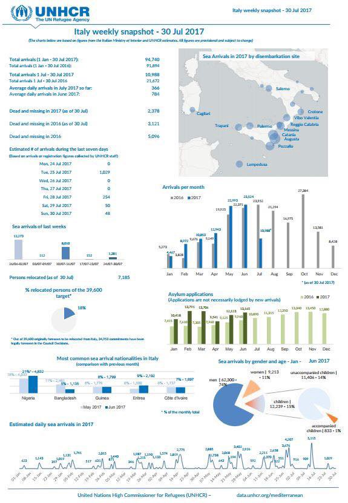
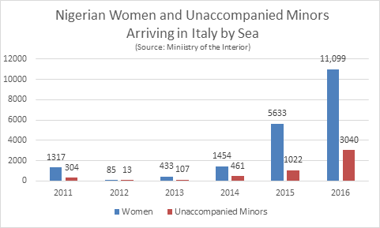

### AYS Daily Digest 02/08/17: Put an end to policies separating families
#### Protest against the slow and inefficient family reunification procedure Greece\-Germany / Iuventa stopped and confiscated by the authorities, charges of aiding smuggling / Volunteers struggle in Italy and France / Sweden — more than 10,000 asylum seekers from 2015 still waiting for their applications to be considered / Besieged residents in Syria deprived of medical care, WHO sends first shipments to Syria

■■■■■■■■■■■■■■ 
> **[MSF Sea](https://twitter.com/MSF_Sea) @ Twitter Says:** 

> > What is it that makes you think this little boy is any different to your 4 year old son? Frankly, the only difference between them is luck. https://t.co/s5bqBz5TjP 

> **Tweeted at [2017-08-02 08:00:26](https://twitter.com/msf_sea/status/892656321501290496).** 

■■■■■■■■■■■■■■ 

#### FEATURE
### Protesting the poor family reunification procedure

Two months ago we reported that Germany would slow down the process of family reunification from Greece, afterwards noticing a delay regarding the family reunification procedures\. This was soon afterwards confirmed also by the leaked letter between the minister of Greece and Germany\. Organizations that are providing legal help had announced legal actions regarding the matter\.
Today, hundreds of refugees were marching in Athens to oppose the decision that was put into practice, slowing down of the family reunification process, causing despair among thousand people who are already waiting for far too long\.

Support came from many sides\. [Refugee Support Aegean and PRO ASYL](https://www.proasyl.de/en/news/no-more-separations-of-families/) [have documented dramatic cases](https://www.proasyl.de/wp-content/uploads/2015/12/Dublin-Greece_No-Separation-of-Families.pdf) , where even lives have been lost during periods of separation\. 
“There are still refugees who desperately fear that they might not see their wives, husbands, children or parents alive again, as they are waiting in limbo for an answer to their applications for family reunification and for their transfer to finally take place\.
Meanwhile, long waiting periods in Greece result in more anguish for already vulnerable protection seekers, and poor reception conditions are leading to a deterioration of the physical health of many refugees and in some cases even severe injuries\.” \( For more information see background note RSA/PRO ASYL: [The Dublin family reunification procedure from Greece to Germany](https://www.proasyl.de/wp-content/uploads/2015/12/Background-Note-Family-Reunification-Dublin_RSA_PRO-ASYL-August-2017.pdf) \)

](assets/292e0c34a7de/1*oP8x77KIeuvRxCaTYq_zmw.jpeg)

Photo: [Refugee Accommodation and Solidarity Space City Plaza](https://www.facebook.com/sol2refugeesen/)

A group of refugees representing everyone who was protesting demanded to enter the German Embassy in Athens\. The police tried to persuade them to leave, but the protesters seemed persistent\.
#### SEA
### After refusing to sign the Code, charges raised against the NGO

Jugend Rettet is among the five NGOs who didn’t sign the Code of Conduct, as we reported yesterday\. They have [other views on the matter](https://t.co/Fn4T5uIR3X) \. 
Along with them, MSF is also refusing to sign the COC\.

■■■■■■■■■■■■■■ 
> **[MSF Sea](https://twitter.com/MSF_Sea) @ Twitter Says:** 

> > Many of you are asking about Italy's Code of Conduct and why @[MSF](https://twitter.com/MSF) couldn't agree to sign. Here the #Prudence's coordinator Stephan explains: https://t.co/mqyFjycMLY 

> **Tweeted at [2017-08-02 16:00:04](https://twitter.com/msf_sea/status/892777024015613952).** 

■■■■■■■■■■■■■■ 

Today, Iuventa was stopped, held in Lampedusa and interviewed by the officials \(on board of the vessel\) \. The vessel was searched and then escorted to port, while the crew ID’s were checked\.
At first, they 
had received no information about investigation against them from official sites\. In spite of the [media information](http://www.repubblica.it/cronaca/2017/08/02/news/migranti_codice_ong_in_vigore_fermata_nave_in_mare_per_controlli-172151820/) that they’ve been held to be arrested and similar claims that were present, their crew was guaranteed that this is a standard process, the group stated earlier today\.
“It’s all normal control, we will be checking the documents of all the crew, and by next morning they will be ready to leave, if everything is ok with the documentation”, the harbor [office’s commander said](http://www.ansa.it/sito/notizie/politica/2017/08/01/migranti-pinotti-e-alfano-riferiscono-in-parlamento-sulla-missione-delle-navi-italiane_947b1105-2cdb-41b8-a173-a4d084688b48.html) \.

However, later in the afternoon the NGO published that “the ship was seized by the Italian authorities and will be taken to Sicily\.” It is said they are charged for aiding and abetting illegal immigration\.
The operations in question happened in the past year and involve members of Save the Children, who [told the officials of instances](http://www.ilfattoquotidiano.it/2017/08/02/nave-sequestrata-alla-ong-testimone-dopo-un-salvataggio-operatori-della-iuventa-ridiedero-gommone-agli-scafisti/3772378/) when the Iuventa crew let a boat with two Africans go back towards the Libyan coast, after having boarded the refugees from the vessel\. Save the Children reminded that, once everyone is safely transferred to the rescue vessel, the dinghy is supposed to be destroyed so it couldn’t be used again by smugglers\. The NGO accused of possible aiding smugglers said they would not provide investigators with their photo material of the search and rescue operations as their primary purpose on sea is to save lives\. We wait for the development of this situation, but also to see what would happen with the search and rescue missions of the NGOs that didn’t sign the proposed Code of Conduct\. More than one third of all search\-and\-rescue operations north of Libya are done by NGOs\.
#### In the meantime, rescues, but also deaths continue…

8 people were found dead at the bottom of the rubber dinghy — 5 young men and 3 women\. A 2\-year old girl found on the dinghy lost her brother and mother\. The five men and three women were most likely asphyxiated and crushed to death after being crammed with 119 others aboard an inflatable dinghy designed for around 20\. When the boat collapsed, fuel from the motors mixed with seawater creating a corrosive liquid which burned many of those trying to escape\.

> This morning, the Aquarius was called to the next operation\. 19 people were rescued from a sinking boat last\-minute and brought aboard the Aquarius\. 
 

> At the moment we stay in the area and are waiting for further instructions from the MRCC Rome\. 

■■■■■■■■■■■■■■ 
> **[MSF Sea](https://twitter.com/MSF_Sea) @ Twitter Says:** 

> > UPDATE: The #Aquarius team is beginning the rescue of an estimated 300 #people currently crammed on board this wooden boat. [twitter.com/PacoHansel84/s…](https://twitter.com/PacoHansel84/status/892723316104065025) 

> **Tweeted at [2017-08-02 12:36:08](https://twitter.com/msf_sea/status/892725702323302400).** 

■■■■■■■■■■■■■■ 

■■■■■■■■■■■■■■ 
> **[MSF Sea](https://twitter.com/MSF_Sea) @ Twitter Says:** 

> > At the end of the rescue 272 #people including 57 women and 4 small kids have been rescued, the vast majority of them are from #Eritrea. https://t.co/R06gbDSArS 

> **Tweeted at [2017-08-02 17:50:26](https://twitter.com/msf_sea/status/892804798940098562).** 

■■■■■■■■■■■■■■ 

#### GREECE
#### Arrivals

One refugee boat carrying 15 people arrived to the North coast of Lesvos this morning\.
Greek journalist reported that 18 Turkish nationals asked for asylum in Greece after reaching Rhodes: 10 men, 3 women, 4 kids\.

According to the information published by the [Central Coordinating Organization for Migration](http://mindigital.gr/index.php/%CF%80%CF%81%CE%BF%CF%83%CF%86%CF%85%CE%B3%CE%B9%CE%BA%CF%8C-%CE%B6%CE%AE%CF%84%CE%B7%CE%BC%CE%B1-refugee-crisis/1545-summary-statement-of-refugee-flows-to-eastern-aegean-islands-2-08-2017) , of the 62,206 people officially registered in Greece, 15,258 are settled in different official reception structures at the Eastern Aegean islands\.
### Finally some concrete political support to the refugees on hunger strike

MEP Matt Carthy has called on the Minister for Foreign Affairs Simon Coveney to urgently intervene in the case of Arash Bahrooz and Hussein Kozhin, who have been on hunger strike for over a month and are demanding an end to arbitrary imprisonment and inhumane treatment including psychological and physical abuse of refugees in Moria detention centre\. 
He has also contacted the Irish Embassy in Greece and the EU Commissioner for Humanitarian Aid & Crisis Management to use their influence to ensure that these refugees are released to receive the maximum medical treatment immediately\.

> “International intervention is now required to save their lives\.
 

> These people have already been forced to flee war and persecution in their own countries\. As their condition deteriorates and the situation becomes grave, we need to see action from the international community, and the EU in particular,” — _Carthy [said](http://mcthomasupdates.blogspot.hr/2017/08/carthy-calls-on-coveney-to-intervene-in.html?spref=fb&m=1)_ 

### Move minors from cells to adequate open facilities

Human Rights Watch sent [a letter to Greek Minister Mouzalas](https://www.hrw.org/news/2017/08/02/human-rights-watch-letter-minister-mouzalas-detention-unaccompanied-migrant-children) , expressing concern at the dramatic increase in the number of unaccompanied migrant children detained in “protective custody” in police station cells and pre\-removal detention centers across Greece\. Their research [has documented the arbitrary and prolonged detention of unaccompanied migrant children](https://www.hrw.org/report/2016/09/08/why-are-you-keeping-me-here/unaccompanied-children-detained-greece) in police cells and other detention centers, in violation of international and Greek law\.

Expressing concern over dire conditions in which unaccompanied minors are held in Greece, the letter pointed to the fact that according to [data](https://data2.unhcr.org/en/documents/download/58570) from Greece’s National Center for Social Solidarity \(EKKA\), 117 unaccompanied children were being detained under the police protective custody regime, while awaiting placement in a shelter\.

> “Instead of being cared for, dozens of vulnerable children are locked in dirty, crowded police cells and other detention facilities across Greece, in some cases with unrelated adults” 

### Housing programme continues

The UNHCR housing program that is being financed with 93\.5 million euros in European funds is set to continue in 2018 and, possibly, 2019\.
A program to secure housing for asylum seekers with a year’s prepaid rent is set to extend to municipalities across the country in the effort to provide dignified living conditions to migrants and refugees\.
 Owners who want to rent their apartment are being urged to submit an application to their municipality\. Apartments must have a size ranging between 60 and 120 square meters\. Any costs for alterations and repairs will be covered by the program, [Greek media reports](http://www.ekathimerini.com/220578/article/ekathimerini/news/refugee-housing-program-extended) \.
### Athens

[Amurtel Greece for Refugee Mothers and Babies](https://www.facebook.com/AmurtelHellasforRefugeeMothersandBabies/?hc_ref=ARTQ9VKW3cu18hXRnlXgUqfwbpEiVNkuAhjbkmxbgoIuVLtGo4jnPTeev6r2ttaV5YY&fref=nf) team is **looking for a lactation consultant** the last two weeks \(21st of August — 1st of September\) \. The team meets a few hundred women monthly in their facilities\. Their outreach program is temporarily on hold until they get more personnel but when it is again up and running, they go out to the squats, hotels or apartments where the women live and see those who have trouble coming to the centre\. They are also in great need of breast pumps\. For more information and to apply, please write to AMURTEL on amurtel\.gr@amurtel\.org or contact them on [Facebook](https://www.facebook.com/AmurtelHellasforRefugeeMothersandBabies/?hc_ref=ARTQ9VKW3cu18hXRnlXgUqfwbpEiVNkuAhjbkmxbgoIuVLtGo4jnPTeev6r2ttaV5YY&fref=nf,) \.

> Important information for refugees in Greece: 

#### Residence Permits

International protection beneficiaries whose Residence Permits \(ADET\) expire by December 31 2017 may continue submitting **applications for renewal until August 15th** , 2017 at the e\-mail address: residencepermits@asylo\.gov\.gr\. 
The application form and relevant instructions are available at the following links: [Greek version](http://asylo.gov.gr/?page_id=5193) and [English version](http://asylo.gov.gr/en/?page_id=2498)
#### Skype registration schedule

Starting Tuesday August 1 st , 2017 appointments for lodging international protection applications will be booked through Skype calls according to [**the updated schedule**](http://asylo.gov.gr/en/wp-content/uploads/2017/08/%CE%95%CF%80%CE%B9%CE%BA%CE%B1%CE%B9%CF%81%CE%BF%CF%80%CE%BF%CE%AF%CE%B7%CF%83%CE%B7-%CE%B1%CE%BD%CE%B1%CE%BA%CE%BF%CE%AF%CE%BD%CF%89%CF%83%CE%B7%CF%82-%CF%80%CF%81%CE%BF%CE%B3%CF%81%CE%AC%CE%BC%CE%BC%CE%B1%CF%84%CE%BF%CF%82-%CE%B3%CF%81%CE%B1%CE%BC%CE%BC%CE%AE%CF%82-skype-1.8.2017_%CF%84%CE%B5%CE%BB%CE%B9%CE%BA%CF%8C.pdf) \.
#### How to get free health care in Greece

How to receive medical care without the social security number \(AMKA\), [how to get AMKA](http://blog.refugee.info/free-health-care-in-greece/#anchor1) , what is the form stating your address in Greece, what if you are refused medical services, …? 
Find answers to these and other questions regarding health care in Greece [**here\.**](http://blog.refugee.info/free-health-care-in-greece/#anchor1)
#### SERBIA

The [UNHCR Serbia updates of the past week](http://reliefweb.int/sites/reliefweb.int/files/resources/58631.pdf) show the new statistics and data, revealing also some of the lesser known details\.
For the first time in eleven months, the number of new refugees, asylum\-seekers and migrants counted in Serbia dropped below 5,000: to 4,997 on 30 July\. The number of new arrivals encountered by UNHCR and partners during this week, however, rose to 63, mainly men from Afghanistan or Pakistan, including nine unaccompanied or separated children\.
 
More reports of violent incidents affecting refugees were received, including that of a group being freed from incarceration by smugglers near Belgrade, of one man being robbed by an armed smuggler as well as about a conflict near the border with Croatia again involving the use of a handgun, possibly by the same smuggle\.

[Refugee\.Info](https://www.facebook.com/refugee.info/posts/1481178038609005?hc_location=ufi) warns refugees of the high risk of loosing or having their documents stolen while in Serbia, explaining the consequences and [steps to take if that were to happen](http://bit.ly/2vqfeXj) \.
#### ITALY

94,740 people were officially registered arriving to Italy in 2017, from January 1 until July 30\. On average, there were 366 arrivals per day in the month of July, when 10,988 people arrived to Italy, according to the UNHCR’s report\.

### Italy’s possible implication in human rights abuses

Italy had no intention of imposing a blockade on Libya’s coast, Italian Minister of Defence stressed out after the Italian parliament authorized “a limited naval mission to help Libya’s coastguard curb migrant flows”, planning to send two boats to Libyan waters\. The ministry also [declared](http://www.repubblica.it/esteri/2017/08/01/news/libia_pinotti_ue_alfano-172106843/) that, if the migrants’ smugglers will react with the weapons in front of the block of the sea way, “on the base of the international law, the self\-defence of our troops is always legitimate”\.
However, they did not answer numerous questions from parliament about where migrants intercepted or rescued in operations involving the Italian Navy would be disembarked\.

The European Court of Human Rights affirmed the non\-refoulement principle in a [landmark 2012 ruling against Italy](http://www.refworld.org/cases,ECHR,4f4507942.html) for its 2009 policy of intercepting migrant boats and transferring the migrants back to [Libya](https://www.hrw.org/middle-east/n-africa/libya) \. 
“Italy could share responsibility under international law for assisting Libyan authorities in committing internationally wrongful acts\. Italy could also be implicated in denying people’s right to leave any country and interfering with the right to seek asylum under the EU Charter of Fundamental Rights\. Libya has not ratified the international refugee convention and does not have a functioning asylum system,” [Human Rights Watch claims](https://www.hrw.org/news/2017/08/02/italy-navy-support-libya-may-endanger-migrants) \.
### Volunteers needed in Ventimiglia

New people keep arriving to the border areas between Italy and France, police patrols are a constant reality in the Roya valley and The [Kesha Niya](https://www.facebook.com/KeshaNiyaProject/?hc_ref=ARRVfk2ErYwKV3kpC5iOh8lijFiuHzXluUej64QhoxF0jT4GFrMn9I3SehGQCRq55_A) team in Ventimiglia is now the only group distributing food on daily basis to the people stuck in the area\.
They need help:
\- \(preferably long\-term\) volunteers
\- Arabic speakers
\- drivers
If you are someone with all these characteristics, your presence there would be of great help; if you could devote a month or more to volunteer in Ventimiglia, please contact [Kesha Niya](https://www.facebook.com/KeshaNiyaProject/?hc_ref=ARRVfk2ErYwKV3kpC5iOh8lijFiuHzXluUej64QhoxF0jT4GFrMn9I3SehGQCRq55_A) , join the team and keep us informed on how things are going\!

](assets/292e0c34a7de/1*YFG-FqzspSnf48mbUHRrDA.jpeg)

Photo: [Kesha Niya](https://www.facebook.com/KeshaNiyaProject/?hc_ref=ARRVfk2ErYwKV3kpC5iOh8lijFiuHzXluUej64QhoxF0jT4GFrMn9I3SehGQCRq55_A)

Seven Sudanese migrants rebelled against the push back to Taranto, they were arrested, but charges were dropped as their plea bargain was accepted\. Five of them are already in the pre\-deportation \(“Identification and expulsion”\) centre in Torino, [sources](http://www.ilsecoloxix.it/p/imperia/2017/08/02/AS5mNSgI-ventimiglia_deportazione_commissariato.shtml) say\.
### Gorizia

The following video shows people previously evacuated from La Valletta, who slept last night and the night before in front of the building of the local Prefettura, the institution responsible for reception and lodging of refugees\.
Local volunteers need help\.

### Rome

A legal permission to use Piazzale Maslax for their work — this is what the Baobab Experience volunteers will demand from the authorities at their upcoming protest scheduled for Monday at 5 p\.m\.
Demeaning conditions of the people whom they are trying to help are pushing them to be more vocal and concrete about their needs\. The refugees there are forced to sleep on the ground and to [stay there without some of the basic conditions, at temperatures reaching 42 degrees](http://www.youreporter.it/gallerie/Migranti_Roma_la_vita_precarissima_in_piazza_Maslah_F/#15) in the past days\.
Sleeping bags and mats are needed\!

### Sexual exploitation of refugees increasingly involves younger girls

An increase of almost 600 per cent in the number of potential sex trafficking victims arriving in Italy by sea was documented by IOM\. This upward trend has continued during the first six months of 2017, with most victims arriving from Nigeria, IOM claims\.
These young girls and women have most of the times been victims of sexual violence during their journey; they have experienced serious trauma and suffer from psychological distress\.

Fear of retaliation by traffickers on the victim’s family members back in their country of origin, victim’s honouring her agreement are among the most common reasons why victims are not willing, at least at first, to reveal their experience or to take advantage of security programmes, [IOM says](http://www.iom.int/news/un-migration-agency-issues-report-arrivals-sexually-exploited-migrants-chiefly-nigeria) \.

> _We hope raising the awareness of this very well known problem will finally come to a point when the responsible institutions will put a stop to one of the most growing criminal activities seemingly blooming with no obstacles around the European Union\._ 

Infographics: IOM Italy
#### FRANCE
### Calais

Calais NGOs were invited to meet with the prefecture today so that the state’s plans following the Supreme Court decision for the refugees in the area are announced, [Help Refugees report](https://helprefugees.org.uk/calais-refugees-court-decision/) \.

> The local authority has been told to find locations for a yet unknown number of toilets 

> There will be 2 or 3 showers in the medical centre at the city hospital available for the 600–800 refugees living in Calais\. Opening hours are not known as yet\. 

> There is no news about where taps providing clean drinking water will be as yet 

> Two additional staff from OFPRA \(French agency for refugees\) will support the state youth outreach team for daily outreach\. 

> However, the capacity of the accommodation for unaccompanied minors will not be increased\. The current capacity is 75 and there are roughly 100–200 unaccompanied minors sleeping out in the open around Calais\. 

> Adults will be encouraged to go to accommodations centres \(CAOs\) and there will be daily bus available, transporting them to 2 centres located 80km from Calais\. They will have a collective capacity of 165 places\. Anyone who goes to these centres will have one week’s grace period\. They will then have the opportunity to file an accelerated asylum claim\. If they do not wish to ask for asylum in France they will be asked to leave France\. 

Due to the constant raids from the French police forces, sleeping bags are in extremely high demand and are something we have been asked for daily for the past few months, [Mobile Refugee Support](https://www.facebook.com/MobileRefugeeSupport/?hc_ref=ARQXAsp4TXCI7R-NEkSPonGI3XQ5lGoVr3Ld_DXyuJ1RoS1DmU6zYm-8z2kzhUJsjR4) team reports\.
### Paris

 \)](assets/292e0c34a7de/1*5lesE1DDV3bSQZc2eWNR2w.jpeg)

Paris, Porte de la Chapelle \(Photo: [Jonathan Rebours](https://www.facebook.com/jonathan.rebours.3) \)

 ’s updated info map for Paris lists where people can: shower, find Wifi, learn French, claim asylum, find legal support & more](assets/292e0c34a7de/1*YBqoWN41cBV0yyLUeAJ7-A.jpeg)

[Solidarithé](https://www.facebook.com/solidarithe/) ’s updated info map for Paris lists where people can: shower, find Wifi, learn French, claim asylum, find legal support & more
#### SWEDEN
### Long time of waiting for asylum seekers in Sweden

> 10,600 people of the 36 000 unaccompanied minors who arrived to Sweden in 2015 have [not yet received answers to their asylum applications](http://sverigesradio.se/sida/artikel.aspx?programid=83&artikel=6730302) \. 

The state agency says the cases that are left are far more complicated than those decided on in the previous years\. Last week the Agency said that they prolonged the waiting time for this group until the beginning of 2018 instead of the end of 2017\. However, some of the refugees who arrived as minors will no longer have that status once their case finally gets to be discussed and asylum claim is considered\.
#### SYRIA
### First medical supplies to support Ar\-Raqqa response

For the first time in three years, the World Health Organization \(WHO\) has delivered almost 30 tons of medicines and medical supplies by road to health facilities and mobile clinics in Al\-Qamishli\. 
The supplies, sufficient for 150 000 treatments, will support the delivery of health services to displaced people from Ar\-Raqqa, rural Deir Ez\-zor and Al\-Hassakeh governorates in the northern and eastern regions of Syria, WHO [reported](http://www.emro.who.int/syr/syria-news/who-delivers-medicines-and-medical-supplies-to-al-qamishli.html) \.

_Converted [Medium Post](https://areyousyrious.medium.com/ays-daily-digest-02-08-17-put-an-end-to-policies-separating-families-292e0c34a7de) by [ZMediumToMarkdown](https://github.com/ZhgChgLi/ZMediumToMarkdown)._
