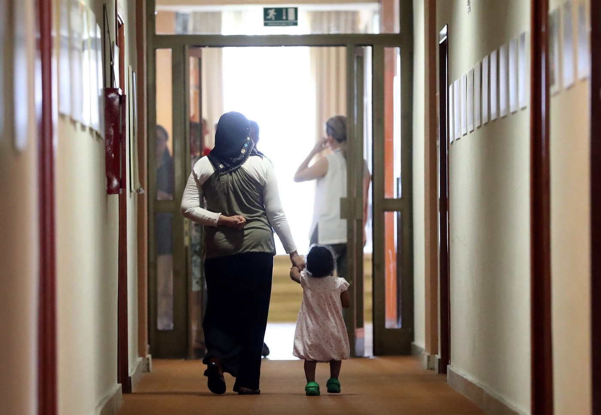
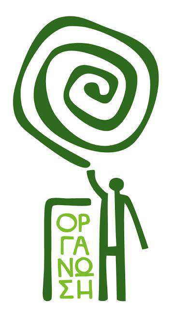
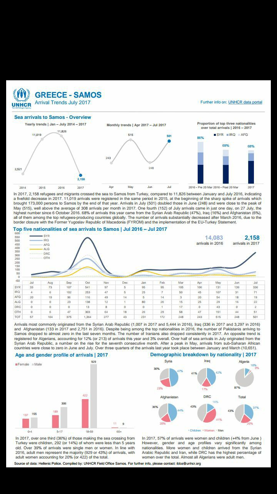

### AYS Daily Digest 03/08/17: Are all Dublin deportees a security threat? Croatia’s Security and Intelligence Agency thinks so\.

_Refugees have limited access to Greek labour market / Volunteer in Calais abused by police / Violence in Serbian camp / Asylum seeking couple in huge mental stress in Denmark due to upcoming deportation_

Porin asylum center in Zagreb\. Photo: libela\.org
#### Feature

**Warm welcome by the Ministry and secret services — almost all asylum seekers deported according to the Dublin regulation, including babies, single mothers and a nurse in a wheelchair, represent a security threat to Croatia?**

The arbitrary and unlawful practices by the Croatian Ministry of Interior \(MOI\) and Security Intelligence Agency \(SOI\) towards asylum seekers and refugees continue with impunity and at the end of July 2017, three months after our initial report, there has been no response from the relevant institutions\.

Meanwhile, there has been **more than a 100% increase of the number of documented negative decisions based on the undisclosed SIA opinion** , within a significantly shorter period of time \(April 30 — July 11 2017\) \.

An important thing to note is that the MOI information always refers to cases — i\.e\. to the number of the issued decisions, instead of the number of real persons\. In reality, the number is much higher, since underage children are listed on the asylum application of one of their parents \(usually the mother\) \.

For this reason, we have decided to show the information **both on the number of cases, as well as on the number of real persons** — asylum seekers whose lives are affected by these decisions\. This is especially important since it affects the rights of the most vulnerable group among the asylum seekers — **children and minors\.**

The number of negative decisions collected by July 11, 2017 is **44** , however,

57 **is the actual** **total number of persons affected by negative decisions, as collected by AYS\. This number includes 14 children\.**

Since the end of April until the end of July 2017, **the increase in negative decisions is over 130% — 132% if we count cases, and 138% if we count people\. Even more disturbing is the fact that people from both Syria and Iraq, active war zones, are being denied international protection\.**

In the four cases where the Administrative Court annulled the decision by MOI, it **did not grant international protection to the plaintiff, despite the fact that it has a legal mandate** to independently determine the facts, to independently present the evidence and to grant asylum based on the merits of the case\. It has instead **returned the case to the MOI and SOA for another ’round’ of assessment\.**

This behaviour clearly indicates that **neither asylum process, or judiciary practice in Croatia do not ensure the lawful and transparent treatment of asylum seekers with respect for their human and refugee rights\.**

These unnecessary delays in procedure result in people, some with small children, running away to Western EU countries due to the fear of negative decisions\. Suicide attempts and ’voluntary’ returns to war\-torn and unsafe countries are another consequence of long waiting periods and fear of negative decisions\.

**Conclusions and requests**

Based on the presented facts, AYS and CPS consider that there is a **visible and planned _discouragement policy towards the asylum seekers_** implemented by the State and **manifested in the unlawful practices by MOI and SOA** described in our reports\. The term **_‘discouragement’_** here is just euphemism, used by the institutions, for border violence, disabling the access to territory and to international protection system, unfounded rejections of international protection applications, absence or mere formal existence of integration policies and all practices that unable people to realize their rights, and to live a safe and dignified life \.

These unlawful and arbitrary practices clearly represent violation of human and refugee rights of asylum seekers and indicate the necessity of urgent reactions by the national and international bodies\. The good news is that the Administrative Court has identified the unlawful practices in several cases and has abolished it\. But at the same time it is worrying that in these cases, despite its’ mandate to grant international protection and regardless of the fact that all conditions for international protection were met, the Administrative Court has returned them to the same institutions that carry out these unlawful practices\.

Furthermore, this situation should be viewed in the light of the decision by the Court of Justice of the EU from 26 July 2017 in the case C490–16 and C\-646/16, which determined the responsibility of Croatia for examining applications for international protection by persons who crossed its border en masse during the 2015–2016 migration crisis, as well as in the light of the organized and reported violent push\-backs of refugees at the Croatian\-Serbian border and other parts of Croatia by the Croatian police\.

We urge the national and international institutions and organizations to provide immediate reaction to the presented AYS/CPS report and its’follow\-up\.

Full report is available here in [German](https://drive.google.com/open?id=0B_oKR2QQNUiPNk00Vy1nQkNHNTQ) , [English](https://drive.google.com/open?id=0B_oKR2QQNUiPY1BZRm5fNFdRYzg) and [Croatian](https://drive.google.com/open?id=0B_oKR2QQNUiPaDE2b3k2cjNLT2c) \. \(We recomand it especially to legal experts fighting Dublin deportations\. Feel free to contact us for any additional info\)
### Sea

_“After years of saving lives at sea, Italy is preparing to help Libyan forces who are known to detain people in conditions that expose them to a real risk of torture, sexual violence, and forced labour,”_ Human Rights Watch’s Judith Sunderland said to EUobserver\.

[Since 2014, 600 000 people](https://euobserver.com/migration/138677) have crossed the sea to Italy\. The current development at sea, does more to make the crossing more dangerous than safe\.

Jugend Rettet is updating on the events from yesterday, where their boat was confiscated:

■■■■■■■■■■■■■■ 
> **[Jugend RETTET - IUVENTA](https://twitter.com/jugendrettet) @ Twitter Says:** 

> > In this difficult situation, the many kind words and practical help from our supporters give us much strength. https://t.co/y91PUO97Nt 

> **Tweeted at [2017-08-03 15:22:38](https://twitter.com/jugendrettet/status/893129993068433408).** 

■■■■■■■■■■■■■■ 

MFS’s boat \#Prudence are still out there, and they rescued 127 people from a dinghy\. Among them there was 19 women and 6 kids\.

■■■■■■■■■■■■■■ 
> **[MSF Sea](https://twitter.com/MSF_Sea) @ Twitter Says:** 

> > UPDATE: Under the direction of the MRCC, the @[MSF](https://twitter.com/MSF) #Prudence has rescued 127 people including 19 women and 6 kids from this overcrowded boat. https://t.co/2oJrT9rrkt 

> **Tweeted at [2017-08-03 08:57:27](https://twitter.com/msf_sea/status/893033058693152769).** 

■■■■■■■■■■■■■■ 

Yesterday, [Missing Migrants project reported about eight lost lives in the Mediterranean](https://twitter.com/MissingMigrants/status/892664182268624896) \. Every life lost at sea is one to many, since it would be possible to prevent the dangerous crossings\. Instead, Italy, EU and other important stakeholders from several European countries are trying to make the life\-saving missions more difficult\.

**Also at sea — Defend Europe**

The British organization [HOPE not hate](https://www.facebook.com/hope.n.hate/) have been following Defend Europe and their “mission” several months before they rented the boat C\-Star and began their journey from Dijbouti to Catania\. The boat is rented from a company based in Cardiff, owned by Swedish Tomas Egerström, who in 2002 was sentenced for fraud and after that left Sweden\. He doesn’t see any problems at all with renting out a bout to right wing nationalists who’s mission is to supervise ngo’s that are saving lives\. In fact, he claims the opposite:

> If these organizations shouldn’t have done anything wrong — then they should have welcomed Defend Europe\. Like, here comes our opponents to show people that we are doing wrong, we’re not doing anything wrong — great — it’s just reinforcing us since they can’t prove anything\. 

As for now, Egerström is defending his company’s deal with Defend Europe\.

> But now I’m starting to wonder\. What is it everyone is so terrified that this boat will find out there? 

Joe Mulhall from [HOPE not Hate](https://twitter.com/hopenothate) , says that the original plan, to stop boats with migrants and return them to Libya and Tripoli, could be both illegal and dangerous\. He also stresses that only the fact that Defend Europe is at sea could be dangerous\. As of today C\-Star, according to HOPE not hate, was in the waters just outside of Tripoli\. Luckily, Defend Europes plan isn’t going as they wanted\. The events that have been following in Defend Europe’s path the last couple of weeks, are as tragic as comic\.

> They have been suffering from one embarrassing incident after the other during their journey\. The mission have been delayed, and as it is for now they are just floating around and getting suntanned\. They will probably not be able to do more than that, _Mulhall said\._ 

Also, it’s beyond comedy that the people that are claiming to be supervising “criminal ngo’s” have rented a boat from a former criminal, and have been accused of having forged documents and for people smuggling on their way accross the sea\. As for now, it’s not clear if Egerström agrees with Defend Europe, or if he just don’t care, Mulhall says\.

After all that is going on at sea, we wanna send a reminder about the report [Blaming the Rescuers](https://blamingtherescuers.org) , in which researchers from Goldsmiths University in London is putting an end of the tiring claim that ngo’s should be criminals, pull\-factors or causing more deaths at sea\.
### Afghanistan

[UN Assistance Mission in Afghanistan \(UNAMA\)](https://unama.unmissions.org/un-backed-debate-bamyan-leaders-call-unity-across-afghanistan) writes how important it is to collaborate within Afghanistan in order to change the internal situation\. The fact that the Islamic State is growing here, further shows how important it is to stabilize the war torn country, and include all minority groups\.

Since Afghanistan is one of the top refugee producing countries in the world, this is an important mission, which of course isn’t solved that easily since the country have been war torned for decades\.
### Iraq

For those interested in the latest displacement trends in Iraq, [this is a map as of the 30th July](https://www.humanitarianresponse.info/system/files/documents/files/snapshot_july_30.pdf) \. Mosul and the fighting there have lead to an increase of displaced people\.
### Greece

**Refugees shut out from labour market**

[Refugees in Greece have problems to get jobs and access to healthcare systems](http://www.ekathimerini.com/220637/article/ekathimerini/news/asylum-seekers-being-blocked-out-of-job-market-and-health-system-say-ngos) \. This is due to slow processes and a lot of bureaucracy before getting the social security number and tax identification code that is needed\. Ngo’s is raising the questions and are concerned over this, since people aren’t able to integrate and receice much needed health care\.

**Children stuck in prisons**

[EUobserver yesterday](https://euobserver.com/tickers/138664) reported that the number of refugee children stuck in Greek prisons have increased\. Last November it was 2 children, and now it’s 117\. This is in contradiction to everything human right’s organizations and ngo’s working on the ground have been suggesting in order to better protect the children from different kinds of dangers\. Already traumatised, and often separated and lonely children, shouldn’t be kept in detention\.
#### Mainland

**Athens**

**Camp to campus project**

> [INFORMATION SESSION](https://www.facebook.com/groups/AthensVolunteersInformation/permalink/1173001566165472/) ON ‘CAMP TO CAMPUS’ AT KHORA ON FRIDAY 4 AUGUST 3PM 

> “Camp to Campus” will be in Khora tomorrow, holding an information session at 3pm on the education floor\. They will talk about scholarship programme at Deree University in Athens\. Go along to find out more information about the application process\. 

**Dental care in Alexandria**

[_Health\-Point Foundation Dental/Medical Relief visited Alexandria today\._](https://m.facebook.com/story.php?story_fbid=463084244067493&id=183853795323874&hc_location=ufi)

_Today \#hpf visited Camp ALEXANDRIA a camp we visited some time ago\._

_Our dedicated volunteers treated and created 30 new smiles\._

_Continue to support HPF, visit our website and donate\._

They need financial support to [be able to continue\.](http://Www.healthpointfoundation.org)

**PAMPIRAKI’s warehouse needs donations**

These items are desired: _milk, tomato, sugar, olive oil, sunflower oil and coffee\._ [Follow the link for more information\.](https://m.facebook.com/groups/204202716585823?view=permalink&id=504363206569771)

**Arabic speaking volunteer needed**

[_Organization Earth is currently looking for a LIVELIHOODS EDUCATOR \(ARABIC SPEAKER\)_](https://www.facebook.com/groups/AthensVolunteersInformation/permalink/1173104569488505/?hc_location=ufi)

_If you are interested please contact me or send an email to: fr@organizationearth\.org_

**Islands**

Total of 24 [\#REGISTRATIONS](https://www.facebook.com/hashtag/registrations?hc_location=ufi) today\.

**Chios**

[Midnight Helpers](https://www.facebook.com/groups/ROYartsaveslives/permalink/1426114237478240/) are in Souda, and they are updating with some worrying pictures from a resident in the camp\. The conditions are still dire, and not nearly the standards they should be to accomodate human beings\. The information is saying that the camp is to be emptied, and yesterday 100 people left\. [Today their tents were demolished](https://m.facebook.com/groups/1096572967099037?view=permalink&id=1426114237478240) \.

**Lesvos**

The hungerstike in Moria continues and today volunteers from [No Border Kitchen Lesvos](https://www.facebook.com/NBKLesvos/?hc_ref=ARRDqFOP1Q1CTUYXi1KkdFFtXD9yY22X1XjyulROthYe70amTk3DIR0ejL9sE1LgOiw) joined in for 24 hours\.

](assets/6fdd5cd0553/1*Rzf2E2xHM1ZKwxhXujEosQ.jpeg)

Photo: [No Border Kitchen Lesvos](https://www.facebook.com/NBKLesvos/?hc_ref=ARRDqFOP1Q1CTUYXi1KkdFFtXD9yY22X1XjyulROthYe70amTk3DIR0ejL9sE1LgOiw)

**Vulnerability in a refugee camp**

[Since vulnerable](https://refugeesworldblog.wordpress.com/2017/08/03/vulnerability/) people didn’t get enough treatment depression is common, leading to self\-harm\. As the camp directors, they give priority to those harming themselves\. Most of the night doctors have these kind of patients\. [This blog](https://refugeesworldblog.wordpress.com/2017/08/03/vulnerability/) gives more info on the subject, from Moria\.

**Samos**

In Vathy a baby was borned this Saturday, which is the youngest resident in the camp\. [No more borders, No more tears](https://www.facebook.com/No-more-borders-No-more-tears-1254181771265187/?hc_ref=ARQiQBnT86b0fgOvuxwzwx-aphn5Zbmt694VKTWOqlJbJFRc40aYMQaaRUtw0SOvK2k) writes that the newborned baby girl currently sleeps in a box, in a refugee camp\. She isn’t even one week old, and circumstances have already made her to a refugee\. Read the full update from [No more borders, No more tears](https://www.facebook.com/No-more-borders-No-more-tears-1254181771265187/?hc_ref=ARQiQBnT86b0fgOvuxwzwx-aphn5Zbmt694VKTWOqlJbJFRc40aYMQaaRUtw0SOvK2k) here\.
They ask for [support](http://wp.me/PsaGo-1by) as the them is volunteers and they are funded only by [donations](https://www.gofundme.com/https-no-more-borders-no-more-tear…) \.

Photo: Organization Earth

**Samos update from UNHCR**

Source: UNHCR
### Bulgaria

[The numbers of refugees in Bulgaria have fallen significantly](http://refugee-children-caught-in-bulgarian-limbo-08–03–2017) , but there are still people and especially children that lacks proper care\. Currently there are 1639 asylum seekers, of whom 605 are children, housed in asylum centers, according to the State Agency of Refugees\. NGO’s active in Bulgaria are expressing that they are worried for the circumstances a lot of child refugees are living in, in particular their concerns are about unaccompanied minors\. Of the children stuck there are only 23 that goes to school, and only one that are attending Bulgarian classes, the Agency claims\.

[Another worrying fact is that children](http://refugee-children-caught-in-bulgarian-limbo-08–03–2017) runs a high risk of becoming victims of various kinds of violence, including SGBV\. Ivanka Angelkova, Program Officer on Refugee and Migrant Children with ‎UNICEF, says that this in particular affects the 101 children that are traveling alone and are housed in the governmental centers\. Compared to last year there is a drop in numbers, in August 2016 416 unaccompanied minors were counted within Bulgaria\.

[According to Agnelkova, UNICEF official](http://refugee-children-caught-in-bulgarian-limbo-08–03–2017) , the Bulgarian government are facing difficulties with the protection of these already vulnerable and lonely children\. They are having problems with identification, since a lot of kids doesn’t have documents\. There are also a huge problem with that children are kept in closed detention facilities with adults they aren’t familiar with\. Which leaves them in dire conditions where they are exposed to several already mentioned dangers\.

All NGO’s working with this have suggested to open special accommodations for the unaccompanied minors in order to grant them better protection, but this has yet not been done\. Staff from IOM says that Bulgarian homes for orphans are neglecting refugee children as well\. IOM are in a process of opening a center, but no further details are yet known\.

](assets/6fdd5cd0553/1*0lxf3qTKwjTHSXSrproVrw.jpeg)

Photo: [Art Against](https://www.facebook.com/artagainstproject/)
### Serbia

Last night there was an attack against a refugee in Sombor camp\. The information a AYS volunteer received over phone was that Serbian men went to attack with a knife\. The boss of the camp said that it’s wouldn’t be a problem for him if the residents should die\.

Now the man is in hospital\. The refugees don’t feel safe anymore and want more protection\. At the moment it is quite difficult to get some clear information because they all are angry and upset\. We will update with more info as soon as possible\.
### Italy

**Update from Gorizia**

[According to local volunteers,](https://www.facebook.com/mauro.chiarabba/posts/1855731534443329) 75 people were to be moved to other regions today, among them to Lombardia, Piemonte and elsewhere\.

Volunteers wonder, what good the moving of 75 individuals will do, since more people will continue to arrive today, tomorrow and the day after that\. Italy is a stepping point for moving on further, and people are arriving here from the so called “closed” Balkan route\.

](assets/6fdd5cd0553/1*TTMP1fyrABIaFnX22GLf2g.jpeg)

The situation in Gorizia, photo: [Mauro Chiarabba](https://www.facebook.com/mauro.chiarabba)

[Local media said that three buses](http://www.fogliogoriziano.com/cronaca/migranti-in-partenza/) will leave from Gorizia with the destination reception centres in Lombardia, Piemonte and Abruzzo\. The people will be transfered in groups of 25\. Local authorities welcome this initiative, but will ask the government to do more in order to help them face the emergency situation the region is currently in\.
### France

[L’Auberge des Migrants](https://www.facebook.com/LAuberge-des-Migrants-358496450338/?hc_ref=ARRz32G8m105F7cccZex-Fr_KWP9ckZfYb35e27JbtnODlbQuiqRNT7ONMxz9jsOUHw&fref=nf) [is updating from France](https://www.facebook.com/358496450338/photos/a.10152514841565339.1073741825.358496450338/10155302585340339/?type=3&theater) \. They have reached their goal for donations to be able to build a roof\. The recent images of [the rain](https://www.facebook.com/358496450338/photos/a.10152514841565339.1073741825.358496450338/10155302585340339/?type=3&theater) confirm the big need for a roof to be installed\.

](assets/6fdd5cd0553/1*ULarmJkfo0UacXlSeE-sKA.jpeg)

Photo: [L’Auberge des Migrants](https://www.facebook.com/LAuberge-des-Migrants-358496450338/)

**Volunteer badly abused by police**

[An incident came to our attention](https://m.facebook.com/story.php?story_fbid=10155052190209092&id=737744091&hc_location=ufi) , when yesterday a volunteer in Calais was beaten up by police after they stopped his car\. This is far away from acceptable — and a part of a terrifying trend in Europe, where those that are helping after authorities fail are criminalized and targeted by the police forces\. Eight police officers were involved in the incident\.

**Showers in Calais, but no accommodation**

[The local authorities in Calais announce](http://france3-regions.francetvinfo.fr/hauts-de-france/pas-calais/calais/migrants-calais-douches-sanitaires-seront-installes-semaine-prochaine-1306163.html) showers will soon be put up, [but as a concerned individual writes:](https://www.facebook.com/groups/calaismigrantssolidarity/permalink/10154808517689562/?hc_location=ufi)

> [_Calais: showers and sanitations will be installed_](https://www.facebook.com/groups/calaismigrantssolidarity/permalink/10154808517689562/?hc_location=ufi) _‘by next week’\. Great\. When are the unaccompanied minors, women, families and young children going to be given accommodation? When is everybody else going to be given accommodation? When are the police going to stop beating people and spraying CS gas in their faces?_ 

### Denmark

[An Iranian couple threaten to set fire to themselves after getting negative asylum decesions](https://www.tv2nord.dk/artikel/drama-paa-asylcenter-aegtepar-truer-med-saette-ild-til-sig-selv) \. The couple already had two gasoline containers prepared\. After the incident thay have been receiving psychological support, as well as the other people living in the center and the hired staff\.

The incident was stopped by dialogue and it doesn’t seem to have been any violence included\. The couple, the other people living in the accommodation center and the staff are okay after the circumstances, at least physical\. The psychologically health among the people faced by deportations is a whole other question\.

This didn’t change the fact that the couple are to be deported, and they are still to be moved to a deportation facility instead of the asylum seekers accomodation they currently are residing at\. According to statistics, Iranians in Denmark have a really narrow chance of getting asylum\. This specific case will be followed by activists and will hopefully go to the human rights court\.

_We strive to echo correct news from the ground, through collaboration and fairness, so let us know if something you read here is not right\._

_Anything you want to share — contact us on Facebook or write to:areyousyrious@gmail\.com_

_Converted [Medium Post](https://areyousyrious.medium.com/ays-daily-digest-03-08-17-new-joint-report-about-how-croatia-is-failing-to-provide-safe-asylum-6fdd5cd0553) by [ZMediumToMarkdown](https://github.com/ZhgChgLi/ZMediumToMarkdown)._
