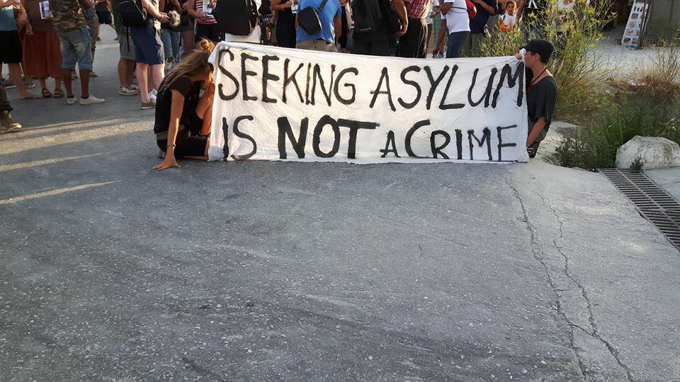
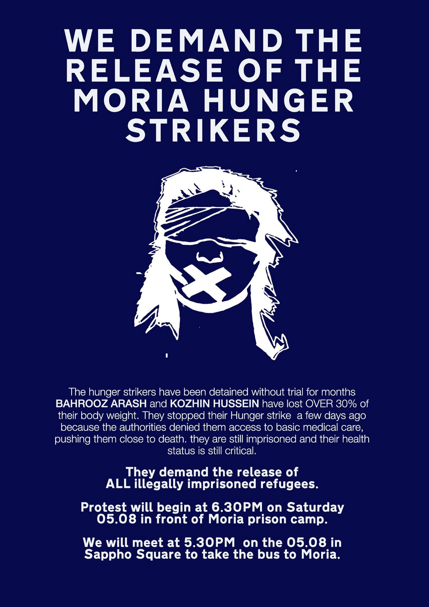
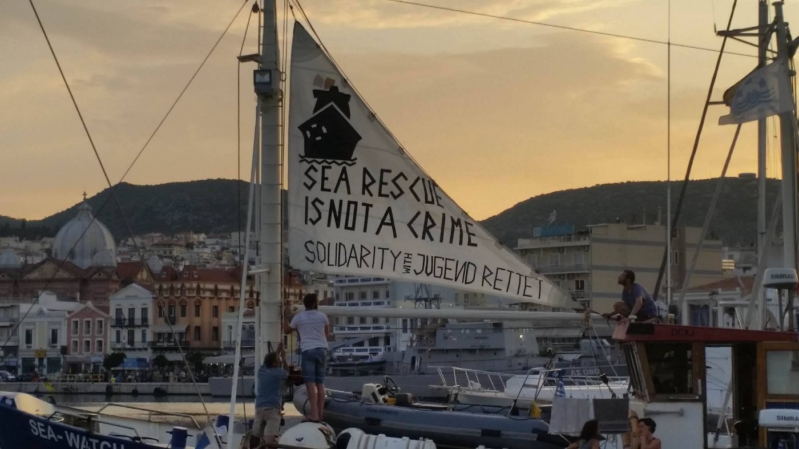
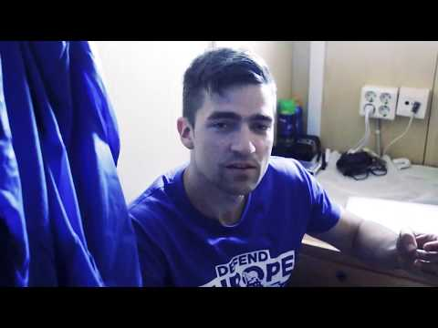
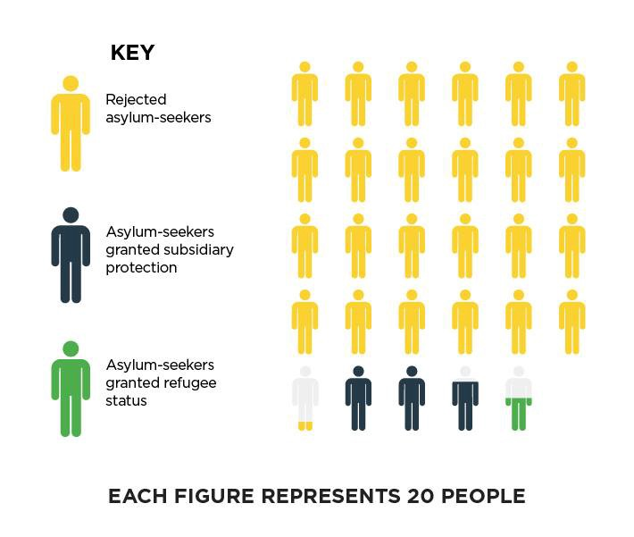
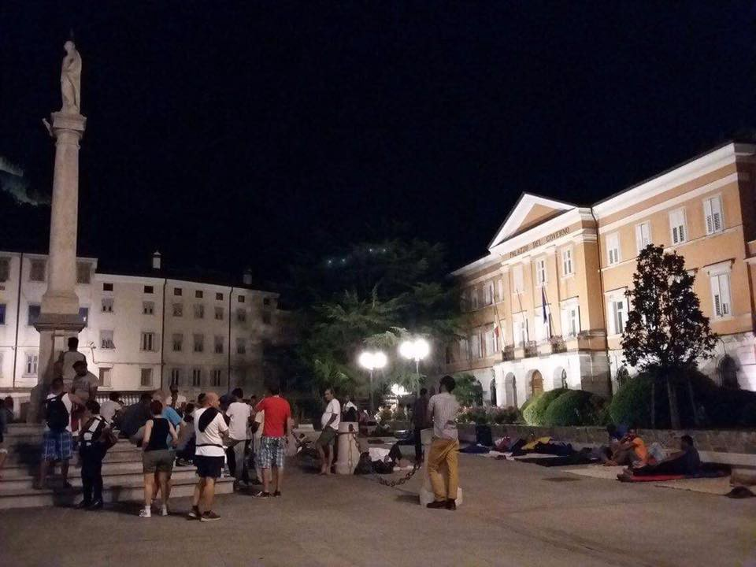

### AYS Daily Digest 05/08/17: Enough is enough\!

_People seeking refuge and freedom surviving in European limbo / Solidarity with people in detention in Greece, across Europe / European Absurdistan — fascists act freely while rescuers scrutinized / About 700 people in Calais / Make shift camp with over 700 people in Mezt / And more news…_

It is one of the basic human right\. Yet, so many people are in detentions or just left in limbo because they dared to ask for asylum \(Photo by City Plaza Athens\)
### FEATURE: Stay safe, stay angry, stay united\!

It has been over two years since the beginning of the European crisis which unknown number of people in limbo built by incompetent bureaucrats from EU institutions, individual governments, and big non\-governmental and inter\-governmental organizations\.

Humiliating procedures, lack of adequate accommodation, or of basic care, often the lack of minimum human decency in contact with people who are seeking safety, accompanied by arbitrary detentions, are just part of the story which makes European Union into Absurdistan, a term used to describe an area in which absurdity is the norm\.

In that state of absurdity that we all are trapped, those who saving lives are being prosecuted or beaten up by the authorities, while those who promote fascism are free to fulfill their mission\.

In Absurdistan, a man can be on hunger strike for 38 days while the responsible authorities are remaining completely ignorant about him and causes of his protest\.

What remains is for us, the people, to unite in solidarity\. With that idea, 
[No Border Kitchen Lesvos](https://www.facebook.com/NBKLesvos/?hc_ref=ARSuoIi0PhVXWo2ExABoIXAqnmT8MYQDvi0xvED3y2zLmw9ks8oyhdbzE4YxsasJDW8&fref=nf) will join Arash Hampay on his 39th day of hunger strike and protest against arbitrary imprisonment, and dehumanizing treatment of people in detention\. For those in Lesvos, call to join them\.

_“Friends and comrades, a reminder to meet together at 5\.30 sharp in Sappho Square or 6\.30, directly in front of Moria, to protest the continued detention of the brave hunger strikers Bahrooz Arash and Khozhin Hossein, and the illicit detention and abuse of all refugees and political prisoners in Lesvos and across the world\.”_
#### It will be a peaceful protest\.
Stay safe and stay angry comrades\.

Let us show solidarity with people on islands\. At Samos, basic care has been provided by independent groups instead of those who are receiving huge amounts of money to do that\. Pregnant women are sleeping outside, new born babies are sleeping in carton boxes, and people still facing difficulties with lack of water\. [No more borders, no more tears](https://www.facebook.com/No-more-borders-No-more-tears-1254181771265187/) team pleads for help every day\.

The [Refucomm team](https://www.facebook.com/refucomm/) reminds about disgraceful living conditions and lack of basic care at Chios\.

_“No one should have had to live like this\. Not when the EU has provided such huge sums to take care of refugees stuck in Greece\. In the winter we watched people freezing in the snow, dying trying to keep warm, and now summer is here people are living in blazing heat with no protection from the sun\. The water is regularly cut off\. It is not a proper shelter, it never was\. The long waits while Greece sorts out their procedures led to self\-immolation\._

_The stain of Chios will live long in history\.”_

Absurdistan\.
### Sea
#### We stand with Jugend Rettet e\.V and MSF\! \! \!

[United Rescue Aid](https://www.facebook.com/unitedrescueaid/?hc_ref=ARSyxwrWHWj9t09jCtnlpe9Fbl5yM2RA85EKiU5T-LRiytiHFecqMN4aLI0Snv1MY2M&fref=nf) team remind us one more that that sea rescue is not a crime, but the mandatory duty for all those at the sea\.

Photo by United Rescue Aid\.

_“The International maritime law governs sea rescue\. New policies that EU, Italy, and France are proposing are contrary to that law and human rights conventions\. The only reason why search and rescue boats are operated by organizations is that officials are failing to protect lives at sea\.”_

We join them and stand with [Jugend Rettet e\.V](https://www.facebook.com/JugendRettet/?fref=mentions) whose boat has been seized, while they have been under the investigation\.

We also stand with the MSF who is, apparently, also under investigation over its role in rescuing people who are crossing the Mediterranean Sea\.

MSF said in a statement it had not been notified of the inquiry and that it stood ready to cooperate with prosecutors since similar accusations first surfaced in the press months ago\.

Meanwhile, North African collective issued an statement against racist ship C\- star that is trying to stop people from coming to Europe, and which approached Libyan cost today\. Aquarius crew spotted them near the coast\. But, in this Absurdistan this all is just fine\.

■■■■■■■■■■■■■■ 
> **[Paco Anselmi](https://twitter.com/pacoanselmi) @ Twitter Says:** 

> > The C-Star can be now seen from the #Aquarius https://t.co/3pTEbElRN9 

> **Tweeted at [2017-08-05 13:14:28](https://twitter.com/pacohansel84/status/893822512349532160).** 

■■■■■■■■■■■■■■ 

This is C\-star crew\.

_“Their discourse is infused with racist ideology and paranoid delirium, behind the humanitarian screen of pretending to save migrants from drowning; according to them Europe should be protected from the “invasion”, the “tidal wave of massive immigration”, while Europe is locking itself behind its walls, is restricting the access to visas through degrading processes, and is welcoming or rather tolerating only a small number of refugees on its territory… They try to defy those who cannot have the same freedom of movement or resources with their “Stay at Home” banners\. That’s why we send back to them their slogan: « Defend Europe, Go Home\! You are not welcome here\!” the_ North African collective wrote in their statement calling for a massive mobilization to stop C\-star\.
### Greece

Today, 106 people arrived in Greece, according to volunteer teams on islands: 33 arrived in North Maytlini; 26 to South Maytlini; and 47 to Samos\. At this point, probably nobody knows how they will be treated and what rights they will be granted\.

While people at Souda are being slowly moved from the camp, rumors are being spread that Vial will become closed center soon\. At the same time, people who are still in Souda are not given enough information about what is happening or what is gonna to happen\.

The camp, according to [RefuCom](http://www.refucomm.org) sources, will definitely be closed down soon\. To help to the people, this team plans to send 200 micro SD card trial into Vial for people who haven’t yet had their interviews so that they have access to information about the procedures and interview preparation\. The price of the card will be to join their WhatsApp groups\.

_“It really is essential now, more than ever, that people stay connected and we are racing against the clock to get it done\.”_

The team, together with [Refugee InfoBus](https://www.facebook.com/RefugeeInfoBus/?hc_ref=ARTil1__CQTxqMO5GtXKCaYmbUkWEKw-B4qrY5vnuwiMtax-apuggzE92EhRFB4Urmw) , also set up a line so that people can report potential deportation\. Deportation advises and numbers for support groups in Turkey are included\.

_“We can track what happens to people\. If their phones are confiscated by the authorities they still have the SD card which includes support numbers for them and a record of their important documents\.”_

They call on all the groups in Greece to pull together and put plans in place _“to make sure people are assisted in creative ways and we need to move fast\.”_

**“This is a new reality, and we are agile enough and smart enough to beat the system, aren’t we? Isn’t that what we are good at?”**

They need volunteers to help them to load and distribute SD cards on the Islands and funds for SD cards and printing of instruction leaflets\.

[Local media](http://www.ekathimerini.com/220676/article/ekathimerini/news/roof-collapse-in-patra-kills-one) are reporting about the another incident in Patras where a man died on Friday, and others were feared dead or injured, after the roof of a derelict building collapsed in the old harbor\. Apparently, a person who died in the incident was a refugee who was waiting to try to cross the sea and reach Italy\. Because in Absurdistan, it is a norm that people taking dangerous routes only to be able to ask for the basic rights\.

The partially good news is that an EU\-funded program is ongoing with the aim to provide with housing and financial assistance all the people in camps\. One of the camps that are affected is Softex, Thessaloniki, that will — apparently — be closed on Monday\. Currently, there are between 300 and 400 people in this camp, including some families, who do not have proper information about what will happen to them next week\.

Hopefully, all the people from camps will be transferred to proper accommodation by the end of the year\. However, we have to remember that similar was promised before\. Nevertheless, we are here to observe this process and report about it\.

[The info is](http://www.infomigrants.net/en/post/4458/greece-to-extend-refugee-housing-program) that the Emergency Support Program for Integration and Housing \(ESTIA\) is managed by the UNHCR, that is not famous for its efficacy\. All the people who will be transferred will be provided with pre\-paid cards which will give them access to food, medicine, and public transport\. In the mean time, people are still in camps, in hard to describe conditions\.

If you complain about the heat, try to imagine living under plastic tents or in Iso Boxes\.

What will happen with those who are still arriving is not clear to anybody\. Or with people who are living in squats and do not receive any kind of help from the UN or EU, but only from small self\-organized groups\.

Among the new arrivals are also 17 people from Turkey — three women, four children and 10 men — who entered Greece through the island of Rhodes, and have asked for asylum, saying their lives are in danger in Turkey\.

Meanwhile, [the media are reporting](http://www.ekathimerini.com/220677/article/ekathimerini/news/athens-erasing-asylum-backlog) that the government “has taken a significant step toward restoring the credibility of its asylum system”, since they managed to process 97\.5 percent of a backlog of about 84,000 asylum claims submitted before 2011\.

Apparently, people who sought international protection more than five years ago, and have a pending appeal and possess a valid asylum seeker’s permit, are granted a residence permit on humanitarian grounds\. The measure affects about 800 cases\. It took them only several years\.
#### Hungary

[Refugee\.Info team](https://www.facebook.com/refugee.info/?hc_ref=ARSac9jATPz90EoYErUOP262-ylM-r-F3qpzDVXYqUGuDkJBOSMnjRDD3mc_dZBviFM&fref=nf) posted data about the chances for people seeking asylum in Hungary stressing that it is amongst the lowest in Europe\.

According to the official data, since the start of this year, only 321 people have been granted protection in Hungary, while 2,417 people have been rejected\. Only 10 people are allowed to enter every day\. They are forced to live in prison like facilities, where they are treated in most degrading way\. And that is the norm in the EU\.
### Italy

In Gorizia people are also uniting and trying to find solution to present sinking of the Europe\. As we were informed, people gathered and they will continue to meet and try to coordinate the work on the ground\.

Photo of Gorizia last night, by One Bridge to Idomeni
### France

According to the media, one person — migrant whose nationality is not yet established — died when hit by a car on the A16 motorway near Calais\. This is the second death of a migrant in Calais and its surroundings in 2017\.

In 2015 and 2016, 33 people died in this area, according to an Official statement\.

Currently, there are around 600 people in Calais\. So far, they are living with minimum, provided manly by volunteers\. By the court decision, the local authorities are obliged to install showers and toilets, the first elements of the aid scheme before the end of next week\.

Even [bigger tragedy was prevented](http://france3-regions.francetvinfo.fr/hauts-de-france/nord-0/dunkerque/loon-plage-26-migrants-decouverts-camion-frigorifique-dont-enfant-hypothermie-1304639.html) when a truck was discovered on Saturday morning, around 6:30 am, at the ferry terminal\. A group of 26 people was found in a refrigerated truck bound for England, among them a child of two years in slight hypothermia, accompanied by his mother, from Iraq\.

Today we got the information about some 700 refugees who are living in an improvised refugee camp in city of Mezt\. The camp is constructed in a parking lot in March this year\. Dozens of people are arriving here every week\. According to some media reports, there are 6 or 7 showers for women and men and only 3 places to cook, and about 10 bathrooms for everybody to use\.

Help is still needed in Paris\. [Solidarithé group](https://www.facebook.com/solidarithe/?hc_ref=ARQnQtVyDLlxbCtCj6CamfltWW21vN4txAnCUSgmERyiOSxis2pbgKzltDg03SZMJHo) needs volunteers\.

_“We are serving between 500–600 cups of tea a day as well as providing a safe space for people to relax & get creative\. In order to continue providing legal/moral support, we need volunteers and supplies — sugar, cups, instant coffee, paper, art supplies, or money for buying supplies in bulk & van expenses\.”_
### The Netherlands

[Afghanistan Migrants Advice & Support Org](https://www.facebook.com/Afghanistan-Migrants-Advice-Support-Org-195295217167437/?hc_ref=ARQA00BNYqwmhJqyN9ECIvty8g86nhxnE51YKBfkHCFQxDTR_lryBO_1QHTPmVZl1SI&fref=nf) reports about 
Zarafi family that was deported to Afghanistan on 29th of July 2017\.

_“Since then, they have been living in a returnee receiving center close to the Ministry of Refugees and Repatriation\. All those deported are accommodated for 14 days at the center if they wish to\._

_AMASO met the family few days post deportation\. The condition of the mother is severe and is suffering from high level of mental health disorder, she faints and has been crying since their return to Afghanistan\. During the flight, the mother’s hands and feet were wrapped with cuffs and escorted by two police sitting beside her at all time\. She had gone to a state of unconsciousness and was checked by medics at least two times mid air\._ 
_The children have been going to school and playing football\. The younger boy is afraid of the situation in Afghanistan and has been complaining about the blasts and fears of being victim of these blasts\. According to Mr\. Zarifi, the children were protected by a law in Netherlands that prevents children from deportation\. They have deported anyway\._

_The family has nothing left in Afghanistan and are concerned about the future of their children\. They will soon expire their time in the center and have to move out of there and has no place to go\._

_The pleas of a mother asking for help is one of the things we can never forget\. Continuing pouring her heart out, the mother’s questions were something we couldn’t answer\. What was the fault of my children? who will be responsible if something happens to them here? Our case is still under process, how could they deport us? and dozens of more questions that needs an ear to hear and give a satisfactory answer to a mother concerned for the future of her children\.”_

Those who have power in Absurdistan claim that Afghanistan is safe country\.

> **We strive to echo correct news from the ground, so let us know ifsomething you read here is not right\.** 

> **Anything you want to share — contact us on Facebook or writeto:areyousyrious@gmail\.com** 

_Converted [Medium Post](https://areyousyrious.medium.com/daily-digest-5-8-2017-enough-is-enough-5061107d4dfe) by [ZMediumToMarkdown](https://github.com/ZhgChgLi/ZMediumToMarkdown)._
