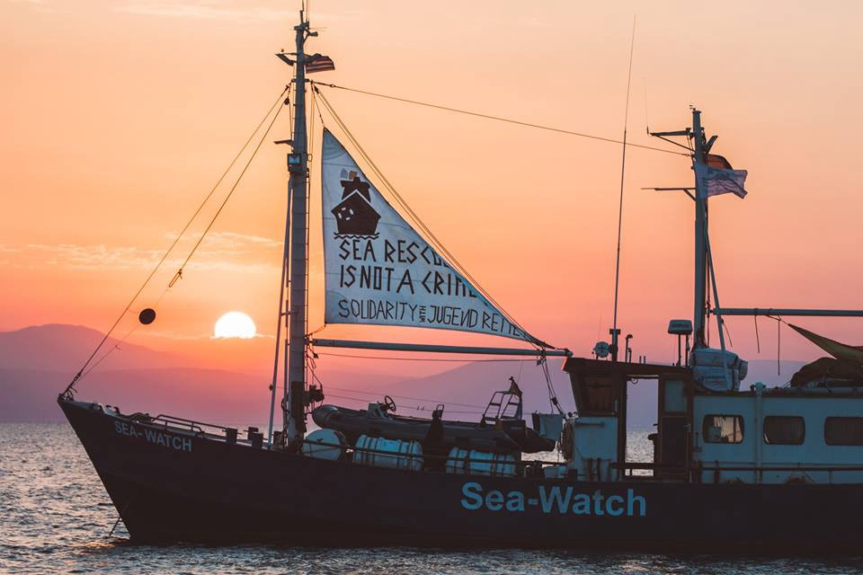
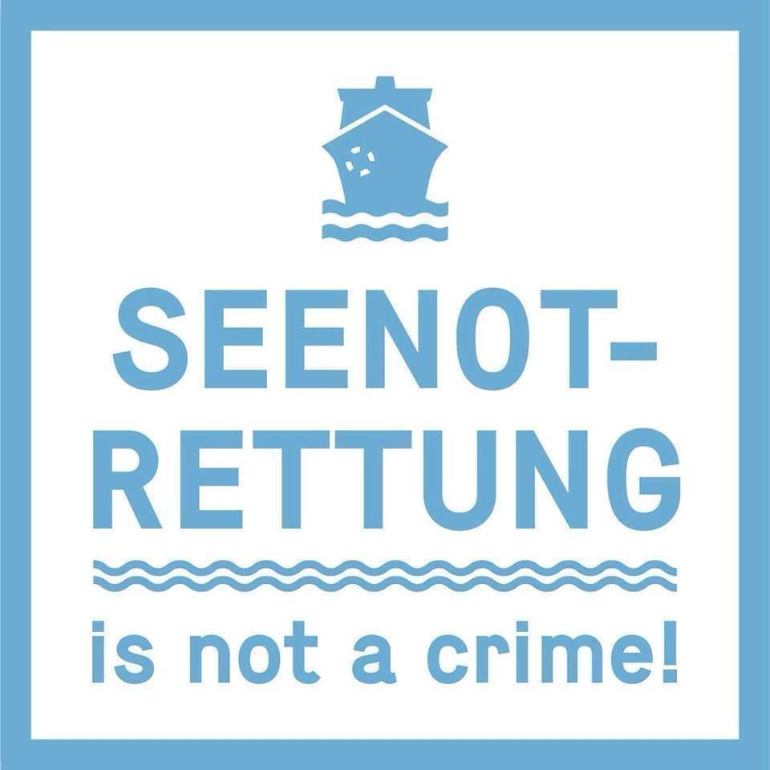
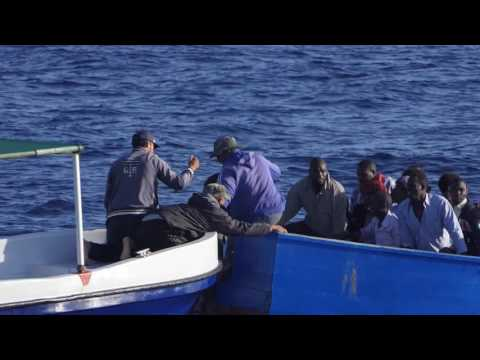
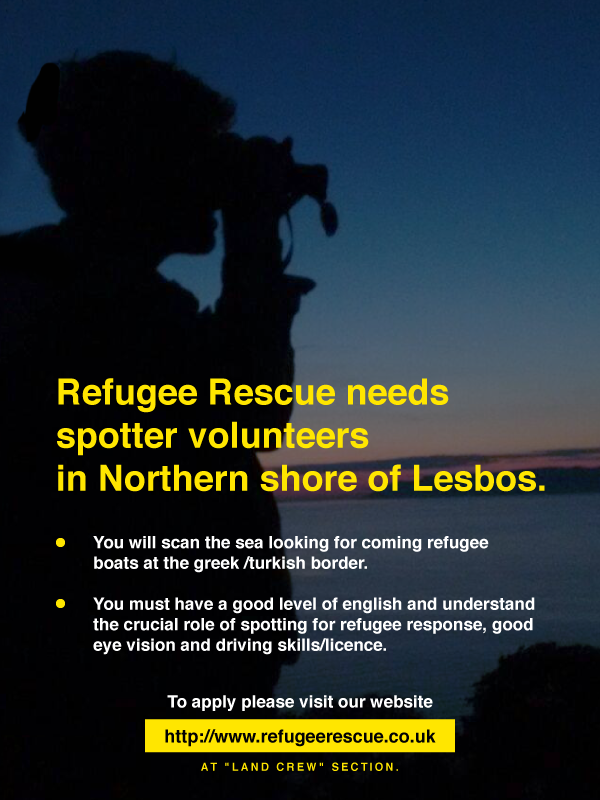
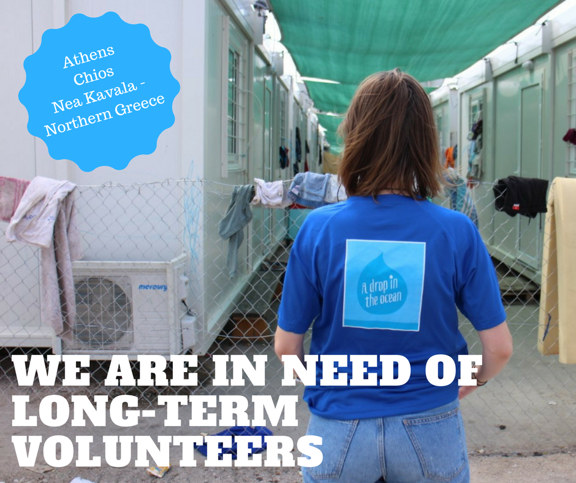
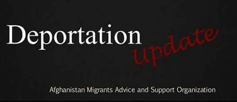

### AYS Daily Digest 06/08/17: Seenotrettung is NOT a crime\!

Pressure continues on rescuing NGOs / Protests against C\-Star / More arrivals in Greece / Volunteers and donations needed / Violence in Serbia continues / Germany starts to send refugees back to Greece / And more news\. \. \.

SeaWatch in solidarity with the Jugend Rettet crew
### Feature

Apart from the restrictions imposed on Iuventa, the Jugend Rettet boat that has been restrained by the Italian coast guard for allegedly cooperating with human traffickers in the Mediterranean, today MSF boat Prudence was denied access to the port in Sicily today and that the Italian coast guard took the 127 refugees they rescued and brought them to Lampedusa\. It is suspected that the reason might be to exert pressure because MSF has not signed the code of conduct, continuing the pressure by the authorities on the NGOs saving people at sea\. MSF itself issued a statement from their office in Vienna saying that they have not been informed by Sicilian prosecutors in Trapani about alleged accusations against the organization\. Current media reports are similar to rumors which came up a couple of months ago but MSF have conducted their rescue mission in full cooperation with all relevant Italian authorities, and there were no indication from officials that MSF might be operating in any wrong way, nor was it requested to change the mode of operation\.

> It’s troubling to read in the media about alleged accusations against us\. 

> MSF respect all Italian laws and is fully cooperative in informing authorities about our search and rescue missions\. We emphasize once again that the rescue missions are completely transparent and in compliance with international maritime law and in strict coordination with local authorities — precisely with MRRC in Rome \(Maritime Rescue Coordination Centre\) \. 

> As one of the biggest humanitarian NGOs with missions in about 70 countries we are proud of our rescue mission in the Mediterranean\. Our only goal is to save lives in acute danger\. 

> MSF has supported more than 18,000 persons in distress at sea this year\. All rescue missions were coordinated by the Italien coast guard\. 

A [**petition**](https://rettung-ist-kein-verbrechen.de/) was launched to demand the release of Iuventa boat so that its crew can go back to the sea to do what they do best\. \. save the lives of desperate people\!

Still about this case, new reports have emerged contradicting the “evidence” used by the authorities to restrain the boat in the first place\. It’s well known that many people try to take vantage of the refugees anywhere they go and now it seems that some groups of people are going around the refugee boats steeling their engines\. These “egine fichers” as they are being called have been filmed doing exactly this and this seems to have been understood, or used as an excuse, to charge Jugend Rettet with the crime of cooperating with people smugglers\. This [report](https://www.facebook.com/notes/erik-marquardt/seenotrettung-warum-die-beweise-gegen-jugend-rettet-nur-schikane-sind-und-wer-wi/1609369562468283/?hc_location=ufi) goes even further and states that the Libyan Coast Guard intercepted these pirates and didn’t arrest them raising concerns of possible cooperation with them\. Either way it seems clear on the video taken by the crew from Iuventa that rescuers don’t have anything to do with these people and in fact shout at them to go away\.

We continue to wait and hope that all pressure against NGO’s, especially Jugend Rettet is withdrawn and that we all concentrate in the most important subject: care for people in danger\.
### Sea

Even with all the trouble imposed on the NGOs, today it was another busy day at sea and several people was rescued\. As referred before, 127 refugees were rescued by the MSF boat Prudence and then transferred to a Italian coast guard boat that took them to Lampedusa\. [**SOS MEDITERRANEE FR** ‏](https://twitter.com/SOSMedFrance) has also reported that the coast guard rescued 100 refugees from the sea\.

We also get reports of further 400 people being intercepted, but this time by the Libyan coast guard on Sunday morning\. According to this force, the refugees were rescued west of Tripoli and were taken back to a landing point and provided necessary medical assistance by the International Medical Commission and handed over to the illegal immigration control and then transferred to shelter\.

In the meanwhile, the C\-Star, a boat chartered by anti\-immigration group “Generation Identity” which crew we showed yesterday, is not making friends out there\. Today there has been more demonstrations against the crew’s intentions and in Tunisia, fishermen vowed to block the ship carrying far\-right activists from docking at their port\.

](assets/57577c2e2384/1*TBFsSCN2S_VKj2I6ha2YUA.jpeg)

Photo by [Daily Sabah](https://www.dailysabah.com/africa/2017/08/06/tunisian-fishermen-vow-to-prevent-anti-immigrant-ship-from-docking/amp)

“If they come here we’ll close the refueling channel,” Chamseddine Bourassine, the head of the local fishermen’s organization\.

“It is the least we can do given what is happening out in the Mediterranean,” he added\.

“Muslims and Africans are dying\.”

An official at the port, who asked to remain anonymous, said:

> “What? Us let in racists here? Never\!” 

The North African Collective also issued a statement against their actions\. Born as a group of Tunisians and Europeans who wanted to do something against the c\-star, it spread all over North Africa with the precious help of comrades and companions from France, Greece and Cyprus\. Now they are turning the slogan of the “Defend Europe” operation around:

> We call on all actors of civil society, all those responsible, all seafarers, watchmakers, all ports, all the captains of commercial ships, all interested parties throughout North Africa, so that Oppose the arrival of this ship in one of our ports, prevent it from entering our territorial waters and refusing to deal with or communicate with its crew\. 

> The ship is approaching dangerously to the Libyan and Tunisian coasts\. In Egypt, Greece, Cyprus, and even Sicily, anti\-racist citizens have already overturned C\-Star landing attempts and ridiculed their propaganda\. 

> Let’s do the same thing here\! 

> **“Defend Europe” go home\!** 

### Greece

Continuing the tendency seen in the last few days, there was a high number of arrivals today in the Greek islands\. According to volunteers, 82 refugees arrived to Lesvos between Saturday and Sunday and 47 arrived in Samos\. Other reports from the Portuguese maritime rescue team, part of Frontex, say that 44 refugees were rescued close to the island of Kastellorizo including 19 children, 15 women and 10 men\. 27 are from Iraq and 17 from Syria\. They were lately transferred to Rhodes\.

More refugees continue to arrive to Greece whilst the process of relocation continues too slow which means more people stuck in terrible conditions, especially in the islands\. Up to the 31st of July, only 25392 people had been relocated, 17457 from Greece and 7935 from Italy\. You can check all the numbers and how much the different countries are contributing [here](http://reliefweb.int/sites/reliefweb.int/files/resources/58668.pdf) \.

Yesterday [**No Border Kitchen Lesvos**](https://www.facebook.com/NBKLesvos/?hc_ref=ARTsWgh1F1om68kbchj6DwQxGxdw8CDUCuUHKdtA4LlIlEWzuo6_nR9RZfLost38lu4) organised a demonstration in solidarity with hunger strikers Amir and [Arash Hampay](https://www.facebook.com/arashampay?fref=mentions) \. About 100 people raised their voices to reach Bahrooz Arash and Kozhin Hossein, still incarcerated behind three ranks of barbed\-wire fences inside Section B detention centre\. Today Arash issued a statement about the initiative\.

> I, [\#ArashHampay](https://www.facebook.com/hashtag/arashhampay?source=feed_text&story_id=505585739787517) , am a refugee\. I kiss your kind hands, all you compassionate people\. I humbly bow my head to you in honour of your strong will, your love, and your love for humanity\. To the police, the state, and the UN, you vile executioners did not listen to us, you remained ingnorant and indifferent to our screams of pain and to our dance with death\. You remain like this because you have already stamped us with the barcode that labels us as refugees and non\-citizens\. Are you going to oppose your own people, your own citizens, and your superiors? Are you going to ignore the demands of your own people and citizens who have called for the liberation of refugees? Remove the walls and fences that you have built to seperate people from each other\. Free the innocent incarcerated refugees\. If you do not submit to the demands of the people, one day you will bitterly regret your actions\. 
 

> We are the people\! We are here\. We are still upholding our vow\. I am going to remain on hunger strike until the day of the freedom for Kozhin and Behrooz\. We will continue our struggle until the borders are open and the walls are torn down\. We will not compromise our demands\. Freedom, Justice and Safety are our basic rights\. 

#### Athens

The first groups of refugees have received European Qualifications Passports after successfully passing an evaluation process to verify their higher education credentials\. Fifty\-four refugees, mostly from Syria, living in refugee camps in Attica have received the documentation through the first two rounds of the Council of Europe’s “Recognition of Qualifications held by Refugees” pilot program\. The document gives information on their education qualifications and presents information on the refugee’s work experience and language proficiency and aims to provide refugees with an authorised assessment of their credentials that they can carry from one country to another\. The scheme was specifically developed for refugees who do not have original documents proving their education qualification\. Students begin by filling out a self\-assessment questionnaire\. Then, any documentary evidence they may have including transcripts, photos of coursework or photos of them studying from social media is assessed and finally, students undergo an interview with a professional credential evaluator in English or their native language\.

The Council of Europe is working with the Greek Ministry of Education and the UN High Commissioner for Refugees to recruit students for the free assessment\. The third round of assessment is set to take place in September with at at least 20 more refugees\.
#### Volunteers and donations needed

[**Refugee Rescue / ‘Mo Chara’**](https://www.facebook.com/RefugeeRescueUK/?hc_ref=ARRVl8OUu6-VbJUlIFkZ1RLt3QiHZvx70NGhcyOa4DTUL5YTkuVeM0f3L702KPWryf4&fref=nf) is looking for crucial spotters in the coming weeks\. As a spotter volunteers make sure that we loose no incoming boat out of sight\. Spotters are key to ensure that search and rescue missions are launched in time\.

Refugee4Refugees is also looking for volunteers for August and September\. They operate on the north coast of Lesvos, spotting for refugees boats, providing emergency assistance at landings, as well as providing vital water and food to newly arrived migrants\. If you can help, please get in touch [here](http://Dale Hamilton) \.

[A Drop in the Ocean](http://Dråpen i Havet) is looking for people who are able to spend more than two months at one of their three locations — Athens, Chios and Nea Kavala, Northern Greece\.

If you can contribute for a shorter period of time\(minimum ten days\) you are of course still more than welcome to volunteer with them, please find out how [here](https://www.drapenihavet.no/…/we-need-long-term-volunteers…/) \.

[**DocMobile — Medical Help e\.V\.**](https://www.facebook.com/docmobile.org/?hc_ref=ARRp5fzrAF4vDKscqH6HTueLwIWK82dpXi8IH7Bkh3XTwCtaPLiEm2gr3kpzFVODY5s) is very busy providing healthcare for approximately 300 refugees in Greece\. Many have traveled back to Greece after failed attempts to reach further up North in Europe\. They now try other ways to enter countries, and end up with lots of injuries while attempting to do so\.

](assets/57577c2e2384/1*dT67ar_eW4y4TQPmUycNXw.jpeg)

Photo by [**DocMobile — Medical Help e\.V\.**](https://www.facebook.com/docmobile.org/?hc_ref=ARSiOkWj2ON2WQIly2uOsKl0Q_s2r-la6zNYsFOdqOQ5m0fXc_OOC0TuGie7qJBjVAA)

](assets/57577c2e2384/1*rL_N5Hs5r5L9Bk4Fuak1vw.jpeg)

Photo by [**DocMobile — Medical Help e\.V\.**](https://www.facebook.com/docmobile.org/?hc_ref=ARSiOkWj2ON2WQIly2uOsKl0Q_s2r-la6zNYsFOdqOQ5m0fXc_OOC0TuGie7qJBjVAA)

They help on average 50 patients a day need your support so if you can please consider donating [here](https://paypal.me/medicalhelp) \.
### Serbia

A racist assault took place on 02\.08\.2017 against a refugee in Sombor, a Transit centre\. A young men got badly injured by a group of young local men armed with knifes and a metal punch\. Reportedly the refugee got hit with a knife close to his eye\. At the moment he is in ambulant treatment\. Doctors affirm that he will convalesce\.
The incident happened when around seven drunken Serbians went on the Sombor Transit center‘s ground \(camp’s area is surrounded by a knee\-high fence\) where outside of the camp’s building at the edge of the terrain some single men are sleeping in big tents\.
The camp’s director answered the people who announced the incident to the center’s administration that he is responsible for accommodation and food in the camp but nothing else\. There were already some racist incidents happening to people sleeping outside of the camp‘s terrain like damage of tents, theft of valuables or other assaults by apparently mostly drunken locals\.

Besides for several weeks migrants staying in Sombor detail about a small mass of Serbian people protesting every evening close to the TC against the camp and migrants in Serbia\. Usually accompanied by police, sometimes by journalists protesters show banners and do not let people supposed being migrants pass the street towards the city center by verbal abusing and aggressive gesture and even pushing\.
Many people who stay in Sombor claim that they do not feel safe anymore\.
### Germany

German media reported today that for the first time in 6 years, ministries of both countries \(Greece and Germany\) have confirmed that **Germany can send refugees back to their first point of entry within the European Union** \(based on the Dublin agreement\) \. This applies to refugees that have gained entry from spring of this year onwards\. In 2011 Germany paused this procedure due to shortcomings within the Greek asylum system\. The Greek migration minister confirms that Greece has accepted the first return of asylum seekers from Germany and other European countries ‘as a sign of good will’ but there has been clearly pressure from these EU countries in the past months who wanted to show their population that they are addressing the situation of asylum seekers\.

The federal ministry of internal affairs confirmed that first repatriation of asylum seekers has been approved and that since the 31\.7\.2017 Germany has requested the repatriation of 392 asylum seekers to Greece\.

Pro\-asyl groupss condemns the repatriation efforts Europe intends on renewed application of the Dublin agreement with effects on Greece\.
### Denmark

AMASO has been updated about a possible deportation of Afghan asylum seekers from Denmark to Afghanistan tomorrow\. Rohullah is the person being deported\. According to volunteers, Rohulla is one of the men from Afghanistan who the authorities already tried to deport\. That deportation where stopped by a passenger who said no in the plain, after getting info by activist and friends of Rohulla\. For more information on his case please follow the link [here](https://www.facebook.com/195295217167437/photos/a.1419588361404777.1073741843.195295217167437/1629290777101200/?type=3) \.
### Italy

[**Progetto20k**](https://www.facebook.com/progetto20k/?hc_ref=ART9Y6eK_Ehz6i8LtSiGK9BVcmoFNlZ26WIj2ewsFaTTm6qQveeAavennadqYZSVTTE) reports that yesterday a transfer of women and families was implemented from the church of the Gianchette to the Red Cross campus of **Ventimiglia** \.
This episode represents the first step in the will to close the church of Sant’Antonio\.
Alarmed and frightened by the decision taken by the Prefecture, some families decided to voluntarily leave the church and move to the streets trying to avoid the transfer to the CRI camp\.

](assets/57577c2e2384/1*U4qvDsBdt9mOs3--unkuQA.jpeg)

Photo by [**Progetto20k**](https://www.facebook.com/progetto20k/?hc_ref=ARTr4JNmzJ72-1mFgmia60COS8o8vJ0k1RTB28ny_T87cnLka5XQoTbNvy_uT0MxE00)

](assets/57577c2e2384/1*ldjM3opmlLGdNjYx7586Aw.jpeg)

Photo by [**Progetto20k**](https://www.facebook.com/progetto20k/?hc_ref=ARTr4JNmzJ72-1mFgmia60COS8o8vJ0k1RTB28ny_T87cnLka5XQoTbNvy_uT0MxE00)

Located in a peripheral and marginal zone for people residing there, no minimum conditions are guaranteed to create a dignified stay\.
The militarization of access routes, the lack of minimal living space and basic services, as well as the constant overcrowding, lead many migrants to prefer the river crag\.
Despite the numerous criticisms, widely denounced over the past year by various organizations, the Prefecture also decides to include families, women and children\.
The group denounces these governmental choices that do not take into account the most vulnerable subjects that would require more protection and suitable spaces\.
### France

Phones and power banks and needed urgently in Paris and the north of France\. In the next couple of weeks a team will be going to Paris and Dunkirk\. Phones and external batteries \(power packs\) are desperately needed in both places\. It’s hard to express how important a phone is for a refugees safety and morale so if you have any you can spare, please get in touch [here](http://‎Sarah Fenby-dixon) \. It’s better if they were unlocked but if not it can be sorted also\.

> **We strive to echo correct news from the ground, so let us know ifsomething you read here is not right\.** 

> **Anything you want to share — contact us on Facebook or writeto:areyousyrious@gmail\.com** 

_Converted [Medium Post](https://areyousyrious.medium.com/daily-digest-6-8-2017-seenotrettung-is-not-a-crime-57577c2e2384) by [ZMediumToMarkdown](https://github.com/ZhgChgLi/ZMediumToMarkdown)._
