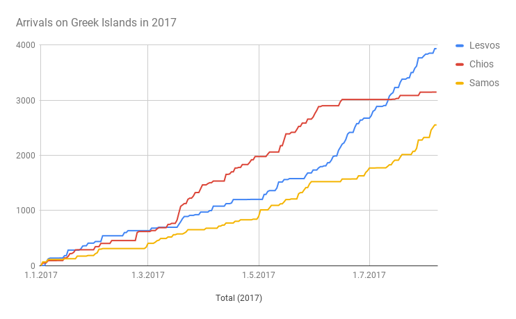
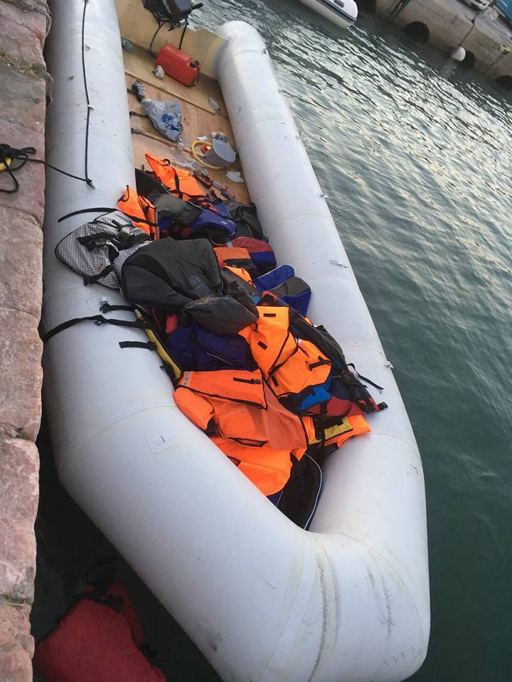
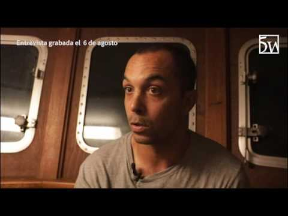

### AYS Daily Digest 07/08/17: A growing number of arrivals, and of obstacles

_One of the Röszke11 free\! / Greece seeing more arrivals with the summer peak / Anti\-NGO rhetoric sparks debates and new refusals / Need for volunteers / Worries in Austria over possible new returns to Croatia / Anti\-deportation protest in Sweden / And more news…_

 \)](assets/1bfec1b0b443/1*nrRDeAt-It2YL5WDqQydLA.jpeg)

Golfo Azzurro \(Photo by [Tim Eisenlohr](https://www.facebook.com/xxtim) \)
### FEATURE: A rise in arrivals to Greece

A growing number of people have been landing to the Greek shores recently\. Over the weekend, 228 people were officially registered on the Greek Aegean islands that have seen the arrival of more than 430 people in the first week of August alone\. 
The number of newly arrived people has been growing on Samos, especially in the previous weeks, and in the past month more than 210 registrations were marked there\. Only today, 60 people arrived on a boat to Samos, including 27 children on board that vessel\.
A number of 128 people were registered by the local organizations arriving on Chios island today: 74 people in total on the first vessel \(33 men,15 women and 26 children\) and 54 people on the second vessel \(30 men, 13 women and 11 children\) \. The people came from Etiopia, Libanon, Iran, Iraq and Syria\.

At the same time, 1,645 undocumented immigrants were returned to their countries of origin last month, according to figures provided by the Greek Police Monday\. According to official [sources](http://www.ekathimerini.com/220713/article/ekathimerini/news/more-than-1600-undocumented-migrants-returned-home-in-july) , they were sent back after being found entering or residing in Greece without the required permit, or they were returned to their native countries via a voluntary repatriation program developed in collaboration with the International Organization for Migration

 ‎](assets/1bfec1b0b443/1*fBQmVRWMR0sEPdApGHomDw.jpeg)

Photos: [Pothiti Kitromilidi](https://www.facebook.com/pothiti.kitromilidi) ‎
#### LIBYA

Since Friday, 1,124 migrants have been rescued in Libyan waters including this morning’s rescue operation, when 155 migrants \(of whom 18 women and 10 children\) have been rescued at sea off Tripoli, IOM reports\.

■■■■■■■■■■■■■■ 
> **[Ben Segers](https://twitter.com/SegersBen) @ Twitter Says:** 

> > @[IOM_Libya](https://twitter.com/IOM_Libya) @[SARwatchMED](https://twitter.com/SARwatchMED) Are they 'rescued' or are they brought to "detentioncentres, controlled by authorities/militants/traffickers with terrible conditions"? 

> **Tweeted at [2017-08-07 12:08:04](https://twitter.com/segersben/status/894530580674727937).** 

■■■■■■■■■■■■■■ 

#### “Libya is a country in chaos\.”

> If any more proof was needed, it came last week after the Italian parliament approved a plan to send warships into Libya’s sovereign waters, in an attempt to stop migrants crossing the Mediterranean\. One Libyan government, based in Tripoli, welcomed the move\. The rival, Eastern government, led by Field Marshal Haftar, threatened to “bomb” any Italian ships which entered Libyan waters\. 

> Clearly, this bilateral deal between Italy and one Libyan government is not the answer and threatens to create further chaos\. But we are more concerned about what would happen to those forcibly brought back by Italian ships to a country where the rule of law is entirely absent\. 

> In the words of Judith Sutherland of Human Rights Watch, “After years of saving lives at sea, Italy is preparing to help Libyan forces who are known to detain people in conditions that expose them to a [**real risk of torture, sexual violence, and forced labor**](https://twitter.com/PacoHansel84/status/894258015439859712) \.” 

> Returning people to Libya is simply fuelling this risk, the chaos which already reigns across the country, and the likelihood of future atrocities\. — [**_Sea\-Watch_**](https://www.facebook.com/seawatchprojekt/?hc_ref=ARQ38qGFEg82NZyBzaTMfrPbqR43LFiG79aF-IhAv0VqQz10-Y1FN1FVk2u13KN9nnk&fref=nf) 

■■■■■■■■■■■■■■ 
> **[laSexta Noticias](https://twitter.com/sextaNoticias) @ Twitter Says:** 

> > VÍDEO| Guardacostas libios amenazan a la ONG Proactiva con tiros al cielo: "No volváis. La próxima vez os dispararé" [atres.red/bc2jk1](http://atres.red/bc2jk1) https://t.co/0SKc2eJyXw 

> **Tweeted at [2017-08-07 20:16:13](https://twitter.com/sextanoticias/status/894653428240175105).** 

■■■■■■■■■■■■■■ 

#### SEA
### Golfo Azzurro refused by Italy and Malta

_Lampedusa and Malta refuse to take in rescued migrants from the SAR vessel Golfo Azzurro of ProActiva OpenArms despite of signed Code of Conduct\._

A Boat Refugee Foundation vessel carrying three rescued persons has been left stranded in international waters after Italy seems to have denied it entry to its ports, citing breach of a new Code of Conduct for Search\-and\-Rescue NGOs introduced last week\.

The vessel picked the migrants off Libya and that Italy has not given permission for it to drop them off in Lampedusa, claiming that a new code of conduct for NGOs involved in such activities had not been observed\. Marine traffic websites show the vessel as being ‘at orders Sicily’\.

Malta is refusing entry to the vessel because its nearest port of call had been Lempedusa when the rescues were made\.

### The surreal debate over NGOs

> “We are desperately lacking to state a principle: do we believe or not in the freedom of movement for the people? In the fact that a person born in Lagos has the same right to move to England of a person born in Milan? Before any other captious discussion on what is legitimate at 12 or 24 miles from the Libyian coasts, we should answer to this question\. 

The official answer, theoretically, distinguishes among economic migrants and refugees, and guarantees only the latter the freedom to move from their country to look for more safety\. Well: even in this case — notwithstanding the fragile bases of the distinction — we should recognize everybody the chance to present at least an asylum request formally\. In both cases, all the debate of these weeks would not exist: no smugglers would exist, and the NGOs would care about else, since the African migrants would not need to cross the sea illegally hoping to obtain a legal protection\. \(…\)

Rarely we talk about the country of origin, and even less about the routes followed before reaching Libya, like the ones crossing Niger, checked by French militaries jealously protecting the uranium deposits fostering the Nuclear central stations in France\. Rarely they talk about the destination country, of what these people would like to do, and why they left their houses\.” Entire text by Sebastian Bendinelli is available in Italian [here\.](http://thesubmarine.it/2017/08/07/ong-dibattito-surreale/)

■■■■■■■■■■■■■■ 
> **[MSF Sea](https://twitter.com/MSF_Sea) @ Twitter Says:** 

> > "The crossing of the desert was terrible. Two women &amp; two men fell off the truck. The driver didn't stop, I’m sure all four have died." https://t.co/dgPKQOtCDE 

> **Tweeted at [2017-08-07 12:44:12](https://twitter.com/msf_sea/status/894539674202640384).** 

■■■■■■■■■■■■■■ 

■■■■■■■■■■■■■■ 
> **[SARwatchMED](https://twitter.com/SARwatchMED) @ Twitter Says:** 

> > 400+ people rescued over the weekend off #Libya will disembark today in #Pozzallo on board #NavePeluso #CP905 from @[guardiacostiera](https://twitter.com/guardiacostiera) https://t.co/ESOoFDkIBh 

> **Tweeted at [2017-08-07 12:04:40](https://twitter.com/sarwatchmed/status/894529724696973312).** 

■■■■■■■■■■■■■■ 

#### TURKEY

[Media](http://harekact.bordermonitoring.eu/2017/08/07/975-people-intercepted-trying-to-illegally-enter-turkey/) report that the Turkish Land Forces intercepted 975 people who tried to cross into Turkey on Monday\.
 “The Turkish Armed Forces said in a statement that 926 people from Syria, 28 from Bulgaria, 18 from Greece and three people from Iraq, as well as 50 people trying to enter Syria from Turkish land, were captured\.”
#### GREECE

[Samos Volunteers](https://www.facebook.com/samosvolunteers/?hc_ref=ARSPXdZWiHYlyso1Xj2DtN651_q53UIvdMWydUoawlWGutAVUoVnc6Sn7lxdGLzyN-c&fref=nf) are looking for help — they need more volunteers, especially those willing to join them in September and october\. If you are thinking about volunteering in Greece, consider aiding Samos volunteers by joing the team for at least a month or longer, if you can\. Contact the group for more info\!

■■■■■■■■■■■■■■ 
> **[Arash Hampay](https://twitter.com/ahampay) @ Twitter Says:** 

> > 40 days 
I'm in the square waiting for the freedom of refugees in prison 
#refugeesgr #refugee #mytilini #deport... [fb.me/JNB12qZk](http://fb.me/JNB12qZk) 

> **Tweeted at [2017-08-07 15:26:57](https://twitter.com/ahampay/status/894580631392337920).** 

■■■■■■■■■■■■■■ 

■■■■■■■■■■■■■■ 
> **[Arash Hampay](https://twitter.com/ahampay) @ Twitter Says:** 

> > #Solidarity with refugee prisoners  
From Paris ❤
#refugeesgr #hungerstrike #moria #prison #Greece #freedom #solidarityactivistslesvos https://t.co/hHVIOkvGsC 

> **Tweeted at [2017-08-07 14:35:33](https://twitter.com/ahampay/status/894567694984466435).** 

■■■■■■■■■■■■■■ 

#### No Border Kitchen asks for help

No Border Kitchen Lesvos currently supports 350 refugees to cook and subsist autonomously, at a regular cost of **20 euros** per person per month\.

> We work alongside refugees failed by the broken asylum system and the bloated NGOs, standing with them as they **self\-organise** and live outside the detention regime at Moria prison camp\. 

In order to save No Border efforts, you can join the fight [**here**](https://www.youcaring.com/refugeesinlesvosgreece-897627) \.
### Asylum office in Crete

Friday between 8:00 and 13:00\. There are remote translators for different languages available, so you will have the chance to communicate with the stuff of the asylum office\. But please be aware that if you want to have an appointment to apply for asylum at the office in Crete, you need to call Skype first\. You can find the Skype timetable [**here**](http://asylo.gov.gr/en/?page_id=98) **\.**
### Teacher trainings

For those interested in teaching English language to refugees and asylum seekers, here are the information on training activities:

**1\. Teacher Training for Beginners: The Basic Priciples of Teaching** 
Date: August 14th and 15th
Time: 9\.30am — 6pm
Place: Blue Refugee Center/ Steki, Thessaloniki

**2\. Teacher Trainings for Volunteers with Teaching Experience** 
Date: August 16th
Time: 9\.30am — 6pm
Place: Open Cultural Center, Polykastro OR

Date: August 18th
Time: 9\.30am — 1pm
Place: Blue Refugee Center, Thessaloniki

The participation requires good English skills\. For more information and registration please contact Eva at teachertraining\.thess@gmail\.com\. Registration deadline is **August 9\.**
### Wanted: Medical staff

Doctors Aid Medical Activities \(DAMA\) is looking for medical staff to volunteer to work in our primary health care center in one of the IDP camps\. The medical staff should consist of \(4 Medical Doctors, 4 Clinical Nurses, 2 Pharmacist Assistants, 1 Pharmacist, 1 Data Clerk\) \. For those interested, please contact their HR department for more information: \+9647507475618
or write to email: hr@dama\-health\.org
#### MACEDONIA
### The opposition MPs fuel fear, a change is needed

> “The opposition MPs want to fuel fear stating there is a danger of a flow of refugees who will turn Macedonia from a transit country into their home\. The reality shows that unfortunately the opposition MPs intend to distract the public without taking into consideration the needs of the people who flee wars, conflicts, oppressive regimes and other socioeconomic circumstances,” — _says Jasmina Golubovska from [NGO Legis](http://legis.mk/news/2382/the-opposition-distracts-the-public-the-ngo-sector-believes-they-demand-that-the-government-change-the-plan-on-dealing-with-the-refugees)_ 

The discussion and rhetorics showed that the politicians are not informed about the field statistics and real situation that the refugees are faced with\.

“Regarding the rumours of numbers started for unknown reasons to us, we advise the public to get answers from the relevant institutions, primarily from the Office of the President of the Republic of Macedonia which could provide answers about international responsibilities taken by Macedonia through bilateral and multilateral agreements, most of them signed in 2015–2016”, Golubovska said on behalf of Legis, reminding that “at both borders 38 people have been residing for more than 4 months now whose fates hang in the balance waiting for a better future\.”
#### HUNGARY
### One of the Röszke11 released

Yamen A\., one of the Röszke11 has been recently released, [Hungarian activists](https://www.facebook.com/11personfreedom/?fref=mentions) report\.
He has released [a statement](http://freetheroszke11.weebly.com/home/yamen-as-short-statement-after-his-release) :

> I am Yamen Al Khateeb, from Syria, I was a sociology student at the first year\. After war has destroyed our country, I decided to leave to Europe seeking a secure, safe, and decent life, but unfortunately,
 

> ​ I faced a problem and brutal violence at the Hungarian border, and I have been arrested and beaten at the border and inside the prison, and I have been detained in a single cell for 42 days, and accused of terrorism, and after a while they told me that there is no proof of this accusation, and that it has been dropped, and after that I have been transferred to a central prison with accusation of entering Hungary illegally, and I have been imprisoned for 21 months\.
 

> But I have a question; how as a refugee would I enter Hungary in an “illegal” way? And how did millions of refugees entered Europe? Was it in a “legal” way? I was detained from 16th of September 2015 until 1st of June 2017\.
 

> Finally, I am now in Germany and looking for a happy life, and a better life, and I will do my best in order to continue my scholastic procession, after the loss of 21 months in the Hungarian prisons\.
 

> My best greetings to everyone who was supporting me the time I was detained\. I repeat my thanks to you people, my brothers and sisters, I am going to write a longer text about everything what happened to me\.
 

> Thank you\. Salam\. \( Peace\) 

However, they remind everyone that Ahmed H\., who is charged with terrorism is still imprisoned, together with thousands of people arriving to Europe\.

> “I faced a problem and brutal violence at the Hungarian border, and I have been arrested and beaten at the border and inside the prison, and I have been detained in a single cell for 42 days, and accused of terrorism, and after a while they told me that there is no proof of this accusation, and that it has been dropped, and after that I have been transferred to a central prison with accusation of entering Hungary illegally, and I have been imprisoned for 21 months\.” 

#### CROATIA

The ignorance demonstrated by showing a number of proofs that the prosecutors \(as well as the police and Intelligence agency, as it seems\) showed in court sessions set to determine the fates of asylum seekers in Croatia who have been labelled as “ potential threat” is finally coming to an end, at least in a few cases, we hope\. Croatian [media report](http://www.jutarnji.hr/vijesti/hrvatska/ispovijest-boksackog-trenera-i-njegovatelja-iz-gaze-kako-sam-na-sudu-pobijedio-soa-u-odbili-mu-dati-azil-proglasili-ga-opasnim-po-nac-sigurnost/6438034/) about some of the cases that are now, unfortunately not withdrawn and given a positive answer, reset to the beginning\. The Ministry of Interior will have to provide new evidence and material to uphold the previous reference to the Intelligence Agency \(SOA\) that claimed a great number of asylum seekers in Croatia as a potential threat to the national security\. In an “informational desert” of the officials and responsible institutions for the matter, much has been explained in AYS&CMS’ recent Report, published in three languages\. Be sure not to miss it, either in [English](https://drive.google.com/file/d/0B_oKR2QQNUiPY1BZRm5fNFdRYzg/view) , [German](https://drive.google.com/file/d/0B_oKR2QQNUiPNk00Vy1nQkNHNTQ/view) or [Croatian](https://drive.google.com/file/d/0B_oKR2QQNUiPaDE2b3k2cjNLT2c/view) \.
#### ITALY
#### After everything — in the limbo of Ventimiglia crossing

■■■■■■■■■■■■■■ 
> **[MSF Sea](https://twitter.com/MSF_Sea) @ Twitter Says:** 

> > Meet Nour, he's 24 and fled the #Darfur region of #Sudan. After 2 months in #Libya he risked it all on an overcrowded boat to #Europe. https://t.co/6Xvy0DWNZS 

> **Tweeted at [2017-08-07 08:53:59](https://twitter.com/msf_sea/status/894481736071081985).** 

■■■■■■■■■■■■■■ 

### Help needed

The volunteer group Progetto20k is asking for a gesture of soilidarity, as they said\. They are inviting citizens to take part in providing the refugees with the basic things to walk in dignity\. 
They need:
\- chargers and power banks
\- torches
\- dictionaries: Italian — Arabic; Italian — English; Italian — French
\- K\-way/raincoats
\- shoes \(walking or sports shoes, size over 39/40\)
\- water bottles
\- backpacks

Contact them if you can help in any way to provide the needed items\.

■■■■■■■■■■■■■■ 
> **[MSF Sea](https://twitter.com/MSF_Sea) @ Twitter Says:** 

> > This is the road that those seeking to enter #France from #Italy must cross on foot. It's so dangerous they call it the "Pass of Death". https://t.co/P3QhCeLF1M 

> **Tweeted at [2017-08-07 08:59:24](https://twitter.com/msf_sea/status/894483101342203904).** 

■■■■■■■■■■■■■■ 

#### Rome

#### FRANCE
### Uncertainty grows over announced centres

Volunteers confirm that the announced number of places to be available at the supposedly new, already running, refugee centres in the area of Calais is twice as high as the current number of available places there\.
These 2 centers will be named CAES, Centres d’Accueil et d’Examens des Situations \(Center of reception and examination of situation\) — a name that is already creating fears among potential residents and scepticism among volunteers\. 
[Volunteers in Calais](https://www.facebook.com/story.php?story_fbid=10155313847095339&id=358496450338) conclude:

> Considering the varying positions of different members of the government concerning the Dublin agreement, the new centers in Calais are rather worrying us\. 
 

> These structures are ideal for new arrivals who have not yet given their fingerprints anywhere else and who wish to get protection in France\. But this is not the case for most of the people in Calais\.
 

> This is rather a policy of accelerated selection and expulsion, and not a real solution of asylum which seems to be created here… It will push even more migrants to flee the French system and to hide in Calais with the hope to continue to England\. 

#### **There is an urgent need for medics in Calais and Dunkirk\.**

Doctors, paramedics and dentists interested in helping out can [join the group](https://www.facebook.com/groups/RefugeeSupportFirstAidTeam/?fref=mentions) and find out more\.
#### [**Belgium Kitchen**](https://www.facebook.com/BelgiumKitchen/?hc_ref=ARQxYHnCiQD9K0gQLOiXzcaXKltY9DHQUlCInNeDtsL4pwnaDR_xdj2A1z3hLcABNuI&fref=nf) **also needs help:**

> For several months we have been cooking and distributing meals every day to the exiles of Gare du Nord and Parc Maximilien\.
 

> The situation is becoming more and more difficult\.
 

> We need motivated volunteers who could commit themselves in a determined way, for cleaning, gardening, distributions, …
 

> We cook and distribute about 500 meals a day\. As for 
 

> donations, we need: 

> \-Sleeping bags 
 

> \-Aluminium Packaging
 

> \-Plastic spoons
 

> \-Spices: Garlic, curry, chilli, cinnamon, ginger
 

> \-Long or basmati rice 
 

> \-Potatoes
 

> \-Peanut paste
 

> \-Milk
 

> \-Tomato sauce
 

> \-Eggs
 

> \-Tuna
 

> \-Fruits
 

> \-Lemon
 

> \-Oil
 

> \-Berlingots of juices and drinks
 

> \-Biscuits
 

> \- Canned beans
 

> \-Canned peas and carrots
 

> \-Onions 

> For the maintenance of our building in which we welcome several families, we also need: 

> \-Washing machines 
 

> \-Trash bags 
 

> \-Soap, shampoo
 

> \-Laundry detergent
 

> \-Dishwashing liquid
 

> \-Maintenance products
 

> \- All gardening equipment as well as volunteers or associations with experience in this field\. 

> Finally, to finance water, electricity and gas, we need financial donations — [here](https://chuffed.org/project/belgiumkitchenincalais) or BE71 7506 7226 9069\. 

> You can come to drop everything at **Avenue Van Volxem 2, 1190 Forest** , everyday **from 1pm** till the evening\. 

> A big thank\-you \! 

#### SPAIN

About 200 people managed to pass the border crossing of Tarajal in Ceuta on Monday\. The border officials had previously been aware of the possible surge of migrants and they spread along the perimeter, but the entire group passed through the main entrance, according to the media reports\.
#### AUSTRIA

[**Border Crossing Spielfeld**](https://www.facebook.com/RefugeesSpielfeld/?hc_ref=ARR39yf2od3G77UgPvmmf3gceEk36GFKq1y3oCj94m-wyoo5T2z6FAOxYSmUgrNe4T0&fref=nf) is sharing a quick clarification for all those who were worried about their status concerning Dublin III deportations to Croatia:

> If you have never received notification that Austria intends to send you back and are now — many months later — living here with a white card, you will not be deported, even if you have not had an interview yet\. **Dublin cases have to be started within a few months after your arrival\.** 

> Second, if you have brought your case to a higher court in Austria and the decision has been suspended, **you are not in danger of being deported before the suspension has been lifted\.** You will be notified of this \(and the final decision in your case\) in writing\. Only after this letter has been received, the deportation can take place\. 

> If your legal aid or lawyer is currently preparing paperwork to fight deportation to Croatia, please **make sure they include the information from the [latest Croatian reports about problems with Croatia’s legal asylum process](https://drive.google.com/file/d/0B_oKR2QQNUiPNk00Vy1nQkNHNTQ/view)** [\.](https://drive.google.com/file/d/0B_oKR2QQNUiPNk00Vy1nQkNHNTQ/view) Most lawyers will be aware of this, but it is always a good idea to double\-check\. 

> Even if a case has been lost, Austria still has the right to invoke the sovereignity clause and declare itself responsible for your asylum application\. We sincerely hope that this can still happen despite the current political climate\. 

#### GERMANY

A fire broke out in a social housing unit for refugees in Markgröningen, outside of Stuttgart in Baden\-Württemberg\. Initial investigations suggest that the fire started in the kitchen of the building\. The housing unit serves ten residents, including homeless people and asylum seekers\. Nine people were inside the building at the time of the fire, according to [the local media](https://www.thelocal.de/20170807/two-dead-and-three-injured-in-house-for-homeless-and-refugees) \.
Two people were killed and three were severely injured\.
#### SWEDEN
### Young people protesting the hypocrisy

About 100 unaccompanied minors have been on a [sit\-in strike outside of the Parliament in central Stockholm](http://sverigesradio.se/sida/artikel.aspx?programid=103&artikel=6751682) since before noon yesterday\. They are demanding the Swedish government to stop deportations to Afghanistan and are asking to meet with Mikael Ribbenvik, head of the Migration Agency\.

> We fled from hate, but will give him love\. We’re not bad for this society — _Fateme Khavari, [on behalf of the sit\-in](http://www.dn.se/nyheter/sverige/flyktingar-sittstrejkar-utanfor-riksdagen-kraver-svar-fran-ribbenvik/)_ 

The young Afghans demands that the Migration Agency reconsiders their decision regarding the expulsions\. In an open letter the young people are questioning the fact that the Foreign Department advice Swedish citizens not to travel to Afghanistan, but at the same time are continuing to deport Afghans there, as are some of the other countries in the EU\.

_Converted [Medium Post](https://areyousyrious.medium.com/ays-daily-digest-7-8-17-a-growing-number-of-arrivals-and-of-obstacles-1bfec1b0b443) by [ZMediumToMarkdown](https://github.com/ZhgChgLi/ZMediumToMarkdown)._
