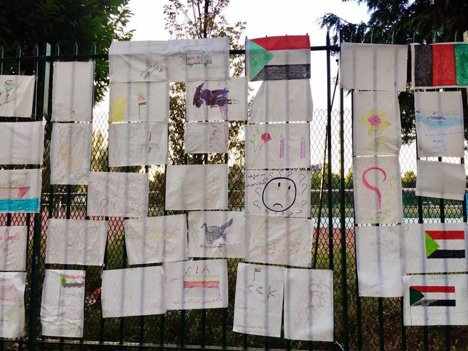
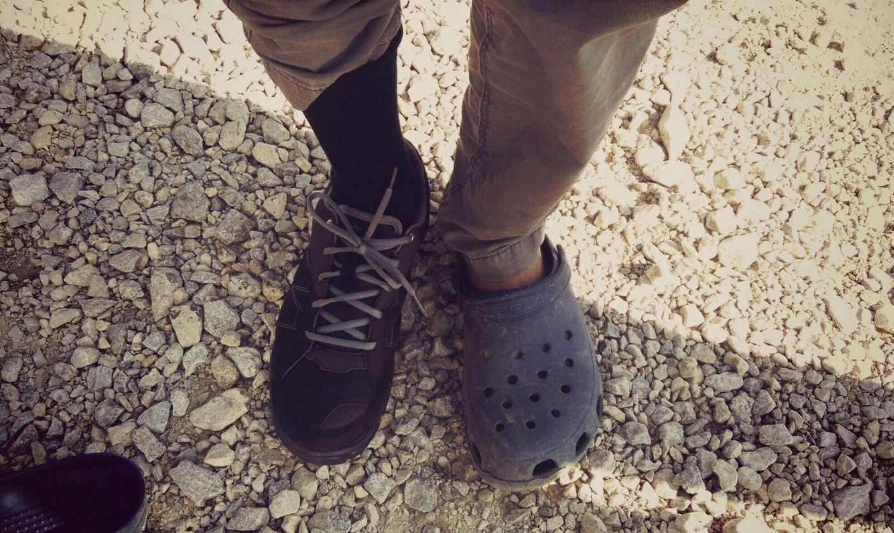
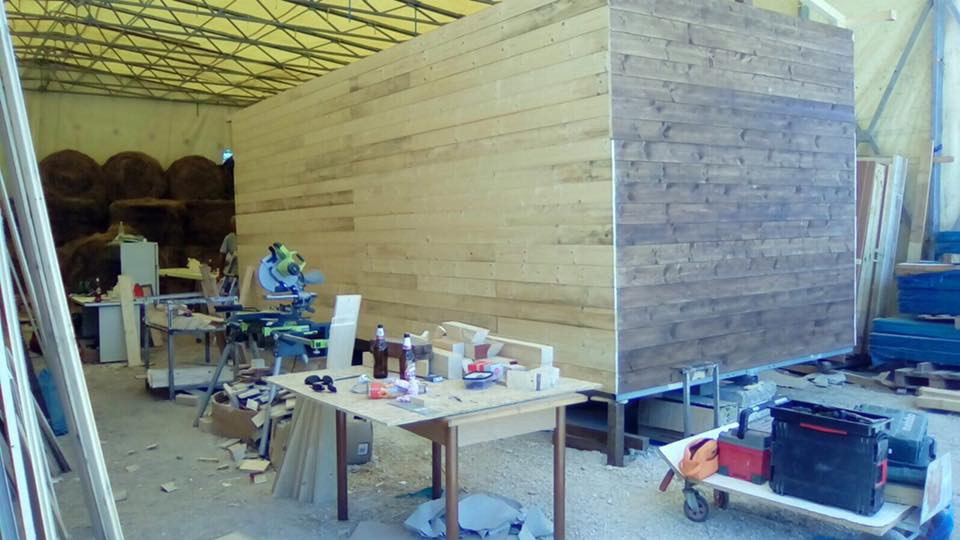
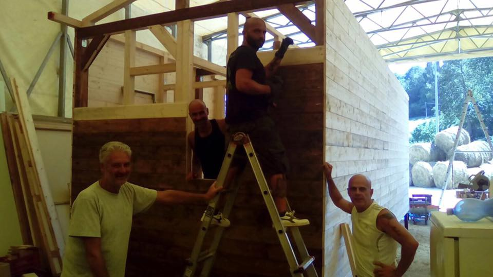
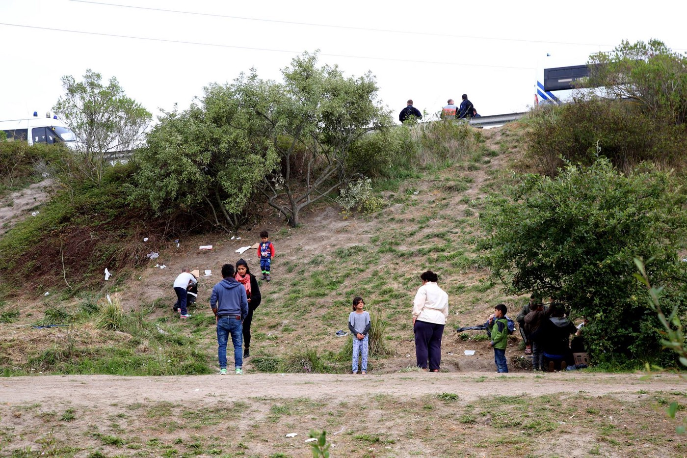

### AYS Daily Digest 09/08/17: L _anguage barrier leveraged in dehumanization of refugees_

_Arrivals and updates on Souda closure / Continued conflict on Samos / Language barrier leveraged in refugee dehumanization / Softex closed / Number of refugees in Serbian camps drops by around half over last months / Protest and call for volunteers in Italy / Human rights violations across France / Afghani asylum seekers no longer deported from Germany to Afghanistan / Neo\-Nazi activity in Sweden targets refugees / And more news…_

\(Photo by Calais Action\)
### FEATURE: Crisis of communication, the fingerprints of inhumanity

A [recent update from Care4Calais](http://Cecelia Bittner‎) brought up a situation that has eerie echoes across the entire European refugee crisis\.

> On Tuesday 8th August 2017, at around 10\.30 am, 40 people were taken on buses to the “new” Calais reception centres, in order to claim asylum in France\. We welcome this opportunity for those wishing to claim asylum in France to finally be given the opportunity to do so\. 

> However, those claiming asylum in France will be assessed using an accelerated process\. This process means that anyone with fingerprints elsewhere in Europe, or a failed asylum claim elsewhere in Europe, is likely to be removed from French territory\. This is the majority of people\. 

> Many of those arriving in Calais also have fingerprints elsewhere in Europe\. Many of those who gave fingerprints upon arrival in Italy were unaware of exactly what they were doing, and what this meant for their future claims elsewhere in Europe\. Once again, a total lack of information has resulted in many confused and hopeless individuals without any options, forced to sleep in the forests and wastelands around Calais hiding from the Police\. No interpreters were provided in order to communicate with the community, the photo of the document attached to this post shows the information that people received\. We spoke to many who were unclear about their options\. 

Over and over again, we hear reports of how these fingerprints, often taken in the midst of a crisis and without fully informed consent, determine the fate of asylum applicants\. From being used to justify sending refugees from Austria and Slovenia to Croatia to a recent tragic case of an Iranian refugee who took his life after being notified of his deportation to Bulgaria after it was found that his fingerprints were taken there\.

■■■■■■■■■■■■■■ 
> **[MF](https://twitter.com/fiedler_mathias) @ Twitter Says:** 

> > #Refugee from #Iran kills himself in a jail in #Bavaria/#Germany, fearing his #deportation to #Bulgaria: [br.de/nachrichten/jv…](http://www.br.de/nachrichten/jva-muenchen-selbstmord-fluechtling-100.html) 

> **Tweeted at [2017-08-09 06:13:43](https://twitter.com/fiedler_mathias/status/895166181409214465).** 

■■■■■■■■■■■■■■ 

A shadow to these fingerprints is the lack of informed consent at many stages of the journey\. Although many volunteer groups and NGOs have stepped up to fill the gap, the fact of the matter remains that many refugees who have traversed the route were taking, signing, and printing papers that were not provided to them in their native language\. How many of us have huddled together with our phones, frantically scrolling through Google Translate for some magical word of a key phrase?

Many refugees applying for asylum in Croatia found their documents torn up in front of their faces and found themselves prohibited from seeing an interpreter\.

The lack of informed consent is another tell of the systematic abandonment of any sort of humane treatment towards asylum\-seekers\. In many courts around the world, including in the EU, [the defendant has the right to have an interpreter](http://ec.europa.eu/justice/criminal/criminal-rights/right-translation/index_en.htm) \. This, coupled with the lack of comprehensive education on the implications of such decisions, can only heighten the trauma to an individual who, after thinking they have reached safety, finds that they will be thrust back into the jaws of peril or detained in a country for the crime of trying to be safe\.

One form of advocacy could be for there to be an increased outcry and outrage against the leveraging of language barriers to enact the will of those who do not wish for refugees to be allowed in\.

### GREECE

After the official halt on refugee returns to Greece, there has been an update\. Namely, that they can resume, but only “if Athens can ensure proper conditions and asylum procedures for them\.” Dublin returns from Germany and other countries were halted in the wake of increased concern over the terrible conditions throughout refugee camps in Greece\.

Read more [here](http://senews.org/world/renewed-refugee-returns-to-greece-possible-if-proper-reception-ensured-unhcr.html) \.

 \)](assets/3d5049c8e551/1*LPQiJ4s-OLWq67vmnKB2rg.jpeg)

\(Photo by [Health\-Point Foundation Dental/Medical Relief](https://www.facebook.com/healthpointfoundation/) \)
#### New arrivals

Difficult news arrived yesterday morning from a rescue event that, although resulting in no fatalities, still ended in tragedy\.

> This boat \[that came to Chios\] was in a rescue operation, \[the\] boat was sinking\. Reports say 45 people where \[sic\] on the boat, Turkish Coast Guard picked up 9 people, Greek Coast Guard 36 people\. Further on the report says that a mother of 5 children was taken to Turkey, the father and the 5 children ended up on Chios\. Report of a boat that turned over on border of Greece and turkey and 9 arrested in Turkish waters and 39 made it to Greece\. Families separated\. Happened this morning\. 

Otherwise, Samos saw 69 refugees arrive while Mytilini saw 26 new arrivals\.
#### Lesbos

No Border Kitchen Lesbos continues to need donations\! Anyone who is familiar with the humanity ecosystem on Lesbos knows of No Border Kitchen\. Please show some support\!

#### Samos

There continues to be ongoing conflict in the camp on Samos\. Below is a report from a volunteer:

> A lot of fighting in the camp tonight\. Tensions and frustration is so high\. We now have over 1,700 people in there\. Not enough tents or blankets or anything\. Still no water in the mornings\. Only one tap in the main section of the camp for filling bottles, etc\. for the rest of the day\. Riot squad are now surrounding the camp and others are inside with shields and batons\. — from volunteer, Samos 

#### Chios

More heartrending reports come in from the closure of Souda camp\. An important feature in the transfer from Souda to Vial remains the lack of access to facilities outside of the camp\. Below is a video that goes through Vial\. It is a closed, military\-run camp\.

In a excerpt originally posted on “Stories from Chios,” Shoufu explains the state of the camp below:

> This video, taken 6/08/2017 by a refugee living in Vial, captures the state of this EU ‘hotspot’ which is to serve as the main reception centre on the island\. A camp where authorities, after more than 18 months, are still not able to provide even the most basic services such as access to running water and sanitary toilets and showers\. For the past month, in Section A of the camp which accommodates some 300–400 people, access to water has been intermittent\. On some days, there is none at all\. Many have even reported skin problems from using this water\. 

Read more [here](https://www.facebook.com/StoriesfromChios/videos/289960754805723/) \.
#### Mainland

According to InfoMobile, the protest against dallies and delays in flights to Germany is ongoing\.

> After a protest which took place on August 2nd, 2017 in front of the German Embassy, more and more refugee families are uniting to demand their immediate transfer to Germany\. On August 7th they continued their struggle with dozens of families in the Himalaya offices, the only travel agency responsible to issue them tickets and tomorrow, on Thursday 10th of August 2017, they will protest again in front of the Greek Asylum Service in Katekhaki\. 

Read more [here](http://infomobile.w2eu.net/2017/08/09/refugees-call-for-protests-against-the-limitation-of-family-reunifications-from-greece-to-germany/) \.

Softex has been closed\. For now, people have been detained, moved to Diavata, or just disappeared\.
### SERBIA

The number of new refugees, asylum\-seekers and migrants counted in Serbia on August 6th was 4,688\. Of those, 4,391, or 94%, were accommodated in 18 governmental centres\. This is around half of what was counted several months ago\. The question is — where did the remaining people go? In spite of repeated forcible returns to camps, it appears that camps continue to be semi\-porous\.

This comes with the news that UNHCR and partners received reports of 112 recorded collective pushbacks from Hungary—and 95 from Croatia—with many alleging to have been denied access to asylum procedures\.

On August 6th, a tragic accident occurred when an Algerian man waiting to cross into Croatia was hit by a train\.

No Name Kitchen, which is working along the Serbian\-Croatian border in the jungle is now also distributing NFIs\. The most notable continuing need remains shoes\. **As a helpful reminder, those interested in helping should know that importing goods to Serbia \(as it is not the EU\) is notoriously difficult and can often cause great difficulties to groups on the ground\. Additionally, no used shoes will be allowed into Serbia\.**

If you plan to donate goods, be prepared to bring them in yourself and do so covertly, as your own belongings\. With these challenges, it is recommended that the first option is to [donate to groups](https://www.generosity.com/volunteer-fundraising/shoes-for-the-winter) on the ground, enabling them to purchase items\.

\(Photo by No Name Kitchen\)
### ITALY

People in Ventimiglia protested today against a new reception centre being created for unaccompanied refugee children and minors\.

However, in spite of the protest, the work all around goes on\. In Amatrice, MAM Beyond Borders is looking for carpenters or handymen to help them finish houses for families\.

MAM Beyond Borders is looking for volunteers\!

> Work to be carried out: 

> 1\) Finish insulation
 

> 2\) Close with panels insulation and create wall sliding doors
 

> 3\) Be plants
 

> 4\) Mounting doors and parquet
 

> 5\) Prepare frames for doors and windows
 

> 6\) Mounting roof and gutters on site 

> Would you like to help? Contact us\! 

\(Photo by MAM Beyond Borders\)

\(Photo by MAM Beyond Borders\)

If you are interested, please contact the group [here](https://www.facebook.com/MAMbeyondborder) \.
### FRANCE

Here is some extremely valuable information that ought to be shared among refugees in France\. Thank you, [Cecelia Bittner](https://www.facebook.com/mceceliabittner?hc_ref=ARRQ7eqcH0if_hRYFuqpP4DM7T_mlrBR7LNFesNaGpk783QvUc0tfVjMudKNfahvyuo&fref=nf) ‎\.

> Here is advice for refugees/asylum seekers/people on the street on what to do if arrested and/or served with an OQTF\. 

> ATMF \( [ATMF Association des Travailleurs Maghrébins de France](https://www.facebook.com/ATMFnational/?fref=mentions) \) will be providing legal advice at 14h today in front of the post office next to the Porte de la Chapelle metro stop\. 

> They will be advising on: the asylum procedure, Dublin fingerprinting & deportation, what to do if you are arrested, OQTF’s and detention centres\. 

> We are seeing a raise in OQTF’s being issued and expect many more over the next few days so please share this and let any refugees/asylum seekers know about the legal support available to them\. 

#### Paris

The latest information comes from volunteers with Solidarithé, who have been a crucial part of the support structure in Paris\.

> Since the evacuations two weeks ago where they cleared 3000 people sleeping on the streets at Porte de La Chapelle, the numbers of people sleeping in the streets has very quickly shot back up and we are now back to serving approx\. 700 cups of tea and coffee and handing out 200/300 info sheets with practical information on services available in Paris but also free French lessons that are also available for people to attend\. 

Read more in [Calais Action\.](https://www.facebook.com/calaisaction/posts/1623335311052301)
#### Calais

In an earlier portion of the report referenced in the feature, Care4Calais noted that dozens of people were taken to new reception centres near Calais\. However, it is unclear how long people will actually be “received” there, or if they are just thinly\-veiled centres to identify and push back people\.

Additionally, there were 200 new arrivals from Paris—many of them women and children—to Calais\.

In keeping with the need for people to stay informed, there is a great need for chargers in Calais\. Follow this link for more [information](https://www.facebook.com/permalink.php?story_fbid=10155319058385339&id=358496450338&hc_location=ufi) \.

Help Refugees posted an in\-depth report from Sky News on the situation in Calais, which continues to be a gathering point\.

#### Dunkirk

Mobile Refugee Support has recently reported of “consistent and repeated” police violence against refugees in Dunkirk\. Operations often happen early in the morning and can involve tear gas or rubber bullets\. Making use of the confusion, the authorities force refugees to make snap decisions about their future and then act\.

> During these early\-morning raids, the police destroy any tents or “structures” that can provide shelter\. They then confiscate any possessions that the victims cannot carry on their backs or did not have the foresight to pack away including sleeping bags, and anything else that would assist with their situation\. We hear these reports of the police taking their possessions on a daily basis, facing us and the other associations present with many new requests for basic necessities\. 

Heed the words of these volunteers as they report on the systematic and ongoing humiliation and dehumanization of individuals — human beings not only _at_ borders, but _inside_ of them — in places we are lulled into thinking are “safe\.”

\(Photo by Mobile Refugee Support\)
### GERMANY

The new asylum statistics for Germany were released\! They include a breakdown according to nationality as well as a three month comparison\. View them in German [here](http://www.bmi.bund.de/SharedDocs/Pressemitteilungen/DE/2017/08/asylantraege-juni-2017.html) \.

In good news, individuals with Afghan nationality will no longer be deported to Afghanistan in light of the deteriorating security situation in Afghanistan\. Although it comes with the tragic backdrop of the increasing violence in Afghanistan, it is a step in a positive direction\. However, the exception to this rule remains convicted criminals and those deemed a “security threat\.” It is hoped that with these exceptions the German authorities don’t follow the Croatian authorities in beginning to deem people as security threats while withholding any evidence of such, making the authority’s claim incontestable\.
### THE NETHERLANDS

No Border Network reports on a victory in the case of Illya, a Ukrainian LGBT asylum seeker who was on a hunger strike to seek justice against his impending deportation\.

Although he will still have to appeal his case, he was set free from detention and is, therefore, ending his hunger strike\. You have our love and support Illya\!
### SWEDEN

There is an ongoing protest by asylum seekers from Afghanistan against deportation\. In the face of terrifying attacks by counter\-protesters, the mood remains high\.

According to [Anna\-Märta Kuhnke](https://www.facebook.com/annamarta.kuhnke) ‎:

> So insanely impressed with “young in Sweden,” volunteers and the police in the entire organization of this transfer from mynttorget to medborgarplatsen now tonight\. 

> What cohesion and the purchase so much love along the way and from open windows\! Fattest and biggest demonstration in a very long time\! 

> Well on the spot everyone knows what’s going to happen, nice and nice get all the place and water start to be handed out\. \. 

 ‎\)](assets/3d5049c8e551/1*E6ua0_23JaGHmubtD0Hbgw.jpeg)

\(Photo by [Anna\-Märta Kuhnke](https://www.facebook.com/annamarta.kuhnke) ‎\)

In reference to the recent events in Sweden and activities by Neo\-Nazi groups which included a [march](https://www.tnp.no/norway/panorama/war-veteran-norway-reacts-neo-nazi-march-kristiansand-worse-quisling) , disrupting a tennis match, as well as handing out flyers, there has been some analysis, and the results aren’t good\.

Journalists and political stakeholders are analyzing yesterday’s attack performed by Neo\-Nazis and what that say about the political climate and safety\. The attack yesterday on the peaceful protest by Afghans was yet another one by Nordisk Ungdom, who has increased their unfortunate activities lately\. Stefan Lisinski at Dagens Nyheter foresees that this trend with violence will continue\. Read the original in Swedish [here](http://www.dn.se/nyheter/sverige/stefan-lisinski-det-kommer-att-bli-mer-vald-i-framtiden/) \.

> **_We strive to echo correct news from the ground through collaboration and fairness, so let us know if something you read here isn’t right\._** 

> **_If there’s anything you want to share, contact us on Facebook or write to: areyousyrious@gmail\.com\._** 

_Converted [Medium Post](https://areyousyrious.medium.com/ays-daily-digest-09-08-2017-3d5049c8e551) by [ZMediumToMarkdown](https://github.com/ZhgChgLi/ZMediumToMarkdown)._
