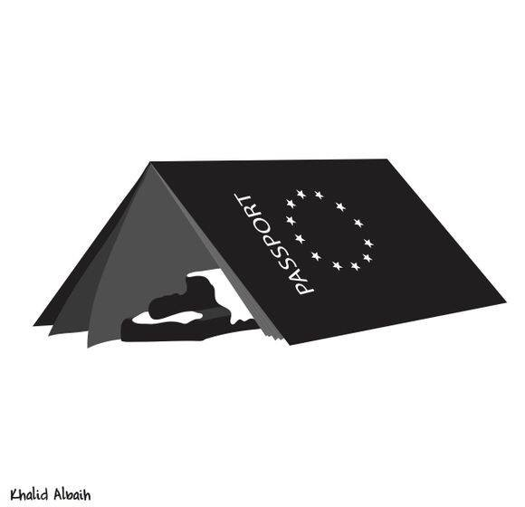

### AYS Daily Digest 11/08/17: C\-Star boat helped by NGO rescue ship

_C\-Star ship saved by NGO rescue ship / Hundreds died in US attack on Raqqa / More people arrive in Greece / Italian government continues to prosecute people who are saving lives / Protest in Sweden continues with more people joining / And more news…_

When you risk your life for a passport \(Illustration by Khalid Albais, Art Against\)
### FEATURE: C\-Star boat saved by NGO rescue ship

Life is really funny sometimes, so funny that it is hard to believe\. The fascist boat C\-Star was in distress off the coast of Libya, having engine problems, and the closest ones who could help were people from an NGO rescue ship\.

The Sea\-Eye rescue crew, a group that is among those accused of “colluding” with smugglers by the C\-Star crews, was on their way to help\. Michael Buschheuer, the chairman of Sea\-Eye, issued a statement saying that to help a ship in distress is “the duty of anyone at sea, without regard for their origin, race, religion or beliefs”\. Apparently, the C\-Star ship refused help, but we do not have confirmation of this\.

The Defending Europe group, which is in charge of C\-Star, led a crowdfunding campaign claiming that their ship will target “criminal NGOs…that are nothing less than part of the international human trafficking ring”\. They claim that refugees who are coming to Europe are “invading” the continent they apparently consider belongs to them only\.

The ship was stopped several times over the last several weeks by anti\-fascist groups in different countries, but they continued their journey\. They were also stopped in the Suez Canal for security checks before journeying to northern Cyrus, where crew members were arrested over people smuggling allegations after a group of people from Sri Lanka were found on board\. Later on, they claimed that the Sri Lankan crew members on board were “apprentice sailors” who were supposed to disembark in Egypt\.

While at sea, the C\-star crew — which is already becoming ridiculous — were shouting at humanitarian ships through megaphones, ordering them to leave the search and rescue zone\.

Though we may laugh at them, however, we have to remember that there are enough people around Europe who are ready to give them money and support their mission\. At the same time, while those who are saving lives are prosecuted, this crew, which is openly fascist, is permitted to sail\. And that is the world we live in\.
### SYRIA

The war in Syria is still raging\. This time, media are reporting about hundreds of victims after the US\-led strikes in the region of Raqqa\. The reports, as [The Guardian writes](https://www.theguardian.com/world/2017/aug/11/syria-us-led-coalition-accused-of-failing-to-avoid-civilian-deaths) , are not definitively confirmed “but are considered reliable by UN officials”\.

The official explanation for the attack is to cleanse the city of ISIS members, even though it looks like no more than 500 of them are in Raqqa\. The airstrikes, however, targeted a residential area where a huge number of civilians are living\.
### SEA

UN Migration Agency, reports that 117,795 migrants and refugees entered Europe by sea in 2017 through 9 August\. Most of the people arrived in Italy\.

Another organization signed the Code of Conduct that the Italian government came up with\. This time it is SOS MEDITERRANEAN, whose members met in Rome with Mario Morcone, Head of Civil Liberties and Immigration at the Ministry of Interior\.

Apparently, the Code they signed has been amended and now it acknowledges that the Code is not legally binding and existing national and international laws and regulations prevail; it does not mention the carrying of any form of weapon, and therefore SOS MEDITERRANEE does not commit itself to receiving any armed persons aboard its ship\.
### GREECE

The increase of people arriving in Greece is still very noticeable\. Today volunteers informed us about one refugee boat that arrived on the South coast of Lesvos in the morning with eight men, six women and nine children on board\. Almost at the same time, one refugee boat carrying 54 people arrived on Chios this morning, including 20 children\. The people on the boat were from Syria, Yemen, Kuwait, Morocco, and Iraq\. With the latest arrivals, it brings the total up to 208 new arrivals only on Chios this week\.

Meanwhile, the situation on Chios remains desperate, as it is on other islands\. Camp Souda is almost closed, but camp Vial is full of people and it is becoming harder for volunteers to enter it\.

We found evidence of how difficult the situation is for people on the islands in a hard\-to\-believe report about a person who tried to swim from Chios to an unknown destination\. He was located on the rocky islet of Venetiko to the south of the island by a sailing boat which rescued him and took him to the port of Chios\.

 ‎ _to_ [Chios Eastern Shore Response Team — Info Point](https://www.facebook.com/groups/421759534684819/permalink/671434479717322/) \)](assets/72df6df5bef1/1*F7i-nP9o7xmlXS6aQ1fieQ.jpeg)

Arrival \(Photo by **‎** [Pothiti Kitromilidi](https://www.facebook.com/pothiti.kitromilidi?hc_ref=ARQFM_wz0yyP1ZDLh9uc5YeFZNl6w27qtSLTtDZ47wfORXtIRg43F8zLZnzsYqh-pE0&fref=nf) ‎ _to_ [Chios Eastern Shore Response Team — Info Point](https://www.facebook.com/groups/421759534684819/permalink/671434479717322/) \)

He has been identified as a 35\-year\-old man from Afghanistan who arrived on the island on August 7th together with 74 other people and was in Vial camp\.

[Yesterday, August 10](http://mindigital.gr/.../1564-epistrofi-stin-tourkia...) , the Hellenic Police and the European Border Guard and Coastguard — Frontex returned three people to Turkey in accordance with the EU\-Turkey deal\. One person was from Iran, one from Turkey and one from Pakistan\. While two of them entered by sea, one entered via the Evros Border Station\.

The latest report by the Legal Center Lesbos reminds us of the 35 individuals who were arrested on 18 July in Moria in raids following clashes with riot police\.

All those arrested have been charged with serious crimes, including arson, damage to property, and rioting, and are facing lengthy prison sentences which could signify exclusion from international protection\.

However, the Center claims that there is enough evidence that all 35 were arbitrarily arrested on the basis of their race, nationality, and presence in the camp at the time of police raids\.

The Legal Centre Lesbos, supported by Lesvos Solidarity, provided representation to all 35 in their preliminary hearings and is now working with a larger coordinated group of organizations and criminal defense lawyers to ensure they receive adequate representation\.

[For more, see the latest report by the Center](http://www.legalcentrelesbos.org/2017/08/11/august-report-on-rights-violations-and-resistance-in-lesvos/) \.

Writing found on a bench in Koutsochero camp…”This is life? Worst day after day\.” Although many of the families here in Koutsochero have received asylum in Greece, they have still not reached real safety\-they are living in a remote and desolate camp, with no opportunities to build skills or find employment\. Our work aims to make life in this camp a bit brighter for the people who are having to live here\-but real solutions are needed\. No one should live in a camp\! By InterVolve\.
#### Volunteer opportunities

[The Unmentionables](https://theunmentionablesglobal.org/volunteer/) group in Greece is looking for people to fill their new new Education Coordinator and Logistics Coordinator positions\.

[See their Facebook page](https://www.facebook.com/theunmentionablesorg/?hc_ref=ARRTwH4XDcBYLhPWArqdoxb2wuN_le2epd6GNfSG5BnzAka9LJ6McaQrEflcdYVAYJU&fref=nf) and web page\.
### ITALY

Once again, news about the prosecution of those who are saving lives\. The [Italian authorities are investigating](https://www.thelocal.it/20170810/eritrean-priest-denies-trapani-charge-of-facilitating-clandestine-miration) an Eritrean human rights activist, Don Mossie Zerai, who was a candidate for the Nobel Peace Prize in 2015\. He is being investigated by the Trapani public prosecutor for “facilitating clandestine immigration”\.

Zerai founded the [Habashia](http://habeshia.blogspot.gr) , a blog he describes as a “life jacket for migrants,” where he provides last\-minute and lifesaving information to people trying to cross the Mediterranean to Europe\.

Zerai has released a statement saying: “I can confirm with all conscience that I have nothing to hide and that I have always acted with full legality\. Apart from the Trapani initiative…, I have not been called to any other venue to justify or in any way respond to my work in favor of refugees and migrants\.”
 
The charge against him is linked to an investigation against German NGO Jugend Rettet, also accused of facilitating clandestine migration through its Iuventa rescue ship\.
### FRANCE

Pierre Henry, DG of France asylum, visited on Thursday the Vallée Valley and Cédric Herrou, and he wrote about Cédric and his farm, saying that despite the ridiculous court decision, he plans to continue helping people\.

“He has plans to build a few wooden huts on his land to help people from another continent to brave the winter and because now, with his friends, he has no choice\. We can’t punish him for that\. It is up to the EU to allow here in the region, as elsewhere in France and Italy, the establishment of a dignified system, which identifies, guides, supports, accepts or refuses protection\. Ciotti opposes this\. The State is playing an absurd part\. Herrou is not a problem, he is part of the solution if the idea is to find one\!”

\(Photo by Frace Terre D’Asil\)

[Read a full report at France Terre D’asile FB page\.](https://www.facebook.com/France-terre-dasile-129826463760101/?hc_ref=ARRmImjTM4Es-UYZ7iX6DeUQJFxz2pseuYuw5Jo-xQAHCOHt8VpEBlZcyFzfNNxSsxw)

Help is needed in Dunkirk\. The People in [Motion group](https://www.facebook.com/peopleinmotion15/?hc_ref=ARTiEQqpAZdJmRUMkRg_wyJ9vv4O7BuD6an29kS-KJDM-j_r4GBiGaQvKZbzQUclvNY&fref=nf) are near the warehouse in Dunkirk, supporting refugees living near the old camp which burned down earlier in the year\.

They delivered tents and pots and pans, since people are able to cook their own food\. However, there is a need for help and they need more tents, sleeping bags, blankets, pots and pans, and comfortable trousers for women \(not jeans\) \.
### GERMANY

[Germany’s Chancellor Angela Merkel announced her intention to cooperate more closely with Libya to decrease the number of people crossing the sea and entering the EU](http://www.politico.eu/article/angela-merkel-libya-key-to-migration-crisis/) \.

“The process is in its infancy, but it is supposed to develop like \[the refugee deal with\] Turkey once did,” she said to journalists after meeting with senior officials from the IOM and the UNHCR\.

This will be achieved, Markel claims, by strengthening Libya’s government and improving conditions in detention centers across the country\.

Previously, French President Macron proposed the setting up of “hotspots” as a solution for Libya, an idea which according to the IOM is “excellent on paper,” but has some “insurmountable problems” such as the lack of a legal framework\.

The EU leaders remain ignorant of the reports by various human rights organizations and the media about the situation in Libya\. The latest has been issued by Oxfam and claims that most African migrants suffer “abuse, torture and rape” while crossing lawless Libya\. Many people are detained in Libya, and face abuse by different armed groups, criminal gangs, and smugglers\. Those who were interviewed by Oxfam researchers spoke about how they were kept in cells full of dead bodies, forced to call their families to demand ransom money, and beaten and starved for months on end\. The conclusion is that people in Libya are facing hell\.

“The EU should provide safe routes for people to come to Europe and have access to a fair and transparent process for claiming asylum,” the report claims\.
### BELGIUM

Volunteers continue to organize food distribution in front of the Office des Étrangers \(Foreigners Office\) in the heart of Europe\.

\(Photos by Loïc Fraiture\)

“ [People queue up quietly to receive their meal](https://www.facebook.com/ciol.erutiarf/posts/10155678252824612) \. The police also visited us … Francken’s word about migrants “in transit” is in their minds: Since they don’t want to stay, they had better go somewhere else\! Just that reality is a lot more complex\. On the ground you can find information leaflets which the Office distributes in order to motivate migrants to go back to their countries “voluntarily”\. Their only contact with the authorities is for twisted information and propaganda intended to dissuade\. The Office and Francken also propagate the threat of the Dublin regulation \(direct return to Italy\) \(which in fact, they don’t effectuate at all\) \. We support the demands of Medicines du Monde and Ciré: the creation of a reception center where migrants are informed correctly about their true rights, so they can apply for asylum in Belgium if they wish\. Many of them would do this under such conditions\!”
### SWEDEN

The protest in Stockholm, at the Medborgarplatsen square, is still going on, and more and more people are joining in\. So far, even though the protesters have called them all, only politicians from the Green party have been visiting them\. No other of the political parties — including leftist ones — have come to support them\. But many citizens are with them, and that is the most important thing\.

The people who initiated the protest are young Afghans, most of them unaccompanied minors, who are demanding that Mikael Ribbenvik, the head of the Migration Agency, come there to talk with them and that the government stop the deportations back to the war\-torn country\. Many of them are still awaiting the decisions regarding their asylum claims\.

The government strongly advises its citizens not to visit Afghanistan considering it too dangerous, while at the same time they are deporting young people there\.

AYS is in Stockholm with the protesters, and we will keep reporting about this\.

> **_We strive to echo correct news from the ground through collaboration and fairness, so let us know if something you read here isn’t right\._** 

> **_If there’s anything you want to share, contact us on Facebook or write to: areyousyrious@gmail\.com\._** 

_Converted [Medium Post](https://areyousyrious.medium.com/ays-daily-digest-11-08-2017-c-star-ship-helped-by-rescue-ship-72df6df5bef1) by [ZMediumToMarkdown](https://github.com/ZhgChgLi/ZMediumToMarkdown)._
