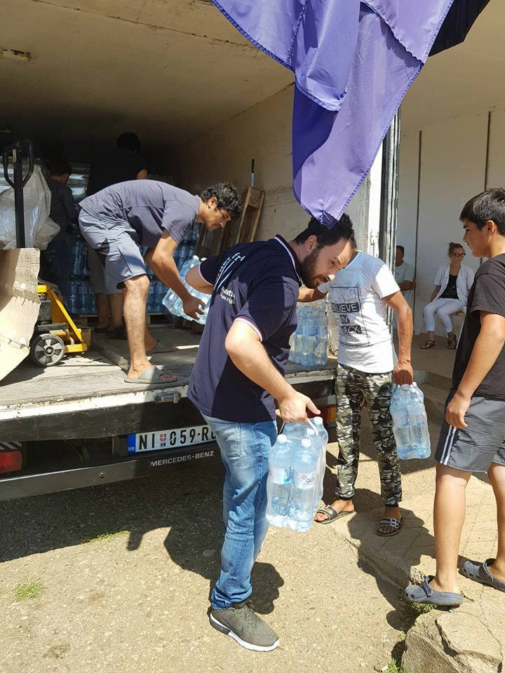
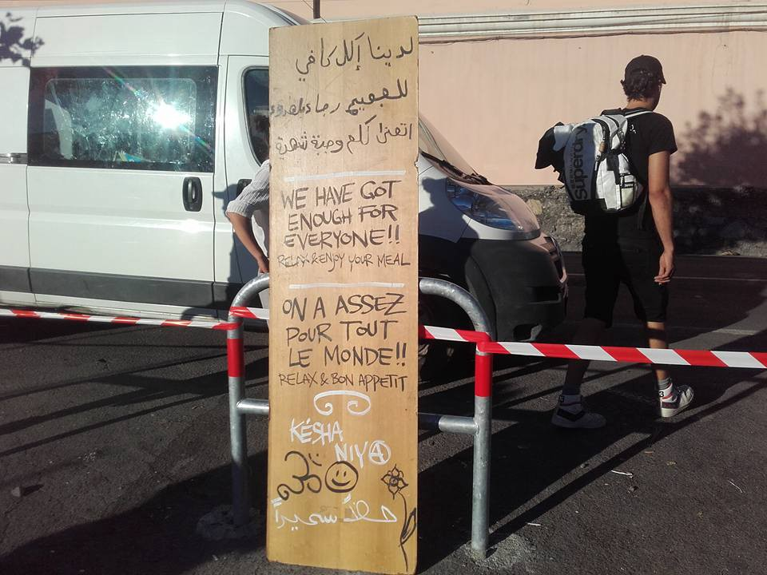
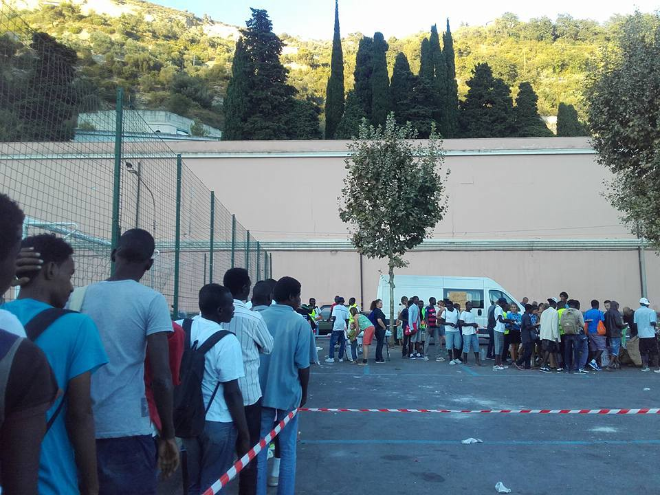
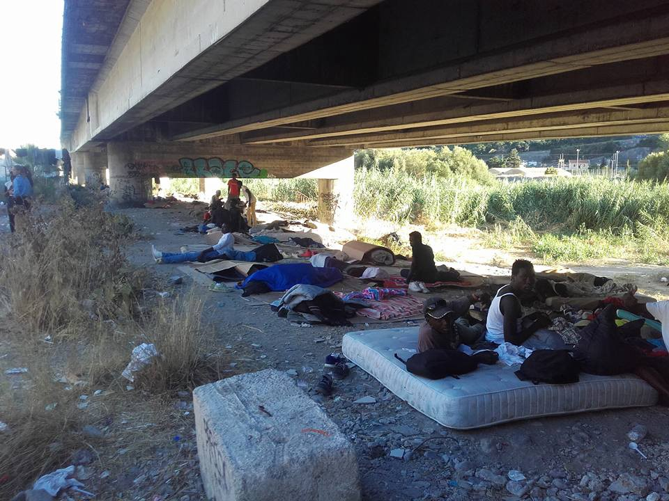
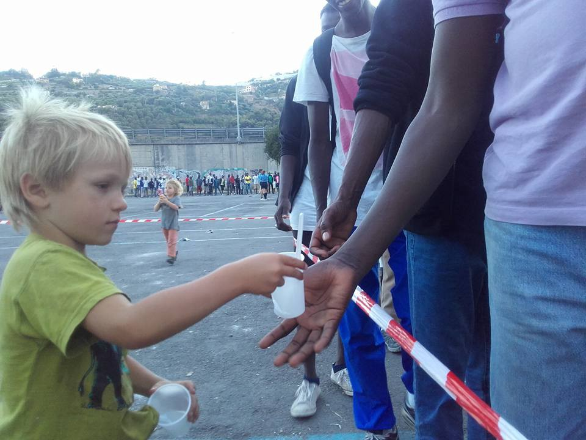
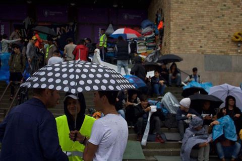
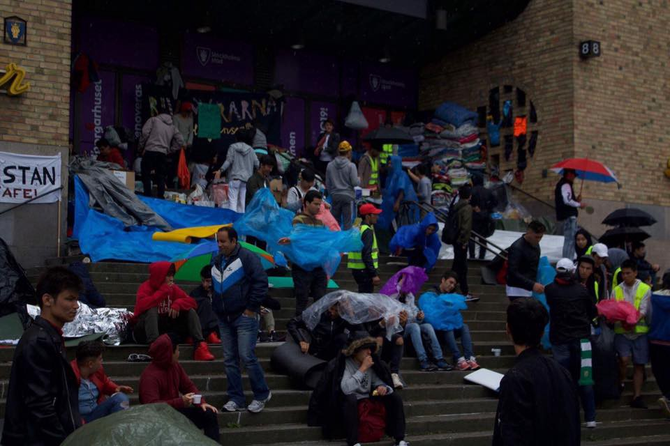

### AYS Daily Digest 13/08/17: Uncertain future NGO activities off Libyan shores

_MSF and Sea Eye suspend activities off Libyan shores / Softex camp officially closed / Increased crossings on the Turkish\-Bulgarian border, police brutality reported / About 800 refugees stuck at the Italian\-French border in Ventimiglia / Refugee center in Bari “damages the image of the municipality” / And more news…_

■■■■■■■■■■■■■■ 
> **[MSF Sea](https://twitter.com/MSF_Sea) @ Twitter Says:** 

> > In 2017, 1 in every 36 #people crossing the Med has died. This will only get worse as obstacles for NGOs cause life-threatening gaps at sea. https://t.co/Zu3xvc1ful 

> **Tweeted at [2017-08-12 16:06:38](https://twitter.com/msf_sea/status/896402555466641409).** 

■■■■■■■■■■■■■■ 

#### MSF temporarily suspends activities off Libyan shores

The NGO has communicated it, highlighting that the suspension follows a\) Libya’s decision to establish a SAR zone, “limiting the access of the NGOs in international waters”, and b\) a “security risk” signaled by Mrcc “due to threats from the Libyan coast guard”\. Hence, Prudence will not lead the activities, while “MSF’s medical team will keep providing support on Sos Mediterranee’s ship Aquarius”, ansa [reports](http://www.ansa.it/sito/notizie/cronaca/2017/08/12/migranti-msf-lascia-restiamo-contrari-a-codice-perche-blindano-il-mare_12c33b8f-87bc-4a70-be3f-08614a0ce1ac.html) \.

On Thursday, 10 August, the Libyan authorities expressed their intention to establish a search and rescue area \(SAR\), thereby restricting access to international waters off Libya to all foreign vessels, including humanitarian vessels\. If this announcement was implemented, it could severely restrict the rescue activities of NGOs in the Mediterranean\. For the time being, search and rescue organizations have not received official confirmation from the Libyan authorities\.

Loris De Filippi, president of MSF Italy, stated in an interview for Repubblica: “The recent developments in the Mediterranean Sea show that the conduct code is part of a bigger picture, intended to seal the Libyan coast and trap the migrants and the refugees in Libya, casting the key away\. These actions indeed prove the real ambition of the Italian and European authorities: to limit the activity of the SAR independent operators, focusing all the efforts in leading the people back to Libya\. For these reasons, MSF sticks to its belief not to sign the code\. Sos Mediterranee has signed it, and now we are discussing about a partnership with them\. At the moment, ship Aquarius, co\-managed by MSF, is navigating in international waters, where it keeps patrolling and leading SAR activities”\.
#### Sea Eye is also pulling out of their operations

due to safety concerns after threats of Libya against NGOs, BR [reports](http://www.br.de/nachrichten/oberpfalz/inhalt/sea-eye-rettungsaktionen-mittelmeer-zwangsstopp-100.html) \. They say they can’t guarantee for the safety of their crews any more and will analyse, observe the situation and discuss further proceedings\. Their two ships are in Malta and Tunisian ports right now\.

[SOS MEDITERRANEE France](https://www.facebook.com/sosmedfrance/?hc_ref=ARRFnU_kIpdU41Dhg_QXLrqhxyuBGbOGLqxgnUDAJKoz5f3c9IOVbhmy9cadN_G8ZKQ&fref=nf) reported the Aquarius boat continues its search and rescue activities while monitoring recent developments in the Mediterranean\.

Almost 600,000 migrants have arrived in Italy over the past four years, the vast majority setting sail from Libya in flimsy vessels operated by people smugglers\. More than 13,000 migrants have died trying to make the crossing\. Charity boats have played a growing role in rescues, picking up more than a third of all migrants brought ashore so far this year against less than 1% in 2014\.

> “We leave behind a deadly gap in the Mediterranean,” Sea Eye founder Michael Buschheuer [warned](https://www.rte.ie/news/2017/0813/897037-migrants-ship/) \. 

#### GREECE

Softex camp was officially closed last night by the authorities\.
#### Lesvos

Volunteers are needed to join the North shore response group as part of the daily boat spotting/day and night watch/coast support team\. All volunteers must be over 21\. The watch runs 24 hours a day and shifts are set according to immediate need and changes in situation or weather conditions\. Volunteers work in pairs and on a shift rotation system\. Volunteers will be fully briefed and inducted before going on their first spotting shift\.

Find more information and other ways to help [here](https://www.facebook.com/thekempsons/posts/1640279102886663?fref=gc&hc_location=ufi) \.
#### SERBIA

Borderfree Association reported from Pirot camp:

> Pirot is a small commune with a population of 38'432\. People seem to be rather poor, but have welcomed the 153 refugees from Afghanistan, Iraq and Syria who are living in a former camp for Croatian and Bosnian refugees\. We arrive with a tank full of drinking water, and everyone is happy and thankful\. Water is undrinkable here, it’s cloudy\. Also canalization does not work well\. They are waiting for EU money to fix this problem\. Our truck empties quickly, the water bottles will last for 18 days\. It’s 35°C also no shade, no activities during the day, almost no hope\. The camp leader asks us for further support, especially with water\. They also lack a storage building, which is necessary since they will soon receive firewood which needs to stay dray\. 

](assets/8412ad558266/1*paK-wMTeOkCzmB4y06C75A.jpeg)

[**Borderfree Association**](https://www.facebook.com/borderfreeassociation/?hc_ref=ARSEWi3hPUkDjssOnQ1Dr42ffRZqsyFWAJdIwEy07nAq1jyw2mSSEU7cjewPKGl3AZY)
#### BULGARIA

Three Afghans and five Syrians crossing the Turkish\-Bulgarian border have said they have been beaten and robbed by Bulgarian policeme, Bulgarian dnevnik [reports](http://www.dnevnik.bg/bulgaria/2017/08/12/3023295_afganistanci_i_siriici_se_oplakaha_ot_poboi_i_grabej/) \. During the interrogation, the men said that two days earlier they managed to enter Bulgaria, when the police officers found them they beat them, took their mobile phones, their money and, despite their injuries, returned them to Turkey\. They were hiding all day in the woods when the Turkish border police encountered them\. According to data from the local police, another 12 people were captured last night — 9 from Syria, 2 from Pakistan and 1 from Afghanistan\. Among them, 5 Syrians reported that they were also beaten and robbed by Bulgarian border guards\. They are now treated at the state hospital in Pannarisar\.
#### GERMANY

A court in Germany convicted three Syrian men aged 24, 27 and 34 over the drowning of 13 migrants off the Aegean island of Leros in September 2015, ekathimerini [reports](http://www.ekathimerini.com/220855/article/ekathimerini/news/court-convicts-three-syrians-over-fatal-aegean-boat-trip) , handing a four\-year prison sentence to the 27\-year\-old, a two\-and\-a\-half\-year term to the 24\-year\-old and a suspended two\-year sentence to the 34\-year\-old\. They were found guilty of “professional smuggling of people resulting in death\.” In that crossing from Turkey nearly two years ago, the smuggling boat struck a freighter, resulting in the deaths of 13 of the 46 people that had been aboard\. All three defendants had come to Germany as refugees on the same journey\.
#### ITALY

There are about 800 refugees stuck at the Italian\-French border in Ventimiglia, and are being cared for every day by civilian society\. Elderly and young volunteers from Royal Valley, France, England, Bremen, Germany, Boy\-Scouts from from Roma and even some Austrians\.

Local volunteer photos
#### Ventimiglia

The church of Sant’Antonio alle Gianchette was the primary point of referral for the thousands of migrants in Ventimiglia hoping to cross the border to France\. They were welcomed without any financial support from authorities\. From Monday, 14th August on, the Prefecture has ordered the closure\. The guests will be transferred in the camp of the Red Cross\. Read more [here](https://www.ilfattoquotidiano.it/.../ventimiglia.../3789831/) \(in Italian\) \.
#### Bari

The presence of the identification and expulsion center in Bari damages the image of the municipality, “as a consequence of the inhumane and degrading treatments practiced to the detained people” in the Cie, so the first civil section of Bari Court has justified its condemning of the Presidency of the Council and Ministry of the Interiors to pay a compensation of 30,000 euro, [writes](http://bari.repubblica.it/cronaca/2017/08/11/news/bari_cie_danneggia_l_immagine_della_citta_-172837185/?ref=RHPPLF-BH-I0-C8-P3-S2.4-T1) R\.it\. The motivation goes on: “Bari Cie does not result adequate to the assistance of the foreigner and of its dignity as a human being\. The compensation is necessary for the enormous damage caused to all the territorial community, which always proved open to hospitality, given the management choices of the state administration\. This latter has been inert in front of the numerous calls about the conditions of the migrants in the Cie, and in front of the requests of verification of the hygienic and health conditions of the centre”\. Moreover, according to the condemnation, “the damage to the image is justified by the historically proven normal identification of places where violations of human rights occur and the location hosting them”\. The judge points out some examples: “We should think of Auschwitz, place recalling everybody immediately the concentration camps symbol of the holocaust, and not for sure the small town in the nearby\. But let’s think of Guantanamo, of Alcatraz: instinctively, the thought runs only to the famous places of maximum security imprisonment, and not of the naval base on Cuba island where the place is, nor to the island in San Francisco bay where the jail was located”\. Even in Italy there are examples, like Lampedusa, whose name — the judge states quoting a previous decree dated 3–9 January 2014 — “nowadays evokes immediately more the “part”, meaning the migrants camp hosted on it \(along with the repetitive and dramatic landings of migrants from the sea, and with the mourning or scandalous facts happened and happening there\) than “the whole”, meaning the island in the Mediterranean Sea”\. The centre is now closed\. Moreover, the attorneys requested a compensation for the “violation of human rights within the Cie”, but even on this, the judge deeming the request should have been made by the people constrained in the Cie\.
#### FRANCE 
Paris vs\. Calais

Care4Calais compared some issues refugees are facing in Paris and Calais\. A recent estimate put 1,000 refugees sleeping rough in Paris \(outside of the official centre\) so for the first time in a while the numbers are comparable, they wrote\.

> \- conditions are dire; in both places there is no reliable food supply; people can’t wash and skin disease is rife; there is even a shortage of drinking water
 

> \- access to medical and dental help is sadly lacking despite the best efforts of aid agencies who are overwhelmed 

> What’s different?
 

> \- most refugees in Calais have gravitated there in desperate hope to reach the UK\. The most common reason we hear is close relatives living here, and then other links such as having worked with the British army, or being an English teacher in another land
 

> \- as a broad generality most refugees in Paris are hoping to claim asylum in France\. They queue for days to get access to the official centre where they hope they may be able to apply; however the reality is that many get rejected 

> Current priorities in Paris are: 

> 🔹Food for snack packs \(dried fruit and nuts, cereal bars, tinned fruit and fish with pull tops etc\.; things that don’t need cooking for those living on the street\) 

> 🔹Sleeping bags 

> 🔹Blankets 

> 🔹Waterproof coats and ponchos 

> 🔹Men’s underwear/boxers 

> 🔹Socks 

> 🔹Tee shirts 

> 🔹Waterproof walking boots 

> 🔹Dictionaries, French to Pashto, Farsi etc 

#### SWEDEN

People are continuing to gather in Stockholm despite the rain, in support of refugees many of whom are sleeping on the streets while applications of over half of the Afghan refugees seeking asylum in Sweden are denied\. Volunteers are coordinating different forms of help\.

AYS volunteer photos

> **_We strive to echo correct news from the ground, through collaboration and fairness, so let us know if something you read here is not right\._** 

> **_Anything you want to share — contact us on Facebook or write to: areyousyrious@gmail\.com_** 

_Converted [Medium Post](https://areyousyrious.medium.com/ays-daily-digest-13-8-2017-uncertain-future-ngo-activities-off-libyan-shores-8412ad558266) by [ZMediumToMarkdown](https://github.com/ZhgChgLi/ZMediumToMarkdown)._
