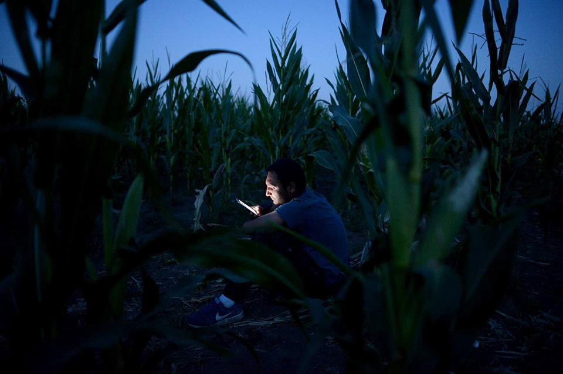
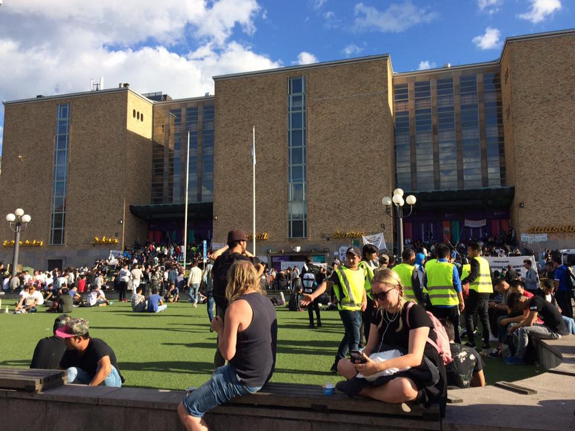

### AYS Daily Digest 15/08/17: Intimidation at Pro Activa boat by Libya

_Pro Activa boat intercepted and forced towards the Libyan coast / MOAS rescues 111 people / Turkey reinstates neighbourhood guard system / Report on a refugee camp near Sombor, Serbia / 700 people are sleeping rough out in the rain in Paris / Stockholm sit\-in still strong after a week / And more news…_

Photo by No Name Kitchen, taken in Serbia
#### Intimidation at Pro Activa boat by Libya

The “Golfo Azzurro” boat of the Catalan NGO Proactiva Open Arms was heading to a northern Mediterranean port on Tuesday, probably Malta, after an alleged Libya Coast Guard boat intercepted it and forced it to follow it towards the Libyan coast, although later it ordered it to turn back\. The information has been provided by Luigi Manconi, president of the Italian parliamentary committee for human rights, who received a call directly from the ship, ElPeriodico [reports](http://www.elperiodico.com/es/internacional/20170815/a-6225436) \. Manconi reported that, 25 miles from Libya, “a ship without identification but bearing the number 654 and whose crew wielded weapons forced the ‘Golfo Azzurro’ to follow it\.” According to Manconi “Libyans may not act at such a distance from the coast, so this is totally illegal\.”

The episode occurred at about 5:30 pm on Tuesday, they [write](http://www.elperiodico.com/es/internacional/20170815/a-6225436) , exactly 27\.3 miles off the coast of Sabrata \(Libya\) \. The “Golfo Azzurro” was in international waters, although within the SAR area\. The newspaper ‘La Repubblica’, which has spoken with the crew of the ‘Golfo Azzurro’, explains that the boat “refused to comply with the order” and entered the SAR area\. “We have not been shot at, but they stopped us,” said Riccardo Gatti, chief of operations for the Golfo Azzurro, who added that the Libyans asked if they had authorization, to which they replied that they had it from the Italian government\. The Libyans kept them hostage for an hour and 40 minutes and then forced them to follow them, according to their account\. “We refused and they threatened to kill us if we return,” Gatti explained\. According to Manconi, “it would be a deterrent operation” to an NGO which has signed the code of conduct drawn up by the Italian Ministry of Interior, which would imply that “in those waters, the ships of the NGOs are in danger “\. Even so, “Proactiva Open Arms does not intend to suspend its operations,” said its spokeswoman, Laura Lanuza\.

Italy has seen a sharp fall in the number of migrants arriving on its shores, Italian The Local [reports](https://www.thelocal.it/20170815/reduction-in-new-sea-arrivals-leaves-experts-guessing-why) \. 13,500 have arrived in Italy since July 1, compared to 30,500 over the same period in 2016 — a year\-on\-year fall of more than 55 percent\.

A new code of conduct to be imposed on organizations rescuing migrants and refugees from the Mediterranean Sea could restrict their life\-saving work and result in more deaths, [United Nations expert Agnes Callamard has warned](http://www.ohchr.org/EN/NewsEvents/Pages/DisplayNews.aspx?NewsID=21971&LangID=E) \.

“Through this new code of conduct, Italy and the European Commission are imposing procedures that could reduce the ability of NGOs to carry out life\-saving activities\. This could lead to more deaths at sea, and the resulting loss of lives, being foreseeable and preventable, would constitute a violation of Italy’s human rights obligations,” she said\.
#### SEA

One of the rescuers still at sea, MOAS, continues their mission\. Today they saved no fewer than 111 children, women & men\.

■■■■■■■■■■■■■■ 
> **[MOAS](https://twitter.com/moas_eu) @ Twitter Says:** 

> > 111 children, women &amp; men now safely aboard the #Phoenix; post-rescue care underway to ensure all are healthy #NoOneDeservestoDieatSea https://t.co/sVWr0Gswp9 

> **Tweeted at [2017-08-15 08:23:38](https://twitter.com/moas_eu/status/897373203194159104).** 

■■■■■■■■■■■■■■ 

At a time when harassment of NGOs is escalating and work in the SAR area becoming more difficult, Maydayterraneo is looking to start their rescue mission in September\. In agreement with the German organization LIFELINE and SEAWATCH which allowed them to charter Seawatch 2 as a ship for their project, they said that it is their intention to make the mission operational as soon as possible, naming the date of September 15 as the starting point of the mission\. We wish them the best of luck\.

**](assets/b5ab1f0ea158/1*A1qRw6xGGEurRAtp6f9yPA.jpeg)

Photo by **[Maydayterraneo — Proyecto AitaMari](https://www.facebook.com/MAYDAYTERRANEO/?ref=gs&hc_ref=ARR_TaSlBhna0SSt8SiIB2FmHnMgz5Wc3Yx9gva8ZRvE3_Qtdpnqd7wyPibZQOeSIK4&fref=gs&hc_location=group_member_profile)**
#### GREECE
#### Samos

One refugee boat arrived on Samos last night carrying 24 men, 13 women & 20 children on board\.
#### Athens

The Khora community in Athens \(Asklipiou 80\) is looking for music teachers\. They have lately been giving regular guitar, piano, and violin lessons, and have many students who are eager to continue taking one\-on\-one lessons on these instruments\. In addition, if there is anyone who wants to present a workshop for children or adults, on any kind of music, they are always open to hosting and facilitating such an event\. Finally, they are looking for partners who can give classes on non\-western European instruments\. If you know of anyone who is interested in sharing their musical talents, [contact Ryan here](https://www.facebook.com/ryan.faulkner.14?hc_ref=ARQj9-Gk-I30CtOao01iMBlqWstQl_ajGFnIZfiBDF_tWJVEkRba7iMqPJXVWFAYQp4&fref=nf) \.
#### Lavrion

Immediate need for food and amenities for [r](https://twitter.com/hashtag/refugeesGR?src=hash) efugees:

> Food: legumes, rice, tomato sauces, olive/vegetable oil, salt, pepper, sugar, milk, baby milk, evaporated milk, bread or pitta, flour, crackers, fruitcreams and creams \(for babies\), eggs\.
 

> Amenities: diapers \(no 3–4–5\), baby wipes, sanitary napkins, toilet rolls, soap, bleach, rubbish bags, painkillers for kids and adults, antibiotics for kids, ethanol, betadine\. 

You can bring the needed items to the Centre for Asylum seekers, Dounakara 1, Lavrio, Kurdish Cultural Centre, Aristotelous 187, Athens or Allos Anthropos, Plataion 55, Kerameikos\.
#### SERBIA

NoBorders wrote a [report](https://belgradeupdates.noblogs.org/post/2017/08/15/03-08-2017-current-situation-in-sombor-tc-rising-tense/) about the current situation in the fringe area of the Serbian town Sombor, where a temporary refugee camp \(transit Centre\) is situated\. Generally people are being intimidated to prevent them leaving the camp after 7pm by some xenophobic locals, who are “patrolling” the street leading to the city, forcing people to go “back to the camp”, insulting, pushing and manhandling them\. Physical and verbal attacks during nighttime on people sleeping outside the camp are increasing and getting more and more brutal\. The Centre’s leadership does not feel responsible and does not want to interfere, warning the migrants that they should not leave the camp, especially during the night\. The police also sends people away when try to report attacks\. Every day from morning until 5pm there are some doctors available in the camp who, however, only provide painkillers and are not equipped for serious cases of injuries or sicknesses\. The full report is available [here](https://belgradeupdates.noblogs.org/post/2017/08/15/03-08-2017-current-situation-in-sombor-tc-rising-tense/) \.
#### Pushbacks

UNHCR and partners received reports of 122 recorded collective pushbacks from Hungary, and 102 from Croatia, with many alleging they had been denied access to asylum procedures\. Reports of three pushbacks from Romania were also received\.

[TruckShop](https://www.facebook.com/mobileclothesproject/) is setting up in Serbia and almost ready to start distribution\. If you are over 21 and able to come for 2 weeks or more contact them at volunteer@freedomofchoiceproject\.org

**](assets/b5ab1f0ea158/1*rcYHKfL7Vfb3y2dF6EcSWQ.jpeg)

Photo by **[TruckShop](https://www.facebook.com/mobileclothesproject/)**
#### GERMANY

Countries such as the Czech Republic, Hungary, Poland and Slovakia have been refusing to fulfill obligatory EU quotas of refugee intake, leaving Greece and Italy to bear the burden\. While Merkel’s opponent in the coming elections, SPD’s Martin Schulz, has called for a harder EU line, including cuts in EU funds for these countries, Merkel [told the media](https://euobserver.com/news-de/138737) yesterday that she wants to continue negotiations instead of imposing sanctions, calling the disagreement on the distribution of refugees regrettable\.
#### FRANCE

About 700 people are sleeping rough out in the rain in Paris\. With the exception of 10 toilets near the day reception of the Catholic Relief and a tap, the state has not yet set up a minimum humanitarian facility \(access to water, toilets, showers\), [L’Auberge des Migrants](https://www.facebook.com/LAuberge-des-Migrants-358496450338/) writes\. The prefect, they say, also wants to limit food distribution to only one location, far from the city centre, where there are already too many people and too much tension related to the catastrophic life conditions\. Two buses, one on Thursday and the other on Friday, took 66 people to the reception centre\. Yesterday, the office responsible for informing migrants about these departures was closed\.
#### SWEDEN

The sit\-in in Stockholm to stop deportations to Afghanistan has now been ongoing for over a week\. We have been following it since the beginning and you can now read more on what is happening in our latest [report](ays-special-getting-asylum-feels-like-a-gamble-for-young-afghans-in-sweden-5d3d54f272b1) \.

The protest will move out to the schools, Blankspot project writes\. The main area will continue to be Medborgarplatsen, but the students will stay in school\. On breaks they will sit down united on floors across the country\. This was announced by Fatemeh Khavari at a press conference on Tuesday afternoon\. How long this protest will go on depends on politicians and the Migration Agency\. They are the ones that have to give answers, she said\. This second step, according to the protesters, will be even bigger than the first one\. Together we will become one of the biggest demonstrations in modern times, Khavari continued, referring to the large number of Afghan youths in Sweden and the large number of people supporting them\.

Photo by AYS volunteer

**UK**
#### Manchester

[Refugees at Home](https://www.facebook.com/refugeesathome/?ref=gs&hc_ref=ART81fRYxeVBSQOV98yvR3uvXY5Z-BvN8d0uFCGhPeMo3e1XOUA2l7nDqL9hyTbZKos&fref=gs&hc_location=group_member_profile) need your help with accommodation\. Contact them if you or someone you know is willing and able to provide a place for them to stay\.

> _4 people need hosts:_ 
 

> \- F, a 30\-year\-old Syrian refugee with a literature degree from Aleppo University, waiting for family reunion \(it usually takes 2–3 months\) after which they will get some help from the council
 

> \- MA, a football\-mad Sudanese man trying to get into university, who needs some stability for a few months so he can make it happen
 

> \- A, a young Iranian gay refugee who wants to stay in what he knows is a friendly city while he can restart his life
 

> \- N, a woman we have hosted for a few weeks as she prepares her appeal\. She likes her hosts, but is horribly allergic to her current hosts’ cats \- despite prescribed antihistamines \- so we’d love to be able to move her to somewhere where she won’t be miserable 

> **_We strive to echo correct news from the ground, through collaboration and fairness, so let us know if something you read here is not right\._** 

> **_Anything you want to share — contact us on Facebook or write to:areyousyrious@gmail\.com_** 

_Converted [Medium Post](https://areyousyrious.medium.com/ays-daily-digest-15-8-2017-intimidation-at-pro-activa-boat-by-libya-b5ab1f0ea158) by [ZMediumToMarkdown](https://github.com/ZhgChgLi/ZMediumToMarkdown)._
