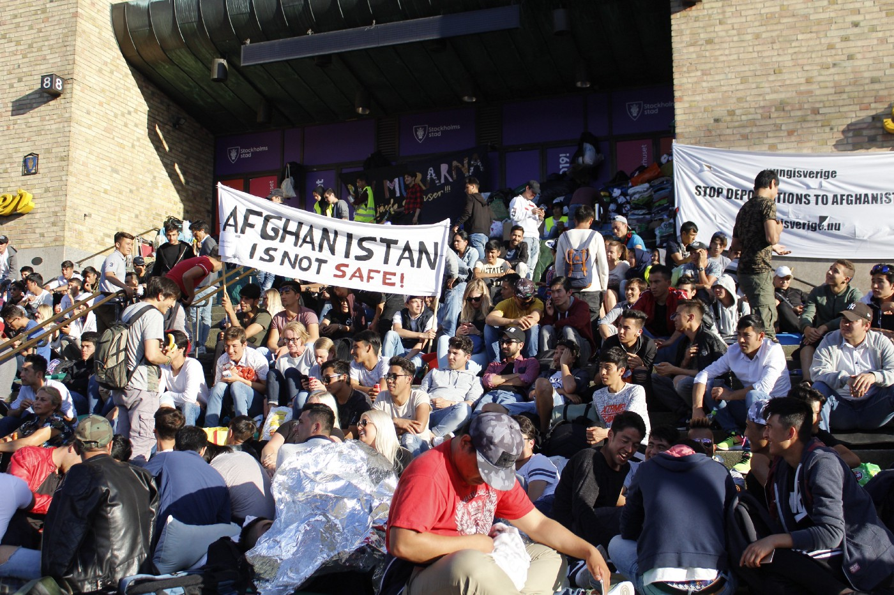
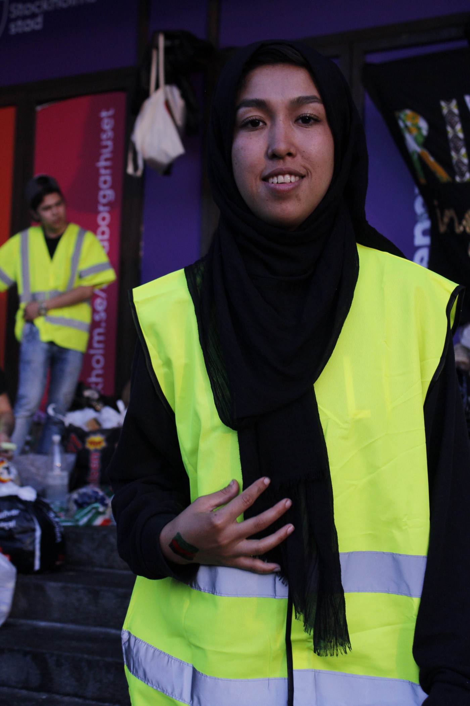
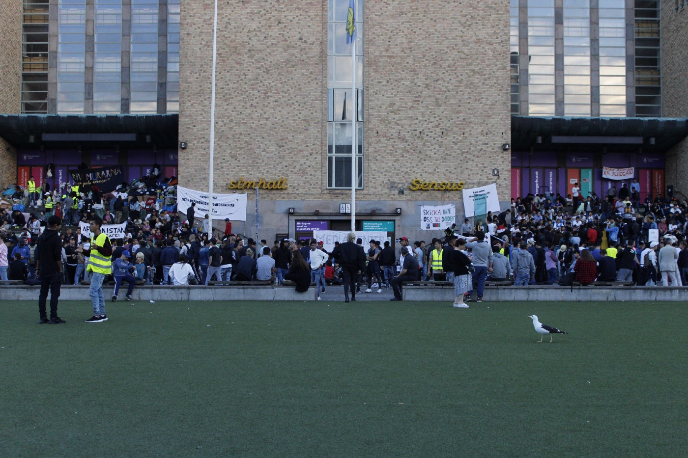
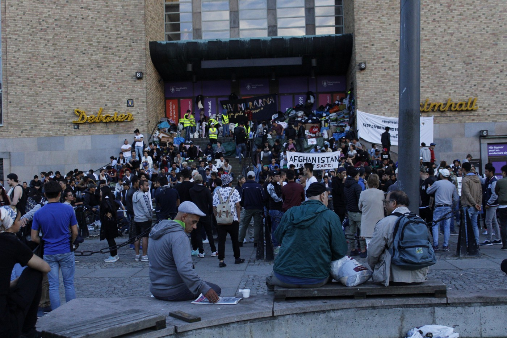
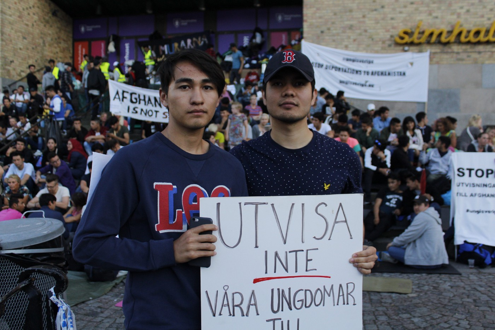
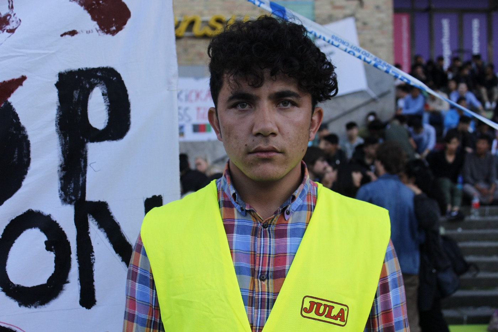
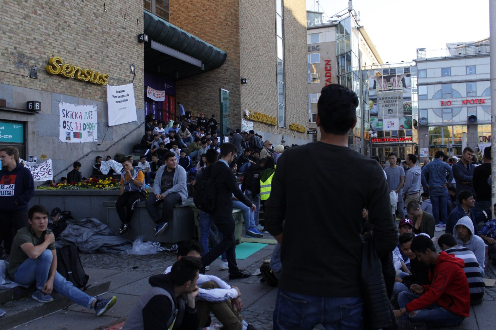
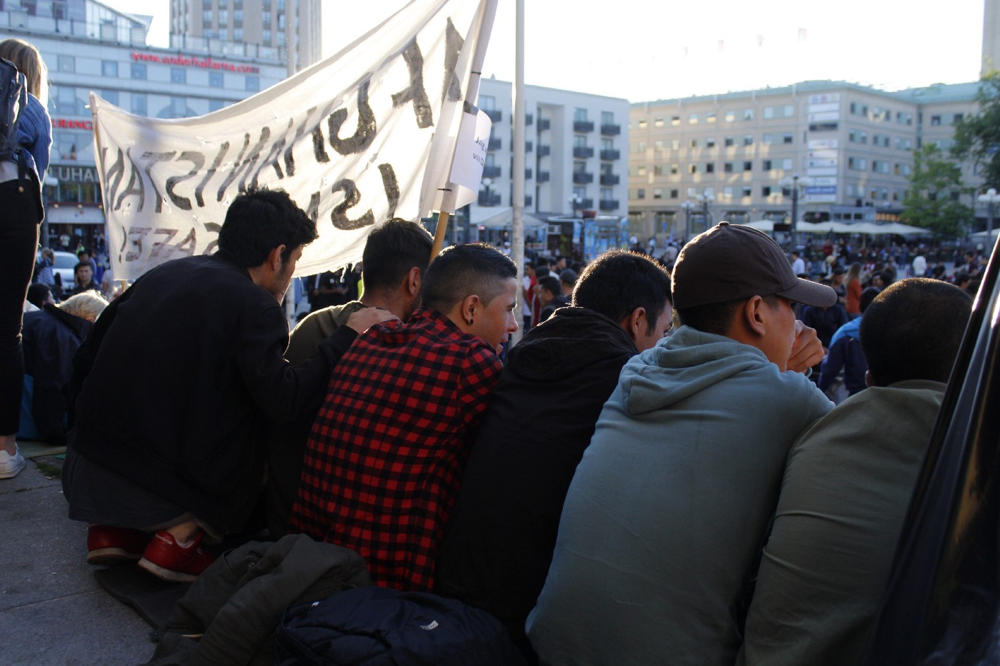
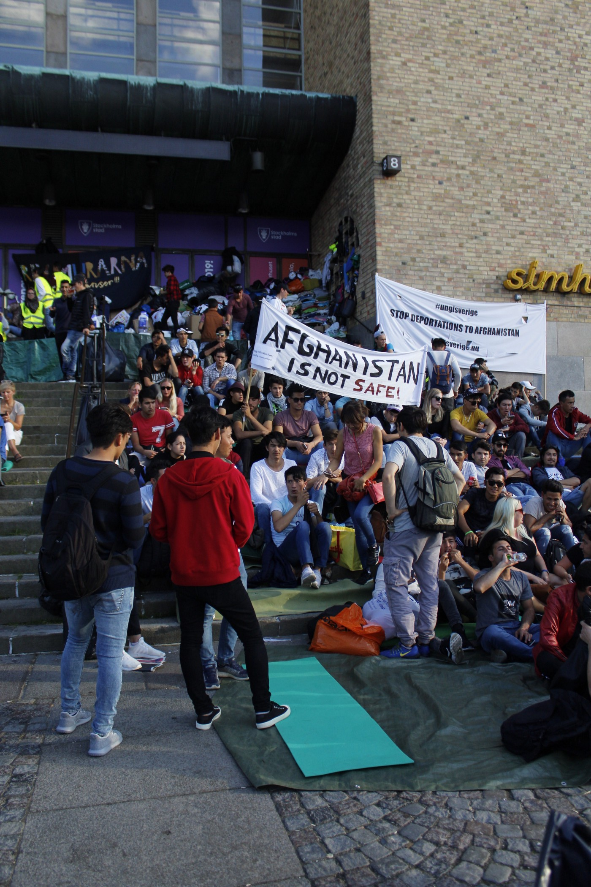
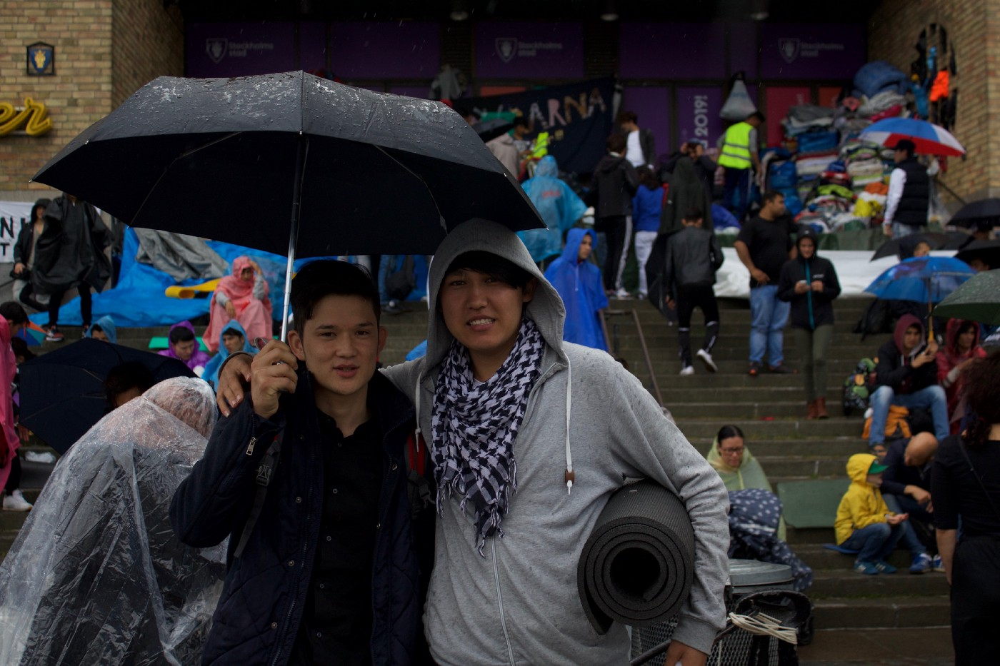

### AYS SPECIAL: Getting asylum feels like a gamble for young Afghans in Sweden

_The sit\-in in Stockholm to stop deportations to Afghanistan has now been ongoing for over a week\. The youths are determined: they will stay until there is a change\. Still the head of the Migration Agency has not visited them\. Instead, he has written a letter saying that he and Sweden cannot grant their wishes\. But they are not despondent; rather, they are more united\. AYS is in Stockholm and we bring you a special report\._

Photo by AYS

Photo by AYS

Sara Ahmadi has been protesting, together with several hundreds people, every day for over a week in the capital city of Sweden\. She arrived in this country in the summer of 2015, after a long and difficult journey\. Since then, she has been waiting for a reply to her asylum application\. Still no answer, and in three months she will turn 18\. The thought of being returned or forced to flee again is not pleasant, but that is what she is afraid of\. She closes her eyes, nodding her head while we talk to her at the Medborgarplatsen square\. Behind her there is plenty of food and there are sleeping bags pulled up against the purple wall behind her\.

“It took me three weeks to get here\. I was all alone and it was terribly hard,” she says\.

Now she sleeps in Medborgarplatsen and has been doing so for several nights\. Usually she lives in Linköping, a small town a couple of hours away from Stockholm\. She is one of many that have joined in from other places\.

Sara Ahmadi arrived in Sweden as a single minor two years ago\. Soon she will be 18 and still has no anwers about her asylum claim\. Photo AYS\.
#### The citizen’s place

It has been over a week since the protests started in Stockholm and every day more and more people are joining in\.

The protests were organized by young Aghans through the fb\-page and initiative [Ung i Sverige](https://www.facebook.com/ungisverige.nu/?ref=br_rs) \. Fatemeh Khavari was among the initiators and she was choosen to represent the group in the public\. The protesters, in the begining only young Afghans, decided to do this faced with the uncertain situation and as their final and desperate attempt to demand a change, [as we have written before](ays-daily-digest-08-08-17-afghan-youths-in-sweden-have-had-enough-of-the-deportations-192aac4fa6be) \.

The protest started at Mynttorget square, right next to the Parliament and Castle in Stockholm, last Sunday\. The peaceful demonstration moved after only a few days, both for security reasons and since it had gotten to big\. The new square, Medborgarplatsen, has in a way now became exactly what its name means if translated straight from Swedish — the citiziens’ place\.

The night before they changed the location, young neo\-nazis from Nordisk Ungdom attacked the gathering\. They threw smoke grenades and at least two people had to be taken to hospital\. But, contrary to what they hoped for, since then support for the protest and the number of participants has increased rather than decreased\. Local NGOs have been supportive on the ground, while locals are also sitting down or just stopping by for a while\.

Fatemeh Khavari wrote a letter from [Ung i Sverige](https://www.facebook.com/ungisverige.nu/?hc_ref=ARRgUsee5ZmCF4DBSTL0uKaOdgYQ3iAm8Uhf8G1208myAMtP-LO8hL89n3yv29vFe9g&fref=nf) to Mikael Ribbenvik, the head of the Migration Agency and the person they demand to meet with\. In the email she invited him to talk and again said that Afghanistan isn’t safe, and that the deportations must stop\. After several days, Ribbenvik replied saying that their wishes cannot be met, referring to a conversation he had had earlier this summer with Fatemeh Khavari\.

Ironically, he wrote that he respects the dedication of the protesters and understands their frustration\.

> “I do understand that this is an important and emotional issue\. The difference between being young in Afghanistan and Sweden is huge\. Those kinds of things are touching, and especially when you know people in person that have gotten decisions about expulsions\. But the rules concerning asylum don’t take that into consideration, they are based on the criteria that is in the legislation regarding protection and asylum\.” 

When AYS previously spoke to the Migration Agency this week, they could not say anything more than what is in the letter\. The answer about not wanting to meet with Fathame Khavari and her friends was rather unsatisfactory, since it is possible to meet people more than once\.

“Mikael Ribbenvik has actually already met with her, about one month ago,” their press contact said\.

Medborgarplatsen in the southern district of Stockholm is a big open square, of the more commercial kind\. Photo: AYS
#### **Different situations, same demands**

Even though the sit\-in is a new event, the frustration, anger and distress that have caused it are not\. They have been building up over the last couple of years\. In 2015 alone, more than 36,000 unaccompanied minors arrived in Sweden, and as of today, 10,600 are still waiting for answers regarding their asylum claims\.

The mental pressure is huge\. Many young people are forced to move time after time, since their accommodations are often temporary; from one family to another or in shared accommodation run by the municipalities\. The limbo\-like conditions are also hard for the families taking care of the youths\. There are also horror stories about families that aren’t taking good care of their new family members\. Suicides have been reported more than once and became a media topic at the [beginning of 2017](https://www.svt.se/nyheter/inrikes/krismote-om-sjalvmord-bland-ensamkommande) \. No one knows exactly how many youngsters from Aghanistan have committed suicide so far since the municipalities do not have an obligation to report about this to other bodies\.

[Ensamkommandes förbund](http://ensamkommandesforbund.se) has established a connection between more deportations, stricter asylum laws and increased numbers of suicides and suicide attempts\. [Vi står inte ut men vi slutar aldrig kämpa](https://www.facebook.com/vistarinteut/?ref=br_rs&hc_ref=ARSMP8sVwjGxOJPgA6685p34TRPoeFUGJ7iaL_SThw3LprpNFFmBnWsIlN7B-WDrth0&fref=nf) is also among the organizations that are working most closely on this issue and demanding amnesty and permanent residence permits for unaccompanied minors\.

The protesters are a very diverse group\. They are at different stages of the asylum process and have been granted different kinds of protection\. It is obviously a very important issue for everyone here, and any one of them would be qualified as spokesperson besides Fathame Khavari\.
#### Only smiles and determination

Two young boys, Amin Rasoolzadeh and Amin Eshaghi, both 17, have been friends since before the sit\-in and came to Medborgarplatsen together\. They have been here for several days\. The sun was shining the afternoon we met and spirits were high\. No one on site seems to be angry\. Determined, yes\. Some people are a bit tired, since they have been sleeping under the stars for several days in a row\. But despite that there are only smiles\.

Amin Rasoolzadeh and Amin Eshaghi, with the message “don’t deport our youths” on the sign\. Photo: AYS

Amin Rasoolzadeh says that the process of getting asylum feels like a gamble\. Depending on the case worker or lawyer, the outcome could be different\.

“It all depends on who you meet with, there could be misunderstandings with the translator, or just a strict and rigordous person at the Migration Agency,” he says\.

The gamble has different consequenses\. The most obvious one is the cause of the sit\-in: deportations\. Another one, separating Amin Rasoolzadeh and Amin Eshaghi, is the length of the residence permits\. That is why they no longer attend the same school even though they are good friends\.

“Look, me and Amin \(Rasoolzadeh\) had a plan\. We would continue in the same school and choose the same program in high school,” Amin Eshaghi says\.

But that has not become reality, since they, after each had been waiting for over a year, got different answers\. Both could stay, but Amin Eshaghi’s residence permit was time\-limited and Amin Rasoolzadeh’s was not\.

“I am taking “barn och omsorg” _\(“children and care”, a programme for people who want to become teachers, work with the elderly or as social workers, or want to find jobs that do not demand more education than high school\)_ \. And Amin \(Rasoolzadeh\) is taking the science program,” Amin Eshaghi says\.
#### **The “high school\-law”**

The reason for Amin Eshaghi’s choice not to attend one of the theory\-oriented high schools, with the aim of preparing students for university rather than going straight to less qualified jobs, is a new law from the 1st of June this year\. [It is called “the high school law”, since it affects people attending high school who have time\-limited residence\.](https://www.migrationsverket.se/Om-Migrationsverket/Aktuella-fragor/Gymnasielagen.html)

The legislation, which can temporary stop deportation, says that if someone loses their residence permit when he or she is turns 18 but is still in high school, the person can get to stay\. And if the person, after finishing high school, gets a job within six months of compleing their education, their residence can become permanent\. Of course people will attend high school, which still is not mandatory but just something everyone does anyway in this country\. But then they have to get a job in six months, which is not always easy even for Swedish youths\. It is just not fair\.

“It’s like blackmail,” the boys agree, speaking in unison\.

It is always about strategy\. These young people have to keep things in mind that Swedish teenagers never do\. Mikael Ribbenvik says it himself in the letter: “The difference between being young in Afghanistan and Sweden is huge”\. Still, that acknowlidgment is not enough to make a change\.

“We didn’t choose where to be born,” Amin Rasoolzadeh explains\.

Both Amin and Amin feel as if they need to keep themselves up to date, since small mistakes or wrong choices can mean a flight ticket back\. It is hard to relax, even though that they have “made it” to the north\.
#### **Safety first**

They both think that Sweden needs Afghan youths, since the population is getting older and older\. That is a common argument: people are needed, so stop sending them back to their death\.

“We are coming here mostly for one reason, that we needed safety\. But secondly, we want to contribute\. By first finishing high school, then university and after that getting jobs and paying taxes,” Amin Eshaghi says\.

Politicians and officials from the Migration Agency say that Afghanistan is safe enough, but Amin and Amin disagree\. So does Barak Elham, who thinks politicians here do not understand\.

Barak Elham has been at the sit\-in since day one\. He is still awaiting the decision on his application after more than 1\.5 years\. Photo: AYS

“They say that from here, from their desks and couches\. But why would we have left if we had safety where we were?” Barak Elham says\.

Amin Rasoolzadeh is also doubtful about the Swedish and European approach and views about the safety of his country of origin\.

“It would not be possible for them to get the full picture even if they came to visit\. There is so much more to it than the things people would notice in a couple of days,” Rasoolzadeh says\.
#### **“Coming here is like playing with your life”**

For many people, Sweden is the final destination, not just a stop along the route\. Amin Rasoolzadeh and Amin Eshaghi think that they speak for several other friends when they say that being returned back to Afghanistan would decrease their possibilities of living a normal life\. In his letter, Ribbenvik expresses a different opinion\. According to the authorities in Sweden, and in many other EU countries, parts of the are country still safe enough to live in, even though they admit the situation is becoming worse\.

Amin Rasoolzadeh and Amin Eshaghi both know people who have been forced to return, with various results\.

“There are two main outcomes if someone is returned\. It’s either becoming paperless in nearby countries\. Or becoming a drug addict in Afghanistan,” Amin Eshaghi says\.

Barak Elham is of the same opinion\. According to him, being sent to Afghanistan is to be sent to his death\. People are dying there every day due to violence\. While Barak Elham is serious, dressed in a reflective vest and on a shift making sure people don’t block any paths, Amin Rasoolzadeh and Amin Eshaghi are laughing, even though it is not a joke\. They know it is not and that is why it is funny\.

Something else they point out while looking up the steps is that at least half of the people here have never been in Afghanistan, but were born and raised in Iran or Pakistan\. Most of them are Hazaras, a shia\-muslim minority and in general the most frequently targeted by the Taliban\.

“Many of us are Hazaras, but that doesn’t matter here\. Here all minorities, such as Tadjiks and Pashtoons, can be friends\. In Afghanistan it’s divided,” Amin Rasoolzadeh explains\.
#### **Waiting in the asylum limbo**

The long waiting times can be hard\. Mohammed Reza Hassani is another young Afghan participating\. He looks a bit tired\. But he is fine now, he says\. He hasn’t always been that though, since he is one of the young Afghans who have suffered from mental issues caused by the uncertainty that has been a part of his life since his arrival in 2015\. Now he has a residence permit and is starting to feel better again\.

“It just went on and on in my head\. It was a mess\. I couldn’t sleep and went to school every day anyway,” Mohammed Reza Hassani says\.

Mohammed Reza Hassani looking at his friends\. Photo: AYS

One of the causes of his mental distress was the responsibility he felt for his younger brother\.

“My mum and dad have always said that the big ones should look after the small ones, and when we left I got the responsibility for my younger brother\.”

They were seeking asylum on the same grounds\. Still, his brother, who was only 13 at the time, was granted a permanent residence permit, and Reza Hassani’s application was rejected\. Not only was he facing deportation to Afghanistan, a country he has never visited since he grew up in Iran, he also ran the risk of letting down their parents\.

“If I had been deported, I would have left my brother alone,” he says\.

Luckily, the appeal went well\. They no longer live together, since Mohammed Reza Hassani turned 18 and counts as an adult\. His brother is still a minor, and most minors are placed with families, while adults are living by themselves or in shared accommodations\. No children grow up as fast as those fleeing war\. It only takes one day\.

Waiting in line\. Photo: AYS

Photo by AYS\.
#### **“We will stay and never give up”**

With that in mind, people here won’t give up\. As Fatemeh Khavari told the press at a conference on Friday: They will stay and won’t give up\. There seem to be a conflict of interest: on the one hand the Migration Agency, which is implementing the mission of the government, and on the other hand the young people who have been risking everything to come to Sweden\. One says it’s impossible to let everyone stay, the other that it is impossible to return people to Afghanistan\. Some media and journalists are choosing sides: saying that their demand could easily be met, if only [politicians took responsibility\.](http://aktuelltfokus.se/alex-bengtsson-de-unga-afghanerna-skriver-svensk-historia/) Several other smaller gatherings have also started around the country, as in Luleå this weekend\.

Among politicians, the support and non\-support is divided\. Some have visited, like Rossana Dinamarca from Vänsterpartiet \(leftist party\), Gustav Fridolin from Miljöpartiet \(the Green party\), Gudrun Schyman from Feministiskt initiativ \(feminist party\) and also the new Migration Minister, Heléne Fritzon\. But unfortunately, so far nothing seems to have changed\. Critics of the gathering, known for sometimes being racist, say that going there and showing support only gives rise to [false expectations](https://www.svt.se/opinion/article14793240.svt) \.

But people are still there\. That it rains on some days does not really impact the number of people at Medborgarplatsen\. Two of them, who are there regardless of the unseasonably cold weather that day, are Reza Moradi and Rahim Forghani\. They have a point that goes beyond catching a cold in the rain\.

“We can always stay\. It’s not like we have anything more important to do\.”

Reza Moradi and Rahim Forghani, a rainy Sunday at Medborgarplatsen\. Photo: AYS

_Note: All interviews and conversations are translated from Swedish, since they have all learnt a new language in often less than a year\._

**By: Hanna Strid**

> **_We strive to echo correct news from the ground, through collaboration and fairness, so let us know if something you read here is not right\._** 

> **_Anything you want to share — contact us on Facebook or write to:areyousyrious@gmail\.com_** 

_Converted [Medium Post](https://medium.com/are-you-syrious/ays-special-getting-asylum-feels-like-a-gamble-for-young-afghans-in-sweden-5d3d54f272b1) by [ZMediumToMarkdown](https://github.com/ZhgChgLi/ZMediumToMarkdown)._
