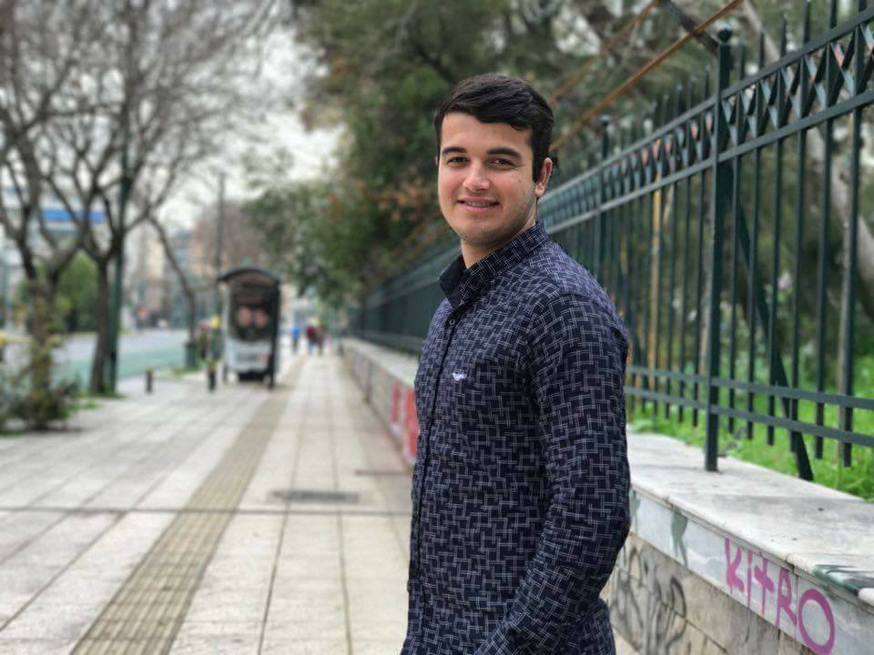
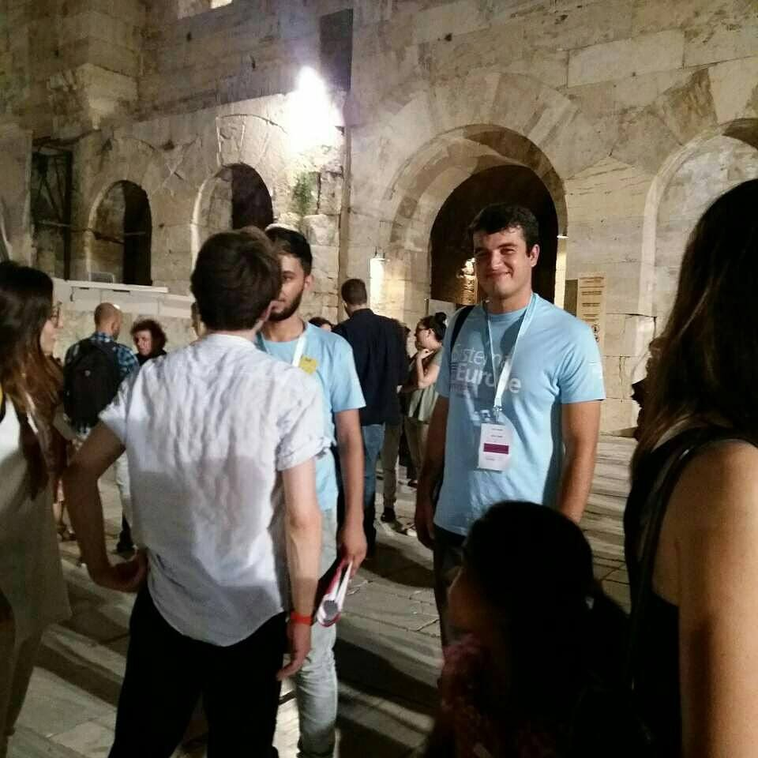

### AYS SPECIAL: “I dream of flying\.”

_Said Azim Karimi \(18\) is from Mazar\-el\-Sharif, Afghanistan, and he dreams of becoming a pilot\. Probably like many boys of his age\. But unlike the dreams of some others, his have been interrupted by closed borders and fortress Europe\._

Photo: Private archive

Said Azim was 17 when he was forced to leave his city together with family — two brothers, a sister, and their mother and father\. _“The trip was dangerous and I did not feel good\. I would never want to do that again\. I am not sure how long it lasted\. We had to walk quite a lot on this journey\. We saw a lot of abandoned bags, people walking on the way\. It was very scary\.”_

The journey took them through Afghanistan, Iran, Turkey and finally to Europe, which for them was a symbol of peace\. Back that time\. They arrived on Samos, the island where they entered Europe, one night by boat\. This part of the trip lasted several hours\. _“For me, that part was not that scary because I like water\. I did not know how very dangerous it is, how deep the water and all that\. When we got into the water, it was dark and I could not see anything\. And, when it got a bit bright, I could see everywhere and the water was so blue and it was amazing for me,”_ Said Azim remembers\.

And then, Europe\. _“When I came to Samos, I thought I had come to a jail\. The camp where we lived for the next nine months was like a jail\. At the beginning, we lived in something like a cabin with 40 or 50 people inside\. After that, they took us to another container and we lived there\. We had to change containers three times because of the situation\. And the situation was fighting, people getting injured, going to jail… and every night like that\.”_

There is one night he remembers well\. _“It was the most difficult night for me\. We were in the cabin when the fighting began in the front\. Inside there were about 40 people\. Suddenly, the cabin caught fire\. It was very dangerous\. We had to get out, but it was impossible because of the fighting in the front\. It was very, very bad\. The worst memory for me\.”_

But despite all this, Said, who walks around with the biggest smile you can imagine, did not want to give up his dream\. The dream he is still dreaming\. An education that will lead him to become a pilot\. _“When I came to Samos, after one month, I decided to start with English lessons\. I had spoken English even before, but not well enough\. Then I started learning Greek\. Besides that, I used to give lessons in drawing for the kids since I had taken drawing lessons for two and a half years back in Afghanistan\. I was doing that to pass the time, but also it made me happy\.”_

Finally, after those nine long months, they were transferred to Athens this winter\. The entire family was placed in the same apartment with four other families\. Each family has one room\. Not even that has taken the smile from Said Azim’s face or discouraged him from pursuing his dream\. _“I tried hard and finally was admitted to Greek school,”_ he remembers\. However, even though he has already graduated from high school in Afghanistan, like many other kids, he did not have the document and he had to go back to high school\. For him, this was the time to improve his Greek, and today he speaks it very well\.

In the meantime, he started going to places where volunteers are teaching him English, and he started taking music lessons — guitar and violin — fulfilling one more dream: to play an instrument\. And finally, on the night of big closing of the annual Hellenic Festival in Athens, he played with a big orchestra with students from El Sistema, a music school that exists in several countries around the world, and recently also in Greece\. Said Azim, after only three months of learning how to play the violin, was invited to play with the orchestra\. And he fitted in perfectly, playing in front of several thousand people in the Odeon Herodotus\.

Photo: Private archive

One dream fulfilled\. The next is to enrol at a university\. However, it is not so easy in Greece\. The Karimi family is still waiting for their second interview in Greece and the final reply to their asylum application\. Said Azim has a chance to get into the Deree Camp to Campus program that will let him audit classes but will not allow him — at least at the very beginning — to start studying\. But he will not give up and will continue looking for other opportunities to start his university education\.

_“I have dreamt about flying ever since I can remember\. The funny thing is that I have flown only once, and that was on the journey from Kabul to Herat, at the Iranian border\. We had to take a flight because the road in that area is very dangerous\. I was feeling very good on that flight and was sitting by the window\._

_My father has pushed me to pursue my dreams all my life and to work hard to fulfill them\. Thanks to him, I have a dream\. He taught me not to give up on whatever I want to be\. And I will just try to be that\. And that is all that I am doing\.”_

Ironically, on the big night in Odeon Herodotus, Said Azim played the Ode to Joy, Ludwig van Beethoven composition which was decades ago adopted as the anthem of the EU\. The same EU that closed its borders to Said Azim and blighted the dreams of many others who were forced to leave their homes and embark on a perilous journey, hoping to reach a place where they can freely dream and fulfill their dreams\. Said Azim has enough strength and willpower to pursue his dream\. He is ready for the world, with his smile and knowledge\.

The borders should be opened to let people like him, and many others, fulfill their dreams, creating a better world for all of us\.

By Nidžara Ahmetašević

> **_We strive to echo correct news from the ground, through collaboration and fairness, so let us know if something you read here is not right\._** 

> **_Anything you want to share — contact us on Facebook or write to:areyousyrious@gmail\.com_** 

_Converted [Medium Post](https://medium.com/are-you-syrious/ays-special-i-dream-of-flying-a9095492f58a) by [ZMediumToMarkdown](https://github.com/ZhgChgLi/ZMediumToMarkdown)._
